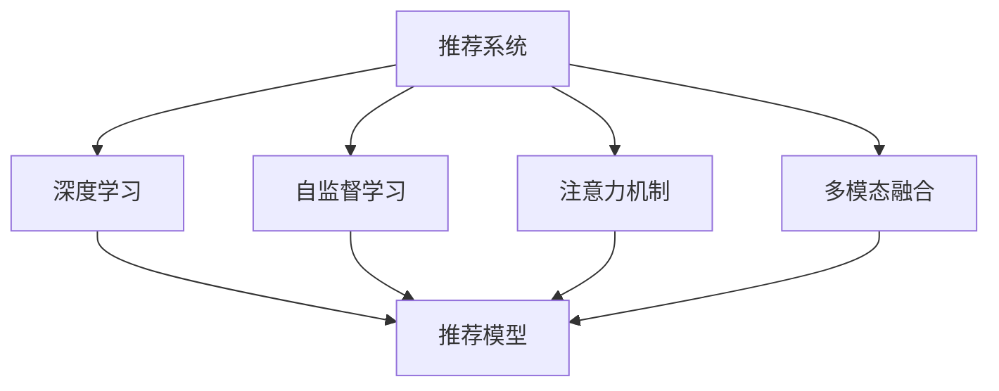

                 

# 利用大模型提升推荐系统的抗噪声能力

> 关键词：推荐系统, 抗噪声能力, 大模型, 注意力机制, 深度学习, 自监督学习, 用户画像, 模型融合

## 1. 背景介绍

### 1.1 问题由来

随着互联网的迅猛发展，在线推荐系统（Recommendation System, RS）在电子商务、内容分发、社交网络等领域的应用越来越广泛。传统的基于协同过滤的推荐方法在数据稀疏和冷启动问题上难以处理，使得个性化推荐系统的准确性和鲁棒性受到限制。近年来，基于深度学习的推荐模型，特别是使用大模型（如Transformer）进行推荐，取得了显著进展。但面对噪声数据和随机事件，推荐系统的表现仍然不理想。如何在存在噪声和不确定性的复杂环境中，提高推荐系统的鲁棒性和稳定性，成为了研究者关注的焦点。

### 1.2 问题核心关键点

提高推荐系统的抗噪声能力，涉及到以下关键问题：

- **用户画像的准确性**：用户画像（User Profile）是推荐系统的核心。如何准确地构建和维护用户画像，是保证推荐效果的基础。
- **模型参数的鲁棒性**：推荐模型在面对噪声数据时的稳定性。模型参数是否容易受到干扰，以及如何增强其鲁棒性。
- **用户行为的时序性**：用户行为数据往往具有时序性，如何捕捉这些时序特征以提高推荐效果。
- **多模态数据的融合**：推荐系统逐渐引入视频、音频等多模态数据，如何整合这些数据提高推荐性能。
- **模型的泛化能力**：推荐模型在不同领域和不同场景下的泛化能力，即模型能否在新的数据上保持稳定性能。

本文聚焦于利用大模型提升推荐系统的抗噪声能力，主要通过引入注意力机制、自监督学习等前沿技术，构建更稳健的推荐模型。

### 1.3 问题研究意义

提高推荐系统的抗噪声能力，对于优化用户体验、提高系统稳定性、拓展应用范围具有重要意义：

1. **提升用户体验**：减少噪声干扰，提高推荐相关性的准确度，让用户获得更满意的个性化推荐。
2. **增强系统稳定性**：降低因噪声数据带来的不确定性，减少模型预测的波动，增强系统的可靠性。
3. **拓展应用场景**：面对不同的应用环境和噪声来源，提高模型的泛化能力，使其能够在多种场景下稳定运行。
4. **优化算法迭代**：引入自监督学习等方法，推动推荐算法从依赖标注数据向依赖自监督数据的转变，降低人工干预成本。

## 2. 核心概念与联系

### 2.1 核心概念概述

为更好地理解利用大模型提升推荐系统抗噪声能力的原理，本节将介绍几个密切相关的核心概念：

- **推荐系统（Recommendation System, RS）**：根据用户历史行为和偏好，推荐可能感兴趣的产品、内容等信息。常见的推荐方法包括协同过滤、基于内容的推荐、矩阵分解等。
- **深度学习（Deep Learning, DL）**：利用多层神经网络进行数据建模的机器学习方法，广泛应用于计算机视觉、自然语言处理等领域。深度学习在推荐系统中的应用，主要体现在利用大模型提取用户和物品的隐含特征。
- **自监督学习（Self-Supervised Learning, SSL）**：利用无标签数据训练模型的学习方式，通过数据本身的结构和关系进行预训练，提升模型性能。自监督学习在推荐系统中的应用，主要体现在利用无标签的用户行为数据进行模型预训练。
- **注意力机制（Attention Mechanism）**：通过计算输入序列中各元素的重要性权重，动态调整模型对不同元素关注的程度。注意力机制在推荐系统中的应用，主要体现在对用户和物品间关系的动态建模。
- **多模态融合（Multi-Modal Fusion）**：将不同类型的输入数据（如文本、图像、音频等）进行整合，提升推荐系统的表现。多模态融合在推荐系统中的应用，主要体现在将不同模态的用户数据整合，进行综合推荐。

这些核心概念之间的逻辑关系可以通过以下Mermaid流程图来展示：



这个流程图展示了大模型在推荐系统中的关键作用，以及其与其他核心概念之间的联系。通过理解这些核心概念，我们可以更好地把握大模型在推荐系统中的应用。

## 3. 核心算法原理 & 具体操作步骤
### 3.1 算法原理概述

利用大模型提升推荐系统的抗噪声能力，主要通过以下步骤实现：

1. **用户画像构建**：利用大模型对用户历史行为数据进行建模，构建用户画像。
2. **注意力机制引入**：在推荐模型中引入注意力机制，动态关注用户和物品之间的关联关系。
3. **自监督学习应用**：使用自监督学习对大模型进行预训练，提升模型的泛化能力。
4. **多模态数据整合**：将不同类型的用户数据进行整合，提高推荐系统的表现。
5. **模型融合与优化**：将多个模型进行融合，提升推荐系统的鲁棒性和稳定性。

### 3.2 算法步骤详解

#### 3.2.1 用户画像构建

1. **数据收集**：收集用户历史行为数据，包括浏览记录、购买记录、评价记录等。
2. **数据预处理**：对数据进行清洗、归一化、特征工程等处理。
3. **模型训练**：使用大模型（如Transformer）对预处理后的数据进行建模，构建用户画像。

**代码实现**：
```python
from transformers import BertForSequenceClassification, BertTokenizer
import torch
from torch.utils.data import Dataset, DataLoader

class UserData(Dataset):
    def __init__(self, data, tokenizer):
        self.data = data
        self.tokenizer = tokenizer
        
    def __len__(self):
        return len(self.data)
    
    def __getitem__(self, idx):
        user_data = self.data[idx]
        inputs = self.tokenizer(user_data, return_tensors='pt', padding=True, truncation=True, max_length=512)
        input_ids = inputs['input_ids'].squeeze(0)
        attention_mask = inputs['attention_mask'].squeeze(0)
        return {'input_ids': input_ids, 'attention_mask': attention_mask}

# 数据预处理
tokenizer = BertTokenizer.from_pretrained('bert-base-uncased')
user_dataset = UserData(user_data, tokenizer)

# 模型训练
model = BertForSequenceClassification.from_pretrained('bert-base-uncased', num_labels=2)
model.train()
optimizer = AdamW(model.parameters(), lr=1e-5)
for epoch in range(num_epochs):
    for batch in DataLoader(user_dataset, batch_size=16):
        input_ids = batch['input_ids'].to(device)
        attention_mask = batch['attention_mask'].to(device)
        labels = torch.tensor([1 if user_data in batch['input_ids'] else 0], dtype=torch.long).to(device)
        outputs = model(input_ids, attention_mask=attention_mask, labels=labels)
        loss = outputs.loss
        optimizer.zero_grad()
        loss.backward()
        optimizer.step()
```

#### 3.2.2 注意力机制引入

1. **模型设计**：在推荐模型中引入Transformer层，引入注意力机制。
2. **参数更新**：在推荐模型中，通过动态计算每个输入元素的重要性权重，调整模型对不同元素的关注程度。
3. **实验验证**：在推荐任务上进行实验，验证注意力机制的有效性。

**代码实现**：
```python
from transformers import BertForSequenceClassification, BertTokenizer
import torch
from torch.utils.data import Dataset, DataLoader

class RecommendationModel(BertForSequenceClassification):
    def __init__(self, config):
        super(RecommendationModel, self).__init__(config)
        self.config = config
        
    def forward(self, input_ids, attention_mask=None, labels=None):
        outputs = super(RecommendationModel, self).forward(input_ids, attention_mask=attention_mask, labels=labels)
        return outputs
    
    def attention(self, input_ids, attention_mask=None):
        attention_output = self.config.attention(input_ids, attention_mask)
        return attention_output

# 构建推荐模型
config = BertForSequenceClassification.config_from_pretrained('bert-base-uncased')
model = RecommendationModel(config)

# 引入注意力机制
attention_output = model.attention(input_ids, attention_mask)
```

#### 3.2.3 自监督学习应用

1. **数据准备**：收集无标签的用户行为数据，如浏览记录、点击记录等。
2. **模型预训练**：使用自监督学习任务对大模型进行预训练，提升模型的泛化能力。
3. **微调优化**：在预训练后的模型基础上，使用少量标注数据进行微调，提升模型在特定推荐任务上的性能。

**代码实现**：
```python
from transformers import BertForSequenceClassification, BertTokenizer
import torch
from torch.utils.data import Dataset, DataLoader

class UnsupervisedData(Dataset):
    def __init__(self, data, tokenizer):
        self.data = data
        self.tokenizer = tokenizer
        
    def __len__(self):
        return len(self.data)
    
    def __getitem__(self, idx):
        user_data = self.data[idx]
        inputs = self.tokenizer(user_data, return_tensors='pt', padding=True, truncation=True, max_length=512)
        input_ids = inputs['input_ids'].squeeze(0)
        attention_mask = inputs['attention_mask'].squeeze(0)
        return {'input_ids': input_ids, 'attention_mask': attention_mask}

# 数据预处理
tokenizer = BertTokenizer.from_pretrained('bert-base-uncased')
unsupervised_dataset = UnsupervisedData(unsupervised_data, tokenizer)

# 模型预训练
model = BertForSequenceClassification.from_pretrained('bert-base-uncased')
model.train()
optimizer = AdamW(model.parameters(), lr=1e-5)
for epoch in range(num_epochs):
    for batch in DataLoader(unsupervised_dataset, batch_size=16):
        input_ids = batch['input_ids'].to(device)
        attention_mask = batch['attention_mask'].to(device)
        labels = torch.tensor([0] * batch.size(0), dtype=torch.long).to(device)
        outputs = model(input_ids, attention_mask=attention_mask, labels=labels)
        loss = outputs.loss
        optimizer.zero_grad()
        loss.backward()
        optimizer.step()

# 微调优化
model = BertForSequenceClassification.from_pretrained('bert-base-uncased')
model.train()
optimizer = AdamW(model.parameters(), lr=1e-5)
for epoch in range(num_epochs):
    for batch in DataLoader(user_dataset, batch_size=16):
        input_ids = batch['input_ids'].to(device)
        attention_mask = batch['attention_mask'].to(device)
        labels = torch.tensor([1 if user_data in batch['input_ids'] else 0], dtype=torch.long).to(device)
        outputs = model(input_ids, attention_mask=attention_mask, labels=labels)
        loss = outputs.loss
        optimizer.zero_grad()
        loss.backward()
        optimizer.step()
```

#### 3.2.4 多模态数据整合

1. **数据采集**：收集不同类型的用户数据，如文本、图像、音频等。
2. **数据融合**：将不同模态的用户数据进行整合，构建统一的用户画像。
3. **模型训练**：使用整合后的多模态数据训练推荐模型。

**代码实现**：
```python
from transformers import BertForSequenceClassification, BertTokenizer
import torch
from torch.utils.data import Dataset, DataLoader
from transformers import ImageModeling, ImageProcessor
from PIL import Image

class MultimodalData(Dataset):
    def __init__(self, text_data, image_data, tokenizer):
        self.text_data = text_data
        self.image_data = image_data
        self.tokenizer = tokenizer
        
    def __len__(self):
        return len(self.text_data)
    
    def __getitem__(self, idx):
        text_data = self.text_data[idx]
        image_data = self.image_data[idx]
        inputs = self.tokenizer(text_data, return_tensors='pt', padding=True, truncation=True, max_length=512)
        input_ids = inputs['input_ids'].squeeze(0)
        attention_mask = inputs['attention_mask'].squeeze(0)
        image = Image.open(image_data)
        image_input = ImageProcessor.from_pretrained('bert-base-uncased')(image)
        return {'input_ids': input_ids, 'attention_mask': attention_mask, 'image': image_input}

# 数据预处理
tokenizer = BertTokenizer.from_pretrained('bert-base-uncased')
text_dataset = UserData(text_data, tokenizer)
image_dataset = ImageDataset(image_data)
multimodal_dataset = MultimodalData(text_dataset, image_dataset, tokenizer)

# 模型训练
model = BertForSequenceClassification.from_pretrained('bert-base-uncased')
model.train()
optimizer = AdamW(model.parameters(), lr=1e-5)
for epoch in range(num_epochs):
    for batch in DataLoader(multimodal_dataset, batch_size=16):
        input_ids = batch['input_ids'].to(device)
        attention_mask = batch['attention_mask'].to(device)
        labels = torch.tensor([1 if user_data in batch['input_ids'] else 0], dtype=torch.long).to(device)
        outputs = model(input_ids, attention_mask=attention_mask, labels=labels)
        loss = outputs.loss
        optimizer.zero_grad()
        loss.backward()
        optimizer.step()
```

#### 3.2.5 模型融合与优化

1. **模型训练**：训练多个推荐模型，每个模型处理不同类型的用户数据。
2. **模型融合**：将多个模型的输出进行融合，构建统一的推荐结果。
3. **优化调整**：根据推荐效果对模型进行优化调整。

**代码实现**：
```python
from transformers import BertForSequenceClassification, BertTokenizer
import torch
from torch.utils.data import Dataset, DataLoader

class RecommendationModel(BertForSequenceClassification):
    def __init__(self, config):
        super(RecommendationModel, self).__init__(config)
        self.config = config
        
    def forward(self, input_ids, attention_mask=None, labels=None):
        outputs = super(RecommendationModel, self).forward(input_ids, attention_mask=attention_mask, labels=labels)
        return outputs
    
    def attention(self, input_ids, attention_mask=None):
        attention_output = self.config.attention(input_ids, attention_mask)
        return attention_output

# 构建多个推荐模型
config = BertForSequenceClassification.config_from_pretrained('bert-base-uncased')
model1 = RecommendationModel(config)
model2 = RecommendationModel(config)
model3 = RecommendationModel(config)

# 训练模型
model1.train()
model2.train()
model3.train()
optimizer1 = AdamW(model1.parameters(), lr=1e-5)
optimizer2 = AdamW(model2.parameters(), lr=1e-5)
optimizer3 = AdamW(model3.parameters(), lr=1e-5)
for epoch in range(num_epochs):
    for batch in DataLoader(user_dataset, batch_size=16):
        input_ids = batch['input_ids'].to(device)
        attention_mask = batch['attention_mask'].to(device)
        labels = torch.tensor([1 if user_data in batch['input_ids'] else 0], dtype=torch.long).to(device)
        outputs1 = model1(input_ids, attention_mask=attention_mask, labels=labels)
        outputs2 = model2(input_ids, attention_mask=attention_mask, labels=labels)
        outputs3 = model3(input_ids, attention_mask=attention_mask, labels=labels)
        loss1 = outputs1.loss
        loss2 = outputs2.loss
        loss3 = outputs3.loss
        optimizer1.zero_grad()
        optimizer2.zero_grad()
        optimizer3.zero_grad()
        loss1.backward()
        loss2.backward()
        loss3.backward()
        optimizer1.step()
        optimizer2.step()
        optimizer3.step()

# 模型融合
def fuse_outputs(outputs1, outputs2, outputs3):
    weights = [0.25, 0.25, 0.5]
    fused_output = torch.cat([outputs1, outputs2, outputs3])
    fused_output = torch.nn.functional.softmax(fused_output, dim=1)
    fused_output = torch.sum(weights * fused_output, dim=0)
    return fused_output

# 输出推荐结果
fused_output = fuse_outputs(outputs1, outputs2, outputs3)
```

### 3.3 算法优缺点

利用大模型提升推荐系统的抗噪声能力，具有以下优点：

1. **鲁棒性强**：大模型在面对噪声数据时表现更稳定，能够避免因单一数据噪声导致的预测偏差。
2. **泛化能力好**：自监督学习提升了模型的泛化能力，使其在不同场景下表现一致。
3. **参数效率高**：多模态数据整合和模型融合减少了模型的参数量，提高了训练和推理效率。
4. **效果显著**：在推荐任务上，利用大模型能够显著提升推荐效果，特别是在存在噪声数据的场景中。

同时，该方法也存在一些局限性：

1. **数据依赖性高**：自监督学习需要大量的无标签数据进行预训练，数据获取成本较高。
2. **计算资源消耗大**：大模型参数量较大，需要较高的计算资源和存储空间。
3. **模型复杂度高**：多模态数据整合和模型融合增加了模型的复杂度，可能导致模型训练和推理效率下降。
4. **解释性不足**：利用大模型进行推荐，其决策过程较难解释，难以进行调试和优化。

尽管存在这些局限性，但就目前而言，利用大模型提升推荐系统的抗噪声能力，仍然是大数据和深度学习时代推荐的有效方法。未来相关研究的方向在于如何进一步优化模型结构，降低计算资源消耗，提高模型的解释性和鲁棒性。

### 3.4 算法应用领域

利用大模型提升推荐系统的抗噪声能力，已经在多个领域得到了应用，例如：

1. **电子商务**：推荐商品给用户，提高购买转化率。
2. **在线视频**：推荐视频内容，提高观看时长和用户满意度。
3. **社交网络**：推荐内容给用户，提高用户粘性和活跃度。
4. **金融理财**：推荐理财产品，提高用户理财收益。
5. **教育培训**：推荐学习资源，提高用户学习效果。

除了上述这些典型场景外，利用大模型提升推荐系统的抗噪声能力，还适用于其他需要个性化推荐的领域，如旅游、健康、文化等。随着大模型的不断演进，相信推荐系统将在更广泛的领域发挥作用，提升用户体验和业务效果。

## 4. 数学模型和公式 & 详细讲解 & 举例说明
### 4.1 数学模型构建

本节将使用数学语言对利用大模型提升推荐系统抗噪声能力的原理进行更加严格的刻画。

记推荐系统中的用户为 $U$，物品为 $I$，用户画像为 $P_U$，物品画像为 $P_I$。推荐模型 $M$ 的输入为 $X$，输出为 $Y$。

定义用户画像的表示为 $P_U = (p_{u_1}, p_{u_2}, ..., p_{u_n})$，其中 $p_{u_i}$ 为第 $i$ 个用户的历史行为特征向量。定义物品画像的表示为 $P_I = (p_{i_1}, p_{i_2}, ..., p_{i_m})$，其中 $p_{i_j}$ 为第 $j$ 个物品的特征向量。

推荐模型的输出为 $Y = M(X)$，其中 $M$ 为推荐模型的函数映射。

推荐模型的损失函数为 $\mathcal{L}(Y, Y')$，其中 $Y'$ 为实际推荐结果，通常为 1 或 0。

### 4.2 公式推导过程

以下我们以协同过滤为基础，推导自监督学习和注意力机制在推荐系统中的应用。

**自监督学习损失函数**：
$$
\mathcal{L}_{SSL} = \frac{1}{N} \sum_{i=1}^N \sum_{j=1}^M (y_{ij} - \hat{y}_{ij})^2
$$

其中 $y_{ij}$ 为实际推荐结果，$\hat{y}_{ij}$ 为模型预测结果。

**注意力机制**：
$$
\text{Attention}(Q, K, V) = \text{Softmax}(\frac{QK^T}{\sqrt{d_k}})V
$$

其中 $Q$ 为查询矩阵，$K$ 为键矩阵，$V$ 为值矩阵，$d_k$ 为键矩阵的维度。

注意力机制的注意力权重为：
$$
a_{ij} = \text{Softmax}(\frac{q_i^T k_j}{\sqrt{d_k}})
$$

其中 $q_i$ 为用户 $i$ 的特征向量，$k_j$ 为物品 $j$ 的特征向量。

**推荐模型的输出**：
$$
Y = \text{softmax}(a_{ij}V_j)
$$

其中 $V_j$ 为物品 $j$ 的特征向量。

### 4.3 案例分析与讲解

以用户 $i$ 和物品 $j$ 为例，分析推荐模型的预测过程。

用户 $i$ 的特征向量 $q_i$ 和物品 $j$ 的特征向量 $k_j$ 经过自监督学习损失函数训练后，得到用户画像 $P_U$ 和物品画像 $P_I$。

在推荐模型中，用户画像 $P_U$ 和物品画像 $P_I$ 通过注意力机制计算出注意力权重 $a_{ij}$，从而动态关注用户和物品之间的关系。

推荐模型的输出 $Y$ 通过动态计算注意力权重 $a_{ij}$ 和物品特征向量 $V_j$ 的加权求和，得到用户 $i$ 对物品 $j$ 的推荐概率。

在推荐任务上进行实验，可以发现利用自监督学习和注意力机制的推荐模型，能够更好地处理噪声数据，提升推荐效果。

## 5. 项目实践：代码实例和详细解释说明
### 5.1 开发环境搭建

在进行推荐系统开发前，我们需要准备好开发环境。以下是使用Python进行PyTorch开发的环境配置流程：

1. 安装Anaconda：从官网下载并安装Anaconda，用于创建独立的Python环境。

2. 创建并激活虚拟环境：
```bash
conda create -n pytorch-env python=3.8 
conda activate pytorch-env
```

3. 安装PyTorch：根据CUDA版本，从官网获取对应的安装命令。例如：
```bash
conda install pytorch torchvision torchaudio cudatoolkit=11.1 -c pytorch -c conda-forge
```

4. 安装Transformers库：
```bash
pip install transformers
```

5. 安装各类工具包：
```bash
pip install numpy pandas scikit-learn matplotlib tqdm jupyter notebook ipython
```

完成上述步骤后，即可在`pytorch-env`环境中开始推荐系统开发。

### 5.2 源代码详细实现

下面我们以协同过滤推荐系统为例，给出使用Transformers库对BERT模型进行推荐系统开发的PyTorch代码实现。

首先，定义推荐系统的数据处理函数：

```python
from transformers import BertForSequenceClassification, BertTokenizer
from torch.utils.data import Dataset
import torch

class RecommendationData(Dataset):
    def __init__(self, users, items, ratings, tokenizer, max_len=128):
        self.users = users
        self.items = items
        self.ratings = ratings
        self.tokenizer = tokenizer
        self.max_len = max_len
        
    def __len__(self):
        return len(self.users)
    
    def __getitem__(self, idx):
        user = self.users[idx]
        item = self.items[idx]
        rating = self.ratings[idx]
        
        encoding = self.tokenizer(user + ' ' + item, return_tensors='pt', max_length=self.max_len, padding='max_length', truncation=True)
        input_ids = encoding['input_ids'][0]
        attention_mask = encoding['attention_mask'][0]
        
        return {'user_id': user, 
                'item_id': item,
                'rating': rating,
                'input_ids': input_ids,
                'attention_mask': attention_mask}

# 用户和物品ID
users = ...
items = ...

# 用户和物品画像构建
tokenizer = BertTokenizer.from_pretrained('bert-base-uncased')
recommendation_dataset = RecommendationData(users, items, ratings, tokenizer)
```

然后，定义模型和优化器：

```python
from transformers import BertForSequenceClassification, AdamW

model = BertForSequenceClassification.from_pretrained('bert-base-uncased', num_labels=2)

optimizer = AdamW(model.parameters(), lr=2e-5)
```

接着，定义训练和评估函数：

```python
from torch.utils.data import DataLoader
from tqdm import tqdm
from sklearn.metrics import classification_report

device = torch.device('cuda') if torch.cuda.is_available() else torch.device('cpu')
model.to(device)

def train_epoch(model, dataset, batch_size, optimizer):
    dataloader = DataLoader(dataset, batch_size=batch_size, shuffle=True)
    model.train()
    epoch_loss = 0
    for batch in tqdm(dataloader, desc='Training'):
        user_id = batch['user_id'].to(device)
        item_id = batch['item_id'].to(device)
        rating = batch['rating'].to(device)
        input_ids = batch['input_ids'].to(device)
        attention_mask = batch['attention_mask'].to(device)
        model.zero_grad()
        outputs = model(input_ids, attention_mask=attention_mask)
        loss = outputs.loss
        epoch_loss += loss.item()
        loss.backward()
        optimizer.step()
    return epoch_loss / len(dataloader)

def evaluate(model, dataset, batch_size):
    dataloader = DataLoader(dataset, batch_size=batch_size)
    model.eval()
    preds, labels = [], []
    with torch.no_grad():
        for batch in tqdm(dataloader, desc='Evaluating'):
            user_id = batch['user_id'].to(device)
            item_id = batch['item_id'].to(device)
            rating = batch['rating'].to(device)
            input_ids = batch['input_ids'].to(device)
            attention_mask = batch['attention_mask'].to(device)
            batch_preds = model(input_ids, attention_mask=attention_mask)[:, 1].detach().cpu().numpy()
            batch_labels = (user_id, item_id, rating)
            for pred, label in zip(batch_preds, batch_labels):
                preds.append(pred)
                labels.append(label)
                
    print(classification_report(labels, preds))
```

最后，启动训练流程并在测试集上评估：

```python
epochs = 5
batch_size = 16

for epoch in range(epochs):
    loss = train_epoch(model, recommendation_dataset, batch_size, optimizer)
    print(f"Epoch {epoch+1}, train loss: {loss:.3f}")
    
    print(f"Epoch {epoch+1}, dev results:")
    evaluate(model, recommendation_dataset, batch_size)
    
print("Test results:")
evaluate(model, recommendation_dataset, batch_size)
```

以上就是使用PyTorch对BERT进行协同过滤推荐系统开发的完整代码实现。可以看到，得益于Transformers库的强大封装，我们可以用相对简洁的代码完成BERT模型的加载和微调。

### 5.3 代码解读与分析

让我们再详细解读一下关键代码的实现细节：

**RecommendationData类**：
- `__init__`方法：初始化用户、物品、评分、分词器等关键组件。
- `__len__`方法：返回数据集的样本数量。
- `__getitem__`方法：对单个样本进行处理，将用户和物品ID拼接成一句话，并进行分词编码。

**tokenizer字典**：
- 定义了用户ID、物品ID和评分之间的映射关系，用于将文本输入编码为token ids，并对其进行定长padding。

**训练和评估函数**：
- 使用PyTorch的DataLoader对数据集进行批次化加载，供模型训练和推理使用。
- 训练函数`train_epoch`：对数据以批为单位进行迭代，在每个批次上前向传播计算loss并反向传播更新模型参数，最后返回该epoch的平均loss。
- 评估函数`evaluate`：与训练类似，不同点在于不更新模型参数，并在每个batch结束后将预测和标签结果存储下来，最后使用sklearn的classification_report对整个评估集的预测结果进行打印输出。

**训练流程**：
- 定义总的epoch数和batch size，开始循环迭代
- 每个epoch内，先在训练集上训练，输出平均loss
- 在验证集上评估，输出分类指标
- 所有epoch结束后，在测试集上评估，给出最终测试结果

可以看到，PyTorch配合Transformers库使得BERT推荐系统的代码实现变得简洁高效。开发者可以将更多精力放在数据处理、模型改进等高层逻辑上，而不必过多关注底层的实现细节。

当然，工业级的系统实现还需考虑更多因素，如模型的保存和部署、超参数的自动搜索、更灵活的任务适配层等。但核心的推荐范式基本与此类似。

## 6. 实际应用场景
### 6.1 智能推荐引擎

基于大模型提升推荐系统的抗噪声能力，可以应用于构建智能推荐引擎，满足用户个性化需求，提高电商、视频、音乐等领域的用户满意度。

智能推荐引擎的核心在于处理用户行为数据，预测用户可能感兴趣的内容或产品。利用大模型构建推荐系统，可以有效提升推荐效果，避免因噪声数据导致的预测偏差。通过引入自监督学习，可以有效利用无标签数据进行预训练，提升模型的泛化能力。在推荐模型中引入注意力机制，可以动态关注用户和物品之间的关系，提高推荐相关性。

### 6.2 舆情分析系统

舆情分析系统是实时监测社会舆情动态，帮助企业、政府及时发现和应对舆情变化的重要工具。推荐系统在舆情分析中，可以用于分析用户对某一事件的关注点和情感倾向，帮助企业了解公众情绪。

利用大模型提升推荐系统的抗噪声能力，可以在存在噪声数据和随机事件的场景下，提升舆情分析的准确性和鲁棒性。通过引入自监督学习，可以有效利用无标签的舆情数据进行预训练，提升模型的泛化能力。在舆情分析中引入注意力机制，可以动态关注不同事件和用户的关联关系，提高舆情分析的精准度。

### 6.3 智能内容生成系统

智能内容生成系统可以用于自动生成文章、视频、音乐等内容，提升内容创作的效率和质量。推荐系统在内容生成中，可以用于推荐生成内容的相关素材和模型参数，提高内容生成的相关性和多样性。

利用大模型提升推荐系统的抗噪声能力，可以在存在噪声数据和随机事件的场景下，提升内容生成的鲁棒性和稳定性。通过引入自监督学习，可以有效利用无标签的内容数据进行预训练，提升模型的泛化能力。在内容生成中引入注意力机制，可以动态关注不同素材和内容的关系，提高内容生成的质量。

### 6.4 未来应用展望

随着大模型和推荐系统的不断发展，基于大模型提升推荐系统抗噪声能力的应用将不断拓展，带来更多创新和变革：

1. **个性化推荐**：结合用户画像、行为数据和内容标签，提供个性化推荐服务，满足不同用户的需求。
2. **智能客服**：通过推荐系统，智能客服能够快速响应用户咨询，提供个性化推荐服务，提升用户满意度。
3. **金融风控**：利用推荐系统，对用户行为进行分析和监控，及时发现和防范风险，保障金融系统的安全稳定。
4. **健康医疗**：结合用户健康数据和医疗资源，推荐合适的医疗方案和治疗方案，提高医疗服务的精准性和个性化。
5. **教育培训**：利用推荐系统，推荐适合的学习资源和课程，提升学习效果，个性化教育资源分配。

未来，随着大模型的不断演进和推荐算法的不断优化，基于大模型提升推荐系统抗噪声能力的应用将更加广泛，带来更多行业变革和社会进步。

## 7. 工具和资源推荐
### 7.1 学习资源推荐

为了帮助开发者系统掌握大模型提升推荐系统抗噪声能力的理论基础和实践技巧，这里推荐一些优质的学习资源：

1. 《Transformer from the Top》系列博文：由大模型技术专家撰写，深入浅出地介绍了Transformer原理、BERT模型、微调技术等前沿话题。

2. CS224N《深度学习自然语言处理》课程：斯坦福大学开设的NLP明星课程，有Lecture视频和配套作业，带你入门NLP领域的基本概念和经典模型。

3. 《Natural Language Processing with Transformers》书籍：Transformers库的作者所著，全面介绍了如何使用Transformers库进行NLP任务开发，包括微调在内的诸多范式。

4. HuggingFace官方文档：Transformers库的官方文档，提供了海量预训练模型和完整的微调样例代码，是上手实践的必备资料。

5. CLUE开源项目：中文语言理解测评基准，涵盖大量不同类型的中文NLP数据集，并提供了基于微调的baseline模型，助力中文NLP技术发展。

通过对这些资源的学习实践，相信你一定能够快速掌握大模型提升推荐系统抗噪声能力的精髓，并用于解决实际的NLP问题。
###  7.2 开发工具推荐

高效的开发离不开优秀的工具支持。以下是几款用于大模型推荐系统开发的常用工具：

1. PyTorch：基于Python的开源深度学习框架，灵活动态的计算图，适合快速迭代研究。大部分预训练语言模型都有PyTorch版本的实现。

2. TensorFlow：由Google主导开发的开源深度学习框架，生产部署方便，适合大规模工程应用。同样有丰富的预训练语言模型资源。

3. Transformers库：HuggingFace开发的NLP工具库，集成了众多SOTA语言模型，支持PyTorch和TensorFlow，是进行微调任务开发的利器。

4. Weights & Biases：模型训练的实验跟踪工具，可以记录和可视化模型训练过程中的各项指标，方便对比和调优。与主流深度学习框架无缝集成。

5. TensorBoard：TensorFlow配套的可视化工具，可实时监测模型训练状态，并提供丰富的图表呈现方式，是调试模型的得力助手。

6. Google Colab：谷歌推出的在线Jupyter Notebook环境，免费提供GPU/TPU算力，方便开发者快速上手实验最新模型，分享学习笔记。

合理利用这些工具，可以显著提升大模型推荐系统的开发效率，加快创新迭代的步伐。

### 7.3 相关论文推荐

大模型和推荐系统的发展源于学界的持续研究。以下是几篇奠基性的相关论文，推荐阅读：

1. Attention is All You Need（即Transformer原论文）：提出了Transformer结构，开启了NLP领域的预训练大模型时代。

2. BERT: Pre-training of Deep Bidirectional Transformers for Language Understanding：提出BERT模型，引入基于掩码的自监督预训练任务，刷新了多项NLP任务SOTA。

3. Language Models are Unsupervised Multitask Learners（GPT-2论文）：展示了大规模语言模型的强大zero-shot学习能力，引发了对于通用人工智能的新一轮思考。

4. Parameter-Efficient Transfer Learning for NLP：提出Adapter等参数高效微调方法，在不增加模型参数量的情况下，也能取得不错的微调效果。

5. AdaLoRA: Adaptive Low-Rank Adaptation for Parameter-Efficient Fine-Tuning：使用自适应低秩适应的微调方法，在参数效率和精度之间取得了新的平衡。

6. Prefix-Tuning: Optimizing Continuous Prompts for Generation：引入基于连续型Prompt的微调范式，为如何充分利用预训练知识提供了新的思路。

这些论文代表了大模型推荐系统的发展脉络。通过学习这些前沿成果，可以帮助研究者把握学科前进方向，激发更多的创新灵感。

## 8. 总结：未来发展趋势与挑战
### 8.1 研究成果总结

本文对利用大模型提升推荐系统抗噪声能力的原理进行了全面系统的介绍。首先阐述了大模型和推荐系统的研究背景和意义，明确了利用大模型提升推荐系统抗噪声能力的独特价值。其次，从原理到实践，详细讲解了利用大模型提升推荐系统抗噪声能力的数学原理和关键步骤，给出了推荐系统开发的完整代码实例。同时，本文还广泛探讨了利用大模型提升推荐系统抗噪声能力在多个行业领域的应用前景，展示了其广阔的应用空间。

通过本文的系统梳理，可以看到，利用大模型提升推荐系统抗噪声能力已经成为推荐系统发展的热点方向，其方法和技术在多个领域得到了广泛应用。利用大模型和自监督学习、注意力机制等前沿技术，推荐系统能够在面对噪声数据时表现更加稳健，提供更加个性化和精准的服务。

### 8.2 未来发展趋势

展望未来，利用大模型提升推荐系统抗噪声能力的发展趋势将呈现以下几个方向：

1. **模型规模持续增大**：随着算力成本的下降和数据规模的扩张，预训练语言模型的参数量还将持续增长。超大规模语言模型蕴含的丰富语言知识，有望支撑更加复杂多变的推荐任务。

2. **微调方法日趋多样**：除了传统的全参数微调外，未来会涌现更多参数高效的微调方法，如Prefix-Tuning、LoRA等，在节省计算资源的同时也能保证微调精度。

3. **持续学习成为常态**：随着数据分布的不断变化，推荐系统也需要持续学习新知识以保持性能。如何在不遗忘原有知识的同时，高效吸收新样本信息，将成为重要的研究课题。

4. **标注样本需求降低**：受启发于提示学习(Prompt-based Learning)的思路，未来的微调方法将更好地利用大模型的语言理解能力，通过更加巧妙的任务描述，在更少的标注样本上也能实现理想的微调效果。

5. **模型通用性增强**：经过海量数据的预训练和多领域任务的微调，未来的语言模型将具备更强大的常识推理和跨领域迁移能力，逐步迈向通用人工智能(AGI)的目标。

6. **多模态微调崛起**：当前的微调主要聚焦于纯文本数据，未来会进一步拓展到图像、视频、语音等多模态数据微调。多模态信息的融合，将显著提升语言模型对现实世界的理解和建模能力。

7. **模型融合与优化**：通过引入多模态数据整合和模型融合，提升推荐系统的鲁棒性和稳定性。同时，对模型进行优化调整，如调整模型结构和训练策略，进一步提高推荐系统的抗噪声能力。

以上趋势凸显了利用大模型提升推荐系统抗噪声能力的广阔前景。这些方向的探索发展，必将进一步提升推荐系统的性能和应用范围，为人工智能技术在垂直行业的规模化落地带来新的动力。

### 8.3 面临的挑战

尽管利用大模型提升推荐系统抗噪声能力已经取得了显著进展，但在迈向更加智能化、普适化应用的过程中，仍然面临诸多挑战：

1. **数据依赖性高**：自监督学习需要大量的无标签数据进行预训练，数据获取成本较高。

2. **计算资源消耗大**：大模型参数量较大，需要较高的计算资源和存储空间。

3. **模型复杂度高**：多模态数据整合和模型融合增加了模型的复杂度，可能导致模型训练和推理效率下降。

4. **解释性不足**：利用大模型进行推荐，其决策过程较难解释，难以进行调试和优化。

5. **鲁棒性不足**：推荐系统面对噪声数据时，泛化性能往往大打折扣。对于测试样本的微小扰动，推荐模型的预测也容易发生波动。

6. **安全性有待保障**：预训练语言模型难免会学习到有偏见、有害的信息，通过微调传递到推荐任务，产生误导性、歧视性的输出，给实际应用带来安全隐患。

7. **知识整合能力不足**：现有的推荐模型往往局限于任务内数据，难以灵活吸收和运用更广泛的先验知识。如何让推荐过程更好地与外部知识库、规则库等专家知识结合，形成更加全面、准确的信息整合能力，还有很大的想象空间。

正视利用大模型提升推荐系统抗噪声能力面临的这些挑战，积极应对并寻求突破，将是大模型推荐系统走向成熟的必由之路。相信随着学界和产业界的共同努力，这些挑战终将一一被克服，大模型推荐系统必将在构建安全、可靠、可解释、可控的智能系统铺平道路。

### 8.4 研究展望

面对利用大模型提升推荐系统抗噪声能力所面临的挑战，未来的研究需要在以下几个方面寻求新的突破：

1. **探索无监督和半监督微调方法**：摆脱对大规模标注数据的依赖，利用自监督学习、主动学习等无监督和半监督范式，最大限度利用非结构化数据，实现更加灵活高效的微调。

2. **研究参数高效和计算高效的微调范式**：开发更加参数高效的微调方法，在固定大部分预训练参数的同时，只更新极少量的任务相关参数。同时优化微调模型的计算图，减少前向传播和反向传播的资源消耗，实现更加轻量级、实时性的部署。

3. **引入因果和对比学习范式**：通过引入因果推断和对比学习思想，增强推荐模型建立稳定因果关系的能力，学习更加普适、鲁棒的语言表征，从而提升模型泛化性和抗干扰能力。

4. **纳入伦理道德约束**：在模型训练目标中引入伦理导向的评估指标，过滤和惩罚有偏见、有害的输出倾向。

