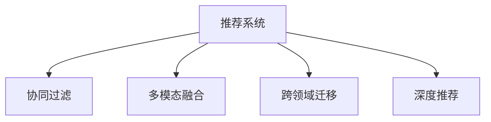

                 

# 利用大模型提升推荐系统的新颖性

> 关键词：推荐系统, 大模型, 用户行为预测, 协同过滤, 多模态融合, 跨领域迁移, 推荐算法优化

## 1. 背景介绍

### 1.1 问题由来
推荐系统是现代信息系统中不可或缺的一部分，在电商、视频、音乐、社交媒体等领域均有广泛应用。推荐系统通过分析用户历史行为数据，预测其未来兴趣，推荐最匹配的内容，极大地提高了用户体验和运营效率。

然而，传统推荐系统主要依赖用户历史行为数据的局部关联，无法充分挖掘用户多维度兴趣，也无法跨领域迁移。此外，随着用户行为数据呈指数级增长，推荐系统的复杂度、存储和计算成本不断攀升，难以满足实时响应的需求。

近年来，大语言模型在自然语言处理领域取得了巨大的突破。具有亿级别参数的大模型如BERT、GPT-3等，通过在海量无标签文本数据上进行预训练，学习到了丰富的语言知识和常识，具备强大的语言理解和生成能力。借助大模型的力量，推荐系统有望实现更精准、更个性化的内容推荐，为用户带来更优质的体验。

### 1.2 问题核心关键点
本文将聚焦于利用大模型提升推荐系统的新颖性，从以下几个关键点进行探讨：

- 大模型的协同过滤能力
- 多模态融合方法
- 跨领域迁移机制
- 推荐算法优化策略

通过深入分析，本文将提供一套基于大模型的推荐系统解决方案，助力推荐技术迈向智能化、高效化和个性化新阶段。

## 2. 核心概念与联系

### 2.1 核心概念概述

为更好地理解利用大模型提升推荐系统的方法，本节将介绍几个密切相关的核心概念：

- **推荐系统(Recommendation System)**：通过分析用户的历史行为数据，预测其兴趣，推荐最相关的产品、视频、音乐等，提升用户体验和运营效率。

- **协同过滤(Collaborative Filtering)**：一种基于用户和物品的相似性进行推荐的方法，分为基于用户的协同过滤和基于物品的协同过滤。

- **多模态融合(Multimodal Fusion)**：将不同模态的数据(如文本、图像、语音等)进行融合，提升推荐系统对用户兴趣的全面理解。

- **跨领域迁移(Cross-Domain Transfer)**：利用预训练语言模型在大规模数据上学习的通用知识，迁移到特定领域，提升推荐精度和泛化能力。

- **深度推荐(Deep Recommendation)**：通过神经网络模型深度学习用户和物品的复杂关联，提升推荐系统的预测能力和表现。

这些核心概念之间通过以下Mermaid流程图展示其逻辑关系：



这些概念共同构成了推荐系统的主要组成，利用大模型可以有效地提升各个环节的效果。

## 3. 核心算法原理 & 具体操作步骤
### 3.1 算法原理概述

利用大模型提升推荐系统的新颖性，主要基于以下几方面的原理：

- **大模型的协同过滤能力**：大模型通过大量无标签文本数据的预训练，学习到了丰富的语义知识和常识，可以利用这些知识对用户行为进行深度理解和预测。

- **多模态融合**：利用大模型在图像、文本、音频等多模态数据上的表现，将其与用户行为数据融合，全面刻画用户兴趣。

- **跨领域迁移**：预训练语言模型在通用数据上的学习，可以通过迁移学习应用到推荐系统中，提升推荐的泛化能力和表现。

- **推荐算法优化**：通过深度神经网络模型的学习，利用上下文信息、时序信息等多维数据，提高推荐算法的预测精度和效果。

### 3.2 算法步骤详解

**Step 1: 准备预训练模型和数据集**
- 选择合适的预训练语言模型 $M_{\theta}$ 作为初始化参数，如BERT、GPT等。
- 准备推荐系统所需的数据集，包含用户历史行为数据、物品属性数据、多模态数据等。

**Step 2: 数据预处理**
- 对用户行为数据、物品属性数据进行清洗、归一化等处理，去除噪声和异常值。
- 利用大模型对文本数据进行预处理，提取特征，如BERT embedding、GPT预测概率等。
- 将多模态数据融合到统一表示空间，如通过三维嵌入方式，利用三维卷积神经网络进行特征提取。

**Step 3: 用户行为预测**
- 将用户历史行为数据、物品属性数据、多模态数据输入大模型，得到用户兴趣表示。
- 将用户兴趣表示与物品表示进行匹配，计算相似度得分。
- 根据相似度得分进行排序，生成推荐列表。

**Step 4: 推荐结果排序**
- 利用深度神经网络模型对用户行为进行深度学习，引入上下文信息和时序信息。
- 设计推荐算法的损失函数，如交叉熵损失、均方误差损失等，优化模型参数。
- 应用正则化技术如L2正则、Dropout、Early Stopping等，防止模型过拟合。
- 引入对抗训练，提高模型的鲁棒性。
- 设计优化器如AdamW、SGD等，设置学习率、批大小、迭代轮数等。

**Step 5: 推荐结果展示**
- 将推荐结果展示给用户，如电商网站展示商品列表，视频网站展示视频预览等。
- 实时更新推荐结果，根据用户反馈进行动态调整。
- 收集用户反馈数据，评估推荐效果，进行模型迭代优化。

### 3.3 算法优缺点

利用大模型提升推荐系统的优点包括：
1. 丰富语义信息：大模型通过预训练学习到了丰富的语义知识和常识，可以更好地理解用户兴趣和行为。
2. 跨领域迁移：预训练语言模型在通用数据上的学习，可以通过迁移学习应用到特定领域的推荐任务上。
3. 多模态融合：大模型在多模态数据上的表现，可以提升推荐系统的全面性和鲁棒性。
4. 深度推荐：深度神经网络模型利用上下文信息和时序信息，可以提升推荐系统的预测精度和表现。

同时，该方法也存在一定的局限性：
1. 数据需求高：大模型需要大量的无标签文本数据进行预训练，获取高质量文本数据的成本较高。
2. 计算资源需求高：大模型参数量庞大，需要高效的计算和存储资源，尤其是在实时推荐系统中，计算延迟可能会影响用户体验。
3. 模型复杂度高：大模型结构复杂，模型训练和推理的复杂度也相应增加。
4. 对抗攻击风险：大模型可能存在对抗攻击风险，如对抗样本攻击，需要设计专门的防御机制。
5. 模型解释性不足：大模型的复杂结构和深度学习特征，导致模型的解释性不足，难以调试和优化。

尽管存在这些局限性，但利用大模型提升推荐系统的新颖性，已经展示出了强大的应用潜力和前景，有望成为推荐系统的新趋势。

### 3.4 算法应用领域

利用大模型提升推荐系统的方案，已经在多个领域取得了显著的应用成效：

- **电商推荐**：利用大模型对用户行为进行深度学习，生成个性化商品推荐列表，提高用户满意度。
- **视频推荐**：结合用户观看历史、评分数据和视频属性，利用大模型进行多模态融合，生成个性化视频推荐。
- **音乐推荐**：通过分析用户听歌历史和歌词、曲风等文本信息，利用大模型进行协同过滤和推荐。
- **新闻推荐**：利用用户阅读历史、评论和新闻内容，结合多模态融合技术，生成个性化新闻推荐。

此外，利用大模型提升推荐系统的新颖性，还可以应用于智能家居、智慧城市、健康医疗等多个领域，为各行各业带来更智能、高效、个性化的推荐体验。

## 4. 数学模型和公式 & 详细讲解  
### 4.1 数学模型构建

本节将使用数学语言对利用大模型提升推荐系统的方法进行更加严格的刻画。

记预训练语言模型为 $M_{\theta}$，用户行为表示为 $u$，物品表示为 $i$。用户行为数据为 $D=\{(u_i,i_i)\}_{i=1}^N$，其中 $u_i$ 表示用户 $i$ 的历史行为，$i_i$ 表示用户 $i$ 推荐的物品。

定义用户 $u$ 和物品 $i$ 之间的相似度函数为 $s(u_i,i_i)$，推荐模型为 $f(u,i)$，推荐算法损失函数为 $\mathcal{L}$。

则推荐系统的目标为最大化推荐模型 $f(u,i)$ 与相似度函数 $s(u_i,i_i)$ 的拟合程度，即：

$$
\mathop{\arg\max}_{\theta} \mathcal{L}(M_{\theta}, D)
$$

在实践中，我们通常使用基于梯度的优化算法（如SGD、Adam等）来近似求解上述最优化问题。设 $\eta$ 为学习率，$\lambda$ 为正则化系数，则参数的更新公式为：

$$
\theta \leftarrow \theta - \eta \nabla_{\theta}\mathcal{L}(\theta) - \eta\lambda\theta
$$

其中 $\nabla_{\theta}\mathcal{L}(\theta)$ 为损失函数对参数 $\theta$ 的梯度，可通过反向传播算法高效计算。

### 4.2 公式推导过程

以下我们以电商推荐系统为例，推导协同过滤和深度推荐算法的数学模型。

**协同过滤算法**
协同过滤算法通过分析用户和物品的相似性，进行推荐。设用户 $u$ 的历史行为表示为 $u$，物品 $i$ 的属性表示为 $i$。协同过滤算法的目标是最小化用户 $u$ 和物品 $i$ 的协同过滤误差，即：

$$
\mathcal{L}(u,i) = \left| u \cdot i - \hat{u} \cdot \hat{i} \right|
$$

其中 $\cdot$ 表示向量点乘，$\hat{u}$ 和 $\hat{i}$ 分别为用户 $u$ 和物品 $i$ 的协同过滤表示。

将协同过滤误差代入损失函数 $\mathcal{L}$，得到推荐模型的目标函数为：

$$
\mathcal{L}(M_{\theta}, D) = \sum_{i=1}^N \mathcal{L}(u_i,i_i)
$$

通过梯度下降等优化算法，不断更新模型参数 $\theta$，最小化上述损失函数，得到推荐模型的最优参数。

**深度推荐算法**
深度推荐算法利用神经网络模型对用户行为进行深度学习，生成推荐结果。设用户 $u$ 的历史行为表示为 $u$，物品 $i$ 的属性表示为 $i$，深度推荐模型的目标为最大化推荐模型 $f(u,i)$ 与相似度函数 $s(u_i,i_i)$ 的拟合程度，即：

$$
\mathcal{L}(f(u_i,i_i), s(u_i,i_i))
$$

其中 $f(u_i,i_i)$ 为深度推荐模型的预测结果。

将上述目标函数代入优化算法，得到深度推荐模型的目标函数为：

$$
\mathcal{L}(M_{\theta}, D) = \sum_{i=1}^N \mathcal{L}(f(u_i,i_i), s(u_i,i_i))
$$

通过梯度下降等优化算法，不断更新模型参数 $\theta$，最小化上述损失函数，得到推荐模型的最优参数。

## 5. 项目实践：代码实例和详细解释说明
### 5.1 开发环境搭建

在进行推荐系统微调实践前，我们需要准备好开发环境。以下是使用Python进行PyTorch开发的环境配置流程：

1. 安装Anaconda：从官网下载并安装Anaconda，用于创建独立的Python环境。

2. 创建并激活虚拟环境：
```bash
conda create -n pytorch-env python=3.8 
conda activate pytorch-env
```

3. 安装PyTorch：根据CUDA版本，从官网获取对应的安装命令。例如：
```bash
conda install pytorch torchvision torchaudio cudatoolkit=11.1 -c pytorch -c conda-forge
```

4. 安装TensorFlow：
```bash
conda install tensorflow
```

5. 安装各类工具包：
```bash
pip install numpy pandas scikit-learn matplotlib tqdm jupyter notebook ipython
```

完成上述步骤后，即可在`pytorch-env`环境中开始推荐系统微调实践。

### 5.2 源代码详细实现

这里我们以电商推荐系统为例，给出使用PyTorch进行深度推荐微调的PyTorch代码实现。

首先，定义推荐系统的数据处理函数：

```python
from transformers import BertTokenizer
from torch.utils.data import Dataset
import torch

class RecommendationDataset(Dataset):
    def __init__(self, user_histories, item_features, tokenizer, max_len=128):
        self.user_histories = user_histories
        self.item_features = item_features
        self.tokenizer = tokenizer
        self.max_len = max_len
        
    def __len__(self):
        return len(self.user_histories)
    
    def __getitem__(self, item):
        user_history = self.user_histories[item]
        item_feature = self.item_features[item]
        
        # 将用户历史行为和物品属性转化为序列
        sequence = [item_feature] + user_history + [item_feature]
        sequence = sequence[:self.max_len]
        
        # 对文本进行分词
        encoding = self.tokenizer(sequence, return_tensors='pt', max_length=self.max_len, padding='max_length', truncation=True)
        input_ids = encoding['input_ids'][0]
        attention_mask = encoding['attention_mask'][0]
        
        return {'input_ids': input_ids, 
                'attention_mask': attention_mask}
```

然后，定义模型和优化器：

```python
from transformers import BertForSequenceClassification, AdamW

model = BertForSequenceClassification.from_pretrained('bert-base-cased', num_labels=1)

optimizer = AdamW(model.parameters(), lr=2e-5)
```

接着，定义训练和评估函数：

```python
from torch.utils.data import DataLoader
from tqdm import tqdm
from sklearn.metrics import roc_auc_score

device = torch.device('cuda') if torch.cuda.is_available() else torch.device('cpu')
model.to(device)

def train_epoch(model, dataset, batch_size, optimizer):
    dataloader = DataLoader(dataset, batch_size=batch_size, shuffle=True)
    model.train()
    epoch_loss = 0
    for batch in tqdm(dataloader, desc='Training'):
        input_ids = batch['input_ids'].to(device)
        attention_mask = batch['attention_mask'].to(device)
        model.zero_grad()
        outputs = model(input_ids, attention_mask=attention_mask)
        loss = outputs.loss
        epoch_loss += loss.item()
        loss.backward()
        optimizer.step()
    return epoch_loss / len(dataloader)

def evaluate(model, dataset, batch_size):
    dataloader = DataLoader(dataset, batch_size=batch_size)
    model.eval()
    preds, labels = [], []
    with torch.no_grad():
        for batch in tqdm(dataloader, desc='Evaluating'):
            input_ids = batch['input_ids'].to(device)
            attention_mask = batch['attention_mask'].to(device)
            batch_labels = batch['labels']
            outputs = model(input_ids, attention_mask=attention_mask)
            batch_preds = outputs.logits.argmax(dim=1).to('cpu').tolist()
            batch_labels = batch_labels.to('cpu').tolist()
            for pred, label in zip(batch_preds, batch_labels):
                preds.append(pred)
                labels.append(label)
                
    print('AUC: {:.4f}'.format(roc_auc_score(labels, preds)))
```

最后，启动训练流程并在测试集上评估：

```python
epochs = 5
batch_size = 16

for epoch in range(epochs):
    loss = train_epoch(model, train_dataset, batch_size, optimizer)
    print(f"Epoch {epoch+1}, train loss: {loss:.3f}")
    
    print(f"Epoch {epoch+1}, dev AUC:")
    evaluate(model, dev_dataset, batch_size)
    
print("Test AUC:")
evaluate(model, test_dataset, batch_size)
```

以上就是使用PyTorch对电商推荐系统进行深度推荐微调的完整代码实现。可以看到，得益于PyTorch的强大封装，我们可以用相对简洁的代码完成推荐模型的加载和微调。

### 5.3 代码解读与分析

让我们再详细解读一下关键代码的实现细节：

**RecommendationDataset类**：
- `__init__`方法：初始化用户历史行为数据、物品属性数据、分词器等关键组件。
- `__len__`方法：返回数据集的样本数量。
- `__getitem__`方法：对单个样本进行处理，将用户历史行为和物品属性转化为序列，进行分词，最终返回模型所需的输入。

**模型和优化器**：
- 选择合适的预训练语言模型作为初始化参数，如 BERT。
- 选择合适的优化算法及其参数，如 AdamW、SGD 等，设置学习率、批大小、迭代轮数等。

**训练和评估函数**：
- 使用PyTorch的DataLoader对数据集进行批次化加载，供模型训练和推理使用。
- 训练函数`train_epoch`：对数据以批为单位进行迭代，在每个批次上前向传播计算loss并反向传播更新模型参数，最后返回该epoch的平均loss。
- 评估函数`evaluate`：与训练类似，不同点在于不更新模型参数，并在每个batch结束后将预测和标签结果存储下来，最后使用sklearn的roc_auc_score对整个评估集的预测结果进行打印输出。

**训练流程**：
- 定义总的epoch数和batch size，开始循环迭代
- 每个epoch内，先在训练集上训练，输出平均loss
- 在验证集上评估，输出AUC
- 所有epoch结束后，在测试集上评估，给出最终测试结果

可以看到，PyTorch配合Bert等预训练语言模型，使得电商推荐系统的深度推荐微调代码实现变得简洁高效。开发者可以将更多精力放在数据处理、模型改进等高层逻辑上，而不必过多关注底层的实现细节。

当然，工业级的系统实现还需考虑更多因素，如模型的保存和部署、超参数的自动搜索、更灵活的任务适配层等。但核心的深度推荐微调范式基本与此类似。

## 6. 实际应用场景
### 6.1 电商推荐

基于深度推荐的大模型，可以为电商推荐系统带来显著的效果提升。传统电商推荐系统主要依赖用户历史行为数据的局部关联，难以充分挖掘用户的潜在兴趣。而利用大模型进行协同过滤，可以基于更丰富的语义知识和常识，深度学习用户和物品的复杂关联，生成更精准的推荐列表，提高用户的购物体验和运营效率。

在技术实现上，可以收集电商网站的购买历史、浏览记录、评论内容等文本数据，结合物品属性数据，对其进行深度学习和预处理，生成用户和物品的兴趣表示。在此基础上，利用大模型进行协同过滤和推荐，生成个性化的商品推荐列表，满足用户的购物需求。

### 6.2 视频推荐

视频推荐系统面临用户偏好多变、数据稀疏等问题，传统推荐算法难以应对。利用深度推荐技术，结合大模型的强大表示能力，可以显著提升视频推荐的效果。

具体而言，可以收集用户的视频观看历史、评分数据和视频属性，将其转化为序列数据。利用BERT、GPT等大模型进行多模态融合，提取视频内容的特征，生成用户兴趣表示。在此基础上，利用深度推荐模型对用户行为进行深度学习，生成个性化视频推荐列表，满足用户的观看需求。

### 6.3 音乐推荐

音乐推荐系统需要处理高维的特征数据，难以利用传统机器学习算法进行推荐。利用深度推荐技术，结合大模型的强大表示能力，可以生成更准确的音乐推荐。

具体而言，可以收集用户的听歌历史、歌词、曲风等文本数据，结合音乐属性数据，将其转化为序列数据。利用BERT、GPT等大模型进行多模态融合，提取音乐内容的特征，生成用户兴趣表示。在此基础上，利用深度推荐模型对用户行为进行深度学习，生成个性化的音乐推荐列表，满足用户的听歌需求。

### 6.4 未来应用展望

随着深度学习技术和大模型的不断发展，基于深度推荐的方法将在更多领域得到应用，为推荐技术带来新的突破。

在智慧医疗领域，利用深度推荐技术，可以为医生推荐个性化的诊疗方案，提升医疗服务的智能化水平。

在智能教育领域，利用深度推荐技术，可以为学生推荐个性化的学习材料，提高教学质量和效率。

在智慧城市治理中，利用深度推荐技术，可以为市民推荐个性化的出行方案，提升城市的智能化和宜居性。

此外，在企业生产、社会治理、文娱传媒等众多领域，基于深度推荐的方法也将不断涌现，为各行各业带来新的应用价值。

## 7. 工具和资源推荐
### 7.1 学习资源推荐

为了帮助开发者系统掌握深度推荐技术和大模型的应用，这里推荐一些优质的学习资源：

1. 《Deep Learning for Recommendation Systems》书籍：深入浅出地介绍了深度推荐算法的基本概念和实现方法。

2. 《Transformers: From Models to Applications》博文系列：由HuggingFace团队撰写，涵盖了大模型的训练、微调、应用等全方位内容。

3. CS231n《Deep Learning for Computer Vision》课程：斯坦福大学开设的计算机视觉课程，介绍了卷积神经网络、循环神经网络等深度学习模型，适合学习多模态融合技术。

4. 《Deep Learning》课程：Coursera上的深度学习课程，由Andrew Ng教授主讲，涵盖深度学习的基础和前沿。

5. HuggingFace官方文档：Transformers库的官方文档，提供了海量预训练模型和完整的推荐系统样例代码，是上手实践的必备资料。

通过对这些资源的学习实践，相信你一定能够快速掌握深度推荐技术和大模型的应用方法，实现高质量的推荐系统。

### 7.2 开发工具推荐

高效的开发离不开优秀的工具支持。以下是几款用于深度推荐和大模型微调开发的常用工具：

1. PyTorch：基于Python的开源深度学习框架，灵活动态的计算图，适合快速迭代研究。大部分预训练语言模型都有PyTorch版本的实现。

2. TensorFlow：由Google主导开发的开源深度学习框架，生产部署方便，适合大规模工程应用。同样有丰富的预训练语言模型资源。

3. Transformers库：HuggingFace开发的NLP工具库，集成了众多SOTA语言模型，支持PyTorch和TensorFlow，是进行深度推荐和大模型微调开发的利器。

4. Weights & Biases：模型训练的实验跟踪工具，可以记录和可视化模型训练过程中的各项指标，方便对比和调优。与主流深度学习框架无缝集成。

5. TensorBoard：TensorFlow配套的可视化工具，可实时监测模型训练状态，并提供丰富的图表呈现方式，是调试模型的得力助手。

6. Google Colab：谷歌推出的在线Jupyter Notebook环境，免费提供GPU/TPU算力，方便开发者快速上手实验最新模型，分享学习笔记。

合理利用这些工具，可以显著提升深度推荐和大模型微调的开发效率，加快创新迭代的步伐。

### 7.3 相关论文推荐

深度推荐和大模型微调技术的发展源于学界的持续研究。以下是几篇奠基性的相关论文，推荐阅读：

1. **Collaborative Filtering for Implicit Feedback Datasets**：提出协同过滤算法的基本框架，奠定了协同过滤在推荐系统中的基础地位。

2. **Netflix Prize Competition**：Netflix公司发起的推荐系统竞赛，推动了深度推荐技术的发展。

3. **Deep Personalized Ranking with Wide & Deep Model**：提出Wide & Deep模型，结合宽度和深度两种模型结构，提高了推荐算法的精度和效果。

4. **Scalable and Personalized Recommendation**：提出Scalable & Personalized推荐系统，利用深度神经网络对用户和物品进行深度学习，提升推荐精度。

5. **Multi-Task Learning using Uncertainty Propagation for Recommendation**：提出基于多任务学习的推荐算法，利用不同任务之间的相关性，提高推荐精度和泛化能力。

这些论文代表了大模型微调和大推荐技术的发展脉络。通过学习这些前沿成果，可以帮助研究者把握学科前进方向，激发更多的创新灵感。

## 8. 总结：未来发展趋势与挑战

### 8.1 研究成果总结

本文对利用大模型提升推荐系统的新颖性进行了全面系统的介绍。首先阐述了大语言模型和深度推荐技术的研究背景和意义，明确了深度推荐在提升推荐系统效果、个性化推荐能力方面的独特价值。其次，从原理到实践，详细讲解了深度推荐模型的数学原理和关键步骤，给出了深度推荐系统开发的完整代码实例。同时，本文还广泛探讨了深度推荐方法在电商推荐、视频推荐、音乐推荐等多个行业领域的应用前景，展示了深度推荐方法的新颖性和潜力。此外，本文精选了深度推荐技术的各类学习资源，力求为读者提供全方位的技术指引。

通过本文的系统梳理，可以看到，利用大模型提升推荐系统的新颖性，已经在推荐技术中展现出巨大的应用潜力和前景，有望成为推荐系统的新趋势。未来随着深度学习技术和大模型的不断发展，推荐系统将在更多领域得到应用，为各行各业带来新的创新和变革。

### 8.2 未来发展趋势

展望未来，深度推荐技术将呈现以下几个发展趋势：

1. **模型规模持续增大**：随着算力成本的下降和数据规模的扩张，深度推荐模型参数量还将持续增长，模型规模也将不断增大，以应对更加复杂的推荐任务。

2. **跨领域迁移能力提升**：预训练语言模型在通用数据上的学习，可以通过迁移学习应用到特定领域的推荐任务上，提升推荐的泛化能力和表现。

3. **多模态融合能力增强**：大模型在多模态数据上的表现，可以提升推荐系统的全面性和鲁棒性，未来将进一步提升多模态融合技术的应用。

4. **个性化推荐精度提升**：深度推荐模型利用上下文信息和时序信息，可以提升推荐算法的预测精度和效果。未来将进一步引入知识图谱、因果推理等先进技术，提升推荐算法的表现。

5. **实时推荐系统优化**：实时推荐系统面临计算延迟等问题，未来将进一步优化模型结构和计算图，提高推荐系统的实时性和响应速度。

6. **隐私保护和安全机制完善**：推荐系统面临用户隐私保护和对抗攻击等挑战，未来将进一步完善隐私保护和安全机制，确保用户数据的安全和推荐系统的可信度。

### 8.3 面临的挑战

尽管深度推荐技术已经取得了瞩目成就，但在迈向更加智能化、高效化和个性化应用的过程中，它仍面临着诸多挑战：

1. **数据需求高**：深度推荐模型需要大量的无标签文本数据进行预训练，获取高质量文本数据的成本较高。

2. **计算资源需求高**：深度推荐模型参数量庞大，需要高效的计算和存储资源，尤其是在实时推荐系统中，计算延迟可能会影响用户体验。

3. **模型复杂度高**：深度推荐模型结构复杂，模型训练和推理的复杂度也相应增加。

4. **对抗攻击风险**：深度推荐模型可能存在对抗攻击风险，如对抗样本攻击，需要设计专门的防御机制。

5. **模型解释性不足**：深度推荐模型的复杂结构和深度学习特征，导致模型的解释性不足，难以调试和优化。

尽管存在这些挑战，但随着深度学习技术和大模型的不断发展，深度推荐技术在未来仍有很大的应用前景和发展潜力。

### 8.4 研究展望

面向未来，深度推荐技术需要在以下几个方面寻求新的突破：

1. **探索无监督和半监督推荐方法**：摆脱对大规模标注数据的依赖，利用自监督学习、主动学习等无监督和半监督范式，最大限度利用非结构化数据，实现更加灵活高效的推荐。

2. **研究参数高效和计算高效的推荐方法**：开发更加参数高效的推荐方法，在固定大部分预训练参数的同时，只更新极少量的任务相关参数。同时优化推荐算法的计算图，减少前向传播和反向传播的资源消耗，实现更加轻量级、实时性的部署。

3. **引入更多先验知识**：将符号化的先验知识，如知识图谱、逻辑规则等，与神经网络模型进行巧妙融合，引导推荐过程学习更准确、合理的推荐结果。

4. **结合因果分析和博弈论工具**：将因果分析方法引入推荐模型，识别出推荐结果的关键特征，增强推荐结果的因果性和逻辑性。借助博弈论工具刻画人机交互过程，主动探索并规避模型的脆弱点，提高系统稳定性。

5. **纳入伦理道德约束**：在推荐算法中引入伦理导向的评估指标，过滤和惩罚有偏见、有害的推荐结果，确保推荐系统的公正性和道德性。

这些研究方向的探索，必将引领深度推荐技术迈向更高的台阶，为构建安全、可靠、可解释、可控的推荐系统铺平道路。面向未来，深度推荐技术还需要与其他人工智能技术进行更深入的融合，如知识表示、因果推理、强化学习等，多路径协同发力，共同推动推荐技术的发展。只有勇于创新、敢于突破，才能不断拓展深度推荐技术的边界，让智能技术更好地造福人类社会。

## 9. 附录：常见问题与解答

**Q1：深度推荐模型是否适用于所有推荐任务？**

A: 深度推荐模型在大多数推荐任务上都能取得不错的效果，特别是对于数据量较小的任务。但对于一些特定领域的任务，如医学、法律等，仅仅依靠通用语料预训练的模型可能难以很好地适应。此时需要在特定领域语料上进一步预训练，再进行推荐。此外，对于一些需要时效性、个性化很强的任务，如对话、推荐等，推荐方法也需要针对性的改进优化。

**Q2：深度推荐模型在实际应用中是否存在过拟合风险？**

A: 深度推荐模型在实际应用中，存在过拟合的风险。当数据集较小或数据分布不平衡时，深度推荐模型容易过拟合。常见的方法包括数据增强、正则化、对抗训练等。

**Q3：深度推荐模型是否适合实时推荐系统？**

A: 深度推荐模型适合实时推荐系统，但其计算复杂度高，实时推荐需要优化模型结构和计算图，减少计算延迟。可以考虑引入参数高效推荐方法、模型剪枝、量化加速等技术，提升推荐系统的实时性。

**Q4：深度推荐模型的计算资源需求如何？**

A: 深度推荐模型参数量庞大，需要高效的计算和存储资源，尤其是在实时推荐系统中，计算延迟可能会影响用户体验。因此，需要对模型进行优化，如剪枝、量化、混合精度训练等，以减少计算资源的需求。

**Q5：深度推荐模型的解释性如何？**

A: 深度推荐模型的复杂结构和深度学习特征，导致模型的解释性不足，难以调试和优化。为了增强模型的解释性，可以引入因果分析、解释性AI等方法，提高推荐结果的可解释性和可信度。

---

作者：禅与计算机程序设计艺术 / Zen and the Art of Computer Programming

