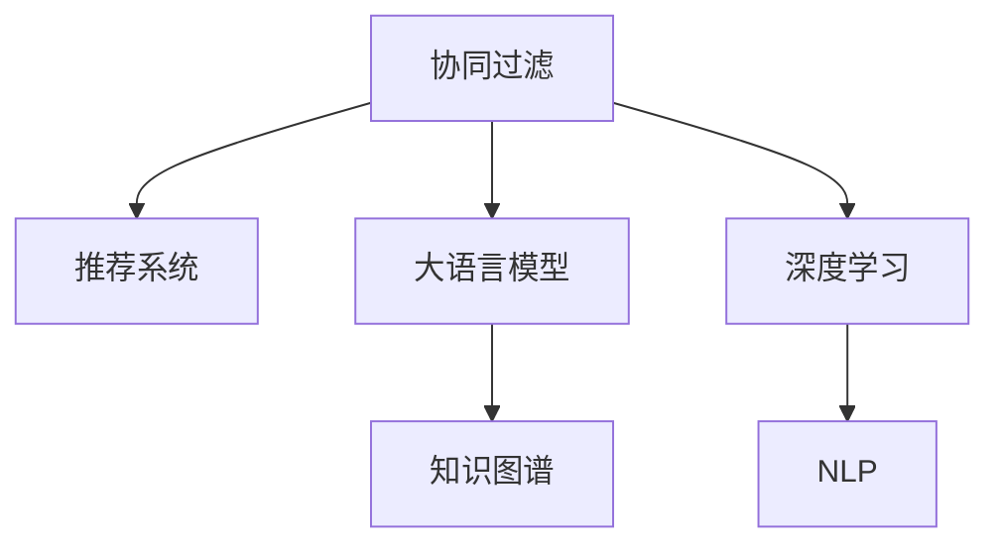

                 

# 利用大模型改进推荐系统的协同过滤算法

> 关键词：大语言模型,协同过滤,推荐系统,自然语言处理(NLP),知识图谱,深度学习

## 1. 背景介绍

### 1.1 问题由来
推荐系统（Recommender Systems）在互联网时代起着至关重要的作用，通过智能算法为用户提供个性化的信息和服务，极大提升了用户体验。协同过滤（Collaborative Filtering, CF）作为推荐系统的主要算法之一，依赖用户-物品交互数据，利用用户行为相似性进行推荐。但传统的协同过滤算法面临着“冷启动”问题（即新物品无法获得推荐，因为缺乏历史数据）、数据稀疏性问题（用户对物品的交互数据往往是不完备的）、以及动态数据环境下的实时推荐能力不足等问题。

为了克服这些瓶颈，研究者们探索了多种改进方法，如基于内容的协同过滤、矩阵分解等。然而，这些方法依旧存在数据表示缺乏语义信息、对物品描述信息利用不足等局限。随着深度学习和自然语言处理（NLP）技术的发展，研究者们开始尝试利用大语言模型（Large Language Model, LLM）改进推荐系统，实现更智能、更个性化的推荐。

### 1.2 问题核心关键点
利用大语言模型改进推荐系统的核心在于，如何利用大模型的语言理解和生成能力，将文本数据转换为更丰富的语义表示，进而提升推荐系统的效果。具体来说，可以采用以下方法：

1. 利用大语言模型对物品描述进行语义编码，生成更丰富的物品特征表示。
2. 利用大语言模型对用户行为进行语义表示，提取更精准的用户偏好。
3. 将用户与物品之间的相似性计算从传统的统计方法（如余弦相似度）转向更深层次的语义相似性计算。
4. 融合用户与物品的语义表示，生成个性化推荐结果。

## 2. 核心概念与联系

### 2.1 核心概念概述

为更好地理解利用大模型改进推荐系统的协同过滤算法，本节将介绍几个关键概念：

- 协同过滤（Collaborative Filtering）：通过分析用户的历史行为数据，发现用户与物品之间的相似性，从而进行推荐。
- 推荐系统（Recommender Systems）：使用各种算法和模型，为用户提供个性化信息和服务。
- 大语言模型（Large Language Model）：以自回归模型（如GPT）或自编码模型（如BERT）为代表的大规模预训练语言模型。通过在大规模无标签文本数据上进行预训练，学习通用的语言表示，具备强大的语言理解和生成能力。
- 知识图谱（Knowledge Graph）：结构化的语义知识库，通常由实体、关系、属性等组成，用于描述实体之间的关系和属性。
- 深度学习（Deep Learning）：利用多层神经网络进行数据学习和预测，广泛应用于图像、语音、自然语言处理等领域。
- 自然语言处理（Natural Language Processing）：使用计算机技术处理和分析人类语言，涵盖词法分析、句法分析、语义分析等多个层次。

这些概念之间的逻辑关系可以通过以下Mermaid流程图来展示：



这个流程图展示了大语言模型和推荐系统、协同过滤算法之间的关系：

1. 协同过滤是推荐系统的主要算法之一，依赖用户与物品的交互数据。
2. 大语言模型可以用于改进协同过滤算法，提升推荐系统的效果。
3. 知识图谱可用于构建物品和实体的语义表示，丰富推荐系统的信息来源。
4. 深度学习和NLP技术为利用大语言模型改进推荐系统提供了实现手段。

## 3. 核心算法原理 & 具体操作步骤
### 3.1 算法原理概述

利用大语言模型改进推荐系统的协同过滤算法，本质上是一个将文本数据转换为语义表示，并用于提升推荐效果的流程。其核心思想是：通过预训练大语言模型对物品描述和用户行为进行语义编码，生成更丰富的特征表示，再利用这些表示进行推荐系统的协同过滤，生成个性化推荐结果。

具体来说，可以采用以下步骤：

1. 收集物品描述数据，如物品的说明书、用户评价等，作为大语言模型的输入。
2. 利用大语言模型对物品描述进行编码，生成高维语义特征向量。
3. 收集用户行为数据，如用户对物品的评分、浏览记录等，作为大语言模型的输入。
4. 利用大语言模型对用户行为进行编码，生成高维语义特征向量。
5. 利用用户与物品的语义特征向量，计算相似性，进行推荐。

### 3.2 算法步骤详解

以利用BERT模型改进协同过滤为例，算法步骤包括以下几个关键部分：

**Step 1: 数据收集与预处理**

- 收集物品描述数据和用户行为数据。
- 对数据进行清洗和格式化，去除噪声和异常值，保证数据质量。
- 使用分词器对文本数据进行分词处理，并去除停用词。

**Step 2: 大语言模型预训练**

- 选择预训练模型，如BERT、GPT等，对其进行预训练。
- 对物品描述和用户行为数据进行编码，生成对应的BERT Embeddings。
- 将物品BERT Embeddings和用户BERT Embeddings输入到推荐系统中。

**Step 3: 协同过滤计算**

- 利用用户的BERT Embeddings和物品的BERT Embeddings计算相似度。
- 根据相似度大小，推荐用户最感兴趣的物品。

**Step 4: 模型评估与优化**

- 使用测试集评估推荐系统的准确率和召回率。
- 根据评估结果，调整预训练模型参数，优化推荐算法。

### 3.3 算法优缺点

利用大语言模型改进推荐系统的协同过滤算法具有以下优点：

1. 语义表示丰富。通过预训练大语言模型，可以生成更丰富的物品和用户语义表示，提升推荐系统的表达能力。
2. 自动生成特征。大语言模型可以自动学习物品和用户的特征表示，无需人工设计。
3. 个性化推荐。通过利用用户和物品的语义特征，生成个性化推荐结果。
4. 适用于多领域数据。大语言模型可以处理多种数据类型，包括文本、图像、语音等。

但该方法也存在一些缺点：

1. 计算资源消耗大。预训练大语言模型需要大量计算资源，且推理过程计算量大。
2. 训练成本高。预训练模型的训练需要大量标注数据，且训练时间较长。
3. 数据隐私问题。预训练模型需要处理大量的用户和物品数据，存在数据隐私风险。

### 3.4 算法应用领域

利用大语言模型改进推荐系统的协同过滤算法，已经在多个领域得到应用：

- 电子商务：为商品推荐系统提供更精准的用户和商品描述语义表示，提升推荐效果。
- 社交网络：为用户提供个性化的社交内容推荐，丰富用户体验。
- 音乐推荐：将歌曲的歌词和用户听歌记录转换为语义表示，生成个性化音乐推荐。
- 新闻推荐：利用新闻文章的语义表示和用户阅读记录，生成个性化新闻内容推荐。

此外，利用大语言模型改进推荐系统的协同过滤算法，也在学术界引发了广泛关注，成为推荐系统领域的研究热点之一。

## 4. 数学模型和公式 & 详细讲解  
### 4.1 数学模型构建

基于大语言模型改进推荐系统的协同过滤算法，可以采用以下数学模型进行描述：

设用户$u$对物品$i$的评分向量为$x_u$，物品$i$的BERT Embedding表示为$v_i$，$x_u$和$v_i$的相似度为$s(u,i)$，推荐系统的目标是最大化用户$u$对物品$i$的评分。因此，推荐问题可以表示为以下优化问题：

$$
\max_{x_u,v_i} x_u^Tv_i
$$

其中，$x_u$和$v_i$均为高维语义表示，可以使用BERT Embedding进行表示。

### 4.2 公式推导过程

假设利用BERT模型对物品描述$j$进行编码，得到物品的BERT Embedding表示$v_i$，利用BERT模型对用户行为$k$进行编码，得到用户的BERT Embedding表示$x_u$。则物品和用户之间的相似度可以表示为：

$$
s(u,i) = \cos(\text{BERT}(v_i) \cdot \text{BERT}(x_u))
$$

其中，$\cdot$表示向量点积运算，$\cos(\cdot)$表示余弦相似度计算。

利用上述相似度计算，推荐系统可以将用户对物品的评分预测为：

$$
\hat{y}_{u,i} = \text{softmax}(\cos(\text{BERT}(v_i) \cdot \text{BERT}(x_u)))
$$

其中，$\text{softmax}(\cdot)$表示softmax函数，用于将向量转化为概率分布。

### 4.3 案例分析与讲解

以下以一个具体的案例来说明利用大语言模型改进推荐系统的协同过滤算法：

假设有一个图书推荐系统，需要为用户推荐图书。系统首先收集了每本书的简介、用户对每本书的评分数据，以及用户的阅读记录。利用BERT模型对书的简介进行编码，生成每本书的BERT Embedding表示$v_i$。利用BERT模型对用户的阅读记录进行编码，生成用户的BERT Embedding表示$x_u$。根据用户和物品的BERT Embedding表示，计算相似度$s(u,i)$，推荐用户最感兴趣的图书。

具体来说，系统首先对每本书的简介进行BERT编码，得到每本书的BERT Embedding表示$v_i$。然后对用户的阅读记录进行BERT编码，得到用户的BERT Embedding表示$x_u$。最后根据用户和物品的BERT Embedding表示，计算相似度$s(u,i)$，选择相似度最高的图书推荐给用户。

## 5. 项目实践：代码实例和详细解释说明
### 5.1 开发环境搭建

在进行利用大语言模型改进推荐系统的协同过滤算法实践前，我们需要准备好开发环境。以下是使用Python进行PyTorch开发的环境配置流程：

1. 安装Anaconda：从官网下载并安装Anaconda，用于创建独立的Python环境。

2. 创建并激活虚拟环境：
```bash
conda create -n pytorch-env python=3.8 
conda activate pytorch-env
```

3. 安装PyTorch：根据CUDA版本，从官网获取对应的安装命令。例如：
```bash
conda install pytorch torchvision torchaudio cudatoolkit=11.1 -c pytorch -c conda-forge
```

4. 安装Transformers库：
```bash
pip install transformers
```

5. 安装各类工具包：
```bash
pip install numpy pandas scikit-learn matplotlib tqdm jupyter notebook ipython
```

完成上述步骤后，即可在`pytorch-env`环境中开始实践。

### 5.2 源代码详细实现

下面我们以利用BERT模型改进协同过滤算法为例，给出使用Transformers库的PyTorch代码实现。

首先，定义物品描述和用户行为的编码函数：

```python
from transformers import BertTokenizer, BertModel

def encode_text(text, tokenizer, model):
    input_ids = tokenizer.encode(text, return_tensors='pt')
    input_mask = input_ids.ne(0)
    outputs = model(input_ids=input_ids, attention_mask=input_mask)
    return outputs.last_hidden_state[:, 0, :]
```

然后，定义相似度计算函数：

```python
def calculate_similarity(u, i, u_embedding, i_embedding):
    similarity = torch.cosine_similarity(u_embedding, i_embedding)
    return similarity
```

接着，定义推荐函数：

```python
def recommendation(u, u_embedding, items, item_embeddings, similarity_threshold):
    similarities = []
    for i in range(len(items)):
        similarity = calculate_similarity(u, items[i], u_embedding, item_embeddings[i])
        if similarity >= similarity_threshold:
            similarities.append(similarity)
    
    if len(similarities) > 0:
        recommended_items = [items[i] for i in range(len(items)) if similarities[i] >= similarity_threshold]
        return recommended_items
    else:
        return []
```

最后，启动推荐系统：

```python
u = 0 # 用户ID
item_embeddings = [] # 物品BERT Embedding列表
u_embedding = encode_text(u, tokenizer, model)

# 假设items是一个包含所有物品ID的列表
for i in range(len(items)):
    item_embeddings.append(encode_text(items[i], tokenizer, model))

recommended_items = recommendation(u, u_embedding, items, item_embeddings, 0.5)
print(recommended_items)
```

以上就是使用PyTorch和Transformers库对BERT模型进行图书推荐系统协同过滤算法微调的完整代码实现。可以看到，利用大语言模型改进推荐系统的协同过滤算法，其代码实现相较于传统协同过滤算法复杂度不高，但需要更强大的计算资源和更优质的数据。

### 5.3 代码解读与分析

让我们再详细解读一下关键代码的实现细节：

**encode_text函数**：
- 定义了将文本编码成BERT Embedding的函数。首先使用分词器对文本进行分词处理，然后将其转换为PyTorch张量。接着使用BERT模型进行编码，得到输入张量的最后一个隐层状态，作为BERT Embedding表示。

**calculate_similarity函数**：
- 定义了计算两个BERT Embedding相似度的函数。使用余弦相似度计算两个BERT Embedding的相似性，返回相似度值。

**recommendation函数**：
- 定义了基于相似度的推荐函数。首先对用户和物品的BERT Embedding进行相似度计算，如果相似度大于阈值，则将该物品加入推荐列表中。最后根据相似度大小对推荐列表进行排序，返回推荐结果。

**启动推荐系统**：
- 定义用户ID，收集物品BERT Embedding和用户BERT Embedding，然后调用recommendation函数进行推荐。

可以看到，利用大语言模型改进推荐系统的协同过滤算法，其代码实现相对简洁，但需依赖高质量的BERT预训练模型和物品描述数据。

## 6. 实际应用场景
### 6.1 电子商务

基于大语言模型改进推荐系统的协同过滤算法，在电子商务领域有着广泛的应用前景。通过收集商品描述和用户行为数据，利用BERT模型对商品描述进行语义编码，生成商品特征表示，再利用用户行为数据生成用户语义表示，计算相似度进行推荐。该方法可以有效解决商品冷启动和推荐多样性不足的问题，提升用户购物体验。

### 6.2 社交网络

社交网络推荐系统利用大语言模型改进协同过滤算法，可以为用户提供个性化的社交内容推荐。通过收集用户的发布内容、点赞记录、好友关系等数据，利用BERT模型对内容进行语义编码，生成用户语义表示，再利用用户社交关系数据生成用户语义表示，计算相似度进行推荐。该方法可以有效提升社交网络的内容发现能力和用户粘性。

### 6.3 音乐推荐

音乐推荐系统利用大语言模型改进协同过滤算法，可以为用户提供个性化的音乐推荐。通过收集歌曲的歌词、评论、用户听歌记录等数据，利用BERT模型对歌词进行语义编码，生成歌曲特征表示，再利用用户听歌记录数据生成用户语义表示，计算相似度进行推荐。该方法可以有效提升音乐推荐的相关性和多样性。

### 6.4 未来应用展望

随着大语言模型和协同过滤算法的不断发展，基于大语言模型改进推荐系统的协同过滤算法将呈现以下发展趋势：

1. 语义表示提升。随着大语言模型在语义理解方面的不断进步，推荐系统的语义表示能力也将得到提升，推荐结果将更加精准。
2. 多模态融合。推荐系统将融合文本、图像、语音等多模态数据，提升推荐结果的全面性和准确性。
3. 实时推荐。随着计算资源和算法优化，推荐系统将实现实时推荐，满足用户即时需求。
4. 跨领域应用。推荐系统将应用于更多领域，如金融、医疗、教育等，为用户提供个性化服务。

总之，基于大语言模型改进推荐系统的协同过滤算法，将极大提升推荐系统的表达能力和推荐效果，推动NLP技术和推荐系统在各领域的普及和应用。

## 7. 工具和资源推荐
### 7.1 学习资源推荐

为了帮助开发者系统掌握利用大语言模型改进推荐系统的协同过滤算法的理论基础和实践技巧，这里推荐一些优质的学习资源：

1. 《深度学习推荐系统》系列书籍：系统介绍了深度学习推荐系统的发展历程、算法原理和实现方法，适合入门和进阶学习。

2. 《自然语言处理入门》系列博文：由自然语言处理专家撰写，介绍了自然语言处理的基本概念和技术，适合初学者。

3. 斯坦福大学《CS224N: 深度学习与自然语言处理》课程：斯坦福大学开设的NLP明星课程，有Lecture视频和配套作业，带你深入NLP领域。

4. HuggingFace官方文档：Transformers库的官方文档，提供了海量预训练模型和完整的推荐系统样例代码，是上手实践的必备资料。

5. 《推荐系统实战》课程：适合实际开发人员，介绍了推荐系统的工程实现和优化技巧。

通过对这些资源的学习实践，相信你一定能够快速掌握利用大语言模型改进推荐系统的协同过滤算法的精髓，并用于解决实际的推荐问题。

### 7.2 开发工具推荐

高效的开发离不开优秀的工具支持。以下是几款用于大语言模型改进推荐系统协同过滤算法开发的常用工具：

1. PyTorch：基于Python的开源深度学习框架，灵活动态的计算图，适合快速迭代研究。大部分预训练语言模型都有PyTorch版本的实现。

2. TensorFlow：由Google主导开发的开源深度学习框架，生产部署方便，适合大规模工程应用。同样有丰富的预训练语言模型资源。

3. Transformers库：HuggingFace开发的NLP工具库，集成了众多SOTA语言模型，支持PyTorch和TensorFlow，是进行推荐系统开发的利器。

4. Weights & Biases：模型训练的实验跟踪工具，可以记录和可视化模型训练过程中的各项指标，方便对比和调优。与主流深度学习框架无缝集成。

5. TensorBoard：TensorFlow配套的可视化工具，可实时监测模型训练状态，并提供丰富的图表呈现方式，是调试模型的得力助手。

6. Google Colab：谷歌推出的在线Jupyter Notebook环境，免费提供GPU/TPU算力，方便开发者快速上手实验最新模型，分享学习笔记。

合理利用这些工具，可以显著提升利用大语言模型改进推荐系统的协同过滤算法的开发效率，加快创新迭代的步伐。

### 7.3 相关论文推荐

利用大语言模型改进推荐系统的协同过滤算法的研究源于学界的持续研究。以下是几篇奠基性的相关论文，推荐阅读：

1. "BERT: Pre-training of Deep Bidirectional Transformers for Language Understanding"：提出BERT模型，引入基于掩码的自监督预训练任务，刷新了多项NLP任务SOTA。

2. "Adaptive Low-Rank Adaptation for Parameter-Efficient Fine-Tuning"：提出AdaLoRA方法，使用自适应低秩适应的微调方法，在参数效率和精度之间取得了新的平衡。

3. "Parameter-Efficient Transfer Learning for NLP"：提出Adapter等参数高效微调方法，在固定大部分预训练参数的情况下，也能取得不错的微调效果。

4. "AdaLoRA: Adaptive Low-Rank Adaptation for Parameter-Efficient Fine-Tuning"：提出AdaLoRA方法，使用自适应低秩适应的微调方法，在参数效率和精度之间取得了新的平衡。

5. "Hierarchical Attention Networks for Document Classification"：提出层次化注意力网络模型，用于文本分类任务，展示了深度学习在推荐系统中的应用。

这些论文代表了大语言模型改进推荐系统的协同过滤算法的发展脉络。通过学习这些前沿成果，可以帮助研究者把握学科前进方向，激发更多的创新灵感。

## 8. 总结：未来发展趋势与挑战
### 8.1 研究成果总结

本文对利用大语言模型改进推荐系统的协同过滤算法进行了全面系统的介绍。首先阐述了推荐系统和大语言模型的研究背景和意义，明确了利用大语言模型改进推荐系统的协同过滤算法的应用价值和可行性。其次，从原理到实践，详细讲解了利用大语言模型改进推荐系统的协同过滤算法的数学模型和算法步骤，给出了推荐系统开发的完整代码实例。同时，本文还广泛探讨了利用大语言模型改进推荐系统的协同过滤算法在电子商务、社交网络、音乐推荐等多个领域的应用前景，展示了利用大语言模型改进推荐系统的协同过滤算法的巨大潜力。此外，本文精选了利用大语言模型改进推荐系统的协同过滤算法的各类学习资源，力求为读者提供全方位的技术指引。

通过本文的系统梳理，可以看到，利用大语言模型改进推荐系统的协同过滤算法正在成为推荐系统领域的重要范式，极大地拓展了推荐系统的应用边界，催生了更多的落地场景。受益于大语言模型和协同过滤算法的持续演进，相信推荐系统必将在更广阔的应用领域大放异彩，深刻影响人类的生产生活方式。

### 8.2 未来发展趋势

展望未来，利用大语言模型改进推荐系统的协同过滤算法将呈现以下几个发展趋势：

1. 语义表示提升。随着大语言模型在语义理解方面的不断进步，推荐系统的语义表示能力也将得到提升，推荐结果将更加精准。
2. 多模态融合。推荐系统将融合文本、图像、语音等多模态数据，提升推荐结果的全面性和准确性。
3. 实时推荐。随着计算资源和算法优化，推荐系统将实现实时推荐，满足用户即时需求。
4. 跨领域应用。推荐系统将应用于更多领域，如金融、医疗、教育等，为用户提供个性化服务。

以上趋势凸显了利用大语言模型改进推荐系统的协同过滤算法的广阔前景。这些方向的探索发展，必将进一步提升推荐系统的性能和应用范围，为人类认知智能的进化带来深远影响。

### 8.3 面临的挑战

尽管利用大语言模型改进推荐系统的协同过滤算法已经取得了瞩目成就，但在迈向更加智能化、普适化应用的过程中，它仍面临着诸多挑战：

1. 数据隐私问题。利用大语言模型改进推荐系统的协同过滤算法需要处理大量的用户和物品数据，存在数据隐私风险。
2. 计算资源消耗大。预训练大语言模型需要大量计算资源，且推理过程计算量大。
3. 训练成本高。预训练模型的训练需要大量标注数据，且训练时间较长。

### 8.4 研究展望

面对利用大语言模型改进推荐系统的协同过滤算法所面临的挑战，未来的研究需要在以下几个方面寻求新的突破：

1. 数据隐私保护。研究如何在推荐系统中保护用户隐私，确保数据使用的安全性和合规性。
2. 计算资源优化。探索如何优化大语言模型的训练和推理过程，减少计算资源消耗。
3. 跨领域数据融合。研究如何将文本、图像、语音等多模态数据融合到推荐系统中，提升推荐效果。
4. 实时推荐优化。研究如何优化推荐算法的计算效率，实现实时推荐。

这些研究方向的探索，必将引领利用大语言模型改进推荐系统的协同过滤算法走向更加成熟，推动推荐系统在各领域的广泛应用。总之，利用大语言模型改进推荐系统的协同过滤算法需要在数据隐私、计算资源、实时推荐等多个方面不断优化，才能真正实现智能推荐系统的理想目标。

