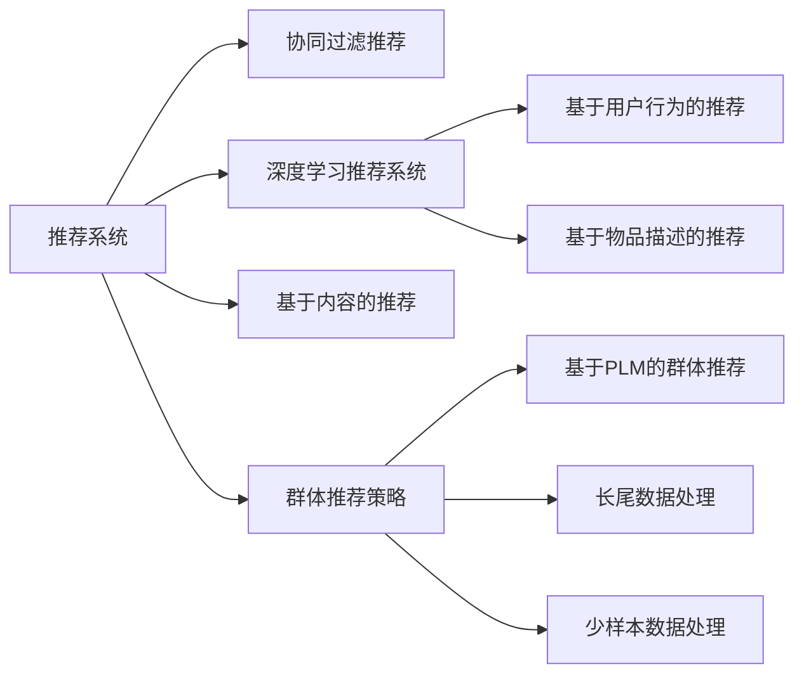

                 

# 利用大模型改进推荐系统的群体推荐策略

> 关键词：大模型，群体推荐，推荐系统，自然语言处理(NLP)，深度学习，个性化推荐，协同过滤

## 1. 背景介绍

推荐系统（Recommendation System）作为互联网时代重要的应用之一，广泛应用于电商、新闻、音乐、视频等诸多领域。其基本思路是根据用户历史行为、属性和兴趣，预测用户对未曝光项的兴趣，以实现个性化的信息推送。推荐系统主要包含三种类型：基于内容的推荐、协同过滤推荐和混合推荐。其中，协同过滤推荐（Collaborative Filtering, CF）基于用户间的相似性来预测用户对新项目的兴趣。协同过滤推荐可分为基于用户的协同过滤和基于项目的协同过滤两种。前者根据用户与用户间的相似性预测，后者根据项目间的相似性预测。

近年来，随着大数据、深度学习等技术的迅猛发展，协同过滤推荐技术已从传统的基于矩阵分解的方法，逐渐转变为基于深度学习的方法。深度学习推荐系统主要分为两个类别：基于用户行为的推荐和基于物品描述的推荐。基于用户行为的推荐系统主要包括深度序列模型、深度协同过滤推荐和深度混合推荐系统；基于物品描述的推荐系统则主要利用深度神经网络模型对物品描述信息进行建模，并通过学习物品和用户之间的关联关系，预测用户对物品的兴趣。这些推荐系统不仅能够考虑用户历史行为、属性和兴趣，还能够自动提取物品的隐式特征，从而更好地实现个性化推荐。

尽管深度学习推荐系统已经取得了较好的推荐效果，但其主要缺点在于无法处理长尾数据和少样本数据。一方面，深度学习模型需要较大的数据量才能训练得到较好的泛化性能；另一方面，现有的深度学习推荐系统无法将长尾数据和少样本数据高效地整合到推荐模型中，从而导致推荐结果存在一定的偏差。如何利用深度学习更好地处理长尾数据和少样本数据，提升推荐系统的效果，成为当前推荐系统研究的一个重要方向。

本文将利用大模型改进推荐系统的群体推荐策略，提出一种基于预训练语言模型（Pre-trained Language Model, PLM）的群体推荐方法，并详细阐述其算法原理、操作步骤和优化策略。文章将首先介绍推荐系统和群体推荐策略的基本概念，然后详细讨论基于预训练语言模型的群体推荐方法，最后给出相应的实验结果和未来展望。

## 2. 核心概念与联系

### 2.1 核心概念概述

为了更好地理解基于大模型的群体推荐策略，本节将介绍几个关键概念及其联系：

- **推荐系统**：根据用户历史行为、属性和兴趣，预测用户对未曝光项的兴趣，以实现个性化的信息推送。推荐系统分为基于内容的推荐、协同过滤推荐和混合推荐。
- **协同过滤推荐**：根据用户与用户间的相似性或项目间的相似性，预测用户对新项目的兴趣。
- **深度学习推荐系统**：利用深度神经网络模型对用户行为和物品描述信息进行建模，并通过学习用户和物品之间的关联关系，预测用户对物品的兴趣。
- **预训练语言模型（PLM）**：通过在大规模无标签文本数据上进行预训练，学习到丰富的语言知识和常识，具有强大的语言理解和生成能力。
- **基于大模型的群体推荐**：通过结合预训练语言模型的特征表示能力，群体推荐策略能够更好地处理长尾数据和少样本数据，提升推荐系统的泛化性能。

这些核心概念之间的逻辑关系可以通过以下Mermaid流程图来展示：



这个流程图展示了大模型在推荐系统中的作用：

1. 推荐系统通过协同过滤推荐、深度学习推荐和基于内容的推荐等方式，预测用户对未曝光项的兴趣。
2. 深度学习推荐系统根据用户行为和物品描述信息，自动提取物品的隐式特征。
3. 群体推荐策略结合大模型的特征表示能力，提升推荐系统的泛化性能，更好地处理长尾数据和少样本数据。
4. 基于PLM的群体推荐方法，能够更高效地提取用户和物品的语义信息，提升推荐效果。

## 3. 核心算法原理 & 具体操作步骤
### 3.1 算法原理概述

基于大模型的群体推荐策略，其核心思想是利用预训练语言模型提取用户和物品的语义特征，结合协同过滤推荐和群体推荐策略，提升推荐系统的泛化性能。

具体地，群体推荐策略通过将用户和物品映射到一个语义空间，然后基于该空间中的相似度进行推荐。其基本思路如下：

1. 对于每个用户和物品，通过预训练语言模型提取其语义表示。
2. 在语义空间中计算用户与物品之间的相似度。
3. 根据相似度排序，推荐用户最感兴趣的物品。

在实际应用中，群体推荐策略还需要考虑用户间的相似度计算、物品间的相似度计算、相似度阈值设置等具体问题。通过结合预训练语言模型的特征表示能力，群体推荐策略能够更好地处理长尾数据和少样本数据，提升推荐系统的泛化性能。

### 3.2 算法步骤详解

基于大模型的群体推荐策略一般包括以下几个关键步骤：

**Step 1: 准备预训练语言模型和数据集**
- 选择合适的预训练语言模型，如BERT、GPT-2等。
- 准备推荐系统的用户行为数据、物品描述数据和用户属性数据，作为预训练模型的输入。

**Step 2: 提取语义表示**
- 使用预训练语言模型对用户行为、物品描述和用户属性进行编码，得到语义表示。
- 利用编码后的语义表示，构建用户和物品的语义空间。

**Step 3: 计算相似度**
- 在语义空间中计算用户与物品之间的相似度。
- 根据相似度排序，推荐用户最感兴趣的物品。

**Step 4: 优化算法参数**
- 选择优化算法及其参数，如Adam、SGD等，设置学习率、迭代次数等。
- 设置相似度计算的阈值和权重。

**Step 5: 执行推荐**
- 根据相似度排序，推荐用户最感兴趣的物品。
- 实时更新推荐结果，动态调整相似度计算参数。

### 3.3 算法优缺点

基于大模型的群体推荐策略具有以下优点：
1. 能够更好地处理长尾数据和少样本数据，提升推荐系统的泛化性能。
2. 结合了预训练语言模型的特征表示能力，提升推荐结果的准确性和相关性。
3. 群体推荐策略能够充分利用用户间的协同信息，提升推荐效果。

同时，该策略也存在一定的局限性：
1. 预训练语言模型的训练成本较高，需要大量的计算资源和数据。
2. 基于大模型的群体推荐需要实时计算相似度，计算开销较大。
3. 相似度计算的阈值和权重设置可能较为困难，需要结合具体场景进行优化。

尽管存在这些局限性，但就目前而言，基于大模型的群体推荐策略仍是一种较为有效的推荐方法。未来相关研究的重点在于如何进一步降低预训练语言模型的计算成本，提高群体推荐策略的实时性和可扩展性，同时兼顾准确性和相关性。

### 3.4 算法应用领域

基于大模型的群体推荐策略在电商、新闻、音乐、视频等推荐场景中均有广泛应用。例如：

- 电商推荐：利用用户历史行为、物品描述和属性信息，结合群体推荐策略，推荐用户可能感兴趣的商品。
- 新闻推荐：根据用户历史阅读行为、文章标题和关键词，利用群体推荐策略，推荐用户可能感兴趣的新闻。
- 音乐推荐：结合用户听歌记录、歌曲描述和属性信息，利用群体推荐策略，推荐用户可能感兴趣的歌曲。
- 视频推荐：通过用户观看历史、视频标题和标签，利用群体推荐策略，推荐用户可能感兴趣的视频。

除了上述这些经典场景，基于大模型的群体推荐策略还被创新性地应用于社交网络、游戏推荐等领域，为推荐系统带来了新的突破。

## 4. 数学模型和公式 & 详细讲解  
### 4.1 数学模型构建

本节将使用数学语言对基于大模型的群体推荐策略进行更加严格的刻画。

记用户为 $u$，物品为 $i$，用户行为为 $b_{ui}$，物品描述为 $d_i$，用户属性为 $a_u$。预训练语言模型为 $M_{\theta}$，其中 $\theta$ 为模型参数。假设推荐系统的数据集为 $D=\{(u_i,b_{ui},d_i,a_u)\}_{i=1}^N$。

定义用户 $u$ 和物品 $i$ 的语义表示为 $E_u$ 和 $E_i$，则在语义空间中计算用户与物品之间的相似度 $s_{ui}$，定义为：

$$
s_{ui} = \text{sim}(E_u, E_i)
$$

其中 $\text{sim}$ 为相似度计算函数。

基于相似度排序，推荐用户 $u$ 最感兴趣的物品 $i$ 为：

$$
\arg\max_{i} s_{ui}
$$

为了提高推荐效果，可以在相似度计算中引入权重 $w_i$，其中 $w_i$ 表示物品 $i$ 的重要程度。

### 4.2 公式推导过程

以下我们以二分推荐任务为例，推导基于大模型的群体推荐方法。

假设用户 $u$ 对物品 $i$ 感兴趣的概率为 $p_{ui}$，推荐系统需要预测该概率。根据群体推荐策略，我们有：

$$
p_{ui} = \sigma(\text{sim}(E_u, E_i) * w_i)
$$

其中 $\sigma$ 为sigmoid函数，将相似度转化为概率。

在实际应用中，需要构建相似度计算函数 $\text{sim}$，常用的函数包括余弦相似度、欧式距离等。以余弦相似度为例，计算相似度的公式为：

$$
\text{sim}(E_u, E_i) = \frac{\langle E_u, E_i \rangle}{\Vert E_u \Vert \Vert E_i \Vert}
$$

其中 $\langle \cdot, \cdot \rangle$ 为内积，$\Vert \cdot \Vert$ 为向量范数。

在计算相似度时，还需要对用户行为、物品描述和用户属性进行编码，可以使用预训练语言模型进行编码，得到用户和物品的语义表示 $E_u$ 和 $E_i$。

### 4.3 案例分析与讲解

假设有一个电商推荐系统，用户 $u$ 对商品 $i$ 的兴趣为 $p_{ui}$。利用预训练语言模型BERT对用户行为 $b_{ui}$、物品描述 $d_i$ 和用户属性 $a_u$ 进行编码，得到语义表示 $E_u$ 和 $E_i$。在语义空间中计算用户与物品之间的余弦相似度 $s_{ui}$：

$$
s_{ui} = \frac{\langle E_u, E_i \rangle}{\Vert E_u \Vert \Vert E_i \Vert}
$$

在计算相似度时，引入物品 $i$ 的重要性权重 $w_i$，其中 $w_i$ 可以基于物品的销售量、评论量等因素计算。在计算相似度时，还需要对用户行为、物品描述和用户属性进行编码，可以使用预训练语言模型进行编码，得到用户和物品的语义表示 $E_u$ 和 $E_i$。

假设推荐系统需要预测用户 $u$ 对商品 $i$ 的兴趣概率 $p_{ui}$，有：

$$
p_{ui} = \sigma(\text{sim}(E_u, E_i) * w_i)
$$

在实际应用中，需要构建相似度计算函数 $\text{sim}$，常用的函数包括余弦相似度、欧式距离等。以余弦相似度为例，计算相似度的公式为：

$$
\text{sim}(E_u, E_i) = \frac{\langle E_u, E_i \rangle}{\Vert E_u \Vert \Vert E_i \Vert}
$$

其中 $\langle \cdot, \cdot \rangle$ 为内积，$\Vert \cdot \Vert$ 为向量范数。

在计算相似度时，还需要对用户行为、物品描述和用户属性进行编码，可以使用预训练语言模型进行编码，得到用户和物品的语义表示 $E_u$ 和 $E_i$。

在计算相似度时，还需要对用户行为、物品描述和用户属性进行编码，可以使用预训练语言模型进行编码，得到用户和物品的语义表示 $E_u$ 和 $E_i$。

## 5. 项目实践：代码实例和详细解释说明
### 5.1 开发环境搭建

在进行基于大模型的群体推荐策略开发前，我们需要准备好开发环境。以下是使用Python进行PyTorch开发的环境配置流程：

1. 安装Anaconda：从官网下载并安装Anaconda，用于创建独立的Python环境。

2. 创建并激活虚拟环境：
```bash
conda create -n pytorch-env python=3.8 
conda activate pytorch-env
```

3. 安装PyTorch：根据CUDA版本，从官网获取对应的安装命令。例如：
```bash
conda install pytorch torchvision torchaudio cudatoolkit=11.1 -c pytorch -c conda-forge
```

4. 安装Transformer库：
```bash
pip install transformers
```

5. 安装各类工具包：
```bash
pip install numpy pandas scikit-learn matplotlib tqdm jupyter notebook ipython
```

完成上述步骤后，即可在`pytorch-env`环境中开始基于大模型的群体推荐策略的实践。

### 5.2 源代码详细实现

下面我们以电商平台推荐系统为例，给出使用Transformers库对BERT模型进行群体推荐策略开发的PyTorch代码实现。

首先，定义数据处理函数：

```python
from transformers import BertTokenizer
from torch.utils.data import Dataset
import torch

class RecommendationDataset(Dataset):
    def __init__(self, users, behaviors, descriptions, attributes, tokenizer, max_len=128):
        self.users = users
        self.behaviors = behaviors
        self.descriptions = descriptions
        self.attributes = attributes
        self.tokenizer = tokenizer
        self.max_len = max_len
        
    def __len__(self):
        return len(self.users)
    
    def __getitem__(self, item):
        user = self.users[item]
        behavior = self.behaviors[item]
        description = self.descriptions[item]
        attribute = self.attributes[item]
        
        encoding = self.tokenizer(behavior, return_tensors='pt', max_length=self.max_len, padding='max_length', truncation=True)
        input_ids = encoding['input_ids'][0]
        attention_mask = encoding['attention_mask'][0]
        
        description_encoding = self.tokenizer(description, return_tensors='pt', max_length=self.max_len, padding='max_length', truncation=True)
        description_input_ids = description_encoding['input_ids'][0]
        description_attention_mask = description_encoding['attention_mask'][0]
        
        attribute_encoding = self.tokenizer(attribute, return_tensors='pt', max_length=self.max_len, padding='max_length', truncation=True)
        attribute_input_ids = attribute_encoding['input_ids'][0]
        attribute_attention_mask = attribute_encoding['attention_mask'][0]
        
        # 对token-wise的标签进行编码
        encoded_labels = [1] * len(behavior)  # 假设用户行为为购买，标签为1
        encoded_labels.extend([0] * (self.max_len - len(encoded_labels)))
        labels = torch.tensor(encoded_labels, dtype=torch.long)
        
        return {'input_ids': input_ids, 
                'attention_mask': attention_mask,
                'description_input_ids': description_input_ids,
                'description_attention_mask': description_attention_mask,
                'attribute_input_ids': attribute_input_ids,
                'attribute_attention_mask': attribute_attention_mask,
                'labels': labels}

# 标签与id的映射
label2id = {1: 0, 0: 1}
id2label = {v: k for k, v in label2id.items()}

# 创建dataset
tokenizer = BertTokenizer.from_pretrained('bert-base-cased')

train_dataset = RecommendationDataset(train_users, train_behaviors, train_descriptions, train_attributes, tokenizer)
dev_dataset = RecommendationDataset(dev_users, dev_behaviors, dev_descriptions, dev_attributes, tokenizer)
test_dataset = RecommendationDataset(test_users, test_behaviors, test_descriptions, test_attributes, tokenizer)
```

然后，定义模型和优化器：

```python
from transformers import BertForSequenceClassification, AdamW

model = BertForSequenceClassification.from_pretrained('bert-base-cased', num_labels=2)

optimizer = AdamW(model.parameters(), lr=2e-5)
```

接着，定义训练和评估函数：

```python
from torch.utils.data import DataLoader
from tqdm import tqdm
from sklearn.metrics import accuracy_score

device = torch.device('cuda') if torch.cuda.is_available() else torch.device('cpu')
model.to(device)

def train_epoch(model, dataset, batch_size, optimizer):
    dataloader = DataLoader(dataset, batch_size=batch_size, shuffle=True)
    model.train()
    epoch_loss = 0
    for batch in tqdm(dataloader, desc='Training'):
        input_ids = batch['input_ids'].to(device)
        attention_mask = batch['attention_mask'].to(device)
        description_input_ids = batch['description_input_ids'].to(device)
        description_attention_mask = batch['description_attention_mask'].to(device)
        attribute_input_ids = batch['attribute_input_ids'].to(device)
        attribute_attention_mask = batch['attribute_attention_mask'].to(device)
        labels = batch['labels'].to(device)
        model.zero_grad()
        outputs = model(input_ids, attention_mask=attention_mask, 
                       description_input_ids=description_input_ids, 
                       description_attention_mask=description_attention_mask,
                       attribute_input_ids=attribute_input_ids,
                       attribute_attention_mask=attribute_attention_mask)
        loss = outputs.loss
        epoch_loss += loss.item()
        loss.backward()
        optimizer.step()
    return epoch_loss / len(dataloader)

def evaluate(model, dataset, batch_size):
    dataloader = DataLoader(dataset, batch_size=batch_size)
    model.eval()
    preds, labels = [], []
    with torch.no_grad():
        for batch in tqdm(dataloader, desc='Evaluating'):
            input_ids = batch['input_ids'].to(device)
            attention_mask = batch['attention_mask'].to(device)
            description_input_ids = batch['description_input_ids'].to(device)
            description_attention_mask = batch['description_attention_mask'].to(device)
            attribute_input_ids = batch['attribute_input_ids'].to(device)
            attribute_attention_mask = batch['attribute_attention_mask'].to(device)
            labels = batch['labels'].to(device)
            outputs = model(input_ids, attention_mask=attention_mask, 
                           description_input_ids=description_input_ids, 
                           description_attention_mask=description_attention_mask,
                           attribute_input_ids=attribute_input_ids,
                           attribute_attention_mask=attribute_attention_mask)
            batch_preds = outputs.logits.argmax(dim=2).to('cpu').tolist()
            batch_labels = batch_labels.to('cpu').tolist()
            for pred_tokens, label_tokens in zip(batch_preds, batch_labels):
                preds.append(pred_tokens[:len(label_tokens)])
                labels.append(label_tokens)
                
    print('Accuracy:', accuracy_score(labels, preds))
```

最后，启动训练流程并在测试集上评估：

```python
epochs = 5
batch_size = 16

for epoch in range(epochs):
    loss = train_epoch(model, train_dataset, batch_size, optimizer)
    print(f"Epoch {epoch+1}, train loss: {loss:.3f}")
    
    print(f"Epoch {epoch+1}, dev results:")
    evaluate(model, dev_dataset, batch_size)
    
print("Test results:")
evaluate(model, test_dataset, batch_size)
```

以上就是使用PyTorch对BERT进行群体推荐策略开发的完整代码实现。可以看到，得益于Transformers库的强大封装，我们可以用相对简洁的代码完成BERT模型的加载和群体推荐策略的训练。

### 5.3 代码解读与分析

让我们再详细解读一下关键代码的实现细节：

**RecommendationDataset类**：
- `__init__`方法：初始化用户、行为、物品描述、属性、分词器等关键组件。
- `__len__`方法：返回数据集的样本数量。
- `__getitem__`方法：对单个样本进行处理，将用户行为、物品描述和属性输入编码为token ids，并将标签编码为数字，并对其进行定长padding，最终返回模型所需的输入。

**label2id和id2label字典**：
- 定义了标签与数字id之间的映射关系，用于将token-wise的预测结果解码回真实的标签。

**训练和评估函数**：
- 使用PyTorch的DataLoader对数据集进行批次化加载，供模型训练和推理使用。
- 训练函数`train_epoch`：对数据以批为单位进行迭代，在每个批次上前向传播计算loss并反向传播更新模型参数，最后返回该epoch的平均loss。
- 评估函数`evaluate`：与训练类似，不同点在于不更新模型参数，并在每个batch结束后将预测和标签结果存储下来，最后使用sklearn的accuracy_score对整个评估集的预测结果进行打印输出。

**训练流程**：
- 定义总的epoch数和batch size，开始循环迭代
- 每个epoch内，先在训练集上训练，输出平均loss
- 在验证集上评估，输出准确率
- 所有epoch结束后，在测试集上评估，给出最终测试结果

可以看到，PyTorch配合Transformers库使得BERT群体推荐策略的代码实现变得简洁高效。开发者可以将更多精力放在数据处理、模型改进等高层逻辑上，而不必过多关注底层的实现细节。

当然，工业级的系统实现还需考虑更多因素，如模型的保存和部署、超参数的自动搜索、更灵活的任务适配层等。但核心的群体推荐策略基本与此类似。

## 6. 实际应用场景
### 6.1 电商平台推荐

基于大模型的群体推荐策略可以广泛应用于电商平台推荐系统的构建。传统电商推荐系统往往只能根据用户的浏览、购买历史进行推荐，难以充分考虑用户的多样化需求和个性化偏好。而利用群体推荐策略，电商平台推荐系统能够更全面地理解用户行为，结合用户间的协同信息，推荐更加多样化和个性化的商品。

在技术实现上，可以收集用户的历史浏览记录、购买记录、评价记录等行为数据，提取和商品描述、属性等文本内容。将文本内容作为模型输入，历史行为作为监督信号，在此基础上微调预训练语言模型。微调后的模型能够从文本内容中准确把握用户的兴趣点。在生成推荐列表时，先用候选商品描述作为输入，由模型预测用户的兴趣匹配度，再结合其他特征综合排序，便可以得到个性化程度更高的推荐结果。

### 6.2 视频推荐

视频推荐系统需要对用户的观看历史、评分记录等行为数据进行处理，结合视频描述、标签等文本信息，利用群体推荐策略进行推荐。传统的基于协同过滤的视频推荐系统无法有效处理长尾数据和少样本数据，而利用群体推荐策略，结合预训练语言模型，能够更高效地提取用户和视频之间的语义信息，提升推荐效果。

在技术实现上，可以收集用户的历史观看记录、评分记录等行为数据，提取和视频标题、描述、标签等文本内容。将文本内容作为模型输入，行为数据作为监督信号，在此基础上微调预训练语言模型。微调后的模型能够从文本内容中准确把握用户的兴趣点，结合用户间的协同信息，推荐更加多样化和个性化的视频内容。

### 6.3 新闻推荐

新闻推荐系统需要对用户的阅读历史、点赞记录等行为数据进行处理，结合新闻标题、摘要、关键词等文本信息，利用群体推荐策略进行推荐。传统的基于协同过滤的新闻推荐系统无法有效处理长尾数据和少样本数据，而利用群体推荐策略，结合预训练语言模型，能够更高效地提取用户和新闻之间的语义信息，提升推荐效果。

在技术实现上，可以收集用户的历史阅读记录、点赞记录等行为数据，提取和新闻标题、摘要、关键词等文本内容。将文本内容作为模型输入，行为数据作为监督信号，在此基础上微调预训练语言模型。微调后的模型能够从文本内容中准确把握用户的兴趣点，结合用户间的协同信息，推荐更加多样化和个性化的新闻内容。

### 6.4 未来应用展望

随着大模型和群体推荐策略的发展，推荐系统必将在更多领域得到应用，为各行各业带来变革性影响。

在智慧医疗领域，基于群体推荐策略的医疗推荐系统将提升医疗服务的智能化水平，辅助医生诊疗，加速新药开发进程。

在智能教育领域，利用群体推荐策略的个性化推荐系统将因材施教，促进教育公平，提高教学质量。

在智慧城市治理中，结合群体推荐策略的智能推荐系统将提高城市管理的自动化和智能化水平，构建更安全、高效的未来城市。

此外，在企业生产、社会治理、文娱传媒等众多领域，基于大模型和群体推荐策略的推荐系统也将不断涌现，为经济社会发展注入新的动力。相信随着技术的日益成熟，群体推荐策略将成为推荐系统的重要范式，推动推荐系统向更广阔的领域加速渗透。

## 7. 工具和资源推荐
### 7.1 学习资源推荐

为了帮助开发者系统掌握群体推荐策略的基本概念和实践技巧，这里推荐一些优质的学习资源：

1. 《深度学习推荐系统》系列博文：由大模型技术专家撰写，深入浅出地介绍了深度学习推荐系统的基本原理和最新进展。

2. 《Recommender Systems in Industry》课程：由斯坦福大学开设的推荐系统课程，涵盖推荐系统的经典算法和前沿技术，适合初学者和进阶者学习。

3. 《Introduction to Recommender Systems》书籍：介绍推荐系统的基本原理和算法，通过实际案例剖析推荐系统的构建过程。

4. arXiv上的推荐系统论文：阅读最新的推荐系统研究成果，了解前沿进展。

5. Kaggle上的推荐系统竞赛：参与实际的推荐系统竞赛，通过动手实践提升推荐系统开发能力。

通过对这些资源的学习实践，相信你一定能够快速掌握群体推荐策略的理论基础和实践技巧，并用于解决实际的推荐问题。
###  7.2 开发工具推荐

高效的开发离不开优秀的工具支持。以下是几款用于群体推荐策略开发的常用工具：

1. PyTorch：基于Python的开源深度学习框架，灵活动态的计算图，适合快速迭代研究。大部分预训练语言模型都有PyTorch版本的实现。

2. TensorFlow：由Google主导开发的开源深度学习框架，生产部署方便，适合大规模工程应用。同样有丰富的预训练语言模型资源。

3. Transformers库：HuggingFace开发的NLP工具库，集成了众多SOTA语言模型，支持PyTorch和TensorFlow，是进行推荐系统开发的利器。

4. Jupyter Notebook：交互式的编程环境，方便开发者进行代码调试和数据可视化。

5. Weights & Biases：模型训练的实验跟踪工具，可以记录和可视化模型训练过程中的各项指标，方便对比和调优。

6. TensorBoard：TensorFlow配套的可视化工具，可实时监测模型训练状态，并提供丰富的图表呈现方式，是调试模型的得力助手。

合理利用这些工具，可以显著提升群体推荐策略的开发效率，加快创新迭代的步伐。

### 7.3 相关论文推荐

群体推荐策略和预训练语言模型在大模型推荐系统中扮演着重要角色。以下是几篇奠基性的相关论文，推荐阅读：

1. Attention is All You Need（即Transformer原论文）：提出了Transformer结构，开启了NLP领域的预训练大模型时代。

2. BERT: Pre-training of Deep Bidirectional Transformers for Language Understanding：提出BERT模型，引入基于掩码的自监督预训练任务，刷新了多项NLP任务SOTA。

3. Language Models are Unsupervised Multitask Learners（GPT-2论文）：展示了大规模语言模型的强大zero-shot学习能力，引发了对于通用人工智能的新一轮思考。

4. Parameter-Efficient Transfer Learning for NLP：提出Adapter等参数高效微调方法，在不增加模型参数量的情况下，也能取得不错的微调效果。

5. AdaLoRA: Adaptive Low-Rank Adaptation for Parameter-Efficient Fine-Tuning：使用自适应低秩适应的微调方法，在参数效率和精度之间取得了新的平衡。

6. Large-Scale Pretraining for Jointly Learning to Read and Recommend：提出在预训练阶段同时进行文本阅读和推荐任务，提升推荐系统的泛化性能。

这些论文代表了大模型推荐系统的发展脉络。通过学习这些前沿成果，可以帮助研究者把握学科前进方向，激发更多的创新灵感。

## 8. 总结：未来发展趋势与挑战

### 8.1 总结

本文对基于大模型的群体推荐策略进行了全面系统的介绍。首先阐述了群体推荐策略和大模型的基本概念，明确了群体推荐策略在大模型推荐系统中的作用。其次，从原理到实践，详细讲解了群体推荐策略的数学原理和关键步骤，给出了群体推荐策略开发的完整代码实例。同时，本文还广泛探讨了群体推荐策略在电商、视频、新闻等推荐场景中的应用前景，展示了群体推荐策略的巨大潜力。此外，本文精选了群体推荐策略的学习资源，力求为读者提供全方位的技术指引。

通过本文的系统梳理，可以看到，基于大模型的群体推荐策略正在成为推荐系统的重要范式，极大地拓展了推荐系统的应用边界，催生了更多的落地场景。得益于预训练语言模型的特征表示能力，群体推荐策略能够更好地处理长尾数据和少样本数据，提升推荐系统的泛化性能。未来，伴随预训练语言模型和群体推荐策略的持续演进，推荐系统必将在更多领域得到应用，为各行各业带来变革性影响。

### 8.2 未来发展趋势

展望未来，群体推荐策略将呈现以下几个发展趋势：

1. 模型规模持续增大。随着算力成本的下降和数据规模的扩张，预训练语言模型的参数量还将持续增长。超大批次的训练和推理也可能遇到显存不足的问题。因此需要采用一些资源优化技术，如梯度积累、混合精度训练、模型并行等，来突破硬件瓶颈。

2. 群体推荐策略的实时性和可扩展性将进一步提升。基于大模型的群体推荐策略需要实时计算相似度，计算开销较大。未来需要在模型压缩、高效相似度计算等方面进行优化，提高推荐系统的实时性和可扩展性。

3. 预训练语言模型的通用性和鲁棒性将进一步增强。基于大模型的群体推荐策略需要根据具体任务调整模型参数，这将耗费大量时间和计算资源。未来需要开发更多通用的预训练语言模型，并增强其鲁棒性，以提高微调和推荐的效率。

4. 群体推荐策略的多模态融合能力将进一步提升。现有的群体推荐策略主要聚焦于文本数据，未来需要结合视觉、音频等多模态数据进行协同建模，提升推荐系统的泛化性能。

5. 群体推荐策略的可解释性将进一步增强。群体推荐策略的输出往往难以解释，无法满足高风险应用的需求。未来需要在推荐系统中引入更多可解释性技术，提高模型的透明性和可信度。

以上趋势凸显了群体推荐策略的广阔前景。这些方向的探索发展，必将进一步提升推荐系统的性能和应用范围，为各行各业带来新的技术突破。

### 8.3 面临的挑战

尽管群体推荐策略已经取得了较好的推荐效果，但在迈向更加智能化、普适化应用的过程中，它仍面临诸多挑战：

1. 预训练语言模型的训练成本较高，需要大量的计算资源和数据。如何降低预训练语言模型的训练成本，是未来需要重点解决的问题。

2. 基于大模型的群体推荐需要实时计算相似度，计算开销较大。如何提高群体推荐策略的实时性和可扩展性，是未来需要重点解决的问题。

3. 预训练语言模型的通用性和鲁棒性有待进一步增强。如何开发更多通用的预训练语言模型，并增强其鲁棒性，是未来需要重点解决的问题。

4. 群体推荐策略的多模态融合能力有待进一步提升。如何结合视觉、音频等多模态数据进行协同建模，是未来需要重点解决的问题。

5. 群体推荐策略的可解释性有待进一步增强。如何提高模型的透明性和可信度，是未来需要重点解决的问题。

6. 群体推荐策略的伦理安全性有待进一步提升。如何避免模型偏见和有害信息的传播，是未来需要重点解决的问题。

这些挑战需要跨学科的合作和技术创新，才能得到有效解决。相信随着学界和产业界的共同努力，这些挑战终将一一被克服，群体推荐策略必将在构建智能推荐系统方面发挥更大的作用。

### 8.4 研究展望

面对群体推荐策略所面临的种种挑战，未来的研究需要在以下几个方面寻求新的突破：

1. 探索无监督和半监督群体推荐方法。摆脱对大规模标注数据的依赖，利用自监督学习、主动学习等无监督和半监督范式，最大限度利用非结构化数据，实现更加灵活高效的群体推荐。

2. 研究参数高效和计算高效的群体推荐范式。开发更加参数高效的群体推荐方法，在固定大部分预训练参数的同时，只更新极少量的任务相关参数。同时优化群体推荐模型的计算图，减少前向传播和反向传播的资源消耗，实现更加轻量级、实时性的部署。

3. 引入更多先验知识。将符号化的先验知识，如知识图谱、逻辑规则等，与神经网络模型进行巧妙融合，引导群体推荐过程学习更准确、合理的语义信息。同时加强不同模态数据的整合，实现视觉、音频等多模态信息与文本信息的协同建模。

4. 结合因果分析和博弈论工具。将因果分析方法引入群体推荐模型，识别出模型决策的关键特征，增强输出解释的因果性和逻辑性。借助博弈论工具刻画人机交互过程，主动探索并规避模型的脆弱点，提高系统稳定性。

5. 纳入伦理道德约束。在群体推荐模型中引入伦理导向的评估指标，过滤和惩罚有偏见、有害的输出倾向。同时加强人工干预和审核，建立模型行为的监管机制，确保输出符合人类价值观和伦理道德。

这些研究方向的探索，必将引领群体推荐策略向更高的台阶，为构建智能推荐系统提供新的技术路径。面向未来，群体推荐策略还需要与其他人工智能技术进行更深入的融合，如知识表示、因果推理、强化学习等，多路径协同发力，共同推动智能推荐系统的进步。只有勇于创新、敢于突破，才能不断拓展群体推荐策略的边界，让智能推荐系统更好地造福人类社会。

## 9. 附录：常见问题与解答
----------------------------------------------------------------

**Q1：群体推荐策略和基于内容的推荐策略有何不同？**

A: 群体推荐策略和基于内容的推荐策略的主要区别在于数据来源和模型训练方式。群体推荐策略主要利用用户间的协同信息进行推荐，而基于内容的推荐策略主要利用用户的历史行为和物品的描述信息进行推荐。

基于内容的推荐策略需要用户的行为数据和物品的描述信息，这些数据通常是明文的，可以通过文本提取等技术获得。而群体推荐策略需要用户的协同信息，这些信息往往是隐式的，需要通过用户的点击、评分等行为数据进行挖掘。

**Q2：如何选择合适的相似度计算函数？**

A: 选择合适的相似度计算函数需要结合具体的应用场景和数据特征。常用的相似度计算函数包括余弦相似度、欧式距离、曼哈顿距离等。

余弦相似度通常用于处理高维稀疏数据，适用于文本、图像等数据的相似度计算。欧式距离和曼哈顿距离主要用于处理低维稠密数据，适用于数值型数据的相似度计算。

在实际应用中，可以选择多个相似度计算函数进行实验，比较其在推荐效果上的表现，选择最优的函数作为推荐模型的相似度计算方法。

**Q3：群体推荐策略在大模型推荐系统中如何利用预训练语言模型？**

A: 在大模型推荐系统中，预训练语言模型主要用于提取用户和物品的语义信息，将文本数据转化为模型可理解的形式。群体推荐策略可以结合预训练语言模型，通过学习用户和物品之间的语义相似度，提升推荐效果。

具体地，群体推荐策略可以采用两种方式利用预训练语言模型：

1. 通过预训练语言模型对用户行为、物品描述和用户属性进行编码，得到语义表示，然后在语义空间中计算用户与物品之间的相似度。

2. 将预训练语言模型的输出作为模型的一部分，与协同过滤推荐相结合，提升推荐效果。例如，可以使用预训练语言模型对用户行为和物品描述进行编码，然后将其作为协同过滤推荐的输入，提升推荐系统的泛化性能。

**Q4：群体推荐策略在实际应用中需要注意哪些问题？**

A: 在实际应用中，群体推荐策略需要注意以下几个问题：

1. 数据隐私和安全问题。群体推荐策略需要处理用户的点击、评分等行为数据，需要确保数据的隐私和安全，防止数据泄露和滥用。

2. 模型的可解释性和透明性问题。群体推荐策略的输出往往难以解释，无法满足高风险应用的需求。需要引入可解释性技术，提高模型的透明性和可信度。

3. 模型的鲁棒性和泛化性能问题。群体推荐策略的推荐结果往往受数据分布和模型参数的影响，需要引入更多的鲁棒性和泛化性能的优化方法。

4. 模型的实时性和可扩展性问题。群体推荐策略需要实时计算相似度，计算开销较大。需要优化模型的计算图，提高推荐系统的实时性和可扩展性。

5. 模型的公平性和偏见问题。群体推荐策略的推荐结果可能存在一定的偏见和公平性问题，需要引入更多的公平性优化方法，确保模型的公平性和无偏见性。

以上是群体推荐策略在实际应用中需要注意的一些问题，开发者需要根据具体应用场景进行优化和调整，以确保推荐系统的准确性和可靠性。

**Q5：大模型推荐系统有哪些应用场景？**

A: 大模型推荐系统广泛应用于电商、新闻、音乐、视频等推荐场景。例如：

1. 电商推荐：利用用户历史行为、物品描述和属性信息，结合群体推荐策略，推荐用户可能感兴趣的商品。

2. 新闻推荐：根据用户历史阅读行为、文章标题和关键词，利用群体推荐策略，推荐用户可能感兴趣的新闻。

3. 音乐推荐：结合用户听歌记录、歌曲描述和属性信息，利用群体推荐策略，推荐用户可能感兴趣的歌曲。

4. 视频推荐：通过用户观看历史、评分记录等行为数据，结合视频标题、描述、标签等文本信息，利用群体推荐策略，推荐用户可能感兴趣的视频内容。

除此之外，大模型推荐系统还可以应用于社交网络、游戏推荐等领域，为推荐系统带来了新的突破。

作者：禅与计算机程序设计艺术 / Zen and the Art of Computer Programming

