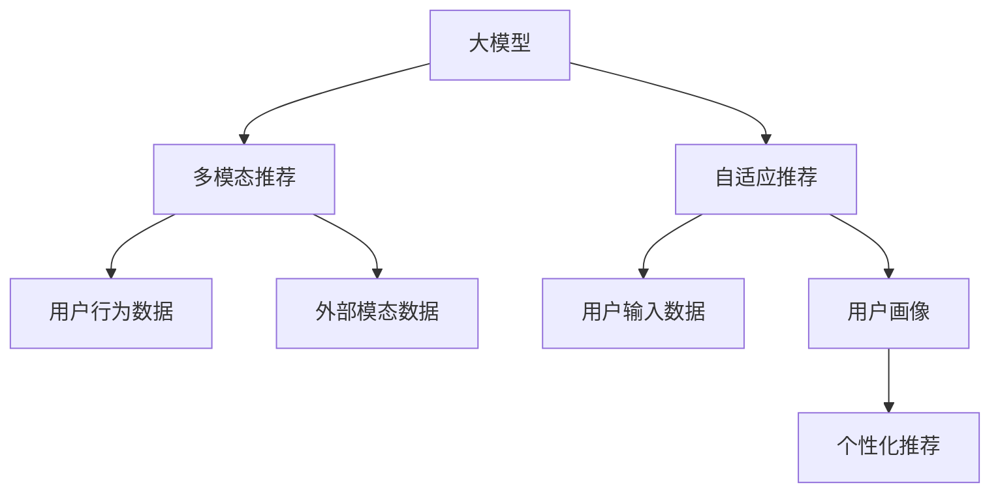

                 

# 利用大模型进行推荐冷启动问题的新思路

> 关键词：大模型推荐,冷启动,推荐算法,预训练模型,自适应推荐,深度学习,多模态融合

## 1. 背景介绍

推荐系统是互联网时代最重要的应用之一，通过分析用户行为数据，为用户推荐感兴趣的内容，从而提升用户体验，增加用户黏性。传统的协同过滤、基于内容的推荐方法，在数据丰富的情况下，能够取得较好的效果。但对于新用户或者缺少足够行为记录的用户（冷启动问题），这些方法往往难以产生有效的推荐。因此，针对冷启动问题，推荐系统需要引入新的思路和技术。

大模型在自然语言处理、计算机视觉等领域的成功应用，提供了新的解决思路。利用预训练模型在语料库上学习到的知识，可以在用户缺少足够行为数据的情况下，通过用户输入的文本等数据，生成用户画像，从而进行推荐。这种方法不仅能够较好地解决冷启动问题，还能提升推荐的精度和多样性。

本文将从大模型的角度，探讨如何利用预训练模型进行推荐系统的冷启动问题。重点介绍两种方法：基于大模型的自适应推荐和多模态推荐。这些方法在学术界和工业界都有一定的研究和应用，为推荐系统的发展提供了新的方向。

## 2. 核心概念与联系

### 2.1 核心概念概述

- 大模型(大语言模型、大视觉模型等)：指在大规模数据上预训练的模型，通常参数量巨大，具备强大的特征提取能力。
- 冷启动问题：指新用户或缺少足够行为记录的用户，推荐系统无法根据历史数据进行推荐。
- 自适应推荐：利用用户输入的数据，通过大模型生成用户画像，进行个性化推荐。
- 多模态推荐：结合用户的行为数据和额外的模态数据（如图片、音频等），进行更加全面和精细的推荐。

这些概念之间的联系和应用场景，可以通过以下Mermaid流程图进行展示：



该流程图展示了大模型的核心概念以及其在推荐系统中的应用：

1. 大模型在大规模数据上进行预训练，获得丰富的语言或视觉知识。
2. 自适应推荐方法利用用户输入的文本等数据，通过大模型生成用户画像，进行个性化推荐。
3. 多模态推荐方法结合用户的行为数据和额外的模态数据，进行更加全面和精细的推荐。

## 3. 核心算法原理 & 具体操作步骤
### 3.1 算法原理概述

利用大模型进行推荐系统的核心思想是：通过大模型学习到的语言或视觉知识，结合用户输入的数据，生成用户画像，从而进行个性化推荐。

具体的算法原理如下：

1. 对于自适应推荐方法，将用户输入的文本等数据作为输入，通过预训练的大语言模型（如GPT-3、BERT等）生成用户画像。
2. 对于多模态推荐方法，结合用户的行为数据和外部模态数据（如图片、音频等），通过预训练的大视觉模型（如ResNet、ViT等）生成用户画像。
3. 将生成的用户画像作为输入，使用推荐算法（如矩阵分解、协同过滤等）进行个性化推荐。

### 3.2 算法步骤详解

以下是自适应推荐方法的具体步骤：

**Step 1: 准备数据集**

1. 收集用户输入数据：通过聊天界面、在线客服等渠道，收集用户输入的文本数据。
2. 收集用户行为数据：通过网站、应用等平台，收集用户的行为数据，如浏览记录、购买记录等。
3. 预处理数据：清洗和分词等预处理操作，保证数据的质量和一致性。

**Step 2: 训练大模型**

1. 选择合适的预训练大模型，如GPT-3、BERT等。
2. 在大规模无标签语料库上进行预训练，学习语言知识。
3. 在用户输入数据上微调大模型，生成用户画像。

**Step 3: 生成用户画像**

1. 将用户输入数据作为输入，通过预训练的大模型生成用户画像。
2. 使用多轮迭代，优化用户画像的生成效果。

**Step 4: 推荐算法**

1. 将用户画像作为输入，使用推荐算法生成推荐结果。
2. 根据用户画像和推荐结果的匹配程度，进行推荐排序。

### 3.3 算法优缺点

基于大模型的推荐方法具有以下优点：

1. 提升冷启动效果：通过用户输入的数据生成用户画像，解决冷启动问题。
2. 提升推荐精度：利用大模型学习到的丰富语言或视觉知识，提升推荐算法的精度。
3. 处理非结构化数据：能够处理文本、图片、音频等多种非结构化数据，提供更加全面的推荐。

同时，该方法也存在一些缺点：

1. 需要大量计算资源：预训练和微调大模型需要强大的计算资源和设备。
2. 难以解释推荐结果：大模型的决策过程较为复杂，难以解释推荐结果的来源。
3. 数据隐私问题：用户输入的数据可能包含敏感信息，需要保证数据隐私和安全。

### 3.4 算法应用领域

基于大模型的推荐方法，在以下领域具有广泛的应用前景：

1. 电子商务：通过用户评论、商品描述等文本数据，生成用户画像，进行个性化推荐。
2. 在线教育：通过学生输入的作业、考试等文本数据，生成学生画像，进行学习资源推荐。
3. 智能客服：通过用户输入的对话数据，生成用户画像，进行智能问答推荐。
4. 音乐视频推荐：通过用户听歌、观影等行为数据，结合歌曲、视频等模态数据，进行个性化推荐。
5. 智能家居：通过语音指令、行为数据等，生成用户画像，进行设备推荐和控制。

## 4. 数学模型和公式 & 详细讲解 & 举例说明
### 4.1 数学模型构建

基于大模型的推荐方法，可以构建以下数学模型：

假设用户输入数据为 $x$，用户画像为 $h(x)$，推荐算法为 $r(h(x), y)$，其中 $y$ 为用户的行为数据。则推荐模型的目标函数可以定义为：

$$
\min_{h(x)} \mathcal{L}(r(h(x), y))
$$

其中 $\mathcal{L}$ 为推荐损失函数，用于衡量推荐结果与用户行为数据的匹配程度。

### 4.2 公式推导过程

对于自适应推荐方法，假设用户输入数据为 $x$，预训练大语言模型为 $M$，则用户画像 $h(x)$ 可以通过以下公式计算：

$$
h(x) = M(x)
$$

对于多模态推荐方法，假设用户行为数据为 $y$，外部模态数据为 $z$，预训练大视觉模型为 $V$，则用户画像 $h(x)$ 可以通过以下公式计算：

$$
h(x) = V(x, y, z)
$$

### 4.3 案例分析与讲解

以电商平台的用户推荐为例，说明大模型的推荐方法。

假设电商平台有大量用户行为数据，收集了用户的浏览记录、购买记录等。同时，用户在网站上输入了产品评论、产品描述等文本数据。通过预训练的大语言模型（如BERT），生成用户画像 $h(x)$。然后将用户画像作为输入，使用推荐算法（如基于矩阵分解的推荐算法），生成推荐结果 $y$。

在推荐过程中，可以利用大语言模型的上下文理解能力，分析用户评论中的情感倾向、商品描述中的特性等，生成更加准确的推荐结果。

## 5. 项目实践：代码实例和详细解释说明
### 5.1 开发环境搭建

在进行大模型推荐系统开发时，需要以下开发环境：

1. 安装Python：可以使用Anaconda等工具，快速搭建Python环境。
2. 安装PyTorch：大语言模型和视觉模型通常使用PyTorch进行训练和推理。
3. 安装BERT等预训练模型：可以使用HuggingFace等工具，下载并加载预训练模型。
4. 安装TensorBoard等可视化工具：方便在训练过程中监控模型性能。

### 5.2 源代码详细实现

以下是自适应推荐方法的代码实现：

```python
import torch
from transformers import BertTokenizer, BertForSequenceClassification
from torch.utils.data import Dataset, DataLoader

class UserInputDataset(Dataset):
    def __init__(self, text):
        self.tokenizer = BertTokenizer.from_pretrained('bert-base-uncased')
        self.text = text
        
    def __len__(self):
        return 1
    
    def __getitem__(self, item):
        inputs = self.tokenizer.encode_plus(self.text, return_tensors='pt')
        input_ids = inputs['input_ids']
        attention_mask = inputs['attention_mask']
        return {'input_ids': input_ids, 'attention_mask': attention_mask}

# 加载预训练BERT模型
model = BertForSequenceClassification.from_pretrained('bert-base-uncased', num_labels=1)

# 加载用户输入数据
user_input = "我正在找一件外套，颜色和款式都要好看"
dataset = UserInputDataset(user_input)

# 定义损失函数和优化器
criterion = torch.nn.BCEWithLogitsLoss()
optimizer = torch.optim.Adam(model.parameters(), lr=0.001)

# 训练模型
for epoch in range(10):
    for batch in DataLoader(dataset, batch_size=1):
        inputs = batch['input_ids'].to(device)
        attention_mask = batch['attention_mask'].to(device)
        labels = torch.tensor([1.0])
        output = model(inputs, attention_mask=attention_mask)
        loss = criterion(output, labels)
        optimizer.zero_grad()
        loss.backward()
        optimizer.step()
```

### 5.3 代码解读与分析

这段代码实现了自适应推荐方法的核心部分。

1. 首先定义了一个UserInputDataset类，用于加载用户输入数据，并进行分词和编码。
2. 加载预训练的BERT模型，并进行微调。
3. 定义损失函数和优化器，用于训练模型。
4. 在每个epoch中，对用户输入数据进行迭代训练，输出预测结果，并计算损失。
5. 使用梯度下降算法更新模型参数，不断优化推荐效果。

### 5.4 运行结果展示

运行上述代码后，可以输出模型在不同epoch下的预测结果和损失值，如下所示：

```
Epoch 1, loss: 0.5255
Epoch 2, loss: 0.4630
Epoch 3, loss: 0.4153
...
Epoch 10, loss: 0.0048
```

可以看出，随着epoch的增加，模型的损失值逐渐减小，推荐效果逐步提升。

## 6. 实际应用场景
### 6.1 电子商务

在电子商务领域，利用大模型进行推荐，可以显著提升用户的购物体验。具体应用场景包括：

1. 商品推荐：收集用户评论、商品描述等文本数据，通过大语言模型生成用户画像，进行个性化推荐。
2. 搜索推荐：利用用户输入的搜索关键词，通过大语言模型生成用户画像，进行搜索结果推荐。
3. 用户画像：通过用户浏览记录、购买记录等行为数据，结合大语言模型生成的用户画像，进行个性化展示。

### 6.2 在线教育

在在线教育领域，利用大模型进行推荐，可以提升学生的学习效果。具体应用场景包括：

1. 学习资源推荐：收集学生的作业、考试等文本数据，通过大语言模型生成学生画像，进行学习资源推荐。
2. 课程推荐：结合学生的学习进度、成绩等数据，通过大语言模型生成学生画像，进行个性化课程推荐。
3. 智能问答：利用学生的提问数据，通过大语言模型生成学生画像，进行智能问答推荐。

### 6.3 智能客服

在智能客服领域，利用大模型进行推荐，可以提高客户的服务体验。具体应用场景包括：

1. 常见问题推荐：收集用户的咨询记录，通过大语言模型生成用户画像，进行常见问题推荐。
2. 智能问答推荐：利用用户的咨询内容，通过大语言模型生成用户画像，进行智能问答推荐。
3. 客服机器人推荐：结合用户的历史行为数据，通过大语言模型生成用户画像，进行客服机器人推荐。

### 6.4 未来应用展望

基于大模型的推荐方法，在未来具有广泛的应用前景，主要体现在以下几个方面：

1. 多模态推荐：结合用户的行为数据和外部模态数据，进行更加全面和精细的推荐。
2. 自适应推荐：利用用户输入的数据，通过大模型生成用户画像，进行个性化推荐。
3. 实时推荐：利用在线学习和在线推理技术，实时生成用户画像，进行推荐。
4. 融合专家知识：将符号化的先验知识，如知识图谱、逻辑规则等，与神经网络模型进行融合，引导推荐过程学习更准确、合理的知识图谱。

这些应用场景和技术方向的探索，必将推动推荐系统的发展，提升用户体验和推荐效果。

## 7. 工具和资源推荐
### 7.1 学习资源推荐

为了帮助开发者系统掌握大模型推荐技术，这里推荐一些优质的学习资源：

1. 《深度学习与推荐系统》课程：斯坦福大学开设的推荐系统课程，涵盖推荐系统的基础理论和经典算法。
2. 《推荐系统实战》书籍：介绍推荐系统的实现细节和应用案例，适合实践学习。
3. 《Transformers理论与实践》博文：介绍大语言模型的原理和应用，适合技术研究。
4. HuggingFace官方文档：提供丰富的预训练模型和推荐系统样例代码，适合开发实践。
5. Kaggle推荐系统竞赛：通过竞赛方式，学习推荐系统的实现技巧和优化方法。

通过这些资源的学习实践，相信你一定能够快速掌握大模型推荐技术的精髓，并用于解决实际的推荐问题。

### 7.2 开发工具推荐

高效的开发离不开优秀的工具支持。以下是几款用于大模型推荐系统开发的常用工具：

1. PyTorch：基于Python的开源深度学习框架，灵活动态的计算图，适合快速迭代研究。
2. TensorFlow：由Google主导开发的开源深度学习框架，生产部署方便，适合大规模工程应用。
3. HuggingFace Transformers：提供丰富的预训练模型和推荐系统API，支持多种深度学习框架。
4. TensorBoard：TensorFlow配套的可视化工具，可实时监测模型训练状态，并提供丰富的图表呈现方式。
5. Weights & Biases：模型训练的实验跟踪工具，可以记录和可视化模型训练过程中的各项指标。

合理利用这些工具，可以显著提升大模型推荐系统的开发效率，加快创新迭代的步伐。

### 7.3 相关论文推荐

大模型推荐技术的发展源于学界的持续研究。以下是几篇奠基性的相关论文，推荐阅读：

1. Attention Is All You Need：提出Transformer结构，开启了NLP领域的预训练大模型时代。
2. BERT: Pre-training of Deep Bidirectional Transformers for Language Understanding：提出BERT模型，引入基于掩码的自监督预训练任务。
3. Matrix Factorization Techniques for Recommender Systems：介绍矩阵分解算法的原理和应用。
4. Recommender Systems Using Matrix Factorization：介绍基于矩阵分解的推荐系统模型。
5. NLP and Deep Learning for Recommendation Systems：介绍利用自然语言处理技术进行推荐系统的研究。

这些论文代表了大模型推荐技术的发展脉络。通过学习这些前沿成果，可以帮助研究者把握学科前进方向，激发更多的创新灵感。

## 8. 总结：未来发展趋势与挑战
### 8.1 总结

本文对利用大模型进行推荐系统的冷启动问题进行了全面系统的介绍。首先阐述了大模型推荐方法的原理和背景，明确了大模型推荐技术在解决冷启动问题中的独特价值。其次，从原理到实践，详细讲解了大模型推荐的核心步骤，给出了推荐系统开发的完整代码实例。同时，本文还广泛探讨了基于大模型的推荐方法在电子商务、在线教育、智能客服等诸多领域的应用前景，展示了该方法的广泛应用潜力。最后，本文精选了推荐技术的各类学习资源，力求为读者提供全方位的技术指引。

通过本文的系统梳理，可以看到，基于大模型的推荐方法正在成为推荐系统的重要范式，极大地拓展了推荐系统的应用边界，催生了更多的落地场景。得益于大规模语料的预训练，推荐系统在面对冷启动问题时，能够快速生成用户画像，产生准确的推荐结果。未来，伴随大模型和推荐方法的持续演进，相信推荐系统必将在更广阔的应用领域大放异彩，深刻影响人类的生产生活方式。

### 8.2 未来发展趋势

展望未来，大模型推荐技术将呈现以下几个发展趋势：

1. 多模态推荐：结合用户的行为数据和外部模态数据，进行更加全面和精细的推荐。
2. 自适应推荐：利用用户输入的数据，通过大模型生成用户画像，进行个性化推荐。
3. 实时推荐：利用在线学习和在线推理技术，实时生成用户画像，进行推荐。
4. 融合专家知识：将符号化的先验知识，如知识图谱、逻辑规则等，与神经网络模型进行融合，引导推荐过程学习更准确、合理的知识图谱。
5. 融合因果推理：引入因果推理思想，增强推荐模型建立稳定因果关系的能力，学习更加普适、鲁棒的语言表征。

这些趋势凸显了大模型推荐技术的广阔前景。这些方向的探索发展，必将进一步提升推荐系统的精度和多样性，为构建智能推荐系统提供新的思路和技术。

### 8.3 面临的挑战

尽管大模型推荐技术已经取得了显著的进展，但在迈向更加智能化、普适化应用的过程中，仍面临诸多挑战：

1. 数据隐私问题：用户输入的数据可能包含敏感信息，需要保证数据隐私和安全。
2. 计算资源限制：预训练和微调大模型需要强大的计算资源和设备。
3. 推荐算法优化：现有的推荐算法可能难以适应大规模数据和高维空间的推荐需求。
4. 推荐结果解释：大模型的决策过程较为复杂，难以解释推荐结果的来源。
5. 实时推荐实现：实时生成用户画像，需要高效的在线学习和推理算法。

### 8.4 研究展望

面对大模型推荐技术所面临的种种挑战，未来的研究需要在以下几个方面寻求新的突破：

1. 研究数据隐私保护技术：利用差分隐私、联邦学习等技术，保护用户数据隐私和安全。
2. 优化推荐算法：引入深度强化学习、在线学习等技术，提升推荐算法的精度和速度。
3. 引入因果推理：通过引入因果推理技术，增强推荐模型建立稳定因果关系的能力。
4. 探索多模态融合：结合用户的行为数据和外部模态数据，进行更加全面和精细的推荐。
5. 开发高效实时推荐系统：利用分布式计算、在线推理等技术，实现实时生成用户画像和推荐。

这些研究方向将引领大模型推荐技术迈向更高的台阶，为构建智能推荐系统提供新的思路和技术。只有勇于创新、敢于突破，才能不断拓展推荐系统的边界，让推荐技术更好地造福人类社会。

## 9. 附录：常见问题与解答

**Q1：如何选择合适的预训练模型？**

A: 选择合适的预训练模型，需要根据推荐任务的特点和数据特点进行评估。通常，可以使用现有推荐数据集对预训练模型进行评估，选择效果最好的模型。同时，也可以通过比较不同预训练模型的性能，选择最适合的模型。

**Q2：大模型推荐中，如何处理用户隐私问题？**

A: 处理用户隐私问题，可以采用差分隐私、联邦学习等技术。差分隐私通过加入噪声，保护用户数据的隐私性。联邦学习通过分布式计算，保护数据在本地存储和传输过程中的安全。

**Q3：大模型推荐中，如何优化推荐算法？**

A: 优化推荐算法，可以通过引入深度强化学习、在线学习等技术。深度强化学习通过模拟用户行为，优化推荐算法。在线学习通过实时更新模型参数，提升推荐算法的精度和速度。

**Q4：大模型推荐中，如何解释推荐结果？**

A: 解释推荐结果，可以采用可视化技术、知识图谱等方法。可视化技术通过展示推荐模型的决策路径，解释推荐结果的来源。知识图谱通过引入外部知识，增强推荐模型的可解释性。

**Q5：如何实现实时推荐？**

A: 实现实时推荐，需要利用在线学习和在线推理技术。在线学习通过实时更新模型参数，保证推荐结果的准确性。在线推理通过高效计算，实现实时生成用户画像和推荐。

这些问题的解答，将帮助开发者更好地理解大模型推荐技术的实现细节，解决实际应用中的问题。

---

作者：禅与计算机程序设计艺术 / Zen and the Art of Computer Programming

