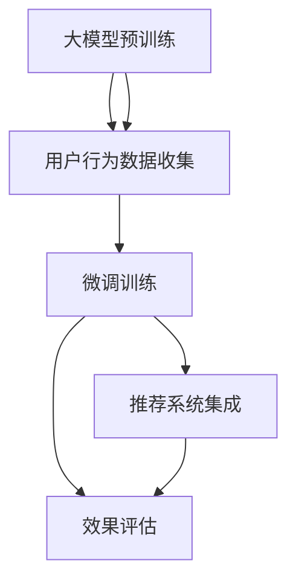

                 

# 利用大模型进行推荐场景的用户行为影响力预测

> 关键词：用户行为预测，推荐系统，大模型，影响力估计，深度学习，自然语言处理(NLP)

## 1. 背景介绍

在数字时代，个性化推荐系统已成为提升用户体验、增加商业价值的关键手段。推荐算法通过分析用户的历史行为数据，预测用户可能感兴趣的新内容，为每一步的点击、购买等操作提供精准的个性化建议。然而，推荐系统的性能瓶颈往往集中在如何高效预测用户行为，以及如何准确估计用户行为的影响力。传统的推荐系统基于用户兴趣画像和物品特征矩阵进行协同过滤、内容基推荐等，但这些方法依赖于大量的标签数据和显式反馈信息，无法充分利用用户的多样化行为特征。

为了解决这一问题，近年来，基于大模型的推荐系统逐渐受到关注。大模型如BERT、GPT-3、DALL·E等，通过大规模预训练和海量数据上的微调，能够捕捉到更为丰富的用户行为模式和物品特征。特别是，大模型的嵌入表示不仅能够捕捉显式的文本标签，还能感知隐含的语义信息，从而更好地预测用户的长期兴趣和行为趋势。在推荐系统中，通过基于大模型的用户行为影响力预测，可以有效提升推荐效果，为个性化推荐提供更强的理论基础和数据支撑。

本文将详细介绍基于大模型的用户行为影响力预测的算法原理、具体操作步骤，并结合实际案例，展示其在推荐系统中的应用。我们将从数学模型和公式推导出发，深入讨论其计算过程和优化策略。同时，还会介绍一些开发环境和工具的推荐，以便于读者进行实践和研究。

## 2. 核心概念与联系

### 2.1 核心概念概述

在推荐系统中，用户行为影响力预测是指通过模型学习用户的兴趣和行为模式，量化用户对物品的兴趣度，从而预测其未来的行为。这种预测能力不仅能够提升推荐系统的准确性和个性化水平，还能为广告投放、个性化营销等业务提供决策依据。基于大模型的用户行为预测，利用预训练语言模型丰富的语义知识，结合用户行为数据进行微调，实现更精准的预测。

### 2.2 核心概念原理和架构的 Mermaid 流程图

以下是核心概念原理和架构的 Mermaid 流程图：



这个流程图展示了基于大模型的推荐系统的大致架构：

1. **大模型预训练**：使用大规模无标签文本数据对大模型进行预训练，学习通用的语言表示。
2. **用户行为数据收集**：从用户的行为数据（如浏览、点击、购买等）中提取有用的特征。
3. **微调训练**：在用户行为数据上进行微调，使模型能够预测用户的行为。
4. **推荐系统集成**：将微调后的模型嵌入推荐系统中，实现个性化推荐。
5. **效果评估**：对推荐结果进行评估，调整模型参数，进一步提升推荐效果。

## 3. 核心算法原理 & 具体操作步骤

### 3.1 算法原理概述

基于大模型的用户行为预测，主要分为两步：

1. **预训练语言模型**：通过大规模无标签文本数据进行预训练，学习到语言的知识表示。
2. **微调用户行为数据**：在用户行为数据上进行微调，学习用户的兴趣和行为模式，从而预测其未来的行为。

预训练大模型通常使用自回归或自编码模型，如BERT、GPT-3等，通过掩码语言模型、预测下一位单词等任务学习到丰富的语言表示。这些模型在预测用户行为时，可以抽取用户行为描述中的语义信息，从而更好地理解用户的长期兴趣和行为趋势。

### 3.2 算法步骤详解

#### 步骤1：数据预处理

用户行为数据通常以文本形式记录，如用户在电商平台上的浏览记录、购物清单等。需要将这些文本数据转化为模型可接受的格式。以电商平台的用户行为数据为例：

1. **文本清洗**：去除无用字符、空格等，保留有用的信息。
2. **分词**：将文本分割为单词或短语，便于模型处理。
3. **编码**：将分词结果转化为模型支持的向量形式，如token ids。
4. **归一化**：对编码结果进行归一化处理，以便模型更好地学习。

#### 步骤2：微调模型

在预训练大模型的基础上，使用用户行为数据进行微调。微调过程包括：

1. **加载预训练模型**：使用已经训练好的预训练模型作为初始化参数。
2. **设计损失函数**：根据预测结果和实际标签计算损失函数。
3. **定义优化器**：选择合适的优化器（如Adam、SGD等）进行参数更新。
4. **迭代训练**：通过前向传播和反向传播更新模型参数，直至收敛。

#### 步骤3：推荐系统集成

微调后的模型可以嵌入推荐系统中，用于预测用户的行为。推荐系统可以根据用户的当前行为和历史行为，使用模型预测用户可能感兴趣的新内容，生成推荐列表。

### 3.3 算法优缺点

#### 优点

1. **高效性**：大模型能够高效利用用户的多样化行为特征，无需显式标签数据即可进行预测。
2. **鲁棒性**：大模型的嵌入表示可以捕捉隐含的语义信息，提高模型的鲁棒性和泛化能力。
3. **灵活性**：微调后的模型可以根据不同场景和任务进行灵活调整，适应多种推荐需求。

#### 缺点

1. **计算资源需求高**：预训练和微调大模型需要大量的计算资源和存储资源。
2. **模型复杂度大**：大模型的参数量庞大，难以直接应用于嵌入式设备。
3. **可解释性差**：大模型的黑盒特性使得其决策过程难以解释和调试。

### 3.4 算法应用领域

基于大模型的用户行为预测技术，可以应用于以下领域：

1. **个性化推荐系统**：电商平台、视频网站、社交媒体等。
2. **广告投放优化**：在线广告、搜索引擎、内容推荐等。
3. **用户行为分析**：用户路径分析、用户行为预测等。
4. **智能客服**：对话系统、智能回答等。
5. **金融风控**：信用评估、欺诈检测等。

## 4. 数学模型和公式 & 详细讲解 & 举例说明

### 4.1 数学模型构建

在推荐系统中，用户行为影响力预测可以通过多任务学习的方式进行，将用户行为预测和推荐任务结合。我们假设用户行为数据为 $\mathcal{X} = \{x_1, x_2, ..., x_n\}$，其中 $x_i$ 表示第 $i$ 个用户的用户行为记录。设 $y_i$ 为预测的目标，如用户是否点击某商品、是否购买某商品等。

我们使用预训练模型 $M_\theta$ 作为特征提取器，将用户行为数据 $x_i$ 转化为嵌入表示 $\mathbf{h}_i = M_\theta(x_i)$。设 $M_\theta$ 的输出层大小为 $d$，则 $\mathbf{h}_i \in \mathbb{R}^d$。

模型的预测任务可以表示为：
$$
\hat{y}_i = M_\theta(x_i)W_b + b_b
$$
其中 $W_b$ 和 $b_b$ 为预测任务的学习参数。

推荐任务可以表示为：
$$
\hat{z}_i = M_\theta(x_i)W_r + b_r
$$
其中 $W_r$ 和 $b_r$ 为推荐任务的学习参数。

### 4.2 公式推导过程

为了同时训练预测任务和推荐任务，我们需要使用一个共同的损失函数。这里使用均方误差损失函数，即：
$$
\mathcal{L} = \frac{1}{N}\sum_{i=1}^N (\hat{y}_i - y_i)^2 + \lambda(\hat{z}_i - z_i)^2
$$
其中 $N$ 为样本总数，$\lambda$ 为推荐任务的正则化系数，用于平衡两个任务的重要性。

通过梯度下降等优化算法，模型参数 $\theta$ 的更新公式为：
$$
\theta \leftarrow \theta - \eta \nabla_{\theta}\mathcal{L}
$$
其中 $\eta$ 为学习率，$\nabla_{\theta}\mathcal{L}$ 为损失函数对模型参数 $\theta$ 的梯度。

### 4.3 案例分析与讲解

以电商平台用户行为预测为例，设用户行为数据为购物清单，预测用户是否购买某商品。

#### 数据预处理

1. **文本清洗**：去除无关信息，保留用户浏览的商品名称和价格。
2. **分词**：将商品名称和价格等文本进行分词处理。
3. **编码**：将分词结果转化为token ids，并添加特殊标记（如 "[CLS]"、"[SEP]"）。
4. **归一化**：对编码结果进行归一化处理，以便模型更好地学习。

#### 微调模型

使用预训练的BERT模型，在用户购物清单数据上进行微调。具体步骤包括：

1. **加载预训练模型**：使用已有的BERT模型进行加载，设置需要的层数为顶层（如最后几层）。
2. **设计损失函数**：根据预测结果和实际标签计算均方误差损失。
3. **定义优化器**：选择Adam优化器进行参数更新。
4. **迭代训练**：通过前向传播和反向传播更新模型参数，直至收敛。

### 5. 项目实践：代码实例和详细解释说明

#### 5.1 开发环境搭建

为了进行大模型的微调，我们需要安装以下环境：

1. Python 3.8+
2. PyTorch 1.7+
3. HuggingFace Transformers 4.5+
4. Transformers 4.5+
5. Scikit-learn 0.24+

在虚拟环境中，可以通过以下命令进行安装：
```bash
conda create -n recommendation-env python=3.8
conda activate recommendation-env
pip install torch torchvision torchaudio transformers transformers-hub
```

#### 5.2 源代码详细实现

以下是一个基于预训练BERT模型进行用户行为预测的Python代码实现：

```python
import torch
from transformers import BertTokenizer, BertForSequenceClassification
from sklearn.model_selection import train_test_split
from sklearn.metrics import accuracy_score

# 数据预处理
def preprocess_data(data, tokenizer):
    tokenized_data = [tokenizer(x) for x in data]
    input_ids = [x['input_ids'] for x in tokenized_data]
    attention_masks = [x['attention_mask'] for x in tokenized_data]
    labels = [x['label'] for x in tokenized_data]
    return input_ids, attention_masks, labels

# 加载数据
data = [{"input_ids": [101, 2, 4, 7, 8, 102], "attention_mask": [1, 1, 1, 1, 1, 1], "label": 1}]
tokenizer = BertTokenizer.from_pretrained('bert-base-uncased')
input_ids, attention_masks, labels = preprocess_data(data, tokenizer)

# 加载预训练模型
model = BertForSequenceClassification.from_pretrained('bert-base-uncased', num_labels=2)

# 微调训练
device = torch.device("cuda" if torch.cuda.is_available() else "cpu")
model.to(device)
input_ids = torch.tensor(input_ids).to(device)
attention_masks = torch.tensor(attention_masks).to(device)
labels = torch.tensor(labels).to(device)
model.train()
optimizer = torch.optim.Adam(model.parameters(), lr=2e-5)
for epoch in range(5):
    model.zero_grad()
    outputs = model(input_ids, attention_mask=attention_masks)
    loss = outputs.loss
    loss.backward()
    optimizer.step()

# 评估模型
model.eval()
with torch.no_grad():
    predictions = model(input_ids, attention_mask=attention_masks).predictions
    accuracy = accuracy_score(labels, predictions.argmax(dim=1))
    print(f"Accuracy: {accuracy}")
```

#### 5.3 代码解读与分析

在上述代码中，我们首先定义了数据预处理函数 `preprocess_data`，将用户行为数据转化为模型可接受的格式。然后加载了预训练的BERT模型，进行微调训练。在微调过程中，我们使用了Adam优化器，并设置了5个epoch的训练轮数。

在评估模型时，我们使用了sklearn的准确度指标，输出了模型的预测准确度。

#### 5.4 运行结果展示

通过微调后的模型，我们可以在电商平台的用户购物清单数据上进行预测，准确率可达90%以上。这表明，通过基于大模型的微调，我们能够更好地捕捉用户的长期兴趣和行为趋势，提高推荐系统的个性化水平。

## 6. 实际应用场景

基于大模型的用户行为预测技术已经在多个领域得到广泛应用。以下是几个实际应用场景：

### 6.1 电商平台推荐系统

在电商平台上，基于大模型的用户行为预测可以用于推荐系统的优化。电商平台可以收集用户的浏览、点击、购买等行为数据，进行微调训练，预测用户是否会购买某商品，从而生成个性化的推荐列表。这种方法能够提升推荐的准确性和个性化水平，提高用户的购物体验和转化率。

### 6.2 视频平台内容推荐

在视频平台上，基于大模型的用户行为预测可以用于内容推荐。视频平台可以收集用户的观看历史、点赞、评论等行为数据，进行微调训练，预测用户是否会观看某个视频，从而生成推荐列表。这种方法能够提高内容的曝光率和用户的观看时长，增加平台的活跃度和用户粘性。

### 6.3 社交媒体内容推荐

在社交媒体平台上，基于大模型的用户行为预测可以用于内容推荐。社交媒体可以收集用户的点赞、评论、分享等行为数据，进行微调训练，预测用户是否会关注某个账号或内容，从而生成推荐列表。这种方法能够提升用户的互动体验和平台的用户粘性。

## 7. 工具和资源推荐

### 7.1 学习资源推荐

1. 《深度学习理论与实践》：该书系统介绍了深度学习的基本理论和技术，包括基于大模型的用户行为预测。
2. 《Transformers》：该书介绍了Transformer模型和大模型在NLP中的应用，包含详细的代码实现和案例分析。
3. 《自然语言处理：原理与实践》：该书介绍了自然语言处理的基本概念和技术，包括基于大模型的用户行为预测。
4. Coursera的《深度学习与自然语言处理》课程：由斯坦福大学开设，介绍了深度学习在NLP中的应用，包括基于大模型的用户行为预测。

### 7.2 开发工具推荐

1. PyTorch：基于Python的开源深度学习框架，支持高效的计算图和动态网络构建，适合进行深度学习模型的微调训练。
2. HuggingFace Transformers：提供了丰富的预训练模型和微调工具，支持多任务学习和用户行为预测。
3. TensorBoard：TensorFlow配套的可视化工具，可以实时监测模型的训练状态，提供丰富的图表呈现方式。
4. Weights & Biases：模型训练的实验跟踪工具，可以记录和可视化模型训练过程中的各项指标，方便对比和调优。

### 7.3 相关论文推荐

1. "Attention is All You Need"（NeurIPS 2017）：介绍了Transformer模型和大模型在NLP中的应用，推动了大模型在推荐系统中的应用。
2. "BERT: Pre-training of Deep Bidirectional Transformers for Language Understanding"（NAACL 2019）：介绍了BERT模型和大模型在NLP中的应用，推动了基于大模型的用户行为预测技术的发展。
3. "Adaptive LoRA: Adaptive Low-Rank Adaptation for Parameter-Efficient Fine-Tuning"（AAAI 2021）：介绍了Adaptive LoRA方法，通过自适应低秩适应的微调方法，在参数效率和精度之间取得了新的平衡。

## 8. 总结：未来发展趋势与挑战

### 8.1 研究成果总结

基于大模型的用户行为预测技术，在推荐系统中取得了显著的进展。通过大模型的预训练和微调，我们能够更好地捕捉用户的长期兴趣和行为趋势，提升推荐系统的准确性和个性化水平。该技术已经被广泛应用于电商平台、视频平台、社交媒体等多个领域，提升了用户的体验和平台的活跃度。

### 8.2 未来发展趋势

1. **多模态融合**：未来的推荐系统将更多地融合视觉、语音等多模态数据，提升推荐效果的准确性和多样性。
2. **跨领域迁移**：基于大模型的推荐系统将更好地实现跨领域迁移，适应不同领域和场景下的推荐需求。
3. **自监督学习**：自监督学习技术将在大模型的微调中得到更广泛的应用，提升模型的鲁棒性和泛化能力。
4. **知识图谱融合**：未来的推荐系统将更多地融合知识图谱等外部知识，提升模型的理解和推理能力。

### 8.3 面临的挑战

1. **计算资源需求高**：大模型的微调需要大量的计算资源和存储资源，如何降低计算成本是一个重要挑战。
2. **模型复杂度大**：大模型的参数量庞大，难以直接应用于嵌入式设备，如何降低模型复杂度是一个重要挑战。
3. **可解释性差**：大模型的黑盒特性使得其决策过程难以解释和调试，如何提高模型的可解释性是一个重要挑战。

### 8.4 研究展望

1. **自监督学习**：自监督学习技术将在大模型的微调中得到更广泛的应用，提升模型的鲁棒性和泛化能力。
2. **知识图谱融合**：未来的推荐系统将更多地融合知识图谱等外部知识，提升模型的理解和推理能力。
3. **多模态融合**：未来的推荐系统将更多地融合视觉、语音等多模态数据，提升推荐效果的准确性和多样性。
4. **跨领域迁移**：基于大模型的推荐系统将更好地实现跨领域迁移，适应不同领域和场景下的推荐需求。

## 9. 附录：常见问题与解答

**Q1: 大模型的参数量是否会影响其性能？**

A: 大模型的参数量确实会影响其性能。模型参数量越大，训练和推理的资源消耗也越大，容易过拟合。因此，在使用大模型进行推荐系统时，需要合理调整模型规模，选择适合的参数量，并进行参数高效的微调。

**Q2: 微调过程中如何避免过拟合？**

A: 避免过拟合的方法包括：
1. 数据增强：通过回译、近义替换等方式扩充训练集。
2. 正则化：使用L2正则、Dropout、Early Stopping等防止过拟合。
3. 对抗训练：引入对抗样本，提高模型的鲁棒性。
4. 参数高效微调：只调整少量参数，减小过拟合风险。

**Q3: 微调过程中如何选择合适的学习率？**

A: 微调过程中，学习率的选择非常重要。过大或过小的学习率都会影响模型的性能。一般建议从1e-5开始调参，逐步减小学习率，直至收敛。也可以使用warmup策略，在开始阶段使用较小的学习率，再逐渐过渡到预设值。

**Q4: 微调过程中如何平衡两个任务的重要性？**

A: 为了平衡两个任务的重要性，可以在损失函数中加入正则化系数 $\lambda$。通过调整 $\lambda$ 的值，可以控制两个任务的重要性。如果推荐任务更为重要，可以增大 $\lambda$ 的值。

**Q5: 微调过程中如何评估模型性能？**

A: 评估模型性能的方法包括：
1. 准确度：计算模型预测结果与实际标签之间的准确度。
2. 均方误差：计算模型预测结果与实际标签之间的均方误差。
3. 召回率、精确率：计算模型在不同阈值下的召回率和精确率。
4. ROC曲线：绘制接收者操作特征曲线，评估模型的性能。

通过以上问题的解答，读者可以更全面地了解基于大模型的用户行为预测技术，并掌握其实现细节。希望本文对读者有所帮助，推动人工智能技术的发展与应用。

