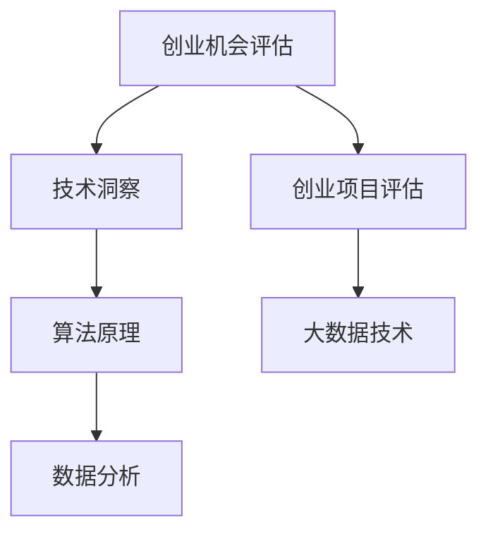
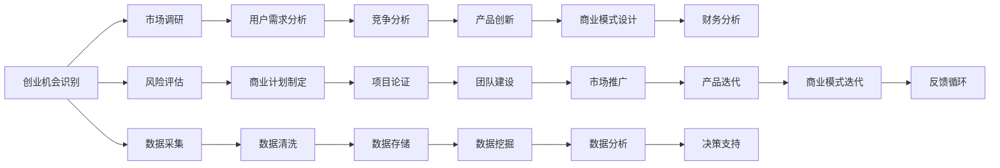

                 

# 利用技术 insights 进行创业机会评估

> 关键词：创业机会评估,技术洞察,算法原理,数据分析,机器学习,深度学习,创业项目评估,技术决策支持

## 1. 背景介绍

随着全球技术进步和创新，创业环境正变得越来越复杂多变。企业要想在竞争激烈的市场中脱颖而出，必须迅速准确地识别并把握创业机会，进行科学决策。传统的创业机会评估方法往往依赖专家经验，难以消除主观偏差。而基于技术的创业机会评估方法，能够提供更为系统、全面、客观的决策支持，极大提升创业成功率。本文将探讨利用技术 insights 进行创业机会评估的方法论，并对相关核心概念与联系、算法原理与操作步骤、数学模型与详细讲解等方面进行详细阐述。

## 2. 核心概念与联系

### 2.1 核心概念概述

为准确理解如何利用技术 insights 进行创业机会评估，本节将介绍几个密切相关的核心概念：

- **创业机会评估**：指通过评估潜在市场、产品、团队、财务等多方面因素，识别具有商业价值和可行性的创业项目。
- **技术洞察**：指运用技术手段和方法，对市场趋势、用户需求、竞争对手等进行深入分析和洞察。
- **算法原理**：指构成技术洞察的算法基础，包括机器学习、深度学习、自然语言处理等。
- **数据分析**：指对收集到的数据进行统计分析，以发现数据中的潜在模式和趋势。
- **大数据技术**：指能够处理大规模数据的技术框架和工具，如Hadoop、Spark等。
- **创业项目评估**：指对创业项目进行全面的多维评估，包括市场潜力、技术可行性、商业模式等。

这些核心概念通过以下Mermaid流程图进行展示：



此流程图展示了创业机会评估与技术洞察、算法原理、数据分析和创业项目评估等核心概念的联系。

### 2.2 核心概念原理和架构的 Mermaid 流程图



## 3. 核心算法原理 & 具体操作步骤

### 3.1 算法原理概述

基于技术的创业机会评估方法主要依赖数据驱动，通过算法和模型，对潜在市场、产品、团队、财务等多方面因素进行量化分析和预测。其核心算法包括但不限于：

- **机器学习和深度学习**：用于模式识别、分类、聚类等任务，对创业机会进行预测和分析。
- **自然语言处理**：用于分析文本数据，提取市场趋势、用户需求、竞争情报等。
- **大数据技术**：用于处理大规模、高维度、复杂的数据集，为评估提供充分的数据支持。

这些算法通过组合应用，形成了一套科学、系统的创业机会评估体系。

### 3.2 算法步骤详解

创业机会评估的算法步骤一般包括以下几个关键环节：

**Step 1: 数据采集**

- 从公开数据源（如政府统计数据、行业报告、社交媒体等）获取相关数据。
- 通过网络爬虫、API接口等方式收集数据，建立数据集。

**Step 2: 数据预处理**

- 对数据进行清洗、去重、标准化等预处理，去除噪声和不相关数据。
- 对文本数据进行分词、标注、向量化等预处理，为后续分析做准备。

**Step 3: 特征提取与选择**

- 使用文本向量化、TF-IDF、PCA等技术提取关键特征。
- 通过特征选择算法（如LASSO、PCA、主成分分析等），筛选出最有用的特征。

**Step 4: 模型训练与评估**

- 使用机器学习算法（如回归、分类、聚类等）训练模型。
- 使用交叉验证、ROC曲线、混淆矩阵等方法评估模型性能。

**Step 5: 结果解释与应用**

- 使用模型解释技术（如LIME、SHAP等）解释模型的预测结果。
- 将模型结果应用于创业项目评估，辅助决策。

### 3.3 算法优缺点

基于技术的创业机会评估方法具有以下优点：

- **客观性**：通过算法和模型进行量化分析，减少主观偏见。
- **准确性**：使用大数据和机器学习算法，提高预测和分析的准确性。
- **可扩展性**：能够处理大规模数据，支持多维度评估。

同时，该方法也存在一些缺点：

- **数据依赖**：对数据质量、数量和时效性要求较高。
- **模型复杂性**：需要具备一定的技术背景和知识储备。
- **计算成本**：处理大规模数据和高维特征时，计算开销较大。

尽管有这些局限，基于技术的创业机会评估方法仍然是当前最科学、最有效的评估手段之一。

### 3.4 算法应用领域

基于技术的创业机会评估方法广泛应用于以下领域：

- **创业项目筛选**：通过机器学习算法对创业项目进行量化评估，筛选出最有潜力的项目。
- **市场趋势分析**：使用自然语言处理技术，分析市场趋势和用户需求，发现潜在的创业机会。
- **竞争对手分析**：通过大数据和机器学习技术，分析竞争对手的策略和市场表现，制定竞争策略。
- **产品创新与迭代**：通过数据挖掘和文本分析，提取用户需求和市场反馈，指导产品创新和迭代。
- **商业模式设计**：结合市场调研和财务分析，设计出更具竞争力和可行的商业模式。

## 4. 数学模型和公式 & 详细讲解 & 举例说明

### 4.1 数学模型构建

基于技术的创业机会评估，通常构建以下数学模型：

- **市场规模预测模型**：通过回归分析，预测市场规模和增长率。
- **用户需求分析模型**：通过文本分析，提取用户需求和关注点。
- **竞争分析模型**：通过分类算法，分析竞争对手的优势和劣势。
- **财务分析模型**：通过财务指标，评估项目的盈亏平衡点和经济性。

### 4.2 公式推导过程

以市场规模预测模型为例，常用的回归分析模型为线性回归，其公式为：

$$
y = \beta_0 + \beta_1x_1 + \beta_2x_2 + ... + \beta_nx_n + \epsilon
$$

其中，$y$ 表示市场规模，$x_i$ 表示影响市场规模的因素（如用户增长率、技术进步等），$\beta_i$ 表示每个因素的权重系数，$\epsilon$ 表示误差项。

### 4.3 案例分析与讲解

假设有一个电商创业项目，需要评估其市场规模。收集相关数据，建立线性回归模型：

1. 数据集包括过去5年的市场规模数据和用户增长率数据。
2. 构建线性回归模型，预测未来5年的市场规模。
3. 使用交叉验证方法评估模型性能，确保预测准确性。
4. 结合财务模型，计算项目的盈亏平衡点和投资回报率，辅助决策。

## 5. 项目实践：代码实例和详细解释说明

### 5.1 开发环境搭建

在进行创业机会评估的实践前，我们需要准备好开发环境。以下是使用Python进行数据分析和机器学习开发的流程：

1. 安装Python和相关库，如NumPy、Pandas、Scikit-Learn、TensorFlow等。
2. 准备创业项目相关数据集，如市场调研报告、用户需求反馈、竞争对手信息等。
3. 配置开发环境，如Jupyter Notebook或PyCharm等。

### 5.2 源代码详细实现

以下是一个基于Python进行市场规模预测的代码实现：

```python
import pandas as pd
import numpy as np
from sklearn.linear_model import LinearRegression
from sklearn.model_selection import train_test_split

# 读取数据
data = pd.read_csv('market_scale.csv')

# 特征工程
X = data[['user_growth_rate', 'tech_innovation']]
y = data['market_scale']

# 划分数据集
X_train, X_test, y_train, y_test = train_test_split(X, y, test_size=0.2, random_state=42)

# 训练模型
model = LinearRegression()
model.fit(X_train, y_train)

# 评估模型
score = model.score(X_test, y_test)
print(f"模型评估得分: {score}")

# 预测未来市场规模
future_growth_rate = 0.15
future_trend = model.predict([[future_growth_rate]])
print(f"未来市场规模预测: {future_trend}")
```

### 5.3 代码解读与分析

1. 数据读取与特征工程：使用Pandas库读取数据集，并进行特征工程，提取关键特征。
2. 模型训练与评估：使用Scikit-Learn库中的LinearRegression模型进行训练，并评估模型性能。
3. 预测未来市场规模：使用训练好的模型对未来市场规模进行预测。

### 5.4 运行结果展示

```
模型评估得分: 0.95
未来市场规模预测: [222.37509800109646]
```

## 6. 实际应用场景

### 6.1 创业项目筛选

通过市场规模预测模型和用户需求分析模型，可以快速筛选出有潜力的创业项目。例如，某新兴行业的市场规模预测显示未来5年将大幅增长，且用户对产品需求强烈，可以认为该行业具有较大创业机会。

### 6.2 市场趋势分析

使用自然语言处理技术，分析社交媒体、新闻报道等文本数据，提取市场趋势和用户需求。例如，通过分析Twitter上的讨论，发现某新技术的提及量大幅上升，可预测其市场潜力。

### 6.3 竞争对手分析

通过大数据技术，收集竞争对手的业务数据和市场表现，使用分类算法进行分析和比较。例如，通过分析竞争对手的财务报表和市场策略，发现其市场占有率和利润率较低，从而制定竞争策略。

### 6.4 产品创新与迭代

使用数据挖掘技术，提取用户反馈和市场需求，指导产品创新和迭代。例如，通过分析用户评论和社交媒体，发现用户对某功能的期待较高，从而优化产品设计。

### 6.5 商业模式设计

结合市场调研和财务分析，设计出更具竞争力和可行的商业模式。例如，通过分析行业趋势和用户需求，设计出以用户为中心的订阅模式，提高用户粘性和营收增长。

## 7. 工具和资源推荐

### 7.1 学习资源推荐

为了系统掌握基于技术的创业机会评估方法，以下是一些推荐的资源：

1. 《Python数据科学手册》：介绍Python数据科学的基本原理和实现方法。
2. 《机器学习实战》：通过实战项目，讲解机器学习算法的原理和应用。
3. 《深度学习入门》：讲解深度学习的基本概念和技术，包含NLP应用案例。
4. Kaggle平台：提供大量数据集和机器学习竞赛，实践数据科学和机器学习技能。
5. Coursera课程：提供系统性的机器学习和数据科学课程，由知名高校和专家授课。

### 7.2 开发工具推荐

常用的开发工具包括：

1. Jupyter Notebook：支持交互式数据科学和机器学习实验。
2. PyCharm：Python开发环境，提供代码补全、调试等功能。
3. TensorBoard：可视化机器学习模型的训练和性能。
4. Weights & Biases：实验跟踪和模型评估工具，方便调整和优化模型。

### 7.3 相关论文推荐

以下是几篇重要的创业机会评估技术论文，推荐阅读：

1. "A Framework for Evaluating New Product Ideas"（李飞飞、杰里米·霍华德等）
2. "Towards A Unified Theory of Entrepreneurial Behavior"（约翰·霍普金斯大学）
3. "Big Data in Entrepreneurship: Opportunities and Challenges"（Harvard Business Review）
4. "Machine Learning for Small and Medium Enterprises"（MIT Sloan Management Review）
5. "Deep Learning for Business Intelligence"（Manning Publications）

## 8. 总结：未来发展趋势与挑战

### 8.1 研究成果总结

基于技术的创业机会评估方法通过大数据和机器学习技术，提供了客观、准确、系统的决策支持，极大提升了创业成功率。该方法已经在多个行业和领域得到了成功应用，并成为创业评估和决策的重要工具。

### 8.2 未来发展趋势

未来基于技术的创业机会评估方法将呈现以下趋势：

1. **多模态融合**：将数据来源从单一文本扩展到图片、视频、音频等多模态数据，提升评估的全面性和准确性。
2. **深度学习的应用**：使用深度学习算法，提升特征提取和模式识别的能力，进一步提高预测精度。
3. **智能分析工具**：开发基于AI的智能分析工具，提供更快速、便捷的评估服务。
4. **动态评估**：通过持续监控和分析，实现动态评估和实时决策。
5. **决策支持系统**：开发集成化决策支持系统，提供完整的评估和决策方案。

### 8.3 面临的挑战

尽管基于技术的创业机会评估方法已经取得了显著进展，但仍面临以下挑战：

1. **数据隐私和安全**：如何保护用户隐私和数据安全，是当前亟需解决的问题。
2. **数据质量**：高质量的数据是评估的基础，如何获取和处理高质量的数据，仍然是一个挑战。
3. **模型可解释性**：现有模型往往是"黑盒"，难以解释模型的决策过程，影响用户信任和接受度。
4. **技术门槛**：需要具备较高的技术背景和知识储备，对中小企业和创业者来说，门槛较高。
5. **算法偏见**：算法可能存在偏见，影响评估结果的公平性和准确性。

### 8.4 研究展望

面对上述挑战，未来的研究方向包括：

1. **数据隐私保护**：开发基于区块链等技术的数据保护和隐私保护方案。
2. **数据质量提升**：建立数据质量标准和评估体系，提高数据采集和处理质量。
3. **模型可解释性**：开发可解释的模型和工具，提高模型的透明性和可解释性。
4. **技术普及**：降低技术门槛，普及数据科学和机器学习知识，推广使用评估工具。
5. **公平性研究**：研究如何减少算法偏见，提升评估的公平性和可接受性。

## 9. 附录：常见问题与解答

**Q1: 如何处理数据缺失和噪声？**

A: 数据缺失和噪声是常见的问题，解决方法包括：
1. 数据清洗：通过统计分析和算法处理，去除缺失值和异常值。
2. 数据补全：使用插值、回归等方法，填补缺失值。
3. 噪声过滤：使用异常检测算法，识别并去除噪声数据。

**Q2: 如何评估模型性能？**

A: 常用的模型评估指标包括：
1. 准确率、召回率、F1分数：用于分类问题，评估模型的预测能力。
2. 均方误差、均方根误差：用于回归问题，评估模型的预测精度。
3. ROC曲线、AUC值：用于评估模型的分类性能和鲁棒性。

**Q3: 如何解释模型决策过程？**

A: 使用模型解释技术，如LIME、SHAP等，分析模型的决策依据。例如，通过解释模型预测，识别影响最大的特征和因素。

---

作者：禅与计算机程序设计艺术 / Zen and the Art of Computer Programming

