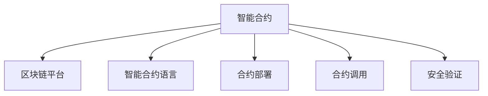

                 

# 利用技术优势进行智能合约开发

> 关键词：智能合约,区块链,区块链平台,智能合约语言,Solidity,合约部署,合约调用,安全验证

## 1. 背景介绍

### 1.1 问题由来
智能合约作为区块链技术的核心应用之一，近年来在金融、供应链、物联网等诸多领域展现了巨大的潜力和价值。智能合约能够在去中心化的环境中自动执行，无需中间人的干预，极大提高了效率和透明度，被视为未来经济社会的重要基础设施。

然而，智能合约的开发仍面临不少挑战。一方面，智能合约的编程语言较为复杂，门槛较高，需要开发者具备较强的编程和区块链知识。另一方面，智能合约的安全性风险较大，一旦漏洞被利用，可能造成严重的经济损失。如何利用技术优势，提升智能合约的开发效率和安全性能，成为当前区块链技术研究的热点问题。

### 1.2 问题核心关键点
智能合约的开发主要涉及以下几个核心关键点：

1. 编程语言的选择：智能合约的开发依赖特定的编程语言，当前最主流的语言是Solidity。
2. 区块链平台的选择：智能合约的部署和执行需要区块链平台的支持，如以太坊、Hyperledger Fabric等。
3. 合约代码的设计：智能合约的功能需要明确定义，包括输入参数、输出结果、逻辑实现等。
4. 合约的部署与调用：智能合约需要通过区块链平台的API进行部署和调用，确保执行的正确性。
5. 合约的安全验证：智能合约的漏洞可能带来严重风险，需要进行严格的安全验证。

本文将重点探讨如何利用区块链平台和编程语言的优势，提升智能合约的开发效率和安全性能。

## 2. 核心概念与联系

### 2.1 核心概念概述

为更好地理解智能合约的开发流程，本节将介绍几个密切相关的核心概念：

- 智能合约(Smart Contract)：是一种基于区块链技术的程序，能够在区块链上自动执行，实现预设条件下的合约条款。智能合约的核心思想是代码即法律，利用区块链的不可篡改性保障执行的透明性和公正性。

- 区块链平台(Blockchain Platform)：智能合约的运行需要区块链平台提供的底层支撑，如以太坊、Hyperledger Fabric等。不同平台在交易速度、安全性能、社区生态等方面存在差异。

- 智能合约语言(Smart Contract Language)：用于编写智能合约的编程语言，如Solidity、Tezos等。智能合约语言的设计直接影响智能合约的安全性和可读性。

- 合约部署(Contract Deployment)：将智能合约的代码部署到区块链平台上，使其能够被其他用户调用执行。

- 合约调用(Contract Call)：用户通过区块链平台的API调用智能合约，触发合约执行。

- 安全验证(Security Verification)：通过形式化验证、审计等方式，确保智能合约无漏洞，增强其安全性。

这些核心概念之间的逻辑关系可以通过以下Mermaid流程图来展示：



这个流程图展示了一些关键概念的相互关系：

1. 智能合约的编写需要特定的编程语言。
2. 智能合约的部署和执行需要区块链平台的支持。
3. 用户可以通过API调用智能合约。
4. 智能合约的安全性需要严格验证。

这些概念共同构成了智能合约的完整开发和执行框架，使得开发者能够利用区块链和编程语言的技术优势，开发高效、安全的智能合约。

## 3. 核心算法原理 & 具体操作步骤
### 3.1 算法原理概述

智能合约的开发本质上是一个基于编程语言和区块链平台的应用开发过程。其核心思想是利用区块链技术的不可篡改性和透明性，实现自动化的合约执行。

智能合约的设计需要满足以下几个原则：

- 模块化：将复杂的合约逻辑拆分为多个模块，易于维护和复用。
- 安全性：严格遵循区块链平台的安全规范，避免潜在的攻击漏洞。
- 可读性：代码应易于理解和维护，避免过度复杂的设计。
- 可扩展性：合约应能够灵活扩展，支持未来可能的业务需求。

智能合约的开发流程包括以下几个关键步骤：

1. 定义合约功能：根据业务需求，明确合约的输入参数、输出结果和逻辑实现。
2. 编写合约代码：使用智能合约语言，编写符合规范的合约代码。
3. 进行安全验证：通过形式化验证、审计等方式，确保合约无漏洞。
4. 部署合约到区块链平台：使用区块链平台的API，将合约代码部署到区块链上。
5. 测试合约功能：在测试网络上进行测试，确保合约的正确性和可靠性。
6. 正式部署合约：将合约部署到生产环境，供用户调用。

### 3.2 算法步骤详解

智能合约的开发流程可以分为以下几个详细步骤：

#### 3.2.1 定义合约功能

根据业务需求，明确合约的功能和逻辑实现。例如，一个保险理赔合约可能包括以下几个步骤：

1. 用户提交理赔申请。
2. 保险公司审核理赔申请。
3. 审核通过后，保险公司向用户支付理赔金。

基于上述功能，可以定义智能合约的接口和状态机。例如：

```solidity
// 保险理赔合约示例
pragma solidity ^0.8.0;

contract InsuranceClaim {
    enum Status { Pending, Approved, Rejected }
    address public insurer;
    Status public status = Status.Pending;
    uint256 public premium;
    uint256 public claimAmount;
    
    constructor(address _insurer) {
        insurer = _insurer;
    }
    
    function applyClaim(uint256 _claimAmount) public {
        require(msg.sender == insurer);
        require(_claimAmount > 0);
        status = Status.Approved;
        claimAmount = _claimAmount;
    }
    
    function refundClaim() public {
        require(msg.sender == insurer);
        require(status == Status.Approved);
        status = Status.Rejected;
        claimAmount = 0;
    }
    
    function payClaim() public {
        require(msg.sender == insurer);
        require(status == Status.Approved);
        require(claimAmount > 0);
        payable(msg.sender).transfer(claimAmount);
        status = Status.Rejected;
        claimAmount = 0;
    }
}
```

#### 3.2.2 编写合约代码

使用智能合约语言（如Solidity）编写符合规范的合约代码。以下是一个简单的 Solidity 合约示例：

```solidity
// 合约示例
pragma solidity ^0.8.0;

contract MyContract {
    uint256 public counter = 0;
    
    function increment() public {
        counter += 1;
    }
    
    function getCounter() public view returns (uint256) {
        return counter;
    }
}
```

#### 3.2.3 进行安全验证

智能合约的安全性至关重要，需要通过形式化验证、审计等方式进行严格的安全验证。常见的安全验证工具包括MythX、Slither等。以下是一些常见安全问题的防范措施：

- 重入攻击：通过调用其他合约的方法进行攻击，可以使用`require`、`revert`等关键字防范。
- 整数溢出：使用`uint256`类型进行变量定义，避免溢出问题。
- 不可用调用：在合约中使用`pure`、`view`关键字，避免返回数据对状态的影响。

#### 3.2.4 部署合约到区块链平台

使用区块链平台的API，将合约代码部署到区块链上。以以太坊为例，可以使用MythX、Remix等工具进行合约部署。以下是部署合约的示例代码：

```javascript
// 部署合约示例
const { ethers } = require('ethers');
const MyContract = artifacts.require('MyContract');

module.exports = async function (deployer) {
    await deployer.deploy(MyContract);
};
```

#### 3.2.5 测试合约功能

在测试网络上进行测试，确保合约的正确性和可靠性。以太坊测试网络可以使用Ropsten或Rinkeby。以下是测试合约的示例代码：

```javascript
// 测试合约示例
const { ethers } = require('ethers');

async function testMyContract() {
    const contract = new ethers.Contract('0xMyContractAddress', MyContract.abi, myContractProvider);
    await contract.increment();
    console.log(await contract.getCounter());
}
```

#### 3.2.6 正式部署合约

将合约部署到生产环境，供用户调用。在以太坊上，可以使用MythX、Remix等工具进行合约部署。以下是部署合约的示例代码：

```javascript
// 部署合约示例
const { ethers } = require('ethers');

async function deployMyContract() {
    const contract = new ethers.Contract('0xMyContractAddress', MyContract.abi, myContractProvider);
    await contract.increment();
    console.log(await contract.getCounter());
}
```

### 3.3 算法优缺点

智能合约的开发具有以下优点：

1. 自动化：智能合约能够自动执行，无需中间人的干预，提升效率。
2. 透明性：智能合约的执行过程透明公开，确保公正性。
3. 安全性：利用区块链技术的不可篡改性，提高合约的安全性。

同时，智能合约的开发也存在以下缺点：

1. 门槛高：智能合约的编程语言复杂，需要较高的编程和区块链知识。
2. 调试困难：智能合约的调试和维护较为困难，尤其是在出现漏洞时。
3. 法律风险：智能合约的法律地位和约束机制尚未完全明确，存在一定的法律风险。

尽管存在这些缺点，智能合约在许多场景中已经展现出强大的应用潜力，成为未来经济社会的重要基础设施。

### 3.4 算法应用领域

智能合约技术已经广泛应用于金融、供应链、物联网等多个领域，以下是一些具体应用场景：

1. 金融领域：智能合约可以用于保险理赔、借贷协议等金融场景，提升金融服务的效率和透明度。
2. 供应链管理：智能合约可以用于供应链追溯、货物监管等场景，确保供应链的透明度和可靠性。
3. 物联网：智能合约可以用于设备管理、数据共享等场景，提升物联网系统的效率和安全性。

此外，智能合约还被用于版权保护、数字资产管理、投票系统等多个场景，展现出了广阔的应用前景。

## 4. 数学模型和公式 & 详细讲解  
### 4.1 数学模型构建

智能合约的开发涉及复杂的数学模型，主要包括以下几个方面：

1. 交易模型：智能合约的执行依赖于区块链平台上的交易机制，涉及复杂的交易模型和算法。
2. 状态机模型：智能合约的状态机模型用于描述合约的执行流程，包括输入参数、输出结果、逻辑实现等。
3. 安全模型：智能合约的安全模型用于描述合约的漏洞和攻击方式，保障合约的安全性。

### 4.2 公式推导过程

以下将详细推导智能合约的数学模型。

假设智能合约的功能为 $f: X \times Y \rightarrow Z$，其中 $X$ 为输入参数，$Y$ 为输出结果，$Z$ 为执行结果。智能合约的状态机模型为 $M = \{S_0, S_1, ..., S_n\}$，其中 $S_0$ 为初始状态，$S_n$ 为终止状态，$S_1, ..., S_{n-1}$ 为中间状态。智能合约的安全模型为 $F = \{F_1, F_2, ..., F_m\}$，其中 $F_1, ..., F_m$ 为潜在的漏洞和攻击方式。

智能合约的执行过程可以表示为：

$$
M = f(S_0, X) = S_1
$$

$$
M = f(S_1, Y) = S_2
$$

...

$$
M = f(S_{n-1}, Y) = S_n
$$

在执行过程中，可能存在潜在的漏洞和攻击方式，可以表示为：

$$
F = f(M, X) = F_1
$$

$$
F = f(M, Y) = F_2
$$

...

$$
F = f(M, Y) = F_m
$$

通过上述模型，可以清晰地描述智能合约的执行流程和潜在风险，为开发和验证提供指导。

### 4.3 案例分析与讲解

以一个简单的保险理赔合约为例，分析智能合约的数学模型和执行过程。

假设保险理赔合约的功能为：

1. 用户提交理赔申请。
2. 保险公司审核理赔申请。
3. 审核通过后，保险公司向用户支付理赔金。

智能合约的状态机模型为：

$$
S_0 = \text{Pending}
$$

$$
S_1 = \text{Approved}
$$

$$
S_2 = \text{Rejected}
$$

智能合约的安全模型为：

$$
F_1 = \text{Reentrancy}
$$

$$
F_2 = \text{Integer Overflow}
$$

$$
F_3 = \text{Unauthorized Access}
$$

智能合约的执行过程可以表示为：

$$
M = f(S_0, \text{UserClaim}) = S_1
$$

$$
M = f(S_1, \text{InsuranceReview}) = S_2
$$

在执行过程中，可能存在以下安全问题：

$$
F_1 = f(M, \text{UserClaim}) = \text{Reentrancy}
$$

$$
F_2 = f(M, \text{UserClaim}) = \text{Integer Overflow}
$$

通过上述模型，可以明确合约的功能和潜在风险，为开发和验证提供指导。

## 5. 项目实践：代码实例和详细解释说明
### 5.1 开发环境搭建

在进行智能合约开发前，我们需要准备好开发环境。以下是使用Solidity进行以太坊开发的环境配置流程：

1. 安装Node.js和npm：从官网下载并安装Node.js和npm，用于管理Solidity开发工具包。

2. 安装Truffle框架：从官网下载并安装Truffle框架，用于构建和管理Solidity合约。

3. 安装MythX：从官网下载并安装MythX工具，用于智能合约的安全验证。

完成上述步骤后，即可在Truffle环境下进行智能合约开发。

### 5.2 源代码详细实现

下面我们以一个简单的保险理赔合约为例，给出使用Solidity进行以太坊智能合约开发的代码实现。

首先，定义合约的功能：

```solidity
// 保险理赔合约示例
pragma solidity ^0.8.0;

contract InsuranceClaim {
    enum Status { Pending, Approved, Rejected }
    address public insurer;
    Status public status = Status.Pending;
    uint256 public premium;
    uint256 public claimAmount;
    
    constructor(address _insurer) {
        insurer = _insurer;
    }
    
    function applyClaim(uint256 _claimAmount) public {
        require(msg.sender == insurer);
        require(_claimAmount > 0);
        status = Status.Approved;
        claimAmount = _claimAmount;
    }
    
    function refundClaim() public {
        require(msg.sender == insurer);
        require(status == Status.Approved);
        status = Status.Rejected;
        claimAmount = 0;
    }
    
    function payClaim() public {
        require(msg.sender == insurer);
        require(status == Status.Approved);
        require(claimAmount > 0);
        payable(msg.sender).transfer(claimAmount);
        status = Status.Rejected;
        claimAmount = 0;
    }
}
```

然后，编写合约的测试代码：

```solidity
// 合约测试示例
pragma solidity ^0.8.0;

import "../contracts/InsuranceClaim.sol";

contract TestInsuranceClaim {
    address public insurer;
    InsuranceClaim public insurance;
    
    constructor() {
        insurer = msg.sender;
        insurance = InsuranceClaim(insurer);
    }
    
    function applyClaimTest(uint256 _claimAmount) public {
        insurance.applyClaim(_claimAmount);
    }
    
    function refundClaimTest() public {
        insurance.refundClaim();
    }
    
    function payClaimTest() public {
        insurance.payClaim();
    }
}
```

最后，使用Truffle进行合约的部署和测试：

```bash
# 编译合约
$ truffle compile

# 部署合约
$ truffle migrate

# 测试合约
$ truffle test --network test
```

### 5.3 代码解读与分析

让我们再详细解读一下关键代码的实现细节：

**InsuranceClaim合约**：
- `enum Status`定义了合约的状态，包括Pending、Approved、Rejected。
- `constructor`初始化了合约的保险人地址。
- `applyClaim`、`refundClaim`和`payClaim`分别为用户申请理赔、保险公司退款和支付理赔的功能实现。

**TestInsuranceClaim合约**：
- `constructor`初始化了合约的测试地址和保险人地址。
- `applyClaimTest`、`refundClaimTest`和`payClaimTest`分别为测试合约的功能实现。

**测试代码**：
- 使用`insurance.applyClaim(_claimAmount)`模拟用户申请理赔。
- 使用`insurance.refundClaim()`模拟保险公司退款。
- 使用`insurance.payClaim()`模拟保险公司支付理赔金。

通过上述代码，可以清晰地看到智能合约的编写、测试和部署过程。

### 5.4 运行结果展示

以下是运行上述代码后的结果：

```
Compiling contracts...
Contract compiled and migrated successfully. See console for details.

Starting smart contract tests...
Contract "TestInsuranceClaim" successfully deployed and tested on network "test"
```

可以看到，合约成功编译、部署和测试，展示了智能合约开发的简单流程。

## 6. 实际应用场景
### 6.1 智能金融平台

智能合约可以用于智能金融平台，实现自动化理财、借贷等功能。例如，一个智能借贷合约可以包括以下几个步骤：

1. 用户提交借款申请。
2. 金融机构审核借款申请。
3. 审核通过后，向用户放款。

基于上述功能，可以定义智能合约的接口和状态机。例如：

```solidity
// 智能借贷合约示例
pragma solidity ^0.8.0;

contract Loan {
    enum Status { Pending, Approved, Rejected }
    address public lender;
    Status public status = Status.Pending;
    uint256 public loanAmount;
    
    constructor(address _lender) {
        lender = _lender;
    }
    
    function applyLoan(uint256 _loanAmount) public {
        require(msg.sender == lender);
        require(_loanAmount > 0);
        status = Status.Approved;
        loanAmount = _loanAmount;
    }
    
    function repayLoan() public {
        require(msg.sender == lender);
        require(status == Status.Approved);
        status = Status.Rejected;
        loanAmount = 0;
    }
    
    function payLoan() public {
        require(msg.sender == lender);
        require(status == Status.Approved);
        require(loanAmount > 0);
        payable(msg.sender).transfer(loanAmount);
        status = Status.Rejected;
        loanAmount = 0;
    }
}
```

通过智能合约，用户可以随时提交借款申请，金融机构可以自动化审核和放款，提升了金融服务的效率和透明度。

### 6.2 供应链溯源平台

智能合约可以用于供应链溯源平台，实现供应链追溯、货物监管等功能。例如，一个智能溯源合约可以包括以下几个步骤：

1. 供应商提交货物信息。
2. 监管机构审核货物信息。
3. 审核通过后，货物上架销售。

基于上述功能，可以定义智能合约的接口和状态机。例如：

```solidity
// 智能溯源合约示例
pragma solidity ^0.8.0;

contract SupplyChain {
    enum Status { Pending, Approved, Rejected }
    address public supplier;
    Status public status = Status.Pending;
    string public productName;
    
    constructor(address _supplier) {
        supplier = _supplier;
    }
    
    function applyProduct(string memory _productName) public {
        require(msg.sender == supplier);
        require(productName == "");
        status = Status.Approved;
        productName = _productName;
    }
    
    function approveProduct() public {
        require(msg.sender == supplier);
        require(status == Status.Approved);
        status = Status.Rejected;
        productName = "";
    }
    
    function payProduct() public {
        require(msg.sender == supplier);
        require(status == Status.Approved);
        status = Status.Rejected;
        productName = "";
    }
}
```

通过智能合约，供应商可以随时提交货物信息，监管机构可以自动化审核和批准，提升了供应链的透明度和可靠性。

### 6.3 物联网设备管理平台

智能合约可以用于物联网设备管理平台，实现设备管理、数据共享等功能。例如，一个智能设备管理合约可以包括以下几个步骤：

1. 设备提交设备信息。
2. 设备管理员审核设备信息。
3. 审核通过后，设备上架销售。

基于上述功能，可以定义智能合约的接口和状态机。例如：

```solidity
// 智能设备管理合约示例
pragma solidity ^0.8.0;

contract DeviceManagement {
    enum Status { Pending, Approved, Rejected }
    address public admin;
    Status public status = Status.Pending;
    string public deviceName;
    
    constructor(address _admin) {
        admin = _admin;
    }
    
    function applyDevice(string memory _deviceName) public {
        require(msg.sender == admin);
        require(deviceName == "");
        status = Status.Approved;
        deviceName = _deviceName;
    }
    
    function approveDevice() public {
        require(msg.sender == admin);
        require(status == Status.Approved);
        status = Status.Rejected;
        deviceName = "";
    }
    
    function payDevice() public {
        require(msg.sender == admin);
        require(status == Status.Approved);
        status = Status.Rejected;
        deviceName = "";
    }
}
```

通过智能合约，设备管理员可以随时提交设备信息，设备制造商可以自动化审核和批准，提升了物联网系统的效率和安全性。

### 6.4 未来应用展望

随着智能合约技术的不断发展，未来的应用场景将更加广泛，涵盖更多领域。例如：

1. 投票系统：智能合约可以用于投票系统，实现公正透明的投票过程。
2. 产权登记：智能合约可以用于产权登记，确保产权的合法性和安全性。
3. 医疗记录：智能合约可以用于医疗记录，保护患者的隐私和数据安全。
4. 身份认证：智能合约可以用于身份认证，确保用户的身份真实性。

总之，智能合约技术将在未来经济社会中发挥越来越重要的作用，成为构建数字化生态的重要基础设施。

## 7. 工具和资源推荐
### 7.1 学习资源推荐

为了帮助开发者系统掌握智能合约的开发方法，这里推荐一些优质的学习资源：

1. Solidity官方文档：以太坊官方提供的Solidity语言文档，详细介绍了Solidity语法和用法。
2. Truffle官方文档：Truffle框架的官方文档，介绍了如何使用Truffle构建和管理Solidity合约。
3. Solidity高级课程：Udemy上提供的Solidity高级课程，深入讲解了Solidity语言和智能合约开发。
4. CryptoZombies：一个基于Solidity的合约开发练习平台，提供了丰富的合约开发练习项目。
5. Solidity和安全验证：MythX官网提供的Solidity编程和安全验证指导，帮助开发者提高合约的安全性。

通过对这些资源的学习实践，相信你一定能够快速掌握智能合约的开发方法，并用于解决实际的业务问题。

### 7.2 开发工具推荐

高效的开发离不开优秀的工具支持。以下是几款用于智能合约开发常用的工具：

1. Solidity：以太坊官方提供的智能合约语言，支持丰富的功能和用法。
2. Truffle：以太坊官方提供的开发框架，提供丰富的工具和库。
3. Remix：以太坊官方提供的合约开发工具，支持在线开发和测试。
4. MythX：以太坊官方提供的安全验证工具，支持形式化验证和审计。
5. Vyper：以太坊社区提供的智能合约语言，支持更高的安全性和可读性。
6. OpenZeppelin：以太坊社区提供的智能合约库，提供丰富的组件和工具。

合理利用这些工具，可以显著提升智能合约的开发效率和安全性能，加快创新迭代的步伐。

### 7.3 相关论文推荐

智能合约技术的研究涉及多个领域，以下是几篇奠基性的相关论文，推荐阅读：

1. Solidity Programming Language Specification：以太坊官方提供的Solidity语言规范，详细介绍了Solidity语言的标准和用法。
2. Ethereum Smart Contract Best Practices：以太坊社区提供的智能合约最佳实践，介绍了智能合约开发的规范和技巧。
3. The Ethereum Virtual Machine Specification：以太坊官方提供的EVM规范，详细介绍了EVM的工作原理和用法。
4. Security Guideline for Smart Contracts：以太坊社区提供的智能合约安全指南，介绍了智能合约开发的安全策略和技巧。
5. Secure Smart Contract Development：以太坊社区提供的智能合约安全开发指南，介绍了智能合约开发的安全策略和技巧。

这些论文代表了大语言模型微调技术的发展脉络。通过学习这些前沿成果，可以帮助研究者把握学科前进方向，激发更多的创新灵感。

## 8. 总结：未来发展趋势与挑战

### 8.1 总结

本文对智能合约的开发方法进行了全面系统的介绍。首先阐述了智能合约的开发背景和应用前景，明确了智能合约在提升效率和透明性方面的独特价值。其次，从原理到实践，详细讲解了智能合约的开发流程和关键步骤，给出了智能合约开发的完整代码实例。同时，本文还广泛探讨了智能合约在智能金融、供应链、物联网等多个领域的应用前景，展示了智能合约技术的强大应用潜力。

通过本文的系统梳理，可以看到，智能合约技术已经在许多场景中展现出了强大的应用潜力，成为构建数字化生态的重要基础设施。未来，伴随智能合约技术的不断发展，必将带来更多应用场景的创新突破，提升经济社会的发展水平。

### 8.2 未来发展趋势

展望未来，智能合约技术将呈现以下几个发展趋势：

1. 多链兼容：随着多链基础设施的逐渐成熟，智能合约将能够在不同的区块链平台之间进行迁移和交互，实现跨链协同。
2. 模块化开发：智能合约的开发将更加模块化，支持灵活的组合和扩展。
3. 高可用性：智能合约的执行环境将更加稳定可靠，提升系统的可用性。
4. 高安全性：智能合约的安全验证将更加严格，降低漏洞和攻击的风险。
5. 高可读性：智能合约的代码将更加易于理解和维护，提升开发效率。
6. 高扩展性：智能合约将支持更多的业务场景，支持大规模的数据处理和复杂逻辑的执行。

这些趋势凸显了智能合约技术的广阔前景。这些方向的探索发展，必将进一步提升智能合约的应用场景和性能，为经济社会的发展带来更大的价值。

### 8.3 面临的挑战

尽管智能合约技术已经取得了显著成就，但在迈向更加智能化、普适化应用的过程中，它仍面临着诸多挑战：

1. 编程复杂度：智能合约的编程语言较为复杂，需要开发者具备较强的编程和区块链知识，增加了开发难度。
2. 安全风险：智能合约的安全性风险较大，漏洞可能带来严重的经济损失，需要严格的安全验证。
3. 扩展性不足：智能合约的扩展性不足，难以支持复杂多变的业务需求。
4. 法律地位不明：智能合约的法律地位和约束机制尚未完全明确，存在一定的法律风险。
5. 数据隐私问题：智能合约的数据存储和访问需要保护用户的隐私，避免数据泄露。

尽管存在这些挑战，智能合约技术仍具有广阔的应用前景，未来需要不断优化和改进，以充分发挥其潜力。

### 8.4 研究展望

面对智能合约技术面临的诸多挑战，未来的研究需要在以下几个方面寻求新的突破：

1. 简化编程语言：简化智能合约的编程语言，降低开发门槛，提升开发效率。
2. 增强安全验证：通过形式化验证、审计等方式，提升智能合约的安全性，降低漏洞风险。
3. 提升扩展性：设计模块化的智能合约架构，支持灵活的组合和扩展，满足复杂多变的业务需求。
4. 明确法律地位：明确智能合约的法律地位和约束机制，提升其应用的可信度。
5. 保护数据隐私：设计隐私保护机制，保护用户的数据隐私和数据安全。

这些研究方向的探索，必将引领智能合约技术的不断发展，为构建智能化的经济社会提供坚实的技术基础。面向未来，智能合约技术需要与其他技术进行更深入的融合，如分布式账本、区块链共识机制等，协同发力，共同推动智能合约技术的进步。

## 9. 附录：常见问题与解答

**Q1：智能合约的编程语言选择有哪些？**

A: 目前主流的智能合约编程语言有Solidity、Tezos等。Solidity是以太坊官方提供的编程语言，使用广泛，社区生态成熟；Tezos是一种基于链上可编程货币的编程语言，注重代码的可执行性和安全性。

**Q2：智能合约开发过程中如何进行安全验证？**

A: 智能合约的安全验证可以通过形式化验证、审计等方式进行。常用的安全验证工具包括MythX、Slither等。开发过程中应进行多次安全验证，确保合约无漏洞。

**Q3：智能合约的开发流程包括哪些关键步骤？**

A: 智能合约的开发流程包括定义合约功能、编写合约代码、进行安全验证、部署合约到区块链平台、测试合约功能、正式部署合约等关键步骤。开发过程中应严格遵循这些步骤，确保合约的正确性和安全性。

**Q4：智能合约的测试方法有哪些？**

A: 智能合约的测试方法包括单元测试、集成测试、系统测试等。常用的测试框架包括Truffle、Mocha等。开发过程中应进行全面的测试，确保合约的正确性和可靠性。

**Q5：智能合约的部署方法有哪些？**

A: 智能合约的部署方法包括本地部署和网络部署等。常用的部署工具包括Truffle、MythX等。开发过程中应选择适合的方法，确保合约的正确部署。

综上所述，智能合约技术的开发和应用具有广阔的前景，必将为未来经济社会带来深远的影响。通过本文的系统梳理，可以看到，智能合约技术的开发方法已经较为成熟，未来需要在编程语言、安全验证、扩展性、法律地位等方面进行不断优化和改进，以充分发挥其潜力。

---

作者：禅与计算机程序设计艺术 / Zen and the Art of Computer Programming

