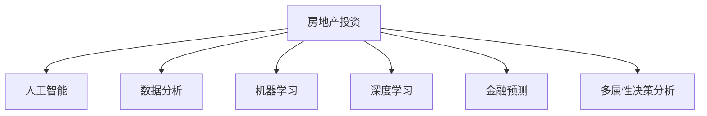

                 

# 利用技术技能进行房地产投资

> 关键词：人工智能, 数据分析, 房地产投资, 机器学习, 深度学习, 金融预测

## 1. 背景介绍

在过去几年中，人工智能和机器学习技术的快速发展推动了各行各业的变革，其中房地产投资也不例外。房地产行业一直是一个资本密集型的行业，涉及大量的数据处理和复杂的决策过程。传统的房地产投资依赖于经验和直觉，而新技术的应用可以提供数据驱动的决策支持，从而提高投资决策的准确性和效率。

### 1.1 问题由来

随着大数据和机器学习技术的普及，房地产投资领域出现了以下挑战：
- **数据量庞大**：房地产市场涉及大量的历史数据，包括价格变化、市场趋势、地理位置、建筑特征等。
- **数据质量参差不齐**：数据往往存在缺失、噪音和不一致性问题，需要清洗和预处理。
- **模型复杂性高**：房地产市场受多种因素影响，如经济周期、政策变化、人口流动等，使得建立有效的预测模型变得复杂。

## 2. 核心概念与联系

### 2.1 核心概念概述

为更好地理解利用技术技能进行房地产投资，本节将介绍几个关键概念：

- **房地产投资**：投资于房地产市场，通过买卖房产获得收益。
- **人工智能(AI)**：利用机器学习、深度学习等技术实现自动决策和数据分析。
- **数据分析**：通过收集、清洗和分析数据，提取有用的信息以支持决策。
- **机器学习(ML)**：一种使计算机从数据中自动学习模式，并作出决策的技术。
- **深度学习(DL)**：一种基于神经网络的机器学习技术，能够处理高度复杂的数据集。
- **金融预测**：使用机器学习模型对房地产市场的金融表现进行预测。
- **多属性决策分析(MCDA)**：一种系统地分析多个属性对决策的影响，从而进行最佳选择的技术。

这些概念之间的逻辑关系可以通过以下Mermaid流程图来展示：



这个流程图展示了大数据和机器学习技术如何应用于房地产投资的过程：

1. 数据收集和清洗。
2. 利用机器学习模型进行分析。
3. 使用深度学习提高模型的准确性。
4. 对房地产市场的金融表现进行预测。
5. 通过多属性决策分析，选择合适的投资决策。

## 3. 核心算法原理 & 具体操作步骤

### 3.1 算法原理概述

基于机器学习和大数据技术的房地产投资方法，本质上是使用历史数据训练模型，对未来市场趋势进行预测。其核心思想是通过数据分析和模型训练，找到数据中的规律，从而作出更加准确的投资决策。

形式化地，假设有一组房地产历史交易数据 $\{(x_i, y_i)\}_{i=1}^N$，其中 $x_i$ 表示历史交易记录，$y_i$ 表示交易价格。我们的目标是训练一个模型 $M$，使得对于新的交易记录 $x$，模型能够预测出相应的价格 $y$。

因此，我们的优化目标是最小化预测误差，即：

$$
\min_{M} \sum_{i=1}^N \left| y_i - M(x_i) \right|
$$

其中，$M(x_i)$ 是模型对交易记录 $x_i$ 的预测价格。

### 3.2 算法步骤详解

利用机器学习进行房地产投资一般包括以下几个关键步骤：

**Step 1: 数据收集与预处理**
- 收集房地产市场的历史交易数据，包括价格、位置、面积、建筑年代等属性。
- 数据清洗，处理缺失值、异常值和数据不一致性。
- 数据划分，将数据划分为训练集和测试集，通常采用70:30或80:20的比例。

**Step 2: 特征工程**
- 提取数据中的有用特征，如房价、建筑年代、地理位置、房屋面积等。
- 特征选择，去除冗余和无关特征，减少计算负担。
- 特征变换，对数据进行标准化、归一化或PCA降维等处理。

**Step 3: 模型选择与训练**
- 选择适当的机器学习模型，如线性回归、支持向量机(SVM)、随机森林等。
- 使用训练集数据对模型进行训练，最小化预测误差。
- 使用交叉验证等技术，评估模型性能。

**Step 4: 模型评估与优化**
- 使用测试集数据对模型进行评估，计算准确率、召回率、F1值等指标。
- 调整模型参数，如正则化系数、学习率等，进行超参数优化。
- 使用集成学习等技术，提高模型的泛化能力和稳定性。

**Step 5: 投资决策**
- 根据模型预测结果，评估不同投资机会的潜在收益和风险。
- 结合其他因素，如市场趋势、政策变化等，进行综合决策。
- 监控市场变化，及时调整投资策略。

### 3.3 算法优缺点

基于机器学习和大数据的房地产投资方法具有以下优点：
- **高效性**：使用算法进行自动化分析，节省了人工处理大量数据的时间。
- **准确性**：通过大量历史数据的训练，模型的预测准确性较高。
- **灵活性**：可以根据实际情况调整模型参数和特征，适应不同的投资需求。
- **可扩展性**：随着数据量的增加，模型性能会不断提高。

同时，该方法也存在一定的局限性：
- **数据依赖性高**：模型的效果很大程度上依赖于数据的质量和数量。
- **解释性不足**：机器学习模型往往是"黑盒"，难以解释其内部工作机制。
- **模型鲁棒性有限**：模型可能对异常值和噪声数据敏感，需要进一步处理。
- **复杂度高**：模型建立和调优过程较为复杂，需要一定的专业知识和技能。

尽管存在这些局限性，但就目前而言，基于机器学习和大数据的房地产投资方法仍是最主流范式。未来相关研究的重点在于如何进一步降低对数据的依赖，提高模型的可解释性和鲁棒性，同时兼顾计算效率和决策灵活性等因素。

### 3.4 算法应用领域

基于机器学习和大数据技术的房地产投资方法，在多个领域得到了应用：

- **房地产市场分析**：使用机器学习模型分析市场趋势和价格波动，提供投资建议。
- **房地产估值**：通过训练模型预测房产的合理价格，辅助房产交易。
- **风险管理**：使用机器学习模型评估投资项目的风险，进行风险控制。
- **选址决策**：使用多属性决策分析，评估不同地点的投资潜力。
- **市场细分**：利用聚类算法等技术，将市场细分为不同的客户群体，进行定向投资。

此外，在租赁市场、商业地产等领域，基于机器学习和大数据的房地产投资方法同样具有广泛应用前景。随着技术的不断进步，房地产投资领域必将成为人工智能应用的重要领域之一。

## 4. 数学模型和公式 & 详细讲解 & 举例说明

### 4.1 数学模型构建

本节将使用数学语言对利用机器学习进行房地产投资的方法进行更加严格的刻画。

假设我们有一组房地产历史交易数据 $\{(x_i, y_i)\}_{i=1}^N$，其中 $x_i$ 表示历史交易记录，$y_i$ 表示交易价格。

定义模型 $M$ 在输入 $x$ 上的预测价格为 $M(x) = \sum_{j=1}^d \beta_j f_j(x)$，其中 $\beta_j$ 为模型参数，$f_j(x)$ 为特征 $x_j$ 的转换函数。

我们的优化目标是最小化预测误差，即：

$$
\min_{\beta} \sum_{i=1}^N \left| y_i - \sum_{j=1}^d \beta_j f_j(x_i) \right|
$$

在实践中，我们通常使用梯度下降等优化算法，近似求解上述最优化问题。设 $\eta$ 为学习率，则参数的更新公式为：

$$
\beta \leftarrow \beta - \eta \nabla_{\beta}\mathcal{L}(\beta)
$$

其中 $\nabla_{\beta}\mathcal{L}(\beta)$ 为损失函数对参数 $\beta$ 的梯度，可通过反向传播算法高效计算。

### 4.2 公式推导过程

以线性回归模型为例，推导训练过程中的损失函数和梯度计算公式。

假设模型 $M$ 在输入 $x$ 上的预测价格为 $\hat{y} = \sum_{j=1}^d \beta_j x_{ij}$，其中 $x_{ij}$ 为输入 $x$ 的第 $i$ 个特征 $j$ 的值。

定义模型 $M$ 在输入 $x_i$ 上的损失函数为 $\ell(M(x_i),y_i) = (y_i - \hat{y_i})^2$，则在数据集 $D$ 上的经验风险为：

$$
\mathcal{L}(\beta) = \frac{1}{N} \sum_{i=1}^N \ell(M(x_i),y_i)
$$

根据梯度下降法，损失函数对参数 $\beta_j$ 的梯度为：

$$
\frac{\partial \mathcal{L}(\beta)}{\partial \beta_j} = \frac{2}{N} \sum_{i=1}^N (y_i - \hat{y_i}) x_{ij}
$$

在得到损失函数的梯度后，即可带入参数更新公式，完成模型的迭代优化。重复上述过程直至收敛，最终得到适应市场趋势的最优模型参数 $\beta$。

### 4.3 案例分析与讲解

考虑一个简单的房地产投资场景：某城市的一处房产，面积为 $120$ 平方米，建筑年代为 $2005$ 年，目前市场价格为 $800,000$ 元。我们想预测如果未来五年房价继续以 $5\%$ 的年增长率增长，该房产五年后的市场价格。

首先，我们收集该城市其他类似房产的历史交易数据，包括面积、建筑年代、房价等。然后，使用线性回归模型对数据进行训练，找到特征与房价之间的关系。

假设特征 $x_i = (x_{i1}, x_{i2}, x_{i3}, \dots)$，其中 $x_{i1}$ 表示房价，$x_{i2}$ 表示面积，$x_{i3}$ 表示建筑年代。

我们使用最小二乘法对模型进行训练，得到最优参数 $\beta = (\beta_1, \beta_2, \beta_3, \dots)$。训练后，我们可以将当前房产的特征输入模型，得到其五年后的预测价格。

假设模型预测五年后的房价为 $y_{pred}$，则预测结果为：

$$
y_{pred} = 800,000 \times (1 + 0.05)^5 \times \exp(\sum_{j=2}^3 \beta_j x_{j})
$$

其中，$x_{j}$ 为特征 $x_j$ 的值。

## 5. 项目实践：代码实例和详细解释说明

### 5.1 开发环境搭建

在进行房地产投资分析的机器学习项目开发前，我们需要准备好开发环境。以下是使用Python进行Scikit-learn开发的开发环境配置流程：

1. 安装Anaconda：从官网下载并安装Anaconda，用于创建独立的Python环境。

2. 创建并激活虚拟环境：
```bash
conda create -n real-estate-env python=3.8 
conda activate real-estate-env
```

3. 安装Scikit-learn：
```bash
conda install scikit-learn
```

4. 安装各类工具包：
```bash
pip install numpy pandas scikit-learn matplotlib tqdm jupyter notebook ipython
```

完成上述步骤后，即可在`real-estate-env`环境中开始项目开发。

### 5.2 源代码详细实现

下面我们以房价预测为例，给出使用Scikit-learn进行机器学习分析的Python代码实现。

首先，定义训练集和测试集：

```python
from sklearn.model_selection import train_test_split
from sklearn.linear_model import LinearRegression
import pandas as pd
import numpy as np

# 读取数据集
df = pd.read_csv('real-estate-data.csv')

# 数据清洗
df = df.dropna()

# 特征工程
X = df[['area', 'age']]
y = df['price']

# 划分训练集和测试集
X_train, X_test, y_train, y_test = train_test_split(X, y, test_size=0.3, random_state=42)
```

然后，定义模型并训练：

```python
# 定义线性回归模型
model = LinearRegression()

# 训练模型
model.fit(X_train, y_train)
```

接着，评估模型并预测：

```python
# 评估模型
score = model.score(X_test, y_test)
print(f"模型在测试集上的R^2得分：{score:.2f}")

# 使用模型进行预测
new_x = np.array([[120, 2005]])
pred_price = model.predict(new_x)
print(f"预测价格：{pred_price:.2f}元")
```

### 5.3 代码解读与分析

让我们再详细解读一下关键代码的实现细节：

**数据读取和清洗**：
- 使用Pandas库读取CSV文件，将数据加载为DataFrame。
- 通过 `dropna()` 方法删除缺失值，确保数据的完整性。

**特征工程**：
- 从DataFrame中提取输入特征 `area` 和 `age`。
- 将价格作为输出目标变量 `y`。

**模型训练**：
- 使用Scikit-learn的 `LinearRegression` 类定义线性回归模型。
- 使用 `fit()` 方法对训练数据进行模型训练。

**模型评估**：
- 使用 `score()` 方法计算模型在测试集上的R^2得分。
- R^2得分越高，表示模型拟合效果越好。

**模型预测**：
- 定义新的输入数据 `[[120, 2005]]`，表示面积为 $120$ 平方米，建筑年代为 $2005$ 年的房产。
- 使用 `predict()` 方法对新数据进行预测，得到预测价格。

可以看到，Scikit-learn提供的机器学习库，使得机器学习模型的开发和应用变得非常简单高效。开发者可以通过轻量级的代码实现复杂的数据分析模型，快速迭代实验结果。

当然，实际应用中还需考虑更多因素，如模型的选择、超参数的调优、特征的组合等。但核心的机器学习分析过程基本与此类似。

## 6. 实际应用场景

### 6.1 智能选址

智能选址是房地产投资中的重要环节。传统的选址方式依赖于专家经验和人工分析，难以快速适应市场变化。基于机器学习的方法，可以自动化地分析市场数据，找出最佳投资地点。

具体而言，可以收集多个地点的历史交易数据、地理位置、交通状况等属性，训练机器学习模型，预测每个地点的未来价格趋势。根据模型预测结果，选择投资价值最大的地点，进行投资决策。

### 6.2 风险评估

房地产市场存在多种风险，如市场波动、政策变化、利率调整等。基于机器学习的方法，可以自动化地评估投资项目的风险，进行风险控制。

具体而言，可以收集市场数据、政策数据、利率数据等，使用机器学习模型对风险进行预测。根据模型预测结果，调整投资策略，规避高风险项目。

### 6.3 资产管理

房地产资产管理涉及到大量的资产交易和数据处理，需要快速、准确地进行决策。基于机器学习的方法，可以自动化地处理数据，分析市场趋势，提供投资建议。

具体而言，可以收集资产交易历史数据、市场数据、经济数据等，使用机器学习模型对资产价格进行预测。根据模型预测结果，进行买卖决策，优化投资组合。

### 6.4 未来应用展望

随着机器学习和大数据技术的不断发展，基于机器学习的房地产投资方法将呈现以下几个发展趋势：

1. **自动化程度提高**：自动化分析将成为房地产投资的重要手段，减少人工介入。
2. **数据融合技术发展**：数据融合技术的发展，将使模型能够更好地整合多种数据源，提高预测准确性。
3. **模型复杂度提升**：随着深度学习等技术的应用，模型复杂度将进一步提升，预测能力也将增强。
4. **智能决策支持系统发展**：智能决策支持系统的出现，将为投资者提供更全面、准确的市场分析。
5. **个性化服务提供**：基于用户行为数据，提供个性化的投资建议和策略。

这些趋势表明，基于机器学习的房地产投资方法将从传统的量化分析，逐步向智能决策系统演进，为房地产投资带来更高的自动化水平和决策准确性。

## 7. 工具和资源推荐

### 7.1 学习资源推荐

为了帮助开发者系统掌握机器学习在房地产投资中的应用，这里推荐一些优质的学习资源：

1. **《机器学习实战》**：由Peter Harrington撰写，详细介绍了机器学习的基本概念和实现方法，适合初学者。
2. **《Python机器学习》**：由Sebastian Raschka和Vahid Mirjalili撰写，介绍了机器学习在Python中的实现，适合中级读者。
3. **《深度学习》**：由Ian Goodfellow、Yoshua Bengio和Aaron Courville撰写，全面介绍了深度学习的基本原理和实现方法，适合高级读者。
4. **Coursera《机器学习》课程**：由Andrew Ng教授主讲，介绍了机器学习的基本概念和实现方法，有Lecture视频和配套作业。
5. **Kaggle竞赛平台**：提供了大量的房地产投资数据集和机器学习竞赛，适合实战练习。

通过对这些资源的学习实践，相信你一定能够快速掌握机器学习在房地产投资中的应用，并用于解决实际的投资问题。

### 7.2 开发工具推荐

高效的开发离不开优秀的工具支持。以下是几款用于机器学习项目开发的常用工具：

1. **Jupyter Notebook**：一个交互式的开发环境，支持代码编写、数据处理、图表展示等多种功能。
2. **TensorFlow**：由Google主导开发的深度学习框架，生产部署方便，适合大规模工程应用。
3. **Scikit-learn**：一个基于Python的机器学习库，提供了丰富的模型和算法实现。
4. **Weights & Biases**：一个模型训练的实验跟踪工具，可以记录和可视化模型训练过程中的各项指标。
5. **TensorBoard**：TensorFlow配套的可视化工具，可实时监测模型训练状态，并提供丰富的图表呈现方式。

合理利用这些工具，可以显著提升机器学习项目开发的效率，加快创新迭代的步伐。

### 7.3 相关论文推荐

机器学习在房地产投资中的应用，源于学界的持续研究。以下是几篇奠基性的相关论文，推荐阅读：

1. **《用机器学习预测房价》**：Gunnar Juergens等人，提出了基于随机森林的房价预测模型。
2. **《基于深度学习的城市房价预测》**：Deng Cao等人，提出了一种基于深度神经网络的房价预测模型。
3. **《房地产投资组合优化》**：Ivan P(('²))等人，提出了一种基于风险评估的投资组合优化方法。
4. **《基于强化学习的城市交通规划》**：Christian Soest等人，提出了一种基于强化学习的交通规划方法。

这些论文代表了大数据和机器学习技术在房地产投资领域的发展脉络。通过学习这些前沿成果，可以帮助研究者把握学科前进方向，激发更多的创新灵感。

## 8. 总结：未来发展趋势与挑战

### 8.1 总结

本文对利用机器学习进行房地产投资的方法进行了全面系统的介绍。首先阐述了机器学习和大数据技术在房地产投资中的重要性，明确了机器学习在提高投资决策准确性和效率方面的独特价值。其次，从原理到实践，详细讲解了机器学习在房地产投资中的核心算法和操作步骤，给出了机器学习分析项目的完整代码实例。同时，本文还广泛探讨了机器学习在智能选址、风险评估、资产管理等多个领域的应用前景，展示了机器学习技术在房地产投资中的广阔前景。

通过本文的系统梳理，可以看到，利用机器学习进行房地产投资的方法正在成为房地产投资的重要范式，极大地拓展了房地产投资的数据分析能力，提升了决策的科学性和准确性。未来，伴随机器学习技术的不断发展，房地产投资领域必将成为人工智能应用的重要领域之一。

### 8.2 未来发展趋势

展望未来，机器学习在房地产投资领域将呈现以下几个发展趋势：

1. **自动化程度提高**：自动化分析将成为房地产投资的重要手段，减少人工介入。
2. **数据融合技术发展**：数据融合技术的发展，将使模型能够更好地整合多种数据源，提高预测准确性。
3. **模型复杂度提升**：随着深度学习等技术的应用，模型复杂度将进一步提升，预测能力也将增强。
4. **智能决策支持系统发展**：智能决策支持系统的出现，将为投资者提供更全面、准确的市场分析。
5. **个性化服务提供**：基于用户行为数据，提供个性化的投资建议和策略。

这些趋势表明，基于机器学习的房地产投资方法将从传统的量化分析，逐步向智能决策系统演进，为房地产投资带来更高的自动化水平和决策准确性。

### 8.3 面临的挑战

尽管机器学习在房地产投资中的应用已经取得了瞩目成就，但在迈向更加智能化、普适化应用的过程中，它仍面临着诸多挑战：

1. **数据质量问题**：房地产市场涉及大量的非结构化数据，数据质量参差不齐，需要复杂的数据清洗和预处理。
2. **模型复杂度高**：随着模型复杂度的提升，模型的训练和调试成本增加。
3. **模型鲁棒性有限**：模型可能对异常值和噪声数据敏感，需要进一步处理。
4. **模型解释性不足**：机器学习模型往往是"黑盒"，难以解释其内部工作机制。
5. **计算资源消耗大**：大规模数据集和复杂模型的训练需要大量的计算资源，对硬件设备提出了更高的要求。

尽管存在这些挑战，但通过持续的技术创新和工程实践，相信机器学习在房地产投资中的应用将不断突破现有瓶颈，迈向更高的水平。

### 8.4 研究展望

面向未来，机器学习在房地产投资领域的研究方向可能包括：

1. **多模态数据融合**：结合图像、视频等多模态数据，提高模型的预测能力。
2. **实时数据分析**：实时处理大量数据，快速响应市场变化。
3. **模型解释性研究**：开发更加可解释的机器学习模型，增强投资决策的可信度。
4. **个性化服务研究**：基于用户行为数据，提供个性化的投资建议和策略。

这些方向的研究，必将引领机器学习在房地产投资领域的发展，为投资者提供更全面、准确的市场分析和决策支持。

## 9. 附录：常见问题与解答

**Q1：机器学习在房地产投资中的数据来源有哪些？**

A: 机器学习在房地产投资中的应用需要大量的数据支持。数据来源包括：

1. **政府公开数据**：如房地产交易记录、土地出让记录等。
2. **市场调研数据**：如中介公司提供的市场数据、租金数据等。
3. **公开数据库**：如Realtor.com、Zillow等平台提供的房地产信息。
4. **第三方数据**：如房地产评估公司提供的评估数据、咨询公司提供的市场分析报告等。

这些数据可以整合在一起，用于机器学习模型的训练和预测。

**Q2：如何选择合适的机器学习模型？**

A: 选择合适的机器学习模型需要考虑多个因素，如数据类型、问题性质、模型复杂度等。

1. **线性模型**：适用于数据量较小、特征较少的场景，如线性回归、逻辑回归等。
2. **非线性模型**：适用于特征较多的场景，如决策树、随机森林、支持向量机等。
3. **深度学习模型**：适用于大规模数据和高维特征场景，如神经网络、深度神经网络等。

在选择模型时，通常需要进行多次实验，比较不同模型的性能和复杂度，选择最优模型。

**Q3：机器学习模型在房地产投资中的局限性有哪些？**

A: 机器学习模型在房地产投资中也存在一些局限性：

1. **数据依赖性强**：模型的效果很大程度上依赖于数据的质量和数量。
2. **模型鲁棒性不足**：模型可能对异常值和噪声数据敏感，需要进一步处理。
3. **模型解释性不足**：机器学习模型往往是"黑盒"，难以解释其内部工作机制。
4. **计算资源消耗大**：大规模数据集和复杂模型的训练需要大量的计算资源，对硬件设备提出了更高的要求。

在实际应用中，需要综合考虑这些因素，选择适合的模型和算法。

**Q4：如何评估机器学习模型的性能？**

A: 评估机器学习模型的性能通常使用以下指标：

1. **准确率**：模型预测结果与实际结果的匹配程度。
2. **召回率**：模型正确预测的正样本占实际正样本的比例。
3. **F1值**：准确率和召回率的调和平均数，综合评估模型的性能。
4. **R^2得分**：模型拟合数据的程度，越接近1，表示模型越好。
5. **混淆矩阵**：展示模型预测结果的详细情况，包括真阳性、假阳性、真阴性、假阴性等。

在实际应用中，需要根据具体问题和模型特点选择合适的评估指标。

**Q5：机器学习在房地产投资中的未来发展方向有哪些？**

A: 机器学习在房地产投资中的未来发展方向可能包括：

1. **自动化分析**：自动化分析将成为房地产投资的重要手段，减少人工介入。
2. **数据融合技术**：数据融合技术的发展，将使模型能够更好地整合多种数据源，提高预测准确性。
3. **模型复杂度提升**：随着深度学习等技术的应用，模型复杂度将进一步提升，预测能力也将增强。
4. **智能决策支持系统**：智能决策支持系统的出现，将为投资者提供更全面、准确的市场分析。
5. **个性化服务提供**：基于用户行为数据，提供个性化的投资建议和策略。

这些方向的研究，必将引领机器学习在房地产投资领域的发展，为投资者提供更全面、准确的市场分析和决策支持。

---

作者：禅与计算机程序设计艺术 / Zen and the Art of Computer Programming

