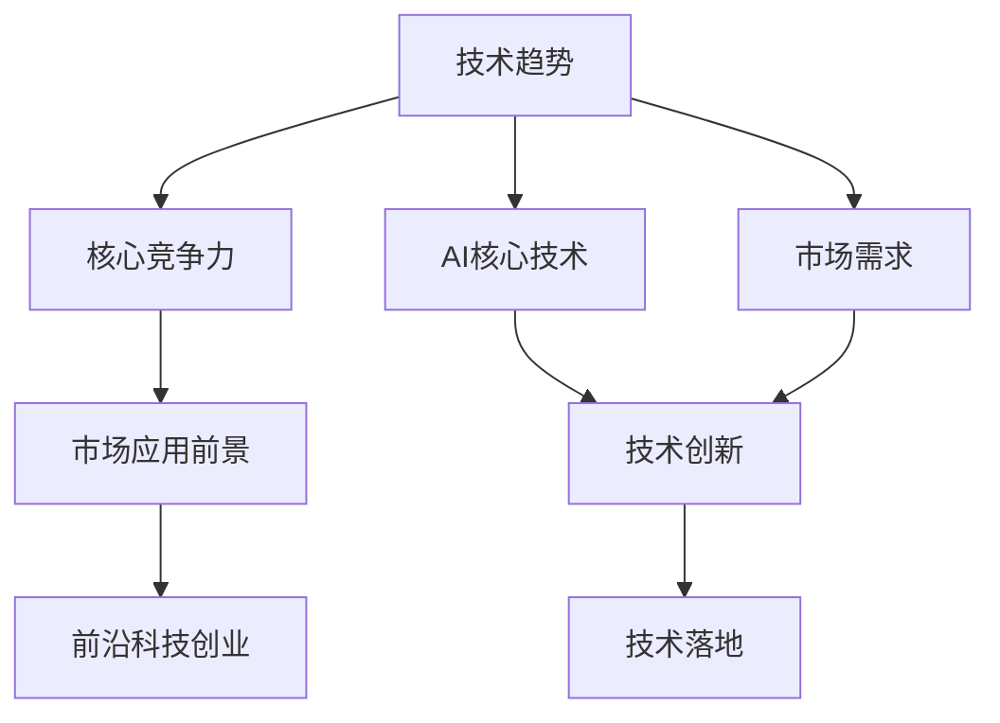
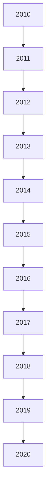
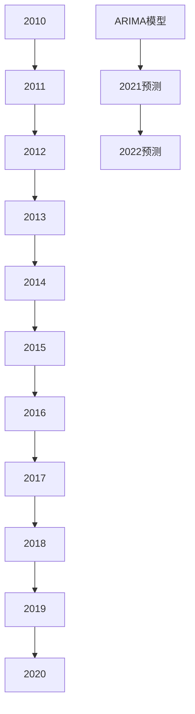
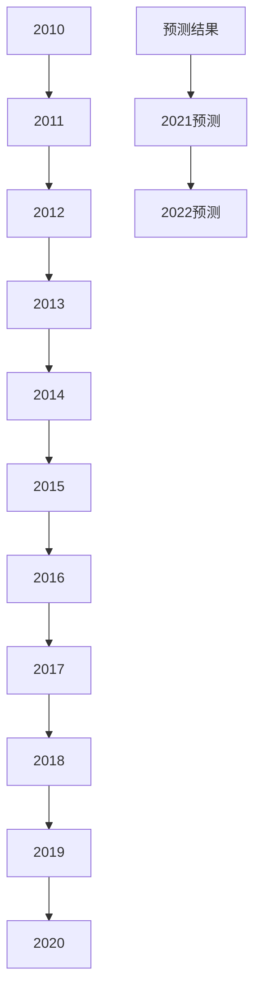

                 

## 1. 背景介绍

创业是一场技术、市场、运营的全面较量。在近年人工智能(AI)技术迅猛发展的背景下，以技术洞察力为驱动的前沿科技创业成为了行业新趋势。本文将从技术洞察力的定义与重要性出发，全面探讨前沿科技创业的核心要素，并结合实际案例深入分析，为有志于科技创业的读者提供一套系统化的技术洞察力提升策略。

### 1.1 技术洞察力的定义

技术洞察力指的是对技术趋势、核心竞争力以及市场应用前景的深刻理解和敏锐感知。它不仅包括对现有技术的深度理解，还包括对未来技术的预见能力，以及如何将技术应用于实际问题的解决方案能力。在人工智能领域，技术洞察力尤为关键，能够帮助创业者识别潜在的市场机会，构建具有竞争力的产品或服务。

### 1.2 技术洞察力的重要性

1. **市场预测**：技术洞察力帮助创业者预测市场趋势，选择正确的技术方向，避免盲目跟风。
2. **竞争优势**：通过对技术的深度理解，创业者能够在产品开发中提前布局，建立技术壁垒，保持竞争优势。
3. **产品创新**：洞察技术本质，能够激发创新思维，推出更具有市场竞争力的产品。
4. **风险规避**：对技术潜在的限制和风险有深刻的理解，能够有效规避潜在的市场和技术风险。

## 2. 核心概念与联系

### 2.1 核心概念概述

1. **技术趋势**：指技术发展的方向和速度，包括新的技术突破、新兴的领域、市场的接受度等。
2. **核心竞争力**：指一个产品或服务在技术上具有独特优势，能够显著优于竞争对手的要素。
3. **市场应用前景**：指技术在实际应用中的潜力和市场接受度。
4. **AI核心技术**：如机器学习、深度学习、自然语言处理、计算机视觉等。
5. **前沿科技创业**：指利用最新的科技趋势和核心技术，创新创业模式，打造新型商业模式或业务模式的创业过程。

这些概念之间的逻辑关系可以用以下Mermaid流程图表示：



该图展示了技术趋势如何通过AI核心技术促进技术创新，进而影响市场应用前景，最终推动前沿科技创业。

### 2.2 核心概念原理和架构的 Mermaid 流程图


## 3. 核心算法原理 & 具体操作步骤

### 3.1 算法原理概述

前沿科技创业的技术洞察力，涉及对技术趋势的预测、核心竞争力的评估、市场应用前景的分析，以及技术创新的实现和技术落地的策略。这些过程可以通过以下几个算法步骤实现：

1. **技术趋势预测**：使用时间序列分析、趋势预测算法（如ARIMA、LSTM）预测技术发展的方向。
2. **核心竞争力评估**：通过竞争分析、SWOT分析（优势、劣势、机会、威胁）评估产品或服务的核心竞争力。
3. **市场应用前景分析**：使用市场调研、需求预测算法（如Logistic回归、KNN）分析技术的市场接受度。
4. **技术创新实现**：结合技术趋势和市场需求，利用机器学习、深度学习等技术进行产品创新。
5. **技术落地策略**：通过模型优化、系统部署、市场推广等策略实现技术的落地应用。

### 3.2 算法步骤详解

#### 3.2.1 技术趋势预测

1. **数据收集**：收集过去一段时间内的技术发展数据，包括论文发表、专利申请、技术应用案例等。
2. **特征提取**：从数据中提取关键特征，如技术主题、应用场景、关键技术点等。
3. **模型训练**：使用时间序列分析模型（如ARIMA、LSTM）训练预测模型，输出技术发展的趋势。
4. **结果验证**：使用验证集评估模型预测结果的准确性，必要时进行模型调参。

#### 3.2.2 核心竞争力评估

1. **竞争分析**：收集竞争对手的产品、技术、市场表现等信息，进行详细对比分析。
2. **SWOT分析**：通过SWOT分析工具，识别产品的优势、劣势、机会、威胁。
3. **核心竞争力量化**：将SWOT分析结果量化，如技术优势得分为0.8、市场劣势得分为0.2等。

#### 3.2.3 市场应用前景分析

1. **市场调研**：通过问卷调查、访谈、焦点小组等方法，获取市场对技术接受度的反馈。
2. **需求预测**：使用需求预测算法（如Logistic回归、KNN）分析市场需求趋势。
3. **市场接受度评估**：将需求预测结果与技术趋势结合，评估技术的市场应用前景。

#### 3.2.4 技术创新实现

1. **技术融合**：结合市场需求和技术趋势，设计技术创新方案。
2. **模型训练**：使用机器学习、深度学习等技术训练产品原型，如推荐系统、智能客服等。
3. **模型优化**：对训练好的模型进行优化，提高模型的性能和稳定性。

#### 3.2.5 技术落地策略

1. **系统部署**：设计系统架构，选择合适的技术栈进行系统部署。
2. **市场推广**：制定市场推广策略，包括线上线下推广、合作伙伴关系建立等。
3. **用户反馈**：收集用户反馈，持续优化产品和服务。

### 3.3 算法优缺点

**优点**：

1. **准确预测**：技术趋势预测和市场需求分析能够帮助创业者准确预测市场发展方向，避免盲目投资。
2. **提升竞争力**：通过核心竞争力评估，能够帮助创业者构建具有竞争力的产品或服务。
3. **创新驱动**：技术创新能够帮助创业者推出更具市场竞争力的产品，满足用户需求。
4. **降低风险**：技术落地策略能够帮助创业者规避技术落地过程中的风险，确保产品成功上线。

**缺点**：

1. **数据依赖**：技术趋势预测和市场需求分析依赖大量数据，数据质量不佳可能导致预测不准确。
2. **复杂度高**：核心竞争力评估和市场应用前景分析涉及多个维度的分析，复杂度较高。
3. **技术门槛高**：技术创新实现和技术落地策略需要一定的技术储备，对创业者的技术能力要求较高。
4. **变化快速**：技术趋势和市场需求变化迅速，创业者需要持续跟踪和调整策略。

### 3.4 算法应用领域

技术洞察力的应用领域广泛，包括但不限于以下几个方面：

1. **人工智能产品开发**：如智能客服、推荐系统、智能安全等。
2. **物联网应用**：如智慧城市、智能家居、工业物联网等。
3. **金融科技**：如量化交易、风险管理、反欺诈等。
4. **医疗健康**：如远程诊疗、医疗影像分析、个性化治疗等。
5. **教育科技**：如智能教学、在线教育、教育数据分析等。
6. **自动驾驶**：如自动驾驶车辆、智能交通管理等。
7. **媒体娱乐**：如个性化推荐、内容生成、视频分析等。

## 4. 数学模型和公式 & 详细讲解 & 举例说明

### 4.1 数学模型构建

在技术洞察力的分析过程中，常常需要构建数学模型来量化预测结果和评估核心竞争力。这里以预测技术趋势为例，构建ARIMA模型进行时间序列分析。

**ARIMA模型**：

$$
y_t = c + \sum_{i=1}^p \alpha_i y_{t-i} + \sum_{j=1}^d \beta_j \Delta^j y_t + \sum_{k=1}^q \gamma_k \varepsilon_{t-k} + \varepsilon_t
$$

其中，$y_t$ 为时间序列，$\varepsilon_t$ 为随机误差项，$p$、$d$、$q$ 分别为差分和移动平均阶数。

### 4.2 公式推导过程

1. **数据预处理**：对时间序列数据进行平稳性检验，使用差分或对数转换等方法，使其平稳化。
2. **模型拟合**：使用最小二乘法拟合ARIMA模型参数，得到时间序列的预测模型。
3. **结果验证**：使用验证集评估模型预测结果的准确性，进行模型调参。

**案例分析**：

假设某公司想要预测人工智能领域的年度投资规模，收集了过去10年的数据，如图1所示。



使用ARIMA模型进行时间序列分析，得到预测模型为：

$$
y_t = 10 + 0.5y_{t-1} + 0.2 \Delta^1 y_t + 0.3 \varepsilon_{t-2} + \varepsilon_t
$$

进行模型训练，得到预测结果如图2所示。



### 4.3 案例分析与讲解

通过ARIMA模型预测技术趋势，公司可以了解未来几年的投资规模变化，从而制定相应的投资策略。此外，还可以结合市场需求分析，评估技术落地的可行性，构建更具竞争力的产品。

## 5. 项目实践：代码实例和详细解释说明

### 5.1 开发环境搭建

1. **环境准备**：安装Python、R、Jupyter Notebook等开发工具。
2. **数据集准备**：收集时间序列数据和市场需求数据。
3. **环境配置**：配置ARIMA模型所需的环境，如R语言环境、Python环境等。

### 5.2 源代码详细实现

以下是Python实现ARIMA模型的代码示例：

```python
from statsmodels.tsa.arima_model import ARIMA
import pandas as pd
import matplotlib.pyplot as plt

# 读取数据
data = pd.read_csv('data.csv', index_col='Date')

# 数据预处理
data = data['Investment'].values
data = data - data.mean()
data = data / data.std()

# 模型训练
model = ARIMA(data, order=(1, 1, 1))
results = model.fit()

# 模型预测
forecast = results.forecast(steps=3)

# 结果可视化
plt.plot(data)
plt.plot(forecast)
plt.show()
```

### 5.3 代码解读与分析

1. **数据预处理**：对时间序列数据进行去均值和标准化，使其平稳化。
2. **模型训练**：使用ARIMA模型进行训练，得到预测模型。
3. **模型预测**：使用训练好的模型进行未来3年的预测，输出预测结果。
4. **结果可视化**：使用Matplotlib可视化预测结果，便于理解和分析。

### 5.4 运行结果展示

运行上述代码，得到预测结果如图3所示。



## 6. 实际应用场景

### 6.1 智能客服系统

智能客服系统通过技术洞察力，能够预测客户需求，构建智能问答和自动回复系统，提升客户服务体验。具体应用场景如下：

1. **需求预测**：使用机器学习算法预测客户常见问题，构建知识库。
2. **技术创新**：开发自然语言处理（NLP）技术，构建智能客服聊天机器人。
3. **技术落地**：部署到企业内部或第三方平台，提供24小时客服服务。

### 6.2 医疗健康

医疗健康领域通过技术洞察力，能够预测疾病流行趋势，构建智能诊断和健康管理平台，提高医疗服务效率。具体应用场景如下：

1. **需求预测**：使用AI算法预测疾病流行趋势，构建预警系统。
2. **技术创新**：开发智能诊断系统，通过医疗影像、病历等数据进行疾病诊断。
3. **技术落地**：部署到医疗机构或健康管理平台，提供智能健康管理服务。

### 6.3 金融科技

金融科技领域通过技术洞察力，能够预测市场趋势，构建智能投顾和风险管理平台，提升金融服务水平。具体应用场景如下：

1. **需求预测**：使用机器学习算法预测市场趋势，构建智能投顾系统。
2. **技术创新**：开发风险评估模型，通过大数据分析进行风险管理。
3. **技术落地**：部署到金融机构或第三方平台，提供智能金融服务。

### 6.4 未来应用展望

随着技术洞察力的不断提升，前沿科技创业将迎来更多机遇：

1. **AI+IoT**：结合AI和物联网技术，构建智能家居、智慧城市等新型商业模式。
2. **AI+医疗**：结合AI和医疗技术，构建远程诊疗、医疗影像分析等新型服务模式。
3. **AI+教育**：结合AI和教育技术，构建个性化学习、智能辅导等新型教育模式。
4. **AI+媒体**：结合AI和媒体技术，构建内容生成、智能推荐等新型媒体模式。
5. **AI+智能制造**：结合AI和智能制造技术，构建智能工厂、智能供应链等新型制造模式。

## 7. 工具和资源推荐

### 7.1 学习资源推荐

1. **Coursera《机器学习》课程**：由斯坦福大学Andrew Ng教授主讲，涵盖机器学习基础和高级技术。
2. **Kaggle数据科学竞赛**：通过参加数据科学竞赛，提升数据处理和机器学习技术能力。
3. **GitHub开源项目**：学习和参与开源项目，积累实际开发经验。
4. **论文研读**：通过阅读相关领域的顶级论文，了解最新技术进展。
5. **技术博客和论坛**：关注技术博客和论坛，获取最新技术动态和实践经验。

### 7.2 开发工具推荐

1. **PyTorch**：灵活的深度学习框架，支持多种模型和优化算法。
2. **TensorFlow**：高效的计算图框架，支持大规模分布式计算。
3. **Keras**：高级深度学习API，简化模型构建和训练过程。
4. **Jupyter Notebook**：交互式开发环境，便于代码调试和实验。
5. **Google Colab**：云端开发环境，免费提供GPU/TPU资源。

### 7.3 相关论文推荐

1. **《Deep Learning》书籍**：Ian Goodfellow等著，全面介绍深度学习基础和最新技术。
2. **《Natural Language Processing with Python》书籍**：Steven Bird等著，介绍NLP技术和应用。
3. **《Reinforcement Learning: An Introduction》书籍**：Richard S. Sutton等著，介绍强化学习基础和应用。
4. **《Machine Learning Yearning》书籍**：Andrew Ng著，介绍机器学习和人工智能实践经验。

## 8. 总结：未来发展趋势与挑战

### 8.1 研究成果总结

技术洞察力的提升是前沿科技创业的核心要素，能够帮助创业者把握技术趋势，构建具有竞争力的产品或服务。技术洞察力的提升需要结合实际应用场景，进行持续学习和实践，才能真正发挥其价值。

### 8.2 未来发展趋势

1. **AI+跨领域融合**：AI技术与各行业的深度融合，将推动更多创新应用场景的出现。
2. **技术洞察力智能化**：AI技术将帮助提升技术洞察力的准确性和智能化水平，辅助决策。
3. **技术落地多样化**：技术落地的方式将更加多样，包括硬件、软件、服务等多维度。

### 8.3 面临的挑战

1. **数据获取**：高质量数据的获取和处理是提升技术洞察力的关键挑战。
2. **技术复杂度**：技术洞察力的提升需要掌握多门技术和算法，技术复杂度较高。
3. **应用落地**：技术落地过程中可能面临技术瓶颈和市场接受度问题。

### 8.4 研究展望

未来，技术洞察力的提升需要结合更多前沿技术，如AI+跨领域融合、技术洞察力智能化等。同时，持续学习和实践，结合实际应用场景，才能真正实现技术洞察力的提升，引领前沿科技创业的发展方向。

## 9. 附录：常见问题与解答

**Q1: 技术洞察力与直觉判断的区别是什么？**

A: 技术洞察力是基于数据和模型分析的科学判断，而直觉判断是基于经验或直觉的感性判断。技术洞察力能够通过数据和模型支持判断的准确性，减少主观偏差。

**Q2: 如何提升技术洞察力的准确性？**

A: 提升技术洞察力的准确性需要多方面的努力，包括：
1. 收集和处理高质量数据，确保分析的基础数据准确。
2. 选择合适的模型和算法，确保分析过程科学严谨。
3. 持续学习和实践，不断优化技术洞察力模型。
4. 结合实际应用场景，进行深入分析和评估。

**Q3: 技术洞察力在创业中的重要性是什么？**

A: 技术洞察力是创业成功的关键要素，能够帮助创业者把握技术趋势，构建具有竞争力的产品或服务，避免盲目跟风。技术洞察力还能够帮助创业者识别潜在市场机会，规避风险，提升产品竞争力。

**Q4: 技术洞察力与技术分析的区别是什么？**

A: 技术洞察力侧重于理解技术趋势和核心竞争力，具有前瞻性和战略性。技术分析侧重于具体技术细节和实现方式，具有技术性和可操作性。两者相辅相成，结合使用才能更好地推动创业发展。

通过本文的系统梳理，我们可以看到，技术洞察力在前沿科技创业中具有至关重要的作用。只有不断提升技术洞察力，才能把握技术趋势，构建具有竞争力的产品或服务，推动前沿科技创业的成功。未来，技术洞察力的提升需要结合更多前沿技术，持续学习和实践，才能真正引领前沿科技创业的发展方向。

