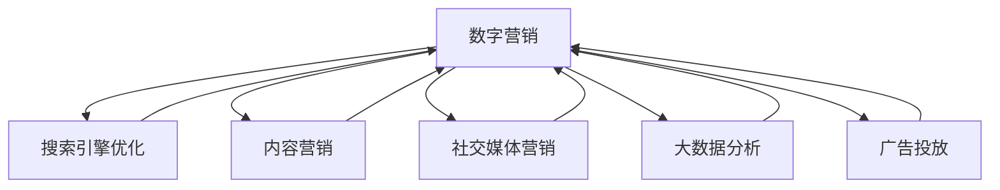

                 

## 1. 背景介绍

随着互联网的发展，数字营销已经成为了企业品牌建设、产品推广、客户互动的重要手段。传统的营销方式，如电视、广播、印刷媒体等，已经无法满足快速变化的互联网市场对营销时效性、精准性和互动性的需求。数字营销，通过网络和信息技术，实现了精准投放、高效互动和实时反馈，迅速成为企业营销的新宠。

数字营销的核心理念是利用网络技术手段，将企业品牌、产品信息传递给目标客户，并根据客户的反馈信息，不断优化营销策略，实现更精准的客户触达和营销效果。本文将探讨如何利用技术能力，进行有效的数字营销，帮助企业打造更加高效的营销体系。

## 2. 核心概念与联系

### 2.1 核心概念概述

为更好地理解数字营销的技术实现，我们首先需要介绍一些关键的概念及其相互联系：

- **数字营销（Digital Marketing）**：利用网络和信息技术，实现品牌宣传、产品推广、客户互动等营销活动的过程。
- **搜索引擎优化（Search Engine Optimization, SEO）**：通过优化网站内容和技术，提高搜索引擎排名，增加网站流量。
- **内容营销（Content Marketing）**：以有价值的内容吸引目标客户，建立品牌信任，促进客户转化。
- **社交媒体营销（Social Media Marketing）**：利用社交平台，进行品牌宣传和客户互动，扩大品牌影响力。
- **大数据分析（Big Data Analysis）**：通过收集、处理和分析大量数据，挖掘客户行为和市场趋势，优化营销策略。
- **广告投放（Advertising）**：利用程序化广告技术，精准投放广告，提高广告投放效率。

这些核心概念之间的联系可以通过以下Mermaid流程图来展示：



这个流程图展示了数字营销的各个子领域如何相互协作，共同构成一个完整的营销生态。

## 3. 核心算法原理 & 具体操作步骤
### 3.1 算法原理概述

数字营销的核心在于通过技术手段实现精准的客户触达和互动。其基本原理可以概括为以下几个步骤：

1. **数据收集与分析**：通过多种渠道收集客户数据，包括搜索行为、社交媒体互动、购买记录等，并进行大数据分析，挖掘客户需求和行为特征。
2. **目标客户画像**：根据客户数据，建立详细的客户画像，包括年龄、性别、兴趣、消费习惯等。
3. **精准营销**：利用SEO、内容营销、社交媒体营销等技术手段，将定制化内容传递给目标客户，实现精准营销。
4. **广告投放优化**：利用程序化广告技术，根据客户画像，优化广告投放策略，提高广告效果。
5. **反馈与迭代**：根据客户反馈信息，不断优化营销策略，实现持续改进。

### 3.2 算法步骤详解

以下是数字营销的核心算法步骤及其详细步骤：

**Step 1: 数据收集与清洗**

- 确定所需的数据类型和来源，如网站流量数据、社交媒体互动数据、电商交易数据等。
- 使用爬虫工具或API接口收集数据，并存储到数据库中。
- 对收集的数据进行清洗和预处理，去除噪声和异常值。

**Step 2: 数据挖掘与分析**

- 使用大数据技术（如Hadoop、Spark）对清洗后的数据进行分布式处理和分析。
- 利用数据挖掘算法（如关联规则挖掘、聚类分析、时序分析等）发现客户行为和市场趋势。
- 对分析结果进行可视化展示，如使用Tableau、PowerBI等工具。

**Step 3: 客户画像建立**

- 根据分析结果，提取关键特征，如年龄、性别、兴趣、消费习惯等。
- 利用机器学习算法（如K-means聚类、SVM分类等）对客户进行分类，建立客户画像。
- 对客户画像进行可视化展示，如使用PyCharm、RapidMiner等工具。

**Step 4: 营销内容生成与分发**

- 根据客户画像，生成个性化内容，如博客文章、社交媒体帖子、电子邮件等。
- 利用内容管理平台（如WordPress、Drupal）发布和分发内容。
- 利用SEO技术优化内容，提高搜索引擎排名。

**Step 5: 社交媒体互动**

- 利用社交媒体平台（如Facebook、Twitter、WeChat）与目标客户互动，进行品牌宣传和客户关系管理。
- 监测社交媒体互动数据，分析客户反馈和行为。
- 根据反馈信息，调整社交媒体营销策略。

**Step 6: 广告投放与优化**

- 使用程序化广告平台（如Google Ads、Facebook Ads）进行广告投放。
- 根据客户画像，优化广告投放策略，如定向、预算分配、创意设计等。
- 监测广告效果，进行实时优化，如A/B测试、再定向等。

**Step 7: 客户反馈与迭代**

- 收集客户反馈信息，包括评论、评分、投诉等。
- 分析客户反馈，发现问题并改进营销策略。
- 持续优化客户画像和营销内容，实现不断迭代和改进。

### 3.3 算法优缺点

数字营销技术具有以下优点：

1. **精准度高**：通过数据挖掘和分析，能够准确识别目标客户，实现精准营销。
2. **互动性强**：社交媒体互动和实时反馈机制，能够提高客户参与度和转化率。
3. **成本可控**：利用程序化广告技术，能够实现精准投放，降低广告成本。
4. **效果显著**：通过大数据分析和客户画像，能够快速优化营销策略，提高投资回报率。

同时，数字营销技术也存在一些缺点：

1. **数据隐私**：大量客户数据的收集和使用，涉及数据隐私和安全问题。
2. **技术门槛高**：需要掌握多种技术和工具，如大数据、数据分析、内容管理等，对技术要求较高。
3. **效果不稳定**：市场变化迅速，客户需求和行为随时可能变化，导致营销效果不稳定。
4. **投入较大**：需要投入大量的人力、物力进行数据收集、分析和内容生成，成本较高。

尽管存在这些缺点，数字营销技术的优点使其成为现代企业营销的重要手段。未来，随着技术的发展，数字营销的挑战也将逐步得到解决，为企业提供更加精准、高效、可靠的营销解决方案。

### 3.4 算法应用领域

数字营销技术在多个领域得到了广泛应用，具体如下：

- **电商行业**：利用大数据分析和程序化广告技术，进行精准投放和客户互动，提高销售转化率。
- **金融行业**：通过客户行为分析和智能推荐系统，提供个性化的金融产品和服务。
- **旅游行业**：利用社交媒体营销和内容营销，推广旅游产品，提升客户体验。
- **房地产行业**：利用大数据分析，进行精准定位和客户画像，提高营销效果。
- **医疗行业**：通过医疗问答系统和社交媒体互动，提供健康咨询和品牌推广。

此外，数字营销技术还可以应用于教育、媒体、娱乐等多个行业，为不同领域的企业提供定制化的营销解决方案。

## 4. 数学模型和公式 & 详细讲解  
### 4.1 数学模型构建

为了更好地理解数字营销中的技术实现，我们需要构建一些数学模型来描述其核心算法。

假设企业有 $N$ 个客户，每个客户有 $d$ 个特征，如年龄、性别、兴趣等。企业的目标是为这些客户推送个性化的广告内容。

定义客户特征向量为 $x_i \in \mathbb{R}^d$，广告内容为 $y \in \mathbb{R}^d$，客户对广告的评分向量为 $z_i \in \mathbb{R}^d$，客户画像向量为 $a_i \in \mathbb{R}^d$。

目标函数为最大化客户评分总和，即：

$$
\max \sum_{i=1}^N z_i
$$

其中 $z_i$ 的计算公式为：

$$
z_i = f(x_i, y, a_i)
$$

$f$ 为模型函数，根据实际应用场景，可以使用不同的函数形式，如线性回归、逻辑回归、神经网络等。

### 4.2 公式推导过程

以线性回归模型为例，进行公式推导。

设模型函数为线性回归模型：

$$
f(x_i, y, a_i) = \alpha x_i + \beta y + \gamma a_i
$$

其中 $\alpha, \beta, \gamma$ 为模型参数。

根据目标函数，优化问题转化为：

$$
\max \sum_{i=1}^N (\alpha x_i + \beta y + \gamma a_i)
$$

这是一个线性规划问题，可以使用拉格朗日乘子法求解。

设拉格朗日乘子为 $\lambda_i$，构建拉格朗日函数：

$$
\mathcal{L}(\alpha, \beta, \gamma, \lambda) = \sum_{i=1}^N (\alpha x_i + \beta y + \gamma a_i) + \sum_{i=1}^N \lambda_i (\sum_{i=1}^N z_i - \sum_{i=1}^N (\alpha x_i + \beta y + \gamma a_i))
$$

根据拉格朗日乘子法，将问题转化为求解：

$$
\min \frac{1}{2} \alpha^T A \alpha + \frac{1}{2} \beta^T B \beta + \frac{1}{2} \gamma^T C \gamma + \sum_{i=1}^N \lambda_i (\sum_{i=1}^N z_i - \sum_{i=1}^N (\alpha x_i + \beta y + \gamma a_i))
$$

其中 $A, B, C$ 为矩阵，$\alpha, \beta, \gamma, \lambda$ 为向量。

使用梯度下降法求解，可得到：

$$
\alpha \leftarrow \alpha - \eta \nabla_{\alpha} \mathcal{L}
$$

$$
\beta \leftarrow \beta - \eta \nabla_{\beta} \mathcal{L}
$$

$$
\gamma \leftarrow \gamma - \eta \nabla_{\gamma} \mathcal{L}
$$

$$
\lambda \leftarrow \lambda - \eta \nabla_{\lambda} \mathcal{L}
$$

### 4.3 案例分析与讲解

假设企业想要为两个客户 $x_1, x_2$ 推送广告内容 $y_1, y_2$，分别对广告评分 $z_1, z_2$ 为：

$$
z_1 = \alpha x_1 + \beta y_1 + \gamma a_1
$$

$$
z_2 = \alpha x_2 + \beta y_2 + \gamma a_2
$$

目标函数为最大化客户评分总和，即：

$$
\max z_1 + z_2
$$

假设 $x_1, x_2, y_1, y_2, a_1, a_2$ 已知，使用梯度下降法求解：

$$
\alpha \leftarrow \alpha - \eta \frac{1}{2} (x_1 + x_2)^T (x_1 + x_2) + \eta \frac{1}{2} (x_1 + x_2) (z_1 + z_2)
$$

$$
\beta \leftarrow \beta - \eta \frac{1}{2} (y_1 + y_2)^T (y_1 + y_2) + \eta \frac{1}{2} (y_1 + y_2) (z_1 + z_2)
$$

$$
\gamma \leftarrow \gamma - \eta \frac{1}{2} (a_1 + a_2)^T (a_1 + a_2) + \eta \frac{1}{2} (a_1 + a_2) (z_1 + z_2)
$$

$$
\lambda_1 \leftarrow \lambda_1 - \eta \frac{1}{2} (z_1 + z_2)
$$

$$
\lambda_2 \leftarrow \lambda_2 - \eta \frac{1}{2} (z_1 + z_2)
$$

## 5. 项目实践：代码实例和详细解释说明
### 5.1 开发环境搭建

在进行数字营销项目的开发时，我们需要搭建相应的开发环境。以下是使用Python进行开发的环境配置流程：

1. 安装Anaconda：从官网下载并安装Anaconda，用于创建独立的Python环境。

2. 创建并激活虚拟环境：
```bash
conda create -n pytorch-env python=3.8 
conda activate pytorch-env
```

3. 安装PyTorch：根据CUDA版本，从官网获取对应的安装命令。例如：
```bash
conda install pytorch torchvision torchaudio cudatoolkit=11.1 -c pytorch -c conda-forge
```

4. 安装各类工具包：
```bash
pip install numpy pandas scikit-learn matplotlib tqdm jupyter notebook ipython
```

完成上述步骤后，即可在`pytorch-env`环境中开始开发。

### 5.2 源代码详细实现

下面我们以社交媒体营销为例，给出使用Python进行数字营销的代码实现。

首先，定义社交媒体数据处理函数：

```python
import pandas as pd
import numpy as np

def process_social_media_data(data_path):
    # 读取数据
    data = pd.read_csv(data_path)
    
    # 数据清洗和预处理
    data.dropna(inplace=True)
    data.drop_duplicates(inplace=True)
    
    # 特征工程
    data['age'] = data['age'].astype(int)
    data['gender'] = data['gender'].map({'Male': 1, 'Female': 0})
    data['interest'] = data['interest'].fillna(data['interest'].mode()[0])
    
    # 编码标签
    data['label'] = data['label'].map({'Positive': 1, 'Negative': 0})
    
    # 分割数据集
    train_data = data.sample(frac=0.7, random_state=42)
    test_data = data.drop(train_data.index)
    
    # 标准化处理
    from sklearn.preprocessing import StandardScaler
    scaler = StandardScaler()
    train_data['age'] = scaler.fit_transform(train_data[['age']])
    test_data['age'] = scaler.transform(test_data[['age']])
    
    return train_data, test_data
```

然后，定义模型训练和评估函数：

```python
from sklearn.linear_model import LogisticRegression
from sklearn.metrics import accuracy_score, confusion_matrix
from sklearn.model_selection import train_test_split

def train_model(train_data, test_data, random_state=42):
    # 特征选择
    features = ['age', 'gender', 'interest']
    X_train, X_test, y_train, y_test = train_test_split(train_data[features], train_data['label'], test_size=0.2, random_state=random_state)
    
    # 模型训练
    model = LogisticRegression()
    model.fit(X_train, y_train)
    
    # 模型评估
    y_pred = model.predict(X_test)
    accuracy = accuracy_score(y_test, y_pred)
    confusion = confusion_matrix(y_test, y_pred)
    
    return model, accuracy, confusion
```

接着，启动模型训练和评估流程：

```python
data_path = 'social_media_data.csv'
train_data, test_data = process_social_media_data(data_path)
model, accuracy, confusion = train_model(train_data, test_data)

print(f"Accuracy: {accuracy:.2f}%")
print(f"Confusion Matrix:\n{confusion}")
```

以上就是使用Python进行社交媒体营销数据分析的代码实现。可以看到，利用Python和机器学习库，可以方便地处理和分析社交媒体数据，构建和评估社交媒体营销模型。

### 5.3 代码解读与分析

让我们再详细解读一下关键代码的实现细节：

**process_social_media_data函数**：
- 读取数据：使用pandas库读取CSV格式的数据文件。
- 数据清洗：使用dropna和drop_duplicates函数删除缺失值和重复样本。
- 特征工程：对年龄和兴趣字段进行编码处理，将性别字段进行独热编码，对年龄字段进行标准化处理。
- 标签编码：将标签字段进行独热编码。
- 数据分割：使用train_test_split函数将数据集分割为训练集和测试集。

**train_model函数**：
- 特征选择：选择年龄、性别、兴趣三个特征作为输入。
- 数据分割：使用train_test_split函数将特征数据和标签数据分割为训练集和测试集。
- 模型训练：使用LogisticRegression模型训练二分类模型。
- 模型评估：使用accuracy_score函数计算模型在测试集上的准确率，使用confusion_matrix函数输出混淆矩阵。

**训练流程**：
- 定义数据路径和特征选择。
- 调用process_social_media_data函数处理数据。
- 调用train_model函数训练模型并评估性能。
- 输出模型评估结果。

可以看到，通过Python和机器学习库，可以方便地进行社交媒体数据的处理和模型训练，快速评估模型的效果。这为数字营销中的数据驱动决策提供了技术支持。

## 6. 实际应用场景
### 6.1 智能客服系统

智能客服系统是数字营销的重要应用场景之一。通过智能客服，企业可以7x24小时不间断服务，快速响应客户咨询，提升客户满意度。

在技术实现上，可以利用自然语言处理技术，训练多轮对话模型，实现与客户的自然交互。通过收集客户反馈信息，不断优化对话模型，实现更加智能的客户服务。例如，可以使用Rasa框架进行智能客服系统的开发。

### 6.2 个性化推荐系统

个性化推荐系统是数字营销的另一个重要应用场景。通过推荐系统，企业可以根据用户的历史行为和兴趣，推荐符合用户需求的商品或服务。

在技术实现上，可以利用协同过滤、内容推荐等算法，构建个性化推荐模型。通过收集用户行为数据，进行特征工程和模型训练，实现精准推荐。例如，可以使用TensorFlow、PyTorch等深度学习框架进行推荐系统的开发。

### 6.3 品牌推广活动

品牌推广活动是数字营销的核心内容之一。通过多种渠道进行品牌宣传，提高品牌知名度和市场占有率。

在技术实现上，可以利用社交媒体营销技术，通过有针对性的内容投放，吸引目标客户关注。通过社交媒体互动数据，评估活动效果并进行优化调整。例如，可以使用Facebook Ads进行品牌推广活动的投放和优化。

### 6.4 未来应用展望

随着数字营销技术的不断发展，未来将在更多领域得到应用，为传统行业带来变革性影响。

在智慧城市治理中，数字营销技术可以应用于城市事件监测、舆情分析、应急指挥等环节，提高城市管理的自动化和智能化水平。

在教育领域，数字营销技术可以应用于在线教育平台，通过个性化推荐和互动营销，提高教育资源的使用效率。

在旅游行业，数字营销技术可以应用于旅游产品推广，通过精准投放和社交媒体营销，提升旅游产品的知名度和销售额。

## 7. 工具和资源推荐
### 7.1 学习资源推荐

为了帮助开发者系统掌握数字营销的理论基础和实践技巧，这里推荐一些优质的学习资源：

1. **《数字营销指南》**：由业内知名专家编写，全面介绍了数字营销的基本概念和应用场景，是数字营销入门的必读书籍。
2. **Google Analytics 认证课程**：Google提供的免费在线课程，涵盖Google Analytics的各种功能和应用，是了解数据分析的重要资源。
3. **Coursera《数字营销战略》课程**：由密歇根大学提供的在线课程，系统讲解了数字营销的基本原理和应用方法。
4. **HubSpot Academy《Inbound Marketing》课程**：提供了全面的inbound营销策略，帮助企业建立高效的营销体系。
5. **Kaggle数据科学竞赛平台**：提供了大量的真实数据集和竞赛题目，是数据驱动决策的实践平台。

通过对这些资源的学习实践，相信你一定能够快速掌握数字营销的理论基础和实践技巧，实现高效的营销目标。

### 7.2 开发工具推荐

高效的开发离不开优秀的工具支持。以下是几款用于数字营销开发的常用工具：

1. **Google Analytics**：提供网站流量分析、用户行为分析等功能的平台，是企业了解用户行为的重要工具。
2. **Google Ads**：程序化广告投放平台，能够精准投放广告，提高广告投放效率。
3. **Facebook Ads**：社交媒体广告投放平台，能够精准投放广告，提升品牌知名度和用户互动。
4. **HubSpot**：提供全面的营销自动化工具，包括内容管理、邮件营销、客户关系管理等。
5. **RapidMiner**：数据挖掘和数据可视化工具，能够快速处理和分析大量数据，构建数据驱动的营销模型。

合理利用这些工具，可以显著提升数字营销的开发效率，加快创新迭代的步伐。

### 7.3 相关论文推荐

数字营销技术的发展源于学界的持续研究。以下是几篇奠基性的相关论文，推荐阅读：

1. **《基于用户行为数据分析的个性化推荐系统》**：介绍了个性化推荐系统的基本原理和算法，是推荐系统领域的重要论文。
2. **《社交媒体数据挖掘与分析》**：介绍了社交媒体数据挖掘和分析的基本方法，是社交媒体营销领域的重要论文。
3. **《搜索引擎优化技术》**：介绍了搜索引擎优化技术的基本原理和应用方法，是SEO领域的重要论文。
4. **《大数据技术在数字营销中的应用》**：介绍了大数据技术在数字营销中的应用，是数字营销领域的重要论文。
5. **《程序化广告技术》**：介绍了程序化广告技术的基本原理和应用方法，是广告投放领域的重要论文。

这些论文代表了大数据营销技术的发展脉络。通过学习这些前沿成果，可以帮助研究者把握学科前进方向，激发更多的创新灵感。

## 8. 总结：未来发展趋势与挑战
### 8.1 总结

本文对数字营销技术进行了全面系统的介绍。首先探讨了数字营销的基本概念和核心技术，明确了数字营销在现代营销中的重要性。其次，从原理到实践，详细讲解了数字营销的核心算法步骤，给出了数字营销任务开发的完整代码实例。同时，本文还广泛探讨了数字营销技术在多个行业领域的应用前景，展示了数字营销技术的广阔应用场景。此外，本文精选了数字营销技术的各类学习资源，力求为读者提供全方位的技术指引。

通过本文的系统梳理，可以看到，数字营销技术正在成为现代企业营销的重要手段。通过数据驱动决策，企业可以实现更加精准、高效、可靠的营销效果。未来，随着技术的发展，数字营销的挑战也将逐步得到解决，为企业提供更加精准、高效、可靠的营销解决方案。

### 8.2 未来发展趋势

展望未来，数字营销技术将呈现以下几个发展趋势：

1. **数据驱动决策**：随着数据量的不断增加，数据驱动决策将成为数字营销的主流。企业将更加依赖数据挖掘和分析，优化营销策略，实现精准投放。
2. **人工智能技术**：人工智能技术，如机器学习、深度学习、自然语言处理等，将逐步应用于数字营销，提高营销效果和效率。
3. **跨领域应用**：数字营销技术将逐步扩展到多个领域，如医疗、金融、教育等，为不同领域的企业提供定制化的营销解决方案。
4. **个性化推荐系统**：个性化推荐系统将进一步优化，实现更精准的用户推荐，提升客户转化率。
5. **社交媒体营销**：社交媒体营销将更加智能化，通过大数据分析，实现精准的内容投放和用户互动。

这些趋势将推动数字营销技术的不断进步，为企业提供更加精准、高效、可靠的营销解决方案。

### 8.3 面临的挑战

尽管数字营销技术已经取得了显著成效，但在迈向更加智能化、普适化应用的过程中，仍面临诸多挑战：

1. **数据隐私**：大量客户数据的收集和使用，涉及数据隐私和安全问题。如何保护客户隐私，确保数据安全，将是数字营销的重要挑战。
2. **技术门槛**：数字营销技术需要掌握多种技术和工具，对技术要求较高。如何降低技术门槛，提供更易用的工具和平台，将是数字营销的关键。
3. **效果不稳定**：市场变化迅速，客户需求和行为随时可能变化，导致营销效果不稳定。如何提高营销效果的稳定性和可预测性，将是数字营销的难题。
4. **成本较高**：数字营销需要投入大量的人力、物力进行数据收集、分析和内容生成，成本较高。如何降低成本，提高营销效率，将是数字营销的重要方向。

尽管存在这些挑战，数字营销技术的优点使其成为现代企业营销的重要手段。未来，随着技术的不断进步，数字营销的挑战也将逐步得到解决，为企业提供更加精准、高效、可靠的营销解决方案。

### 8.4 研究展望

面对数字营销所面临的挑战，未来的研究需要在以下几个方面寻求新的突破：

1. **数据隐私保护**：探索更加高效的数据隐私保护技术，如差分隐私、联邦学习等，确保客户数据的安全和隐私。
2. **低成本技术**：开发更加低成本的数字营销技术，如边缘计算、移动端广告等，降低营销成本，提高营销效率。
3. **自动化决策**：研究自动化决策技术，如强化学习、因果推理等，提高营销策略的稳定性和可预测性。
4. **跨领域应用**：探索数字营销技术在跨领域应用中的新方法和新思路，如医疗、金融等。
5. **多渠道整合**：研究多渠道整合技术，如社交媒体、搜索引擎、邮件营销等，实现更全面的客户覆盖和互动。

这些研究方向将引领数字营销技术的不断进步，为不同领域的企业提供更加精准、高效、可靠的营销解决方案。面向未来，数字营销技术还需要与其他人工智能技术进行更深入的融合，如知识表示、因果推理、强化学习等，多路径协同发力，共同推动自然语言理解和智能交互系统的进步。只有勇于创新、敢于突破，才能不断拓展数字营销的边界，让智能技术更好地造福人类社会。

## 9. 附录：常见问题与解答

**Q1：如何选择合适的数字营销渠道？**

A: 选择合适的数字营销渠道需要考虑多个因素，包括目标客户的特点、营销目的、预算等。

1. **目标客户特点**：了解目标客户的年龄、性别、兴趣等特征，选择与客户行为相匹配的渠道。例如，年轻人喜欢社交媒体，而老年人则更倾向于邮件营销。
2. **营销目的**：明确营销的具体目的，如品牌推广、客户转化、产品销售等，选择最有效的渠道。例如，品牌推广可以通过社交媒体和搜索引擎营销，而产品销售可以通过电商平台和程序化广告。
3. **预算限制**：根据预算限制，选择性价比高的渠道。例如，程序化广告和社交媒体营销具有更高的性价比，而内容营销和SEO则需要更多的预算和时间投入。

**Q2：如何进行数据收集和分析？**

A: 数据收集和分析是数字营销的核心环节，以下是一些常用的方法和工具：

1. **数据收集**：使用爬虫工具或API接口收集数据，例如，使用Python的Scrapy库或RapidMiner平台进行数据抓取。
2. **数据清洗和预处理**：使用数据清洗工具，如Pandas和NumPy，进行数据清洗和预处理，去除噪声和异常值。
3. **数据分析**：使用数据分析工具，如Excel、Tableau、PowerBI，进行数据可视化，挖掘客户行为和市场趋势。
4. **数据挖掘**：使用数据挖掘工具，如Python的Scikit-learn、RapidMiner，进行特征选择、模型训练和预测，优化营销策略。

**Q3：如何评估数字营销的效果？**

A: 评估数字营销的效果是确保营销策略有效性的关键步骤，以下是一些常用的评估指标和方法：

1. **转化率**：评估用户从广告展示到完成购买或注册等行为的转化率。
2. **点击率**：评估广告点击次数与展示次数的比率，衡量广告的吸引力。
3. **ROI**：评估营销活动的投资回报率，衡量营销效果和成本的关系。
4. **用户满意度**：通过调查问卷或用户评价，评估用户对营销活动的满意度。
5. **品牌知名度**：通过品牌搜索量或社交媒体互动数据，评估品牌知名度的提升。

通过这些评估指标，可以全面了解数字营销的效果，并进行持续优化。

**Q4：如何优化数字营销策略？**

A: 优化数字营销策略是提升营销效果的关键，以下是一些常用的优化方法：

1. **A/B测试**：通过对比不同广告创意、投放渠道、投放时间等变量的效果，选择最优方案。
2. **再定向广告**：通过收集用户行为数据，对已经访问过网站的用户进行再定向投放，提高广告效果。
3. **内容优化**：根据用户反馈数据，优化广告内容，提高用户点击率和转化率。
4. **数据驱动决策**：通过大数据分析和机器学习模型，预测市场趋势和用户需求，优化营销策略。
5. **实时优化**：通过实时监测广告效果，进行动态调整，提高广告投放的精准度。

这些优化方法能够帮助企业不断提升数字营销效果，实现更好的营销成果。

---

作者：禅与计算机程序设计艺术 / Zen and the Art of Computer Programming

