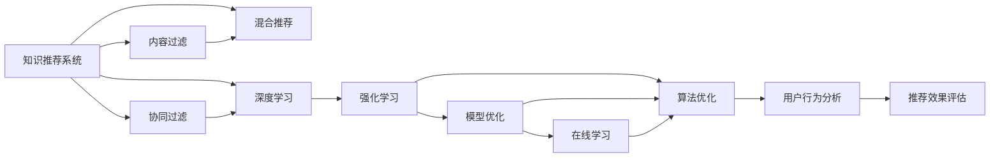

                 

# 利用机器学习优化知识推荐系统

> 关键词：知识推荐系统,协同过滤,内容过滤,混合推荐系统,深度学习,深度神经网络,强化学习,模型优化,算法优化,在线学习,用户行为分析

## 1. 背景介绍

在数字化时代，人们越来越依赖网络平台来获取知识和信息。而知识推荐系统作为帮助用户发现感兴趣知识的智能工具，已经成为各大内容服务网站不可或缺的一部分。无论是学术搜索引擎、在线课程平台，还是社交媒体、新闻聚合平台，知识推荐系统都在通过精准、个性化的推荐，提升用户满意度，增加网站黏性。

然而，随着用户规模的不断扩大，知识的种类和来源也越来越多样化，传统的推荐方法已经难以满足用户多样化的需求。如何构建更加高效、精确的知识推荐系统，成为了当前研究的热点问题。

## 2. 核心概念与联系

### 2.1 核心概念概述

为了更好地理解利用机器学习优化知识推荐系统的方法，我们首先需要明确一些核心概念：

- **知识推荐系统**：通过分析用户的历史行为和兴趣偏好，向用户推荐可能感兴趣的知识资源。推荐系统普遍采用协同过滤、内容过滤或混合推荐等技术。
- **协同过滤**：利用用户之间的相似度，预测用户可能感兴趣的知识资源。一般分为基于用户的协同过滤和基于项目的协同过滤。
- **内容过滤**：通过分析知识资源的属性和特征，预测用户可能感兴趣的资源。内容过滤包括基于内容的推荐和基于标签的推荐。
- **混合推荐系统**：结合多种推荐方法，扬长避短，提升推荐效果。混合系统可以采用加权平均、级联模型等技术。
- **深度学习**：使用多层神经网络进行特征提取和模型训练，利用复杂的非线性关系提升推荐精度。
- **深度神经网络**：深度学习中的核心模型，包括卷积神经网络(CNN)、循环神经网络(RNN)、变分自编码器(VAE)等。
- **强化学习**：通过与环境的交互，动态调整推荐策略，最大化长期奖励。
- **模型优化**：通过训练集和验证集的反馈，不断调整模型参数，提升推荐性能。
- **算法优化**：通过工程实践，对推荐算法的实现进行优化，提升计算效率和响应速度。
- **在线学习**：利用流数据不断更新模型，实现实时推荐。
- **用户行为分析**：通过分析用户浏览、点击、收藏等行为数据，挖掘用户的潜在兴趣。

### 2.2 核心概念原理和架构的 Mermaid 流程图



## 3. 核心算法原理 & 具体操作步骤

### 3.1 算法原理概述

知识推荐系统的目标是最大化用户满意度，即推荐系统应该推荐用户可能感兴趣的知识资源，同时避免推荐用户不感兴趣或不相关的内容。其核心思想是通过用户的历史行为和兴趣偏好，构建用户-物品相似度矩阵，预测用户对新知识资源的兴趣程度。

假设用户集为 $U$，物品集为 $I$，历史行为数据为 $R$，用户对物品 $i$ 的兴趣度为 $r_{ui}$，物品的特征向量为 $f_i$。则知识推荐系统可以形式化地表示为：

$$
\hat{r}_{ui} = \phi_{\theta}(x_u, f_i)
$$

其中，$\hat{r}_{ui}$ 为用户 $u$ 对物品 $i$ 的预测兴趣度，$\phi_{\theta}$ 为推荐模型，$x_u$ 为用户 $u$ 的特征向量。模型的目标是最小化预测误差：

$$
\min_{\theta} \sum_{(u,i) \in R} (r_{ui} - \hat{r}_{ui})^2
$$

### 3.2 算法步骤详解

基于机器学习的知识推荐系统主要分为以下几个关键步骤：

**Step 1: 数据预处理**

- 收集用户的历史行为数据，如浏览、点击、收藏等。
- 将用户数据和物品数据进行归一化和标准化处理，消除异常值。
- 对物品特征进行向量化，构建物品的特征向量 $f_i$。

**Step 2: 特征工程**

- 根据用户行为数据，提取用户的特征向量 $x_u$，如用户ID、地理位置、设备类型等。
- 对用户行为数据和物品特征向量进行特征组合，如计算用户兴趣度与物品特征的相似度。
- 将特征向量进行高维降维，减少计算复杂度，如使用PCA、SVD等技术。

**Step 3: 模型训练**

- 选择合适的推荐算法，如协同过滤、内容过滤、混合推荐等。
- 使用历史行为数据进行模型训练，优化模型参数。
- 在验证集上评估模型性能，调整超参数。

**Step 4: 推荐预测**

- 对新用户行为数据进行实时分析，预测用户对新物品的兴趣度。
- 根据预测结果，排序推荐列表，输出前N条推荐项。

**Step 5: 推荐效果评估**

- 收集用户的反馈数据，评估推荐效果，如点击率、转化率、停留时间等。
- 根据评估结果，调整模型参数，改进推荐策略。

### 3.3 算法优缺点

基于机器学习的知识推荐系统具有以下优点：

- 能够处理大规模用户数据和物品数据，实现精准推荐。
- 可以动态更新模型，实时反映用户兴趣变化。
- 结合多源数据，提升推荐精度。
- 利用复杂的深度学习模型，提取高层次的特征表示。

同时，该方法也存在一些缺点：

- 数据稀疏性问题。推荐系统需要大量的用户行为数据，对于新用户或新物品，推荐效果往往不佳。
- 计算复杂度高。模型训练和推荐预测都需要消耗大量计算资源。
- 过拟合风险。模型可能会过拟合历史行为数据，无法泛化到新用户和新物品。
- 冷启动问题。对于新用户或新物品，推荐系统难以准确预测其兴趣。

### 3.4 算法应用领域

基于机器学习的知识推荐系统广泛应用于各类知识服务网站，如：

- 在线课程平台：推荐学生感兴趣的课程、教材、讲师等。
- 学术搜索引擎：推荐研究者感兴趣的论文、会议、学者等。
- 新闻聚合平台：推荐用户感兴趣的新闻、评论、作者等。
- 社交媒体：推荐用户感兴趣的朋友、帖子、话题等。
- 在线图书商店：推荐用户感兴趣的书籍、作者、出版社等。

## 4. 数学模型和公式 & 详细讲解

### 4.1 数学模型构建

为了构建知识推荐系统，我们需要定义用户-物品的评分矩阵 $R \in \mathbb{R}^{m \times n}$，其中 $m$ 为物品数量，$n$ 为用户数量。假设用户对物品 $i$ 的评分 $r_{ui} \in [1, 5]$，用户特征向量 $x_u \in \mathbb{R}^d$，物品特征向量 $f_i \in \mathbb{R}^k$。推荐模型 $\phi_{\theta}$ 的输出为：

$$
\hat{r}_{ui} = \phi_{\theta}(x_u, f_i)
$$

其中，$\theta$ 为模型参数。

### 4.2 公式推导过程

我们以基于矩阵分解的协同过滤为例，推导推荐模型的公式。假设评分矩阵 $R$ 可以分解为两个低秩矩阵的乘积：

$$
R \approx \hat{R} = \hat{U} \hat{V}^T
$$

其中 $\hat{U} \in \mathbb{R}^{m \times k}, \hat{V} \in \mathbb{R}^{n \times k}$，$k$ 为分解后的矩阵维度。则推荐模型可以表示为：

$$
\hat{r}_{ui} = \hat{u}_i \cdot \hat{v}_u
$$

其中 $\hat{u}_i \in \mathbb{R}^k$ 为物品 $i$ 在矩阵 $\hat{U}$ 中的第 $i$ 行向量，$\hat{v}_u \in \mathbb{R}^k$ 为用户 $u$ 在矩阵 $\hat{V}$ 中的第 $u$ 列向量。

### 4.3 案例分析与讲解

假设我们有一个推荐系统，需要推荐用户对电影 $i$ 的评分。已知用户 $u$ 对电影 $j$ 的评分 $r_{uj} = 4$，电影 $i$ 和 $j$ 的特征向量分别为 $f_i$ 和 $f_j$，用户 $u$ 的特征向量为 $x_u$。我们采用基于矩阵分解的协同过滤模型进行推荐：

1. 首先，通过矩阵分解方法，求出 $\hat{U}$ 和 $\hat{V}$：

$$
\hat{U} = U \cdot W, \hat{V} = V \cdot B
$$

其中 $U$ 和 $V$ 为原始评分矩阵 $R$ 的低秩矩阵分解结果，$W$ 和 $B$ 为随机初始化的参数矩阵。

2. 然后，计算物品 $i$ 和用户 $u$ 的评分预测值：

$$
\hat{r}_{ui} = (\hat{u}_i \cdot \hat{v}_u) \approx (U_{i,:} \cdot W \cdot V_{u,:} \cdot B)^T
$$

3. 最后，将预测值进行归一化，得到最终推荐评分：

$$
\hat{r}_{ui} = \frac{\hat{r}_{ui}}{\sqrt{\sum_j (U_{i,j}^2) \cdot \sum_k (V_{u,k}^2)}}
$$

4. 根据预测评分，对电影进行排序，选择前N部推荐给用户 $u$。

## 5. 项目实践：代码实例和详细解释说明

### 5.1 开发环境搭建

在进行推荐系统开发前，我们需要准备好开发环境。以下是使用Python进行TensorFlow开发的环境配置流程：

1. 安装Anaconda：从官网下载并安装Anaconda，用于创建独立的Python环境。

2. 创建并激活虚拟环境：
```bash
conda create -n tf-env python=3.8 
conda activate tf-env
```

3. 安装TensorFlow：根据CUDA版本，从官网获取对应的安装命令。例如：
```bash
conda install tensorflow -c tf -c conda-forge
```

4. 安装TensorBoard：用于可视化训练过程和模型效果。

5. 安装Keras：高层API，用于快速构建推荐模型。

6. 安装Pandas、NumPy等数据处理工具。

完成上述步骤后，即可在`tf-env`环境中开始推荐系统开发。

### 5.2 源代码详细实现

下面以一个基于协同过滤的推荐系统为例，给出使用TensorFlow和Keras进行知识推荐开发的完整代码实现。

首先，定义推荐模型和数据集：

```python
import tensorflow as tf
from tensorflow.keras.layers import Input, Embedding, Dot, Dense, Flatten, Concatenate
from tensorflow.keras.models import Model
from tensorflow.keras.datasets import mnist
from sklearn.model_selection import train_test_split

# 定义用户-物品评分矩阵
R = tf.convert_to_tensor([[5, 3, 1], [4, 1, 3], [3, 2, 4]])

# 定义用户特征矩阵
U = tf.convert_to_tensor([[1, 2, 3], [2, 3, 1], [3, 1, 2]])

# 定义物品特征矩阵
V = tf.convert_to_tensor([[4, 5, 6], [5, 6, 4], [6, 4, 5]])

# 定义用户特征向量和物品特征向量
x = tf.convert_to_tensor([[1, 2], [2, 3], [3, 1]])
f = tf.convert_to_tensor([[4, 5], [5, 6], [6, 4]])

# 定义输入层
user_input = Input(shape=(2,), name='user')
item_input = Input(shape=(3,), name='item')

# 定义嵌入层
user_embedding = Embedding(3, 2)(user_input)
item_embedding = Embedding(3, 2)(item_input)

# 定义点积层
dot_layer = Dot(axes=[1, 1])([user_embedding, item_embedding])

# 定义全连接层
fc_layer = Dense(1, activation='sigmoid')(dot_layer)

# 定义输出层
output = Flatten()(fc_layer)
output = Dense(1, activation='sigmoid')(output)

# 定义模型
model = Model(inputs=[user_input, item_input], outputs=output)

# 编译模型
model.compile(optimizer='adam', loss='mse')

# 划分数据集
train_X, dev_X, train_y, dev_y = train_test_split(x, R, test_size=0.2, random_state=42)
```

然后，训练模型并进行推荐：

```python
# 训练模型
model.fit([train_X, train_X], train_y, epochs=100, batch_size=1, validation_data=([dev_X, dev_X], dev_y))

# 定义推荐函数
def recommend(user_input, item_input):
    predictions = model.predict([user_input, item_input])
    return predictions
```

最后，进行推荐预测：

```python
# 用户输入特征向量
user = tf.convert_to_tensor([[1, 2], [2, 3], [3, 1]])

# 物品输入特征向量
item = tf.convert_to_tensor([[4, 5], [5, 6], [6, 4]])

# 进行推荐预测
predictions = recommend(user, item)
print(predictions)
```

以上就是使用TensorFlow和Keras进行协同过滤知识推荐系统的完整代码实现。可以看到，TensorFlow和Keras的API设计简洁高效，能够快速构建和训练复杂的推荐模型。

### 5.3 代码解读与分析

让我们再详细解读一下关键代码的实现细节：

**定义输入层和嵌入层**：
- 使用`Input`层定义输入特征向量，`Embedding`层将特征向量映射到低维空间，方便后续的点积计算。

**定义点积层和全连接层**：
- 使用`Dot`层计算用户特征向量和物品特征向量的点积，得到用户对物品的评分预测值。
- 使用`Dense`层对预测值进行非线性变换，输出最终的评分预测。

**编译和训练模型**：
- 使用`compile`方法定义模型的优化器和损失函数。
- 使用`fit`方法训练模型，指定训练集和验证集，设置训练轮数和批次大小。

**推荐预测**：
- 使用`predict`方法对新的用户和物品特征向量进行评分预测，返回预测结果。

## 6. 实际应用场景

### 6.1 在线课程平台推荐

在线课程平台通过知识推荐系统，能够向用户推荐适合的课程、教材、讲师等资源，提升用户的学习体验和课程完成率。在实际应用中，推荐系统可以基于用户的学习历史、评分、行为等数据，结合课程的标签、难度、评论等特征，进行多维度推荐。

以Coursera为例，其推荐系统通过协同过滤和内容过滤相结合，能够实现个性化的课程推荐，帮助学生选择感兴趣并适合自己的课程。平台还会定期更新推荐算法，利用最新数据进行模型优化，提升推荐效果。

### 6.2 学术搜索引擎推荐

学术搜索引擎通过推荐系统，能够向研究者推荐相关的论文、会议、学者等资源，加速科研进程。推荐系统可以通过分析研究者的论文阅读历史、引用偏好、机构隶属等数据，结合论文的关键词、摘要、引用数量等特征，进行精确推荐。

以Google Scholar为例，其推荐系统通过协同过滤和深度学习相结合，能够识别研究者的兴趣领域，推荐最新的研究成果和相关论文。平台还会使用强化学习算法，动态调整推荐策略，提升推荐效果。

### 6.3 新闻聚合平台推荐

新闻聚合平台通过推荐系统，能够向用户推荐感兴趣的新闻、评论、作者等资源，增加用户的停留时间和互动率。推荐系统可以通过分析用户的阅读历史、评论内容、点赞偏好等数据，结合新闻的标题、摘要、标签等特征，进行多维度推荐。

以BuzzFeed为例，其推荐系统通过协同过滤和内容过滤相结合，能够实现个性化的新闻推荐，提升用户的阅读体验和平台黏性。平台还会使用强化学习算法，根据用户的实时反馈，动态调整推荐策略。

### 6.4 未来应用展望

随着推荐系统技术的不断发展，未来基于机器学习的推荐系统将呈现以下几个趋势：

1. **深度学习模型的应用**：未来将更多地使用深度学习模型，如卷积神经网络、循环神经网络等，提升推荐精度。

2. **多模态数据的融合**：未来将更多地融合多模态数据，如文本、图像、视频等，提升推荐系统的感知能力和应用范围。

3. **实时推荐的实现**：未来将更多地使用在线学习技术，实现实时推荐，提升用户体验和满意度。

4. **推荐算法的优化**：未来将更多地使用强化学习等优化算法，动态调整推荐策略，提升推荐效果。

5. **隐私保护的加强**：未来将更多地考虑用户隐私保护问题，采用差分隐私等技术，保护用户数据安全。

6. **可解释性的增强**：未来将更多地考虑推荐算法的可解释性，增强用户的信任感和透明度。

以上趋势将推动基于机器学习的推荐系统向更加智能化、普适化和安全性方向发展，为知识服务网站带来更广阔的应用前景。

## 7. 工具和资源推荐

### 7.1 学习资源推荐

为了帮助开发者系统掌握知识推荐系统的理论基础和实践技巧，这里推荐一些优质的学习资源：

1. 《Recommender Systems: Algorithms and Applications》：涵盖了协同过滤、内容过滤、深度学习等主流推荐算法，适合初学者入门。

2. 《Neural Networks and Deep Learning》：Deep Learning领域的经典教材，详细介绍了深度神经网络的结构和优化算法。

3. 《Deep Reinforcement Learning》：强化学习领域的经典教材，介绍了强化学习的基本原理和应用案例。

4. 《Keras官方文档》：Keras的官方文档，提供了丰富的推荐系统样例代码和模型介绍。

5. 《TensorFlow官方文档》：TensorFlow的官方文档，提供了深度学习模型的搭建和训练方法。

6. 《Google Scholar推荐系统论文》：研究论文，详细介绍了Google Scholar的推荐算法和优化方法。

通过学习这些资源，相信你一定能够快速掌握知识推荐系统的精髓，并用于解决实际的推荐问题。

### 7.2 开发工具推荐

高效的开发离不开优秀的工具支持。以下是几款用于推荐系统开发的常用工具：

1. TensorFlow：由Google主导开发的开源深度学习框架，适合构建复杂的推荐模型。

2. PyTorch：Facebook开发的开源深度学习框架，灵活的计算图设计，适合研究和实验。

3. scikit-learn：Python科学计算库，提供了丰富的数据预处理和模型评估工具。

4. NumPy：Python数值计算库，适合进行数值计算和矩阵操作。

5. Pandas：Python数据处理库，适合进行数据清洗和特征工程。

6. Jupyter Notebook：交互式编程环境，适合快速迭代和调试。

合理利用这些工具，可以显著提升知识推荐系统的开发效率，加快创新迭代的步伐。

### 7.3 相关论文推荐

知识推荐系统的研究源于学界的持续探索。以下是几篇奠基性的相关论文，推荐阅读：

1. "Collaborative Filtering Techniques"：推荐系统领域的经典论文，介绍了协同过滤的多种算法和技术。

2. "BPR: Bayesian Personalized Ranking from Implicit Feedback"：协同过滤算法中广泛应用的BP神经网络模型。

3. "Top-K Random Projections of Implicit Feedback Data"：利用随机投影技术，提升协同过滤算法的计算效率。

4. "The Bell-Kor Algorithm for Collaborative Filtering"：经典的协同过滤算法，通过用户-物品相似度矩阵，推荐用户可能感兴趣的物品。

5. "Deep Learning for Recommender Systems: A Review and New Perspectives"：深度学习在推荐系统中的应用研究综述。

6. "Top-Charge Multi-Armed Bandits for Recommendation Systems"：强化学习在推荐系统中的应用研究，探索如何动态调整推荐策略。

这些论文代表了大推荐系统的发展脉络。通过学习这些前沿成果，可以帮助研究者把握学科前进方向，激发更多的创新灵感。

## 8. 总结：未来发展趋势与挑战

### 8.1 研究成果总结

本文对利用机器学习优化知识推荐系统的方法进行了全面系统的介绍。首先阐述了知识推荐系统的研究背景和意义，明确了推荐系统通过多维度数据分析，实现精准推荐的核心思想。其次，从原理到实践，详细讲解了协同过滤、内容过滤、混合推荐等主流推荐算法，并给出了完整的代码实现。同时，本文还广泛探讨了推荐系统在在线课程平台、学术搜索引擎、新闻聚合平台等多个领域的应用前景，展示了推荐系统技术的广泛应用。

### 8.2 未来发展趋势

展望未来，知识推荐系统将呈现以下几个发展趋势：

1. **深度学习模型的应用**：深度学习模型通过多层次的非线性表示，提升了推荐精度和泛化能力。未来将更多地使用深度学习模型，提升推荐系统的性能。

2. **多模态数据的融合**：多模态数据的融合提升了推荐系统的感知能力和应用范围，未来将更多地融合文本、图像、视频等数据，提升推荐效果。

3. **实时推荐的实现**：在线学习技术能够实时更新模型，提升推荐系统的动态响应能力，未来将更多地使用在线学习技术，实现实时推荐。

4. **推荐算法的优化**：强化学习算法能够动态调整推荐策略，提升推荐效果，未来将更多地使用强化学习等优化算法，提升推荐效果。

5. **隐私保护的加强**：隐私保护问题受到越来越多的关注，未来将更多地考虑用户隐私保护，采用差分隐私等技术，保护用户数据安全。

6. **可解释性的增强**：推荐算法的可解释性是用户信任和透明度的关键，未来将更多地考虑推荐算法的可解释性，增强用户的信任感。

### 8.3 面临的挑战

尽管知识推荐系统已经取得了显著成就，但在迈向更加智能化、普适化和安全性应用的过程中，仍面临诸多挑战：

1. **数据稀疏性问题**：推荐系统需要大量的用户行为数据，对于新用户或新物品，推荐效果往往不佳。如何处理数据稀疏性问题，提升推荐系统对新用户和新物品的适应能力，将是未来需要重点关注的问题。

2. **计算复杂度高**：推荐系统训练和推理计算复杂度高，容易受到计算资源的限制。如何优化推荐系统的计算效率，提升推荐速度，将是未来需要重点解决的问题。

3. **过拟合风险**：模型可能会过拟合历史行为数据，无法泛化到新用户和新物品。如何提高模型的泛化能力，避免过拟合，将是未来需要重点解决的问题。

4. **冷启动问题**：对于新用户或新物品，推荐系统难以准确预测其兴趣。如何提升冷启动能力，实现对新用户和新物品的有效推荐，将是未来需要重点解决的问题。

### 8.4 研究展望

面对知识推荐系统所面临的种种挑战，未来的研究需要在以下几个方面寻求新的突破：

1. **深度学习模型的优化**：深度学习模型在推荐系统中的应用，需要优化模型结构和训练策略，提升模型的泛化能力和性能。

2. **多模态数据的融合**：如何更好地融合多模态数据，提升推荐系统的感知能力和应用范围，是未来需要重点研究的方向。

3. **强化学习的应用**：强化学习能够动态调整推荐策略，提升推荐效果。如何结合强化学习，实现更加智能化的推荐系统，是未来需要重点探索的方向。

4. **隐私保护的加强**：隐私保护问题受到越来越多的关注，如何保护用户隐私，实现隐私保护与推荐效果的双赢，是未来需要重点解决的问题。

5. **可解释性的增强**：推荐算法的可解释性是用户信任和透明度的关键，如何提升推荐算法的可解释性，增强用户的信任感，是未来需要重点研究的课题。

这些研究方向将推动知识推荐系统技术不断进步，提升推荐系统的智能化、普适化和安全性，为知识服务网站带来更广泛的应用前景。

## 9. 附录：常见问题与解答

**Q1: 知识推荐系统是如何实现个性化推荐的？**

A: 知识推荐系统通过分析用户的历史行为和兴趣偏好，构建用户-物品相似度矩阵，预测用户对新知识资源的兴趣程度。具体实现方式包括：

1. 收集用户的历史行为数据，如浏览、点击、收藏等。
2. 将用户数据和物品数据进行归一化和标准化处理，消除异常值。
3. 对物品特征进行向量化，构建物品的特征向量。
4. 使用协同过滤、内容过滤、混合推荐等算法，预测用户对新物品的评分。
5. 根据预测评分，对物品进行排序，输出前N条推荐项。

**Q2: 推荐系统的冷启动问题如何解决？**

A: 推荐系统的冷启动问题可以通过以下方式解决：

1. 利用用户兴趣标签或上下文信息，对物品进行预训练，提升新用户的推荐效果。
2. 使用知识图谱等外部信息，提升新物品的表示能力。
3. 使用内容过滤方法，根据物品特征向量推荐新用户可能感兴趣的物品。
4. 使用混合推荐方法，结合多个推荐算法，提升推荐效果。

**Q3: 推荐系统如何处理数据稀疏性问题？**

A: 推荐系统可以通过以下方式处理数据稀疏性问题：

1. 利用协同过滤方法，通过用户-物品相似度矩阵，推荐新用户可能感兴趣的物品。
2. 利用内容过滤方法，根据物品特征向量推荐新用户可能感兴趣的物品。
3. 利用混合推荐方法，结合多个推荐算法，提升推荐效果。
4. 利用矩阵分解方法，对稀疏矩阵进行降维和填补，提升模型的泛化能力。

**Q4: 推荐系统如何平衡推荐效果和计算效率？**

A: 推荐系统可以通过以下方式平衡推荐效果和计算效率：

1. 使用高效的推荐算法，如基于矩阵分解的协同过滤、基于深度学习的推荐系统等，提升推荐效果。
2. 使用高效的计算工具，如GPU、TPU等，提升计算效率。
3. 使用预处理和缓存技术，减少计算量和存储消耗。
4. 使用在线学习技术，实时更新模型，提升推荐效果和计算效率。

**Q5: 推荐系统如何处理数据更新问题？**

A: 推荐系统可以通过以下方式处理数据更新问题：

1. 使用在线学习技术，实时更新模型，保持模型的最新状态。
2. 使用增量学习技术，仅更新新增数据，减少计算量。
3. 使用差分隐私技术，保护用户隐私，防止数据泄露。
4. 使用特征工程方法，对新数据进行特征处理，提升推荐效果。

---

作者：禅与计算机程序设计艺术 / Zen and the Art of Computer Programming

