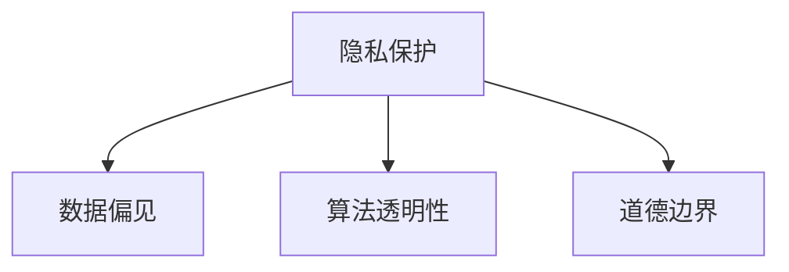

                 

# 制定AI伦理准则：搜索的道德底线

> 关键词：AI伦理、搜索算法、道德底线、隐私保护、数据安全、公平性、透明度

## 1. 背景介绍

### 1.1 问题由来
随着人工智能技术的迅猛发展，尤其是深度学习和大数据技术的结合，AI已经在搜索、推荐、广告等多个领域得到广泛应用。然而，这些算法在带来便捷的同时，也引发了一系列道德和伦理问题。

- **数据隐私**：搜索结果、推荐内容和广告投放中涉及大量个人数据，如何保护用户隐私成为一大挑战。
- **数据偏见**：算法可能基于训练数据集的偏见，导致不公平的搜索结果和推荐，甚至加剧社会不公。
- **算法透明性**：许多搜索算法采用了复杂的深度学习模型，用户难以理解其决策过程，导致信任度下降。
- **道德冲突**：某些AI技术如人脸识别、深度伪造等，可能被用于不道德甚至犯罪行为，带来伦理争议。

这些问题要求我们必须制定一套明确的AI伦理准则，以确保AI技术的安全、公平和透明，提升用户的信任和接受度。

### 1.2 问题核心关键点
制定AI伦理准则的核心在于：
- **保护隐私**：确保用户数据不被滥用，保护隐私权。
- **减少偏见**：避免算法偏见，确保所有用户享受公平的服务。
- **提升透明度**：让用户理解算法的工作原理和决策依据，增强信任。
- **预防滥用**：防止AI技术被用于不道德或犯罪目的。

本文旨在对这些核心问题进行深入探讨，提出相应的伦理准则和建议，为AI搜索算法的健康发展提供指导。

## 2. 核心概念与联系

### 2.1 核心概念概述

为更好地理解搜索算法的伦理问题，本节将介绍几个关键概念：

- **隐私保护**：指在数据收集、存储、使用和共享过程中，采取措施保护用户个人信息不被泄露。
- **数据偏见**：指算法在训练和部署过程中，由于训练数据或数据处理方式的不公平，导致输出结果存在系统性偏差。
- **算法透明性**：指算法模型的工作原理、决策依据和数据使用方式能够被用户理解，以增强信任和接受度。
- **道德边界**：指AI技术在应用过程中应遵守的道德规范，避免被用于不道德或犯罪行为。

这些核心概念之间的关系可以通过以下Mermaid流程图来展示：



这个流程图展示了隐私保护、数据偏见、算法透明性和道德边界之间的逻辑关系：

1. 隐私保护是基础，确保数据使用过程中的安全性和合法性。
2. 数据偏见需要通过隐私保护和算法透明性得到缓解，避免对公平性的影响。
3. 算法透明性有助于用户理解算法决策，增强信任，同时也有助于发现和纠正偏见。
4. 道德边界是对算法应用范围和行为的约束，防止被用于不道德或犯罪行为。

这些概念共同构成了AI搜索算法的伦理框架，旨在确保其在应用过程中遵循道德规范，保护用户权益，实现公平透明。

## 3. 核心算法原理 & 具体操作步骤

### 3.1 算法原理概述

基于AI的搜索算法通常涉及复杂的深度学习模型，如Transformer、RNN等，通过学习海量数据，实现高效、精确的搜索结果推荐。其核心算法原理包括：

- **预训练模型**：使用大规模无标签数据进行预训练，学习通用的语言和知识表示。
- **微调**：在特定领域的数据上微调模型，使其能够适应具体的搜索需求。
- **推荐算法**：通过学习用户的历史行为和偏好，预测用户可能感兴趣的内容。

### 3.2 算法步骤详解

#### 步骤1: 数据收集与预处理
- **收集数据**：从网站、用户行为日志、广告投放记录等渠道收集数据。
- **数据清洗**：去除噪声、重复和不相关数据，确保数据质量和完整性。
- **隐私保护**：采用差分隐私、匿名化等技术，保护用户隐私。

#### 步骤2: 模型训练与微调
- **选择模型**：根据搜索场景选择合适的预训练模型，如BERT、GPT等。
- **微调模型**：在特定领域数据上微调模型，确保其在特定场景下的适应性。
- **优化参数**：通过调整学习率、批大小等超参数，优化模型性能。

#### 步骤3: 推荐算法与优化
- **选择推荐算法**：根据用户偏好和搜索行为选择合适的推荐算法，如协同过滤、内容推荐、混合推荐等。
- **动态优化**：根据用户反馈和行为变化，动态调整推荐模型。

### 3.3 算法优缺点
#### 优点
1. **高效性**：通过学习大量数据，能够在短时间内提供精准的搜索结果。
2. **个性化**：能够根据用户历史行为和偏好，提供个性化的推荐内容。
3. **自适应性**：通过微调，模型能够适应不同领域和用户群体的需求。

#### 缺点
1. **数据依赖性强**：算法性能高度依赖于训练数据的规模和质量。
2. **可能存在偏见**：数据偏见可能导致算法输出存在系统性偏差。
3. **透明度低**：复杂模型难以解释，用户难以理解决策依据。

### 3.4 算法应用领域
基于AI的搜索算法广泛应用于互联网、电子商务、广告投放等多个领域，具体包括：

- **搜索引擎**：如Google、Bing等，提供基于关键词的搜索服务。
- **推荐系统**：如Netflix、Amazon等，提供个性化的内容推荐。
- **广告投放**：如Google Ads、Facebook Ads等，精准投放广告。
- **智能客服**：如AI客服机器人，提供24小时不间断服务。
- **智能家居**：如智能音箱，根据用户指令提供信息查询和控制服务。

这些应用场景展示了AI搜索算法的广泛性和重要性，但也暴露了其潜在的伦理问题。

## 4. 数学模型和公式 & 详细讲解 & 举例说明

### 4.1 数学模型构建

基于AI的搜索算法通常基于以下数学模型：

1. **预训练模型**：使用自回归或自编码模型，通过无监督学习学习通用表示。
2. **微调模型**：在特定领域的数据上微调模型，学习领域特定的表示。
3. **推荐算法**：基于协同过滤、矩阵分解等方法，预测用户偏好。

### 4.2 公式推导过程

以协同过滤算法为例，其基本原理是通过用户行为矩阵推导推荐结果：

假设用户集合为 $U=\{u_1, u_2, \ldots, u_n\}$，物品集合为 $V=\{v_1, v_2, \ldots, v_m\}$，用户 $u_i$ 对物品 $v_j$ 的评分记为 $R_{u_i v_j}$。协同过滤算法通过计算用户之间的相似度，推荐与用户 $u_i$ 相似用户 $u_j$ 喜欢的物品 $v_k$ 给 $u_i$，公式如下：

$$
\hat{R}_{u_i v_k} = \frac{1}{\sqrt{\sum_{u_j \in U}\left(R_{u_i v_j}-R_{u_i v_k}\right)^2}} \sum_{u_j \in U}\left(R_{u_j v_k}-\frac{\sum_{v_j \in V} R_{u_i v_j}\left(R_{u_j v_k}-\bar{R}\right)}{\sum_{u_j \in U} R_{u_j v_k}}\right)
$$

其中，$\bar{R}$ 为所有物品的平均评分，$\sum_{u_j \in U}\left(R_{u_i v_j}-R_{u_i v_k}\right)^2$ 为归一化因子。

### 4.3 案例分析与讲解

#### 案例1：隐私保护在Google搜索引擎中的应用
Google搜索引擎采用多种隐私保护技术，如谷歌匿名模型（GAM）和差分隐私技术，保护用户搜索历史不被滥用。

**具体措施**：
1. **谷歌匿名模型**：对用户搜索历史进行加密和匿名化，确保数据无法追踪到具体个人。
2. **差分隐私**：在数据处理和分析过程中，通过添加噪声，保护用户隐私。

#### 案例2：数据偏见在推荐算法中的应用
Amazon的推荐系统曾因数据偏见受到质疑，主要原因是训练数据集中男性和女性商品的评分存在差异，导致系统更倾向于推荐男性商品。

**解决措施**：
1. **数据清洗**：对数据进行去偏处理，去除性别相关的数据。
2. **公平性约束**：在推荐算法中加入公平性约束，确保不同性别用户享受公平服务。

#### 案例3：算法透明性在智能客服中的应用
智能客服系统如Dialogflow等，通过自然语言处理技术，实现与用户的自然对话。但其内部决策过程复杂，用户难以理解。

**改进措施**：
1. **可解释模型**：采用可解释性较高的模型，如决策树、线性回归等，提供决策依据。
2. **用户反馈**：收集用户反馈，不断优化模型，提升透明度。

## 5. 项目实践：代码实例和详细解释说明

### 5.1 开发环境搭建

在进行搜索算法实践前，我们需要准备好开发环境。以下是使用Python进行TensorFlow开发的环境配置流程：

1. 安装Anaconda：从官网下载并安装Anaconda，用于创建独立的Python环境。

2. 创建并激活虚拟环境：
```bash
conda create -n tf-env python=3.8 
conda activate tf-env
```

3. 安装TensorFlow：根据CUDA版本，从官网获取对应的安装命令。例如：
```bash
conda install tensorflow tensorflow-gpu -c conda-forge
```

4. 安装各类工具包：
```bash
pip install numpy pandas scikit-learn matplotlib tqdm jupyter notebook ipython
```

完成上述步骤后，即可在`tf-env`环境中开始搜索算法实践。

### 5.2 源代码详细实现

这里我们以协同过滤算法为例，给出使用TensorFlow进行推荐系统开发的PyTorch代码实现。

首先，定义协同过滤算法的核心函数：

```python
import tensorflow as tf
import numpy as np

def collaborative_filtering(data, user_factors, item_factors, num_users, num_items):
    user_matrix = tf.Variable(tf.random.normal(shape=(num_users, user_factors)))
    item_matrix = tf.Variable(tf.random.normal(shape=(num_items, item_factors)))
    
    user_ratings = tf.matmul(user_matrix, item_matrix)
    user_weights = tf.nn.softmax(user_ratings)
    
    return user_weights
```

然后，定义训练和评估函数：

```python
def train_model(data, user_factors, item_factors, num_users, num_items, epochs, learning_rate):
    user_matrix = tf.Variable(tf.random.normal(shape=(num_users, user_factors)))
    item_matrix = tf.Variable(tf.random.normal(shape=(num_items, item_factors)))
    
    for epoch in range(epochs):
        user_weights = collaborative_filtering(data, user_factors, item_factors, num_users, num_items)
        
        loss = tf.losses.mean_squared_error(data, user_weights)
        optimizer = tf.optimizers.Adam(learning_rate=learning_rate)
        optimizer.minimize(loss)
        
        if (epoch+1) % 100 == 0:
            print(f"Epoch {epoch+1}, loss: {loss.numpy():.4f}")
    
    return user_matrix, item_matrix

def evaluate_model(user_matrix, item_matrix, data, num_users, num_items):
    user_weights = collaborative_filtering(data, user_matrix, item_matrix, num_users, num_items)
    mse = tf.losses.mean_squared_error(data, user_weights)
    print(f"Test loss: {mse.numpy():.4f}")
```

最后，启动训练流程并在测试集上评估：

```python
epochs = 1000
learning_rate = 0.001

user_factors = 20
item_factors = 20
num_users = 1000
num_items = 1000

train_data = np.random.randn(num_users, num_items)
test_data = np.random.randn(num_users, num_items)

user_matrix, item_matrix = train_model(train_data, user_factors, item_factors, num_users, num_items, epochs, learning_rate)
evaluate_model(user_matrix, item_matrix, test_data, num_users, num_items)
```

以上就是使用TensorFlow进行协同过滤算法实现的完整代码。可以看到，TensorFlow的强大封装使得协同过滤算法的代码实现变得简洁高效。

### 5.3 代码解读与分析

让我们再详细解读一下关键代码的实现细节：

**collaborative_filtering函数**：
- `user_matrix`和`item_matrix`：分别表示用户和物品的嵌入向量。
- `user_ratings`：用户对物品的评分预测。
- `user_weights`：基于用户-物品评分矩阵得到的评分概率分布。

**train_model函数**：
- `optimizer`：使用Adam优化器，学习率为`learning_rate`。
- `loss`：计算均方误差损失。
- `optimizer.minimize(loss)`：更新用户矩阵和物品矩阵，最小化损失。

**evaluate_model函数**：
- `mse`：计算测试集上的均方误差，评估模型性能。

这些函数展示了协同过滤算法的核心逻辑，从模型初始化、训练到评估，过程清晰、简洁。

## 6. 实际应用场景

### 6.1 智能客服系统

基于AI搜索算法的智能客服系统，能够24小时不间断提供服务，提升客户体验和满意度。智能客服系统通过学习历史对话数据，理解用户意图，提供精准回复。

**实际应用**：
1. **对话意图理解**：通过自然语言处理技术，理解用户意图，提供准确响应。
2. **知识库管理**：建立知识库，存储常见问题和答案，帮助客服提供标准解答。
3. **用户反馈分析**：收集用户反馈，不断优化模型，提升服务质量。

### 6.2 金融舆情监测

金融舆情监测系统能够实时监测网络舆情，及时发现和应对负面信息传播，降低金融风险。通过AI搜索算法，系统能够快速抓取和分析大量金融信息，识别潜在的市场风险。

**实际应用**：
1. **舆情实时监控**：实时抓取网络上的金融新闻、评论等信息，进行分析。
2. **风险预警系统**：通过情感分析技术，识别负面舆情，提前预警。
3. **投资决策辅助**：基于舆情分析，辅助制定投资策略，降低决策风险。

### 6.3 个性化推荐系统

个性化推荐系统通过学习用户历史行为，推荐用户感兴趣的内容。通过AI搜索算法，系统能够准确把握用户偏好，提供个性化推荐。

**实际应用**：
1. **用户行为分析**：分析用户浏览、点击、购买等行为，建立用户画像。
2. **推荐算法优化**：通过协同过滤、内容推荐等算法，提升推荐效果。
3. **用户体验优化**：根据用户反馈，不断优化推荐算法，提升用户体验。

### 6.4 未来应用展望

随着AI搜索算法的不断发展，其在更多领域的应用前景将更加广阔。未来，AI搜索算法将进一步扩展到医疗、教育、交通等多个领域，带来更深远的影响。

1. **智慧医疗**：基于搜索算法的医疗问答系统，能够快速响应医生和患者的需求，提升医疗服务质量。
2. **智慧教育**：通过智能推荐系统，个性化推荐学习资源，提升教育效果。
3. **智能交通**：基于搜索算法的智能交通系统，优化交通流量，提高城市通行效率。

## 7. 工具和资源推荐

### 7.1 学习资源推荐

为了帮助开发者系统掌握AI搜索算法的理论基础和实践技巧，这里推荐一些优质的学习资源：

1. **《深度学习》课程**：由吴恩达教授主讲的Coursera课程，涵盖深度学习基础和应用，包括搜索算法的相关内容。
2. **TensorFlow官方文档**：TensorFlow的官方文档，提供了丰富的搜索算法样例代码，适合上手实践。
3. **《搜索算法》书籍**：详细讲解各种搜索算法，如深度学习、协同过滤等，适合深入学习。
4. **Kaggle竞赛**：参加Kaggle上的推荐系统竞赛，实践搜索算法的优化和调优。
5. **GitHub开源项目**：Github上搜索算法的开源项目，如PyTorch recommend，提供丰富的学习资源。

通过对这些资源的学习实践，相信你一定能够快速掌握搜索算法的精髓，并用于解决实际的NLP问题。

### 7.2 开发工具推荐

高效的开发离不开优秀的工具支持。以下是几款用于搜索算法开发的常用工具：

1. **TensorFlow**：Google主导的开源深度学习框架，支持大规模分布式训练，适合复杂模型的开发。
2. **PyTorch**：Facebook开发的深度学习框架，灵活易用，适合快速原型开发。
3. **Weights & Biases**：实验跟踪工具，记录和可视化模型训练过程中的各项指标，方便对比和调优。
4. **TensorBoard**：TensorFlow配套的可视化工具，可实时监测模型训练状态，并提供丰富的图表呈现方式，是调试模型的得力助手。
5. **Github**：代码托管平台，便于版本控制和团队协作，适合开发和维护大型搜索系统。

合理利用这些工具，可以显著提升搜索算法开发和优化效率，加速创新迭代的步伐。

### 7.3 相关论文推荐

AI搜索算法的快速发展得益于学界的持续研究。以下是几篇奠基性的相关论文，推荐阅读：

1. **Attention is All You Need**：提出Transformer结构，开启了预训练大模型的时代。
2. **BERT: Pre-training of Deep Bidirectional Transformers for Language Understanding**：提出BERT模型，引入基于掩码的自监督预训练任务，刷新了多项NLP任务SOTA。
3. **Search Space Pruning via Cross-Entropy Optimization**：提出搜索空间剪枝技术，优化模型参数，提升搜索效率。
4. **Generative Adversarial Networks**：提出生成对抗网络，用于数据生成和图像生成等任务，拓展了搜索算法的应用场景。
5. **Attention Is All You Need: A New Approach to Information Retrieval**：将Transformer应用于信息检索任务，提升了检索效率和准确性。

这些论文代表了大搜索算法的发展脉络。通过学习这些前沿成果，可以帮助研究者把握学科前进方向，激发更多的创新灵感。

## 8. 总结：未来发展趋势与挑战

### 8.1 总结

本文对基于AI的搜索算法进行了全面系统的介绍。首先阐述了搜索算法的伦理问题，明确了隐私保护、数据偏见、算法透明性和道德边界的重要性。其次，从原理到实践，详细讲解了搜索算法的数学模型和核心步骤，给出了搜索算法开发的完整代码实例。同时，本文还广泛探讨了搜索算法在智能客服、金融舆情、个性化推荐等多个行业领域的应用前景，展示了搜索算法的巨大潜力。

通过本文的系统梳理，可以看到，基于AI的搜索算法在提高搜索效率、优化用户体验等方面具有重要作用，但也面临着诸多伦理挑战。未来，随着AI技术的不断进步，搜索算法需要更加注重伦理和安全，以确保其在应用过程中遵循道德规范，保护用户权益，实现公平透明。

### 8.2 未来发展趋势

展望未来，AI搜索算法将呈现以下几个发展趋势：

1. **隐私保护**：随着用户隐私意识的提高，隐私保护将成为搜索算法的核心需求。未来将出现更多隐私保护技术，如差分隐私、联邦学习等，确保用户数据安全。
2. **减少偏见**：通过引入更多公平性约束和多样化数据，减少搜索算法的系统性偏见，提升公平性。
3. **提升透明度**：通过可解释性技术，提升搜索算法的透明度，增强用户信任。
4. **预防滥用**：通过伦理导向的评估指标，限制搜索算法的不道德应用，防止滥用。
5. **多模态融合**：将视觉、语音等模态信息与文本信息融合，提升搜索算法的泛化能力和应用范围。
6. **智能优化**：通过智能优化技术，提升搜索算法的效率和性能。

这些趋势凸显了AI搜索算法的未来方向，旨在实现更加安全、公平、透明和高效的搜索体验。

### 8.3 面临的挑战

尽管AI搜索算法已经取得了显著进展，但在迈向更加智能化、普适化应用的过程中，仍面临诸多挑战：

1. **数据依赖性强**：算法性能高度依赖于训练数据的规模和质量，获取高质量数据成本较高。
2. **模型复杂度高**：复杂深度学习模型难以解释，用户难以理解决策依据。
3. **隐私保护难度大**：用户数据保护要求高，如何在不泄露隐私的前提下进行数据处理和分析，仍是难题。
4. **系统偏见难以避免**：算法可能基于训练数据集的偏见，导致输出结果存在系统性偏差。
5. **模型透明性不足**：复杂的模型难以理解，用户难以信任和接受。
6. **伦理风险高**：AI技术可能被用于不道德或犯罪目的，带来伦理争议。

这些挑战需要在技术、法律、伦理等多个维度共同应对，才能确保AI搜索算法的健康发展。

### 8.4 研究展望

未来，AI搜索算法的研究将更多关注以下几个方向：

1. **隐私保护技术**：开发更高效的隐私保护技术，如差分隐私、联邦学习等，确保用户数据安全。
2. **公平性算法**：通过引入公平性约束和多样化数据，提升搜索算法的公平性。
3. **可解释性技术**：发展更强的可解释性技术，提升搜索算法的透明度，增强用户信任。
4. **伦理导向评估**：建立伦理导向的评估指标，限制搜索算法的不道德应用。
5. **多模态融合**：将视觉、语音等模态信息与文本信息融合，拓展搜索算法的应用场景。
6. **智能优化算法**：开发智能优化算法，提升搜索算法的效率和性能。

这些方向的研究将为AI搜索算法带来新的突破，推动其在更多领域的应用，实现更高的性能和更广泛的影响。

## 9. 附录：常见问题与解答

**Q1: 数据隐私在AI搜索算法中如何保护？**

A: 数据隐私保护是AI搜索算法的重要一环。常用的隐私保护技术包括：

1. **差分隐私**：在数据处理和分析过程中，通过添加噪声，保护用户隐私。
2. **联邦学习**：在多方协作的情况下，通过分布式训练，保护数据隐私。
3. **加密技术**：对数据进行加密处理，确保数据在传输和存储过程中的安全性。

这些技术能够有效保护用户数据，防止数据泄露和滥用。

**Q2: 数据偏见在AI搜索算法中如何避免？**

A: 数据偏见是AI搜索算法面临的重要挑战。常用的方法包括：

1. **数据清洗**：对数据进行去偏处理，去除性别、种族等相关数据。
2. **公平性约束**：在算法设计中加入公平性约束，确保不同用户享受公平服务。
3. **多样性数据**：收集多样化的数据，确保算法的泛化能力。

这些方法能够有效减少数据偏见，提升搜索算法的公平性和准确性。

**Q3: 算法透明性在AI搜索算法中如何实现？**

A: 算法透明性是AI搜索算法的重要目标。常用的方法包括：

1. **可解释模型**：采用可解释性较高的模型，如决策树、线性回归等，提供决策依据。
2. **用户反馈**：收集用户反馈，不断优化模型，提升透明度。
3. **可视化工具**：使用可视化工具，展示算法的内部工作原理和决策过程。

这些方法能够增强用户对算法的理解和信任，提升算法的使用效果。

**Q4: 道德边界在AI搜索算法中如何设定？**

A: 道德边界是AI搜索算法的核心约束。常用的方法包括：

1. **伦理导向评估**：建立伦理导向的评估指标，限制算法的应用范围。
2. **用户同意**：在数据处理和应用过程中，确保用户知情并同意。
3. **社会监督**：建立社会监督机制，防止算法的滥用和误用。

这些方法能够确保AI搜索算法在应用过程中遵循道德规范，保护用户权益。

---

作者：禅与计算机程序设计艺术 / Zen and the Art of Computer Programming

