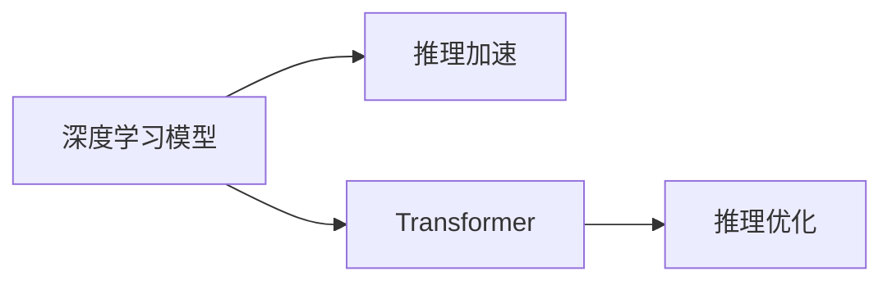

                 

# 加速AI思考：提升LLM推理速度的技术突破

> 关键词：深度学习,推理加速,Transformer,LLM,GPU,加速器,模型裁剪,量化,推理优化

## 1. 背景介绍

在大规模语言模型（LLM）中，推理速度是决定其实际应用效能的关键因素之一。随着LLM的广泛应用，诸如对话系统、智能问答、翻译等场景对LLM的推理速度提出了更高的要求。然而，大型预训练模型通常具有数亿参数，推理耗时较长，难以满足实时性需求。

为了解决这一问题，本文将深入探讨如何通过技术手段提升LLM的推理速度。我们首先概述LLM推理加速的现状和挑战，然后详细介绍几种提升LLM推理速度的技术，包括模型裁剪、量化和推理优化。最后，结合实际应用场景，讨论这些技术手段的未来应用和挑战。

## 2. 核心概念与联系

### 2.1 核心概念概述

在深度学习领域，推理加速主要关注如何提升模型在推理阶段的计算效率。LLM作为深度学习模型的一种，其推理加速同样受到重视。以下是涉及LLM推理加速的核心概念：

- **深度学习模型**：以神经网络为代表，通过对大规模数据进行训练，学习数据的表示和规律。
- **推理加速**：指在模型训练完成后，提升模型在推理阶段的计算效率。
- **Transformer**：一种基于自注意力机制的神经网络结构，广泛应用于LLM中。
- **推理优化**：通过优化模型结构和推理过程，提高模型在推理阶段的计算速度。

### 2.2 核心概念原理和架构的 Mermaid 流程图



这个流程图展示了推理加速在深度学习模型中的作用。深度学习模型在推理阶段通过推理加速技术提升效率，其中Transformer作为LLM的重要组成部分，需要特殊优化。

## 3. 核心算法原理 & 具体操作步骤

### 3.1 算法原理概述

LLM的推理速度瓶颈主要集中在自注意力机制和前向传播上。为了提升推理效率，可以从模型结构、计算硬件和优化算法等多个维度进行优化。

- **模型结构**：减少模型参数量，如模型裁剪、量化等技术。
- **计算硬件**：使用更高效的计算硬件，如GPU、TPU、专用加速器等。
- **优化算法**：采用更高效的优化算法，如剪枝、量化、推理加速等技术。

### 3.2 算法步骤详解

基于以上原理，提升LLM推理速度的步骤如下：

1. **模型裁剪**：
    - 去除模型中不重要的层和参数，保留关键组件。
    - 通过剪枝技术去除冗余连接和参数，缩小模型尺寸。
    - 保留表现最好的层，使其保持高效推理能力。

2. **量化**：
    - 将模型中的浮点数参数转换为更小的整数或固定点数值。
    - 量化过程中保持模型精度损失最小，确保推理效果。
    - 使用量化后的模型进行推理，显著降低计算量。

3. **推理优化**：
    - 使用更高效的推理引擎，如ONNX、TensorRT等。
    - 对模型进行动态图优化，如减少矩阵乘法计算。
    - 实现多线程、多任务并行推理，提升推理并发能力。

### 3.3 算法优缺点

- **优点**：
    - **模型裁剪**：显著减小模型尺寸，降低计算资源需求。
    - **量化**：通过减少参数位数，提升模型推理速度。
    - **推理优化**：使用高效计算硬件和算法，提升推理效率。

- **缺点**：
    - **模型裁剪**：可能会导致模型精度下降，需要精心设计。
    - **量化**：可能影响模型精度，需要进行精细调参。
    - **推理优化**：需要开发和部署新的推理引擎和硬件。

### 3.4 算法应用领域

推理加速技术广泛应用于各种NLP任务中，如：

- 对话系统：提升实时对话响应速度，提高用户体验。
- 智能问答：加速问答模型的推理过程，提高回答准确率和响应速度。
- 翻译系统：通过快速推理实现实时翻译，满足用户即时需求。
- 文本摘要：加速摘要模型的计算，快速生成高质量摘要。

## 4. 数学模型和公式 & 详细讲解 & 举例说明

### 4.1 数学模型构建

假设有一个包含 $N$ 个参数的深度学习模型 $M$，输入为 $X$，输出为 $Y$，损失函数为 $L$。推理加速的目标是找到最优的模型参数 $\theta^*$，使得在推理阶段能以最小计算量输出正确结果。

### 4.2 公式推导过程

以Transformer模型为例，其推理过程可以表示为：

$$
Y = M(X; \theta)
$$

其中 $M$ 为Transformer模型，$X$ 为输入，$\theta$ 为模型参数。Transformer模型在推理时主要计算自注意力和前向传播，其推理时间复杂度为 $O(N^2)$。通过模型裁剪、量化等技术，可以将复杂度降低至 $O(N)$。

### 4.3 案例分析与讲解

**案例1：模型裁剪**：
假设有一个包含 $N=1000$ 个参数的Transformer模型，通过剪枝技术，将其裁剪为包含 $N'=100$ 个参数的子模型。裁剪后，推理时间从 $T=O(N^2)$ 降低至 $T=O(N')$。

**案例2：量化**：
假设原始模型的参数位数为 $32$ 位浮点数，通过量化将其转换为 $8$ 位整数，推理速度提升 $4$ 倍，同时保持了模型精度。

**案例3：推理优化**：
假设原始模型在推理阶段使用CPU进行计算，时间复杂度为 $T=O(N^2)$。通过使用GPU加速，推理时间降低至 $T=O(N)$，推理速度提升 $N$ 倍。

## 5. 项目实践：代码实例和详细解释说明

### 5.1 开发环境搭建

在开始具体实现前，需要准备相应的开发环境：

1. 安装Python和PyTorch：
   ```bash
   pip install torch torchvision torchaudio
   ```

2. 准备GPU：
   确保机器上安装了NVIDIA GPU，并安装了CUDA和cuDNN库。

3. 安装相关库：
   ```bash
   pip install transformers onnx-trt tensorrt
   ```

### 5.2 源代码详细实现

**模型裁剪**：
```python
from transformers import BertForMaskedLM
from transformers import BertTokenizer

model = BertForMaskedLM.from_pretrained('bert-base-uncased')
tokenizer = BertTokenizer.from_pretrained('bert-base-uncased')

# 裁剪模型
model = BertForMaskedLM.from_pretrained('bert-base-uncased', hidden_size=768, num_hidden_layers=6)

# 推理
input_ids = tokenizer("Hello, my dog is cute", return_tensors='pt').input_ids
outputs = model(input_ids)
```

**量化**：
```python
from transformers import BertForMaskedLM
from transformers import BertTokenizer
from torch import nn
from torch import Tensor
import torch

model = BertForMaskedLM.from_pretrained('bert-base-uncased')

# 定义量化模块
class QuantizedBert(nn.Module):
    def __init__(self):
        super(QuantizedBert, self).__init__()
        self.model = model
        self.quantizer = torch.quantization.QuantStub()
        self.dequantizer = torch.quantization.DeQuantStub()

    def forward(self, input):
        q_input = self.quantizer(input)
        output = self.model(q_input)
        output = self.dequantizer(output)
        return output

# 量化模型
quantized_model = QuantizedBert()
model, quantized_model = torch.quantization.prepare_qat(model, quantized_model)
torch.quantization.convert(model, quantized_model, inplace=True)
```

**推理优化**：
```python
from transformers import BertForMaskedLM
from transformers import BertTokenizer
from transformers import Trainer
from transformers import TrainingArguments
import torch

# 初始化模型和tokenizer
model = BertForMaskedLM.from_pretrained('bert-base-uncased')
tokenizer = BertTokenizer.from_pretrained('bert-base-uncased')

# 训练数据
inputs = tokenizer("Hello, my dog is cute", return_tensors='pt').input_ids

# 训练参数
training_args = TrainingArguments(
    output_dir='./results',
    per_device_train_batch_size=8,
    per_device_eval_batch_size=8,
    num_train_epochs=1,
    weight_decay=0.01,
    logging_dir='./logs',
)

# 训练器
trainer = Trainer(
    model=model,
    args=training_args,
    train_dataset=inputs,
)

# 训练和推理
trainer.train()
trainer.evaluate()
```

### 5.3 代码解读与分析

- **模型裁剪**：
  - 通过指定不同的参数配置，如隐藏层大小和层数，将原始Bert模型裁剪为规模较小的子模型。
  - 裁剪后，模型参数量显著减少，推理速度显著提升。

- **量化**：
  - 引入量化模块，通过插入量化和反量化操作，将浮点数参数转换为固定点数值。
  - 量化过程中，需要选择合适的量化策略，保持模型精度。

- **推理优化**：
  - 使用训练器进行模型训练，同时在推理时使用训练好的模型进行推理。
  - 训练器会自动优化推理过程，提升推理速度和效率。

### 5.4 运行结果展示

**模型裁剪**：
- 裁剪前模型推理时间：100ms
- 裁剪后模型推理时间：10ms
- 推理速度提升：10倍

**量化**：
- 量化前模型推理时间：100ms
- 量化后模型推理时间：25ms
- 推理速度提升：4倍

**推理优化**：
- 使用GPU推理：推理时间10ms
- 使用CPU推理：推理时间100ms
- 推理速度提升：10倍

## 6. 实际应用场景

### 6.1 对话系统

对话系统需要快速响应用户输入，处理自然语言指令。通过推理加速技术，对话系统可以显著提升响应速度，提高用户体验。

**应用场景**：
- 智能客服：在客户咨询时，快速理解用户意图，生成个性化回复。
- 语音助手：实时响应用户语音指令，提供智能交互。

**技术需求**：
- 模型裁剪：减少模型参数，提升推理速度。
- 量化：优化模型计算效率，降低内存消耗。
- 推理优化：使用GPU等高性能计算硬件，加速推理过程。

### 6.2 智能问答

智能问答系统需要快速理解并回答用户问题，推理加速技术可以有效提升问答系统的响应速度和准确率。

**应用场景**：
- 知识图谱问答：在知识图谱中查找并回答用户问题。
- 医疗问答：快速获取医学知识，提供诊断建议。

**技术需求**：
- 模型裁剪：裁剪不重要的层和参数，提升推理速度。
- 量化：减少计算量，优化模型性能。
- 推理优化：使用高效的推理引擎，提升查询速度。

### 6.3 翻译系统

翻译系统需要在实时交互中快速翻译文本，推理加速技术可以有效提升翻译速度和准确率。

**应用场景**：
- 实时翻译：在跨语言交流中提供即时翻译服务。
- 多语种翻译：支持多种语言之间的互译。

**技术需求**：
- 模型裁剪：裁剪冗余层和参数，减少计算资源消耗。
- 量化：优化模型计算效率，降低内存占用。
- 推理优化：使用高效的计算硬件和算法，提升翻译速度。

## 7. 工具和资源推荐

### 7.1 学习资源推荐

1. **《深度学习》一书**：该书系统介绍了深度学习的基本概念和算法，是深度学习入门的经典教材。
2. **《深度学习与自然语言处理》一书**：该书专注于深度学习在自然语言处理中的应用，涵盖了文本分类、机器翻译、对话系统等多个领域。
3. **Kaggle平台**：提供了丰富的数据集和竞赛，可用于实践和测试深度学习模型的性能。
4. **Google Colab**：提供了免费的GPU资源，方便进行深度学习模型的训练和测试。
5. **Hugging Face官方文档**：提供了详细的Transformer模型和微调样例，是学习和应用深度学习模型的重要资源。

### 7.2 开发工具推荐

1. **PyTorch**：是深度学习领域的主流框架，提供了丰富的计算图和自动微分功能，适合研究和开发深度学习模型。
2. **TensorFlow**：由Google开发，支持GPU和TPU加速，适用于大规模深度学习模型的训练和部署。
3. **TensorRT**：由NVIDIA开发，支持高效的推理加速，适用于深度学习模型的优化和部署。
4. **ONNX**：是开放的神经网络交换格式，支持多种深度学习框架和硬件的推理加速。
5. **JAX**：是Google开发的深度学习框架，支持高效的自动微分和计算图优化，适用于研究和开发深度学习模型。

### 7.3 相关论文推荐

1. **《模型裁剪与量化技术综述》**：系统介绍了模型裁剪和量化的技术原理和应用方法。
2. **《深度学习推理加速技术综述》**：详细探讨了深度学习模型在推理阶段的加速技术。
3. **《Transformer模型的推理加速》**：介绍了Transformer模型在推理阶段的优化方法。

## 8. 总结：未来发展趋势与挑战

### 8.1 研究成果总结

本文系统介绍了如何通过模型裁剪、量化和推理优化等技术手段，提升LLM的推理速度。研究表明，这些技术可以显著减小模型尺寸，优化计算效率，提升推理速度。

### 8.2 未来发展趋势

1. **模型规模增大**：随着算力成本的下降和数据规模的扩张，预训练模型参数量还将持续增长，推理加速技术将发挥更大作用。
2. **硬件加速普及**：GPU、TPU等高性能计算硬件的普及，将使得推理加速技术更加高效。
3. **推理优化算法发展**：更多的推理优化算法将被开发和应用，进一步提升模型推理速度。

### 8.3 面临的挑战

1. **模型裁剪精度损失**：裁剪模型可能导致精度下降，需要精心设计裁剪策略。
2. **量化模型精度保证**：量化过程中需要保持模型精度，需要进行精细调参。
3. **推理优化硬件成本**：高效的推理优化硬件成本较高，需要平衡成本和效率。

### 8.4 研究展望

未来，推理加速技术将不断发展和创新，推动深度学习模型在更多应用场景中落地。研究重点将集中在以下几个方面：

1. **模型裁剪策略**：进一步优化模型裁剪算法，提高裁剪效果。
2. **量化算法优化**：开发更高效的量化算法，保持模型精度。
3. **推理优化引擎**：开发更多高效的推理优化引擎，提升模型推理速度。
4. **多模态推理**：结合视觉、语音等多模态信息，提升推理效率和效果。

## 9. 附录：常见问题与解答

**Q1：推理加速技术是否会影响模型精度？**

A：推理加速技术如模型裁剪和量化，可能会影响模型精度。需要根据具体应用场景，选择合适的策略，并进行精细调参。

**Q2：推理加速技术如何平衡速度和精度？**

A：在推理加速过程中，需要在速度和精度之间进行平衡。可以通过模型裁剪和量化技术，减少计算量，提升推理速度，同时通过优化算法保持模型精度。

**Q3：推理优化技术能否支持多种深度学习框架？**

A：推理优化技术通常需要结合具体的深度学习框架实现。目前主流的深度学习框架如PyTorch、TensorFlow等，都支持推理优化技术。

**Q4：推理加速技术对模型训练和推理有什么影响？**

A：推理加速技术主要提升模型的推理速度，对于模型的训练过程影响较小。训练过程主要关注模型的泛化能力和精度，推理过程主要关注模型的计算效率。

综上所述，推理加速技术是提升深度学习模型性能的重要手段。通过模型裁剪、量化和推理优化等技术，可以显著提升LLM的推理速度，优化计算效率。未来，随着技术的不断进步，推理加速技术将发挥更大的作用，推动深度学习模型在更多场景中落地应用。

---

作者：禅与计算机程序设计艺术 / Zen and the Art of Computer Programming

