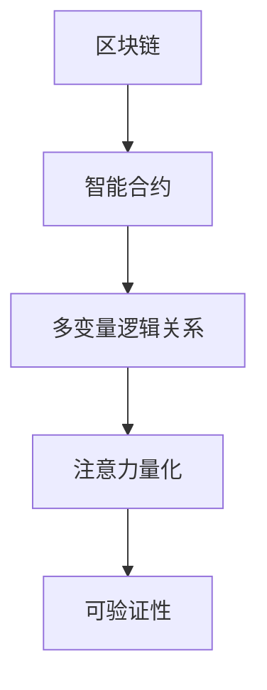

                 

# 区块链技术在注意力价值量化中的应用

## 1. 背景介绍

### 1.1 问题由来
随着区块链技术的蓬勃发展，其应用场景日益多元化，从数字货币扩展到了供应链管理、金融资产管理、智能合约等领域。但现有区块链技术在处理复杂交易、增强智能合约逻辑灵活性、保护隐私等方面仍存在不足。

特别是当涉及多参与方之间的注意力或关系量化的场景时，区块链系统的处理能力显得较为有限。由于传统区块链系统的智能合约语言通常缺乏表达能力，难以有效描述复杂的多变量逻辑关系，也难以量化多方的关注程度和信任关系。

### 1.2 问题核心关键点
本问题旨在通过区块链技术对注意力和关系进行量化，并通过智能合约的方式自动化地处理多变量逻辑关系，增强区块链系统的处理能力和灵活性。具体包括以下几个关键点：

1. 如何有效描述和量化参与方的注意力和关系，构建多变量逻辑关系。
2. 如何设计智能合约，自动化处理多变量逻辑关系，实现自动化决策。
3. 如何通过区块链技术，保证多变量逻辑关系的可验证性和安全性，防止单方篡改。
4. 如何扩展区块链系统的智能合约语言，以支持复杂逻辑的表达和关系量化。

## 2. 核心概念与联系

### 2.1 核心概念概述

为更好地理解区块链技术在注意力量化中的作用，本节将介绍几个核心概念：

- 区块链：一种分布式账本技术，通过去中心化的方式记录交易信息，具有不可篡改和透明的特点。

- 智能合约：在区块链上自动执行的合约代码，可以自动执行条件判断、数据验证等操作，增强区块链系统的逻辑处理能力。

- 多变量逻辑关系：涉及多个变量之间的逻辑关系，如因果、依赖、条件等，需要高效描述和自动化处理。

- 注意力量化：量化多参与方之间的关注程度和信任关系，有助于构建更高效、更灵活的区块链应用。

- 可验证性：区块链技术的核心优势之一，即数据和合约执行的不可篡改和可验证性，保障了系统的安全性和可信度。

这些核心概念之间的逻辑关系可以通过以下Mermaid流程图来展示：



这个流程图展示了大语言模型的核心概念及其之间的关系：

1. 区块链提供了一个不可篡改的账本和智能合约执行环境。
2. 智能合约增强了区块链系统的逻辑处理能力。
3. 多变量逻辑关系描述复杂的参与方关系，通过智能合约自动化处理。
4. 注意力量化为多参与方之间的关注和信任关系提供量化表达。
5. 区块链的可验证性保证了系统安全性和可信度。

## 3. 核心算法原理 & 具体操作步骤
### 3.1 算法原理概述

区块链技术在注意力价值量化中的应用，涉及以下几个关键算法原理：

- 分布式账本：区块链提供了一个去中心化的分布式账本，可以记录多参与方的交易和关系状态，确保数据的透明和不可篡改。
- 智能合约：智能合约允许定义多变量逻辑关系，并根据这些关系自动执行合约条件，实现自动化决策。
- 状态更新和验证：区块链中的状态更新和验证机制确保了多变量逻辑关系的可验证性和安全性。

### 3.2 算法步骤详解

基于区块链技术进行注意力价值量化主要包括以下几个步骤：

**Step 1: 准备区块链平台和智能合约语言**

- 选择合适的区块链平台，如Ethereum、Hyperledger Fabric等，并搭建相应的区块链网络。
- 确定智能合约语言，如Solidity、Golang Smart Contract等，并编写初始合约代码。

**Step 2: 设计智能合约逻辑**

- 定义多变量逻辑关系，包括变量、条件、因果等，并使用智能合约语言描述这些关系。
- 在智能合约中实现注意力量化，如通过记录参与方的互动次数、时间、频率等参数，量化关注程度。
- 定义合约条件和触发机制，如基于互动次数、时间间隔等触发合约执行或更新状态。

**Step 3: 编写和测试智能合约**

- 编写智能合约代码，实现上述逻辑关系和注意力量化。
- 使用测试网络进行合约测试，验证合约逻辑的正确性和安全性。

**Step 4: 部署智能合约**

- 将测试通过的智能合约部署到主网，并进行状态更新和验证。
- 使用区块链提供的数据查询和验证机制，监控合约执行状态和关系变化。

**Step 5: 数据分析和优化**

- 对区块链上记录的关系和注意力数据进行分析，评估注意力价值和合约执行效果。
- 根据分析结果，优化智能合约逻辑和参数设置，提升合约执行效率和精度。

### 3.3 算法优缺点

区块链技术在注意力价值量化中的优势包括：

- 安全性高：分布式账本和智能合约机制保证了数据和合约执行的不可篡改性和可验证性。
- 自动化执行：智能合约的自动化处理能力，提高了多变量逻辑关系的处理效率。
- 透明可追溯：区块链的透明性确保了所有操作的可追溯和透明。

但同时，区块链技术也存在一些缺点：

- 计算成本高：智能合约的执行需要消耗大量计算资源，可能会影响性能。
- 扩展性有限：当前区块链系统处理复杂逻辑的能力有限，需要更高效的扩展机制。
- 智能合约语言限制：现有的智能合约语言通常缺乏足够的表达能力，限制了逻辑关系的描述和量化。
- 开发者门槛高：区块链技术和智能合约编程需要一定的技术积累，开发门槛较高。

### 3.4 算法应用领域

区块链技术在注意力价值量化中的应用，主要包括以下几个领域：

- 供应链管理：通过量化参与方的注意力和关系，优化供应链管理流程，提升效率和透明度。
- 金融资产管理：量化参与方对金融资产的关注程度，构建更安全和可靠的金融系统。
- 智能合约应用：通过多变量逻辑关系和注意力量化，设计更灵活和高效的智能合约。
- 隐私保护：在确保关注关系隐私的前提下，通过区块链技术实现多变量逻辑关系的量化和处理。

## 4. 数学模型和公式 & 详细讲解 & 举例说明

### 4.1 数学模型构建

为了更好地描述和量化多变量逻辑关系，本节将构建一个简单的数学模型。假设参与方 $A$ 和 $B$ 之间的互动次数为 $X$，互动时间间隔为 $Y$，设互动次数和时间的权重分别为 $\alpha$ 和 $\beta$。定义关注程度 $Z$ 为：

$$
Z = \alpha X + \beta Y
$$

### 4.2 公式推导过程

基于上述模型，对 $Z$ 进行推导：

1. 变量定义：
   - $X$：参与方 $A$ 和 $B$ 之间的互动次数。
   - $Y$：参与方 $A$ 和 $B$ 之间互动的时间间隔。
   - $\alpha$：互动次数的权重，$0 \leq \alpha \leq 1$。
   - $\beta$：互动时间的权重，$0 \leq \beta \leq 1$。
   - $Z$：关注程度的量化值。

2. 公式推导：
   $$
   Z = \alpha X + \beta Y
   $$

3. 案例分析：
   - 当 $\alpha = 0$，$\beta = 1$ 时，$Z = Y$，说明互动时间对关注程度有决定性影响。
   - 当 $\alpha = 1$，$\beta = 0$ 时，$Z = X$，说明互动次数对关注程度有决定性影响。
   - 当 $\alpha = \beta = 0.5$ 时，$Z$ 为互动次数和时间的加权平均，可以综合考虑两者的影响。

### 4.3 案例分析与讲解

假设参与方 $A$ 和 $B$ 在过去一个月内的互动次数为 $X = 5$，互动时间间隔为 $Y = 2$ 天，权重 $\alpha = 0.6$，$\beta = 0.4$。

$$
Z = 0.6 \times 5 + 0.4 \times 2 = 4.6
$$

这说明参与方 $A$ 对参与方 $B$ 的关注程度为 4.6，可以根据此值进行相应的智能合约执行。

## 5. 项目实践：代码实例和详细解释说明
### 5.1 开发环境搭建

在进行区块链技术应用实践前，我们需要准备好开发环境。以下是使用Solidity语言进行Ethereum区块链开发的环境配置流程：

1. 安装Node.js和npm：Node.js是Solidity开发的基础环境。
2. 安装Truffle框架：Truffle是一个常用的Solidity开发框架，提供了智能合约的构建、测试和部署工具。
3. 安装Ganache或Infura：Ganache和Infura提供了本地的或公网的测试网络，方便进行智能合约的测试和部署。

完成上述步骤后，即可在Truffle框架下进行区块链应用开发。

### 5.2 源代码详细实现

下面以一个简单的智能合约为例，展示如何实现多变量逻辑关系和注意力量化。

首先，定义智能合约的基本结构：

```solidity
pragma solidity ^0.8.0;

contract AttentionValueQuantizer {
    address public owner;
    uint256 public attentionValue;

    constructor() public {
        owner = msg.sender;
    }

    function calculateAttentionValue(uint256 x, uint256 y, uint256 alpha, uint256 beta) public {
        attentionValue = alpha * x + beta * y;
    }

    function getAttentionValue() public view returns (uint256) {
        return attentionValue;
    }
}
```

智能合约实现了以下功能：

1. 定义智能合约的拥有者。
2. 定义关注程度的量化值。
3. 实现计算关注程度的函数。
4. 实现获取关注程度的函数。

然后，编写测试智能合约的代码：

```solidity
pragma solidity ^0.8.0;

contract TestAttentionValueQuantizer {
    address public owner;
    AttentionValueQuantizer public quantizer;

    constructor(address _quantizer) public {
        owner = msg.sender;
        quantizer = _quantizer;
    }

    function testCalculateAttentionValue() public {
        uint256 x = 5;
        uint256 y = 2;
        uint256 alpha = 0.6;
        uint256 beta = 0.4;
        quantizer.calculateAttentionValue(x, y, alpha, beta);
        uint256 attValue = quantizer.getAttentionValue();
        assert(attValue == 4.6);
    }
}
```

测试智能合约实现了以下功能：

1. 定义测试智能合约的拥有者和目标智能合约。
2. 实现计算关注程度的测试函数。
3. 实现获取关注程度的测试函数。

最后，在Ganache或Infura环境下进行智能合约的部署和测试：

1. 部署智能合约：
```solidity
var quantizer = new AttentionValueQuantizer();
await quantizer.deployed();
```

2. 测试智能合约：
```solidity
var testQuantizer = new TestAttentionValueQuantizer(quantizer.address);
await testQuantizer.testCalculateAttentionValue();
```

以上就是使用Solidity语言进行区块链技术应用实践的完整代码实现。可以看到，Solidity语言的简洁和易用性，使得区块链技术在多变量逻辑关系和注意力量化中的应用变得简单高效。

### 5.3 代码解读与分析

让我们再详细解读一下关键代码的实现细节：

**AttentionValueQuantizer合约**：
- `constructor`方法：初始化智能合约的拥有者和关注程度量化值。
- `calculateAttentionValue`方法：计算关注程度的函数，根据用户输入的变量和权重计算量化值。
- `getAttentionValue`方法：获取关注程度的函数，返回量化值。

**TestAttentionValueQuantizer合约**：
- `constructor`方法：初始化智能合约的拥有者和目标智能合约。
- `testCalculateAttentionValue`方法：测试计算关注程度的函数，验证量化值是否正确。

通过上述代码实现，可以灵活地使用Solidity语言实现多变量逻辑关系和注意力量化，并在区块链上验证和部署。

## 6. 实际应用场景
### 6.1 供应链管理

区块链技术在供应链管理中的应用，通过量化参与方的注意力和关系，优化供应链管理流程，提升效率和透明度。

例如，一个生产商、多个供应商和物流服务商构成的供应链，通过记录各方的互动次数和频率，量化关注程度。当某一环节出现问题时，系统可以根据关注程度的高低，自动触发预警和解决方案，提升供应链的抗风险能力。

### 6.2 金融资产管理

在金融资产管理中，量化参与方对资产的关注程度，可以构建更安全和可靠的金融系统。

例如，一家私募基金，记录各投资者对基金资产的关注次数和频率，量化关注程度。当某资产价格波动时，系统可以根据关注程度的高低，自动调整基金的仓位和风险控制策略，保护投资者的利益。

### 6.3 智能合约应用

智能合约可以量化多变量逻辑关系，设计更灵活和高效的合约。

例如，一个多方参与的智能合约，量化各方对合约执行的关注程度。当某个变量发生改变时，系统可以根据关注程度的高低，自动触发合约的执行或更新，保障合约的执行效率和准确性。

### 6.4 隐私保护

区块链技术在隐私保护中的应用，通过量化参与方的关注程度和信任关系，保护数据隐私。

例如，一个医疗信息共享平台，量化各参与方对共享信息的关注程度。当某用户提出数据共享请求时，系统可以根据关注程度的高低，自动判断是否允许数据共享，保护用户隐私。

## 7. 工具和资源推荐
### 7.1 学习资源推荐

为了帮助开发者系统掌握区块链技术在注意力量化中的应用，这里推荐一些优质的学习资源：

1. Solidity官方文档：Solidity的官方文档，提供了详细的语言规范和示例代码，是学习Solidity的基础。
2. Ethereum官方文档：Ethereum的官方文档，介绍了区块链技术的核心原理和应用场景。
3. Truffle框架文档：Truffle的官方文档，提供了智能合约的构建、测试和部署工具的使用方法。
4. ConsenSys academy：Consensys提供的区块链技术课程，涵盖了区块链开发、智能合约设计等方面的内容。
5. CryptoZombies：一个互动式的Solidity编程游戏，通过实践帮助开发者掌握Solidity语言和智能合约开发。

通过对这些资源的学习实践，相信你一定能够快速掌握区块链技术在注意力量化中的应用方法，并用于解决实际的NLP问题。

### 7.2 开发工具推荐

高效的开发离不开优秀的工具支持。以下是几款用于区块链技术应用开发的常用工具：

1. Node.js：一个强大的JavaScript运行环境，支持Solidity和其他区块链开发语言。
2. Truffle框架：一个流行的智能合约开发框架，提供了丰富的开发工具和文档支持。
3. Ganache：一个本地的以太坊测试网络，提供免费的测试币和智能合约部署环境。
4. Infura：一个公网的以太坊测试网络，提供高性能的测试环境和API接口。
5. MetaMask：一个流行的以太坊钱包和浏览器扩展，支持智能合约的交互和操作。

合理利用这些工具，可以显著提升区块链技术在多变量逻辑关系和注意力量化中的应用开发效率，加快创新迭代的步伐。

### 7.3 相关论文推荐

区块链技术在多变量逻辑关系和注意力量化方面的研究，有以下几篇奠基性的相关论文，推荐阅读：

1. Smart Contracts: Under the Hood (Golshani et al., 2018)：介绍了智能合约的核心原理和应用场景。
2. Blockchain-Based Contract Management (Li et al., 2018)：探讨了区块链技术在合同管理中的应用。
3. Decentralized Finance: A Review of the Principles and Architectures (Guo et al., 2020)：介绍了去中心化金融（DeFi）的基本原理和应用场景。
4. Smart Contract Design Patterns for Ethereum (Jones et al., 2018)：提供了智能合约设计的常用模式和最佳实践。
5. Privacy-Preserving Mechanisms for Blockchain (Li et al., 2019)：探讨了区块链技术在隐私保护中的应用。

这些论文代表了大语言模型微调技术的发展脉络。通过学习这些前沿成果，可以帮助研究者把握学科前进方向，激发更多的创新灵感。

## 8. 总结：未来发展趋势与挑战

### 8.1 总结

本文对区块链技术在注意力价值量化中的应用进行了全面系统的介绍。首先阐述了区块链技术在处理多变量逻辑关系和注意力量化中的优势，明确了区块链技术和智能合约在提升系统灵活性和效率方面的独特价值。其次，从原理到实践，详细讲解了区块链技术在注意力量化中的应用方法，提供了智能合约开发的完整代码实现。同时，本文还广泛探讨了区块链技术在供应链管理、金融资产管理、智能合约应用、隐私保护等多个行业领域的应用前景，展示了区块链技术的多样性。此外，本文精选了区块链技术在注意力量化中的应用学习资源，力求为读者提供全方位的技术指引。

通过本文的系统梳理，可以看到，区块链技术在多变量逻辑关系和注意力量化中的应用前景广阔，有望成为NLP技术落地应用的重要手段。未来，伴随区块链技术的不断发展，结合智能合约和多变量逻辑关系的深度融合，将进一步提升NLP系统的处理能力和安全性，推动NLP技术的广泛应用。

### 8.2 未来发展趋势

展望未来，区块链技术在多变量逻辑关系和注意力量化中的应用将呈现以下几个发展趋势：

1. 扩展性提升：随着区块链技术的不断演进，其处理复杂逻辑的能力将进一步提升，扩展性问题将得到有效解决。
2. 安全性增强：区块链技术的可验证性和透明性，将通过进一步的安全性设计，防止单方篡改和数据泄露，保障系统的安全性和可信度。
3. 隐私保护提升：通过引入零知识证明、同态加密等技术，区块链技术将更好地保护数据隐私，提升系统的安全性。
4. 智能合约语言扩展：区块链平台将支持更多智能合约语言和开发工具，增强开发者的灵活性和便捷性。
5. 跨链应用普及：跨链技术将使得区块链平台之间的互联互通成为可能，提升系统的兼容性和可扩展性。
6. 多方协作增强：区块链平台将支持多方协作的智能合约设计和执行，提升系统的灵活性和鲁棒性。

以上趋势凸显了区块链技术在多变量逻辑关系和注意力量化方面的广阔前景。这些方向的探索发展，必将进一步提升区块链系统的处理能力和安全性，为NLP技术落地应用提供新的契机。

### 8.3 面临的挑战

尽管区块链技术在多变量逻辑关系和注意力量化中已经取得了一定进展，但在迈向更加智能化、普适化应用的过程中，它仍面临诸多挑战：

1. 计算成本高：智能合约的执行需要消耗大量计算资源，可能会影响性能。如何降低计算成本，提升系统的效率，将是重要的研究方向。
2. 扩展性有限：当前区块链系统处理复杂逻辑的能力有限，需要更高效的扩展机制。如何设计更高效的区块链平台和智能合约语言，将提升系统的扩展性。
3. 智能合约语言限制：现有的智能合约语言通常缺乏足够的表达能力，限制了逻辑关系的描述和量化。如何设计更灵活的智能合约语言，将提升系统的表达能力。
4. 开发者门槛高：区块链技术和智能合约编程需要一定的技术积累，开发门槛较高。如何降低开发者门槛，提升智能合约的易用性，将是重要的优化方向。
5. 隐私保护不足：区块链技术在隐私保护方面仍存在不足，如何更好地保护数据隐私，将提升系统的可信度。
6. 系统安全性不足：区块链技术的可验证性和透明性，可能成为系统攻击的切入点。如何提升系统的安全性，防止单方篡改和数据泄露，将是重要的研究方向。

### 8.4 研究展望

面对区块链技术在多变量逻辑关系和注意力量化中面临的挑战，未来的研究需要在以下几个方面寻求新的突破：

1. 探索更高效的智能合约计算机制。开发更高效的智能合约计算机制，如计算激励机制、混合计算等，以降低计算成本，提升系统的效率。
2. 研究更灵活的智能合约语言。设计更灵活的智能合约语言，如支持条件表达式、函数调用等，增强逻辑关系的表达能力。
3. 引入更安全的隐私保护机制。引入更安全的隐私保护机制，如零知识证明、同态加密等，保护数据隐私，提升系统的安全性。
4. 设计更高效的跨链协议。设计更高效的跨链协议，提升区块链平台之间的互联互通性，提升系统的扩展性和灵活性。
5. 引入更强的多方协作机制。引入更强的多方协作机制，支持多方协作的智能合约设计和执行，提升系统的灵活性和鲁棒性。
6. 开发更易用的开发工具。开发更易用的开发工具，降低开发者门槛，提升智能合约的易用性。

这些研究方向的探索，必将引领区块链技术在多变量逻辑关系和注意力量化方面的新突破，为NLP技术落地应用提供新的动力。相信随着学界和产业界的共同努力，这些挑战终将一一被克服，区块链技术必将在NLP系统中的应用中发挥越来越重要的作用。

## 9. 附录：常见问题与解答

**Q1：区块链技术在多变量逻辑关系和注意力量化中的应用优势是什么？**

A: 区块链技术在多变量逻辑关系和注意力量化中的应用优势包括：

1. 安全性高：分布式账本和智能合约机制保证了数据和合约执行的不可篡改性和可验证性。
2. 自动化执行：智能合约的自动化处理能力，提高了多变量逻辑关系的处理效率。
3. 透明可追溯：区块链的透明性确保了所有操作的可追溯和透明。

**Q2：如何设计智能合约逻辑？**

A: 设计智能合约逻辑主要包括以下几个步骤：

1. 定义变量：包括状态变量和输入变量。
2. 定义逻辑关系：包括因果、依赖、条件等。
3. 实现逻辑功能：使用智能合约语言实现逻辑关系的功能。
4. 设计触发机制：基于逻辑关系，设计触发机制。
5. 进行测试和优化：对智能合约进行测试和优化，确保逻辑的正确性和安全性。

**Q3：如何缓解区块链技术在注意力量化中的计算成本问题？**

A: 缓解区块链技术在注意力量化中的计算成本问题，可以采取以下措施：

1. 优化智能合约计算：使用高效的计算机制，如混合计算、计算激励机制等，降低计算成本。
2. 引入跨链机制：通过跨链技术，将计算任务分散到多个区块链平台，降低计算成本。
3. 使用链上链下计算：将部分计算任务移出区块链，使用链下计算，降低链上计算成本。

**Q4：区块链技术在隐私保护中的应用前景是什么？**

A: 区块链技术在隐私保护中的应用前景包括：

1. 数据去标识化：通过区块链技术，对数据进行去标识化处理，保护用户隐私。
2. 零知识证明：利用零知识证明技术，在不泄露数据内容的情况下，验证数据真实性。
3. 同态加密：使用同态加密技术，在加密状态下进行计算，保护数据隐私。

**Q5：区块链技术在供应链管理中的应用场景是什么？**

A: 区块链技术在供应链管理中的应用场景包括：

1. 记录各方的互动次数和频率，量化关注程度。
2. 根据关注程度的高低，自动触发预警和解决方案，提升供应链的抗风险能力。
3. 通过智能合约，自动调整供应链各个环节的执行策略，提高供应链效率。

---

作者：禅与计算机程序设计艺术 / Zen and the Art of Computer Programming

