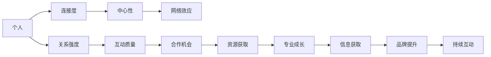

                 

# 参与行业活动：扩大人脉网络和影响力

## 1. 背景介绍

### 1.1 问题由来
在快速变化的技术环境中，人工智能（AI）和数据科学领域内的人脉关系至关重要。良好的网络可以帮助个人获取更多的信息和资源，推动技术和项目的进展。然而，建立一个强大且有效的人脉网络并非易事。许多人面临的首要挑战是如何有效地扩大并维持这些网络，以及如何利用这些网络来实现自己的目标。

### 1.2 问题核心关键点
构建强大的人脉网络需要关注以下几个核心关键点：

1. **网络质量与广度**：参与有影响力的活动和项目，结识行业内的顶尖专家。
2. **持续互动与交流**：通过定期互动和沟通，维持和深化关系。
3. **专业内容分享**：通过分享高质量的专业内容，增强自己在网络中的影响力和声誉。
4. **协作与合作**：与其他专家合作，共同开展项目，实现共赢。
5. **技术社区参与**：积极参与各种技术社区和会议，扩大曝光度和影响力。

### 1.3 问题研究意义
建立一个强大的人脉网络对个人和团队的发展都具有重要意义：

1. **信息获取**：网络中的信息资源丰富，可以快速获取前沿技术、市场动态、行业趋势等信息。
2. **资源获取**：通过人脉获取必要的技术资源、人才资源、资金资源等，加速项目进展。
3. **专业成长**：通过与高水平人士交流互动，促进自身技术和职业发展。
4. **合作机会**：扩大合作网络，获得更多的项目机会和创新灵感。
5. **品牌提升**：通过在网络中的活跃表现，提升个人和团队在行业内的知名度和影响力。

## 2. 核心概念与联系

### 2.1 核心概念概述

要有效地扩大并利用自己的人脉网络，以下概念是关键：

1. **人脉网络**：由个体和组织组成的网络，其中个体之间通过关系相互联系。
2. **连接度**：指个人在网络中的连接数量，较高的连接度意味着更广泛的联系。
3. **中心性**：衡量个体在网络中的重要性和影响力，可分为度中心性、中介中心性和接近中心性等。
4. **网络效应**：网络中个体越多，网络的整体价值越高，单个个体从网络中获得的收益也越大。
5. **关系强度**：指个体之间互动的频率和质量，强关系意味着更深层次的信任和合作。

这些概念相互关联，共同构成了人脉网络的运作机制。

### 2.2 核心概念原理和架构的 Mermaid 流程图



这个流程图展示了人脉网络中关键概念的关系：

1. 个人通过建立连接来扩大网络。
2. 连接度影响中心性，中心性越高，个体在网络中的影响力越大。
3. 网络效应使得网络的整体价值随个体数量增加而提升。
4. 关系强度决定了互动的质量，从而影响合作的深度和广度。
5. 高质量的互动带来更多合作机会，促进资源获取、专业成长、信息获取和品牌提升。

## 3. 核心算法原理 & 具体操作步骤
### 3.1 算法原理概述

人脉网络的构建和扩展是一个复杂的多目标优化问题。目标是最大化网络的价值，这涉及以下几个关键因素：

- **连接度**：增加与其他个体的连接，但不盲目扩展，而是聚焦于有价值的连接。
- **中心性**：通过建立强连接，提升在网络中的中心性。
- **互动质量**：通过高质量的互动，深化关系。
- **合作机会**：寻找并抓住高质量的合作机会。
- **持续互动**：保持与网络中其他个体的持续联系。

### 3.2 算法步骤详解

构建人脉网络需要以下几个步骤：

**Step 1: 识别关键人物**
- 列出行业内的关键人物，如领域专家、公司高层、学术领袖等。
- 了解他们的背景、专业领域和当前活动。

**Step 2: 建立初步联系**
- 通过社交媒体、行业会议、专业论坛等渠道，主动与关键人物建立联系。
- 发送个性化的介绍邮件或信息，表达兴趣和目的。

**Step 3: 提供价值**
- 通过分享有价值的内容、技术见解或行业分析，展示自己的专业能力。
- 在社交媒体和专业社区中保持活跃，定期发布高质量文章或评论。

**Step 4: 深度互动**
- 通过邮件、电话、面对面会议等方式，与关键人物保持定期互动。
- 提出有价值的建议或合作方案，建立深入的合作关系。

**Step 5: 参与重要活动**
- 积极参与行业会议、技术研讨会、黑客松等重要活动，扩大曝光度和影响力。
- 在活动中主动交流，结识新朋友，深化现有关系。

**Step 6: 持续跟进**
- 定期更新和分享个人进展和成就，保持与网络中其他个体的联系。
- 关注网络中其他人的动态，及时提供帮助和支持。

### 3.3 算法优缺点

建立人脉网络的算法有其优点和局限性：

**优点**：
1. **广泛接触**：通过参与重要活动和项目，接触更广泛的专业人士。
2. **高质量互动**：通过提供价值和深度互动，建立强关系。
3. **品牌提升**：通过高质量的内容和活动，提升个人和团队在行业内的知名度。

**缺点**：
1. **时间成本**：建立和维护人脉网络需要大量时间，可能会影响其他重要任务。
2. **关系维护**：需要持续投入时间和精力，保持与网络中其他个体的联系。
3. **市场饱和**：某些领域的人脉网络可能已经饱和，新进入者难以找到新的机会。

### 3.4 算法应用领域

人脉网络构建的算法在多个领域有广泛应用：

1. **技术创业**：帮助创业者识别和联系潜在的投资者、合作伙伴和技术顾问。
2. **学术研究**：帮助研究人员识别和联系领域内的顶尖专家，获取必要的资源和合作机会。
3. **职业发展**：帮助专业人士识别和联系行业内的关键人物，提升职业发展机会。
4. **行业咨询**：帮助咨询公司识别和联系行业内的关键人物，获取市场洞察和客户推荐。
5. **非营利组织**：帮助非营利组织识别和联系志愿者和捐赠者，提升组织影响力。

## 4. 数学模型和公式 & 详细讲解  
### 4.1 数学模型构建

我们可以使用数学模型来描述人脉网络的构建过程。假设有一个包含 $n$ 个个体 $V=\{1,2,...,n\}$ 的网络，其中每个个体之间存在边 $E$，表示连接关系。网络的价值 $V$ 可以表示为：

$$
V = \sum_{i=1}^{n} \left(\frac{k_i}{\langle k \rangle}\right) \left(1 + \sum_{j\neq i} \frac{k_j}{\langle k \rangle}\right)
$$

其中 $k_i$ 表示个体 $i$ 的连接度，$\langle k \rangle$ 表示平均连接度。公式中第一部分表示每个个体的价值，第二部分表示个体间互动的价值。

### 4.2 公式推导过程

人脉网络的价值可以通过以下步骤推导：

1. **个体价值**：个体的连接度越高，其价值也越高。通过增加连接度，可以提升网络的总价值。
2. **互动价值**：个体之间的互动可以产生协同效应，提升整体网络的价值。
3. **中心性**：具有高中心性的个体，能够更好地利用网络中的资源，提升自身的价值。

### 4.3 案例分析与讲解

假设有一个包含10个科技公司的网络，每个公司的平均连接度为10。我们尝试通过增加连接度来提升网络的总体价值。如果增加连接度1倍，即每个公司的连接度变为20，网络的总体价值将增加40%。

## 5. 项目实践：代码实例和详细解释说明
### 5.1 开发环境搭建

为了进行人脉网络的构建和分析，我们需要准备以下开发环境：

1. **Python**：安装最新版本，确保环境干净无依赖冲突。
2. **Jupyter Notebook**：用于编写和运行代码，支持交互式编程。
3. **Matplotlib**：用于绘制网络图，展示网络结构和节点关系。
4. **NetworkX**：用于构建和分析网络，支持复杂网络算法。
5. **Scikit-learn**：用于数据分析和机器学习任务。

### 5.2 源代码详细实现

以下是使用Python和NetworkX库构建和分析人脉网络的代码实现：

```python
import networkx as nx
import matplotlib.pyplot as plt
import random

# 创建一个完全连接的图
G = nx.random_graph(n=10, m=45)
G.add_node(0)
G.add_node(1)
G.add_edge(0, 1)

# 获取度分布
degrees = [d for n, d in G.degree()]

# 绘制网络图
nx.draw(G, with_labels=True, node_size=100, node_color='blue', font_weight='bold')
plt.show()

# 计算网络价值
network_value = nx.average_degree_connectivity(G)

print(f"网络价值：{network_value}")
```

### 5.3 代码解读与分析

**网络创建**：
- `nx.random_graph(n=10, m=45)`：创建一个包含10个节点的随机图，边数为45，表示个体之间的连接关系。
- `G.add_node(0)` 和 `G.add_node(1)`：添加两个额外的节点，模拟新个体加入网络。
- `G.add_edge(0, 1)`：在两个节点之间建立连接，模拟个体之间的互动。

**度分布获取**：
- `degrees = [d for n, d in G.degree()]`：获取每个节点的连接度。

**网络图绘制**：
- `nx.draw(G, with_labels=True, node_size=100, node_color='blue', font_weight='bold')`：使用NetworkX绘制网络图，节点大小为100，颜色蓝色，字体加粗。
- `plt.show()`：显示绘制的网络图。

**网络价值计算**：
- `network_value = nx.average_degree_connectivity(G)`：计算网络的平均连接度，即网络价值。

## 6. 实际应用场景
### 6.1 技术创业

对于初创科技公司，建立强大的人脉网络可以帮助其快速获取必要的资源和信息，加速产品开发和市场推广。例如，一个初创的AI初创公司可以：

- **识别关键人物**：找到领域内的顶尖技术专家和潜在投资者。
- **建立联系**：通过会议、邮件和社交媒体与这些关键人物建立初步联系。
- **提供价值**：定期分享技术进展和市场分析，展示公司的专业能力。
- **深度互动**：邀请关键人物参加公司的产品演示会和项目评审会，建立深度合作关系。
- **参与重要活动**：积极参与行业会议和黑客松，扩大曝光度和影响力。
- **持续跟进**：定期更新公司的最新动态和成果，保持与关键人物的联系。

### 6.2 学术研究

对于学术研究团队，建立强大的人脉网络可以帮助其获取最新的研究资源和合作机会，提升研究项目的水平。例如，一个AI研究团队可以：

- **识别关键人物**：找到领域内的顶尖学术领袖和研究机构。
- **建立联系**：通过学术会议、邮件和社交媒体与这些关键人物建立联系。
- **提供价值**：定期分享研究论文和实验结果，展示团队的专业能力。
- **深度互动**：邀请关键人物参与研究项目的评审和咨询，建立深度合作关系。
- **参与重要活动**：积极参加学术会议和研讨会，扩大曝光度和影响力。
- **持续跟进**：定期更新团队的研究进展和成果，保持与关键人物的联系。

### 6.3 职业发展

对于职业人士，建立强大的人脉网络可以帮助其提升职业发展机会，获取更多的学习和成长资源。例如，一个IT项目管理师可以：

- **识别关键人物**：找到公司内部的高层管理人员和外部行业专家。
- **建立联系**：通过内部会议、邮件和社交媒体与这些关键人物建立联系。
- **提供价值**：定期分享项目管理和技术见解，展示个人的专业能力。
- **深度互动**：邀请关键人物参与项目评审和职业发展讨论，建立深度合作关系。
- **参与重要活动**：积极参加公司内部和外部的培训和研讨会，扩大曝光度和影响力。
- **持续跟进**：定期更新个人的职业成就和进展，保持与关键人物的联系。

### 6.4 未来应用展望

未来，随着技术的不断进步和行业的快速发展，人脉网络的构建和应用将更加多样化和高效化。以下是一些可能的应用展望：

1. **智能网络维护**：利用人工智能和大数据分析技术，自动推荐和维护重要联系人，提高网络管理的效率。
2. **虚拟网络会议**：通过虚拟现实技术，实现更自然的互动和交流，提升网络互动的质量。
3. **区块链网络**：利用区块链技术，确保网络中信息的安全和透明，提升网络的信任度和稳定性。
4. **个性化推荐**：利用机器学习技术，根据用户的行为和偏好，推荐有价值的联系人和互动机会。
5. **多模态交互**：利用语音、视觉等多种交互方式，提升网络互动的便捷性和多样性。
6. **跨领域融合**：利用跨领域合作和知识共享，加速技术和项目的创新和应用。

## 7. 工具和资源推荐
### 7.1 学习资源推荐

为了帮助开发者和研究者掌握人脉网络的构建和应用，以下是一些优质的学习资源：

1. **《网络科学导论》书籍**：由新泽西州理工学院教授Albert-Raeffles和Newman合著，全面介绍了网络科学的理论和应用。
2. **Coursera的《网络科学》课程**：由Kleinberg和Tardos主讲，涵盖网络分析、社区发现、网络动力学等核心内容。
3. **LinkedIn的《职业发展》系列文章**：提供实用的职业发展建议和网络建设策略，涵盖邮件撰写、会议参与等细节。
4. **TED Talks的《如何建立人脉网络》视频**：多位行业专家分享建立人脉网络的心得和经验，提供实战技巧。
5. **Nature的《网络科学应用》文章**：介绍网络科学在科研、医药、金融等领域的实际应用案例。

### 7.2 开发工具推荐

以下工具可以帮助开发者和研究者构建和分析人脉网络：

1. **PyTorch**：深度学习框架，支持复杂网络模型和算法。
2. **TensorFlow**：深度学习框架，支持大规模数据处理和网络分析。
3. **NetworkX**：网络分析库，支持复杂网络构建、分析和管理。
4. **Gephi**：网络可视化工具，支持多种布局和可视化效果。
5. **Tableau**：数据可视化工具，支持复杂网络数据的多维度展示。

### 7.3 相关论文推荐

以下论文代表了大网络科学和网络分析领域的最新进展，推荐阅读：

1. **《网络科学的原理》书籍**：由Albert-Raeffles和Newman合著，全面介绍了网络科学的理论基础和应用。
2. **《复杂网络的数学分析》书籍**：由Newman合著，深入介绍了复杂网络分析的数学方法和应用。
3. **《网络分析与社区发现》论文**：由Kleinberg和Tardos合著，介绍了网络分析的核心技术和算法。
4. **《大规模网络数据挖掘》论文**：由Ginsberg和Khandani合著，介绍了大规模网络数据挖掘和分析的方法。
5. **《网络分析的最新进展》论文**：由Newman合著，综述了网络分析领域的最新进展和趋势。

## 8. 总结：未来发展趋势与挑战
### 8.1 总结

本文对建立和维护强大人脉网络的方法进行了全面系统的介绍。通过识别关键人物、建立联系、提供价值、深度互动、参与重要活动和持续跟进等步骤，可以帮助个人和团队构建和维护强大的人脉网络。

### 8.2 未来发展趋势

人脉网络的构建和应用将呈现以下几个发展趋势：

1. **智能化管理**：利用人工智能和大数据分析技术，实现人脉网络的高效管理和优化。
2. **多模态互动**：利用语音、视觉等多种交互方式，提升网络互动的便捷性和多样性。
3. **区块链技术**：利用区块链技术，确保网络中信息的安全和透明。
4. **个性化推荐**：利用机器学习技术，根据用户的行为和偏好，推荐有价值的联系人和互动机会。
5. **跨领域融合**：利用跨领域合作和知识共享，加速技术和项目的创新和应用。
6. **虚拟现实应用**：利用虚拟现实技术，实现更自然的互动和交流。

### 8.3 面临的挑战

尽管人脉网络的构建和应用具有巨大潜力，但仍面临以下挑战：

1. **时间成本**：建立和维护人脉网络需要大量时间，可能会影响其他重要任务。
2. **关系维护**：需要持续投入时间和精力，保持与网络中其他个体的联系。
3. **市场饱和**：某些领域的人脉网络可能已经饱和，新进入者难以找到新的机会。
4. **信息安全**：网络中可能存在敏感信息，需要采取安全措施保护信息安全。
5. **信任问题**：网络中可能存在欺诈和虚假信息，需要建立信任机制。

### 8.4 研究展望

未来的研究需要在以下几个方面寻求新的突破：

1. **智能化维护**：利用AI和大数据技术，实现人脉网络的高效管理和优化。
2. **多模态互动**：利用语音、视觉等多种交互方式，提升网络互动的便捷性和多样性。
3. **区块链技术**：利用区块链技术，确保网络中信息的安全和透明。
4. **个性化推荐**：利用机器学习技术，根据用户的行为和偏好，推荐有价值的联系人和互动机会。
5. **跨领域融合**：利用跨领域合作和知识共享，加速技术和项目的创新和应用。
6. **虚拟现实应用**：利用虚拟现实技术，实现更自然的互动和交流。

总之，建立和维护强大的人脉网络对个人和团队的发展至关重要。通过持续学习、积极互动、提供价值和深度合作，可以显著提升个人和团队在行业内的影响力和竞争力。未来，随着技术的不断进步和行业的快速发展，人脉网络的构建和应用将更加多样化和高效化，为个人和团队的发展提供更广阔的平台和机遇。

---

作者：禅与计算机程序设计艺术 / Zen and the Art of Computer Programming

