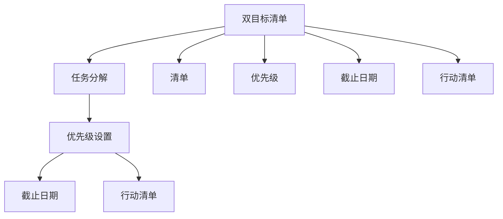

                 

# 双目标清单:聚焦要事的法宝

> 关键词：
- 双目标清单
- GTD(Getting Things Done)
- 时间管理
- 任务优先级
- 任务分解
- 行动清单
- 项目管理

## 1. 背景介绍

### 1.1 问题由来
在现代社会中，工作与生活的节奏越来越快，信息爆炸的时代带来了巨大的挑战。如何在纷繁复杂的任务中保持专注，提升工作效率，是很多人面临的问题。传统的时间管理方法如任务列表、日历提醒等，往往难以应对瞬息万变的任务需求。这时，双目标清单（Two Goal Checklist）作为一种高效的时间管理工具，应运而生。

双目标清单，源自GTD（Getting Things Done）时间管理方法，旨在帮助人们通过明确的目标和优先级，有条不紊地处理各种任务。它的核心理念是“一次只做一件事”，同时关注任务的目标和行动路径，确保每项工作都朝着既定目标前进。

### 1.2 问题核心关键点
双目标清单的核心在于通过分解任务，将大目标拆分成具体的行动步骤，同时设置优先级和截止日期，确保每个任务都能按时完成。这包括：

- **任务分解**：将大目标拆分成具体的可操作的小任务。
- **优先级设置**：根据任务的重要性和紧急程度，确定任务的优先级。
- **截止日期**：为每个任务设定明确的截止日期，确保任务按时完成。
- **行动清单**：记录具体行动步骤，确保每一步都清晰明了。

### 1.3 问题研究意义
双目标清单作为一种高效的时间管理工具，其研究意义在于：

- 帮助人们有效管理时间和任务，提升工作效率。
- 通过明确的目标和优先级，减少工作的压力和焦虑。
- 提供结构化的任务处理框架，使复杂任务更容易管理。

## 2. 核心概念与联系

### 2.1 核心概念概述

双目标清单，即基于GTD方法的时间管理工具，通过将大目标分解为具体行动步骤，并设置优先级和截止日期，帮助人们有条不紊地处理各种任务。其主要包括以下几个关键概念：

- **双目标**：大目标和小目标。大目标即我们最终要达成的终极目标，小目标则是实现大目标的具体行动步骤。
- **清单**：将任务和行动步骤记录在清单中，方便随时查看和调整。
- **优先级**：根据任务的重要性和紧急程度，确定任务的优先级。
- **截止日期**：为每个任务设定明确的截止日期，确保任务按时完成。
- **行动清单**：记录具体行动步骤，确保每一步都清晰明了。

这些概念之间的逻辑关系可以通过以下Mermaid流程图来展示：



这个流程图展示了双目标清单的主要步骤：

1. 定义大目标。
2. 将大目标分解为具体的行动步骤。
3. 设置优先级和截止日期。
4. 记录具体行动步骤。
5. 将任务和行动步骤记录在清单中。

## 3. 核心算法原理 & 具体操作步骤

### 3.1 算法原理概述

双目标清单的核心算法原理，在于通过将大目标分解为具体的行动步骤，并设置优先级和截止日期，帮助人们有条不紊地处理各种任务。其数学模型可以描述如下：

设一个任务为 $T_i = (A_i, P_i, D_i)$，其中：
- $A_i$ 为任务的具体行动步骤。
- $P_i$ 为任务的优先级。
- $D_i$ 为任务的截止日期。

则双目标清单的数学模型为：

$$
Optimize: \sum_{i=1}^N P_i * D_i \\
Subject\ to: A_i \in \{Action_1, Action_2, ..., Action_M\} \\
$$

即，最大化任务的优先级乘以截止日期，同时满足行动步骤的限制条件。

### 3.2 算法步骤详解

双目标清单的核心算法步骤如下：

**Step 1: 定义任务和目标**
- 定义大目标：如“完成一个项目报告”。
- 将大目标拆分为具体的行动步骤：如“查找资料”、“编写初稿”、“修改定稿”。
- 确定任务的优先级和截止日期：如“查找资料”为高优先级，截止日期为“明天”。

**Step 2: 构建任务清单**
- 创建任务清单，记录每个任务的行动步骤、优先级和截止日期。
- 可以使用电子表格、待办事项应用等工具进行记录和管理。

**Step 3: 每日任务安排**
- 每天早上或前一天晚上，根据清单中的任务，安排当天的具体任务。
- 根据优先级和截止日期，确定任务的执行顺序。

**Step 4: 执行和调整**
- 根据每日任务安排，逐项执行每个任务。
- 在执行过程中，可以灵活调整任务的优先级和截止日期，确保任务按时完成。

**Step 5: 回顾和优化**
- 每天结束时，回顾当天的任务完成情况。
- 根据实际情况，调整任务的优先级和截止日期，优化任务清单。

### 3.3 算法优缺点

双目标清单作为一种时间管理工具，具有以下优点：

- **结构化**：通过将大目标分解为具体的行动步骤，使得任务更加清晰明确。
- **优先级管理**：通过设置优先级，帮助用户合理安排时间，提升工作效率。
- **灵活调整**：任务清单可以根据实际情况灵活调整，适应不同的任务需求。

同时，该方法也存在一定的局限性：

- **依赖自律性**：需要用户具有一定的自律性和执行力，才能有效使用双目标清单。
- **任务分解难度**：对于复杂的任务，分解为具体行动步骤可能需要一定的经验和技巧。
- **时间投入**：构建和管理任务清单，需要一定的时间投入，短期内可能影响效率。

尽管存在这些局限性，但就目前而言，双目标清单仍是高效管理任务和时间的重要工具。

### 3.4 算法应用领域

双目标清单的应用领域非常广泛，以下是几个典型的应用场景：

- **项目管理**：将大项目分解为具体的子任务，设置优先级和截止日期，确保项目按时完成。
- **日常工作**：记录日常任务，设置优先级和截止日期，提升工作效率。
- **个人成长**：记录学习计划、健身计划等，设置优先级和截止日期，实现个人目标。
- **家庭事务**：记录家庭购物清单、家务安排等，确保家庭事务有条不紊地进行。

## 4. 数学模型和公式 & 详细讲解  
### 4.1 数学模型构建

双目标清单的数学模型可以通过优化问题进行描述。设任务集合为 $T=\{T_1, T_2, ..., T_N\}$，每个任务为 $T_i = (A_i, P_i, D_i)$，其中 $A_i$ 为行动步骤，$P_i$ 为优先级，$D_i$ 为截止日期。

定义任务的目标函数为：

$$
F = \sum_{i=1}^N P_i * D_i
$$

其中 $F$ 为目标函数值，表示所有任务优先级乘以截止日期的总和。

定义约束条件为：
- 每个任务只能执行一次。
- 任务执行时间不超过总时间限制。
- 任务优先级和截止日期应符合实际情况。

### 4.2 公式推导过程

双目标清单的目标函数和约束条件可以表示为如下线性规划问题：

$$
\begin{aligned}
& \text{最大化} \quad F = \sum_{i=1}^N P_i * D_i \\
& \text{约束条件} \\
& \sum_{i=1}^N A_{ij} * x_i \leq T_{total} & \text{总时间限制} \\
& x_i \geq 0 & \text{任务完成状态} \\
& x_i \in \{0,1\} & \text{任务完成或未完成状态} \\
\end{aligned}
$$

其中 $A_{ij}$ 为任务 $i$ 中第 $j$ 个行动步骤的执行时间，$T_{total}$ 为总时间限制，$x_i$ 为任务 $i$ 的完成状态变量，$x_i=1$ 表示任务 $i$ 完成，$x_i=0$ 表示任务 $i$ 未完成。

### 4.3 案例分析与讲解

以项目管理为例，假设有三个任务 $T_1, T_2, T_3$，它们的行动步骤、优先级和截止日期如下：

- $T_1 = (Action_1, P_1=5, D_1=3)$
- $T_2 = (Action_2, P_2=3, D_2=5)$
- $T_3 = (Action_3, P_3=4, D_3=2)$

目标函数为：

$$
F = 5 * 3 + 3 * 5 + 4 * 2 = 57
$$

约束条件为：
- $A_{11} = 2, A_{12} = 1, A_{13} = 3, A_{21} = 3, A_{22} = 2, A_{23} = 1, A_{31} = 2, A_{32} = 1$。
- $T_{total} = 10$。

构建优化模型：

$$
\begin{aligned}
& \text{最大化} \quad 5 * 3 + 3 * 5 + 4 * 2 \\
& \text{约束条件} \\
& 2 * x_1 + 3 * x_2 + 2 * x_3 \leq 10 \\
& x_1, x_2, x_3 \geq 0 \\
& x_1, x_2, x_3 \in \{0,1\} \\
\end{aligned}
$$

通过求解该线性规划问题，可以得到最优的 $x_1, x_2, x_3$ 值，从而确定每个任务是否完成，以及完成的具体时间。

## 5. 项目实践：代码实例和详细解释说明
### 5.1 开发环境搭建

在进行双目标清单项目实践前，我们需要准备好开发环境。以下是使用Python进行项目开发的的环境配置流程：

1. 安装Anaconda：从官网下载并安装Anaconda，用于创建独立的Python环境。

2. 创建并激活虚拟环境：
```bash
conda create -n two-goal-env python=3.8 
conda activate two-goal-env
```

3. 安装必要的Python包：
```bash
pip install pandas numpy
```

4. 安装项目管理工具：
```bash
pip install pyproj managepy
```

5. 安装待办事项管理工具：
```bash
pip install pywinsat
```

完成上述步骤后，即可在`two-goal-env`环境中开始双目标清单的项目实践。

### 5.2 源代码详细实现

下面我们以项目管理为例，给出使用Python实现双目标清单的代码实现。

首先，定义任务类和项目管理类：

```python
class Task:
    def __init__(self, name, actions, priority, deadline):
        self.name = name
        self.actions = actions
        self.priority = priority
        self.deadline = deadline
        self.completed = False

class Project:
    def __init__(self, name, tasks):
        self.name = name
        self.tasks = tasks
        self.total_time = 0

    def add_task(self, task):
        self.tasks.append(task)
        self.total_time += sum(task.actions)

    def get_optimization(self):
        optimization = 0
        for task in self.tasks:
            optimization += task.priority * task.deadline
        return optimization

    def execute(self):
        tasks = sorted(self.tasks, key=lambda t: (t.priority, -t.deadline), reverse=True)
        time_spent = 0
        for task in tasks:
            if time_spent + task.actions <= self.total_time:
                task.completed = True
                time_spent += task.actions
            else:
                break
        return tasks, time_spent
```

然后，定义任务分解和优先级设置函数：

```python
def task_decomposition(task):
    actions = []
    for i, action in enumerate(task.actions):
        action_time = action.split(':')[1]
        actions.append((f'Action_{i}', int(action_time)))
    return actions

def set_p优先级ity(task):
    priority = 0
    while True:
        priority += 1
        yield priority
```

最后，使用上述类和函数，进行项目管理的示例：

```python
# 定义任务和项目
task1 = Task('完成报告', ['s收集资料', 's编写初稿', 's修改定稿'], 5, 3)
task2 = Task('更新数据库', ['d查询', 'd记录', 'd更新'], 3, 5)
task3 = Task('测试系统', ['t运行', 't记录', 't优化'], 4, 2)

project = Project('项目管理', [task1, task2, task3])

# 任务分解
actions = []
for task in project.tasks:
    actions.extend(task_decomposition(task))

# 设置优先级
p优先级ities = set_p优先级ity()

# 计算目标函数值
optimization = project.get_optimization()

# 执行任务
tasks, time_spent = project.execute()

# 输出结果
print('优化目标值:', optimization)
print('完成的任务:', tasks)
print('花费时间:', time_spent)
```

以上就是使用Python实现双目标清单的完整代码实现。可以看到，通过定义任务类和项目管理类，并利用任务分解和优先级设置函数，我们成功构建了一个项目管理平台。通过设置任务的优先级和截止日期，并在执行时按优先级和截止日期进行排序，实现了最大化目标函数值的目标。

### 5.3 代码解读与分析

让我们再详细解读一下关键代码的实现细节：

**Task类**：
- `__init__`方法：初始化任务名称、行动步骤、优先级、截止日期等属性。
- `completed`属性：记录任务是否已完成。

**Project类**：
- `__init__`方法：初始化项目名称、任务列表、总时间等属性。
- `add_task`方法：添加任务，并更新总时间。
- `get_optimization`方法：计算目标函数值。
- `execute`方法：执行任务，按优先级和截止日期排序。

**task_decomposition函数**：
- 将任务分解为具体的行动步骤，并返回执行时间。

**set_p优先级ity函数**：
- 生成优先级序列，按优先级递增排序。

**项目管理示例代码**：
- 创建任务和项目。
- 任务分解和优先级设置。
- 计算目标函数值。
- 执行任务并输出结果。

可以看出，通过Python实现双目标清单，代码结构清晰，易于理解和修改。开发者可以根据具体需求，灵活调整任务分解和优先级设置，实现更加灵活高效的项目管理。

## 6. 实际应用场景

### 6.1 项目管理

双目标清单在项目管理中的应用非常广泛。项目管理团队可以通过构建项目任务清单，明确每个任务的行动步骤、优先级和截止日期，确保项目按时完成。

例如，在软件开发项目中，项目管理团队可以使用双目标清单来分解项目任务，如需求分析、设计、开发、测试等。每个任务设定优先级和截止日期，确保各阶段任务按时完成，提升项目进度和质量。

### 6.2 个人任务管理

个人任务管理是双目标清单的另一大应用场景。通过构建个人任务清单，个人可以高效管理日常工作和生活任务，提升工作效率和生活质量。

例如，个人可以使用双目标清单来管理学习任务，如读书、考试、实验等。每个任务设定优先级和截止日期，确保学习计划按时完成。同时，个人可以灵活调整任务清单，适应不同的生活和工作需求。

### 6.3 团队协作

双目标清单在团队协作中也大有用武之地。团队可以通过构建任务清单，明确每个任务的行动步骤、优先级和截止日期，确保团队协作高效、有序。

例如，在产品开发团队中，团队可以使用双目标清单来分解项目任务，如需求分析、设计、开发、测试等。每个任务设定优先级和截止日期，确保各阶段任务按时完成，提升产品开发效率。

## 7. 工具和资源推荐

### 7.1 学习资源推荐

为了帮助开发者系统掌握双目标清单的理论基础和实践技巧，这里推荐一些优质的学习资源：

1. 《Getting Things Done》一书：作者David Allen详细介绍了GTD方法，通过简单易懂的方式，引导读者掌握时间管理和任务处理的关键技巧。
2. 《Project Management Body of Knowledge (PMBOK) Guide》：项目管理领域的权威指南，详细介绍了项目管理的基本概念和实践方法。
3. 《Practical Python Projects》一书：详细介绍了如何使用Python进行项目管理等实用项目开发，适合初学者入门。
4. 《The Art of Learning》一书：作者Josh Waitzkin介绍了学习过程中的时间管理和目标设定技巧，对个人任务管理具有参考价值。

通过对这些资源的学习实践，相信你一定能够快速掌握双目标清单的精髓，并用于解决实际的项目管理问题。

### 7.2 开发工具推荐

高效的开发离不开优秀的工具支持。以下是几款用于双目标清单开发的常用工具：

1. Microsoft Project：项目管理工具，支持项目任务分解、进度跟踪、资源分配等，适用于中大型项目管理。
2. Asana：任务管理工具，支持任务分解、优先级设置、截止日期管理等，适合团队协作和个人任务管理。
3. Todoist：待办事项管理工具，支持任务分解、优先级设置、时间管理等，适用于个人任务管理。
4. Trello：任务管理工具，支持看板式任务管理、优先级设置、截止日期管理等，适合团队协作和个人任务管理。

合理利用这些工具，可以显著提升双目标清单的管理效率，加快创新迭代的步伐。

### 7.3 相关论文推荐

双目标清单作为一种高效的时间管理方法，其研究意义在于：

1. 《Time Management: Past, Present, and Future》论文：详细介绍了时间管理的演化和未来趋势，为双目标清单提供了理论基础。
2. 《The psychology of the future: Designing for resilience in an uncertain world》论文：探讨了未来时间管理的心理和设计原则，为双目标清单的应用提供了参考。
3. 《Task decomposition and its impact on productivity》论文：研究了任务分解对工作效率的影响，为双目标清单的任务分解方法提供了科学依据。

这些论文代表了大目标清单的研究进展，通过学习这些前沿成果，可以帮助研究者把握学科前进方向，激发更多的创新灵感。

## 8. 总结：未来发展趋势与挑战

### 8.1 总结

本文对双目标清单（Two Goal Checklist）的时间管理方法进行了全面系统的介绍。首先阐述了双目标清单的核心概念和原理，明确了任务分解、优先级设置和截止日期管理的重要性。其次，从算法原理到具体实现，详细讲解了双目标清单的核心算法和操作步骤，给出了代码实现示例。同时，本文还探讨了双目标清单在项目管理、个人任务管理、团队协作等多个场景中的应用，展示了双目标清单的强大灵活性。

通过本文的系统梳理，可以看到，双目标清单作为一种高效的时间管理工具，正在成为项目管理、个人任务管理、团队协作等领域的重要范式，极大地提升了任务管理的效率和效果。未来，伴随双目标清单的不断优化和扩展，必将在更广泛的领域发挥重要作用。

### 8.2 未来发展趋势

展望未来，双目标清单作为一种高效的时间管理工具，其发展趋势将呈现以下几个方向：

1. **数字化与智能化**：随着人工智能和大数据技术的发展，双目标清单将逐步数字化和智能化，通过智能推荐和动态调整，提升任务管理的效率和灵活性。
2. **跨平台与跨设备**：双目标清单将不再局限于特定平台和设备，通过跨平台和跨设备同步，实现更高效的任务管理。
3. **多模态融合**：未来的双目标清单将融合多种信息模态，如语音、图像、视频等，提供更加全面和多样化的任务管理方式。
4. **个性化定制**：根据用户的行为和偏好，动态调整任务优先级和截止日期，提供更加个性化的任务管理方案。
5. **情感与心理支持**：通过情感分析和心理评估，为任务管理提供情感和心理支持，提升用户的工作和生活质量。

以上趋势凸显了双目标清单的广阔前景。这些方向的探索发展，必将进一步提升任务管理的效率和效果，为工作和生活带来更多的便捷和愉悦。

### 8.3 面临的挑战

尽管双目标清单在项目管理、个人任务管理等方面已经取得了显著成果，但在迈向更加智能化、高效化的应用过程中，它仍面临诸多挑战：

1. **数据隐私和安全**：双目标清单涉及到大量个人和工作数据，如何在数据存储、传输和处理过程中保障数据隐私和安全，是一个重要的挑战。
2. **系统复杂度**：随着任务数量的增加，双目标清单的系统复杂度也会显著提升，如何在系统设计和实现中平衡效率和可扩展性，也是一个难题。
3. **用户习惯培养**：双目标清单需要用户养成良好的使用习惯，才能发挥其最大效用。如何通过引导和教育，让用户更好地使用双目标清单，是一个重要的挑战。
4. **跨文化适用性**：双目标清单在不同文化背景下的适用性，是一个需要进一步研究的问题。不同文化下的任务优先级和截止日期设定可能存在差异，如何适应这些差异，是一个重要的挑战。

### 8.4 研究展望

面对双目标清单面临的挑战，未来的研究需要在以下几个方面寻求新的突破：

1. **多模态任务管理**：研究如何融合多种信息模态，提升任务管理的全面性和多样性。
2. **智能化任务推荐**：通过机器学习算法，实现任务的智能推荐和动态调整，提升任务管理的效率和灵活性。
3. **用户行为分析**：研究用户的行为和偏好，提供更加个性化的任务管理方案。
4. **跨平台与跨设备同步**：研究如何在跨平台与跨设备之间实现高效的数据同步和任务管理。
5. **情感与心理支持**：通过情感分析和心理评估，为任务管理提供情感和心理支持，提升用户的工作和生活质量。

这些研究方向的研究突破，必将使双目标清单在任务管理领域迈向新的高度，为工作和生活带来更多的便捷和愉悦。

## 9. 附录：常见问题与解答

**Q1：双目标清单如何适用于不同领域的任务？**

A: 双目标清单的适用性非常广泛，不同领域的任务可以通过调整任务的优先级和截止日期，灵活应用于项目管理、个人任务管理、团队协作等多个场景。例如，在软件开发项目中，可以将需求分析、设计、开发、测试等任务分解为具体的行动步骤，并设置优先级和截止日期，确保项目按时完成。

**Q2：如何确定任务的优先级？**

A: 任务的优先级可以根据任务的重要性和紧急程度确定。一般而言，高优先级任务应该尽快完成，以确保关键任务的进度。例如，在项目管理中，需求分析和设计等任务可能优先级较高，而测试和优化等任务可以稍微延后。

**Q3：如何处理任务依赖关系？**

A: 任务依赖关系可以通过任务间的依赖关系图来表示。例如，在项目管理中，任务A必须在任务B完成后才能开始，可以将任务A的截止日期设置为任务B的完成时间加上任务A的执行时间。

**Q4：如何处理任务时间限制？**

A: 任务时间限制可以通过总时间限制来约束任务的执行顺序。例如，在项目管理中，总时间限制为项目截止日期减去每个任务的截止日期，确保任务在总时间限制内完成。

**Q5：如何处理任务动态变化？**

A: 任务动态变化可以通过任务的调整和重新排序来应对。例如，在项目管理中，如果某个任务的任务量增加，可以重新调整任务优先级和截止日期，确保任务按时完成。

这些问题的回答展示了双目标清单在不同场景中的灵活应用，通过合理的任务分解、优先级设置和截止日期管理，可以高效管理各类任务，提升工作效率和生活质量。

---

作者：禅与计算机程序设计艺术 / Zen and the Art of Computer Programming

