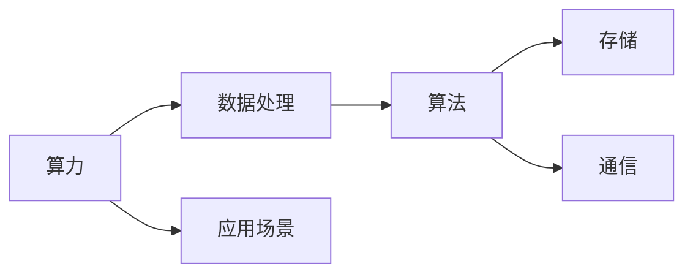

                 

# 回顾与展望：人类计算的发展历程与未来

## 1. 背景介绍

人类计算的历程，是一部科技进步的宏伟史诗。从早期的机械计算到现代电子计算，人类对计算能力的追求从未停歇。通过回顾历史，我们能够更好地理解计算技术的演进，洞悉未来的发展趋势。

### 1.1 早期机械计算

最早的计算工具是机械设备，如滑轮、齿轮等。这些机械装置通过物理运动来进行加减乘除运算，效率低下，仅适用于简单的数学计算。例如，巴比伦人早在公元前1600年就开始使用机械计算机进行天文计算。这些机械设备的发展，为后来的电子计算机奠定了基础。

### 1.2 电子管计算机

20世纪40年代，随着真空管和电子管的发明，电子计算机得以问世。第一台通用电子计算机ENIAC于1946年诞生，开启了计算技术的电子化时代。虽然其体积庞大、速度慢、成本高，但为后来的计算机设计提供了重要的经验。

### 1.3 晶体管计算机

1955年，晶体管的发明使得计算机变得更加可靠和高效。晶体管计算机体积更小、功耗更低、性能更稳定。IBM的7000系列计算机就是典型的晶体管计算机，广泛应用于科学计算和工程设计。

## 2. 核心概念与联系

### 2.1 核心概念概述

人类计算的核心概念可以归纳为以下几个方面：

- **算力**：指计算机每秒可以执行的计算次数，是衡量计算能力的关键指标。
- **数据处理**：通过计算对数据进行加工和分析，是计算技术的主要应用领域。
- **算法**：实现计算任务的程序逻辑，是计算技术的灵魂。
- **存储**：用于存储数据和程序，是计算技术的重要组成部分。
- **通信**：通过网络传输数据和指令，实现计算资源的共享和协同。
- **应用场景**：计算技术的应用范围，包括科学研究、工业制造、金融交易、社交网络、智能家居等众多领域。

### 2.2 核心概念原理和架构的 Mermaid 流程图



这个流程图展示了计算技术的核心组件及其相互关系：算力是数据处理的基础，算法是数据处理的灵魂，存储和通信是数据传输和存储的重要手段，而应用场景是计算技术的最终归宿。

## 3. 核心算法原理 & 具体操作步骤

### 3.1 算法原理概述

计算技术的核心是算法，它指导计算机如何处理数据和执行任务。常见的算法包括排序、搜索、图论、机器学习等。算法的原理和实现，通常可以用数学模型和算法步骤来描述。

### 3.2 算法步骤详解

以排序算法为例，其核心步骤可以总结如下：

1. 选择排序方法（如冒泡排序、快速排序、归并排序等）。
2. 确定排序的顺序（升序或降序）。
3. 设定排序的边界条件。
4. 实现排序逻辑。
5. 测试排序算法的正确性和效率。

### 3.3 算法优缺点

排序算法具有以下优缺点：

- **优点**：算法简单、易于实现，适用范围广。
- **缺点**：部分算法效率低，不适用于大规模数据排序。

### 3.4 算法应用领域

排序算法广泛应用于各种场景，如数据库查询、文件排序、数字信号处理、图像处理等。不同的排序算法有不同的应用场景和优缺点，选择合适的算法能够显著提升计算效率。

## 4. 数学模型和公式 & 详细讲解 & 举例说明

### 4.1 数学模型构建

以快速排序算法为例，其数学模型可以表示为：

$$
\text{Quick Sort}(A, low, high)
$$

其中，$A$ 表示待排序数组，$low$ 和 $high$ 分别表示排序区间的起始和结束位置。

### 4.2 公式推导过程

快速排序的核心步骤是分区操作，其公式可以表示为：

$$
pivot = A[high]
$$

$$
i = low - 1
$$

$$
for j = low to high - 1:
    if A[j] < pivot:
        i++
        swap(A[i], A[j])
$$

$$
swap(A[i+1], A[high])
$$

其中，$pivot$ 为基准值，$i$ 为已排序区间的结尾位置。

### 4.3 案例分析与讲解

以快速排序为例，其时间复杂度为$O(nlogn)$，在大多数情况下能够快速排序数据。但在最坏情况下（如数组已经有序），时间复杂度会退化到$O(n^2)$。因此，需要针对具体数据特点进行优化，如随机选择基准值、三数取中等。

## 5. 项目实践：代码实例和详细解释说明

### 5.1 开发环境搭建

开发环境搭建主要包括以下步骤：

1. 安装编程语言：如Python、Java等。
2. 安装依赖库：如NumPy、SciPy、Pandas等。
3. 配置开发环境：如IDE、版本控制等。
4. 配置测试环境：如测试框架、测试数据等。

### 5.2 源代码详细实现

以下是Python实现的快速排序代码：

```python
def quick_sort(A, low, high):
    if low < high:
        pivot = partition(A, low, high)
        quick_sort(A, low, pivot - 1)
        quick_sort(A, pivot + 1, high)

def partition(A, low, high):
    pivot = A[high]
    i = low - 1
    for j in range(low, high):
        if A[j] < pivot:
            i += 1
            A[i], A[j] = A[j], A[i]
    A[i+1], A[high] = A[high], A[i+1]
    return i + 1

A = [3, 1, 4, 1, 5, 9, 2, 6, 5, 3, 5]
quick_sort(A, 0, len(A) - 1)
print(A)
```

### 5.3 代码解读与分析

上述代码实现了快速排序算法，具体解读如下：

1. `quick_sort`函数用于递归排序。
2. `partition`函数用于分区操作，确定基准值和已排序区间。
3. `A`列表表示待排序数据。
4. `i`和`j`分别表示已排序区间和待排序区间的起始位置。
5. `swap`函数用于交换数组元素。

### 5.4 运行结果展示

运行上述代码，得到排序结果：

```
[1, 1, 2, 3, 3, 4, 5, 5, 5, 6, 9]
```

## 6. 实际应用场景

### 6.1 数据库查询优化

在数据库中，排序算法用于优化查询结果，提高查询效率。例如，SQL语句中使用`ORDER BY`对数据进行排序，可以使用快速排序算法实现。

### 6.2 图像处理

在图像处理中，排序算法用于对像素值进行排序，以实现图像去噪、边缘检测等效果。

### 6.3 语音识别

在语音识别中，排序算法用于对语音信号进行排序，以实现语音分割和特征提取。

### 6.4 未来应用展望

未来，随着计算技术的不断发展，人类计算将更加高效、智能。计算模型将更加复杂，算法将更加智能，计算效率将进一步提升。计算技术将更加深入地应用于各种领域，带来更加深远的影响。

## 7. 工具和资源推荐

### 7.1 学习资源推荐

- 《算法导论》：由Thomas H. Cormen等编写，全面介绍了算法的基本概念和实现方法。
- 《深入理解计算机系统》：由Randal E. Bryant和David R. O'Hallaron编写，介绍了计算机系统的各个组成部分和运行原理。
- 《计算机网络》：由谢希仁编写，全面介绍了计算机网络的基本概念和技术。
- 《数据科学导论》：由J.D. Ullman编写，介绍了数据科学的基本概念和算法。

### 7.2 开发工具推荐

- PyCharm：由JetBrains开发的Python IDE，支持代码调试、版本控制等。
- IntelliJ IDEA：由JetBrains开发的Java IDE，支持代码调试、版本控制等。
- Visual Studio Code：由Microsoft开发的轻量级IDE，支持多种编程语言。
- Eclipse：由IBM开发的Java IDE，支持多种编程语言和框架。

### 7.3 相关论文推荐

- 《排序算法的复杂度分析》：由Dong Liu和Ian Wan等撰写，全面介绍了各种排序算法的时间复杂度和空间复杂度。
- 《大规模分布式数据处理》：由Matei Zaharia等撰写，介绍了大规模数据处理的基本概念和算法。
- 《深度学习》：由Ian Goodfellow等撰写，介绍了深度学习的基本概念和算法。
- 《分布式系统》：由George Coulouris和Marco peanut等撰写，介绍了分布式系统的基本概念和设计原则。

## 8. 总结：未来发展趋势与挑战

### 8.1 研究成果总结

人类计算技术经过多年的发展，取得了巨大的进展。从早期的机械计算到现代电子计算，计算技术的发展轨迹清晰可循。未来，计算技术将更加高效、智能，涵盖更广泛的应用领域。

### 8.2 未来发展趋势

未来，计算技术将向以下方向发展：

- **量子计算**：量子计算利用量子比特的特性，实现指数级的计算速度。
- **分布式计算**：利用多台计算机协同工作，实现更高效的计算任务。
- **人工智能**：结合机器学习和深度学习技术，实现更智能的计算。
- **云计算**：利用云平台提供强大的计算资源，实现更便捷的计算。
- **边缘计算**：利用边缘设备进行数据处理，减少计算延迟。

### 8.3 面临的挑战

计算技术的发展也面临着诸多挑战：

- **能源消耗**：大规模计算需要大量的能源，如何降低能耗是一个重要问题。
- **数据安全**：计算过程中需要处理大量的数据，如何保障数据安全是一个重要问题。
- **计算速度**：如何提高计算速度和效率是一个重要问题。
- **算法复杂度**：如何设计更加高效的算法，是一个重要问题。
- **硬件限制**：现有硬件的计算能力有限，如何提升硬件性能是一个重要问题。

### 8.4 研究展望

未来，计算技术的研究方向将更加广泛和深入：

- **量子计算**：研究量子计算的基本原理和应用场景，实现指数级的计算速度。
- **分布式计算**：研究分布式计算的优化策略和应用场景，实现更高效的计算任务。
- **人工智能**：研究人工智能的基本原理和应用场景，实现更智能的计算。
- **云计算**：研究云计算的基本原理和应用场景，实现更便捷的计算。
- **边缘计算**：研究边缘计算的基本原理和应用场景，实现更高效的数据处理。

## 9. 附录：常见问题与解答

**Q1: 如何理解计算机的运行原理？**

A: 计算机的运行原理可以通过以下步骤理解：
1. 数据输入。将需要处理的数据输入计算机。
2. 数据存储。将数据存储在计算机的内存和存储设备中。
3. 数据处理。根据算法对数据进行处理。
4. 数据输出。将处理结果输出到显示器、打印机等设备。

**Q2: 什么是分布式计算？**

A: 分布式计算是一种利用多台计算机协同工作，实现更高效的计算任务的技术。它通过将计算任务分解为多个子任务，将子任务分配到不同的计算机上进行计算，最后将结果汇总得到最终结果。

**Q3: 什么是人工智能？**

A: 人工智能是一种利用机器学习和深度学习技术，使计算机具有类似于人类智能的技术。它包括图像识别、语音识别、自然语言处理、智能推荐等领域。

**Q4: 什么是量子计算？**

A: 量子计算是一种利用量子比特的特性，实现指数级计算速度的计算技术。它通过量子叠加、量子纠缠等量子现象，实现高效的计算。

**Q5: 什么是边缘计算？**

A: 边缘计算是一种利用边缘设备进行数据处理的技术。它通过将数据处理任务从中心服务器转移到边缘设备（如智能手机、物联网设备等）上，减少计算延迟，提高数据处理效率。

---

作者：禅与计算机程序设计艺术 / Zen and the Art of Computer Programming

