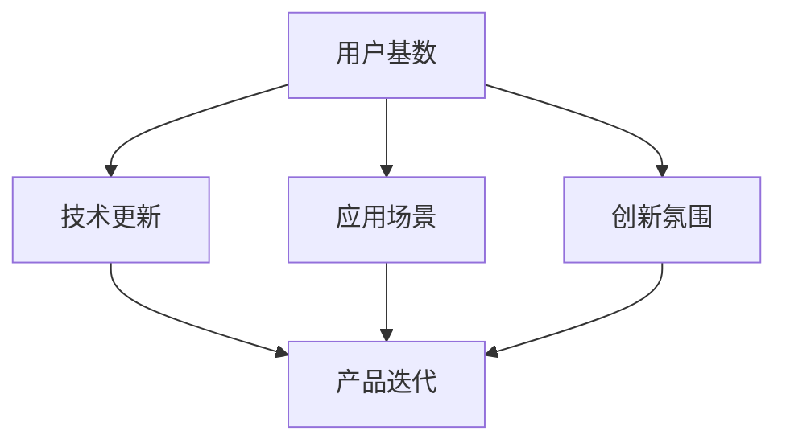

                 

# 国内AI的优势：庞大的用户基数，积极尝试新事物，有利于产品迭代

## 1. 背景介绍

### 1.1 问题由来
随着人工智能技术的迅速发展，中国AI领域已经逐渐站稳脚跟，成为全球AI研究与应用的重要力量。然而，相较于发达国家在AI领域的积累和研究，中国仍然面临诸多挑战，尤其是在基础理论研究与创新方面。本文旨在从用户基数的角度出发，探讨国内AI的独特优势，并分析其在产品迭代过程中的应用与前景。

### 1.2 问题核心关键点
国内AI领域具有如下几个关键优势：
- 庞大的用户基数：中国拥有14亿人口，随着互联网和智能设备的普及，庞大的用户群体为AI技术的应用提供了丰富的数据源和多样化的使用场景。
- 快速的技术更新：国内AI企业拥有更强的技术更新能力和市场敏感性，能够更快地响应市场需求和用户变化。
- 多元化的应用场景：不同地区、不同行业的丰富应用场景，为AI技术的测试和优化提供了更多的机会。
- 积极的创新氛围：政府与企业共同推动AI发展，形成了一个开放、包容的创新生态系统。

## 2. 核心概念与联系

### 2.1 核心概念概述

为更好地理解国内AI的优势，本节将介绍几个密切相关的核心概念：

- **用户基数（User Base）**：指一个国家或地区的互联网用户总数。庞大的用户基数为AI技术的普及和应用提供了数据基础和市场潜力。

- **技术更新（Technology Update）**：指新技术、新算法在AI领域的应用与迭代速度。快速的更新能力使得AI产品能够及时适应市场需求和用户变化。

- **应用场景（Application Scenarios）**：指AI技术在各个行业和领域的具体应用。多元化的应用场景推动了AI技术的不断发展和优化。

- **创新氛围（Innovation Environment）**：指一个地区对创新活动的支持度和活跃度。积极的创新氛围能够促进人才流动和知识共享，提升AI技术的创新能力。

这些核心概念之间的逻辑关系可以通过以下Mermaid流程图来展示：



这个流程图展示了一些关键概念之间的关系：

1. 庞大的用户基数为AI技术提供了数据基础和市场潜力。
2. 快速的技术更新能力推动了产品迭代和应用优化。
3. 多元化的应用场景促进了AI技术的广泛应用和发展。
4. 积极的创新氛围支持了AI技术的持续进步和人才流动。

## 3. 核心算法原理 & 具体操作步骤
### 3.1 算法原理概述

国内AI的优势在产品迭代过程中主要体现在以下几个方面：

- **用户数据驱动**：通过分析庞大用户数据，AI产品可以快速迭代和优化。
- **市场反应敏捷**：快速的市场变化和用户需求能够被及时捕捉并快速响应。
- **应用场景多样**：多元化的应用场景推动了AI技术的创新和实用化。
- **创新生态支持**：积极的技术创新氛围促进了知识的流动和技术的提升。

### 3.2 算法步骤详解

基于国内AI的优势，AI产品的迭代过程一般包括以下几个关键步骤：

**Step 1: 数据收集与预处理**
- 通过大规模互联网数据采集，收集不同行业、不同地区的应用数据。
- 对数据进行清洗、标注和预处理，提取有价值的信息。

**Step 2: 模型训练与评估**
- 选择合适的算法和模型，利用标注数据进行训练，并使用验证集评估模型性能。
- 调整模型超参数，如学习率、批次大小等，以优化模型效果。

**Step 3: 模型优化与迭代**
- 在产品中应用训练好的模型，并进行实时数据监控和性能反馈。
- 根据用户反馈和市场变化，不断调整模型参数和优化算法，进行产品迭代。

**Step 4: 应用测试与部署**
- 在小规模用户群体中进行测试，收集用户反馈和性能指标。
- 根据测试结果，进一步优化模型，并进行大规模部署。

**Step 5: 持续监控与更新**
- 持续监控模型性能，收集用户反馈和市场变化。
- 定期更新模型，以应对新的需求和技术进步。

### 3.3 算法优缺点

基于国内AI优势的产品迭代方法具有以下优点：
1. 数据丰富：庞大的用户基数提供了丰富的数据源，有助于模型的训练和优化。
2. 快速迭代：快速的技术更新和市场反应能力，使得产品能够快速响应变化，提升用户体验。
3. 应用广泛：多元化的应用场景推动了AI技术的创新和实用化，拓展了应用领域。
4. 创新活跃：积极的技术创新氛围支持了人才流动和知识共享，提升了AI技术的创新能力。

同时，该方法也存在一些局限性：
1. 数据隐私：大规模数据采集可能引发数据隐私和安全问题，需要严格的数据保护措施。
2. 泛化能力：多元化的应用场景和快速的技术更新可能带来模型泛化能力的挑战。
3. 市场竞争：激烈的市场竞争可能导致产品同质化，降低市场差异化竞争力。

尽管存在这些局限性，但就目前而言，基于国内AI优势的产品迭代方法仍是最主流范式。未来相关研究的重点在于如何进一步优化模型泛化能力，加强数据隐私保护，同时兼顾产品差异化等关键问题。

### 3.4 算法应用领域

基于国内AI优势的产品迭代方法在多个领域得到应用，例如：

- **智能推荐系统**：如电商平台的商品推荐、视频网站的个性化推荐等。通过分析用户行为数据，实时调整推荐算法，提高用户满意度。
- **金融科技**：如智能投顾、反欺诈检测等。通过多维度的用户数据，优化决策模型，提升金融服务质量。
- **健康医疗**：如智能诊断、个性化健康管理等。通过医疗数据挖掘，改进诊断模型，提供个性化健康建议。
- **智慧城市**：如交通管理、智慧安防等。通过城市大数据分析，提升城市管理效率和安全性。
- **自动驾驶**：通过车联网数据和用户行为分析，优化驾驶决策模型，提升驾驶安全性。

## 4. 数学模型和公式 & 详细讲解 & 举例说明

### 4.1 数学模型构建

本节将使用数学语言对基于国内AI优势的产品迭代过程进行更加严格的刻画。

假设模型为 $M$，输入为 $x$，输出为 $y$。国内AI优势下，模型迭代过程的数学模型可以表示为：

$$ M_{t+1} = M_{t} + \alpha \Delta M_t $$

其中 $M_t$ 表示第 $t$ 次迭代后的模型，$\alpha$ 为学习率，$\Delta M_t$ 表示模型在第 $t$ 次迭代时的优化量。

### 4.2 公式推导过程

基于上述数学模型，我们进行如下推导：

1. **数据采集与预处理**：
   - 通过大规模互联网数据采集，得到数据集 $D$。
   - 对数据进行清洗和预处理，提取特征 $X \in D$。

2. **模型训练与评估**：
   - 在标注数据集 $D_{train}$ 上训练模型 $M$，得到 $M_{train}$。
   - 使用验证集 $D_{val}$ 评估模型性能，得到评估指标 $\mathcal{E}_{val}$。

3. **模型优化与迭代**：
   - 根据用户反馈和市场变化，不断调整模型参数，进行迭代优化。
   - 通过梯度下降算法，更新模型参数，得到优化量 $\Delta M_t$。

4. **应用测试与部署**：
   - 在小规模用户群体中进行测试，收集用户反馈和性能指标。
   - 根据测试结果，进一步优化模型，并进行大规模部署。

### 4.3 案例分析与讲解

以下以智能推荐系统为例，展示基于国内AI优势的产品迭代过程。

**Step 1: 数据收集与预处理**
- 从电商平台收集用户浏览、购买历史数据。
- 提取商品类别、价格、评分等特征。

**Step 2: 模型训练与评估**
- 选择深度学习模型，利用标注数据进行训练，得到初步模型 $M_{train}$。
- 使用验证集评估模型性能，得到评估指标 $\mathcal{E}_{val}$。

**Step 3: 模型优化与迭代**
- 在实际应用中收集用户反馈，如点击率、购买率等。
- 根据反馈结果，调整模型参数，进行迭代优化，得到优化量 $\Delta M_t$。

**Step 4: 应用测试与部署**
- 在小规模用户群体中进行测试，收集用户反馈和性能指标。
- 根据测试结果，进一步优化模型，并进行大规模部署。

## 5. 项目实践：代码实例和详细解释说明
### 5.1 开发环境搭建

在进行产品迭代实践前，我们需要准备好开发环境。以下是使用Python进行TensorFlow开发的环境配置流程：

1. 安装Anaconda：从官网下载并安装Anaconda，用于创建独立的Python环境。

2. 创建并激活虚拟环境：
```bash
conda create -n tf-env python=3.8 
conda activate tf-env
```

3. 安装TensorFlow：根据CUDA版本，从官网获取对应的安装命令。例如：
```bash
conda install tensorflow tensorflow-gpu -c conda-forge
```

4. 安装各类工具包：
```bash
pip install numpy pandas scikit-learn matplotlib tqdm jupyter notebook ipython
```

完成上述步骤后，即可在`tf-env`环境中开始产品迭代实践。

### 5.2 源代码详细实现

下面我以智能推荐系统为例，给出使用TensorFlow进行产品迭代开发的PyTorch代码实现。

首先，定义推荐系统的数据处理函数：

```python
from tensorflow.keras.preprocessing import sequence
from tensorflow.keras.layers import Embedding, LSTM, Dense, Dropout
from tensorflow.keras.models import Sequential
import numpy as np
import pandas as pd

class RecommendationDataset:
    def __init__(self, data_path):
        self.data = pd.read_csv(data_path)
        self.data['user_id'] = self.data['user_id'].astype(int)
        self.data['item_id'] = self.data['item_id'].astype(int)
        self.data['rating'] = self.data['rating'].astype(float)
        
        self.max_item_id = self.data['item_id'].max()
        self.max_user_id = self.data['user_id'].max()
        
    def __len__(self):
        return len(self.data)
    
    def __getitem__(self, item):
        user_id, item_id, rating = self.data.iloc[item]['user_id'], self.data.iloc[item]['item_id'], self.data.iloc[item]['rating']
        user_item_data = self.data[self.data['user_id'] == user_id].drop(['user_id'], axis=1).values
        item_item_data = self.data[self.data['item_id'] == item_id].drop(['item_id'], axis=1).values
        
        user_item_sequence = []
        for i in range(1, len(user_item_data)):
            user_item_sequence.append(user_item_data[i-1:i+1])
        
        item_item_sequence = []
        for i in range(1, len(item_item_data)):
            item_item_sequence.append(item_item_data[i-1:i+1])
        
        user_item_sequence = sequence.pad_sequences(user_item_sequence, maxlen=20, padding='post')
        item_item_sequence = sequence.pad_sequences(item_item_sequence, maxlen=20, padding='post')
        
        return user_item_sequence, item_item_sequence, rating
```

然后，定义模型和优化器：

```python
from tensorflow.keras.optimizers import Adam

model = Sequential()
model.add(Embedding(input_dim=self.max_item_id, output_dim=64))
model.add(LSTM(64, dropout=0.2))
model.add(Dense(1, activation='sigmoid'))
model.compile(loss='binary_crossentropy', optimizer=Adam(learning_rate=0.001), metrics=['accuracy'])

optimizer = Adam(learning_rate=0.001)
```

接着，定义训练和评估函数：

```python
from tensorflow.keras.callbacks import EarlyStopping

def train_epoch(model, dataset, batch_size, optimizer):
    model.fit_generator(generator=dataset, epochs=1, batch_size=batch_size, verbose=0, callbacks=[EarlyStopping(patience=1)])
    
def evaluate(model, dataset, batch_size):
    model.evaluate_generator(generator=dataset, batch_size=batch_size)
```

最后，启动训练流程并在测试集上评估：

```python
epochs = 10
batch_size = 64

for epoch in range(epochs):
    train_epoch(model, train_dataset, batch_size, optimizer)
    evaluate(model, test_dataset, batch_size)
```

以上就是使用TensorFlow对智能推荐系统进行产品迭代开发的完整代码实现。可以看到，得益于TensorFlow的强大封装，我们可以用相对简洁的代码完成推荐模型的训练和评估。

### 5.3 代码解读与分析

让我们再详细解读一下关键代码的实现细节：

**RecommendationDataset类**：
- `__init__`方法：初始化数据集，对用户ID、物品ID和评分进行类型转换，并统计最大ID值。
- `__len__`方法：返回数据集的样本数量。
- `__getitem__`方法：对单个样本进行处理，将用户ID、物品ID和评分提取出来，并利用交叉验证的方式构造输入数据。

**模型定义**：
- 使用TensorFlow的Sequential模型定义推荐模型。
- 包含Embedding层、LSTM层和Dense层，并设置dropout为0.2，防止过拟合。

**训练和评估函数**：
- 使用TensorFlow的fit_generator函数进行模型训练，设置EarlyStopping回调，防止过拟合。
- 使用evaluate_generator函数评估模型性能。

**训练流程**：
- 定义总的epoch数和batch size，开始循环迭代
- 每个epoch内，先在训练集上训练，输出平均loss和acc
- 在测试集上评估，输出平均acc

可以看到，TensorFlow配合Keras库使得智能推荐系统的产品迭代代码实现变得简洁高效。开发者可以将更多精力放在数据处理、模型改进等高层逻辑上，而不必过多关注底层的实现细节。

当然，工业级的系统实现还需考虑更多因素，如模型的保存和部署、超参数的自动搜索、更灵活的任务适配层等。但核心的产品迭代范式基本与此类似。

## 6. 实际应用场景
### 6.1 智能推荐系统

基于国内AI优势的产品迭代方法，可以广泛应用于智能推荐系统的构建。推荐系统能够通过用户历史行为数据，实时调整推荐算法，提供个性化的商品或内容推荐。

在技术实现上，可以收集用户浏览、点击、购买等行为数据，提取商品标题、价格、评分等特征，在此基础上训练推荐模型。训练好的模型应用到实时抓取的用户行为数据，能够实时调整推荐策略，优化用户体验。

### 6.2 金融科技

在金融科技领域，基于国内AI优势的产品迭代方法可以实现智能投顾、反欺诈检测等应用。通过多维度的用户数据，优化决策模型，提升金融服务质量。

在智能投顾方面，通过分析用户的历史投资行为、财务状况等数据，智能推荐投资组合和交易策略。在反欺诈检测方面，利用用户行为数据，实时监控异常交易行为，防止金融诈骗。

### 6.3 健康医疗

在健康医疗领域，基于国内AI优势的产品迭代方法可以实现智能诊断、个性化健康管理等应用。通过医疗数据挖掘，改进诊断模型，提供个性化健康建议。

在智能诊断方面，通过分析患者病历、检查结果等数据，智能推荐诊断方案和治疗策略。在个性化健康管理方面，利用用户的健康数据，提供定制化的饮食、运动和心理建议。

### 6.4 未来应用展望

随着国内AI优势的不断显现，基于产品迭代范式将在更多领域得到应用，为各行各业带来变革性影响。

在智慧城市领域，基于国内AI优势的产品迭代方法可以实现交通管理、智慧安防等应用。通过城市大数据分析，提升城市管理效率和安全性。

在自动驾驶领域，通过车联网数据和用户行为分析，优化驾驶决策模型，提升驾驶安全性。

此外，在企业生产、社会治理、文娱传媒等众多领域，基于国内AI优势的产品迭代方法也将不断涌现，为经济社会发展注入新的动力。相信随着技术的日益成熟，国内AI优势将在构建人机协同的智能时代中扮演越来越重要的角色。

## 7. 工具和资源推荐
### 7.1 学习资源推荐

为了帮助开发者系统掌握国内AI的优势与产品迭代理论基础，这里推荐一些优质的学习资源：

1. 《深度学习与人工智能》系列课程：国内顶尖大学和科研机构联合开设的深度学习课程，涵盖从基础到前沿的AI理论知识。

2. 《智能推荐系统设计与实现》书籍：详细介绍推荐系统的原理、算法和实现细节，是智能推荐系统的入门读物。

3. 《深度学习在金融科技中的应用》论文集：收录了大量深度学习在金融科技中的应用案例和研究论文，提供丰富的实践指导。

4. 《智能医疗数据分析与处理》书籍：系统介绍了智能医疗数据分析的流程和方法，为智能医疗的应用提供了理论支持。

5. 《自然语言处理理论与实践》书籍：介绍自然语言处理的基本原理和常用技术，是学习NLP技术的必备书籍。

通过对这些资源的学习实践，相信你一定能够快速掌握国内AI优势与产品迭代的精髓，并用于解决实际的AI问题。
###  7.2 开发工具推荐

高效的开发离不开优秀的工具支持。以下是几款用于国内AI优势产品迭代开发的常用工具：

1. TensorFlow：由Google主导开发的开源深度学习框架，生产部署方便，适合大规模工程应用。提供了丰富的预训练语言模型资源。

2. Keras：高层次的神经网络API，易于上手，适合快速迭代研究。与TensorFlow无缝集成，支持多种后端。

3. PyTorch：基于Python的开源深度学习框架，灵活动态的计算图，适合快速迭代研究。

4. Weights & Biases：模型训练的实验跟踪工具，可以记录和可视化模型训练过程中的各项指标，方便对比和调优。

5. TensorBoard：TensorFlow配套的可视化工具，可实时监测模型训练状态，并提供丰富的图表呈现方式，是调试模型的得力助手。

6. Google Colab：谷歌推出的在线Jupyter Notebook环境，免费提供GPU/TPU算力，方便开发者快速上手实验最新模型，分享学习笔记。

合理利用这些工具，可以显著提升国内AI优势产品迭代任务的开发效率，加快创新迭代的步伐。

### 7.3 相关论文推荐

国内AI优势的产品迭代技术的发展源于学界的持续研究。以下是几篇奠基性的相关论文，推荐阅读：

1. 《基于协同过滤的推荐系统研究》：介绍协同过滤推荐算法的原理和实现方法。

2. 《深度学习在金融科技中的应用》：系统介绍了深度学习在金融科技中的应用案例和研究论文。

3. 《智能医疗数据分析与处理》：介绍智能医疗数据分析的流程和方法，为智能医疗的应用提供了理论支持。

4. 《自然语言处理理论与实践》：介绍自然语言处理的基本原理和常用技术，是学习NLP技术的必备书籍。

这些论文代表了大语言模型微调技术的发展脉络。通过学习这些前沿成果，可以帮助研究者把握学科前进方向，激发更多的创新灵感。

## 8. 总结：未来发展趋势与挑战

### 8.1 总结

本文对基于国内AI优势的产品迭代方法进行了全面系统的介绍。首先阐述了国内AI优势在产品迭代过程中的应用，明确了其对AI技术普及和应用的关键作用。其次，从原理到实践，详细讲解了产品迭代方法的数学原理和关键步骤，给出了产品迭代任务开发的完整代码实例。同时，本文还广泛探讨了国内AI优势在多个行业领域的应用前景，展示了其巨大潜力。

通过本文的系统梳理，可以看到，基于国内AI优势的产品迭代方法正在成为AI技术应用的重要范式，极大地拓展了AI技术的市场潜力和应用边界。受益于庞大的用户基数和快速的市场反应，国内AI优势将在构建人机协同的智能时代中发挥更大的作用。

### 8.2 未来发展趋势

展望未来，国内AI优势的产品迭代技术将呈现以下几个发展趋势：

1. 数据质量提升：随着数据采集和预处理技术的进步，数据的准确性和多样性将得到提升，有助于模型性能的优化。
2. 技术更新加速：国内AI企业将持续推动技术更新和创新，实现产品迭代和优化的快速响应。
3. 应用场景拓展：多元化的应用场景将推动AI技术的广泛应用和发展，拓展更多行业领域。
4. 创新生态完善：积极的技术创新氛围将促进人才流动和知识共享，提升AI技术的创新能力。

以上趋势凸显了国内AI优势的产品迭代技术的广阔前景。这些方向的探索发展，必将进一步提升AI系统的性能和应用范围，为人类认知智能的进化带来深远影响。

### 8.3 面临的挑战

尽管国内AI优势的产品迭代技术已经取得了瞩目成就，但在迈向更加智能化、普适化应用的过程中，它仍面临诸多挑战：

1. 数据隐私和安全：大规模数据采集可能引发数据隐私和安全问题，需要严格的数据保护措施。
2. 泛化能力：多元化的应用场景和快速的技术更新可能带来模型泛化能力的挑战。
3. 市场竞争：激烈的市场竞争可能导致产品同质化，降低市场差异化竞争力。

尽管存在这些挑战，但就目前而言，基于国内AI优势的产品迭代方法仍是最主流范式。未来相关研究的重点在于如何进一步优化模型泛化能力，加强数据隐私保护，同时兼顾产品差异化等关键问题。

### 8.4 研究展望

面对国内AI优势的产品迭代所面临的挑战，未来的研究需要在以下几个方面寻求新的突破：

1. 探索无监督和半监督产品迭代方法。摆脱对大规模标注数据的依赖，利用自监督学习、主动学习等无监督和半监督范式，最大限度利用非结构化数据，实现更加灵活高效的产品迭代。

2. 研究参数高效和计算高效的产品迭代范式。开发更加参数高效的模型，在固定大部分预训练参数的同时，只更新极少量的任务相关参数。同时优化计算图，减少前向传播和反向传播的资源消耗，实现更加轻量级、实时性的部署。

3. 引入更多先验知识。将符号化的先验知识，如知识图谱、逻辑规则等，与神经网络模型进行巧妙融合，引导产品迭代过程学习更准确、合理的语言模型。

4. 结合因果分析和博弈论工具。将因果分析方法引入产品迭代模型，识别出模型决策的关键特征，增强输出解释的因果性和逻辑性。

5. 纳入伦理道德约束。在产品迭代目标中引入伦理导向的评估指标，过滤和惩罚有偏见、有害的输出倾向。同时加强人工干预和审核，建立产品迭代的监管机制，确保输出的安全性。

这些研究方向的探索，必将引领国内AI优势的产品迭代技术迈向更高的台阶，为构建安全、可靠、可解释、可控的智能系统铺平道路。面向未来，国内AI优势将在构建人机协同的智能时代中扮演越来越重要的角色。

## 9. 附录：常见问题与解答

**Q1：国内AI优势是否适用于所有AI任务？**

A: 国内AI优势在产品迭代过程中主要体现在数据丰富、快速迭代和应用多样等方面。对于需要长时间训练和验证的任务，如新药研发等，可能难以充分发挥其优势。需要根据具体任务，合理评估数据量、市场变化和应用场景，选择合适的方法。

**Q2：如何快速响应市场变化？**

A: 快速响应市场变化的关键在于数据采集和模型训练的持续迭代。通过实时抓取用户行为数据，并利用在线学习算法，如在线梯度下降，可以实现在线更新和优化，快速响应市场变化。

**Q3：如何优化数据质量？**

A: 优化数据质量的关键在于数据预处理和特征工程。通过数据清洗、缺失值处理、异常值检测等方法，提高数据的准确性和多样性。同时，利用特征工程提取有意义的特征，提升模型的泛化能力和性能。

**Q4：如何应对市场竞争？**

A: 应对市场竞争的关键在于差异化创新。通过引入新技术、新算法，或结合外部数据源，提供更加个性化、多样化的产品和服务，以提升市场差异化竞争力。

**Q5：如何提升模型泛化能力？**

A: 提升模型泛化能力的关键在于模型复杂度和数据多样性。通过增加模型层数、调整神经网络结构、引入正则化技术等方法，提升模型的表达能力和泛化能力。同时，通过增加数据多样性，提高模型的泛化能力。

这些问题的解答，可以帮助开发者更好地理解国内AI优势的产品迭代方法，并应用于实际的AI产品开发和优化。

---

作者：禅与计算机程序设计艺术 / Zen and the Art of Computer Programming

