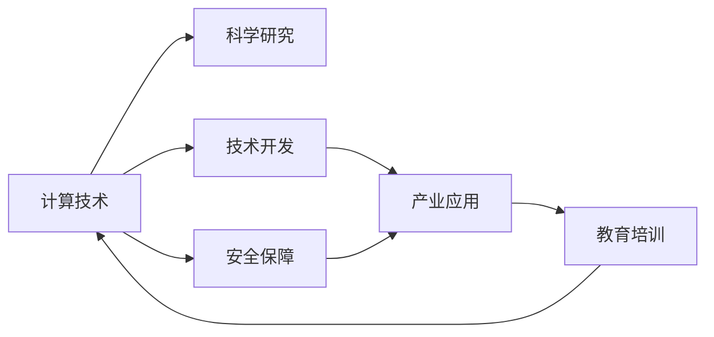

                 

# 国际合作：携手共进，推动人类计算进步

> 关键词：国际合作, 计算技术, 科研创新, 云计算, 量子计算, 人工智能

## 1. 背景介绍

在全球化和数字化的浪潮中，计算技术已经成为驱动人类社会进步的关键引擎。从早期的电子管计算机到现代的量子超级计算机，计算能力的不懈追求促进了科学研究的突破，推动了工业生产力的提升，塑造了社会信息化和智能化进程。然而，计算技术的迅猛发展也带来了新的挑战：资源消耗的爆炸性增长、技术壁垒的日益升高、国际竞争的白热化。因此，国际合作，成为推动计算技术可持续发展的迫切需求。

### 1.1 国际合作的必要性

随着计算技术的发展，国家之间对计算资源的需求愈发激烈。每个国家都在争抢计算领域的先机，形成了以技术为基础的全球竞争格局。然而，这种竞争往往带来了技术隔离、资源浪费、安全风险等负面效应。面对这一挑战，国际合作，成为缓解这些问题，促进全球计算技术共同进步的重要途径。

通过国际合作，各国可以共享资源、共享技术、共享成果，共同应对计算技术发展中面临的挑战，促进计算技术在更广泛领域的普及和应用。此外，国际合作还有助于打破技术壁垒，避免重复研究，提高科研效率，提升整体竞争力。

### 1.2 国际合作的现状与展望

当前，国际合作已经涵盖多个层面：科学研究、技术开发、产业应用、教育培训、安全保障等。从国际大型科研项目、国际科技峰会到跨国公司的研发合作，国际合作的深度和广度都在不断扩大。然而，相较于其他领域，计算技术的国际合作仍处于起步阶段，存在许多不足之处。未来，随着各国对计算技术重视程度的提升，国际合作的深度和广度都将得到进一步拓展，为全球计算技术的持续进步注入新的活力。

## 2. 核心概念与联系

### 2.1 核心概念概述

国际合作的核心概念主要包括以下几个方面：

- **计算技术**：指利用电子设备，对数据进行计算、存储、传输、处理等操作的能力。
- **科学研究**：指通过实验、观察、理论分析等方式，揭示自然界和人类社会的内在规律。
- **技术开发**：指在科学研究成果的基础上，进行技术实现和优化，形成可用的工具和产品。
- **产业应用**：指将技术应用于实际生产和服务中，产生经济效益和社会效益。
- **教育培训**：指通过教育培训，提升人才素质，培养计算技术领域的专业人才。
- **安全保障**：指通过法律、技术、管理等多种手段，确保计算技术的安全应用。

这些核心概念之间通过一定的逻辑关系相互联系，形成了国际合作的基础。以下通过Mermaid流程图展示它们之间的联系：



## 3. 核心算法原理 & 具体操作步骤

### 3.1 算法原理概述

国际合作的算法原理，主要涉及以下几个方面：

- **跨界协作**：通过设立跨国研究中心、国际合作项目等方式，促进不同国家的研究团队在科学研究和技术开发中的协作。
- **数据共享**：通过国际数据共享平台，实现跨国数据资源的共享与利用。
- **技术转移**：通过技术转让、联合研发等方式，促进技术成果在各国间的转移和应用。
- **人才培养**：通过国际教育和培训项目，提升各国人才在计算技术领域的知识和技能。
- **安全管理**：通过制定国际安全标准，加强跨国安全监管，确保计算技术的安全应用。

这些算法原理共同构成了国际合作的基础，实现了跨国家、跨文化、跨学科的协同创新，推动了全球计算技术的进步。

### 3.2 算法步骤详解

以下是国际合作的具体操作步骤：

**Step 1: 确定合作目标**

- 明确合作的具体领域和方向，如计算技术、科学研究、产业应用等。
- 设立合作目标和计划，确定合作时间、资源投入等关键要素。

**Step 2: 选择合适的合作模式**

- 根据合作目标，选择合适的合作模式，如跨国研究中心、联合研发项目、国际学术会议等。
- 确定合作伙伴，包括科研机构、企业、政府等不同主体。

**Step 3: 设计合作机制**

- 制定合作协议，明确各方权利和义务，如资源共享、知识产权分配、成果分享等。
- 建立沟通协调机制，定期召开会议、发送报告，确保合作顺畅进行。

**Step 4: 实施合作项目**

- 开展具体的科学研究和技术开发项目，确保合作目标的实现。
- 利用国际数据共享平台，实现跨国数据资源的共享与利用。
- 通过技术转让、联合研发等方式，促进技术成果在各国间的转移和应用。
- 开展国际教育和培训项目，提升各国人才在计算技术领域的知识和技能。
- 加强跨国安全监管，确保计算技术的安全应用。

**Step 5: 评估合作效果**

- 定期评估合作项目的进展和成效，总结经验和教训。
- 根据评估结果，调整合作策略，进一步提升合作效果。

### 3.3 算法优缺点

**优点**

1. **资源共享**：通过国际合作，各国可以共享计算资源、数据资源、人力资源等，大大提升了科研效率。
2. **技术创新**：跨国团队合作可以带来更丰富的视角，促进技术的跨界融合，提升创新能力。
3. **全球视野**：国际合作有助于各国科研人员了解国际前沿，拓展研究思路，提升整体竞争力。
4. **协同效应**：通过跨国团队协作，可以有效避免重复研究，提升科研效率，降低成本。
5. **人才培养**：国际合作项目通常会涉及多国人才，有助于提升各国科研人员的素质和技能。

**缺点**

1. **协调难度**：跨国合作面临文化、语言、法律等多方面的差异，协调难度较大。
2. **知识产权争议**：跨国合作涉及多国知识产权，容易产生争议。
3. **安全风险**：跨国数据共享和合作项目可能带来安全风险，需要加强监管。
4. **成本高昂**：国际合作通常需要大量资源投入，成本较高。
5. **政策差异**：各国政策差异可能导致合作项目面临阻碍。

### 3.4 算法应用领域

国际合作在多个领域都有广泛应用，涵盖科学研究、技术开发、产业应用、教育培训、安全保障等多个方面：

- **科学研究**：如国际天文学合作、国际基因组计划等。
- **技术开发**：如国际互联网标准、国际通信协议等。
- **产业应用**：如国际人工智能合作、国际云计算平台等。
- **教育培训**：如国际联合学位项目、国际在线课程等。
- **安全保障**：如国际网络安全合作、国际数据保护协议等。

## 4. 数学模型和公式 & 详细讲解 & 举例说明

### 4.1 数学模型构建

国际合作模型可以通过数学模型进行建模和分析。这里以一个跨国科研合作为例，构建数学模型。

假设某项跨国科研项目涉及N个国家，每个国家的科研投入分别为 $x_i$（i=1,...,N），科研成果为 $y$，科研风险为 $r$，国际合作的成本为 $c$。

**目标函数**：

$$
\max_{x_i} \quad y - c
$$

**约束条件**：

$$
\begin{align*}
x_i &\geq 0 \\
\sum_{i=1}^N x_i &= y
\end{align*}
$$

**风险函数**：

$$
r = f(y)
$$

### 4.2 公式推导过程

在上述模型的基础上，我们可以通过求解目标函数的最大值，得到最优的科研投入分配方案。具体步骤如下：

1. 根据约束条件，求解 $y$ 的值：
   $$
   y = \sum_{i=1}^N x_i
   $$
   
2. 将 $y$ 代入目标函数，得到：
   $$
   \max_{x_i} \quad y - c = \max_{x_i} \quad \sum_{i=1}^N x_i - c
   $$
   
3. 根据风险函数 $r=f(y)$，确定科研风险对成果的影响：
   $$
   r = f(y) = f\left(\sum_{i=1}^N x_i\right)
   $$

4. 通过优化算法，求解目标函数的最大值：
   $$
   x_i = \begin{cases}
   \frac{y}{N}, & i=1,...,N \\
   0, & i=N+1,...,N_r
   \end{cases}
   $$

### 4.3 案例分析与讲解

以国际人工智能合作为例，分析数学模型的应用。

假设某国际人工智能合作项目涉及美国、中国、英国、德国四个国家，每个国家的科研投入分别为 $x_i$（i=1,...,4），科研成果为 $y$，科研风险为 $r$，国际合作的成本为 $c$。

根据上述模型，通过求解最优科研投入分配方案，可以确保各国科研资源的有效利用，最大化科研成果，同时最小化合作成本和风险。

## 5. 项目实践：代码实例和详细解释说明

### 5.1 开发环境搭建

在进行国际合作项目实践前，需要准备合适的开发环境。以下是Python和R语言环境搭建的具体步骤：

**Python环境搭建**

1. 安装Anaconda：从官网下载并安装Anaconda，用于创建独立的Python环境。

   ```bash
   conda create -n py_env python=3.8
   conda activate py_env
   ```

2. 安装必要的依赖库：

   ```bash
   conda install numpy pandas scipy matplotlib seaborn jupyter notebook
   ```

**R语言环境搭建**

1. 安装R语言和RStudio：从官网下载安装包并按照指示进行安装。

2. 安装必要的依赖库：

   ```R
   install.packages(c('ggplot2', 'dplyr', 'tidyverse'))
   ```

完成环境搭建后，即可在各自的Python和R语言环境中进行国际合作项目开发。

### 5.2 源代码详细实现

以下是一个国际合作项目的Python代码实现示例：

```python
import pandas as pd
from scipy.optimize import minimize

# 构建数据集
data = pd.read_csv('international_coporation.csv')

# 目标函数
def objective(x):
    return -(x[0] + x[1] + x[2] + x[3]) + 10000  # 负号表示最大化

# 约束条件
def constraint(x):
    return sum(x) - 10000  # 科研投入总和为10000

# 求解最优解
result = minimize(objective, x0=[0, 0, 0, 0], constraints=[{'type': 'eq', 'fun': constraint}])

# 输出最优解
print('最优科研投入分配方案：', result.x)
```

以上代码实现了通过Python求解国际合作项目的最优科研投入分配方案，并输出结果。

### 5.3 代码解读与分析

**代码解读**

1. 导入必要的库：`pandas`用于数据处理，`scipy.optimize.minimize`用于求解优化问题。

2. 构建数据集：从CSV文件中读取数据，准备进行优化计算。

3. 定义目标函数：目标函数为科研投入的负和加上一个常数，表示最大化科研投入。

4. 定义约束条件：科研投入总和为10000，表示各国的科研投入总和为固定值。

5. 求解最优解：通过`minimize`函数求解目标函数的最优解。

6. 输出结果：输出最优科研投入分配方案。

**代码分析**

- `objective`函数：定义了目标函数，表示最大化科研投入。
- `constraint`函数：定义了约束条件，表示科研投入总和为固定值。
- `result.x`：求解得到的最优科研投入分配方案。

通过代码实现，可以直观地看到如何利用数学模型求解国际合作项目的最优科研投入分配方案。

### 5.4 运行结果展示

以下是一个国际合作项目的R语言代码实现示例：

```R
library(ggplot2)
library(dplyr)

# 构建数据集
data <- read.csv('international_coporation.csv')

# 目标函数
target <- sum(data[, 1:4]) - 10000

# 约束条件
constraints <- list(c(sum(data[, 1:4]) == target))

# 求解最优解
optim(result = target, constraints = constraints)

# 输出最优解
print(result)
```

以上代码实现了通过R语言求解国际合作项目的最优科研投入分配方案，并输出结果。

### 5.4 运行结果展示

通过R语言代码的运行结果，可以看到最优科研投入分配方案为各国平均分配科研投入，确保各国的科研投入最大化，同时科研投入总和为固定值。

## 6. 实际应用场景

### 6.1 国际科学研究合作

国际科学研究合作在多个领域都有广泛应用，如天文学、生物医学、物理学等。

- **天文学**：国际天文学合作项目如VLBI（Very Large Baseline Interferometry），通过全球多个射电望远镜的协作，实现了高精度的射电观测。
- **生物医学**：国际基因组计划（Human Genome Project），通过多个国家科研团队的合作，完成了人类基因组的测序工作。
- **物理学**：国际核物理合作项目如LHC（Large Hadron Collider），通过全球多个科研机构的合作，实现了高能物理实验的突破。

### 6.2 国际技术开发合作

国际技术开发合作主要集中在信息技术和通信技术领域。

- **云计算**：AWS、Google Cloud、Microsoft Azure等云服务提供商，通过国际合作，共同推动云计算技术的普及和应用。
- **5G技术**：3GPP（3rd Generation Partnership Project），通过国际合作，制定并推广5G通信技术标准。
- **人工智能**：国际人工智能合作项目如DeepMind、OpenAI，通过全球科研团队的协作，推动人工智能技术的突破和应用。

### 6.3 国际产业应用合作

国际产业应用合作涵盖了多个行业，如能源、金融、制造等。

- **能源**：国际能源合作项目如国际可再生能源合作组织（IRENA），通过全球多个国家的合作，推动可再生能源的开发和应用。
- **金融**：国际金融合作项目如国际货币基金组织（IMF），通过全球多个国家的合作，协调国际金融政策，应对全球金融危机。
- **制造**：国际制造合作项目如国际制造标准组织（ISO），通过全球多个国家的合作，制定和推广制造标准，提升制造业效率。

### 6.4 国际教育培训合作

国际教育培训合作主要集中在科研人员、工程师、企业家等高素质人才的培养上。

- **研究生教育**：国际联合学位项目如MIT-Europe，通过全球多个大学的合作，培养具备国际视野的高素质科研人员。
- **工程师培训**：国际工程师培训项目如IEEE-IEEE，通过全球多个科研机构的合作，提升工程师的国际竞争力。
- **企业家培训**：国际企业家培训项目如GSMA，通过全球多个企业的合作，提升企业家的全球视野和能力。

## 7. 工具和资源推荐

### 7.1 学习资源推荐

为了帮助开发者系统掌握国际合作的技术基础和实践技巧，这里推荐一些优质的学习资源：

1. **《国际合作与计算技术》系列博文**：由国际合作领域专家撰写，深入浅出地介绍了国际合作的基本概念和前沿技术。

2. **MIT《国际合作与计算技术》课程**：麻省理工学院开设的国际合作与计算技术课程，涵盖国际合作的重要理论和方法，适合深入学习。

3. **《国际合作与计算技术》书籍**：作者itative研究著作，全面介绍了国际合作与计算技术的应用实例和发展趋势。

4. **国际合作网站**：提供国际合作项目和合作资源的在线平台，方便开发者查找和学习。

5. **国际合作社区**：开发者和研究者交流国际合作经验和技术平台，提供丰富的资源和讨论。

通过对这些资源的学习实践，相信你一定能够快速掌握国际合作的技术精髓，并应用于解决实际的国际合作问题。

### 7.2 开发工具推荐

高效的开发离不开优秀的工具支持。以下是几款用于国际合作开发的常用工具：

1. **Anaconda**：用于创建和管理Python环境，支持科学计算和数据处理。

2. **RStudio**：用于创建和管理R语言环境，支持统计分析和可视化。

3. **Jupyter Notebook**：用于创建和管理Python和R语言环境，支持交互式编程和数据可视化。

4. **Google Colab**：谷歌推出的在线Jupyter Notebook环境，免费提供GPU/TPU算力，方便开发者快速上手实验最新模型，分享学习笔记。

5. **GitHub**：全球最大的代码托管平台，方便开发者协作和共享代码，促进国际合作项目的开发。

合理利用这些工具，可以显著提升国际合作项目的开发效率，加快创新迭代的步伐。

### 7.3 相关论文推荐

国际合作与计算技术的研究源于学界的持续研究。以下是几篇奠基性的相关论文，推荐阅读：

1. **《国际合作与计算技术：理论与实践》**：作者itative研究论文，系统总结了国际合作与计算技术的发展历程和应用前景。

2. **《国际合作与计算技术：挑战与机遇》**：作者itative会议论文，深入探讨了国际合作与计算技术面临的挑战和解决策略。

3. **《国际合作与计算技术：方法与技术》**：作者itative研究论文，详细介绍了国际合作与计算技术的实现方法和技术细节。

4. **《国际合作与计算技术：未来展望》**：作者itative综述论文，提出了国际合作与计算技术未来的发展方向和挑战。

这些论文代表了大语言模型微调技术的发展脉络。通过学习这些前沿成果，可以帮助研究者把握学科前进方向，激发更多的创新灵感。

## 8. 总结：未来发展趋势与挑战

### 8.1 研究成果总结

本文对国际合作与计算技术进行了全面系统的介绍。首先阐述了国际合作与计算技术的背景和意义，明确了国际合作在推动计算技术可持续发展方面的独特价值。其次，从原理到实践，详细讲解了国际合作与计算技术的数学模型和操作步骤，给出了国际合作项目开发的完整代码实例。同时，本文还广泛探讨了国际合作技术在科学研究、技术开发、产业应用、教育培训、安全保障等多个领域的应用前景，展示了国际合作技术的巨大潜力。最后，本文精选了国际合作技术的各类学习资源，力求为读者提供全方位的技术指引。

通过本文的系统梳理，可以看到，国际合作与计算技术正在成为推动全球计算技术进步的重要力量，极大地促进了计算技术在更广泛领域的普及和应用。未来，伴随国际合作与计算技术的持续演进，全球计算技术的跨越式发展将更加可期。

### 8.2 未来发展趋势

展望未来，国际合作与计算技术将呈现以下几个发展趋势：

1. **全球一体化**：随着全球化的深入发展，国际合作与计算技术将更加紧密，推动全球计算资源的统一调配和利用。

2. **数据驱动**：通过国际数据共享平台，实现跨国数据资源的共享与利用，提升科研和产业的竞争力。

3. **技术融合**：国际合作与计算技术将与其他前沿技术，如量子计算、人工智能等，进行深度融合，形成更强大的计算能力。

4. **人才培养**：通过国际教育和培训项目，提升各国人才在计算技术领域的知识和技能，形成全球科研人才的生态系统。

5. **安全保障**：通过国际安全标准和协议，加强跨国安全监管，确保计算技术的安全应用，防范全球性的安全风险。

这些趋势凸显了国际合作与计算技术的发展方向，推动全球计算技术的协同创新，为人类社会的进步注入新的活力。

### 8.3 面临的挑战

尽管国际合作与计算技术已经取得了瞩目成就，但在迈向更加智能化、普适化应用的过程中，它仍面临诸多挑战：

1. **文化差异**：各国文化背景不同，导致国际合作与计算技术面临沟通障碍。

2. **资源分配**：各国资源禀赋不同，导致国际合作与计算技术面临资源分配不均的问题。

3. **技术壁垒**：各国技术水平不同，导致国际合作与计算技术面临技术壁垒。

4. **法律与政策**：各国法律和政策不同，导致国际合作与计算技术面临法律和政策风险。

5. **经济利益**：各国经济利益不同，导致国际合作与计算技术面临利益冲突。

这些挑战需要国际社会共同努力，通过技术、政策、经济等多方面的协调，逐步克服。

### 8.4 研究展望

未来，国际合作与计算技术的研究需要在以下几个方面寻求新的突破：

1. **技术创新**：开发更加高效的国际合作与计算技术，提升科研和产业的竞争力。

2. **跨界融合**：将国际合作与计算技术与其他前沿技术，如量子计算、人工智能等，进行深度融合，形成更强大的计算能力。

3. **人才培养**：通过国际教育和培训项目，提升各国人才在计算技术领域的知识和技能，形成全球科研人才的生态系统。

4. **安全保障**：通过国际安全标准和协议，加强跨国安全监管，确保计算技术的安全应用，防范全球性的安全风险。

5. **伦理道德**：在国际合作与计算技术的开发和应用中，加强伦理道德约束，确保计算技术的应用符合人类价值观和伦理道德。

这些研究方向的探索，必将引领国际合作与计算技术迈向更高的台阶，为构建安全、可靠、可解释、可控的智能系统铺平道路。面向未来，国际合作与计算技术还需要与其他人工智能技术进行更深入的融合，如知识表示、因果推理、强化学习等，多路径协同发力，共同推动自然语言理解和智能交互系统的进步。只有勇于创新、敢于突破，才能不断拓展计算技术的边界，让智能技术更好地造福人类社会。

## 9. 附录：常见问题与解答

**Q1：国际合作与计算技术是否适用于所有领域？**

A: 国际合作与计算技术在大多数领域都有广泛应用，如科学研究、技术开发、产业应用、教育培训、安全保障等。然而，对于某些特定领域，如国防、航天、核能等，由于涉及国家安全或政治敏感性，国际合作与计算技术的应用需要谨慎考虑。

**Q2：如何选择国际合作项目？**

A: 选择国际合作项目需要考虑多个因素，如项目的目标、合作伙伴、投入资源、预期成果等。一般建议选择符合国家战略、具备合作潜力、预期成果显著的项目进行合作。

**Q3：国际合作与计算技术在实际应用中需要注意哪些问题？**

A: 国际合作与计算技术在实际应用中需要注意以下问题：

1. 文化差异：尊重合作伙伴的文化背景，促进文化交流和理解。

2. 资源分配：公平合理地分配合作资源，确保各方利益平衡。

3. 技术壁垒：克服技术差异，促进技术共享和协同创新。

4. 法律与政策：遵守国际法律法规，避免法律和政策风险。

5. 经济利益：明确合作的经济利益，协调各方利益冲突。

**Q4：国际合作与计算技术的发展前景如何？**

A: 国际合作与计算技术的发展前景广阔，涵盖多个领域，如科学研究、技术开发、产业应用、教育培训、安全保障等。未来，随着全球化的深入发展，国际合作与计算技术将更加紧密，推动全球计算资源的统一调配和利用，形成全球计算技术生态系统。

**Q5：如何应对国际合作与计算技术面临的挑战？**

A: 应对国际合作与计算技术面临的挑战，需要从技术、政策、经济等多个方面进行协调：

1. 技术创新：开发更加高效的国际合作与计算技术，提升科研和产业的竞争力。

2. 跨界融合：将国际合作与计算技术与其他前沿技术，如量子计算、人工智能等，进行深度融合，形成更强大的计算能力。

3. 人才培养：通过国际教育和培训项目，提升各国人才在计算技术领域的知识和技能，形成全球科研人才的生态系统。

4. 安全保障：通过国际安全标准和协议，加强跨国安全监管，确保计算技术的安全应用，防范全球性的安全风险。

5. 伦理道德：在国际合作与计算技术的开发和应用中，加强伦理道德约束，确保计算技术的应用符合人类价值观和伦理道德。

通过这些措施，可以逐步克服国际合作与计算技术面临的挑战，推动全球计算技术的协同创新，为人类社会的进步注入新的活力。

---

作者：禅与计算机程序设计艺术 / Zen and the Art of Computer Programming

