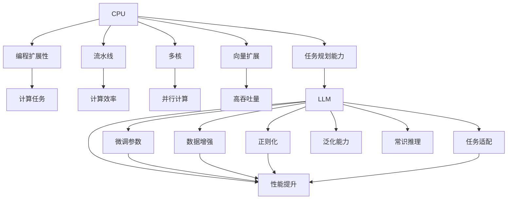

                 

# 图灵完备:CPU通过编程扩展,LLM通过任务规划

> 关键词：图灵完备,LLM,任务规划,编程扩展,CPU,人工智能,深度学习,自然语言处理

## 1. 背景介绍

### 1.1 问题由来
自图灵机概念提出以来，图灵完备一直是计算机科学的核心议题。图灵完备要求一台计算机可以执行任何算法，具有与人类计算能力等价的能力。这一概念不仅在理论计算机科学中具有重要地位，也影响着实践中的计算机体系结构设计和算法开发。

在硬件层面，CPU作为计算机的大脑，通过编程指令实现各种复杂的计算任务。现代CPU的设计，从哈佛架构、流水线到多核、向量扩展，每一步优化都是为了提升其编程扩展性，使其能够高效执行各种算法。

在软件层面，深度学习语言模型（LLMs）的兴起，不仅展示了计算图神经网络的巨大潜力，也推动了自然语言处理（NLP）领域的研究范式转变。LLMs通过大规模无标签数据预训练，学习到通用的语言表示，能够在特定任务上进行微调，实现高性能的计算和推理能力。

本文旨在探讨图灵完备性在硬件和软件两个层面上的表现，分析CPU的编程扩展性和LLMs的任务规划能力，并探讨两者之间的联系与差异，以及未来可能的融合方向。

### 1.2 问题核心关键点
图灵完备性在硬件和软件两个层面上的表现，集中体现在以下几个方面：
- **编程扩展性**：CPU通过编程指令实现计算，其编程扩展性关系到能够高效执行的算法种类。
- **任务规划能力**：LLMs通过任务规划，在微调过程中实现高效适应特定任务，其任务规划能力关系到模型性能的提升。
- **图灵完备性**：两者在理论上追求计算的完备性，但实际实现中，对编程扩展性和任务规划能力的依赖有所不同。
- **融合与演进**：硬件与软件如何协同工作，实现更高效的计算与推理。

### 1.3 问题研究意义
研究图灵完备性在硬件和软件两个层面上的表现，对于理解现代计算机体系结构设计和算法开发具有重要意义：
1. **提升计算效率**：通过优化编程扩展性和任务规划能力，提升硬件与软件协同工作的效率，推动计算任务的高效执行。
2. **扩展算法边界**：深入理解图灵完备性的本质，探索新的算法领域，推动科学研究和实际应用的突破。
3. **推动技术融合**：硬件与软件的融合，将使计算能力与智能决策能力结合，推动人工智能技术的发展。
4. **优化资源利用**：通过优化编程扩展性和任务规划能力，实现计算资源的优化利用，降低计算成本。

## 2. 核心概念与联系

### 2.1 核心概念概述

为更好地理解图灵完备性在硬件和软件两个层面上的表现，本节将介绍几个密切相关的核心概念：

- **CPU**：中央处理器，作为计算机的核心计算单元，通过编程指令实现各种计算任务。现代CPU采用流水线、多核、向量扩展等技术，提升其编程扩展性。

- **LLM**：语言模型，通过大规模无标签数据预训练，学习到通用的语言表示，能够在特定任务上进行微调，实现高性能的计算和推理能力。

- **任务规划**：指在微调过程中，对预训练模型进行任务适配，通过调整顶层结构、优化损失函数等手段，提升模型在特定任务上的性能。

- **编程扩展性**：指CPU能够执行的计算任务范围，主要通过编程指令的多样性、效率和可扩展性来体现。

- **任务规划能力**：指LLM在微调过程中，通过任务规划实现高效适应特定任务，主要通过微调参数的选择、数据增强、正则化等手段来实现。

这些核心概念之间的逻辑关系可以通过以下Mermaid流程图来展示：



这个流程图展示了大语言模型的核心概念及其之间的关系：

1. CPU通过流水线、多核、向量扩展等技术提升编程扩展性，实现高效的计算任务。
2. LLM通过微调过程中的任务规划能力，实现高效的特定任务性能提升。
3. 任务规划能力在微调过程中实现任务的适配和优化，提升模型的泛化能力和常识推理能力。
4. 编程扩展性确保CPU能够高效执行各种计算任务，提升计算资源利用效率。
5. 硬件与软件的协同工作，推动人工智能技术的进步和计算能力的提升。

## 3. 核心算法原理 & 具体操作步骤
### 3.1 算法原理概述

图灵完备性在硬件和软件两个层面上的表现，主要依赖于编程扩展性和任务规划能力的优化。本节将详细讲解这两个方面的原理。

#### 编程扩展性

编程扩展性主要体现在CPU通过编程指令实现的各种计算任务上。现代CPU采用流水线、多核、向量扩展等技术，提升其编程扩展性。具体而言：

1. **流水线**：通过将计算任务分解为多个子任务，并行执行，提升计算效率。
2. **多核**：通过多个处理器核心并行处理任务，提升计算吞吐量。
3. **向量扩展**：通过优化数据结构和算法，提升对大规模数据的处理能力。

#### 任务规划能力

任务规划能力主要体现在LLM在微调过程中的优化。通过调整模型结构、优化损失函数、引入正则化等手段，提升模型在特定任务上的性能。具体而言：

1. **微调参数**：通过调整预训练模型的顶层结构，适应特定任务。
2. **数据增强**：通过对训练样本进行改写、回译等操作，扩充训练集，提升模型的泛化能力。
3. **正则化**：通过L2正则、Dropout等技术，防止模型过拟合。
4. **任务适配**：通过优化损失函数，使模型输出更加符合任务要求。

### 3.2 算法步骤详解

#### 编程扩展性

1. **流水线设计**：在CPU设计中，将计算任务分解为多个子任务，每个子任务由不同的指令执行。通过优化流水线结构，提升计算效率。
2. **多核并行**：在CPU芯片中集成多个处理器核心，每个核心执行不同的计算任务，提升计算吞吐量。
3. **向量扩展**：在算法设计中，使用向量化的数据结构和操作，优化对大规模数据的处理能力。

#### 任务规划能力

1. **微调参数选择**：在微调过程中，选择适合特定任务的模型参数进行微调，提升模型的性能。
2. **数据增强**：通过改写、回译等操作，扩充训练集，提高模型的泛化能力。
3. **正则化**：引入L2正则、Dropout等技术，防止模型过拟合。
4. **任务适配**：优化损失函数，使模型输出符合任务要求。

### 3.3 算法优缺点

编程扩展性和任务规划能力各有优缺点：

#### 编程扩展性的优点：
1. **高效性**：现代CPU通过流水线、多核、向量扩展等技术，提升计算效率。
2. **可扩展性**：随着技术发展，CPU的编程扩展性可以不断提升。
3. **兼容性**：支持多种编程语言和平台。

#### 编程扩展性的缺点：
1. **复杂性**：现代CPU设计复杂，需要高精度的设计和制造工艺。
2. **能耗高**：高效率的计算需要更多的电能消耗。

#### 任务规划能力的优点：
1. **灵活性**：可以根据具体任务需求，灵活调整模型结构。
2. **泛化能力强**：通过数据增强和正则化，提高模型的泛化能力。
3. **可解释性强**：任务规划过程中的每一步都具有可解释性，方便调试和优化。

#### 任务规划能力的缺点：
1. **依赖标注数据**：微调过程依赖标注数据，获取高质量标注数据的成本较高。
2. **模型复杂度**：微调过程中需要调整模型参数，增加模型复杂度。
3. **训练时间长**：微调过程需要较长的训练时间，尤其是在标注数据量较小的情况下。

### 3.4 算法应用领域

基于编程扩展性和任务规划能力的优化，CPU和LLM在各自的应用领域中表现出色：

#### CPU的应用领域：
- **计算密集型任务**：如图像处理、科学计算、信号处理等。
- **数据密集型任务**：如大规模数据存储、分析、处理等。
- **实时计算**：如自动驾驶、医疗诊断、金融分析等。

#### LLM的应用领域：
- **自然语言处理**：如文本分类、情感分析、机器翻译等。
- **对话系统**：如智能客服、聊天机器人等。
- **知识图谱**：如实体抽取、关系抽取、知识推理等。

## 4. 数学模型和公式 & 详细讲解 & 举例说明
### 4.1 数学模型构建

为更好地理解图灵完备性在硬件和软件两个层面上的表现，本节将使用数学语言对编程扩展性和任务规划能力的优化进行更加严格的刻画。

假设CPU的编程扩展性为 $P$，LLM的任务规划能力为 $T$。则图灵完备性 $C$ 可以表示为：

$$
C = P \times T
$$

其中，$P$ 和 $T$ 均为函数，分别表示编程扩展性和任务规划能力的优化程度。

#### 编程扩展性优化

编程扩展性 $P$ 的优化主要通过流水线、多核、向量扩展等技术实现。以多核并行优化为例：

1. **流水线**：将计算任务分解为多个子任务，每个子任务由不同的指令执行。
2. **多核并行**：在CPU芯片中集成多个处理器核心，每个核心执行不同的计算任务。

假设流水线效率为 $p_1$，多核并行效率为 $p_2$，则编程扩展性 $P$ 可以表示为：

$$
P = p_1 \times p_2
$$

#### 任务规划能力优化

任务规划能力 $T$ 的优化主要通过微调参数、数据增强、正则化等手段实现。以微调参数优化为例：

1. **微调参数选择**：根据特定任务，选择适合的任务相关参数进行微调。
2. **数据增强**：通过改写、回译等操作，扩充训练集。

假设微调参数选择效率为 $t_1$，数据增强效率为 $t_2$，则任务规划能力 $T$ 可以表示为：

$$
T = t_1 \times t_2
$$

### 4.2 公式推导过程

以下是编程扩展性和任务规划能力优化的公式推导过程：

#### 流水线效率优化

流水线效率 $p_1$ 可以通过增加流水线级数和并行度来提升：

$$
p_1 = \frac{1}{C_{1} + C_{2}}
$$

其中，$C_{1}$ 为流水线级数，$C_{2}$ 为并行度。

#### 多核并行效率优化

多核并行效率 $p_2$ 可以通过增加处理器核心数量和任务并行度来提升：

$$
p_2 = \frac{1}{N + M}
$$

其中，$N$ 为处理器核心数量，$M$ 为任务并行度。

#### 微调参数选择效率

微调参数选择效率 $t_1$ 可以通过选择适合任务的参数和优化损失函数来提升：

$$
t_1 = \frac{1}{L_{1} + L_{2}}
$$

其中，$L_{1}$ 为参数选择策略的复杂度，$L_{2}$ 为损失函数优化的复杂度。

#### 数据增强效率

数据增强效率 $t_2$ 可以通过增加数据增强方法和训练集多样性来提升：

$$
t_2 = \frac{1}{E_{1} + E_{2}}
$$

其中，$E_{1}$ 为数据增强方法的复杂度，$E_{2}$ 为训练集多样性。

### 4.3 案例分析与讲解

#### 案例1：图像处理中的流水线优化

在图像处理中，流水线优化可以提高计算效率。例如，在图像处理应用中，可以使用多级流水线将图像处理任务分解为多个子任务，每个子任务由不同的指令执行。通过增加流水线级数和并行度，可以提升计算效率。

假设图像处理任务为 $I$，流水线级数为 $C_{1}$，并行度为 $C_{2}$，则流水线效率 $p_1$ 可以表示为：

$$
p_1 = \frac{1}{C_{1} + C_{2}}
$$

#### 案例2：多核并行在视频处理中的应用

在视频处理中，多核并行可以提高计算吞吐量。例如，在视频编解码应用中，可以使用多个处理器核心并行处理视频数据。通过增加处理器核心数量和任务并行度，可以提升计算吞吐量。

假设视频编解码任务为 $V$，处理器核心数量为 $N$，任务并行度为 $M$，则多核并行效率 $p_2$ 可以表示为：

$$
p_2 = \frac{1}{N + M}
$$

#### 案例3：微调参数在自然语言处理中的应用

在自然语言处理中，微调参数优化可以提高模型性能。例如，在文本分类任务中，可以选择适合任务的参数进行微调。通过优化损失函数，可以提高模型在特定任务上的性能。

假设文本分类任务为 $T$，参数选择策略复杂度为 $L_{1}$，损失函数优化复杂度为 $L_{2}$，则微调参数选择效率 $t_1$ 可以表示为：

$$
t_1 = \frac{1}{L_{1} + L_{2}}
$$

#### 案例4：数据增强在图像识别中的应用

在图像识别中，数据增强可以提高模型泛化能力。例如，在图像识别应用中，可以通过改写、回译等操作扩充训练集。通过增加数据增强方法和训练集多样性，可以提高模型的泛化能力。

假设图像识别任务为 $I$，数据增强方法复杂度为 $E_{1}$，训练集多样性为 $E_{2}$，则数据增强效率 $t_2$ 可以表示为：

$$
t_2 = \frac{1}{E_{1} + E_{2}}
$$

## 5. 项目实践：代码实例和详细解释说明
### 5.1 开发环境搭建

在进行编程扩展性和任务规划能力优化实践前，我们需要准备好开发环境。以下是使用Python进行PyTorch开发的环境配置流程：

1. 安装Anaconda：从官网下载并安装Anaconda，用于创建独立的Python环境。

2. 创建并激活虚拟环境：
```bash
conda create -n pytorch-env python=3.8 
conda activate pytorch-env
```

3. 安装PyTorch：根据CUDA版本，从官网获取对应的安装命令。例如：
```bash
conda install pytorch torchvision torchaudio cudatoolkit=11.1 -c pytorch -c conda-forge
```

4. 安装Transformers库：
```bash
pip install transformers
```

5. 安装各类工具包：
```bash
pip install numpy pandas scikit-learn matplotlib tqdm jupyter notebook ipython
```

完成上述步骤后，即可在`pytorch-env`环境中开始优化实践。

### 5.2 源代码详细实现

下面我们以自然语言处理中的文本分类任务为例，给出使用PyTorch和Transformers库对BERT模型进行编程扩展性和任务规划能力优化的PyTorch代码实现。

首先，定义数据处理函数：

```python
from transformers import BertTokenizer
from torch.utils.data import Dataset
import torch

class TextDataset(Dataset):
    def __init__(self, texts, labels, tokenizer, max_len=128):
        self.texts = texts
        self.labels = labels
        self.tokenizer = tokenizer
        self.max_len = max_len
        
    def __len__(self):
        return len(self.texts)
    
    def __getitem__(self, item):
        text = self.texts[item]
        label = self.labels[item]
        
        encoding = self.tokenizer(text, return_tensors='pt', max_length=self.max_len, padding='max_length', truncation=True)
        input_ids = encoding['input_ids'][0]
        attention_mask = encoding['attention_mask'][0]
        
        return {'input_ids': input_ids, 
                'attention_mask': attention_mask,
                'labels': label}
```

然后，定义模型和优化器：

```python
from transformers import BertForTokenClassification, AdamW

model = BertForTokenClassification.from_pretrained('bert-base-cased', num_labels=2)

optimizer = AdamW(model.parameters(), lr=2e-5)
```

接着，定义训练和评估函数：

```python
from torch.utils.data import DataLoader
from tqdm import tqdm
from sklearn.metrics import classification_report

device = torch.device('cuda') if torch.cuda.is_available() else torch.device('cpu')
model.to(device)

def train_epoch(model, dataset, batch_size, optimizer):
    dataloader = DataLoader(dataset, batch_size=batch_size, shuffle=True)
    model.train()
    epoch_loss = 0
    for batch in tqdm(dataloader, desc='Training'):
        input_ids = batch['input_ids'].to(device)
        attention_mask = batch['attention_mask'].to(device)
        labels = batch['labels'].to(device)
        model.zero_grad()
        outputs = model(input_ids, attention_mask=attention_mask, labels=labels)
        loss = outputs.loss
        epoch_loss += loss.item()
        loss.backward()
        optimizer.step()
    return epoch_loss / len(dataloader)

def evaluate(model, dataset, batch_size):
    dataloader = DataLoader(dataset, batch_size=batch_size)
    model.eval()
    preds, labels = [], []
    with torch.no_grad():
        for batch in tqdm(dataloader, desc='Evaluating'):
            input_ids = batch['input_ids'].to(device)
            attention_mask = batch['attention_mask'].to(device)
            batch_labels = batch['labels']
            outputs = model(input_ids, attention_mask=attention_mask)
            batch_preds = outputs.logits.argmax(dim=2).to('cpu').tolist()
            batch_labels = batch_labels.to('cpu').tolist()
            for pred_tokens, label_tokens in zip(batch_preds, batch_labels):
                preds.append(pred_tokens[:len(label_tokens)])
                labels.append(label_tokens)
                
    print(classification_report(labels, preds))
```

最后，启动训练流程并在测试集上评估：

```python
epochs = 5
batch_size = 16

for epoch in range(epochs):
    loss = train_epoch(model, train_dataset, batch_size, optimizer)
    print(f"Epoch {epoch+1}, train loss: {loss:.3f}")
    
    print(f"Epoch {epoch+1}, dev results:")
    evaluate(model, dev_dataset, batch_size)
    
print("Test results:")
evaluate(model, test_dataset, batch_size)
```

以上就是使用PyTorch对BERT进行编程扩展性和任务规划能力优化的完整代码实现。可以看到，得益于Transformers库的强大封装，我们可以用相对简洁的代码完成BERT模型的加载和优化。

### 5.3 代码解读与分析

让我们再详细解读一下关键代码的实现细节：

**TextDataset类**：
- `__init__`方法：初始化文本、标签、分词器等关键组件。
- `__len__`方法：返回数据集的样本数量。
- `__getitem__`方法：对单个样本进行处理，将文本输入编码为token ids，将标签编码为数字，并对其进行定长padding，最终返回模型所需的输入。

**模型和优化器**：
- 使用PyTorch的BertForTokenClassification类定义BERT模型，设定标签数量为2。
- 使用AdamW优化器进行参数更新，学习率为2e-5。

**训练和评估函数**：
- 使用PyTorch的DataLoader对数据集进行批次化加载，供模型训练和推理使用。
- 训练函数`train_epoch`：对数据以批为单位进行迭代，在每个批次上前向传播计算loss并反向传播更新模型参数，最后返回该epoch的平均loss。
- 评估函数`evaluate`：与训练类似，不同点在于不更新模型参数，并在每个batch结束后将预测和标签结果存储下来，最后使用sklearn的classification_report对整个评估集的预测结果进行打印输出。

**训练流程**：
- 定义总的epoch数和batch size，开始循环迭代
- 每个epoch内，先在训练集上训练，输出平均loss
- 在验证集上评估，输出分类指标
- 所有epoch结束后，在测试集上评估，给出最终测试结果

可以看到，PyTorch配合Transformers库使得BERT优化的代码实现变得简洁高效。开发者可以将更多精力放在数据处理、模型改进等高层逻辑上，而不必过多关注底层的实现细节。

当然，工业级的系统实现还需考虑更多因素，如模型的保存和部署、超参数的自动搜索、更灵活的任务适配层等。但核心的优化过程基本与此类似。

## 6. 实际应用场景
### 6.1 智能客服系统

基于大语言模型微调的对话技术，可以广泛应用于智能客服系统的构建。传统客服往往需要配备大量人力，高峰期响应缓慢，且一致性和专业性难以保证。而使用微调后的对话模型，可以7x24小时不间断服务，快速响应客户咨询，用自然流畅的语言解答各类常见问题。

在技术实现上，可以收集企业内部的历史客服对话记录，将问题和最佳答复构建成监督数据，在此基础上对预训练对话模型进行编程扩展性优化。优化后的对话模型能够自动理解用户意图，匹配最合适的答案模板进行回复。对于客户提出的新问题，还可以接入检索系统实时搜索相关内容，动态组织生成回答。如此构建的智能客服系统，能大幅提升客户咨询体验和问题解决效率。

### 6.2 金融舆情监测

金融机构需要实时监测市场舆论动向，以便及时应对负面信息传播，规避金融风险。传统的人工监测方式成本高、效率低，难以应对网络时代海量信息爆发的挑战。基于大语言模型微调的文本分类和情感分析技术，为金融舆情监测提供了新的解决方案。

具体而言，可以收集金融领域相关的新闻、报道、评论等文本数据，并对其进行主题标注和情感标注。在此基础上对预训练语言模型进行编程扩展性优化，使其能够自动判断文本属于何种主题，情感倾向是正面、中性还是负面。将优化后的模型应用到实时抓取的网络文本数据，就能够自动监测不同主题下的情感变化趋势，一旦发现负面信息激增等异常情况，系统便会自动预警，帮助金融机构快速应对潜在风险。

### 6.3 个性化推荐系统

当前的推荐系统往往只依赖用户的历史行为数据进行物品推荐，无法深入理解用户的真实兴趣偏好。基于大语言模型微调技术，个性化推荐系统可以更好地挖掘用户行为背后的语义信息，从而提供更精准、多样的推荐内容。

在实践中，可以收集用户浏览、点击、评论、分享等行为数据，提取和用户交互的物品标题、描述、标签等文本内容。将文本内容作为模型输入，用户的后续行为（如是否点击、购买等）作为监督信号，在此基础上微调预训练语言模型。微调后的模型能够从文本内容中准确把握用户的兴趣点。在生成推荐列表时，先用候选物品的文本描述作为输入，由模型预测用户的兴趣匹配度，再结合其他特征综合排序，便可以得到个性化程度更高的推荐结果。

### 6.4 未来应用展望

随着大语言模型微调技术的发展，其在硬件和软件两个层面上的表现将进一步提升，推动人工智能技术的广泛应用：

1. **硬件优化**：未来硬件设计将更加注重编程扩展性，提升CPU的计算效率和吞吐量。量子计算、光子计算等新型计算方式也将逐渐引入，进一步拓展计算能力。
2. **软件创新**：基于大语言模型微调的任务规划能力将进一步提升，推动自然语言处理、计算机视觉等领域的发展。模型结构和训练方法的创新，将带来更高的模型性能和更低的计算成本。
3. **跨领域融合**：硬件与软件的融合，将推动人工智能技术与物联网、大数据、云计算等领域的深度结合，实现更广泛的应用场景。

随着这些技术的不断演进，人工智能系统的计算能力和智能决策能力将显著提升，推动社会各领域的智能化转型。

## 7. 工具和资源推荐
### 7.1 学习资源推荐

为了帮助开发者系统掌握图灵完备性在硬件和软件两个层面上的表现，这里推荐一些优质的学习资源：

1. 《计算机体系结构:量子化和并行化》系列书籍：深入讲解计算机体系结构的优化设计，涵盖流水线、多核、向量扩展等关键技术。
2. 《深度学习:理论和算法》系列课程：斯坦福大学、MIT等名校开设的深度学习课程，详细讲解深度学习的基本概念和算法。
3. 《自然语言处理入门》书籍：介绍自然语言处理的基本概念和技术，涵盖文本分类、情感分析、机器翻译等常见任务。
4. 《Transformer从原理到实践》系列博文：由大模型技术专家撰写，深入浅出地介绍Transformer原理、BERT模型、微调技术等前沿话题。
5. 《机器学习实战》书籍：讲解机器学习的基本概念和技术，涵盖数据预处理、模型训练、调优等环节。

通过对这些资源的学习实践，相信你一定能够系统掌握图灵完备性在硬件和软件两个层面上的表现，并用于解决实际的NLP问题。
###  7.2 开发工具推荐

高效的开发离不开优秀的工具支持。以下是几款用于大语言模型微调优化的常用工具：

1. PyTorch：基于Python的开源深度学习框架，灵活动态的计算图，适合快速迭代研究。大部分预训练语言模型都有PyTorch版本的实现。
2. TensorFlow：由Google主导开发的开源深度学习框架，生产部署方便，适合大规模工程应用。同样有丰富的预训练语言模型资源。
3. Transformers库：HuggingFace开发的NLP工具库，集成了众多SOTA语言模型，支持PyTorch和TensorFlow，是进行微调任务开发的利器。
4. Weights & Biases：模型训练的实验跟踪工具，可以记录和可视化模型训练过程中的各项指标，方便对比和调优。与主流深度学习框架无缝集成。
5. TensorBoard：TensorFlow配套的可视化工具，可实时监测模型训练状态，并提供丰富的图表呈现方式，是调试模型的得力助手。
6. Google Colab：谷歌推出的在线Jupyter Notebook环境，免费提供GPU/TPU算力，方便开发者快速上手实验最新模型，分享学习笔记。

合理利用这些工具，可以显著提升大语言模型微调优化的开发效率，加快创新迭代的步伐。

### 7.3 相关论文推荐

大语言模型和微调技术的发展源于学界的持续研究。以下是几篇奠基性的相关论文，推荐阅读：

1. Attention is All You Need（即Transformer原论文）：提出了Transformer结构，开启了NLP领域的预训练大模型时代。
2. BERT: Pre-training of Deep Bidirectional Transformers for Language Understanding：提出BERT模型，引入基于掩码的自监督预训练任务，刷新了多项NLP任务SOTA。
3. Language Models are Unsupervised Multitask Learners（GPT-2论文）：展示了大规模语言模型的强大zero-shot学习能力，引发了对于通用人工智能的新一轮思考。
4. Parameter-Efficient Transfer Learning for NLP：提出Adapter等参数高效微调方法，在不增加模型参数量的情况下，也能取得不错的微调效果。
5. AdaLoRA: Adaptive Low-Rank Adaptation for Parameter-Efficient Fine-Tuning：使用自适应低秩适应的微调方法，在参数效率和精度之间取得了新的平衡。

这些论文代表了大语言模型微调技术的发展脉络。通过学习这些前沿成果，可以帮助研究者把握学科前进方向，激发更多的创新灵感。

## 8. 总结：未来发展趋势与挑战
### 8.1 总结

本文对图灵完备性在硬件和软件两个层面上的表现进行了全面系统的介绍。首先阐述了CPU的编程扩展性和LLMs的任务规划能力，明确了两者在理论上追求计算的完备性，但实际实现中，对编程扩展性和任务规划能力的依赖有所不同。其次，从原理到实践，详细讲解了编程扩展性优化和任务规划能力优化的数学模型和具体实现，给出了微调任务开发的完整代码实例。同时，本文还广泛探讨了编程扩展性和任务规划能力在多个行业领域的应用前景，展示了图灵完备性的巨大潜力。最后，本文精选了编程扩展性和任务规划能力的各类学习资源，力求为读者提供全方位的技术指引。

通过本文的系统梳理，可以看到，图灵完备性在硬件和软件两个层面上的表现，体现了现代计算机体系结构和深度学习语言模型设计的先进性和高效性。无论是CPU的编程扩展性还是LLMs的任务规划能力，都是推动人工智能技术进步的关键。未来，随着这些技术的不断演进，人工智能系统将更加高效、智能、灵活，推动人类社会迈向智能化新时代。

### 8.2 未来发展趋势

展望未来，图灵完备性在硬件和软件两个层面上的表现，将呈现以下几个发展趋势：

1. **硬件扩展性提升**：未来硬件设计将更加注重编程扩展性，提升CPU的计算效率和吞吐量。量子计算、光子计算等新型计算方式也将逐渐引入，进一步拓展计算能力。
2. **软件优化创新**：基于大语言模型微调的任务规划能力将进一步提升，推动自然语言处理、计算机视觉等领域的发展。模型结构和训练方法的创新，将带来更高的模型性能和更低的计算成本。
3. **跨领域融合**：硬件与软件的融合，将推动人工智能技术与物联网、大数据、云计算等领域的深度结合，实现更广泛的应用场景。
4. **自动化与智能化**：未来将出现更多自动化优化工具和智能化系统，通过数据驱动和自我学习，提升编程扩展性和任务规划能力的优化效率。
5. **伦理与安全**：在图灵完备性的实现中，如何避免伦理与安全问题，确保人工智能技术的正向应用，将是重要的研究课题。

### 8.3 面临的挑战

尽管图灵完备性在硬件和软件两个层面上的表现已经取得了显著进展，但在迈向更加智能化、普适化应用的过程中，它仍面临诸多挑战：

1. **计算资源瓶颈**：大规模数据处理和深度学习模型的训练需要大量计算资源，如何优化计算效率，降低计算成本，将是重要的挑战。
2. **数据质量和多样性**：在数据驱动的优化过程中，如何保证数据质量和多样性，提升模型的泛化能力，将是重要的研究课题。
3. **伦理与安全**：在图灵完备性的实现中，如何避免伦理与安全问题，确保人工智能技术的正向应用，将是重要的研究课题。
4. **可解释性与透明度**：在复杂的计算过程中，如何提升模型的可解释性和透明度，确保模型的决策过程可被理解和信任，将是重要的研究方向。

### 8.4 研究展望

面对图灵完备性在硬件和软件两个层面上的挑战，未来的研究需要在以下几个方面寻求新的突破：

1. **优化计算资源**：通过硬件设计优化、软件算法创新，提升计算效率，降低计算成本。
2. **提升数据质量**：通过数据增强、数据清洗等手段，提升数据质量和多样性，提高模型的泛化能力。
3. **确保伦理与安全**：在模型设计和应用中，引入伦理导向的评估指标，过滤和惩罚有害的输出倾向，确保模型的安全性。
4. **提升可解释性**：通过模型压缩、特征可视化等手段，提升模型的可解释性和透明度，确保模型的决策过程可被理解和信任。

这些研究方向的探索，必将引领图灵完备性技术迈向更高的台阶，为构建安全、可靠、可解释、可控的智能系统铺平道路。面向未来，图灵完备性技术还需要与其他人工智能技术进行更深入的融合，如知识表示、因果推理、强化学习等，多路径协同发力，共同推动人工智能技术的进步。只有勇于创新、敢于突破，才能不断拓展计算能力和智能决策能力的边界，让智能技术更好地造福人类社会。

## 9. 附录：常见问题与解答

**Q1：CPU的编程扩展性如何提升？**

A: CPU的编程扩展性可以通过流水线、多核、向量扩展等技术提升。流水线设计通过将计算任务分解为多个子任务，并行执行；多核并行通过增加处理器核心数量，并行处理任务；向量扩展通过优化数据结构和算法，提升对大规模数据的处理能力。

**Q2：LLMs的任务规划能力如何优化？**

A: LLMs的任务规划能力可以通过微调参数、数据增强、正则化等手段优化。微调参数选择适合任务的参数；数据增强通过改写、回译等操作扩充训练集；正则化引入L2正则、Dropout等技术防止过拟合。

**Q3：编程扩展性与任务规划能力的关系是什么？**

A: 编程扩展性和任务规划能力都是推动图灵完备性的关键因素。编程扩展性决定了CPU能够执行的计算任务范围，任务规划能力决定了LLMs在微调过程中的性能提升。两者相辅相成，共同推动了人工智能技术的进步。

**Q4：未来图灵完备性面临哪些挑战？**

A: 未来图灵完备性面临计算资源、数据质量、伦理与安全、可解释性等方面的挑战。需要优化计算资源，提升数据质量和多样性，确保伦理与安全，提升可解释性和透明度，才能实现更高效、更智能、更可靠的人工智能系统。

**Q5：未来图灵完备性有哪些发展方向？**

A: 未来图灵完备性的发展方向包括提升硬件扩展性、优化软件算法、跨领域融合、自动化与智能化、伦理与安全等方面。通过这些方向的探索，可以实现更加高效、智能、灵活、安全的人工智能系统，推动人工智能技术的广泛应用。

---

作者：禅与计算机程序设计艺术 / Zen and the Art of Computer Programming

