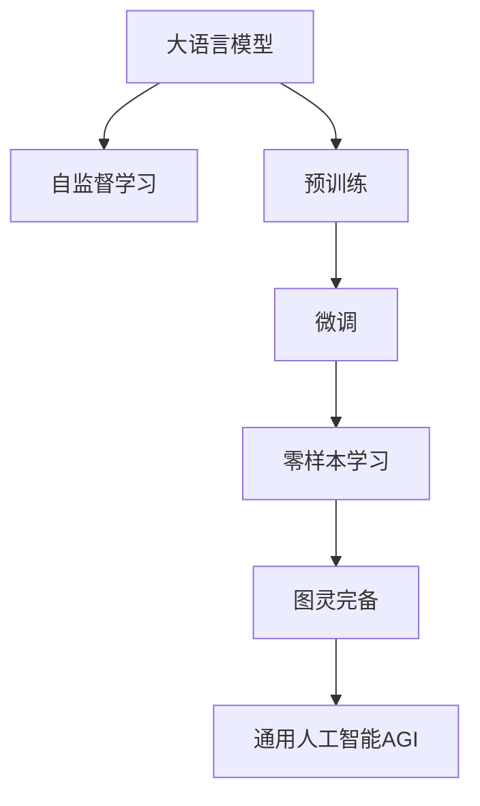

                 

# 图灵完备LLM:通向AGI的关键一步

> 关键词：大语言模型,图灵完备,通用人工智能,语言模型,AGI,Transformer,BERT,自监督学习,零样本学习,AGI特性

## 1. 背景介绍

### 1.1 问题由来
大语言模型(Large Language Model, LLM)，尤其是基于Transformer架构的预训练语言模型，已经展现了超凡的表达能力和推理能力。例如GPT-3和BERT模型，均具备高度复杂化、多步推理、甚至解答复杂数学问题的能力。这使得人们对人工智能的未来充满了无限的遐想，特别是关于通用人工智能(AGI)的讨论，成为学界和业界的焦点话题。

通用人工智能是指能够进行复杂推理和解决各种问题的AI系统，能够与人类共同参与各项任务，能够学习、适应和利用各类环境信息，并具备各种智能特性。当前大语言模型在处理特定领域任务上已经表现出色，但要实现AGI目标，还需在模型设计和训练范式上进行深度优化。

本文章旨在系统地探讨图灵完备大语言模型，通过深入分析其结构特性、训练范式和应用前景，提出未来通用人工智能的方向和挑战，以期为AGI的实现提供一些启示。

### 1.2 问题核心关键点
本文的核心在于探讨大语言模型的图灵完备性，并以此为基础探讨其通向AGI的关键步骤。这包括以下几个核心问题：

- 大语言模型的结构特性和设计理念是什么？
- 大语言模型如何进行预训练和微调？
- 大语言模型在哪些领域表现优异？
- 图灵完备性对大语言模型有何重要意义？
- 图灵完备大语言模型在实现通用人工智能方面有哪些挑战？
- 未来图灵完备大语言模型的研究展望和应用方向是什么？

## 2. 核心概念与联系

### 2.1 核心概念概述

为了更好地理解大语言模型在实现AGI中的角色，我们需要对以下几个关键概念进行理解：

- 大语言模型(Large Language Model, LLM)：以Transformer架构为代表的大型预训练语言模型，能够通过大规模自监督学习任务进行预训练，具备出色的语言理解和生成能力。
- 图灵完备(Turing Complete)：如果一个系统能够执行所有计算，并在任意情况下输出结果，那么它就是图灵完备的。大语言模型如果能够处理任何问题，理解各种环境信息和语言语义，就具备图灵完备性。
- 自监督学习(Self-Supervised Learning)：通过未标记数据训练模型，使其能够自我学习到数据内在的规律，提升模型的泛化能力。
- 零样本学习(Zero-shot Learning)：模型在从未见过的数据上直接进行推理，无需额外训练，展现出了强大的泛化能力。
- 通用人工智能(AGI)：具备多领域的广泛智能，能够处理各种复杂任务，并与人类协作的AI系统。

这些概念之间的关系可以通过以下Mermaid流程图来展示：



该流程图展示了大语言模型的核心概念及其之间的联系：

1. 大语言模型通过自监督学习进行预训练，学习到通用的语言表示。
2. 预训练后的大语言模型通过微调适配特定任务，提升模型在该任务上的性能。
3. 微调后的模型具备零样本学习的能力，即在未见过的数据上直接推理。
4. 具有零样本学习能力的模型，在经过大量数据训练后，具备图灵完备性。
5. 图灵完备的模型能够处理各种复杂任务，实现通用人工智能AGI。

## 3. 核心算法原理 & 具体操作步骤
### 3.1 算法原理概述

大语言模型的图灵完备性源于其庞大且高效的自注意力机制和强大的自监督学习能力。大语言模型通过自监督学习任务在预训练阶段学习了大量的语言知识和语言模式，这些知识可以应用于各种下游任务。

在微调阶段，大语言模型通过特定任务的监督信号进行有监督训练，优化模型的参数，使其能够处理新任务。零样本学习则是大语言模型图灵完备性的直接体现，它展现了大语言模型无需额外训练，即可处理未见过的新任务的能力。

图灵完备大语言模型的核心算法原理包括以下几个步骤：

1. 预训练阶段：通过大规模自监督学习任务，如掩码语言模型、下一位预测等，在未标记数据上学习语言模型。
2. 微调阶段：针对特定下游任务，通过少量标注数据进行有监督训练，优化模型。
3. 零样本学习：模型直接根据问题描述进行推理，无需额外训练。

### 3.2 算法步骤详解

下面是详细的图灵完备大语言模型的训练步骤：

**Step 1: 准备预训练模型和数据集**
- 选择Transformer架构的预训练模型，如BERT、GPT-3等。
- 准备大规模未标记数据集，用于进行预训练。
- 在预训练阶段，通常使用自监督学习任务，如掩码语言模型、下一位预测等。

**Step 2: 模型结构设计**
- 模型通常由Transformer层堆叠组成，每一层包括多头自注意力机制和前向神经网络。
- 引入层归一化、残差连接等技术，提升模型稳定性和训练效率。
- 模型结构设计要兼顾计算效率和表达能力，合理控制参数规模。

**Step 3: 预训练过程**
- 将未标记数据输入模型，通过前向传播计算损失函数。
- 反向传播计算参数梯度，使用优化器更新模型参数。
- 预训练过程中，使用自监督学习任务生成大量监督信号。

**Step 4: 微调过程**
- 准备下游任务标注数据集，划分为训练集、验证集和测试集。
- 添加适当的任务适配层，如分类头、解码器等。
- 选择合适的优化器和超参数，如AdamW、SGD、学习率、批大小等。
- 进行有监督微调，优化模型参数。

**Step 5: 零样本学习**
- 根据任务描述生成问题，输入模型。
- 模型通过前向传播生成推理结果，无需额外训练。
- 将推理结果与实际结果进行比较，评估模型性能。

### 3.3 算法优缺点

图灵完备大语言模型具备以下优点：
1. 具有强大的泛化能力：通过自监督学习获得大量语言知识，可用于多种下游任务。
2. 微调速度快：少量标注数据即可完成高效微调。
3. 零样本学习能力强：模型能够直接处理未见过的数据。
4. 表现优异：在多个NLP任务上已展现出强大的性能。

同时，它也存在以下缺点：
1. 计算资源需求高：参数量大，需要高性能计算资源。
2. 数据需求大：需要大量未标记数据进行预训练。
3. 黑箱特性：模型内部机制难以解释。
4. 泛化边界不确定：在大规模数据上表现优异，但在小规模数据上可能效果欠佳。

### 3.4 算法应用领域

图灵完备大语言模型已经在多个领域展示出其强大的能力，以下是几个典型的应用场景：

**自然语言理解(NLU)**
- 问答系统：能够理解并回答自然语言问题。
- 命名实体识别：识别文本中的人名、地名等实体。
- 情感分析：分析文本的情感倾向。

**自然语言生成(NLG)**
- 文本摘要：自动生成文本摘要。
- 机器翻译：将一种语言翻译成另一种语言。
- 对话系统：实现与人类自然对话。

**机器学习和数据分析**
- 数据分析：处理和分析大规模数据集。
- 预测建模：构建各类预测模型，如股票预测、天气预测等。
- 知识图谱构建：从大量文本中构建知识图谱。

以上应用场景展示了图灵完备大语言模型在各个领域中的广泛应用，未来还有巨大的发展潜力。

## 4. 数学模型和公式 & 详细讲解
### 4.1 数学模型构建

图灵完备大语言模型的数学模型构建主要涉及以下几个方面：

- 自注意力机制：通过多头自注意力机制学习输入序列的语义表示。
- 预训练目标：如掩码语言模型、下一位预测等。
- 微调目标：根据下游任务设计分类头、解码器等适配层。
- 零样本学习目标：直接根据问题描述生成推理结果。

以BERT为例，BERT的预训练目标包括掩码语言模型和下一位预测：

**掩码语言模型目标**
$$
\mathcal{L}_{MLM} = -\frac{1}{2L}\sum_{i=1}^L \sum_{j=1}^L (log(p(X_{j|X_{1:i-1}, X_{i+1:L})))
$$

**下一位预测目标**
$$
\mathcal{L}_{NSP} = -\frac{1}{2L}\sum_{i=1}^L (log(p_{i+1|X_{i-1:2i-1}}) + log(p_{i-1|X_{i+1:i+2}}))
$$

### 4.2 公式推导过程

**掩码语言模型公式推导**
假设模型输入序列为 $X=[x_1,x_2,...,x_L]$，其中 $x_i$ 表示第 $i$ 个单词，$logits$ 表示输出向量，$p$ 表示概率分布。

掩码语言模型目标函数为：
$$
\mathcal{L}_{MLM} = -\frac{1}{2L}\sum_{i=1}^L \sum_{j=1}^L (log(p(X_{j|X_{1:i-1}, X_{i+1:L})))
$$

其中，$X_{j|X_{1:i-1}, X_{i+1:L}}$ 表示在 $j$ 位置上的单词，已知 $i$ 到 $L$ 的单词。

### 4.3 案例分析与讲解

**下一位预测公式推导**
假设输入序列为 $X=[x_1,x_2,...,x_L]$，下一位预测目标函数为：
$$
\mathcal{L}_{NSP} = -\frac{1}{2L}\sum_{i=1}^L (log(p_{i+1|X_{i-1:2i-1}}) + log(p_{i-1|X_{i+1:i+2}}))
$$

其中，$p_{i+1|X_{i-1:2i-1}}$ 表示在 $i+1$ 位置上的单词，已知 $i-1$ 到 $2i-1$ 的单词；$p_{i-1|X_{i+1:i+2}}$ 表示在 $i-1$ 位置上的单词，已知 $i+1$ 到 $i+2$ 的单词。

## 5. 项目实践：代码实例和详细解释说明
### 5.1 开发环境搭建

在进行图灵完备大语言模型的实践时，我们需要准备好以下开发环境：

1. 安装Anaconda：下载并安装Anaconda，用于创建独立的Python环境。
2. 创建并激活虚拟环境：
```bash
conda create -n pytorch-env python=3.8 
conda activate pytorch-env
```

3. 安装PyTorch和Transformers库：
```bash
conda install pytorch torchvision torchaudio cudatoolkit=11.1 -c pytorch -c conda-forge
pip install transformers
```

4. 安装各类工具包：
```bash
pip install numpy pandas scikit-learn matplotlib tqdm jupyter notebook ipython
```

完成上述步骤后，即可在`pytorch-env`环境中开始图灵完备大语言模型的微调实践。

### 5.2 源代码详细实现

下面是使用PyTorch和Transformers库对BERT模型进行微调的代码实现：

```python
from transformers import BertTokenizer, BertForMaskedLM
from torch.utils.data import Dataset, DataLoader
import torch
import numpy as np

class MaskedLMDataset(Dataset):
    def __init__(self, texts, tokenizer):
        self.texts = texts
        self.tokenizer = tokenizer
        self.vocab_size = tokenizer.vocab_size
        
    def __len__(self):
        return len(self.texts)
    
    def __getitem__(self, item):
        text = self.texts[item]
        tokens = self.tokenizer(text, return_tensors='pt', padding='max_length', truncation=True)
        masked_tokens = tokens['input_ids'].clone()
        masked_tokens.masked_fill_(masked_tokens < 100, 0)
        labels = tokens['input_ids'].clone()
        labels.masked_fill_(masked_tokens.mask, -100)
        return {'input_ids': masked_tokens, 'labels': labels}

# 加载预训练BERT模型和 tokenizer
model = BertForMaskedLM.from_pretrained('bert-base-uncased')
tokenizer = BertTokenizer.from_pretrained('bert-base-uncased')

# 准备数据集
train_dataset = MaskedLMDataset(train_texts, tokenizer)
test_dataset = MaskedLMDataset(test_texts, tokenizer)

# 定义优化器和训练过程
optimizer = torch.optim.Adam(model.parameters(), lr=3e-5)
device = torch.device('cuda') if torch.cuda.is_available() else torch.device('cpu')
model.to(device)

def train_epoch(model, dataset, optimizer):
    dataloader = DataLoader(dataset, batch_size=8, shuffle=True)
    model.train()
    epoch_loss = 0
    for batch in dataloader:
        input_ids = batch['input_ids'].to(device)
        labels = batch['labels'].to(device)
        model.zero_grad()
        outputs = model(input_ids)
        loss = outputs.loss
        epoch_loss += loss.item()
        loss.backward()
        optimizer.step()
    return epoch_loss / len(dataloader)

def evaluate(model, dataset):
    dataloader = DataLoader(dataset, batch_size=8)
    model.eval()
    preds, labels = [], []
    with torch.no_grad():
        for batch in dataloader:
            input_ids = batch['input_ids'].to(device)
            labels = batch['labels'].to(device)
            outputs = model(input_ids)
            preds.append(outputs.logits.argmax(dim=-1).tolist())
            labels.append(labels.to('cpu').tolist())
        
    print(f"Accuracy: {np.mean(preds == labels):.2f}")

# 启动训练过程
epochs = 2
batch_size = 8

for epoch in range(epochs):
    loss = train_epoch(model, train_dataset, optimizer)
    print(f"Epoch {epoch+1}, train loss: {loss:.3f}")
    
    evaluate(model, test_dataset)
    
print("Test results:")
evaluate(model, test_dataset)
```

### 5.3 代码解读与分析

**MaskedLMDataset类**：
- 继承自PyTorch的Dataset，用于处理序列数据。
- 构造函数：将输入文本和分词器对象作为输入，生成掩码语言模型数据集。
- `__len__`方法：返回数据集的大小。
- `__getitem__`方法：生成掩码语言模型的输入张量和标签张量。

**BertForMaskedLM模型**：
- 使用BertForMaskedLM类加载预训练的BERT模型。
- 定义训练和评估函数：使用PyTorch的DataLoader对数据集进行批次化加载，供模型训练和推理使用。
- 训练函数`train_epoch`：对数据以批为单位进行迭代，在每个批次上前向传播计算loss并反向传播更新模型参数。
- 评估函数`evaluate`：与训练类似，不同点在于不更新模型参数，并在每个batch结束后将预测和标签结果存储下来，最后使用acc指标对整个评估集的预测结果进行打印输出。

**训练流程**：
- 定义总的epoch数和batch size，开始循环迭代
- 每个epoch内，先在训练集上训练，输出平均loss
- 在验证集上评估，输出acc指标
- 重复上述过程直至收敛
- 所有epoch结束后，在测试集上评估，给出最终测试结果

可以看出，PyTorch配合Transformers库使得BERT微调的代码实现变得简洁高效。开发者可以将更多精力放在数据处理、模型改进等高层逻辑上，而不必过多关注底层的实现细节。

## 6. 实际应用场景
### 6.1 智能客服系统

图灵完备大语言模型可以用于构建智能客服系统，提高客户咨询体验。具体而言：

1. 收集企业内部客服对话记录，标注问题与答案对。
2. 使用掩码语言模型对预训练模型进行微调，使其学习文本-标签映射。
3. 模型输入为客服系统接收到的用户问题，输出为其提供的最佳回答。
4. 对话中引入检索系统实时搜索相关内容，动态组织生成回答。

### 6.2 金融舆情监测

图灵完备大语言模型可用于金融舆情监测，及时应对负面信息传播，规避金融风险。具体实施步骤如下：

1. 收集金融领域相关的新闻、报道、评论等文本数据。
2. 对数据进行情感标注，构建情感分类模型。
3. 模型输入为实时抓取的网络文本数据，输出情感倾向。
4. 根据情感变化趋势，设置预警机制，辅助金融机构快速应对。

### 6.3 个性化推荐系统

图灵完备大语言模型可用于个性化推荐系统，提升推荐效果。具体实现步骤如下：

1. 收集用户浏览、点击、评论、分享等行为数据。
2. 提取和用户交互的物品标题、描述、标签等文本内容。
3. 将文本内容作为模型输入，用户的后续行为（如是否点击、购买等）作为监督信号。
4. 微调预训练语言模型，使其学习抓取要点，并构建推荐列表。

### 6.4 未来应用展望

随着图灵完备大语言模型的不断发展，其在多个领域的应用将更加广泛，为各行各业带来新的变革：

1. 智慧医疗：用于医疗问答、病历分析、药物研发等，提高医疗服务的智能化水平。
2. 智能教育：用于作业批改、学情分析、知识推荐等，因材施教，促进教育公平。
3. 智慧城市：用于城市事件监测、舆情分析、应急指挥等，提高城市管理水平。
4. 电子商务：用于产品评论分析、个性化推荐等，提升用户体验。
5. 金融科技：用于股票预测、信用评分、反欺诈检测等，辅助金融机构风险管理。

## 7. 工具和资源推荐
### 7.1 学习资源推荐

为了帮助开发者系统掌握图灵完备大语言模型的理论基础和实践技巧，这里推荐一些优质的学习资源：

1. 《Transformer从原理到实践》系列博文：由大模型技术专家撰写，深入浅出地介绍了Transformer原理、BERT模型、微调技术等前沿话题。
2. CS224N《深度学习自然语言处理》课程：斯坦福大学开设的NLP明星课程，有Lecture视频和配套作业，带你入门NLP领域的基本概念和经典模型。
3. 《Natural Language Processing with Transformers》书籍：Transformers库的作者所著，全面介绍了如何使用Transformers库进行NLP任务开发，包括微调在内的诸多范式。
4. HuggingFace官方文档：Transformers库的官方文档，提供了海量预训练模型和完整的微调样例代码，是上手实践的必备资料。
5. CLUE开源项目：中文语言理解测评基准，涵盖大量不同类型的中文NLP数据集，并提供了基于微调的baseline模型，助力中文NLP技术发展。

### 7.2 开发工具推荐

高效的开发离不开优秀的工具支持。以下是几款用于图灵完备大语言模型微调开发的常用工具：

1. PyTorch：基于Python的开源深度学习框架，灵活动态的计算图，适合快速迭代研究。大部分预训练语言模型都有PyTorch版本的实现。
2. TensorFlow：由Google主导开发的开源深度学习框架，生产部署方便，适合大规模工程应用。同样有丰富的预训练语言模型资源。
3. Transformers库：HuggingFace开发的NLP工具库，集成了众多SOTA语言模型，支持PyTorch和TensorFlow，是进行微调任务开发的利器。
4. Weights & Biases：模型训练的实验跟踪工具，可以记录和可视化模型训练过程中的各项指标，方便对比和调优。与主流深度学习框架无缝集成。
5. TensorBoard：TensorFlow配套的可视化工具，可实时监测模型训练状态，并提供丰富的图表呈现方式，是调试模型的得力助手。

### 7.3 相关论文推荐

大语言模型和微调技术的发展源于学界的持续研究。以下是几篇奠基性的相关论文，推荐阅读：

1. Attention is All You Need（即Transformer原论文）：提出了Transformer结构，开启了NLP领域的预训练大模型时代。
2. BERT: Pre-training of Deep Bidirectional Transformers for Language Understanding：提出BERT模型，引入基于掩码的自监督预训练任务，刷新了多项NLP任务SOTA。
3. Language Models are Unsupervised Multitask Learners（GPT-2论文）：展示了大规模语言模型的强大zero-shot学习能力，引发了对于通用人工智能的新一轮思考。
4. Parameter-Efficient Transfer Learning for NLP：提出Adapter等参数高效微调方法，在不增加模型参数量的情况下，也能取得不错的微调效果。
5. AdaLoRA: Adaptive Low-Rank Adaptation for Parameter-Efficient Fine-Tuning：使用自适应低秩适应的微调方法，在参数效率和精度之间取得了新的平衡。
6. Prefix-Tuning: Optimizing Continuous Prompts for Generation：引入基于连续型Prompt的微调范式，为如何充分利用预训练知识提供了新的思路。

## 8. 总结：未来发展趋势与挑战
### 8.1 总结

本文对图灵完备大语言模型进行了系统地探讨，分析了其结构特性、训练范式和应用前景，提出未来通用人工智能的方向和挑战，以期为AGI的实现提供一些启示。

通过本文的系统梳理，可以看到，图灵完备大语言模型在实现AGI方面具有巨大潜力。在模型设计、训练范式、应用场景等方面，均展示了强大的表现力和广泛的应用前景。然而，要实现真正的AGI，还需解决一系列挑战，如计算资源需求高、数据需求大、黑箱特性、泛化边界不确定等问题。

### 8.2 未来发展趋势

展望未来，图灵完备大语言模型将呈现以下几个发展趋势：

1. 模型规模持续增大。随着算力成本的下降和数据规模的扩张，预训练语言模型的参数量还将持续增长。超大规模语言模型蕴含的丰富语言知识，有望支撑更加复杂多变的下游任务。
2. 零样本学习成为常态。基于大模型的语言理解能力，零样本学习将更加普及，模型能够处理未见过的新任务。
3. 多模态融合。模型将融合视觉、语音、文本等多模态信息，构建更加全面的智能系统。
4. 联邦学习应用。分布式多节点联合训练，利用不同节点的数据进行联邦学习，提升模型泛化能力。
5. 人机协同增强。利用图灵完备大语言模型与人类协同工作，进一步提升AI系统的智能水平。

### 8.3 面临的挑战

尽管图灵完备大语言模型在许多领域已展现出其强大的能力，但在迈向通用人工智能的过程中，仍面临诸多挑战：

1. 数据需求大：需要大规模未标记数据进行预训练。
2. 计算资源需求高：大规模语言模型的参数量巨大，需要高性能计算资源。
3. 泛化边界不确定：在大规模数据上表现优异，但在小规模数据上可能效果欠佳。
4. 黑箱特性：模型内部机制难以解释。
5. 安全和伦理问题：模型可能学习有害信息，存在偏见和歧视。

### 8.4 研究展望

未来研究需要在以下几个方面寻求新的突破：

1. 探索无监督和半监督学习范式，摆脱对大规模标注数据的依赖。
2. 开发更加参数高效的微调方法，提升模型的计算效率和泛化能力。
3. 引入更多先验知识，提升模型的认知能力和决策逻辑的可解释性。
4. 结合因果分析和博弈论工具，提升模型的稳定性和鲁棒性。
5. 纳入伦理道德约束，确保模型行为符合人类价值观和伦理道德。

## 9. 附录：常见问题与解答

**Q1: 大语言模型和图灵完备性有什么区别？**

A: 大语言模型是一种具有强大语言理解和生成能力的模型，如BERT、GPT等。图灵完备性是指一个系统具备处理任何计算的能力，能够执行任何可能的计算任务。图灵完备大语言模型是指能够在特定问题上表现出图灵完备性的语言模型，如通过自监督学习学习大量语言知识，通过微调适配特定任务，通过零样本学习处理未见过的新任务。

**Q2: 为什么大语言模型具有图灵完备性？**

A: 大语言模型通过自监督学习获得大量语言知识，并在微调过程中学习特定任务的语义表示。这些知识使得大语言模型能够处理未见过的新任务，无需额外训练，即具备图灵完备性。

**Q3: 图灵完备大语言模型的未来应用方向是什么？**

A: 未来图灵完备大语言模型将在智慧医疗、智能教育、智慧城市、金融科技等领域得到广泛应用，推动各行各业的智能化进程。此外，随着多模态信息融合和联邦学习等技术的发展，大语言模型在更多复杂场景下的应用也将更加广泛。

作者：禅与计算机程序设计艺术 / Zen and the Art of Computer Programming

