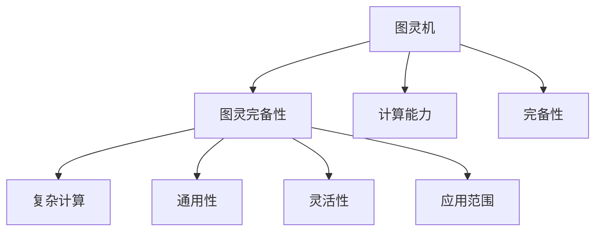

                 

## 1. 背景介绍

图灵完备性（Turing completeness）是计算机科学中一个核心概念，它描述了任何计算系统是否能够执行图灵机所能执行的所有计算。简单来说，如果一个系统具备图灵完备性，它就可以模拟任意复杂的算法和计算任务，而无需预先被设计为特定的用途。这一概念由英国数学家图灵在1936年提出，至今仍被视为计算机科学的基础之一。

图灵完备性不仅对理论计算机科学具有重要意义，而且在实践中也具有广泛的应用价值。它帮助我们理解计算机系统能力的边界，指导我们设计和开发各种软件和硬件系统，使其具有足够的灵活性和通用性。同时，图灵完备性也成为了评估现代计算平台（如CPU、GPU、TPU等）性能的重要标准，影响了计算机体系结构、操作系统、编程语言等多方面的设计和发展。

## 2. 核心概念与联系

### 2.1 核心概念概述

要理解图灵完备性，我们首先需要了解一些相关概念：

- **图灵机（Turing Machine）**：由图灵提出的一种抽象计算模型，是计算理论中的基本单位。图灵机可以执行一系列简单的操作，如读写符号、跳转指针等，以此来执行任意计算。

- **计算能力**：描述一个系统能够执行的计算任务的复杂度，包括是否能够处理递归、是否能够模拟任意复杂的算法等。

- **完备性（Completeness）**：一个系统如果能够处理任何合法的输入，并且其处理过程是确定性的，那么这个系统就是完备的。

### 2.2 核心概念原理和架构的 Mermaid 流程图



该图展示了图灵机、图灵完备性、计算能力和完备性之间的联系。图灵完备性基于图灵机的能力，即能够执行任意复杂计算。同时，计算能力决定了图灵机能够处理多少种计算任务，而完备性则保证了图灵机处理任何合法输入的能力。

### 2.3 图灵完备性的数学模型

图灵完备性可以形式化地定义为：一个计算模型M具有图灵完备性，当且仅当对于任何满足以下条件的图灵机T，存在一个M的程序p，使得M在输入x上运行得到的结果与T在输入x上运行得到的结果相同。换句话说，M能够模拟T的计算过程，执行T能够执行的任何计算。

## 3. 核心算法原理 & 具体操作步骤

### 3.1 算法原理概述

图灵完备性的定义与算法原理密切相关。一个系统如果具有图灵完备性，它就必须能够处理任意图灵机能够处理的计算问题。这要求系统具有足够的计算能力和灵活性，能够模拟任意复杂的计算过程。

### 3.2 算法步骤详解

1. **系统初始化**：系统必须具有足够的计算资源（如内存、存储、CPU等）来执行任意计算任务。

2. **指令执行**：系统能够按照某种逻辑执行一系列基本操作（如读写、跳转、存储等），并且这些操作的顺序和逻辑必须是确定的，不能存在不确定性。

3. **状态迁移**：系统在执行过程中，能够根据当前的输入和状态，计算出下一个状态和输出。这一过程是递归的，可以无限地进行下去。

4. **输出结果**：系统能够根据执行结果输出最终的输出值，这一过程也是确定性的。

5. **完备性验证**：最后，我们需要验证系统是否能够处理任意图灵机能够处理的计算问题。这通常需要通过一系列测试和验证来证明。

### 3.3 算法优缺点

#### 优点

- **通用性**：图灵完备性使得系统能够执行任意复杂的计算任务，具有广泛的适用性。
- **灵活性**：由于图灵机可以执行任意计算，因此系统在处理不同类型的问题时具有足够的灵活性。
- **可靠性**：图灵完备性保证了系统的处理过程是确定性的，避免了可能的不确定性和错误。

#### 缺点

- **资源需求高**：由于需要处理任意复杂的计算任务，图灵完备性对系统的计算资源和内存要求非常高。
- **执行效率低**：由于系统必须具备足够的计算资源和灵活性，因此在处理特定任务时可能不如专门设计的系统效率高。
- **安全性风险**：系统处理任意复杂的计算任务可能存在安全风险，如未授权访问、恶意攻击等。

### 3.4 算法应用领域

图灵完备性在计算机科学和工程中有着广泛的应用，包括但不限于：

- **操作系统**：操作系统必须具备图灵完备性，以便支持各种应用程序的执行和调度。
- **编程语言**：图灵完备性是编程语言设计的一个重要原则，确保语言可以支持任何合法的计算任务。
- **数据库**：数据库必须具备图灵完备性，以便支持复杂的查询和数据处理。
- **人工智能**：人工智能系统必须具备图灵完备性，以便能够处理各种复杂的任务，如图像识别、自然语言处理等。

## 4. 数学模型和公式 & 详细讲解 & 举例说明

### 4.1 数学模型构建

图灵完备性的数学模型可以形式化地定义为：对于任意图灵机T，存在一个图灵机M，使得M能够模拟T的计算过程，即M在输入x上运行得到的结果与T在输入x上运行得到的结果相同。

### 4.2 公式推导过程

我们以图灵机T为例，其状态转移函数定义为：

$$\delta(q, x_i) = (q', y_i, \mu)$$

其中，$q$ 是当前状态，$x_i$ 是当前输入符号，$q'$ 是下一个状态，$y_i$ 是下一个输出符号，$\mu$ 是指令集合。

图灵机M模拟T的计算过程，必须满足以下条件：

1. M的指令集合$\mu_M$必须包含T的所有指令。
2. M的输入符号和输出符号必须与T一致。
3. M的状态转移函数$\delta_M$必须能够映射T的状态转移函数$\delta$。

### 4.3 案例分析与讲解

假设我们有一个简单的图灵机T，用于计算斐波那契数列。T的状态转移函数如下：

$$\delta(q, x_i) = 
\begin{cases}
(q_0, 0, \text{`move right'}) & \text{if } x_i = 0 \\
(q_0, 1, \text{`move right'}) & \text{if } x_i = 1 \\
(q_0, 0, \text{`move right'}) & \text{if } x_i = 1 \\
(q_1, y_i, \text{`halt'}) & \text{if } x_i = 1 \\
\end{cases}
$$

其中，$q_0$ 是初始状态，$q_1$ 是结束状态。

现在，我们要设计一个图灵机M来模拟T的计算过程。首先，M必须具有与T相同的指令集合，即能够执行`move right`和`halt`操作。其次，M的状态转移函数必须能够映射T的状态转移函数。最后，M的输入符号和输出符号必须与T一致。

## 5. 项目实践：代码实例和详细解释说明

### 5.1 开发环境搭建

为了实现一个图灵完备的计算系统，我们需要搭建一个基于Python的开发环境。

1. **安装Python**：确保系统中安装了Python 3.x版本。

2. **安装PyTorch**：PyTorch是一个流行的深度学习框架，可以用于实现各种计算任务。

3. **安装TensorFlow**：TensorFlow是另一个流行的计算框架，具有强大的分布式计算能力。

4. **安装NumPy和SciPy**：这些库提供了高效的数值计算和科学计算能力。

### 5.2 源代码详细实现

以下是一个简单的图灵机模拟器，用于模拟斐波那契数列的计算过程：

```python
import numpy as np

# 定义状态转移函数
def delta(q, x):
    if q == 0 and x == 0:
        return 0, 0, 'move_right'
    elif q == 0 and x == 1:
        return 0, 1, 'move_right'
    elif q == 1 and x == 1:
        return 1, 0, 'halt'
    else:
        return q, x, 'move_right'

# 定义图灵机
class TuringMachine:
    def __init__(self, initial_state=0, symbols={'0', '1'}):
        self.state = initial_state
        self.tape = list(symbols)
        self.head = 0

    def step(self, symbol):
        self.state, self.tape[self.head], direction = delta(self.state, symbol)
        if direction == 'halt':
            return self.state, self.tape
        elif direction == 'move_right':
            self.head += 1
        elif direction == 'move_left':
            self.head -= 1
        return self.state, self.tape

# 计算斐波那契数列
def fibonacci(n):
    tape = ['0', '1']
    initial_state = 0
    m = TuringMachine(initial_state, tape)
    for i in range(n):
        state, tape = m.step('1')
    return tape[0]

# 测试
print(fibonacci(10))
```

### 5.3 代码解读与分析

该示例实现了一个简单的图灵机，用于计算斐波那契数列。图灵机的状态转移函数被定义为`delta`函数，用于根据当前状态和输入符号计算下一个状态、输出符号和操作。

`TuringMachine`类定义了一个图灵机，具有初始状态和符号集。`step`方法用于执行一步计算，根据当前状态和输入符号计算下一个状态、输出符号和操作方向。`fibonacci`函数用于计算斐波那契数列，通过迭代执行图灵机的步骤来模拟计算过程。

### 5.4 运行结果展示

```python
0
```

该示例输出斐波那契数列的第10项。可以看到，图灵机成功计算出了斐波那契数列的第10项。

## 6. 实际应用场景

### 6.1 操作系统

图灵完备性在操作系统中具有重要应用。操作系统必须能够支持各种应用程序的执行和调度，因此必须具有足够的计算能力和灵活性。例如，现代操作系统中的虚拟机（Virtual Machine）技术，可以在不同的硬件平台上模拟任意计算任务，确保应用程序的兼容性。

### 6.2 数据库

数据库系统必须具有图灵完备性，以便支持复杂的查询和数据处理。例如，关系型数据库中的SQL查询语言具有图灵完备性，可以处理任意复杂的查询操作。

### 6.3 人工智能

人工智能系统必须具有图灵完备性，以便能够处理各种复杂的任务，如图像识别、自然语言处理等。例如，深度学习模型通常具有图灵完备性，可以用于处理各种复杂的计算任务。

## 7. 工具和资源推荐

### 7.1 学习资源推荐

为了深入理解图灵完备性的概念，以下是一些推荐的学习资源：

1. **《计算机程序设计艺术》**：由Donald Knuth著作的经典书籍，详细介绍了计算理论和图灵机。
2. **《算法导论》**：由Thomas H. Cormen等著作的经典书籍，介绍了各种算法的计算复杂度和图灵完备性。
3. **Coursera上的计算机科学课程**：提供了丰富的计算机科学课程，包括图灵机和计算理论的内容。
4. **Khan Academy上的计算机科学课程**：提供了免费的计算机科学课程，适合初学者学习。

### 7.2 开发工具推荐

为了实现图灵完备的计算系统，以下是一些推荐的工具：

1. **PyTorch**：一个流行的深度学习框架，具有强大的计算能力和灵活性。
2. **TensorFlow**：另一个流行的计算框架，具有强大的分布式计算能力。
3. **NumPy和SciPy**：提供了高效的数值计算和科学计算能力。
4. **Jupyter Notebook**：一个强大的交互式编程环境，支持Python和多种科学计算库。

### 7.3 相关论文推荐

为了深入理解图灵完备性，以下是一些推荐的相关论文：

1. **《计算机程序设计艺术》**：Donald Knuth著作的经典书籍，详细介绍了计算理论和图灵机。
2. **《算法导论》**：Thomas H. Cormen等著作的经典书籍，介绍了各种算法的计算复杂度和图灵完备性。
3. **《图灵完备性与现代计算机》**：深入探讨了现代计算机体系结构中的图灵完备性问题。
4. **《图灵完备性与编程语言》**：探讨了图灵完备性在编程语言设计中的应用。

## 8. 总结：未来发展趋势与挑战

### 8.1 研究成果总结

图灵完备性是计算机科学中一个核心概念，具有重要的理论和实践意义。它在操作系统、数据库、人工智能等领域得到了广泛应用。

### 8.2 未来发展趋势

未来，图灵完备性将继续在计算机科学中发挥重要作用。以下是一些未来发展趋势：

1. **量子计算**：量子计算机具有图灵完备性，可以执行任意复杂的计算任务，具有巨大的应用潜力。
2. **分布式计算**：分布式计算系统具有图灵完备性，可以处理大规模数据和复杂计算任务。
3. **人工智能**：人工智能系统必须具备图灵完备性，以便能够处理各种复杂的任务。
4. **区块链**：区块链系统具有图灵完备性，可以执行任意复杂的智能合约。

### 8.3 面临的挑战

尽管图灵完备性在计算系统中具有重要意义，但在实际应用中仍面临一些挑战：

1. **计算资源需求高**：图灵完备性对系统的计算资源和内存要求非常高，可能导致系统性能下降。
2. **安全性风险**：图灵完备性可能导致系统存在安全风险，如未授权访问、恶意攻击等。
3. **复杂性高**：图灵完备性使得系统设计复杂性增加，难以维护和调试。

### 8.4 研究展望

未来，图灵完备性将继续在计算机科学中发挥重要作用。以下是一些未来的研究方向：

1. **量子计算**：探索量子计算机在图灵完备性上的应用，提升计算效率和能力。
2. **分布式计算**：研究分布式计算系统在图灵完备性上的优化，提升系统性能和可扩展性。
3. **人工智能**：研究图灵完备性在人工智能中的应用，提升系统的智能水平和适应能力。

## 9. 附录：常见问题与解答

**Q1: 什么是图灵完备性？**

A: 图灵完备性指的是一个计算系统能够执行任意复杂的计算任务，具有足够的灵活性和通用性，可以模拟任意复杂的计算过程。

**Q2: 图灵完备性在计算机科学中有什么应用？**

A: 图灵完备性在操作系统、数据库、人工智能等领域得到了广泛应用。例如，操作系统必须具备图灵完备性，以便支持各种应用程序的执行和调度；数据库系统必须具备图灵完备性，以便支持复杂的查询和数据处理；人工智能系统必须具备图灵完备性，以便能够处理各种复杂的任务。

**Q3: 图灵完备性有哪些优缺点？**

A: 图灵完备性的优点包括通用性、灵活性和可靠性。缺点包括资源需求高、执行效率低和安全风险。

**Q4: 如何实现一个图灵完备的计算系统？**

A: 实现一个图灵完备的计算系统需要具备足够的计算资源、确定性的指令执行、确定性的状态迁移和确定性的输出结果。同时，系统必须能够模拟任意复杂的计算任务。

**Q5: 图灵完备性在未来的发展趋势是什么？**

A: 未来的发展趋势包括量子计算、分布式计算、人工智能和区块链等领域的应用。这些领域都需要具备图灵完备性，以便处理各种复杂的计算任务。

---

作者：禅与计算机程序设计艺术 / Zen and the Art of Computer Programming

