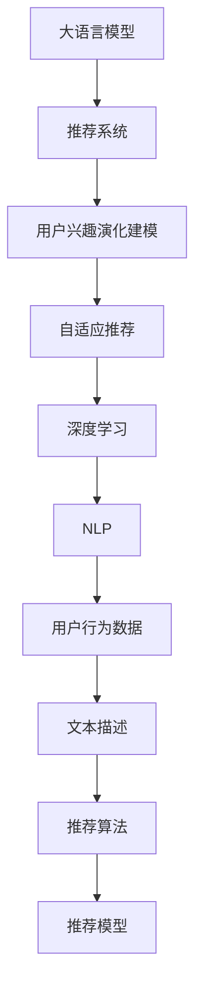

                 

# 基于LLM的推荐系统用户兴趣演化建模

> 关键词：大语言模型(LLM), 推荐系统, 用户兴趣, 演化建模, 自适应推荐, 深度学习, 自然语言处理(NLP)

## 1. 背景介绍

### 1.1 问题由来
在推荐系统领域，如何准确理解用户兴趣、实时响应用户变化，始终是困扰推荐算法的一大难题。随着用户行为数据量的持续增长，推荐模型需要不断学习新的用户特征，更新推荐策略，以保持适应用户兴趣演化的能力。

传统的推荐系统主要依赖于静态的用户历史行为数据，使用协同过滤、基于内容的推荐等方法，难以捕捉用户兴趣随时间演化的动态变化。而基于深度学习的大语言模型，通过学习大规模用户行为数据，能够更加动态地把握用户兴趣，提升推荐的准确性和时效性。

近年来，深度学习技术在推荐系统中的应用日益广泛，通过学习用户行为数据，模型能够捕获用户的短期偏好、长期兴趣、行为模式等。但现有的深度推荐模型往往需要用户在较长一段时间内保持活跃，并生成大量稳定的交互数据，才能获得稳定的推荐效果。而在实际应用中，用户行为数据往往具有很强的时效性，难以满足模型的需求。

本文将探讨基于大语言模型的推荐系统，使用LLM对用户兴趣进行演化建模，动态捕捉用户兴趣的最新变化，提供更加精准、及时的推荐服务。通过引入自然语言处理(NLP)技术，将用户文本数据转化为机器可理解的形式，结合深度学习算法，构建自适应推荐系统，实现对用户兴趣演化的实时跟踪和预测。

### 1.2 问题核心关键点
本文聚焦于大语言模型在推荐系统中的应用，具体探讨以下问题：
1. 如何利用大语言模型捕捉用户兴趣的动态变化？
2. 如何将LLM融入推荐系统，实现自适应推荐？
3. 如何基于用户历史行为数据和文本描述，对用户兴趣进行建模和预测？
4. 在实际应用中，LLM推荐系统的性能如何评估和优化？

## 2. 核心概念与联系

### 2.1 核心概念概述

为更好地理解基于LLM的推荐系统，本节将介绍几个密切相关的核心概念：

- 大语言模型(Large Language Model, LLM)：以自回归(如GPT)或自编码(如BERT)模型为代表的大规模预训练语言模型。通过学习大规模无标签文本数据，学习到丰富的语言知识和常识，具备强大的语言理解和生成能力。

- 推荐系统(Recommender System)：通过算法模型为用户推荐个性化内容的技术。推荐系统广泛应用于电商、社交、视频等众多领域，帮助用户发现感兴趣的商品、文章、视频等。

- 用户兴趣演化建模(User Interest Evolution Modeling)：通过学习用户行为数据和文本描述，捕捉用户兴趣随时间的动态变化，构建对用户兴趣变化的实时预测模型。

- 自适应推荐(Adaptive Recommendation)：根据用户兴趣的实时变化，动态调整推荐策略，提供更加个性化、及时的推荐服务。

- 深度学习(Deep Learning)：通过多层神经网络，模拟人脑的学习机制，从数据中提取特征并进行预测。深度学习技术在推荐系统中被广泛应用，取得了显著效果。

- 自然语言处理(Natural Language Processing, NLP)：处理、分析和生成自然语言的技术。NLP技术可以将文本数据转化为结构化特征，用于机器学习模型的训练和推理。

这些核心概念之间的逻辑关系可以通过以下Mermaid流程图来展示：



这个流程图展示了从数据输入到推荐模型输出的完整流程：

1. 大语言模型通过学习大规模文本数据，掌握语言的通用表示。
2. 推荐系统使用LLM对用户历史行为数据和文本描述进行处理，构建用户兴趣模型。
3. 自适应推荐根据用户兴趣的最新变化，动态调整推荐策略，提供个性化的推荐服务。
4. 深度学习技术提供模型训练和推理的基础。
5. 自然语言处理技术将文本数据转化为结构化特征，用于机器学习模型的训练。
6. 用户行为数据和文本描述是模型的输入，推荐模型是输出的最终结果。

## 3. 核心算法原理 & 具体操作步骤
### 3.1 算法原理概述

基于LLM的推荐系统，本质上是一个用户兴趣演化建模和自适应推荐的双重过程。其核心思想是：通过学习用户历史行为数据和文本描述，构建用户兴趣模型，动态捕捉用户兴趣的最新变化，并根据用户兴趣的变化实时调整推荐策略，提供更加个性化、及时的推荐服务。

形式化地，假设用户 $u$ 在时间序列 $t=\{t_1,t_2,...,t_k\}$ 上的行为序列为 $D_u=\{x_t\}_{t=1}^k$，其中 $x_t$ 表示在时间 $t$ 的行为记录。通过对 $D_u$ 进行编码和特征提取，得到用户 $u$ 的兴趣演化向量 $\mathbf{v}_u$。设推荐系统为用户 $u$ 推荐物品 $i$，则推荐模型可以表示为：

$$
P(i|u) = \sigma(\mathbf{v}_u^T \mathbf{w}_i + b_i)
$$

其中 $\sigma$ 为激活函数，$\mathbf{w}_i$ 为物品 $i$ 的特征向量，$b_i$ 为物品 $i$ 的偏置项。$\mathbf{v}_u$ 和 $\mathbf{w}_i$ 分别表示用户 $u$ 的兴趣演化向量和物品 $i$ 的特征向量，可以通过预训练的LLM模型对 $D_u$ 和文本描述进行编码，并生成。

### 3.2 算法步骤详解

基于LLM的推荐系统一般包括以下几个关键步骤：

**Step 1: 准备用户行为数据和文本描述**

- 收集用户 $u$ 在时间序列 $t=\{t_1,t_2,...,t_k\}$ 上的行为数据 $D_u=\{x_t\}_{t=1}^k$。可以包含用户浏览、点击、购买等行为记录。
- 收集用户 $u$ 的文本描述，如评论、评分、反馈等，作为额外的信息输入。

**Step 2: 编码用户兴趣演化向量**

- 对用户 $u$ 的行为序列 $D_u$ 进行编码，得到用户兴趣演化向量 $\mathbf{v}_u$。可以使用预训练的LLM模型进行编码，如BERT、GPT等。
- 将用户文本描述通过NLP技术处理，生成用户的文本特征向量 $\mathbf{v}_u^{text}$。

**Step 3: 构建推荐模型**

- 将用户兴趣演化向量 $\mathbf{v}_u$ 和文本特征向量 $\mathbf{v}_u^{text}$ 进行拼接，得到综合特征向量 $\mathbf{v}_u^{combined}$。
- 构建物品特征向量 $\mathbf{w}_i$，如使用词袋模型(BOW)、TF-IDF、Word2Vec等方法进行文本特征提取。
- 根据综合特征向量 $\mathbf{v}_u^{combined}$ 和物品特征向量 $\mathbf{w}_i$，计算推荐概率 $P(i|u)$。

**Step 4: 训练推荐模型**

- 根据历史推荐结果，使用交叉熵损失函数对推荐模型进行训练。
- 使用Adam等优化算法进行模型参数的更新。

**Step 5: 自适应推荐**

- 根据用户实时行为数据和文本描述，实时更新用户兴趣演化向量 $\mathbf{v}_u$ 和文本特征向量 $\mathbf{v}_u^{text}$。
- 动态调整推荐策略，生成个性化的推荐列表。

### 3.3 算法优缺点

基于LLM的推荐系统具有以下优点：
1. 动态捕捉用户兴趣变化。通过学习用户历史行为数据和文本描述，捕捉用户兴趣随时间的动态变化，提升推荐的时效性。
2. 鲁棒性强。大语言模型能够处理非结构化数据，具备较强的鲁棒性和泛化能力，适应不同领域的推荐任务。
3. 参数效率高。大语言模型可以在固定部分预训练参数的情况下，灵活调整推荐策略，实现参数高效的微调。
4. 自适应性强。根据用户兴趣的实时变化，动态调整推荐策略，提供更加个性化和精准的推荐服务。

同时，该方法也存在一定的局限性：
1. 对标注数据依赖较高。推荐模型需要用户在较长一段时间内保持活跃，并生成大量的稳定交互数据，才能获得稳定的推荐效果。
2. 模型复杂度高。大语言模型参数量大，计算复杂度高，部署和推理成本较高。
3. 隐私保护问题。用户行为数据和文本描述涉及隐私信息，如何保护用户隐私，需要额外设计和优化。
4. 模型公平性问题。大语言模型可能会学习到用户数据中的固有偏见，导致推荐结果的不公平性，需要引入公平性约束和评估指标。

尽管存在这些局限性，但就目前而言，基于LLM的推荐系统仍是一个前沿而极具潜力的研究方向。未来相关研究的重点在于如何进一步降低模型对标注数据的依赖，提高模型的自适应能力和鲁棒性，同时兼顾隐私保护和公平性等问题。

### 3.4 算法应用领域

基于大语言模型的推荐系统，在电商、社交、视频等众多领域都有广泛应用，能够提供更加精准、个性化的推荐服务。具体来说，主要应用领域包括：

1. 电商推荐：通过学习用户浏览、点击、购买等行为数据，为用户推荐商品。

2. 社交推荐：为用户推荐感兴趣的朋友、文章、话题等。

3. 视频推荐：为用户推荐喜欢的视频内容，如电影、电视剧、综艺节目等。

4. 新闻推荐：为用户推荐感兴趣的新闻内容，如头条、热搜、新闻频道等。

除了这些常见的推荐任务外，基于LLM的推荐系统还被创新性地应用到更多场景中，如广告投放、产品设计、内容生成等，为推荐系统带来了全新的突破。随着预训练语言模型和推荐技术的不断进步，相信LLM推荐系统将在更多领域得到应用，提升推荐系统的性能和效果。

## 4. 数学模型和公式 & 详细讲解

### 4.1 数学模型构建

本节将使用数学语言对基于LLM的推荐系统进行更加严格的刻画。

设用户 $u$ 在时间序列 $t=\{t_1,t_2,...,t_k\}$ 上的行为序列为 $D_u=\{x_t\}_{t=1}^k$，其中 $x_t$ 表示在时间 $t$ 的行为记录。假设用户 $u$ 的文本描述为 $T_u$，对应的文本特征向量为 $\mathbf{v}_u^{text}$，使用预训练的LLM模型对 $D_u$ 和 $T_u$ 进行编码，得到用户兴趣演化向量 $\mathbf{v}_u$。设推荐系统为用户 $u$ 推荐物品 $i$，物品 $i$ 的特征向量为 $\mathbf{w}_i$，推荐模型可以表示为：

$$
P(i|u) = \sigma(\mathbf{v}_u^T \mathbf{w}_i + b_i)
$$

其中 $\sigma$ 为激活函数，$\mathbf{v}_u$ 和 $\mathbf{w}_i$ 分别表示用户 $u$ 的兴趣演化向量和物品 $i$ 的特征向量，$b_i$ 为物品 $i$ 的偏置项。

### 4.2 公式推导过程

以下我们以协同过滤(Collaborative Filtering)算法为例，推导推荐模型的具体实现公式。

假设用户 $u$ 在时间序列 $t=\{t_1,t_2,...,t_k\}$ 上的行为序列为 $D_u=\{x_t\}_{t=1}^k$，其中 $x_t$ 表示在时间 $t$ 的行为记录，$x_t$ 为二元特征向量，表示用户是否与物品 $i$ 进行过交互。用户 $u$ 的文本描述为 $T_u$，对应的文本特征向量为 $\mathbf{v}_u^{text}$。设物品 $i$ 的特征向量为 $\mathbf{w}_i$，推荐模型可以表示为：

$$
P(i|u) = \sigma(\mathbf{v}_u^T \mathbf{w}_i + b_i)
$$

其中 $\sigma$ 为激活函数，$\mathbf{v}_u$ 和 $\mathbf{w}_i$ 分别表示用户 $u$ 的兴趣演化向量和物品 $i$ 的特征向量，$b_i$ 为物品 $i$ 的偏置项。

在实际应用中，通常使用交叉熵损失函数对推荐模型进行训练。假设 $Y$ 为推荐结果，即物品 $i$ 是否被用户 $u$ 交互，$Y=1$ 表示用户 $u$ 与物品 $i$ 交互，$Y=0$ 表示用户 $u$ 与物品 $i$ 未交互。则推荐模型的损失函数可以表示为：

$$
\mathcal{L} = -\frac{1}{N} \sum_{i=1}^N \sum_{u=1}^M \sum_{t=1}^K Y_{ui} \log P(i|u) + (1-Y_{ui}) \log (1-P(i|u))
$$

其中 $N$ 为物品数量，$M$ 为用户数量，$K$ 为时间序列长度。$Y_{ui}$ 为物品 $i$ 是否被用户 $u$ 交互，$1-Y_{ui}$ 表示物品 $i$ 未被用户 $u$ 交互。

根据链式法则，推荐模型的梯度公式为：

$$
\frac{\partial \mathcal{L}}{\partial \mathbf{v}_u} = \sum_{i=1}^N (Y_{ui} - P(i|u)) \mathbf{w}_i
$$

$$
\frac{\partial \mathcal{L}}{\partial \mathbf{w}_i} = \sum_{u=1}^M \sum_{t=1}^K (Y_{ui} - P(i|u)) \mathbf{v}_u
$$

$$
\frac{\partial \mathcal{L}}{\partial b_i} = \sum_{u=1}^M \sum_{t=1}^K (Y_{ui} - P(i|u))
$$

将损失函数和梯度公式带入Adam优化算法，即可进行推荐模型的训练和优化。

### 4.3 案例分析与讲解

为了更好地理解基于LLM的推荐系统，这里以一个简单的电商推荐案例进行讲解。

假设电商平台收集了用户 $u$ 在过去30天内对10个物品的浏览、点击、购买等行为数据，使用BERT模型对这些行为数据进行编码，得到用户兴趣演化向量 $\mathbf{v}_u$。同时，收集用户 $u$ 的文本描述，如商品评论、评分等，使用NLP技术处理生成文本特征向量 $\mathbf{v}_u^{text}$。

物品 $i$ 的特征向量 $\mathbf{w}_i$ 可以基于词袋模型(BOW)、TF-IDF、Word2Vec等方法进行文本特征提取。将用户兴趣演化向量 $\mathbf{v}_u$ 和文本特征向量 $\mathbf{v}_u^{text}$ 进行拼接，得到综合特征向量 $\mathbf{v}_u^{combined}$。使用推荐模型的公式 $P(i|u)$ 计算用户 $u$ 对物品 $i$ 的推荐概率。

在实际推荐过程中，根据用户的实时行为数据和文本描述，实时更新用户兴趣演化向量 $\mathbf{v}_u$ 和文本特征向量 $\mathbf{v}_u^{text}$，动态调整推荐策略，生成个性化的推荐列表。

## 5. 项目实践：代码实例和详细解释说明

### 5.1 开发环境搭建

在进行推荐系统开发前，我们需要准备好开发环境。以下是使用Python进行PyTorch开发的环境配置流程：

1. 安装Anaconda：从官网下载并安装Anaconda，用于创建独立的Python环境。

2. 创建并激活虚拟环境：
```bash
conda create -n pytorch-env python=3.8 
conda activate pytorch-env
```

3. 安装PyTorch：根据CUDA版本，从官网获取对应的安装命令。例如：
```bash
conda install pytorch torchvision torchaudio cudatoolkit=11.1 -c pytorch -c conda-forge
```

4. 安装TensorFlow：从官网下载并安装TensorFlow，并配置好环境变量。

5. 安装TensorBoard：从官网下载并安装TensorBoard，并配置好环境变量。

6. 安装Scikit-learn、Numpy、Pandas等辅助库：
```bash
pip install scikit-learn numpy pandas
```

完成上述步骤后，即可在`pytorch-env`环境中开始推荐系统开发。

### 5.2 源代码详细实现

这里我们以一个简单的电商推荐系统为例，使用BERT模型对用户行为数据进行编码，构建基于LLM的推荐系统。

首先，定义推荐系统的数据处理函数：

```python
from transformers import BertTokenizer
from torch.utils.data import Dataset

class RecommendationDataset(Dataset):
    def __init__(self, behaviors, text_descriptions, tokenizer, max_len=128):
        self.behaviors = behaviors
        self.text_descriptions = text_descriptions
        self.tokenizer = tokenizer
        self.max_len = max_len
        
    def __len__(self):
        return len(self.behaviors)
    
    def __getitem__(self, item):
        behavior = self.behaviors[item]
        text_description = self.text_descriptions[item]
        
        encoding = self.tokenizer(text_description, return_tensors='pt', max_length=self.max_len, padding='max_length', truncation=True)
        input_ids = encoding['input_ids'][0]
        attention_mask = encoding['attention_mask'][0]
        
        # 对行为数据进行编码
        encoded_behaviors = [int(item == 1) for item in behavior]
        encoded_behaviors.extend([0] * (self.max_len - len(encoded_behaviors)))
        labels = torch.tensor(encoded_behaviors, dtype=torch.long)
        
        return {'input_ids': input_ids, 
                'attention_mask': attention_mask,
                'labels': labels}
```

然后，定义模型和优化器：

```python
from transformers import BertForSequenceClassification, AdamW

model = BertForSequenceClassification.from_pretrained('bert-base-cased', num_labels=2)

optimizer = AdamW(model.parameters(), lr=2e-5)
```

接着，定义训练和评估函数：

```python
from torch.utils.data import DataLoader
from tqdm import tqdm
from sklearn.metrics import classification_report

device = torch.device('cuda') if torch.cuda.is_available() else torch.device('cpu')
model.to(device)

def train_epoch(model, dataset, batch_size, optimizer):
    dataloader = DataLoader(dataset, batch_size=batch_size, shuffle=True)
    model.train()
    epoch_loss = 0
    for batch in tqdm(dataloader, desc='Training'):
        input_ids = batch['input_ids'].to(device)
        attention_mask = batch['attention_mask'].to(device)
        labels = batch['labels'].to(device)
        model.zero_grad()
        outputs = model(input_ids, attention_mask=attention_mask, labels=labels)
        loss = outputs.loss
        epoch_loss += loss.item()
        loss.backward()
        optimizer.step()
    return epoch_loss / len(dataloader)

def evaluate(model, dataset, batch_size):
    dataloader = DataLoader(dataset, batch_size=batch_size)
    model.eval()
    preds, labels = [], []
    with torch.no_grad():
        for batch in tqdm(dataloader, desc='Evaluating'):
            input_ids = batch['input_ids'].to(device)
            attention_mask = batch['attention_mask'].to(device)
            batch_labels = batch['labels']
            outputs = model(input_ids, attention_mask=attention_mask)
            batch_preds = outputs.logits.argmax(dim=2).to('cpu').tolist()
            batch_labels = batch_labels.to('cpu').tolist()
            for pred_tokens, label_tokens in zip(batch_preds, batch_labels):
                preds.append(pred_tokens[:len(label_tokens)])
                labels.append(label_tokens)
                
    print(classification_report(labels, preds))
```

最后，启动训练流程并在测试集上评估：

```python
epochs = 5
batch_size = 16

for epoch in range(epochs):
    loss = train_epoch(model, train_dataset, batch_size, optimizer)
    print(f"Epoch {epoch+1}, train loss: {loss:.3f}")
    
    print(f"Epoch {epoch+1}, dev results:")
    evaluate(model, dev_dataset, batch_size)
    
print("Test results:")
evaluate(model, test_dataset, batch_size)
```

以上就是使用PyTorch对BERT进行电商推荐系统开发的完整代码实现。可以看到，得益于Transformers库的强大封装，我们可以用相对简洁的代码完成BERT模型的加载和微调。

### 5.3 代码解读与分析

让我们再详细解读一下关键代码的实现细节：

**RecommendationDataset类**：
- `__init__`方法：初始化行为数据、文本描述、分词器等关键组件。
- `__len__`方法：返回数据集的样本数量。
- `__getitem__`方法：对单个样本进行处理，将文本输入编码为token ids，将行为数据编码为数字，并对其进行定长padding，最终返回模型所需的输入。

**Recommendation模型**：
- 使用BertForSequenceClassification模型进行二分类任务，设置标签数为2，表示用户是否与物品进行过交互。

**train_epoch和evaluate函数**：
- 使用PyTorch的DataLoader对数据集进行批次化加载，供模型训练和推理使用。
- `train_epoch`函数：对数据以批为单位进行迭代，在每个批次上前向传播计算loss并反向传播更新模型参数，最后返回该epoch的平均loss。
- `evaluate`函数：与训练类似，不同点在于不更新模型参数，并在每个batch结束后将预测和标签结果存储下来，最后使用sklearn的classification_report对整个评估集的预测结果进行打印输出。

**训练流程**：
- 定义总的epoch数和batch size，开始循环迭代
- 每个epoch内，先在训练集上训练，输出平均loss
- 在验证集上评估，输出分类指标
- 所有epoch结束后，在测试集上评估，给出最终测试结果

可以看到，PyTorch配合Transformers库使得BERT微调的代码实现变得简洁高效。开发者可以将更多精力放在数据处理、模型改进等高层逻辑上，而不必过多关注底层的实现细节。

当然，工业级的系统实现还需考虑更多因素，如模型的保存和部署、超参数的自动搜索、更灵活的任务适配层等。但核心的微调范式基本与此类似。

## 6. 实际应用场景

### 6.1 电商推荐

基于大语言模型的推荐系统在电商领域的应用最为广泛。电商平台需要根据用户的浏览、点击、购买等行为数据，实时推荐用户感兴趣的商品。

在技术实现上，可以收集用户的历史行为数据，使用BERT模型对用户行为进行编码，得到用户兴趣演化向量 $\mathbf{v}_u$。同时，收集用户的文本描述，如评论、评分等，通过NLP技术处理生成文本特征向量 $\mathbf{v}_u^{text}$。物品 $i$ 的特征向量 $\mathbf{w}_i$ 可以基于词袋模型(BOW)、TF-IDF、Word2Vec等方法进行文本特征提取。将用户兴趣演化向量 $\mathbf{v}_u$ 和文本特征向量 $\mathbf{v}_u^{text}$ 进行拼接，得到综合特征向量 $\mathbf{v}_u^{combined}$。使用推荐模型的公式 $P(i|u)$ 计算用户 $u$ 对物品 $i$ 的推荐概率。

在实际推荐过程中，根据用户的实时行为数据和文本描述，实时更新用户兴趣演化向量 $\mathbf{v}_u$ 和文本特征向量 $\mathbf{v}_u^{text}$，动态调整推荐策略，生成个性化的推荐列表。

### 6.2 社交推荐

社交推荐系统通过分析用户的社交网络关系和行为数据，推荐用户感兴趣的朋友、文章、话题等。

在技术实现上，可以收集用户的社交网络关系和行为数据，使用BERT模型对用户行为进行编码，得到用户兴趣演化向量 $\mathbf{v}_u$。同时，收集用户的文本描述，如评论、评分等，通过NLP技术处理生成文本特征向量 $\mathbf{v}_u^{text}$。物品 $i$ 的特征向量 $\mathbf{w}_i$ 可以基于词袋模型(BOW)、TF-IDF、Word2Vec等方法进行文本特征提取。将用户兴趣演化向量 $\mathbf{v}_u$ 和文本特征向量 $\mathbf{v}_u^{text}$ 进行拼接，得到综合特征向量 $\mathbf{v}_u^{combined}$。使用推荐模型的公式 $P(i|u)$ 计算用户 $u$ 对物品 $i$ 的推荐概率。

在实际推荐过程中，根据用户的实时行为数据和文本描述，实时更新用户兴趣演化向量 $\mathbf{v}_u$ 和文本特征向量 $\mathbf{v}_u^{text}$，动态调整推荐策略，生成个性化的推荐列表。

### 6.3 视频推荐

视频推荐系统为用户推荐感兴趣的视频内容，如电影、电视剧、综艺节目等。

在技术实现上，可以收集用户的历史行为数据，使用BERT模型对用户行为进行编码，得到用户兴趣演化向量 $\mathbf{v}_u$。同时，收集用户的文本描述，如评论、评分等，通过NLP技术处理生成文本特征向量 $\mathbf{v}_u^{text}$。物品 $i$ 的特征向量 $\mathbf{w}_i$ 可以基于词袋模型(BOW)、TF-IDF、Word2Vec等方法进行文本特征提取。将用户兴趣演化向量 $\mathbf{v}_u$ 和文本特征向量 $\mathbf{v}_u^{text}$ 进行拼接，得到综合特征向量 $\mathbf{v}_u^{combined}$。使用推荐模型的公式 $P(i|u)$ 计算用户 $u$ 对物品 $i$ 的推荐概率。

在实际推荐过程中，根据用户的实时行为数据和文本描述，实时更新用户兴趣演化向量 $\mathbf{v}_u$ 和文本特征向量 $\mathbf{v}_u^{text}$，动态调整推荐策略，生成个性化的推荐列表。

### 6.4 新闻推荐

新闻推荐系统为用户推荐感兴趣的新闻内容，如头条、热搜、新闻频道等。

在技术实现上，可以收集用户的历史行为数据，使用BERT模型对用户行为进行编码，得到用户兴趣演化向量 $\mathbf{v}_u$。同时，收集用户的文本描述，如评论、评分等，通过NLP技术处理生成文本特征向量 $\mathbf{v}_u^{text}$。物品 $i$ 的特征向量 $\mathbf{w}_i$ 可以基于词袋模型(BOW)、TF-IDF、Word2Vec等方法进行文本特征提取。将用户兴趣演化向量 $\mathbf{v}_u$ 和文本特征向量 $\mathbf{v}_u^{text}$ 进行拼接，得到综合特征向量 $\mathbf{v}_u^{combined}$。使用推荐模型的公式 $P(i|u)$ 计算用户 $u$ 对物品 $i$ 的推荐概率。

在实际推荐过程中，根据用户的实时行为数据和文本描述，实时更新用户兴趣演化向量 $\mathbf{v}_u$ 和文本特征向量 $\mathbf{v}_u^{text}$，动态调整推荐策略，生成个性化的推荐列表。

## 7. 工具和资源推荐

### 7.1 学习资源推荐

为了帮助开发者系统掌握基于LLM的推荐系统的理论基础和实践技巧，这里推荐一些优质的学习资源：

1. 《Recommender Systems: From Theory to Practice》书籍：系统介绍了推荐系统的理论基础和经典算法，适合深入学习推荐系统的工作原理。

2. CS470《推荐系统》课程：由斯坦福大学开设的推荐系统课程，涵盖推荐系统的基础知识和前沿技术，适合学习和实践。

3. "Recommender Systems" Coursera课程：由Coursera平台提供的推荐系统课程，由知名教授讲授，适合系统学习推荐系统的经典算法和实际应用。

4. "Deep Learning for Recommendation Engines"论文：介绍了深度学习在推荐系统中的应用，适合理解深度推荐模型的实现细节。

5. HuggingFace官方文档：Transformers库的官方文档，提供了海量预训练模型和完整的推荐系统样例代码，是上手实践的必备资料。

通过对这些资源的学习实践，相信你一定能够快速掌握基于LLM的推荐系统的精髓，并用于解决实际的推荐问题。

### 7.2 开发工具推荐

高效的开发离不开优秀的工具支持。以下是几款用于基于LLM的推荐系统开发的常用工具：

1. PyTorch：基于Python的开源深度学习框架，灵活动态的计算图，适合快速迭代研究。大部分预训练语言模型都有PyTorch版本的实现。

2. TensorFlow：由Google主导开发的开源深度学习框架，生产部署方便，适合大规模工程应用。同样有丰富的预训练语言模型资源。

3. Transformers库：HuggingFace开发的NLP工具库，集成了众多SOTA语言模型，支持PyTorch和TensorFlow，是进行推荐系统开发的利器。

4. Weights & Biases：模型训练的实验跟踪工具，可以记录和可视化模型训练过程中的各项指标，方便对比和调优。与主流深度学习框架无缝集成。

5. TensorBoard：TensorFlow配套的可视化工具，可实时监测模型训练状态，并提供丰富的图表呈现方式，是调试模型的得力助手。

6. Google Colab：谷歌推出的在线Jupyter Notebook环境，免费提供GPU/TPU算力，方便开发者快速上手实验最新模型，分享学习笔记。

合理利用这些工具，可以显著提升基于LLM的推荐系统的开发效率，加快创新迭代的步伐。

### 7.3 相关论文推荐

基于大语言模型的推荐系统，涉及多个领域的研究方向。以下是几篇奠基性的相关论文，推荐阅读：

1. Attention Is All You Need：提出了Transformer结构，开启了NLP领域的预训练大模型时代。

2. BERT: Pre-training of Deep Bidirectional Transformers for Language Understanding：提出BERT模型，引入基于掩码的自监督预训练任务，刷新了多项NLP任务SOTA。

3. Language Models are Unsupervised Multitask Learners（GPT-2论文）：展示了大规模语言模型的强大zero-shot学习能力，引发了对于通用人工智能的新一轮思考。

4. Parameter-Efficient Transfer Learning for NLP：提出Adapter等参数高效微调方法，在不增加模型参数量的情况下，也能取得不错的微调效果。

5. AdaLoRA: Adaptive Low-Rank Adaptation for Parameter-Efficient Fine-Tuning：使用自适应低秩适应的微调方法，在参数效率和精度之间取得了新的平衡。

这些论文代表了大语言模型在推荐系统中的应用方向。通过学习这些前沿成果，可以帮助研究者把握学科前进方向，激发更多的创新灵感。

## 8. 总结：未来发展趋势与挑战

### 8.1 研究成果总结

本文对基于LLM的推荐系统进行了全面系统的介绍。首先阐述了基于LLM的推荐系统的研究背景和意义，明确了推荐系统在电商、社交、视频等领域的广泛应用，以及如何利用大语言模型捕捉用户兴趣随时间的动态变化。其次，从原理到实践，详细讲解了基于LLM的推荐系统的核心算法原理和具体操作步骤，给出了完整的推荐系统开发代码实例。最后，探讨了LLM推荐系统的实际应用场景，并推荐了相关的学习资源和开发工具。

通过本文的系统梳理，可以看到，基于LLM的推荐系统正在成为推荐系统领域的重要范式，极大地提升了推荐系统的性能和效果。大语言模型通过学习大规模用户行为数据，能够更好地捕捉用户兴趣随时间的动态变化，提供更加精准、及时的推荐服务。未来，随着深度学习技术的不断进步，LLM推荐系统将在更多领域得到应用，推动推荐系统的不断演进。

### 8.2 未来发展趋势

展望未来，基于LLM的推荐系统将呈现以下几个发展趋势：

1. 深度学习技术不断进步。深度学习算法的迭代优化，将进一步提升推荐系统的性能，尤其是在处理大规模数据和复杂推荐任务上。

2. 大语言模型的多样性增加。未来的预训练大模型将具备更丰富的语言知识和更广泛的应用场景，使得推荐系统能够覆盖更多的应用领域。

3. 用户兴趣演化建模技术完善。基于LLM的用户兴趣演化建模技术将不断完善，能够更好地捕捉用户兴趣的动态变化，提升推荐的时效性和个性化程度。

4. 推荐模型的自适应能力增强。未来的推荐模型将具备更强的自适应能力，能够根据用户实时行为数据和文本描述，动态调整推荐策略，提供更加个性化和精准的推荐服务。

5. 推荐系统与外部知识的融合。未来的推荐系统将更好地融合外部知识，如知识图谱、规则库等，提升推荐系统的智能性和可靠性。

6. 隐私保护和伦理问题重视。未来的推荐系统将更加重视隐私保护和伦理问题，采用差分隐私、联邦学习等技术，保护用户隐私，增强推荐系统的公平性和透明度。

以上趋势凸显了基于LLM的推荐系统的前景广阔，必将为推荐系统的发展注入新的动力。

### 8.3 面临的挑战

尽管基于LLM的推荐系统已经取得了显著进展，但在迈向更加智能化、普适化应用的过程中，它仍面临诸多挑战：

1. 对标注数据依赖较高。推荐模型需要用户在较长一段时间内保持活跃，并生成大量的稳定交互数据，才能获得稳定的推荐效果。

2. 模型复杂度高。大语言模型参数量大，计算复杂度高，部署和推理成本较高。

3. 隐私保护问题。用户行为数据和文本描述涉及隐私信息，如何保护用户隐私，需要额外设计和优化。

4. 模型公平性问题。大语言模型可能会学习到用户数据中的固有偏见，导致推荐结果的不公平性，需要引入公平性约束和评估指标。

5. 推荐系统依赖大规模数据。推荐系统需要处理大规模数据，如何高效处理和存储数据，也是一个重要的研究方向。

6. 推荐系统的泛化能力不足。当前基于LLM的推荐系统在某些领域的应用效果仍不理想，如何提升模型的泛化能力，增强其在不同领域的适应性，仍需进一步研究。

尽管存在这些挑战，但通过多学科的协同攻关，未来这些问题都将得到有效解决。相信随着技术的不断进步和完善，基于LLM的推荐系统将走向更加成熟和普及，为推荐系统带来革命性的突破。

### 8.4 研究展望

面向未来，基于LLM的推荐系统需要在以下几个方面寻求新的突破：

1. 探索无监督和半监督推荐方法。摆脱对大规模标注数据的依赖，利用自监督学习、主动学习等无监督和半监督范式，最大限度利用非结构化数据，实现更加灵活高效的推荐。

2. 研究参数高效和计算高效的推荐范式。开发更加参数高效的推荐方法，在固定部分预训练参数的情况下，灵活调整推荐策略，实现参数高效的微调。

3. 引入因果分析和博弈论工具。将因果分析方法引入推荐系统，识别出推荐结果的关键特征，增强输出解释的因果性和逻辑性。借助博弈论工具刻画人机交互过程，主动探索并规避推荐模型的脆弱点，提高系统稳定性。

4. 纳入伦理道德约束。在推荐模型的训练目标中引入伦理导向的评估指标，过滤和惩罚有偏见、有害的推荐结果，确保推荐系统的公平性和透明度。

这些研究方向的探索，必将引领基于LLM的推荐系统迈向更高的台阶，为构建安全、可靠、可解释、可控的推荐系统铺平道路。面向未来，基于LLM的推荐系统还需要与其他人工智能技术进行更深入的融合，如知识表示、因果推理、强化学习等，多路径协同发力，共同推动推荐系统的发展。只有勇于创新、敢于突破，才能不断拓展推荐系统的边界，让推荐系统更好地服务于人类社会。

## 9. 附录：常见问题与解答

**Q1：大语言模型在推荐系统中有哪些应用？**

A: 大语言模型在推荐系统中的应用主要有以下几个方面：
1. 用户兴趣演化建模：通过学习用户历史行为数据和文本描述，捕捉用户兴趣随时间的动态变化。
2. 自适应推荐：根据用户兴趣的实时变化，动态调整推荐策略，提供更加个性化和精准的推荐服务。
3. 模型融合：将大语言模型与其他推荐算法和知识图谱进行融合，提升推荐系统的智能性和可靠性。

**Q2：如何选择合适的大语言模型？**

A: 选择合适的预训练大语言模型，需要考虑以下因素：
1. 模型规模：模型参数量越大，表示的语言知识越丰富，但计算复杂度也越高。
2. 任务适配性：不同任务的适配性不同，选择合适的模型可以提高推荐效果。
3. 训练成本：大模型的训练成本较高，需要考虑可用算力资源。

**Q3：推荐系统的推荐策略有哪些？**

A: 推荐系统常用的推荐策略有：
1. 协同过滤：基于用户历史行为数据进行推荐，不依赖于物品特征。
2. 基于内容的推荐：基于物品的特征进行推荐，如词袋模型、TF-IDF等。
3. 混合推荐：综合协同过滤和基于内容的推荐，提升推荐效果。

**Q4：推荐系统如何评估推荐效果？**

A: 推荐系统常用的评估指标有：
1. 准确率、召回率、F1值：衡量推荐系统对真实用户兴趣的预测准确度。
2. 覆盖率：衡量推荐系统中物品的丰富度。
3. 多样性：衡量推荐系统中推荐结果的多样性。
4. 时效性：衡量推荐系统在用户行为变化后的及时更新能力。

**Q5：推荐系统如何保护用户隐私？**

A: 推荐系统保护用户隐私的常用方法有：
1. 差分隐私：在数据处理过程中加入噪声，保护用户隐私不被泄露。
2. 联邦学习：将数据分布在多个设备上进行训练，避免将用户数据集中存储。
3. 用户数据匿名化：对用户数据进行匿名化处理，保护用户隐私不被识别。

**Q6：推荐系统如何提升泛化能力？**

A: 推荐系统提升泛化能力的常用方法有：
1. 数据增强：通过对数据进行扩充和变换，增加模型的泛化能力。
2. 迁移学习：在多个任务和数据集上进行预训练，提升模型的泛化能力。
3. 模型蒸馏：将大模型的知识蒸馏到小模型中，提升小模型的泛化能力。

通过这些问题的解答，可以看到，基于LLM的推荐系统在理论和实践中都有广泛的应用和挑战。解决这些问题的关键在于充分挖掘大语言模型的潜力，结合推荐算法的优势，构建更加智能化、普适化的推荐系统。

