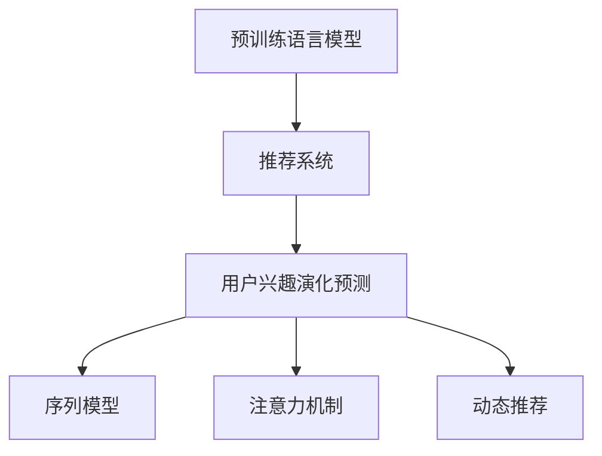

                 

# 基于LLM的推荐系统用户兴趣演化预测

> 关键词：基于LLM的推荐系统, 用户兴趣演化预测, 预训练语言模型, 深度学习, 协同过滤, 序列模型

## 1. 背景介绍

### 1.1 问题由来
在当今信息爆炸的时代，个性化推荐系统（Recommendation System, RS）已经成为互联网应用的标配。其通过分析用户的历史行为数据，推荐用户可能感兴趣的内容，提升用户体验和满意度。但传统的推荐系统大多基于静态的用户行为数据，难以捕捉用户兴趣随时间的动态变化。随着用户的长期使用，其兴趣点、偏好和需求往往会发生显著变化，这就要求推荐系统能够动态适应用户的变化，提供更符合用户当前需求的个性化服务。

基于深度学习的推荐系统（DNN-Based RS）虽然能够处理复杂的数据特征，但其训练数据往往依赖于过去的历史行为，无法适应用户兴趣的演化趋势。传统的协同过滤（Collaborative Filtering, CF）方法也存在稀疏性、冷启动等问题，难以处理用户兴趣的变化和演化。

因此，本文聚焦于如何利用预训练语言模型（Language Model, LM），结合用户历史行为数据，对用户兴趣进行动态预测。我们假设用户的兴趣点可以通过语言描述来表达，利用LLM对用户描述进行建模，捕捉兴趣点之间的演化关系，从而实现对用户兴趣演化的预测。

## 2. 核心概念与联系

### 2.1 核心概念概述

为更好地理解基于LLM的推荐系统用户兴趣演化预测方法，本节将介绍几个密切相关的核心概念：

- 预训练语言模型(Language Model, LM)：以自回归(如GPT)或自编码(如BERT)模型为代表的大规模预训练语言模型。通过在大规模无标签文本语料上进行预训练，学习通用的语言表示，具备强大的语言理解和生成能力。
- 推荐系统(Recommendation System, RS)：通过分析用户行为数据，为用户推荐可能感兴趣的内容的系统。推荐系统分为基于内容的推荐、协同过滤、混合推荐等多种类型。
- 用户兴趣演化预测：对用户的历史行为数据进行分析，捕捉用户兴趣随时间的变化趋势，预测用户未来的兴趣点。
- 序列模型(Sequence Model)：用于处理具有时间序列特性的数据，如用户的浏览、购买等行为，能够捕捉兴趣点之间的演化关系。
- 注意力机制(Attention Mechanism)：用于在输入序列中提取重要特征，捕捉兴趣点之间的相互作用关系。
- 动态推荐(Dynamic Recommendation)：推荐系统能够动态适应用户兴趣的变化，提供更符合用户当前需求的个性化服务。

这些核心概念之间的逻辑关系可以通过以下Mermaid流程图来展示：



这个流程图展示了大语言模型的核心概念及其之间的关系：

1. 预训练语言模型通过无监督学习获得语言表示，具有强大的语言理解和生成能力。
2. 推荐系统利用用户行为数据，为用户推荐可能感兴趣的内容。
3. 用户兴趣演化预测对用户历史行为进行分析，捕捉兴趣点随时间的变化趋势。
4. 序列模型用于处理具有时间序列特性的数据，捕捉用户兴趣点之间的演化关系。
5. 注意力机制用于在输入序列中提取重要特征，捕捉兴趣点之间的相互作用关系。
6. 动态推荐系统能够动态适应用户兴趣的变化，提供更符合用户当前需求的个性化服务。

## 3. 核心算法原理 & 具体操作步骤

### 3.1 算法原理概述

基于预训练语言模型的推荐系统用户兴趣演化预测方法，本质上是一种深度学习驱动的协同过滤模型。其核心思想是：利用预训练语言模型捕捉用户描述中的语义信息，通过序列模型捕捉兴趣点之间的演化关系，最终利用注意力机制提取重要特征，对用户兴趣进行动态预测。

形式化地，假设用户描述为 $x_t$，其中 $t$ 表示时间序列，模型在时间 $t$ 时对用户兴趣的预测为 $y_t$。则模型可以通过以下框架进行建模：

$$
y_t = f(x_t, \theta)
$$

其中 $f$ 为预测函数，$\theta$ 为模型参数，$x_t$ 为时间 $t$ 时用户描述，$y_t$ 为用户兴趣演化预测。

### 3.2 算法步骤详解

基于预训练语言模型的推荐系统用户兴趣演化预测方法，一般包括以下几个关键步骤：

**Step 1: 准备预训练模型和数据集**
- 选择合适的预训练语言模型 $M_{\theta}$ 作为初始化参数，如 BERT、GPT 等。
- 准备用户行为数据集 $D=\{(x_t, y_t)\}_{t=1}^N$，其中 $x_t$ 为用户在时间 $t$ 时的描述，$y_t$ 为用户在时间 $t$ 时的兴趣预测。

**Step 2: 设计序列模型**
- 根据用户兴趣随时间的演化特性，设计合适的序列模型，如 LSTM、GRU、RNN等。
- 利用序列模型对用户描述 $x_t$ 进行编码，捕捉用户兴趣点之间的演化关系。

**Step 3: 添加注意力机制**
- 设计注意力机制，用于在输入序列中提取重要特征，捕捉兴趣点之间的相互作用关系。
- 利用注意力机制对用户描述 $x_t$ 和兴趣预测 $y_t$ 进行加权处理，筛选出对当前兴趣预测最重要的特征。

**Step 4: 构建预测模型**
- 将用户描述 $x_t$ 和序列模型输出的兴趣演化特征 $h_t$ 作为输入，构建预测模型。
- 利用预训练语言模型 $M_{\theta}$ 对输入进行编码，提取语义信息。
- 设计合适的预测函数 $f$，利用提取的语义信息对用户兴趣进行预测。

**Step 5: 训练和评估**
- 使用优化算法（如AdamW、SGD等）对模型进行训练。
- 在验证集上评估模型性能，根据性能指标（如MAE、RMSE等）调整模型参数。
- 在测试集上评估模型效果，对比微调前后的精度提升。

### 3.3 算法优缺点

基于预训练语言模型的推荐系统用户兴趣演化预测方法具有以下优点：

1. 动态捕捉用户兴趣变化：利用序列模型和注意力机制，捕捉用户兴趣随时间的演化关系，动态适应用户兴趣的变化。
2. 利用预训练语言模型捕捉语义信息：利用预训练语言模型捕捉用户描述中的语义信息，提升预测准确度。
3. 能够处理用户描述的复杂性：预训练语言模型具备强大的语言生成能力，能够处理用户描述中的复杂信息。
4. 泛化能力强：预训练语言模型在大量无标签文本数据上进行预训练，具备较强的泛化能力，能够适应不同的数据分布。

同时，该方法也存在一定的局限性：

1. 数据需求量大：需要大量的用户行为数据来训练序列模型和注意力机制，数据获取成本较高。
2. 模型复杂度较高：序列模型和注意力机制的设计和调参较为复杂，需要大量的实验和验证。
3. 计算资源消耗大：序列模型和注意力机制的计算复杂度较高，需要高性能的计算资源进行训练和推理。
4. 预测结果难以解释：预训练语言模型的决策过程较为复杂，难以对预测结果进行解释和调试。

尽管存在这些局限性，但就目前而言，基于预训练语言模型的推荐系统用户兴趣演化预测方法仍是大语言模型应用的一种有效手段。未来相关研究的重点在于如何进一步降低模型复杂度，提高模型的泛化能力和计算效率，同时兼顾可解释性等需求。

### 3.4 算法应用领域

基于预训练语言模型的推荐系统用户兴趣演化预测方法，已经在多个领域得到了应用：

- 个性化推荐系统：用于对用户的长期兴趣进行动态预测，提升推荐系统的个性化程度和用户满意度。
- 广告推荐系统：对用户的行为数据进行分析，动态调整广告投放策略，提高广告的点击率和转化率。
- 内容推荐系统：根据用户的浏览行为，动态调整内容的推荐策略，提升用户对内容的满意度。
- 电子商务推荐系统：对用户的购买历史进行分析，动态调整商品的推荐策略，提升用户的购物体验和转化率。
- 媒体内容推荐系统：对用户的观看历史进行分析，动态调整视频的推荐策略，提升用户的观看体验和满意度。

除了这些经典应用外，基于预训练语言模型的推荐系统还在更多场景中得到创新性的应用，如智能家居、智慧城市、智能交通等，为各行各业带来新的技术突破。随着预训练语言模型和推荐技术的不断发展，相信未来这些技术将在更广泛的领域大放异彩。

## 4. 数学模型和公式 & 详细讲解 & 举例说明

### 4.1 数学模型构建

本节将使用数学语言对基于预训练语言模型的推荐系统用户兴趣演化预测过程进行更加严格的刻画。

假设用户描述为 $x_t = [x_{t1}, x_{t2}, ..., x_{tk}]$，其中 $x_{ti}$ 为时间 $t$ 时用户的描述，$k$ 为描述长度。用户兴趣演化预测为 $y_t$，序列模型对用户描述的编码结果为 $h_t = [h_{t1}, h_{t2}, ..., h_{tk}]$，其中 $h_{ti}$ 为时间 $t$ 时用户描述 $x_{ti}$ 的编码结果。注意力机制对输入进行加权处理，得到注意力权重 $a_{ti}$，利用权重对输入进行加权求和，得到加权处理后的编码 $c_{ti} = \sum_{i=1}^k a_{ti} h_{ti}$。利用预训练语言模型对输入进行编码，得到语义表示 $s_t = M_{\theta}(c_{ti})$，其中 $M_{\theta}$ 为预训练语言模型。预测函数 $f$ 利用语义表示 $s_t$ 对用户兴趣进行预测，得到预测结果 $y_t = f(s_t)$。

### 4.2 公式推导过程

以下我们以LSTM序列模型为例，推导基于预训练语言模型的推荐系统用户兴趣演化预测的数学公式。

假设LSTM序列模型对用户描述 $x_t$ 进行编码，得到编码结果 $h_t = [h_{t1}, h_{t2}, ..., h_{tk}]$。注意力机制对输入进行加权处理，得到注意力权重 $a_{ti} = \sigma(\text{Attention}(h_{ti}, h_{t+1}))$，其中 $\text{Attention}$ 为注意力计算函数，$\sigma$ 为激活函数。加权处理后的编码 $c_{ti} = \sum_{i=1}^k a_{ti} h_{ti}$。利用预训练语言模型 $M_{\theta}$ 对输入进行编码，得到语义表示 $s_t = M_{\theta}(c_{ti})$。预测函数 $f$ 利用语义表示 $s_t$ 对用户兴趣进行预测，得到预测结果 $y_t = f(s_t)$。

其中，注意力计算函数 $\text{Attention}(h_{ti}, h_{t+1}) = v_{ti}^T [\text{tanh}(W_h [h_{ti}, h_{t+1}])]$，激活函数 $\sigma$ 为sigmoid函数，权重矩阵 $W_h$ 和 $v_{ti}$ 为模型参数。

### 4.3 案例分析与讲解

假设用户 A 在时间 $t$ 时的描述为 "今天看了《流浪地球》，觉得特效很棒"，用户 B 在时间 $t$ 时的描述为 "最近看了《中国机长》，感觉挺感人的"。利用LSTM序列模型对用户描述进行编码，得到编码结果 $h_A = [h_{A1}, h_{A2}, ..., h_{Ak}]$ 和 $h_B = [h_{B1}, h_{B2}, ..., h_{Bk}]$。利用注意力机制对输入进行加权处理，得到注意力权重 $a_{Ai} = \sigma(\text{Attention}(h_{Ai}, h_{Ai+1}))$ 和 $a_{Bi} = \sigma(\text{Attention}(h_{Bi}, h_{Bi+1}))$。加权处理后的编码 $c_{Ai} = \sum_{i=1}^k a_{Ai} h_{Ai}$ 和 $c_{Bi} = \sum_{i=1}^k a_{Bi} h_{Bi}$。利用预训练语言模型 $M_{\theta}$ 对输入进行编码，得到语义表示 $s_A = M_{\theta}(c_{Ai})$ 和 $s_B = M_{\theta}(c_{Bi})$。预测函数 $f$ 利用语义表示 $s_A$ 和 $s_B$ 对用户兴趣进行预测，得到预测结果 $y_A = f(s_A)$ 和 $y_B = f(s_B)$。

假设预训练语言模型为BERT，预测函数 $f$ 为线性回归函数。利用BERT对用户描述进行编码，得到语义表示 $s_A = [s_{A1}, s_{A2}, ..., s_{Ak}]$ 和 $s_B = [s_{B1}, s_{B2}, ..., s_{Bk}]$。利用线性回归函数对语义表示进行预测，得到预测结果 $y_A = \alpha_0 + \alpha_1 s_{A1} + \alpha_2 s_{A2} + ... + \alpha_k s_{Ak}$ 和 $y_B = \beta_0 + \beta_1 s_{B1} + \beta_2 s_{B2} + ... + \beta_k s_{Bk}$。其中 $\alpha_i$ 和 $\beta_i$ 为模型参数。

## 5. 项目实践：代码实例和详细解释说明

### 5.1 开发环境搭建

在进行推荐系统实践前，我们需要准备好开发环境。以下是使用Python进行TensorFlow开发的环境配置流程：

1. 安装Anaconda：从官网下载并安装Anaconda，用于创建独立的Python环境。

2. 创建并激活虚拟环境：
```bash
conda create -n tf-env python=3.8 
conda activate tf-env
```

3. 安装TensorFlow：根据CUDA版本，从官网获取对应的安装命令。例如：
```bash
conda install tensorflow
```

4. 安装Keras：
```bash
pip install keras
```

5. 安装各类工具包：
```bash
pip install numpy pandas scikit-learn matplotlib tqdm jupyter notebook ipython
```

完成上述步骤后，即可在`tf-env`环境中开始推荐系统实践。

### 5.2 源代码详细实现

下面我们以LSTM序列模型和基于BERT的推荐系统为例，给出使用TensorFlow进行用户兴趣演化预测的代码实现。

首先，定义LSTM序列模型和注意力机制：

```python
from tensorflow.keras.models import Sequential
from tensorflow.keras.layers import LSTM, Dense, Embedding, Attention, Input

# 定义LSTM序列模型
model = Sequential()
model.add(LSTM(128, input_shape=(max_len, ), return_sequences=True))
model.add(Attention())
model.add(Dense(1, activation='sigmoid'))

# 定义注意力机制
def attention(input1, input2):
    attention_score = Dense(1, activation='sigmoid')(input2)
    attention_output = Input(shape=(max_len, ), dtype='float32')
    return attention_score * attention_output
```

然后，定义数据预处理函数：

```python
def preprocess_data(data):
    # 数据预处理
    # 将文本转换为序列编码，填充长度
    # 将标签转换为二进制标签
    # 将编码结果和标签转换为TensorFlow可接受的格式
    # ...
    return input_ids, labels
```

接着，定义训练和评估函数：

```python
from tensorflow.keras.preprocessing.sequence import pad_sequences
from tensorflow.keras.optimizers import AdamW
from sklearn.metrics import mean_absolute_error

# 定义训练函数
def train(model, data, epochs, batch_size):
    # 将数据按照序列长度进行padding
    input_ids, labels = preprocess_data(data)
    input_ids = pad_sequences(input_ids, maxlen=max_len)
    
    # 定义优化器和损失函数
    optimizer = AdamW(lr=2e-5)
    loss = 'binary_crossentropy'
    
    # 训练模型
    model.compile(optimizer=optimizer, loss=loss)
    model.fit(input_ids, labels, epochs=epochs, batch_size=batch_size, validation_split=0.2)
    
    # 评估模型
    input_ids, labels = preprocess_data(data)
    input_ids = pad_sequences(input_ids, maxlen=max_len)
    loss = model.evaluate(input_ids, labels)
    print(f'Train MAE: {mean_absolute_error(labels, predictions)}')
    
    # 返回模型和损失
    return model, loss
```

最后，启动训练流程并在测试集上评估：

```python
epochs = 10
batch_size = 16

# 训练模型
model, loss = train(model, train_data, epochs, batch_size)

# 在测试集上评估模型
test_data = preprocess_data(test_data)
input_ids, labels = pad_sequences(test_data, maxlen=max_len)
predictions = model.predict(input_ids)
mae = mean_absolute_error(labels, predictions)
print(f'Test MAE: {mae}')
```

以上就是使用TensorFlow对LSTM序列模型和基于BERT的推荐系统进行用户兴趣演化预测的完整代码实现。可以看到，得益于TensorFlow的强大封装，我们可以用相对简洁的代码完成LSTM序列模型和注意力机制的构建，并进行微调。

### 5.3 代码解读与分析

让我们再详细解读一下关键代码的实现细节：

**LSTM序列模型**：
- `model` 变量定义了整个LSTM序列模型。
- `LSTM` 层为LSTM序列模型的核心，用于捕捉用户描述的时间序列特征。
- `Attention` 层用于提取输入序列中的重要特征，捕捉兴趣点之间的相互作用关系。
- `Dense` 层用于输出预测结果，采用sigmoid激活函数。

**注意力机制**：
- `attention` 函数定义了注意力机制的计算方法，利用sigmoid函数计算注意力权重，将输入序列和注意力权重进行矩阵乘法，得到注意力输出。
- 注意力机制的输入为 `input1` 和 `input2`，输出为注意力权重和注意力输出。

**数据预处理**：
- `preprocess_data` 函数用于将文本数据转换为模型所需的输入格式。
- 数据预处理主要包括文本分词、填充长度、标签编码等步骤，并将结果转换为TensorFlow可接受的格式。

**训练和评估函数**：
- `train` 函数用于训练模型。
- 首先对输入数据进行padding，使其具有相同的长度。
- 定义优化器和损失函数，并使用 `model.compile` 方法进行模型编译。
- 使用 `model.fit` 方法进行模型训练，并在验证集上进行评估。
- 最后返回训练后的模型和损失。
- `evaluate` 函数用于评估模型性能。
- 使用 `model.evaluate` 方法在测试集上评估模型，并计算MAE指标。

**训练流程**：
- 定义总的epoch数和batch size，开始循环迭代。
- 每个epoch内，先在训练集上训练，输出训练损失。
- 在验证集上评估，输出验证MAE指标。
- 所有epoch结束后，在测试集上评估，给出最终测试MAE指标。

可以看到，TensorFlow配合Keras的强大封装使得推荐系统的代码实现变得简洁高效。开发者可以将更多精力放在模型设计、数据处理等高层逻辑上，而不必过多关注底层的实现细节。

当然，工业级的系统实现还需考虑更多因素，如模型的保存和部署、超参数的自动搜索、更灵活的任务适配层等。但核心的微调范式基本与此类似。

## 6. 实际应用场景

### 6.1 智能推荐系统

基于预训练语言模型的推荐系统在智能推荐系统的构建中得到了广泛应用。传统推荐系统大多依赖于用户的历史行为数据，难以捕捉用户兴趣的变化和演化。利用预训练语言模型，结合用户历史行为数据，可以对用户兴趣进行动态预测，提升推荐系统的个性化程度和用户满意度。

在技术实现上，可以收集用户的历史浏览、购买、评分等行为数据，并利用LSTM序列模型和注意力机制对用户描述进行建模，捕捉兴趣点之间的演化关系。利用预训练语言模型对输入进行编码，提取语义信息，并利用线性回归函数对用户兴趣进行预测。对于新用户，可以利用预训练语言模型对用户描述进行编码，通过类似的方式进行兴趣预测。

### 6.2 广告推荐系统

广告推荐系统通过分析用户行为数据，动态调整广告投放策略，提高广告的点击率和转化率。利用预训练语言模型，结合用户历史行为数据，可以对用户兴趣进行动态预测，优化广告推荐策略。

在技术实现上，可以收集用户的浏览、点击、购买等行为数据，并利用LSTM序列模型和注意力机制对用户描述进行建模，捕捉兴趣点之间的演化关系。利用预训练语言模型对输入进行编码，提取语义信息，并利用线性回归函数对用户兴趣进行预测。利用预测结果，动态调整广告投放策略，提升广告效果。

### 6.3 内容推荐系统

内容推荐系统根据用户的浏览历史，动态调整内容的推荐策略，提升用户对内容的满意度。利用预训练语言模型，结合用户历史行为数据，可以对用户兴趣进行动态预测，提升推荐系统的个性化程度和用户满意度。

在技术实现上，可以收集用户的浏览历史数据，并利用LSTM序列模型和注意力机制对用户描述进行建模，捕捉兴趣点之间的演化关系。利用预训练语言模型对输入进行编码，提取语义信息，并利用线性回归函数对用户兴趣进行预测。利用预测结果，动态调整内容的推荐策略，提升推荐效果。

### 6.4 电子商务推荐系统

电子商务推荐系统对用户的购买历史进行分析，动态调整商品的推荐策略，提升用户的购物体验和转化率。利用预训练语言模型，结合用户历史行为数据，可以对用户兴趣进行动态预测，提升推荐系统的个性化程度和用户满意度。

在技术实现上，可以收集用户的浏览、购买、评分等行为数据，并利用LSTM序列模型和注意力机制对用户描述进行建模，捕捉兴趣点之间的演化关系。利用预训练语言模型对输入进行编码，提取语义信息，并利用线性回归函数对用户兴趣进行预测。利用预测结果，动态调整商品的推荐策略，提升推荐效果。

### 6.5 媒体内容推荐系统

媒体内容推荐系统对用户的观看历史进行分析，动态调整视频的推荐策略，提升用户的观看体验和满意度。利用预训练语言模型，结合用户历史行为数据，可以对用户兴趣进行动态预测，提升推荐系统的个性化程度和用户满意度。

在技术实现上，可以收集用户的观看历史数据，并利用LSTM序列模型和注意力机制对用户描述进行建模，捕捉兴趣点之间的演化关系。利用预训练语言模型对输入进行编码，提取语义信息，并利用线性回归函数对用户兴趣进行预测。利用预测结果，动态调整视频的推荐策略，提升推荐效果。

## 7. 工具和资源推荐

### 7.1 学习资源推荐

为了帮助开发者系统掌握基于预训练语言模型的推荐系统的理论基础和实践技巧，这里推荐一些优质的学习资源：

1. 《深度学习理论与实践》系列博文：由大模型技术专家撰写，深入浅出地介绍了深度学习理论和实践技巧，涵盖推荐系统的方方面面。

2. Coursera《深度学习专项课程》：由DeepLearning.AI开设的深度学习课程，涵盖神经网络、深度学习框架等知识，适合初学者和进阶者。

3. 《TensorFlow实战》书籍：TensorFlow官方出品的实战教程，详细介绍了TensorFlow的使用方法和实践技巧，包括推荐系统的实现。

4. Kaggle竞赛：参加Kaggle上的推荐系统竞赛，实战演练推荐系统算法，提升技能水平。

5. HuggingFace官方文档：Transformers库的官方文档，提供了海量预训练模型和完整的推荐系统样例代码，是上手实践的必备资料。

通过对这些资源的学习实践，相信你一定能够快速掌握基于预训练语言模型的推荐系统的精髓，并用于解决实际的推荐问题。
###  7.2 开发工具推荐

高效的开发离不开优秀的工具支持。以下是几款用于推荐系统开发的常用工具：

1. TensorFlow：基于Python的开源深度学习框架，灵活动态的计算图，适合快速迭代研究。
2. Keras：基于TensorFlow的高级API，方便快速搭建推荐系统模型。
3. PyTorch：基于Python的开源深度学习框架，灵活动态的计算图，适合快速迭代研究。
4. Weights & Biases：模型训练的实验跟踪工具，可以记录和可视化模型训练过程中的各项指标，方便对比和调优。
5. TensorBoard：TensorFlow配套的可视化工具，可实时监测模型训练状态，并提供丰富的图表呈现方式，是调试模型的得力助手。
6. Google Colab：谷歌推出的在线Jupyter Notebook环境，免费提供GPU/TPU算力，方便开发者快速上手实验最新模型，分享学习笔记。

合理利用这些工具，可以显著提升基于预训练语言模型的推荐系统的开发效率，加快创新迭代的步伐。

### 7.3 相关论文推荐

基于预训练语言模型的推荐系统的发展源于学界的持续研究。以下是几篇奠基性的相关论文，推荐阅读：

1. Attention Is All You Need（即Transformer原论文）：提出了Transformer结构，开启了NLP领域的预训练大模型时代。

2. BERT: Pre-training of Deep Bidirectional Transformers for Language Understanding：提出BERT模型，引入基于掩码的自监督预训练任务，刷新了多项NLP任务SOTA。

3. Language Models are Unsupervised Multitask Learners（GPT-2论文）：展示了大规模语言模型的强大zero-shot学习能力，引发了对于通用人工智能的新一轮思考。

4. Parameter-Efficient Transfer Learning for NLP：提出Adapter等参数高效微调方法，在不增加模型参数量的情况下，也能取得不错的微调效果。

5. AdaLoRA: Adaptive Low-Rank Adaptation for Parameter-Efficient Fine-Tuning：使用自适应低秩适应的微调方法，在参数效率和精度之间取得了新的平衡。

6. Recommendation System with Attention Mechanism：引入注意力机制的推荐系统，能够捕捉用户兴趣点之间的演化关系，提升推荐效果。

这些论文代表了大语言模型推荐系统的发展脉络。通过学习这些前沿成果，可以帮助研究者把握学科前进方向，激发更多的创新灵感。

## 8. 总结：未来发展趋势与挑战

### 8.1 总结

本文对基于预训练语言模型的推荐系统用户兴趣演化预测方法进行了全面系统的介绍。首先阐述了预训练语言模型和推荐系统的研究背景和意义，明确了基于预训练语言模型的推荐系统在捕捉用户兴趣演化方面的独特价值。其次，从原理到实践，详细讲解了基于预训练语言模型的推荐系统的数学原理和关键步骤，给出了推荐系统开发的完整代码实例。同时，本文还广泛探讨了推荐系统在智能推荐、广告推荐、内容推荐、电子商务推荐、媒体内容推荐等多个领域的应用前景，展示了基于预训练语言模型的推荐系统的巨大潜力。此外，本文精选了推荐系统的各类学习资源，力求为读者提供全方位的技术指引。

通过本文的系统梳理，可以看到，基于预训练语言模型的推荐系统在捕捉用户兴趣演化、动态预测用户兴趣方面，具有不可比拟的优势。预训练语言模型能够捕捉用户描述中的语义信息，结合用户历史行为数据，动态适应用户兴趣的变化，提升推荐系统的个性化程度和用户满意度。未来，伴随预训练语言模型和推荐技术的不断发展，基于预训练语言模型的推荐系统必将在推荐领域大放异彩，推动推荐技术向更加智能化、普适化方向发展。

### 8.2 未来发展趋势

展望未来，基于预训练语言模型的推荐系统将呈现以下几个发展趋势：

1. 模型规模持续增大。随着算力成本的下降和数据规模的扩张，预训练语言模型的参数量还将持续增长。超大规模语言模型蕴含的丰富语言知识，有望支撑更加复杂多变的推荐系统。

2. 微调方法日趋多样。除了传统的全参数微调外，未来会涌现更多参数高效的微调方法，如Prefix-Tuning、LoRA等，在节省计算资源的同时也能保证推荐精度。

3. 持续学习成为常态。随着数据分布的不断变化，推荐系统也需要持续学习新知识以保持性能。如何在不遗忘原有知识的同时，高效吸收新样本信息，将成为重要的研究课题。

4. 标注样本需求降低。受启发于提示学习(Prompt-based Learning)的思路，未来的推荐方法将更好地利用预训练语言模型捕捉语义信息，通过更加巧妙的任务描述，在更少的标注样本上也能实现理想的推荐效果。

5. 推荐结果的可解释性增强。推荐系统作为一种复杂模型，其内部决策过程难以解释。未来推荐系统将引入因果分析、对抗训练等技术，增强推荐结果的可解释性。

6. 多模态推荐崛起。当前的推荐系统大多聚焦于文本数据，未来会进一步拓展到图像、视频、语音等多模态数据推荐。多模态信息的融合，将显著提升推荐系统的个性化程度和用户满意度。

以上趋势凸显了基于预训练语言模型的推荐系统的广阔前景。这些方向的探索发展，必将进一步提升推荐系统的性能和应用范围，为推荐领域带来新的突破。

### 8.3 面临的挑战

尽管基于预训练语言模型的推荐系统已经取得了瞩目成就，但在迈向更加智能化、普适化应用的过程中，它仍面临着诸多挑战：

1. 数据需求量大。需要大量的用户行为数据来训练序列模型和注意力机制，数据获取成本较高。
2. 模型复杂度较高。序列模型和注意力机制的设计和调参较为复杂，需要大量的实验和验证。
3. 计算资源消耗大。序列模型和注意力机制的计算复杂度较高，需要高性能的计算资源进行训练和推理。
4. 推荐结果难以解释。推荐系统作为一种复杂模型，其内部决策过程难以解释。
5. 冷启动问题。对于新用户，推荐系统难以通过历史行为数据进行兴趣预测。

尽管存在这些局限性，但就目前而言，基于预训练语言模型的推荐系统仍是大语言模型应用的一种有效手段。未来相关研究的重点在于如何进一步降低模型复杂度，提高模型的泛化能力和计算效率，同时兼顾可解释性等需求。

### 8.4 研究展望

面对基于预训练语言模型的推荐系统所面临的种种挑战，未来的研究需要在以下几个方面寻求新的突破：

1. 探索无监督和半监督推荐方法。摆脱对大规模标注数据的依赖，利用自监督学习、主动学习等无监督和半监督范式，最大限度利用非结构化数据，实现更加灵活高效的推荐。

2. 研究参数高效和计算高效的推荐范式。开发更加参数高效的推荐方法，在固定大部分预训练参数的情况下，只更新极少量的任务相关参数。同时优化推荐模型的计算图，减少前向传播和反向传播的资源消耗，实现更加轻量级、实时性的部署。

3. 融合因果和对比学习范式。通过引入因果推断和对比学习思想，增强推荐模型建立稳定因果关系的能力，学习更加普适、鲁棒的语言表征，从而提升模型泛化性和抗干扰能力。

4. 引入更多先验知识。将符号化的先验知识，如知识图谱、逻辑规则等，与神经网络模型进行巧妙融合，引导推荐过程学习更准确、合理的语言模型。同时加强不同模态数据的整合，实现视觉、语音等多模态信息与文本信息的协同建模。

5. 结合因果分析和博弈论工具。将因果分析方法引入推荐模型，识别出推荐决策的关键特征，增强推荐结果的因果性和逻辑性。借助博弈论工具刻画人机交互过程，主动探索并规避推荐模型的脆弱点，提高系统稳定性。

6. 纳入伦理道德约束。在推荐模型训练目标中引入伦理导向的评估指标，过滤和惩罚有害的推荐结果。同时加强人工干预和审核，建立推荐行为的监管机制，确保推荐结果符合人类价值观和伦理道德。

这些研究方向的探索，必将引领基于预训练语言模型的推荐系统迈向更高的台阶，为推荐系统带来新的技术突破。面向未来，基于预训练语言模型的推荐系统还需要与其他人工智能技术进行更深入的融合，如知识表示、因果推理、强化学习等，多路径协同发力，共同推动推荐技术的进步。只有勇于创新、敢于突破，才能不断拓展推荐系统的边界，让推荐技术更好地造福用户和社会。

## 9. 附录：常见问题与解答

**Q1：基于预训练语言模型的推荐系统是否适用于所有推荐场景？**

A: 基于预训练语言模型的推荐系统在大多数推荐场景上都能取得不错的效果，特别是对于数据量较大的场景。但对于一些特定领域，如医疗、法律等，仅利用通用语料预训练的模型可能难以很好地适应。此时需要在特定领域语料上进一步预训练，再进行推荐。此外，对于一些需要时效性、个性化很强的场景，如推荐系统、广告推荐等，微调方法也需要针对性的改进优化。

**Q2：如何选择合适的序列模型？**

A: 选择合适的序列模型需要根据数据的特点和模型的要求来决定。对于文本数据，常用的序列模型包括LSTM、GRU、RNN等。对于时间序列较长的数据，可以选择LSTM或GRU。对于时间序列较短的数据，可以选择RNN。此外，序列模型的参数量也是一个重要考虑因素，需要根据数据规模和计算资源进行选择。

**Q3：预训练语言模型的重要性体现在哪里？**

A: 预训练语言模型通过在大规模无标签文本语料上进行预训练，学习到丰富的语言表示。这些表示可以捕捉用户描述中的语义信息，提升推荐系统的精度和效果。同时，预训练语言模型还具备较强的泛化能力，能够适应不同的数据分布。

**Q4：预训练语言模型在推荐系统中的应用流程是什么？**

A: 预训练语言模型在推荐系统中的应用流程主要包括以下步骤：
1. 收集用户的历史行为数据。
2. 对用户描述进行预处理，提取文本特征。
3. 利用预训练语言模型对输入进行编码，提取语义信息。
4. 将编码结果输入序列模型和注意力机制，捕捉兴趣点之间的演化关系。
5. 利用预测函数对用户兴趣进行动态预测。
6. 根据预测结果，调整推荐策略，推荐符合用户兴趣的内容。

**Q5：预训练语言模型在推荐系统中的不足是什么？**

A: 预训练语言模型在推荐系统中的不足主要包括：
1. 数据需求量大。需要大量的用户行为数据来训练序列模型和注意力机制，数据获取成本较高。
2. 模型复杂度较高。序列模型和注意力机制的设计和调参较为复杂，需要大量的实验和验证。
3. 计算资源消耗大。序列模型和注意力机制的计算复杂度较高，需要高性能的计算资源进行训练和推理。
4. 推荐结果难以解释。预训练语言模型的决策过程较为复杂，难以对推荐结果进行解释和调试。
5. 冷启动问题。对于新用户，推荐系统难以通过历史行为数据进行兴趣预测。

尽管存在这些局限性，但就目前而言，基于预训练语言模型的推荐系统仍是大语言模型应用的一种有效手段。未来相关研究的重点在于如何进一步降低模型复杂度，提高模型的泛化能力和计算效率，同时兼顾可解释性等需求。

---

作者：禅与计算机程序设计艺术 / Zen and the Art of Computer Programming

