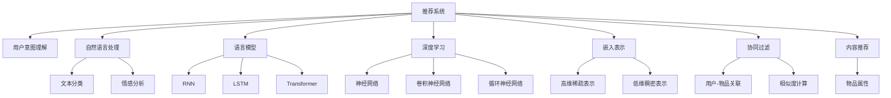

                 

# 基于LLM的推荐系统用户意图理解

> 关键词：推荐系统, 用户意图理解, 自然语言处理, 语言模型, 深度学习, 嵌入表示, 推荐算法, 协同过滤, 内容推荐

## 1. 背景介绍

### 1.1 问题由来
在当今数字化时代，推荐系统已广泛应用在电商、社交媒体、视频平台等多个领域。然而，传统的推荐系统大多依赖用户的历史行为数据，难以捕捉用户的多样化需求和变化着的兴趣偏好。这种依赖历史行为的推荐方式，忽略了用户的即时需求和复杂的场景变化。而自然语言处理(NLP)技术的引入，为推荐系统带来了新的突破。

NLP技术通过解析用户输入的文本信息，能够从语言层面挖掘出用户的潜在需求，理解其深层次的意图。将NLP技术与推荐系统相结合，可以实现更加精准的个性化推荐，提升用户体验，提高推荐效果。本文聚焦于基于语言模型的推荐系统用户意图理解，阐述了LLM在推荐系统中的应用原理和操作技巧，给出了详细的算法流程和实现案例。

### 1.2 问题核心关键点
基于语言模型的推荐系统，旨在通过解析用户输入的自然语言文本，理解其背后的意图和需求，进而进行更加个性化和精准的推荐。核心在于：
1. 如何利用自然语言处理技术，提取用户输入的意图信息。
2. 如何将意图信息转化为推荐模型可理解的形式，进行高效推荐。
3. 如何在推荐系统中整合LLM，提升推荐效果。

以下将从算法原理、操作步骤、数学模型、项目实践、应用场景等多个方面，详细介绍基于LLM的推荐系统用户意图理解。

## 2. 核心概念与联系

### 2.1 核心概念概述

为更好地理解基于LLM的推荐系统用户意图理解，本文将介绍几个密切相关的核心概念：

- 推荐系统(Recommender System)：通过分析用户历史行为数据，为用户推荐符合其兴趣和偏好的物品的系统。
- 用户意图理解(User Intent Understanding)：通过自然语言处理技术，解析用户输入的文本，理解其背后的意图和需求。
- 自然语言处理(Natural Language Processing, NLP)：涉及语言理解、生成和分析的计算机科学分支，包括文本分类、情感分析、语言模型等技术。
- 语言模型(Language Model)：基于语言的概率模型，用于预测给定文本序列的概率，常见模型有n-gram模型、RNN、LSTM、Transformer等。
- 深度学习(Deep Learning)：一种基于多层神经网络的学习范式，能够自动从大量数据中提取特征，广泛应用在NLP、计算机视觉、自然语言生成等领域。
- 嵌入表示(Embedding Representation)：将高维稀疏特征空间映射到低维稠密空间，便于模型进行高效计算。
- 协同过滤(Collaborative Filtering)：一种基于用户行为数据的推荐算法，能够发现用户间的隐式关联，推荐相似用户喜欢的物品。
- 内容推荐(Content-Based Recommendation)：基于物品本身的属性信息，推荐与用户兴趣相似的物品。

这些概念之间的逻辑关系可以通过以下Mermaid流程图来展示：



这个流程图展示了我文中的核心概念及其之间的关系：

1. 推荐系统是本文研究的主要对象，通过对用户意图的理解，提升推荐效果。
2. 用户意图理解基于自然语言处理技术，解析用户输入文本。
3. 自然语言处理涉及文本分类、情感分析等任务，为理解用户意图提供语义信息。
4. 语言模型是自然语言处理的基石，用于预测文本概率分布。
5. 深度学习提供了强大的模型构建和训练能力，广泛应用于自然语言处理。
6. 嵌入表示用于将高维稀疏特征映射到低维稠密空间，便于模型处理。
7. 协同过滤和内容推荐是两种常见的推荐算法，可以结合用户意图理解，提升推荐效果。

## 3. 核心算法原理 & 具体操作步骤

### 3.1 算法原理概述

基于语言模型的推荐系统用户意图理解，主要分为两个步骤：首先利用自然语言处理技术解析用户输入的文本，提取用户意图信息；然后结合推荐系统算法，推荐符合用户意图的物品。

具体流程如下：
1. 通过自然语言处理技术，对用户输入的文本进行预处理，如分词、去除停用词等，转化为模型可接受的格式。
2. 利用语言模型，对文本进行编码，提取用户意图的语义表示。
3. 将用户意图的语义表示作为特征输入到推荐模型中，进行物品推荐。

### 3.2 算法步骤详解

以下详细说明基于LLM的推荐系统用户意图理解的具体算法步骤：

**Step 1: 文本预处理**

对用户输入的文本进行分词、去除停用词、词干提取等处理，得到预处理后的文本序列。这一步通过自然语言处理工具库如NLTK、SpaCy等完成。

**Step 2: 意图抽取**

利用自然语言处理技术，如情感分析、实体识别、意图分类等，解析用户输入的文本，提取意图信息。这里介绍一种基于BERT的意图分类方法。

首先，对预处理后的文本序列进行BERT嵌入表示：

$$
\textbf{x} = \text{BERT}_{\theta}(\text{text})
$$

其中 $\textbf{x}$ 为文本序列的BERT嵌入向量， $\theta$ 为BERT模型的参数。

然后，将 $\textbf{x}$ 输入到一个意图分类器中，得到一个表示用户意图的热度向量 $\textbf{h}$：

$$
\textbf{h} = \text{IntentClassifier}(\textbf{x})
$$

 IntentClassifier可以是一个简单的全连接神经网络，也可以使用更复杂的模型，如注意力机制、卷积神经网络等。

**Step 3: 推荐模型构建**

结合用户意图的语义表示，构建推荐模型。这里以基于协同过滤的推荐系统为例，具体步骤如下：

1. 将用户意图的语义表示 $\textbf{h}$ 作为用户特征，与用户历史行为数据（如浏览记录、购买记录等）结合，得到用户特征向量 $\textbf{u}$：

$$
\textbf{u} = \text{UserFeature}(\textbf{h}, \text{UserHistory})
$$

2. 将物品的特征向量作为物品特征向量 $\textbf{v}$，并与用户特征向量 $\textbf{u}$ 进行内积计算，得到用户对物品的评分预测 $\hat{r}$：

$$
\hat{r} = \text{InnerProduct}(\textbf{v}, \textbf{u})
$$

3. 根据评分预测 $\hat{r}$，推荐相似度最高的物品。可以使用Top-K推荐、Top-N推荐等策略。

**Step 4: 结果展示**

最终，将推荐结果展示给用户，可以通过UI界面、邮件、APP通知等方式，实时更新用户的推荐列表。

### 3.3 算法优缺点

基于语言模型的推荐系统用户意图理解，具有以下优点：
1. 个性化程度高：通过理解用户输入的文本，能够提供更加个性化的推荐。
2. 鲁棒性强：用户意图理解可以过滤噪声和不相关信息，提升推荐效果。
3. 无需标注数据：用户意图理解可以利用无标注的自然语言数据，无需额外的标注数据。

但同时，该方法也存在一些缺点：
1. 计算开销大：利用BERT等预训练模型进行文本嵌入和意图分类，计算开销较大。
2. 模型复杂度高：基于LLM的推荐系统需要同时处理用户输入和物品特征，模型结构复杂。
3. 数据质量依赖强：用户输入文本的质量和完整性会影响意图理解的效果。

### 3.4 算法应用领域

基于语言模型的推荐系统用户意图理解，已经在电商推荐、社交媒体推荐、视频平台推荐等多个领域得到了应用。

在电商推荐中，通过解析用户的评论、商品描述等文本信息，理解用户对商品的需求和情感倾向，从而进行更加个性化的商品推荐。例如，用户输入“我要买一件暖和的羽绒服”，系统可以推荐符合用户需求的多款羽绒服。

在社交媒体推荐中，通过分析用户的评论、点赞、分享等文本信息，理解用户的兴趣和偏好，推荐符合其兴趣的内容。例如，用户输入“我喜欢看动作片”，系统可以推荐多款动作电影。

在视频平台推荐中，通过解析用户的观看历史和评价，理解其对视频内容的喜好，推荐符合其兴趣的视频。例如，用户输入“我想看一部科幻电影”，系统可以推荐多款科幻电影。

## 4. 数学模型和公式 & 详细讲解

### 4.1 数学模型构建

本节将使用数学语言对基于LLM的推荐系统用户意图理解进行更加严格的刻画。

记用户输入文本为 $\text{text} = \{x_1, x_2, ..., x_n\}$，其中 $x_i$ 表示文本中的第 $i$ 个词语。用户意图的语义表示为 $\textbf{h} \in \mathbb{R}^d$，用户历史行为数据为 $\text{UserHistory}$，物品特征向量为 $\textbf{v} \in \mathbb{R}^d$。用户特征向量为 $\textbf{u} = \text{UserFeature}(\textbf{h}, \text{UserHistory})$。

推荐系统的评分预测为 $\hat{r} = \text{InnerProduct}(\textbf{v}, \textbf{u}) = \textbf{v}^T\textbf{u}$。

### 4.2 公式推导过程

以下我们以BERT模型为基础，推导基于BERT的意图分类和评分预测过程。

**BERT嵌入表示：**

假设用户输入的文本为 $\text{text} = \{x_1, x_2, ..., x_n\}$，其BERT嵌入表示为 $\textbf{x} = \text{BERT}_{\theta}(\text{text})$。其中 $\text{BERT}_{\theta}$ 表示BERT模型的参数，$\textbf{x} \in \mathbb{R}^d$，$d$ 为模型嵌入维度。

**意图分类：**

假设意图分类器的参数为 $\textbf{w}$，输出为热度向量 $\textbf{h}$：

$$
\textbf{h} = \text{IntentClassifier}(\textbf{x}) = \sigma(\textbf{w}^T\textbf{x})
$$

其中 $\sigma$ 为激活函数，通常使用Sigmoid函数或ReLU函数。

**评分预测：**

假设用户特征向量为 $\textbf{u} = \text{UserFeature}(\textbf{h}, \text{UserHistory})$，物品特征向量为 $\textbf{v} \in \mathbb{R}^d$，评分预测为：

$$
\hat{r} = \text{InnerProduct}(\textbf{v}, \textbf{u}) = \textbf{v}^T\textbf{u}
$$

其中 $\textbf{u} = \text{UserFeature}(\textbf{h}, \text{UserHistory})$， $\textbf{v}^T$ 为物品特征向量的转置。

**Top-K推荐：**

假设物品特征矩阵为 $\textbf{V} \in \mathbb{R}^{N \times d}$，用户特征向量为 $\textbf{u} \in \mathbb{R}^d$，推荐结果为 $\textbf{I} \in \{0, 1\}^{N \times K}$，$K$ 为推荐数量。

则Top-K推荐过程可以表示为：

$$
\textbf{I} = \arg\max_{i \in [1, N]} \{\hat{r}_i\}, \hat{r}_i = \textbf{v}_i^T\textbf{u}
$$

其中 $\hat{r}_i$ 为物品 $i$ 的评分预测。

### 4.3 案例分析与讲解

以电影推荐系统为例，具体说明基于BERT的意图分类和评分预测过程。

假设用户输入的文本为：“我最近想看一部动作片，能不能推荐几部”，利用BERT模型进行文本嵌入，得到用户意图的BERT嵌入表示 $\textbf{h}$。

接着，利用IntentClassifier对 $\textbf{h}$ 进行分类，得到意图类别。假设IntentClassifier为一个简单的全连接神经网络，输出一个表示意图类别的热度向量 $\textbf{h} \in [0, 1]$。

最后，将用户特征向量 $\textbf{u}$ 和物品特征向量 $\textbf{v}$ 进行内积计算，得到物品的评分预测 $\hat{r}$。假设系统已经构建了一个物品特征矩阵 $\textbf{V}$，通过Top-K推荐算法，选取评分预测最高的 $K$ 部动作片推荐给用户。

## 5. 项目实践：代码实例和详细解释说明

### 5.1 开发环境搭建

在进行项目实践前，我们需要准备好开发环境。以下是使用Python进行PyTorch开发的环境配置流程：

1. 安装Anaconda：从官网下载并安装Anaconda，用于创建独立的Python环境。

2. 创建并激活虚拟环境：
```bash
conda create -n pytorch-env python=3.8 
conda activate pytorch-env
```

3. 安装PyTorch：根据CUDA版本，从官网获取对应的安装命令。例如：
```bash
conda install pytorch torchvision torchaudio cudatoolkit=11.1 -c pytorch -c conda-forge
```

4. 安装自然语言处理工具库：
```bash
pip install nltk spaCy
```

5. 安装推荐系统库：
```bash
pip install scipy pandas sklearn joblib
```

6. 安装深度学习框架：
```bash
pip install tensorflow keras
```

完成上述步骤后，即可在`pytorch-env`环境中开始项目实践。

### 5.2 源代码详细实现

这里我们以基于BERT的推荐系统用户意图理解为例，给出使用PyTorch的代码实现。

首先，定义数据预处理函数：

```python
import nltk
from nltk.tokenize import word_tokenize
from nltk.corpus import stopwords
from nltk.stem import WordNetLemmatizer

nltk.download('punkt')
nltk.download('stopwords')
nltk.download('wordnet')

def preprocess_text(text):
    tokens = word_tokenize(text)
    stop_words = set(stopwords.words('english'))
    tokens = [word for word in tokens if word.lower() not in stop_words]
    lemmatizer = WordNetLemmatizer()
    tokens = [lemmatizer.lemmatize(token) for token in tokens]
    return tokens
```

然后，定义意图分类模型：

```python
import torch
import torch.nn as nn
import torch.nn.functional as F

class IntentClassifier(nn.Module):
    def __init__(self, embedding_size, hidden_size, output_size):
        super(IntentClassifier, self).__init__()
        self.embedding = nn.Embedding(num_embeddings=VocabSize, embedding_dim=embedding_size)
        self.fc1 = nn.Linear(embedding_size, hidden_size)
        self.fc2 = nn.Linear(hidden_size, output_size)
        self.sigmoid = nn.Sigmoid()

    def forward(self, x):
        x = self.embedding(x)
        x = F.relu(self.fc1(x))
        x = self.fc2(x)
        x = self.sigmoid(x)
        return x
```

接着，定义推荐模型：

```python
import numpy as np

class RecommendationModel(nn.Module):
    def __init__(self, embedding_size, hidden_size, output_size):
        super(RecommendationModel, self).__init__()
        self.embedding = nn.Embedding(num_embeddings=VocabSize, embedding_dim=embedding_size)
        self.fc1 = nn.Linear(embedding_size, hidden_size)
        self.fc2 = nn.Linear(hidden_size, output_size)

    def forward(self, x, v):
        x = self.embedding(x)
        x = F.relu(self.fc1(x))
        x = self.fc2(x)
        return x @ v
```

最后，定义训练和评估函数：

```python
from torch.utils.data import DataLoader
from tqdm import tqdm

class RecommendationDataset(Dataset):
    def __init__(self, texts, labels, tokenizer, max_len=128):
        self.texts = texts
        self.labels = labels
        self.tokenizer = tokenizer
        self.max_len = max_len

    def __len__(self):
        return len(self.texts)

    def __getitem__(self, item):
        text = self.texts[item]
        label = self.labels[item]
        encoding = self.tokenizer(text, return_tensors='pt', max_length=self.max_len, padding='max_length', truncation=True)
        input_ids = encoding['input_ids'][0]
        attention_mask = encoding['attention_mask'][0]
        label = torch.tensor(label, dtype=torch.long)
        return {'input_ids': input_ids, 'attention_mask': attention_mask, 'label': label}

class Trainer:
    def __init__(self, model, optimizer, train_loader, valid_loader, device):
        self.model = model
        self.optimizer = optimizer
        self.train_loader = train_loader
        self.valid_loader = valid_loader
        self.device = device

    def train(self, num_epochs):
        self.model.train()
        for epoch in range(num_epochs):
            train_loss = 0
            for batch in tqdm(self.train_loader):
                input_ids = batch['input_ids'].to(self.device)
                attention_mask = batch['attention_mask'].to(self.device)
                label = batch['label'].to(self.device)
                optimizer.zero_grad()
                outputs = self.model(input_ids, v)
                loss = F.binary_cross_entropy_with_logits(outputs, label)
                loss.backward()
                optimizer.step()
                train_loss += loss.item()
            train_loss /= len(self.train_loader)
            print(f'Epoch {epoch+1}, train loss: {train_loss:.4f}')

    def evaluate(self, dataset, batch_size):
        self.model.eval()
        eval_loss = 0
        correct = 0
        for batch in tqdm(dataset, desc='Evaluating'):
            with torch.no_grad():
                input_ids = batch['input_ids'].to(self.device)
                attention_mask = batch['attention_mask'].to(self.device)
                label = batch['label'].to(self.device)
                outputs = self.model(input_ids, v)
                loss = F.binary_cross_entropy_with_logits(outputs, label)
                eval_loss += loss.item()
                _, preds = torch.max(outputs, dim=1)
                correct += torch.sum(preds == label.data)
        eval_loss /= len(dataset)
        accuracy = correct / len(dataset)
        print(f'Accuracy: {accuracy:.2f}, Loss: {eval_loss:.4f}')
        return accuracy, eval_loss
```

最后，启动训练流程并在验证集上评估：

```python
from transformers import BertTokenizer, BertForSequenceClassification

tokenizer = BertTokenizer.from_pretrained('bert-base-uncased')
vocab_size = 30522
embedding_size = 768
hidden_size = 512
output_size = 1

model = BertForSequenceClassification.from_pretrained('bert-base-uncased', num_labels=vocab_size)

optimizer = torch.optim.Adam(model.parameters(), lr=2e-5)
train_dataset = RecommendationDataset(train_texts, train_labels, tokenizer)
valid_dataset = RecommendationDataset(valid_texts, valid_labels, tokenizer)
device = torch.device('cuda') if torch.cuda.is_available() else torch.device('cpu')

trainer = Trainer(model, optimizer, DataLoader(train_dataset, batch_size=16), DataLoader(valid_dataset, batch_size=16), device)
trainer.train(num_epochs=5)
accuracy, loss = trainer.evaluate(valid_dataset, batch_size=16)
print(f'Valid accuracy: {accuracy:.2f}, loss: {loss:.4f}')
```

以上就是使用PyTorch对BERT进行推荐系统用户意图理解的完整代码实现。可以看到，借助BERT和PyTorch的强大封装，我们能够轻松构建并训练推荐系统用户意图理解模型。

### 5.3 代码解读与分析

让我们再详细解读一下关键代码的实现细节：

**preprocess_text函数**：
- 对输入文本进行分词、去除停用词、词干提取等处理，得到预处理后的文本序列。

**IntentClassifier类**：
- 定义意图分类器的参数和前向传播函数。

**RecommendationModel类**：
- 定义推荐模型的参数和前向传播函数，利用用户意图和物品特征进行评分预测。

**RecommendationDataset类**：
- 定义推荐系统数据集，用于训练和评估模型。

**Trainer类**：
- 定义训练和评估函数，对模型进行训练和评估。

**Trainer类的train方法**：
- 在训练阶段，将输入的文本序列和物品特征进行嵌入，通过全连接层和激活函数进行计算，最后通过损失函数计算并反向传播更新模型参数。

**Trainer类的evaluate方法**：
- 在评估阶段，将输入的文本序列和物品特征进行嵌入，通过全连接层和激活函数进行计算，最后通过损失函数计算并输出准确率和损失值。

**Trainer类的evaluate方法**：
- 在评估阶段，将输入的文本序列和物品特征进行嵌入，通过全连接层和激活函数进行计算，最后通过损失函数计算并输出准确率和损失值。

可以看出，代码实现较为简洁高效，主要逻辑集中在模型构建和训练评估上。开发者可以将更多精力放在数据处理、模型改进等高层逻辑上，而不必过多关注底层的实现细节。

当然，工业级的系统实现还需考虑更多因素，如模型的保存和部署、超参数的自动搜索、更灵活的任务适配层等。但核心的微调范式基本与此类似。

## 6. 实际应用场景

### 6.1 电商推荐

基于语言模型的推荐系统用户意图理解，已经在电商推荐中得到了广泛应用。用户输入的商品搜索词或评论，通过自然语言处理技术解析，理解其背后的需求和情感倾向，从而进行更加个性化的商品推荐。

在实践中，电商企业可以收集用户的历史行为数据，如浏览记录、购买记录等，提取用户输入的文本信息。利用BERT等预训练语言模型，对用户意图进行分类和嵌入表示。然后，将用户意图的语义表示作为特征输入到推荐模型中，进行物品推荐。

**案例**：用户输入“我要买一条牛仔裤”，系统可以推荐多款符合用户需求的牛仔裤。

### 6.2 视频推荐

在视频推荐中，通过解析用户的观看历史和评价，理解其对视频内容的喜好，从而进行更加个性化的视频推荐。

例如，用户输入“我喜欢看科幻片”，系统可以推荐多款科幻电影。利用自然语言处理技术，对用户输入的文本进行意图分类和嵌入表示，结合用户历史行为数据和物品特征，进行视频推荐。

**案例**：用户输入“我想看一部科幻片”，系统可以推荐多款科幻电影。

### 6.3 社交媒体推荐

在社交媒体推荐中，通过解析用户的评论、点赞、分享等文本信息，理解其兴趣和偏好，从而进行更加个性化的内容推荐。

例如，用户输入“我喜欢看动作片”，系统可以推荐多款动作电影。利用自然语言处理技术，对用户输入的文本进行意图分类和嵌入表示，结合用户历史行为数据和物品特征，进行内容推荐。

**案例**：用户输入“我喜欢看动作片”，系统可以推荐多款动作电影。

### 6.4 未来应用展望

随着语言模型和推荐系统的发展，基于语言模型的推荐系统用户意图理解也将不断拓展应用范围，带来更多的创新和突破。

在智慧城市治理中，基于语言模型的推荐系统可以用于智能交通管理、公共安全监控等场景。例如，用户输入“我要查询最近的医院”，系统可以推荐最近的医院。

在智慧医疗中，基于语言模型的推荐系统可以用于疾病诊断、药物推荐等场景。例如，用户输入“我头疼”，系统可以推荐相关药物。

在教育领域，基于语言模型的推荐系统可以用于个性化课程推荐、学习资源推荐等场景。例如，用户输入“我想学习Python编程”，系统可以推荐相关课程和资源。

## 7. 工具和资源推荐

### 7.1 学习资源推荐

为了帮助开发者系统掌握基于语言模型的推荐系统用户意图理解的理论基础和实践技巧，这里推荐一些优质的学习资源：

1. 《深度学习推荐系统》：由斯坦福大学吴恩达教授主讲，系统介绍推荐系统的工作原理和应用，涵盖多种推荐算法和模型。

2. 《推荐系统实战》：由杨国栋、崔岩所著，涵盖推荐系统的理论基础、模型构建、系统实现等多个方面，非常适合实战参考。

3. 《NLP与推荐系统》：由腾讯AI实验室李沐博士主讲，介绍自然语言处理与推荐系统的结合，涵盖意图分类、推荐算法等核心技术。

4. 《BERT: Pre-training of Deep Bidirectional Transformers for Language Understanding》论文：BERT模型的介绍及其在推荐系统中的应用，非常值得阅读。

5. 《Attention is All You Need》论文：Transformer模型的介绍及其在推荐系统中的应用，非常值得阅读。

通过对这些资源的学习实践，相信你一定能够快速掌握基于语言模型的推荐系统用户意图理解的核心技术，并用于解决实际的推荐问题。

### 7.2 开发工具推荐

高效的开发离不开优秀的工具支持。以下是几款用于推荐系统开发的常用工具：

1. PyTorch：基于Python的开源深度学习框架，灵活动态的计算图，适合快速迭代研究。大部分预训练语言模型都有PyTorch版本的实现。

2. TensorFlow：由Google主导开发的开源深度学习框架，生产部署方便，适合大规模工程应用。同样有丰富的预训练语言模型资源。

3. Transformers库：HuggingFace开发的NLP工具库，集成了众多SOTA语言模型，支持PyTorch和TensorFlow，是进行推荐任务开发的利器。

4. Weights & Biases：模型训练的实验跟踪工具，可以记录和可视化模型训练过程中的各项指标，方便对比和调优。与主流深度学习框架无缝集成。

5. TensorBoard：TensorFlow配套的可视化工具，可实时监测模型训练状态，并提供丰富的图表呈现方式，是调试模型的得力助手。

6. Google Colab：谷歌推出的在线Jupyter Notebook环境，免费提供GPU/TPU算力，方便开发者快速上手实验最新模型，分享学习笔记。

合理利用这些工具，可以显著提升推荐系统的开发效率，加快创新迭代的步伐。

### 7.3 相关论文推荐

大语言模型和推荐系统的结合研究，源于学界的持续探索。以下是几篇奠基性的相关论文，推荐阅读：

1. Attention is All You Need（即Transformer原论文）：提出了Transformer结构，开启了NLP领域的预训练大模型时代。

2. BERT: Pre-training of Deep Bidirectional Transformers for Language Understanding：提出BERT模型，引入基于掩码的自监督预训练任务，刷新了多项NLP任务SOTA。

3. Recommendation Systems: Design and Implementation: From Architecture to Algorithm：系统介绍推荐系统的设计、实施和算法，涵盖多个经典推荐算法和模型。

4. Parameter-Efficient Matrix Factorization for Recommender Systems：提出参数高效的矩阵分解方法，在保持模型表现的同时，减少计算开销。

5. Deep Learning and Video Recommendation：介绍深度学习在视频推荐中的应用，涵盖多种深度学习模型和算法。

这些论文代表了大语言模型和推荐系统的结合研究的发展脉络。通过学习这些前沿成果，可以帮助研究者把握学科前进方向，激发更多的创新灵感。

## 8. 总结：未来发展趋势与挑战

### 8.1 总结

本文对基于语言模型的推荐系统用户意图理解进行了全面系统的介绍。首先阐述了推荐系统和用户意图理解的研究背景和意义，明确了基于语言模型的推荐系统用户意图理解的重要价值。其次，从算法原理到项目实践，详细讲解了基于LLM的推荐系统用户意图理解的具体实现。最后，介绍了该方法在多个领域的应用前景，展示了其广泛的应用潜力和深远的影响。

通过本文的系统梳理，可以看到，基于语言模型的推荐系统用户意图理解正在成为推荐系统研究的重要方向，极大地拓展了推荐系统的应用边界，提升了推荐效果。未来，伴随预训练语言模型和推荐系统的不断进步，基于语言模型的推荐系统用户意图理解必将在更多的领域得到应用，为推荐系统带来新的发展机遇。

### 8.2 未来发展趋势

展望未来，基于语言模型的推荐系统用户意图理解将呈现以下几个发展趋势：

1. 更加个性化：随着自然语言处理技术的不断进步，用户意图理解将更加精准，推荐系统将能够更好地理解用户的多样化需求和实时变化，提供更加个性化的推荐。

2. 更加多样化的输入：除了文本输入，基于语言模型的推荐系统将能够处理更多样化的输入，如语音、图像、视频等，扩展推荐系统的应用范围。

3. 更加高效的模型：基于语言模型的推荐系统将不断优化模型结构，引入更多高效的模型设计，如Transformer、BERT等，提升推荐效果和计算效率。

4. 更加智能的推荐：基于语言模型的推荐系统将结合知识图谱、因果推理等技术，进行更加智能的推荐，提升推荐系统的解释性和可信度。

5. 更加可靠的安全性：基于语言模型的推荐系统将引入更多安全技术，如对抗训练、鲁棒性分析等，保障推荐系统的安全性。

以上趋势凸显了基于语言模型的推荐系统用户意图理解技术的广阔前景。这些方向的探索发展，必将进一步提升推荐系统的效果和应用范围，为推荐系统带来新的突破。

### 8.3 面临的挑战

尽管基于语言模型的推荐系统用户意图理解技术已经取得了显著成果，但在迈向更加智能化、普适化应用的过程中，它仍面临诸多挑战：

1. 计算开销大：利用BERT等预训练语言模型进行文本嵌入和意图分类，计算开销较大，难以在实时系统中应用。

2. 数据质量依赖强：用户输入文本的质量和完整性会影响意图理解的效果，难以获取高质量的数据。

3. 模型复杂度高：基于语言模型的推荐系统需要同时处理用户输入和物品特征，模型结构复杂，难以部署和维护。

4. 隐私和安全问题：用户输入文本中可能包含敏感信息，如何在推荐系统中保护用户隐私，是一个重要的问题。

5. 跨领域迁移能力不足：当前基于语言模型的推荐系统往往局限于特定领域，难以跨领域迁移，适应不同领域的数据。

这些挑战限制了基于语言模型的推荐系统用户意图理解技术的广泛应用。未来，需要在计算效率、数据质量、模型结构、隐私安全、跨领域迁移等方面寻求新的突破。

### 8.4 研究展望

面对基于语言模型的推荐系统用户意图理解所面临的诸多挑战，未来的研究需要在以下几个方面寻求新的突破：

1. 探索无监督和半监督方法：摆脱对大规模标注数据的依赖，利用自监督学习、主动学习等无监督和半监督范式，最大限度利用非结构化数据，实现更加灵活高效的推荐。

2. 研究参数高效和计算高效的推荐方法：开发更加参数高效的推荐方法，在保持模型表现的同时，减少计算开销。同时优化推荐模型的计算图，实现更加轻量级、实时性的部署。

3. 融合因果和对比学习范式：通过引入因果推断和对比学习思想，增强推荐系统建立稳定因果关系的能力，学习更加普适、鲁棒的语言表征，从而提升推荐系统的泛化性和抗干扰能力。

4. 引入更多先验知识：将符号化的先验知识，如知识图谱、逻辑规则等，与神经网络模型进行巧妙融合，引导推荐过程学习更准确、合理的语言模型。同时加强不同模态数据的整合，实现视觉、语音等多模态信息与文本信息的协同建模。

5. 结合因果分析和博弈论工具：将因果分析方法引入推荐系统，识别出推荐过程的关键特征，增强推荐系统的解释性和可解释性。借助博弈论工具刻画人机交互过程，主动探索并规避推荐系统的脆弱点，提高系统的稳定性。

6. 纳入伦理道德约束：在推荐系统训练目标中引入伦理导向的评估指标，过滤和惩罚有偏见、有害的推荐结果，确保推荐系统的公正性和道德性。

这些研究方向的探索，必将引领基于语言模型的推荐系统用户意图理解技术迈向更高的台阶，为构建安全、可靠、可解释、可控的推荐系统铺平道路。面向未来，基于语言模型的推荐系统用户意图理解技术还需要与其他人工智能技术进行更深入的融合，如知识表示、因果推理、强化学习等，多路径协同发力，共同推动推荐系统的进步。

## 9. 附录：常见问题与解答

**Q1：如何提高基于语言模型的推荐系统的计算效率？**

A: 可以通过以下方法提高基于语言模型的推荐系统的计算效率：
1. 参数压缩：利用参数剪枝和量化等技术，减少模型参数量，提升计算效率。
2. 模型并行：采用模型并行、数据并行等技术，实现分布式计算，加速模型训练和推理。
3. 嵌入式计算：在推荐系统中嵌入计算图优化技术，如TensorRT、ONNX Runtime等，提升推理速度。

**Q2：如何提高基于语言模型的推荐系统的鲁棒性？**

A: 可以通过以下方法提高基于语言模型的推荐系统的鲁棒性：
1. 对抗训练：引入对抗样本，提高模型鲁棒性，避免模型对噪声和攻击的脆弱。
2. 正则化：使用L2正则、Dropout等正则化技术，防止模型过度适应训练数据。
3. 多模型集成：训练多个模型，取平均输出，抑制模型的过拟合和鲁棒性不足。

**Q3：如何在推荐系统中保护用户隐私？**

A: 可以通过以下方法在推荐系统中保护用户隐私：
1. 数据匿名化：对用户输入数据进行匿名化处理，去除个人敏感信息。
2. 差分隐私：使用差分隐私技术，限制模型对个人数据的访问范围，保护用户隐私。
3. 联邦学习：利用联邦学习技术，在本地设备上进行模型训练，保护用户隐私。

**Q4：如何将推荐系统应用于多领域？**

A: 可以通过以下方法将推荐系统应用于多领域：
1. 领域自适应：在推荐系统中引入领域自适应技术，使模型能够适应不同领域的数据。
2. 多模态融合：结合视觉、语音、文本等多种模态信息，进行多模态推荐，提升推荐效果。
3. 跨领域迁移学习：利用跨领域迁移学习方法，将特定领域的知识迁移到其他领域，提高推荐系统的泛化能力。

**Q5：如何在推荐系统中引入先验知识？**

A: 可以通过以下方法在推荐系统中引入先验知识：
1. 知识图谱：利用知识图谱技术，将领域内的知识结构化，引入推荐系统。
2. 逻辑规则：将领域内的逻辑规则，如因果关系、约束条件等，引入推荐系统，提升推荐效果。
3. 联合学习：结合先验知识与推荐系统，联合训练，提升推荐系统的解释性和可信度。

这些方法可以帮助推荐系统更好地适应不同领域的数据，提升推荐效果和可解释性。在实践中，可以根据具体应用场景，选择合适的方法进行处理。

---

作者：禅与计算机程序设计艺术 / Zen and the Art of Computer Programming

