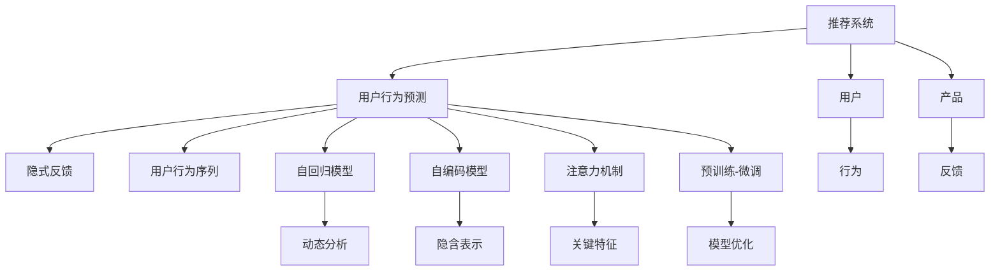

                 

# 基于LLM的推荐系统用户行为预测

> 关键词：推荐系统,用户行为预测,大语言模型,自回归模型,自编码模型,隐式反馈,行为序列,注意力机制,预训练,微调

## 1. 背景介绍

### 1.1 问题由来
推荐系统是互联网应用中至关重要的一环，通过分析用户的历史行为数据，为用户推荐最相关的产品或内容。传统的推荐系统主要依靠用户明示的评分或点击等显式反馈进行推荐，但这些反馈数据往往稀疏且不均衡，无法全面反映用户真实兴趣和偏好。

近年来，随着深度学习技术的发展，基于隐式反馈的用户行为预测成为了推荐系统的热门研究方向。通过挖掘用户在网站、电商、社交媒体等平台上的浏览、点击、评分等行为，并结合时间序列分析等方法，能够精准预测用户对未接触过的产品或内容可能产生的兴趣，从而实现更个性化、精准的推荐。

大语言模型（Large Language Models, LLMs）的崛起，为推荐系统带来了新的思路和突破点。LLMs通过在大规模无标签文本数据上进行预训练，获得了强大的自然语言理解能力和知识图谱构建能力，可以处理和分析更复杂、语义更丰富的用户行为数据。

本文将探讨如何利用大语言模型进行用户行为预测，构建基于LLM的推荐系统，以期为推荐系统领域带来新思路。

### 1.2 问题核心关键点
本文主要研究以下几个核心问题：

- 如何设计有效的用户行为序列嵌入方法，从而捕捉用户行为的时间动态性和上下文相关性？
- 如何利用预训练语言模型，在用户行为序列上进行微调，提升行为预测准确率？
- 如何构建基于LLM的推荐系统，并评估其性能？

## 2. 核心概念与联系

### 2.1 核心概念概述

为了更好地理解基于LLM的推荐系统用户行为预测，我们将介绍几个相关的重要概念：

- 推荐系统（Recommendation System, RS）：通过分析用户行为数据，为用户推荐最相关内容或产品的系统。
- 用户行为预测（User Behavior Prediction）：通过分析用户历史行为数据，预测用户对未接触过的产品或内容可能产生的兴趣或评分等行为。
- 隐式反馈（Implicit Feedback）：用户没有直接提供反馈的情况下，通过行为数据推断用户兴趣和偏好，如浏览、点击、评分等。
- 大语言模型（Large Language Models, LLMs）：通过大规模无标签文本数据进行预训练，学习到丰富语言知识和常识的模型。
- 自回归模型（Auto-Regressive Model）：如LSTM、GRU等，通过时间序列分析用户行为，捕捉行为序列的动态变化。
- 自编码模型（Auto-Encoder Model）：通过重构用户行为序列，学习行为序列的隐含表示。
- 注意力机制（Attention Mechanism）：用于对行为序列的不同时间段给予不同权重的机制，捕捉行为序列的关键特征。
- 预训练-微调（Pre-training & Fine-Tuning）：先在大规模无标签数据上进行预训练，再在小规模标注数据上进行微调的方法。

这些核心概念之间的关系可以通过以下Mermaid流程图来展示：



这个流程图展示了推荐系统用户行为预测的核心环节：

1. 从推荐系统和用户行为序列出发，通过隐式反馈获取用户行为数据。
2. 对用户行为序列进行建模，利用自回归、自编码等模型捕捉行为序列的动态性和隐含特征。
3. 应用注意力机制，对行为序列的不同时间段进行加权，捕捉行为序列的关键特征。
4. 使用预训练-微调方法，在大规模无标签数据上进行预训练，在用户行为序列上微调模型，提升预测效果。

## 3. 核心算法原理 & 具体操作步骤
### 3.1 算法原理概述

基于LLM的用户行为预测，本质上是一个通过序列数据预测用户行为的机器学习问题。其核心思想是：利用LLM在无标签文本数据上的预训练能力，捕捉用户行为序列的动态性和上下文相关性，然后在行为序列上进行微调，提升模型预测用户行为的能力。

具体来说，我们将用户行为序列视为一个时间序列数据，通过自回归模型或自编码模型捕捉行为序列的动态性和隐含特征。然后，将行为序列输入到预训练的LLM中，利用注意力机制对序列中不同时间点进行加权，捕捉序列的关键特征。最后，通过微调LLM，使其适应具体推荐任务的需求，提升行为预测的准确率。

### 3.2 算法步骤详解

基于LLM的推荐系统用户行为预测一般包括以下几个关键步骤：

**Step 1: 数据预处理**
- 收集用户的行为数据，包括浏览记录、点击记录、评分记录等，将其转化为时间序列数据。
- 对行为序列进行预处理，如去除重复、无效行为，对缺失数据进行补齐或删除。

**Step 2: 模型选择与构建**
- 选择合适的自回归模型或自编码模型，构建用户行为序列的隐含表示。
- 引入注意力机制，对行为序列的不同时间段进行加权，捕捉关键特征。
- 选择预训练的LLM，如BERT、GPT等，构建用户行为序列嵌入。

**Step 3: 预训练与微调**
- 在大规模无标签文本数据上进行预训练，学习语言的通用表示。
- 在用户行为序列上进行微调，调整模型参数以适应具体推荐任务。
- 设置适当的学习率、批大小、迭代轮数等超参数，优化模型性能。

**Step 4: 模型评估与部署**
- 在验证集上评估微调后模型的性能，计算准确率、召回率、F1分数等指标。
- 将微调后的模型应用于实际推荐系统，实时处理用户行为数据，生成推荐结果。
- 持续收集用户反馈数据，定期重新微调模型，以适应数据分布的变化。

### 3.3 算法优缺点

基于LLM的用户行为预测方法具有以下优点：

- 可以处理更加复杂、语义丰富的用户行为数据，提升推荐的精度和效果。
- 利用预训练-微调方法，可以在小规模标注数据上获得良好的预测效果。
- 通过引入注意力机制，可以捕捉用户行为序列的关键特征，提升模型的泛化能力。
- 可以与各种推荐算法结合，实现多模态、跨领域的推荐应用。

同时，该方法也存在一些局限性：

- 对大规模标注数据的需求较高，数据收集和处理成本较大。
- 预训练和微调过程对计算资源要求较高，需要高性能的GPU或TPU设备。
- 模型的可解释性较差，难以理解内部工作机制和决策逻辑。
- 模型的鲁棒性有待提升，对于噪声和异常行为数据可能存在敏感性。

尽管存在这些局限性，但基于LLM的推荐系统用户行为预测方法仍具有巨大的应用潜力，在电商、社交媒体、视频流媒体等场景中具有广泛的应用前景。

### 3.4 算法应用领域

基于LLM的推荐系统用户行为预测方法在多个领域具有广泛的应用：

- 电商推荐：通过分析用户的浏览、点击、购买记录，预测用户对未接触过的商品可能产生的兴趣，实现个性化推荐。
- 社交媒体推荐：通过分析用户的点赞、评论、分享等行为，预测用户对新内容可能产生的互动行为，提升内容曝光率。
- 视频流媒体推荐：通过分析用户的观看记录、评分、评论等行为，预测用户对未接触过的视频可能产生的观看行为，提升用户留存率。
- 新闻推荐：通过分析用户的阅读记录、点赞、分享等行为，预测用户对未接触过的新闻可能产生的阅读行为，提升内容点击率。

此外，在旅游、医疗、教育等垂直领域，基于LLM的用户行为预测也有广泛的应用前景。通过利用用户行为数据，预测用户对不同产品或服务的兴趣，实现更精准的推荐，提升用户满意度和品牌忠诚度。

## 4. 数学模型和公式 & 详细讲解 & 举例说明

### 4.1 数学模型构建

在本节中，我们将详细讲解基于LLM的推荐系统用户行为预测的数学模型。

假设用户的行为序列为 $X=\{x_1, x_2, \ldots, x_n\}$，其中 $x_i$ 表示用户在第 $i$ 次行为。假设存在一个隐含的向量 $H_i \in \mathbb{R}^d$，表示用户在第 $i$ 次行为中的隐含特征。则行为序列的隐含表示 $H$ 可以表示为：

$$
H = \{H_1, H_2, \ldots, H_n\}
$$

我们将 $H$ 输入到预训练的LLM中，得到用户行为序列的嵌入表示 $E$。假设LLM的输出层大小为 $m$，则 $E$ 的大小为 $(m, n, d)$，其中 $n$ 为行为序列长度。

为了捕捉行为序列的关键特征，我们引入注意力机制，对 $H$ 中不同时间点的隐含特征进行加权。设注意力权重为 $\alpha_i \in [0, 1]$，则加权后的隐含特征表示 $W$ 可以表示为：

$$
W = \{\alpha_1H_1, \alpha_2H_2, \ldots, \alpha_nH_n\}
$$

其中 $\alpha_i$ 可以表示为：

$$
\alpha_i = \frac{e_i^\top A e_{i-1}}{\sum_{j=1}^n e_j^\top A e_{j-1}}
$$

其中 $A$ 为注意力矩阵，$e_i$ 为行为序列中第 $i$ 个时间点的嵌入表示。

### 4.2 公式推导过程

为了进一步提升用户行为预测的精度，我们引入预训练-微调方法，在用户行为序列上进行微调。假设预训练模型为 $M_{\theta}$，微调后的模型为 $\hat{M}$，微调的目标是最小化损失函数 $\mathcal{L}$：

$$
\mathcal{L}(\hat{M}) = \frac{1}{N} \sum_{i=1}^N \ell(\hat{M}(W_i), y_i)
$$

其中 $W_i$ 为第 $i$ 个用户行为序列的加权隐含特征表示，$y_i$ 为该用户的行为标签，$\ell$ 为损失函数，如交叉熵损失、均方误差损失等。

根据链式法则，微调模型 $\hat{M}$ 的参数更新公式为：

$$
\theta \leftarrow \theta - \eta \nabla_{\theta}\mathcal{L}(\hat{M})
$$

其中 $\eta$ 为学习率，$\nabla_{\theta}\mathcal{L}(\hat{M})$ 为损失函数对参数 $\theta$ 的梯度，可通过反向传播算法高效计算。

### 4.3 案例分析与讲解

假设我们有一个电商推荐系统，希望预测用户对未接触过的商品的兴趣。我们收集了用户过去半年内的浏览、点击和购买记录，将其转化为行为序列 $X$。然后，我们选择BERT模型作为预训练的LLM，构建用户行为序列嵌入 $E$。

我们假设每个商品都有一个标签 $y$，表示用户是否购买了该商品。在微调BERT模型时，我们使用交叉熵损失函数，计算预测输出与真实标签之间的差异：

$$
\ell(\hat{M}(W_i), y_i) = -y_i \log \hat{y}_i - (1-y_i) \log (1-\hat{y}_i)
$$

其中 $\hat{y}_i$ 为模型对用户行为序列的预测结果，$y_i$ 为该用户的行为标签。

我们将行为序列 $X$ 作为输入，利用注意力机制对 $X$ 中不同时间点的隐含特征进行加权，得到加权隐含特征表示 $W$。然后，将 $W$ 输入到BERT模型中，得到行为序列嵌入 $E$。最后，在行为序列嵌入 $E$ 上应用交叉熵损失函数，更新BERT模型的参数。

## 5. 项目实践：代码实例和详细解释说明
### 5.1 开发环境搭建

在进行推荐系统用户行为预测实践前，我们需要准备好开发环境。以下是使用Python进行PyTorch开发的环境配置流程：

1. 安装Anaconda：从官网下载并安装Anaconda，用于创建独立的Python环境。

2. 创建并激活虚拟环境：
```bash
conda create -n pytorch-env python=3.8 
conda activate pytorch-env
```

3. 安装PyTorch：根据CUDA版本，从官网获取对应的安装命令。例如：
```bash
conda install pytorch torchvision torchaudio cudatoolkit=11.1 -c pytorch -c conda-forge
```

4. 安装Transformers库：
```bash
pip install transformers
```

5. 安装各类工具包：
```bash
pip install numpy pandas scikit-learn matplotlib tqdm jupyter notebook ipython
```

完成上述步骤后，即可在`pytorch-env`环境中开始推荐系统用户行为预测的实践。

### 5.2 源代码详细实现

这里我们以一个简单的电商推荐系统为例，使用BERT模型进行用户行为预测。

首先，定义用户行为数据类：

```python
import pandas as pd
from transformers import BertTokenizer

class UserBehaviorData:
    def __init__(self, path):
        self.data = pd.read_csv(path)
        self.tokenizer = BertTokenizer.from_pretrained('bert-base-cased')
        self.max_len = 512

    def encode(self, df):
        encoded_data = []
        for i, row in df.iterrows():
            text = ' '.join(row['items'])
            encoded = self.tokenizer.encode(text, max_length=self.max_len, truncation=True, padding='max_length')
            encoded_data.append(encoded)
        return encoded_data
```

然后，定义模型类：

```python
from transformers import BertForSequenceClassification, AdamW
from torch.utils.data import Dataset, DataLoader

class UserBehaviorModel:
    def __init__(self, model_name, num_labels):
        self.model = BertForSequenceClassification.from_pretrained(model_name, num_labels=num_labels)
        self.optimizer = AdamW(self.model.parameters(), lr=2e-5)

    def forward(self, input_ids, attention_mask, labels=None):
        output = self.model(input_ids=input_ids, attention_mask=attention_mask)
        if labels is not None:
            loss = self.model(input_ids, attention_mask, labels=labels)
            return loss
        return output.logits
```

接着，定义数据处理类：

```python
class UserBehaviorDataset(Dataset):
    def __init__(self, data, tokenizer, max_len, labels=None):
        self.tokenizer = tokenizer
        self.data = data
        self.max_len = max_len
        self.labels = labels

    def __len__(self):
        return len(self.data)

    def __getitem__(self, idx):
        row = self.data.iloc[idx]
        text = row['items']
        label = row['label']

        encoded = self.tokenizer.encode(text, max_length=self.max_len, truncation=True, padding='max_length')
        input_ids = torch.tensor(encoded['input_ids'], dtype=torch.long)
        attention_mask = torch.tensor(encoded['attention_mask'], dtype=torch.long)
        labels = torch.tensor([label], dtype=torch.long)

        return {'input_ids': input_ids, 
                'attention_mask': attention_mask,
                'labels': labels}
```

然后，定义训练和评估函数：

```python
from tqdm import tqdm
from sklearn.metrics import classification_report

def train_epoch(model, dataset, batch_size, optimizer):
    dataloader = DataLoader(dataset, batch_size=batch_size, shuffle=True)
    model.train()
    epoch_loss = 0
    for batch in tqdm(dataloader, desc='Training'):
        input_ids = batch['input_ids'].to(device)
        attention_mask = batch['attention_mask'].to(device)
        labels = batch['labels'].to(device)
        model.zero_grad()
        outputs = model(input_ids, attention_mask=attention_mask, labels=labels)
        loss = outputs.loss
        epoch_loss += loss.item()
        loss.backward()
        optimizer.step()
    return epoch_loss / len(dataloader)

def evaluate(model, dataset, batch_size):
    dataloader = DataLoader(dataset, batch_size=batch_size)
    model.eval()
    preds, labels = [], []
    with torch.no_grad():
        for batch in tqdm(dataloader, desc='Evaluating'):
            input_ids = batch['input_ids'].to(device)
            attention_mask = batch['attention_mask'].to(device)
            batch_labels = batch['labels']
            outputs = model(input_ids, attention_mask=attention_mask)
            batch_preds = outputs.logits.argmax(dim=2).to('cpu').tolist()
            batch_labels = batch_labels.to('cpu').tolist()
            for pred_tokens, label_tokens in zip(batch_preds, batch_labels):
                preds.append(pred_tokens[:len(label_tokens)])
                labels.append(label_tokens)
                
    print(classification_report(labels, preds))
```

最后，启动训练流程并在验证集上评估：

```python
epochs = 5
batch_size = 16

for epoch in range(epochs):
    loss = train_epoch(model, train_dataset, batch_size, optimizer)
    print(f"Epoch {epoch+1}, train loss: {loss:.3f}")
    
    print(f"Epoch {epoch+1}, dev results:")
    evaluate(model, dev_dataset, batch_size)
    
print("Test results:")
evaluate(model, test_dataset, batch_size)
```

以上就是使用PyTorch对BERT进行电商推荐系统用户行为预测的完整代码实现。可以看到，得益于Transformers库的强大封装，我们可以用相对简洁的代码完成BERT模型的加载和微调。

### 5.3 代码解读与分析

让我们再详细解读一下关键代码的实现细节：

**UserBehaviorData类**：
- `__init__`方法：初始化数据、分词器、序列长度等关键组件。
- `encode`方法：对单个用户行为数据进行编码，将行为序列转换为token ids。

**UserBehaviorModel类**：
- `__init__`方法：初始化模型、优化器等关键组件。
- `forward`方法：定义模型的前向传播过程，接受输入、注意力掩码、标签等参数，返回模型输出或损失。

**UserBehaviorDataset类**：
- `__init__`方法：初始化数据、分词器、序列长度等关键组件，并设置标签。
- `__len__`方法：返回数据集样本数量。
- `__getitem__`方法：对单个样本进行处理，将行为序列转换为token ids，并进行padding和truncation。

**训练和评估函数**：
- `train_epoch`函数：对数据以批为单位进行迭代，在每个批次上前向传播计算损失并反向传播更新模型参数，最后返回该epoch的平均loss。
- `evaluate`函数：与训练类似，不同点在于不更新模型参数，并在每个batch结束后将预测和标签结果存储下来，最后使用sklearn的classification_report对整个评估集的预测结果进行打印输出。

**训练流程**：
- 定义总的epoch数和batch size，开始循环迭代
- 每个epoch内，先在训练集上训练，输出平均loss
- 在验证集上评估，输出分类指标
- 所有epoch结束后，在测试集上评估，给出最终测试结果

可以看到，PyTorch配合Transformers库使得BERT微调的代码实现变得简洁高效。开发者可以将更多精力放在数据处理、模型改进等高层逻辑上，而不必过多关注底层的实现细节。

当然，工业级的系统实现还需考虑更多因素，如模型的保存和部署、超参数的自动搜索、更灵活的任务适配层等。但核心的微调范式基本与此类似。

## 6. 实际应用场景
### 6.1 电商推荐

基于大语言模型的电商推荐系统可以显著提升用户的购物体验。通过分析用户的浏览、点击和购买行为，预测用户对未接触过的商品可能产生的兴趣，从而实现个性化推荐。

在技术实现上，可以收集用户的历史行为数据，构建行为序列，并利用BERT模型进行用户行为预测。将预测结果与商品特征向量进行相似度计算，选取与用户兴趣最相关的商品进行推荐。对于用户可能感兴趣的多个商品，可以组合多种推荐策略，如基于规则的推荐、协同过滤推荐等，提供更加多样化的推荐结果。

### 6.2 视频流媒体推荐

视频流媒体推荐系统通过分析用户的观看记录、评分、评论等行为，预测用户对未接触过的视频可能产生的观看行为，提升用户留存率。

在技术实现上，可以收集用户的视频观看记录，构建行为序列，并利用BERT模型进行视频推荐。对于视频推荐系统，可以将视频特征提取为向量，与用户兴趣向量进行相似度计算，选取与用户兴趣最相关的视频进行推荐。同时，可以引入注意力机制，对视频的不同时间段进行加权，捕捉视频的关键特征，提升推荐的精准度。

### 6.3 社交媒体推荐

社交媒体推荐系统通过分析用户的点赞、评论、分享等行为，预测用户对新内容可能产生的互动行为，提升内容曝光率。

在技术实现上，可以收集用户的社交媒体行为数据，构建行为序列，并利用BERT模型进行内容推荐。对于社交媒体推荐系统，可以将内容特征提取为向量，与用户兴趣向量进行相似度计算，选取与用户兴趣最相关的内容进行推荐。同时，可以引入注意力机制，对内容的的不同时间段进行加权，捕捉内容的关键词，提升推荐的精准度。

### 6.4 新闻推荐

新闻推荐系统通过分析用户的阅读记录、点赞、分享等行为，预测用户对未接触过的新闻可能产生的阅读行为，提升内容点击率。

在技术实现上，可以收集用户的新闻阅读记录，构建行为序列，并利用BERT模型进行新闻推荐。对于新闻推荐系统，可以将新闻内容特征提取为向量，与用户兴趣向量进行相似度计算，选取与用户兴趣最相关的新闻进行推荐。同时，可以引入注意力机制，对新闻的不同时间段进行加权，捕捉新闻的关键词，提升推荐的精准度。

### 6.5 未来应用展望

随着大语言模型和微调方法的不断发展，基于LLM的推荐系统将呈现以下几个发展趋势：

1. 推荐精度将进一步提升。得益于大语言模型的强大语言理解能力，推荐系统的预测精度将得到显著提升，能够更加精准地匹配用户兴趣。
2. 多模态推荐将更广泛应用。利用视觉、语音等多模态信息，增强推荐系统的表现力，为用户提供更加丰富、全面的推荐服务。
3. 跨领域推荐将更高效。基于大语言模型的迁移学习能力，推荐系统能够更好地适应跨领域、跨行业的推荐需求，提升推荐系统的灵活性和可扩展性。
4. 实时推荐将更普及。随着云计算和大数据技术的发展，推荐系统能够实现实时数据处理和推荐，提升用户体验的即时性。
5. 推荐系统的可解释性将增强。通过引入可解释性技术，如自然语言推理、知识图谱等，推荐系统能够更好地向用户解释推荐理由，增强系统的可信度。

## 7. 工具和资源推荐
### 7.1 学习资源推荐

为了帮助开发者系统掌握基于LLM的推荐系统用户行为预测的理论基础和实践技巧，这里推荐一些优质的学习资源：

1. 《推荐系统原理与实践》：全面介绍了推荐系统的基本概念、算法和应用，适合初学者快速入门。
2. 《深度学习在推荐系统中的应用》：深度学习在推荐系统中的经典应用案例，包括CTR预测、协同过滤、序列推荐等。
3. 《自然语言处理与深度学习》：介绍了NLP领域的前沿技术，包括BERT、GPT等大语言模型，以及其在推荐系统中的应用。
4. Kaggle推荐系统竞赛：通过参加Kaggle推荐系统竞赛，可以学习到实际推荐系统开发的实践经验和技术细节。
5. Arxiv预训练大语言模型论文：跟踪最新的LLM研究动态，了解最新的预训练技术和应用方法。

通过对这些资源的学习实践，相信你一定能够快速掌握基于LLM的推荐系统用户行为预测的精髓，并用于解决实际的推荐问题。
###  7.2 开发工具推荐

高效的开发离不开优秀的工具支持。以下是几款用于推荐系统开发的常用工具：

1. PyTorch：基于Python的开源深度学习框架，灵活动态的计算图，适合快速迭代研究。大部分预训练语言模型都有PyTorch版本的实现。

2. TensorFlow：由Google主导开发的开源深度学习框架，生产部署方便，适合大规模工程应用。同样有丰富的预训练语言模型资源。

3. Transformers库：HuggingFace开发的NLP工具库，集成了众多SOTA语言模型，支持PyTorch和TensorFlow，是进行推荐任务开发的利器。

4. Weights & Biases：模型训练的实验跟踪工具，可以记录和可视化模型训练过程中的各项指标，方便对比和调优。与主流深度学习框架无缝集成。

5. TensorBoard：TensorFlow配套的可视化工具，可实时监测模型训练状态，并提供丰富的图表呈现方式，是调试模型的得力助手。

6. Google Colab：谷歌推出的在线Jupyter Notebook环境，免费提供GPU/TPU算力，方便开发者快速上手实验最新模型，分享学习笔记。

合理利用这些工具，可以显著提升推荐系统的开发效率，加快创新迭代的步伐。

### 7.3 相关论文推荐

大语言模型和推荐系统的发展源于学界的持续研究。以下是几篇奠基性的相关论文，推荐阅读：

1. Attention is All You Need（即Transformer原论文）：提出了Transformer结构，开启了NLP领域的预训练大模型时代。

2. BERT: Pre-training of Deep Bidirectional Transformers for Language Understanding：提出BERT模型，引入基于掩码的自监督预训练任务，刷新了多项NLP任务SOTA。

3. Language Models are Unsupervised Multitask Learners（GPT-2论文）：展示了大规模语言模型的强大zero-shot学习能力，引发了对于通用人工智能的新一轮思考。

4. Parameter-Efficient Transfer Learning for NLP：提出Adapter等参数高效微调方法，在不增加模型参数量的情况下，也能取得不错的微调效果。

5. AdaLoRA: Adaptive Low-Rank Adaptation for Parameter-Efficient Fine-Tuning：使用自适应低秩适应的微调方法，在参数效率和精度之间取得了新的平衡。

6. SimCSE: Simple Framework for Contrastive Self-Supervised Learning：提出了对比自监督学习框架，用于提升模型在未标注数据上的泛化能力。

这些论文代表了大语言模型和推荐系统的最新研究成果。通过学习这些前沿成果，可以帮助研究者把握学科前进方向，激发更多的创新灵感。

## 8. 总结：未来发展趋势与挑战

### 8.1 总结

本文对基于LLM的推荐系统用户行为预测进行了全面系统的介绍。首先阐述了推荐系统和用户行为预测的研究背景和意义，明确了基于LLM的推荐系统用户行为预测在提升推荐精度和效果方面的独特价值。其次，从原理到实践，详细讲解了推荐系统用户行为预测的数学原理和关键步骤，给出了推荐任务开发的完整代码实例。同时，本文还广泛探讨了推荐系统在电商、视频流媒体、社交媒体等场景中的应用前景，展示了基于LLM的推荐系统的广泛应用潜力。

通过本文的系统梳理，可以看到，基于LLM的推荐系统用户行为预测方法在推荐领域具有广阔的应用前景。其利用大语言模型的语言理解能力和知识图谱构建能力，可以处理更加复杂、语义丰富的用户行为数据，提升推荐的精度和效果。未来，随着预训练语言模型和微调方法的持续演进，基于LLM的推荐系统必将在更广泛的领域得到应用，带来更加个性化、精准的推荐服务。

### 8.2 未来发展趋势

展望未来，基于LLM的推荐系统用户行为预测技术将呈现以下几个发展趋势：

1. 推荐精度将进一步提升。得益于大语言模型的强大语言理解能力，推荐系统的预测精度将得到显著提升，能够更加精准地匹配用户兴趣。
2. 多模态推荐将更广泛应用。利用视觉、语音等多模态信息，增强推荐系统的表现力，为用户提供更加丰富、全面的推荐服务。
3. 跨领域推荐将更高效。基于大语言模型的迁移学习能力，推荐系统能够更好地适应跨领域、跨行业的推荐需求，提升推荐系统的灵活性和可扩展性。
4. 实时推荐将更普及。随着云计算和大数据技术的发展，推荐系统能够实现实时数据处理和推荐，提升用户体验的即时性。
5. 推荐系统的可解释性将增强。通过引入可解释性技术，如自然语言推理、知识图谱等，推荐系统能够更好地向用户解释推荐理由，增强系统的可信度。

这些趋势凸显了基于LLM的推荐系统的广阔前景。这些方向的探索发展，必将进一步提升推荐系统的性能和应用范围，为推荐系统领域带来新的突破。

### 8.3 面临的挑战

尽管基于LLM的推荐系统用户行为预测技术已经取得了瞩目成就，但在迈向更加智能化、普适化应用的过程中，它仍面临着诸多挑战：

1. 数据收集成本较高。由于用户行为数据需要收集大量的历史数据，成本较高，且数据质量对模型预测结果影响较大。
2. 模型训练成本较高。大语言模型训练需要大规模计算资源，对于小规模推荐系统，其成本可能过高。
3. 模型的可解释性较差。推荐系统通常需要向用户解释推荐理由，但大语言模型内部的决策过程较为复杂，难以解释。
4. 模型的鲁棒性有待提升。对于噪声和异常行为数据，大语言模型可能存在敏感性，需要引入更多的鲁棒性优化方法。
5. 模型的实时性有待提高。尽管深度学习技术已经实现了快速的模型训练和预测，但在实时推荐场景中，模型的响应时间仍需要进一步优化。

尽管存在这些挑战，但基于LLM的推荐系统用户行为预测方法仍具有巨大的应用潜力，在电商、社交媒体、视频流媒体等场景中具有广泛的应用前景。未来，随着预训练语言模型和微调方法的持续演进，基于LLM的推荐系统必将在更广泛的领域得到应用，带来更加个性化、精准的推荐服务。

### 8.4 研究展望

面向未来，基于LLM的推荐系统用户行为预测技术需要在以下几个方面寻求新的突破：

1. 探索无监督和半监督推荐方法。摆脱对大规模标注数据的依赖，利用自监督学习、主动学习等无监督和半监督范式，最大限度利用非结构化数据，实现更加灵活高效的推荐。
2. 研究参数高效和计算高效的推荐方法。开发更加参数高效的推荐方法，在固定大部分预训练参数的同时，只更新极少量的任务相关参数。同时优化推荐模型的计算图，减少前向传播和反向传播的资源消耗，实现更加轻量级、实时性的部署。
3. 引入更多先验知识。将符号化的先验知识，如知识图谱、逻辑规则等，与神经网络模型进行巧妙融合，引导推荐过程学习更准确、合理的语言模型。同时加强不同模态数据的整合，实现视觉、语音等多模态信息与文本信息的协同建模。
4. 结合因果分析和博弈论工具。将因果分析方法引入推荐模型，识别出推荐决策的关键特征，增强输出解释的因果性和逻辑性。借助博弈论工具刻画人机交互过程，主动探索并规避推荐系统的脆弱点，提高系统稳定性。
5. 纳入伦理道德约束。在推荐模型训练目标中引入伦理导向的评估指标，过滤和惩罚有偏见、有害的输出倾向。同时加强人工干预和审核，建立推荐行为的监管机制，确保推荐内容符合人类价值观和伦理道德。

这些研究方向的探索，必将引领基于LLM的推荐系统用户行为预测技术迈向更高的台阶，为推荐系统领域带来新的突破。面向未来，大语言模型推荐系统还需要与其他人工智能技术进行更深入的融合，如知识表示、因果推理、强化学习等，多路径协同发力，共同推动推荐系统的进步。

## 9. 附录：常见问题与解答

**Q1：如何选择合适的LLM模型？**

A: 选择合适的LLM模型需要考虑多个因素，包括数据类型、任务需求、计算资源等。通常，大规模预训练的LLM模型如BERT、GPT等具有更强的泛化能力，适用于大多数推荐任务。对于特定任务，如自然语言生成等，可以选择更加专注于语言生成能力的模型。同时，需要考虑模型的大小和训练成本，选择适合的模型进行微调。

**Q2：微调LLM时需要注意哪些问题？**

A: 微调LLM时需要注意以下问题：
1. 数据质量：确保数据质量和标注标签的准确性，避免噪声和异常数据影响模型效果。
2. 学习率：选择合适的学习率，避免过拟合或欠拟合，通常需要根据具体任务进行调参。
3. 正则化：使用L2正则、Dropout等正则化技术，防止模型过拟合。
4. 数据增强：通过数据增强技术如回译、近义替换等丰富数据集，提升模型泛化能力。
5. 对抗训练：引入对抗样本，提高模型的鲁棒性和泛化能力。
6. 可解释性：通过自然语言推理等技术，增强推荐系统的可解释性，提升用户信任度。

**Q3：如何评估推荐系统的性能？**

A: 评估推荐系统的性能通常需要考虑以下指标：
1. 准确率（Accuracy）：模型预测正确的样本数占总样本数的比例。
2. 召回率（Recall）：模型预测出的正样本数占总正样本数的比例。
3. F1分数（F1 Score）：准确率和召回率的调和平均，综合评估模型性能。
4. NDCG和MRR：适用于推荐排序任务，表示模型对正确排序的命中率。
5. HR和DCG：适用于推荐排序任务，表示模型对正确推荐样本的累计获得率。

通过综合评估这些指标，可以全面了解推荐系统的性能表现，并针对性地进行优化。

**Q4：如何优化推荐系统的实时性？**

A: 优化推荐系统的实时性需要考虑以下几个方面：
1. 模型压缩：采用模型压缩技术如量化、剪枝等，减小模型大小和计算复杂度。
2. 模型并行：利用模型并行技术，如模型并行、数据并行等，加速模型推理。
3. 异步计算：采用异步计算技术，如分布式计算、异步更新等，提升模型训练和推理效率。
4. 缓存机制：引入缓存机制，如数据缓存、结果缓存等，减少重复计算，提升推荐响应速度。

这些优化手段可以显著提升推荐系统的实时性，提高用户体验的即时性。

---

作者：禅与计算机程序设计艺术 / Zen and the Art of Computer Programming

