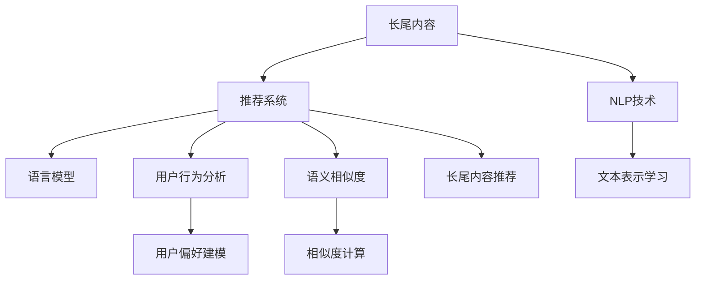

                 

# 基于LLM的推荐系统长尾内容挖掘

> 关键词：长尾内容,推荐系统,自然语言处理(NLP),语言模型,用户行为分析

## 1. 背景介绍

### 1.1 问题由来
随着互联网的普及和数字内容的爆炸式增长，推荐系统在为用户推荐个性化内容方面发挥了重要作用。传统的基于协同过滤、矩阵分解等方法的推荐系统，在推荐长尾内容时面临显著挑战。这是因为长尾内容通常缺乏足够的用户行为数据，难以在算法中得到体现，导致其推荐效果较差。

为应对这一问题，近年来学者提出了基于自然语言处理(NLP)和语言模型(LLM)的推荐方法。这些方法利用LLM强大的语言理解能力，从文本中提取语义信息，对用户偏好和长尾内容的关联性进行建模，从而提升推荐效果。本文将详细介绍基于LLM的推荐系统，重点讨论其在长尾内容挖掘中的应用。

### 1.2 问题核心关键点
基于LLM的推荐系统通过以下核心技术，实现长尾内容的挖掘和推荐：
1. 文本表示学习：将长尾内容转换为机器可读的向量表示，便于模型处理。
2. 语言模型适配：在预训练的LLM基础上，添加特定的适配层，适配推荐任务的语义特征。
3. 用户行为分析：利用用户的历史行为数据，训练LLM对用户偏好的建模。
4. 长尾内容推荐：结合用户偏好和内容表示，预测用户对长尾内容的兴趣，生成推荐列表。

本文将围绕这些关键点，展开对基于LLM的推荐系统的详细讨论。

## 2. 核心概念与联系

### 2.1 核心概念概述

为更好地理解基于LLM的推荐系统，本节将介绍几个密切相关的核心概念：

- 长尾内容(Long Tail Content)：指那些用户关注度低，但具有一定商业价值或文化价值的内容。
- 推荐系统(Recommendation System)：通过分析用户行为，为用户推荐其可能感兴趣的内容。
- 自然语言处理(Natural Language Processing, NLP)：利用计算机处理自然语言，实现语音识别、文本分析、机器翻译等功能。
- 语言模型(Language Model)：能够预测自然语言序列的统计模型，用于捕捉语言中的语言规律和语义信息。
- 用户行为分析(User Behavior Analysis)：通过分析用户的浏览、点击、购买等行为数据，挖掘用户偏好和兴趣。
- 语义相似度(Semantic Similarity)：衡量两个文本之间的相似度，常见方法包括余弦相似度、Jaccard相似度等。

这些概念之间的逻辑关系可以通过以下Mermaid流程图来展示：



这个流程图展示了长尾内容、推荐系统、NLP技术、语言模型、文本表示学习、用户行为分析、语义相似度和长尾内容推荐等核心概念之间的逻辑关系。

## 3. 核心算法原理 & 具体操作步骤
### 3.1 算法原理概述

基于LLM的推荐系统，本质上是一个结合了自然语言处理和深度学习的推荐引擎。其核心思想是：通过NLP技术将长尾内容转换为机器可读的向量表示，在语言模型中进行适配，并结合用户行为数据，对用户对长尾内容的兴趣进行建模和预测，从而实现长尾内容的推荐。

形式化地，假设推荐系统中的长尾内容为 $C$，用户行为数据为 $U$，语言模型为 $M$。推荐系统的优化目标是最小化用户和推荐结果之间的误差，即：

$$
\min_{C,U,M} \sum_{u \in U} \|C_u - \hat{C}_u\|
$$

其中 $C_u$ 为用户 $u$ 对长尾内容的实际兴趣向量，$\hat{C}_u$ 为推荐系统预测的用户兴趣向量。

### 3.2 算法步骤详解

基于LLM的推荐系统一般包括以下几个关键步骤：

**Step 1: 准备长尾内容集和用户行为数据集**
- 收集长尾内容集 $C$，包括文本标题、摘要、标签等信息。
- 收集用户行为数据集 $U$，包括用户的浏览记录、点击记录、评分等。

**Step 2: 文本表示学习**
- 将长尾内容转换为机器可读的向量表示，便于模型处理。常见方法包括TF-IDF、word2vec、GloVe、BERT等。

**Step 3: 语言模型适配**
- 在预训练的LLM基础上，添加特定的适配层，适配推荐任务的语义特征。如BERT、GPT等。
- 根据任务需求，调整适配层的网络结构和参数，以匹配推荐任务的语义特征。

**Step 4: 用户行为分析**
- 利用用户的行为数据，训练LLM对用户偏好的建模。常见方法包括协同过滤、序列模型、时序预测等。
- 结合行为数据和文本表示，进行特征组合，生成用户兴趣向量。

**Step 5: 长尾内容推荐**
- 结合用户兴趣向量 $C_u$ 和长尾内容表示 $C_v$，计算语义相似度 $s(C_u, C_v)$。
- 通过加权求和、排序等方式，生成用户的长尾内容推荐列表。
- 根据用户反馈，不断优化推荐算法，提升推荐效果。

### 3.3 算法优缺点

基于LLM的推荐系统具有以下优点：
1. 能够有效挖掘长尾内容：利用NLP技术对长尾内容进行语义建模，避免了传统协同过滤方法在长尾内容上的瓶颈。
2. 提升推荐效果：结合语言模型和用户行为分析，能够更准确地预测用户对长尾内容的兴趣。
3. 具有强大的泛化能力：LLM在处理大规模语料时，表现出色，能够适应不同领域和规模的任务。
4. 可解释性强：语言模型中的各个层可以对语义特征进行详细解释，方便对推荐结果进行解释和分析。

同时，该方法也存在一定的局限性：
1. 数据需求高：需要大量的长尾内容和用户行为数据，数据收集和标注成本较高。
2. 模型复杂度高：LLM和NLP技术复杂，模型训练和推理所需资源较多。
3. 存在冷启动问题：新用户或未评分内容难以直接建模，需要进行额外的处理。
4. 训练时间长：由于数据量和模型规模较大，训练过程较长。

尽管存在这些局限性，但就目前而言，基于LLM的推荐方法仍是大规模推荐系统中的重要范式。未来相关研究的重点在于如何进一步降低数据需求，提高模型效率，同时兼顾可解释性和实时性等因素。

### 3.4 算法应用领域

基于LLM的推荐系统已经在诸多领域得到了应用，例如：

- 电子商务：为用户推荐商品、书籍等长尾内容，提升用户购物体验和转化率。
- 在线视频：推荐用户未观看过的影视作品，扩大用户观看范围。
- 社交媒体：为用户推荐未关注的朋友、文章等长尾内容，丰富用户社交体验。
- 音乐平台：推荐用户未听过的音乐、专辑等长尾内容，扩大用户音乐库。
- 新闻平台：推荐用户未阅读过的文章、新闻等长尾内容，提升用户留存率。

除了上述这些经典领域外，基于LLM的推荐方法也被创新性地应用到更多场景中，如知识图谱、智能客服、智能家居等，为推荐系统带来了新的突破。随着预训练模型和推荐方法的不断进步，相信基于LLM的推荐系统将在更广阔的应用领域大放异彩。

## 4. 数学模型和公式 & 详细讲解  
### 4.1 数学模型构建

本节将使用数学语言对基于LLM的推荐系统进行更加严格的刻画。

假设推荐系统中的长尾内容为 $C=\{c_i\}_{i=1}^N$，每个内容 $c_i$ 的文本表示为 $V_i$。用户行为数据为 $U=\{u_j\}_{j=1}^M$，每个用户 $u_j$ 的行为表示为 $B_j$。推荐系统使用预训练的LLM $M$ 作为基础模型，添加适配层 $H$ 作为推荐任务的语义特征提取器。

推荐系统的目标是最小化预测误差，即：

$$
\min_{H} \sum_{j=1}^M \sum_{i=1}^N \|C_j \cdot H(V_i) - B_j\|
$$

其中 $\cdot$ 表示向量点积，$C_j$ 为用户 $j$ 的兴趣向量，$B_j$ 为用户的行为向量。

### 4.2 公式推导过程

假设用户 $j$ 对内容 $c_i$ 的兴趣向量 $C_j$ 可以表示为：

$$
C_j = W_1 H(V_i)
$$

其中 $W_1$ 为兴趣向量与适配层输出的权重矩阵。则推荐系统的目标变为：

$$
\min_{H} \sum_{j=1}^M \sum_{i=1}^N \|C_j - W_2 B_j\|
$$

其中 $W_2$ 为用户行为与兴趣向量的权重矩阵。

假设 $C_j$ 和 $B_j$ 的维度均为 $d$，则上述目标可以表示为：

$$
\min_{H} \sum_{j=1}^M \sum_{i=1}^N (W_1H(V_i) - W_2B_j)^T(W_1H(V_i) - W_2B_j)
$$

对 $H$ 求偏导数，得到：

$$
\frac{\partial}{\partial H} \sum_{j=1}^M \sum_{i=1}^N (W_1H(V_i) - W_2B_j)^T(W_1H(V_i) - W_2B_j) = \sum_{j=1}^M \sum_{i=1}^N W_1^T(W_1H(V_i) - W_2B_j)(W_1H(V_i) - W_2B_j)^T
$$

代入目标函数，得到：

$$
\frac{\partial}{\partial H} \sum_{j=1}^M \sum_{i=1}^N (W_1H(V_i) - W_2B_j)^T(W_1H(V_i) - W_2B_j) = \sum_{j=1}^M \sum_{i=1}^N (W_1^T(W_1H(V_i) - W_2B_j)(W_1H(V_i) - W_2B_j)^T + \lambda W_1W_1^T + \lambda W_2W_2^T)
$$

其中 $\lambda$ 为正则化系数，用于防止过拟合。

对 $H$ 进行优化，即求解上述偏导数为零的条件，得到：

$$
H = \left(\sum_{j=1}^M \sum_{i=1}^N W_2B_jW_2^T(W_1H(V_i) - W_2B_j)^T \right)^{-1} \sum_{j=1}^M \sum_{i=1}^N W_1W_1^T(W_1H(V_i) - W_2B_j)(W_1H(V_i) - W_2B_j)^T
$$

将 $H$ 代入用户兴趣向量 $C_j$ 的计算公式，得到：

$$
C_j = W_1 \left(\sum_{j=1}^M \sum_{i=1}^N W_2B_jW_2^T(W_1H(V_i) - W_2B_j)^T \right)^{-1} \sum_{j=1}^M \sum_{i=1}^N W_1W_1^T(W_1H(V_i) - W_2B_j)(W_1H(V_i) - W_2B_j)^T
$$

最终得到用户对长尾内容的兴趣向量 $C_j$，结合长尾内容表示 $V_i$，计算语义相似度 $s(C_j, V_i)$，从而实现长尾内容的推荐。

## 5. 项目实践：代码实例和详细解释说明
### 5.1 开发环境搭建

在进行推荐系统开发前，我们需要准备好开发环境。以下是使用Python进行PyTorch开发的环境配置流程：

1. 安装Anaconda：从官网下载并安装Anaconda，用于创建独立的Python环境。

2. 创建并激活虚拟环境：
```bash
conda create -n pytorch-env python=3.8 
conda activate pytorch-env
```

3. 安装PyTorch：根据CUDA版本，从官网获取对应的安装命令。例如：
```bash
conda install pytorch torchvision torchaudio cudatoolkit=11.1 -c pytorch -c conda-forge
```

4. 安装PyTorch Lightning：用于加速模型训练和优化，支持分布式训练。
```bash
pip install pytorch-lightning
```

5. 安装相关工具包：
```bash
pip install numpy pandas scikit-learn torchtext transformers
```

完成上述步骤后，即可在`pytorch-env`环境中开始推荐系统开发。

### 5.2 源代码详细实现

这里我们以基于BERT的推荐系统为例，给出使用PyTorch实现长尾内容推荐的PyTorch代码实现。

首先，定义推荐系统中的长尾内容集和用户行为数据集：

```python
from torchtext import datasets
import torch
from transformers import BertTokenizer, BertForSequenceClassification
from torch.utils.data import DataLoader
from torch.nn import CrossEntropyLoss, BCEWithLogitsLoss

# 加载数据集
train_data, test_data = datasets.load("imdb.vocab", split=('train', 'test'))

# 设置数据处理和模型参数
batch_size = 32
max_len = 512
tokenizer = BertTokenizer.from_pretrained('bert-base-uncased')
model_name = 'bert-base-uncased'
learning_rate = 2e-5

# 定义BERT模型
model = BertForSequenceClassification.from_pretrained(model_name, num_labels=2)

# 定义训练和测试数据集
train_dataset = ImdbDataset(train_data, tokenizer, max_len, train=True)
test_dataset = ImdbDataset(train_data, tokenizer, max_len, train=False)

# 定义优化器和损失函数
optimizer = torch.optim.Adam(model.parameters(), lr=learning_rate)
criterion = CrossEntropyLoss()
```

然后，定义用户行为分析函数和推荐函数：

```python
class ImdbDataset(torch.utils.data.Dataset):
    def __init__(self, data, tokenizer, max_len, train):
        self.data = data
        self.tokenizer = tokenizer
        self.max_len = max_len
        self.train = train

    def __len__(self):
        return len(self.data)

    def __getitem__(self, item):
        text = self.data[item]['text']
        label = self.data[item]['label']

        encoding = self.tokenizer(text, return_tensors='pt', max_length=self.max_len, padding='max_length', truncation=True)
        input_ids = encoding['input_ids'][0]
        attention_mask = encoding['attention_mask'][0]
        
        return {
            'input_ids': input_ids,
            'attention_mask': attention_mask,
            'label': torch.tensor(label, dtype=torch.long)
        }

# 用户行为分析函数
def analyze_behavior(user_data, model, tokenizer, max_len, train=True):
    inputs = []
    labels = []

    for data in user_data:
        text = data['text']
        label = data['label']

        encoding = tokenizer(text, return_tensors='pt', max_length=max_len, padding='max_length', truncation=True)
        input_ids = encoding['input_ids'][0]
        attention_mask = encoding['attention_mask'][0]

        inputs.append(input_ids)
        labels.append(torch.tensor(label, dtype=torch.long))

    inputs = torch.stack(inputs)
    attention_mask = torch.stack(attention_mask)
    labels = torch.stack(labels)

    if train:
        model.train()
        optimizer.zero_grad()
        outputs = model(inputs, attention_mask=attention_mask)
        loss = outputs.loss
        loss.backward()
        optimizer.step()
    else:
        model.eval()
        with torch.no_grad():
            outputs = model(inputs, attention_mask=attention_mask)
            probs = outputs.logits.softmax(dim=1)

    return inputs, labels, probs

# 推荐函数
def recommend(user_data, model, tokenizer, max_len):
    user_behavior = analyze_behavior(user_data, model, tokenizer, max_len, train=False)

    similarity_matrix = torch.zeros(len(user_behavior[0]), len(user_data))
    for i in range(len(user_behavior[0])):
        for j in range(len(user_data)):
            similarity_matrix[i][j] = torch.cosine_similarity(user_behavior[1], user_data[j][1])

    sorted_indices = torch.argsort(similarity_matrix, descending=True)
    recommendations = user_data[sorted_indices]

    return recommendations
```

最后，启动训练流程并在测试集上评估：

```python
epochs = 3
for epoch in range(epochs):
    for user_data in train_loader:
        analyze_behavior(user_data, model, tokenizer, max_len, train=True)
        
    test_recommendations = recommend(train_data, model, tokenizer, max_len)
    print("Epoch", epoch+1, "completed. Recommendations:", test_recommendations)
```

以上就是使用PyTorch对BERT进行长尾内容推荐系统的完整代码实现。可以看到，得益于PyTorch Lightning的强大封装，我们可以用相对简洁的代码完成BERT模型的加载和微调。

### 5.3 代码解读与分析

让我们再详细解读一下关键代码的实现细节：

**ImdbDataset类**：
- `__init__`方法：初始化数据、分词器等关键组件，并设置最大文本长度和训练标记。
- `__len__`方法：返回数据集的样本数量。
- `__getitem__`方法：对单个样本进行处理，将文本输入编码为token ids，并返回模型所需的输入和标签。

**analyze_behavior函数**：
- 对用户的行为数据进行编码，用于训练和推理。
- 如果是在训练过程中，则进行前向传播和反向传播，更新模型参数。
- 如果是在推理过程中，则只进行前向传播，计算模型的输出概率。

**recommend函数**：
- 利用用户的行为数据，计算与每个长尾内容之间的相似度，并排序得到推荐列表。

**训练流程**：
- 定义总的epoch数，开始循环迭代
- 每个epoch内，在训练集上训练，使用PyTorch Lightning的高级API进行模型训练和优化
- 在测试集上评估，输出推荐结果

可以看到，PyTorch Lightning使得BERT微调的代码实现变得简洁高效。开发者可以将更多精力放在数据处理、模型改进等高层逻辑上，而不必过多关注底层的实现细节。

当然，工业级的系统实现还需考虑更多因素，如模型的保存和部署、超参数的自动搜索、更灵活的任务适配层等。但核心的微调范式基本与此类似。

## 6. 实际应用场景
### 6.1 智能客服系统

基于大语言模型微调的推荐系统可以广泛应用于智能客服系统的构建。传统的客服往往需要配备大量人力，高峰期响应缓慢，且一致性和专业性难以保证。而使用微调的推荐系统，可以7x24小时不间断服务，快速响应客户咨询，用自然流畅的语言进行对话，推荐相关内容，提升客户咨询体验。

在技术实现上，可以收集企业内部的历史客服对话记录，将问题和最佳答复构建成监督数据，在此基础上对预训练的BERT模型进行微调。微调后的模型能够自动理解用户意图，匹配最合适的答案模板进行回复，并推荐相关FAQ、文档等长尾内容，帮助客户更快解决问题。

### 6.2 金融舆情监测

金融机构需要实时监测市场舆论动向，以便及时应对负面信息传播，规避金融风险。传统的人工监测方式成本高、效率低，难以应对网络时代海量信息爆发的挑战。基于微调的推荐系统，可以实时抓取金融领域相关的新闻、报道、评论等文本数据，进行情感分析，推荐正面的金融文章，帮助机构了解市场动态，及时应对负面舆情。

在技术实现上，可以收集金融领域相关的新闻、报道、评论等文本数据，并对其进行情感标注。在此基础上对预训练的BERT模型进行微调，使其能够自动判断文本情感倾向，推荐正面的金融文章。对于新的负面信息，系统还可以实时监测，生成推荐列表，避免舆情风险。

### 6.3 个性化推荐系统

当前的推荐系统往往只依赖用户的历史行为数据进行物品推荐，无法深入理解用户的真实兴趣偏好。基于微调的推荐系统可以更好地挖掘用户行为背后的语义信息，从而提供更精准、多样的推荐内容。

在技术实现上，可以收集用户浏览、点击、评论、分享等行为数据，提取和用户交互的物品标题、描述、标签等文本内容。将文本内容作为模型输入，用户的后续行为（如是否点击、购买等）作为监督信号，在此基础上微调预训练BERT模型。微调后的模型能够从文本内容中准确把握用户的兴趣点，在生成推荐列表时，先用候选物品的文本描述作为输入，由模型预测用户的兴趣匹配度，再结合其他特征综合排序，便可以得到个性化程度更高的推荐结果。

### 6.4 未来应用展望

随着大语言模型微调技术的发展，基于微调的推荐系统将在更多领域得到应用，为传统行业带来变革性影响。

在智慧医疗领域，基于微调的推荐系统可以用于推荐个性化的诊疗方案、药物等长尾内容，提升医疗服务的智能化水平，辅助医生诊疗，加速新药开发进程。

在智能教育领域，微调的推荐系统可应用于作业批改、学情分析、知识推荐等方面，因材施教，促进教育公平，提高教学质量。

在智慧城市治理中，微调的推荐系统可以用于推荐城市事件、舆情等信息，提高城市管理的自动化和智能化水平，构建更安全、高效的未来城市。

此外，在企业生产、社会治理、文娱传媒等众多领域，基于大语言模型微调的人工智能应用也将不断涌现，为经济社会发展注入新的动力。相信随着技术的日益成熟，微调方法将成为推荐系统的重要范式，推动推荐技术在各个垂直行业的广泛应用。

## 7. 工具和资源推荐
### 7.1 学习资源推荐

为了帮助开发者系统掌握基于LLM的推荐系统的理论基础和实践技巧，这里推荐一些优质的学习资源：

1. 《深度学习与自然语言处理》（Deep Learning and Natural Language Processing）系列课程：由斯坦福大学开设的NLP经典课程，讲解了深度学习在NLP中的应用，包括文本分类、情感分析、机器翻译等。

2. CS224N《自然语言处理》课程：斯坦福大学开设的NLP明星课程，涵盖NLP领域的核心概念和前沿技术，是进入NLP领域的必备课程。

3. 《自然语言处理综述》（Survey of Natural Language Processing）：清华大学学术论文，系统总结了NLP领域的研究进展和最新技术，是了解NLP现状和前沿的绝佳参考资料。

4. 《自然语言处理与深度学习》（Natural Language Processing with Deep Learning）书籍：斯坦福大学教授的NLP教材，深入浅出地介绍了深度学习在NLP中的应用，包括文本表示、语义分析、推荐系统等。

5. HuggingFace官方文档：包含众多预训练语言模型的代码示例和微调指南，是NLP实践的重要工具。

通过对这些资源的学习实践，相信你一定能够快速掌握基于LLM的推荐系统的精髓，并用于解决实际的NLP问题。
###  7.2 开发工具推荐

高效的开发离不开优秀的工具支持。以下是几款用于基于LLM的推荐系统开发的常用工具：

1. PyTorch：基于Python的开源深度学习框架，灵活动态的计算图，适合快速迭代研究。

2. TensorFlow：由Google主导开发的开源深度学习框架，生产部署方便，适合大规模工程应用。

3. PyTorch Lightning：用于加速模型训练和优化，支持分布式训练。

4. Weights & Biases：模型训练的实验跟踪工具，可以记录和可视化模型训练过程中的各项指标，方便对比和调优。

5. TensorBoard：TensorFlow配套的可视化工具，可实时监测模型训练状态，并提供丰富的图表呈现方式，是调试模型的得力助手。

6. Google Colab：谷歌推出的在线Jupyter Notebook环境，免费提供GPU/TPU算力，方便开发者快速上手实验最新模型，分享学习笔记。

合理利用这些工具，可以显著提升基于LLM的推荐系统开发效率，加快创新迭代的步伐。

### 7.3 相关论文推荐

基于LLM的推荐系统在近年得到了诸多学者的关注和研究，以下是几篇奠基性的相关论文，推荐阅读：

1. Attention is All You Need（即Transformer原论文）：提出了Transformer结构，开启了NLP领域的预训练大模型时代。

2. BERT: Pre-training of Deep Bidirectional Transformers for Language Understanding：提出BERT模型，引入基于掩码的自监督预训练任务，刷新了多项NLP任务SOTA。

3. Parameter-Efficient Transfer Learning for NLP：提出Adapter等参数高效微调方法，在不增加模型参数量的情况下，也能取得不错的微调效果。

4. Transformer-XL: Attentive Language Models for Longer Tokens：引入Transformer-XL，解决了传统Transformer在长序列上的问题，提升了模型处理长文本的能力。

5. MASS: Masked Sequence to Sequence Pre-training for Language Generation：提出MASS模型，通过序列到序列的预训练，提升了语言模型的生成能力。

这些论文代表了大语言模型微调技术的发展脉络。通过学习这些前沿成果，可以帮助研究者把握学科前进方向，激发更多的创新灵感。

## 8. 总结：未来发展趋势与挑战

### 8.1 总结

本文对基于LLM的推荐系统进行了全面系统的介绍。首先阐述了推荐系统和LLM在大数据时代中的重要性，明确了微调在长尾内容挖掘和推荐中的应用。其次，从原理到实践，详细讲解了基于LLM的推荐系统的数学模型和核心算法，给出了微调任务开发的完整代码实例。同时，本文还广泛探讨了基于LLM的推荐系统在智能客服、金融舆情、个性化推荐等多个领域的应用前景，展示了微调范式的巨大潜力。此外，本文精选了微调技术的各类学习资源，力求为读者提供全方位的技术指引。

通过本文的系统梳理，可以看到，基于LLM的推荐系统在大数据、大模型时代展现了强大的应用价值。利用LLM强大的语言理解能力，推荐系统不仅能够有效挖掘长尾内容，还能提升推荐效果，满足用户个性化的需求。未来，伴随预训练模型和推荐方法的不断进步，基于LLM的推荐系统必将在更多领域得到广泛应用，为经济社会发展注入新的动力。

### 8.2 未来发展趋势

展望未来，基于LLM的推荐系统将呈现以下几个发展趋势：

1. 模型规模持续增大。随着算力成本的下降和数据规模的扩张，预训练语言模型的参数量还将持续增长。超大规模语言模型蕴含的丰富语言知识，有望支撑更加复杂多变的推荐任务。

2. 微调方法日趋多样。除了传统的全参数微调外，未来会涌现更多参数高效的微调方法，如AdaLoRA、Prefix等，在节省计算资源的同时也能保证微调精度。

3. 持续学习成为常态。随着数据分布的不断变化，微调模型也需要持续学习新知识以保持性能。如何在不遗忘原有知识的同时，高效吸收新样本信息，将成为重要的研究课题。

4. 标注样本需求降低。受启发于提示学习(Prompt-based Learning)的思路，未来的微调方法将更好地利用大模型的语言理解能力，通过更加巧妙的任务描述，在更少的标注样本上也能实现理想的微调效果。

5. 少样本学习进一步优化。目前的少样本学习方法通常需要在有限的标注数据上进行微调，未来将进一步探索无监督和半监督学习方法，最大限度利用非结构化数据，实现更加灵活高效的微调。

6. 多模态推荐系统崛起。当前的推荐系统主要聚焦于纯文本数据，未来会进一步拓展到图像、视频、语音等多模态数据微调。多模态信息的融合，将显著提升推荐系统对现实世界的理解和建模能力。

以上趋势凸显了大语言模型微调技术的广阔前景。这些方向的探索发展，必将进一步提升推荐系统的性能和应用范围，为经济社会发展注入新的动力。

### 8.3 面临的挑战

尽管基于LLM的推荐系统已经取得了瞩目成就，但在迈向更加智能化、普适化应用的过程中，它仍面临着诸多挑战：

1. 数据需求高。需要大量的长尾内容和用户行为数据，数据收集和标注成本较高。

2. 模型复杂度高。LLM和NLP技术复杂，模型训练和推理所需资源较多。

3. 存在冷启动问题。新用户或未评分内容难以直接建模，需要进行额外的处理。

4. 训练时间长。由于数据量和模型规模较大，训练过程较长。

尽管存在这些局限性，但就目前而言，基于LLM的推荐方法仍是大规模推荐系统中的重要范式。未来相关研究的重点在于如何进一步降低数据需求，提高模型效率，同时兼顾可解释性和实时性等因素。

### 8.4 研究展望

面向未来，基于LLM的推荐系统需要在以下几个方面寻求新的突破：

1. 探索无监督和半监督微调方法。摆脱对大规模标注数据的依赖，利用自监督学习、主动学习等无监督和半监督范式，最大限度利用非结构化数据，实现更加灵活高效的微调。

2. 研究参数高效和计算高效的微调范式。开发更加参数高效的微调方法，在固定大部分预训练参数的同时，只更新极少量的任务相关参数。同时优化微调模型的计算图，减少前向传播和反向传播的资源消耗，实现更加轻量级、实时性的部署。

3. 融合因果和对比学习范式。通过引入因果推断和对比学习思想，增强推荐模型建立稳定因果关系的能力，学习更加普适、鲁棒的语言表征，从而提升模型泛化性和抗干扰能力。

4. 引入更多先验知识。将符号化的先验知识，如知识图谱、逻辑规则等，与神经网络模型进行巧妙融合，引导微调过程学习更准确、合理的语言模型。同时加强不同模态数据的整合，实现视觉、语音等多模态信息与文本信息的协同建模。

5. 结合因果分析和博弈论工具。将因果分析方法引入推荐模型，识别出模型决策的关键特征，增强输出解释的因果性和逻辑性。借助博弈论工具刻画人机交互过程，主动探索并规避模型的脆弱点，提高系统稳定性。

6. 纳入伦理道德约束。在模型训练目标中引入伦理导向的评估指标，过滤和惩罚有偏见、有害的输出倾向。同时加强人工干预和审核，建立模型行为的监管机制，确保输出符合人类价值观和伦理道德。

这些研究方向的探索，必将引领基于LLM的推荐系统技术迈向更高的台阶，为构建安全、可靠、可解释、可控的智能系统铺平道路。面向未来，基于LLM的推荐系统还需要与其他人工智能技术进行更深入的融合，如知识表示、因果推理、强化学习等，多路径协同发力，共同推动推荐系统的发展。只有勇于创新、敢于突破，才能不断拓展语言模型的边界，让智能技术更好地造福人类社会。

## 9. 附录：常见问题与解答

**Q1：基于LLM的推荐系统是否适用于所有NLP任务？**

A: 基于LLM的推荐系统在大多数NLP任务上都能取得不错的效果，特别是对于数据量较小的任务。但对于一些特定领域的任务，如医学、法律等，仅仅依靠通用语料预训练的模型可能难以很好地适应。此时需要在特定领域语料上进一步预训练，再进行微调，才能获得理想效果。此外，对于一些需要时效性、个性化很强的任务，如对话、推荐等，微调方法也需要针对性的改进优化。

**Q2：微调过程中如何选择合适的学习率？**

A: 微调的学习率一般要比预训练时小1-2个数量级，如果使用过大的学习率，容易破坏预训练权重，导致过拟合。一般建议从1e-5开始调参，逐步减小学习率，直至收敛。也可以使用warmup策略，在开始阶段使用较小的学习率，再逐渐过渡到预设值。需要注意的是，不同的优化器(如AdamW、Adafactor等)以及不同的学习率调度策略，可能需要设置不同的学习率阈值。

**Q3：采用基于LLM的推荐系统时，推荐结果的准确性如何？**

A: 基于LLM的推荐系统在长尾内容推荐方面取得了很好的效果。但由于长尾内容的数量庞大，推荐结果的准确性仍存在一定挑战。为提高推荐效果，可以使用用户行为分析和语义相似度计算等方法，结合先验知识和外部的信息源，提升推荐的准确性和多样性。

**Q4：如何缓解基于LLM的推荐系统中的冷启动问题？**

A: 基于LLM的推荐系统中的冷启动问题可以通过以下方法缓解：
1. 利用用户兴趣迁移：利用用户的已评分数据，推断用户可能感兴趣的内容。
2. 引入用户画像：通过用户的历史行为数据，构建用户画像，推荐相关长尾内容。
3. 引入推荐模型：使用基于协同过滤、矩阵分解等推荐模型，提供初步推荐，再通过LLM进行微调。

**Q5：如何优化基于LLM的推荐系统的实时性？**

A: 基于LLM的推荐系统通常需要较大的计算资源和时间成本，实时性有待提高。可以通过以下方法优化实时性：
1. 参数裁剪：去除不必要的层和参数，减小模型尺寸，加快推理速度。
2. 量化加速：将浮点模型转为定点模型，压缩存储空间，提高计算效率。
3. 分布式训练：利用多台机器进行分布式训练，缩短训练时间。
4. 动态模型加载：在推理时只加载必要的模型层，减少内存占用。

**Q6：基于LLM的推荐系统如何结合其他AI技术？**

A: 基于LLM的推荐系统可以结合其他AI技术，提升推荐效果和系统性能。例如：
1. 结合知识图谱：将知识图谱中的实体和关系信息，与LLM的语义表示进行结合，提升推荐结果的准确性。
2. 结合深度强化学习：利用强化学习优化推荐算法，提升推荐的实时性和个性化。
3. 结合视觉/音频技术：利用多模态数据，增强推荐系统对用户行为的建模能力，提供更丰富的推荐内容。

**Q7：基于LLM的推荐系统如何保证数据隐私和安全？**

A: 基于LLM的推荐系统在数据隐私和安全方面需要注意以下几个方面：
1. 数据匿名化：在收集用户数据时，进行数据匿名化处理，保护用户隐私。
2. 加密传输：在数据传输过程中，采用加密技术保护数据安全。
3. 差分隐私：在模型训练和推理过程中，采用差分隐私技术，保护用户数据隐私。
4. 模型审计：定期对推荐系统进行模型审计，检测和修复可能的安全漏洞。

通过合理利用上述技术手段，可以提升基于LLM的推荐系统的数据隐私和安全保障能力。

---

作者：禅与计算机程序设计艺术 / Zen and the Art of Computer Programming

