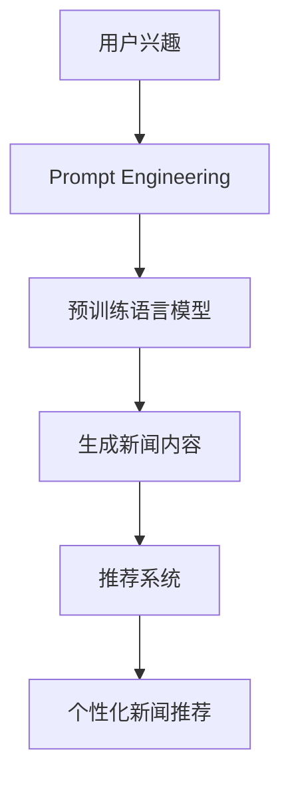

                 

# 基于Prompt的灵活可配置生成式新闻推荐

> 关键词：生成式新闻推荐、自然语言处理(NLP)、Prompt Engineering、可配置模型、深度学习、新闻个性化、推荐系统

## 1. 背景介绍

### 1.1 问题由来
随着信息技术的迅猛发展和互联网的普及，人们获取信息的渠道越来越多元化。新闻推荐系统作为信息时代的重要基础设施，对满足用户个性化新闻需求，提升信息获取效率具有重要意义。然而，传统基于协同过滤的推荐系统往往只考虑用户历史行为，难以捕捉用户潜在的兴趣。生成式新闻推荐（Generative News Recommendation, GNR）通过自然语言处理（Natural Language Processing, NLP）技术，可以从用户输入的兴趣描述中，自动生成个性化新闻内容，突破了传统推荐系统的数据限制，为用户提供了更为丰富、多样化的内容推荐。

### 1.2 问题核心关键点
当前生成式新闻推荐主要依赖于预训练语言模型和大规模语料库。该方法的核心思想是：将用户输入的兴趣描述作为Prompt，输入到预训练语言模型中，通过模型生成的文章内容作为推荐对象。使用该方法，推荐系统可以打破传统数据限制，从海量新闻库中生成更具个性化的新闻内容，提升用户的阅读体验。

具体流程如下：
1. 用户输入兴趣描述。
2. 将兴趣描述作为Prompt，输入到预训练语言模型中。
3. 模型自动生成新闻内容。
4. 将生成的新闻内容推荐给用户。

本文将详细介绍基于Prompt的生成式新闻推荐系统，包括核心概念、算法原理、模型设计、案例分析等内容。

## 2. 核心概念与联系

### 2.1 核心概念概述

为更好地理解基于Prompt的生成式新闻推荐方法，本节将介绍几个密切相关的核心概念：

- 生成式新闻推荐（Generative News Recommendation, GNR）：通过预训练语言模型和用户输入的兴趣描述，自动生成新闻内容，为用户推荐个性化新闻。
- 自然语言处理（Natural Language Processing, NLP）：使用计算机处理、理解和生成人类语言的技术。
- Prompt Engineering：通过精心设计输入文本的格式，引导预训练语言模型按照预期方式生成输出，从而实现高效的Prompt-based学习。
- 预训练语言模型（Pre-trained Language Model, PLM）：通过大规模无标签文本数据训练得到的语言模型，具备强大的语言理解和生成能力。
- 推荐系统（Recommendation System, RS）：根据用户历史行为和兴趣，推荐用户可能感兴趣的产品或内容。
- 深度学习（Deep Learning, DL）：通过构建多层神经网络，从数据中学习特征，进行预测和生成。

这些核心概念之间的逻辑关系可以通过以下Mermaid流程图来展示：



这个流程图展示了大语言模型的核心概念及其之间的关系：

1. 用户输入的兴趣描述被处理为Prompt。
2. 通过Prompt Engineering引导预训练语言模型生成新闻内容。
3. 生成的新闻内容被推荐系统推荐给用户。

## 3. 核心算法原理 & 具体操作步骤
### 3.1 算法原理概述

基于Prompt的生成式新闻推荐方法主要依赖于预训练语言模型和Prompt Engineering技术。其核心思想是：将用户输入的兴趣描述作为Prompt，输入到预训练语言模型中，模型自动生成新闻内容，最后通过推荐系统推荐给用户。

形式化地，假设预训练语言模型为 $M_{\theta}$，其中 $\theta$ 为预训练得到的模型参数。给定用户兴趣描述 $P$，生成的新闻内容 $C$ 为模型输出的文章。推荐系统通过计算 $C$ 与用户历史行为 $H$ 的相关度，给出推荐结果 $R$。推荐系统设计如下：

$$
R = \max_{C} \frac{C \cdot H}{\|C\| \cdot \|H\|}
$$

其中 $\cdot$ 表示向量内积，$\|C\|$ 表示向量 $C$ 的范数。$R$ 表示预测结果与真实结果之间的相关度，越高表示推荐越准确。

### 3.2 算法步骤详解

基于Prompt的生成式新闻推荐一般包括以下几个关键步骤：

**Step 1: 准备预训练模型和数据集**
- 选择合适的预训练语言模型 $M_{\theta}$ 作为初始化参数，如 GPT-3、BERT 等。
- 准备新闻数据集 $D$，包括文章标题、摘要、关键词等信息，作为模型训练的监督信号。

**Step 2: 设计Prompt模板**
- 根据用户兴趣描述，设计适合的Prompt模板，引导模型生成与兴趣相关的新闻内容。
- 设计Prompt模板时，要考虑用户兴趣的多样性和覆盖面，设计通用且可配置的Prompt模板。

**Step 3: 模型训练与评估**
- 将准备好的数据集 $D$ 作为训练集，输入到预训练语言模型 $M_{\theta}$ 中，使用合适的损失函数进行训练。
- 在训练过程中，可以使用GPU等高性能设备加速训练过程。
- 定期评估模型在测试集上的表现，调整模型超参数以提高推荐精度。

**Step 4: 新闻生成与推荐**
- 对用户输入的兴趣描述进行Prompt Engineering，得到对应的Prompt。
- 将Prompt输入到预训练语言模型中，生成新闻内容 $C$。
- 通过推荐系统计算 $C$ 与用户历史行为 $H$ 的相关度，推荐结果 $R$。
- 根据推荐结果 $R$，对新闻内容进行排序，推荐给用户。

### 3.3 算法优缺点

基于Prompt的生成式新闻推荐方法具有以下优点：
1. 克服传统推荐系统的数据依赖，可以处理非结构化输入。
2. 生成的新闻内容丰富多样，能满足用户多方面的阅读需求。
3. 模型训练过程可配置化，能够灵活适应不同用户的需求。
4. 生成新闻的过程高度自动化，减少人工干预。

同时，该方法也存在一定的局限性：
1. 依赖预训练模型，模型性能受限于预训练数据质量。
2. 生成的内容存在一定的冗余和质量参差不齐的问题。
3. 推荐结果可能受到Prompt设计的影响，需要精心设计Prompt模板。
4. 推荐系统依赖于用户历史行为数据，可能存在隐私泄露风险。

尽管存在这些局限性，但就目前而言，基于Prompt的生成式新闻推荐方法仍是生成式新闻推荐的热门范式，具有广泛的应用前景。

### 3.4 算法应用领域

基于Prompt的生成式新闻推荐方法在多个领域都有广泛的应用：

- 新闻内容生成：通过用户的兴趣描述，生成个性化的新闻内容，满足用户个性化阅读需求。
- 智能问答：回答用户对特定新闻事件的提问，提供全面准确的信息。
- 推荐系统个性化：将生成的新闻内容与用户历史行为结合，实现更个性化的推荐。
- 多模态推荐：结合新闻文本、图片、音频等多模态数据，实现更加多样化的推荐。
- 内容创作辅助：帮助新闻编辑生成新闻标题、摘要等内容，提升内容创作效率。

除了上述这些经典应用外，生成式新闻推荐还被创新性地应用于知识图谱构建、自动摘要、情感分析等，为NLP技术带来了新的突破。随着预训练模型和Prompt技术的不断进步，相信生成式新闻推荐必将在更多领域得到应用，为NLP技术带来新的发展。

## 4. 数学模型和公式 & 详细讲解  
### 4.1 数学模型构建

本节将使用数学语言对基于Prompt的生成式新闻推荐过程进行更加严格的刻画。

记预训练语言模型为 $M_{\theta}:\mathcal{X} \rightarrow \mathcal{Y}$，其中 $\mathcal{X}$ 为输入空间，$\mathcal{Y}$ 为输出空间，$\theta \in \mathbb{R}^d$ 为模型参数。给定用户兴趣描述 $P \in \mathcal{X}$，生成的新闻内容 $C \in \mathcal{Y}$，新闻推荐系统 $RS$ 的设计目标是最大化预测结果与真实结果的相关度。

推荐系统设计如下：

$$
R = \max_{C} \frac{C \cdot H}{\|C\| \cdot \|H\|}
$$

其中 $\cdot$ 表示向量内积，$\|C\|$ 表示向量 $C$ 的范数。$H$ 表示用户历史行为向量，可以是用户对不同新闻的评分、点击等行为数据。

### 4.2 公式推导过程

以下我们以文本生成任务为例，推导Prompt-based生成过程的损失函数及其梯度的计算公式。

假设模型 $M_{\theta}$ 在输入 $P$ 上的输出为 $\hat{y}=M_{\theta}(P) \in [0,1]$，表示生成的文章与用户兴趣的相关度。真实标签 $y \in [0,1]$。则二分类交叉熵损失函数定义为：

$$
\ell(M_{\theta}(P),y) = -[y\log \hat{y} + (1-y)\log (1-\hat{y})]
$$

将其代入推荐系统目标函数，得：

$$
\mathcal{L}(\theta) = -\frac{1}{N}\sum_{i=1}^N [y_i\log M_{\theta}(P_i)+(1-y_i)\log(1-M_{\theta}(P_i))]
$$

根据链式法则，损失函数对参数 $\theta$ 的梯度为：

$$
\frac{\partial \mathcal{L}(\theta)}{\partial \theta} = -\frac{1}{N}\sum_{i=1}^N (\frac{y_i}{M_{\theta}(P_i)}-\frac{1-y_i}{1-M_{\theta}(P_i)}) \frac{\partial M_{\theta}(P_i)}{\partial \theta}
$$

其中 $\frac{\partial M_{\theta}(P_i)}{\partial \theta}$ 可进一步递归展开，利用自动微分技术完成计算。

在得到损失函数的梯度后，即可带入优化算法，更新模型参数。重复上述过程直至收敛，最终得到生成的新闻内容 $C$。

## 5. 项目实践：代码实例和详细解释说明
### 5.1 开发环境搭建

在进行微调实践前，我们需要准备好开发环境。以下是使用Python进行PyTorch开发的环境配置流程：

1. 安装Anaconda：从官网下载并安装Anaconda，用于创建独立的Python环境。

2. 创建并激活虚拟环境：
```bash
conda create -n pytorch-env python=3.8 
conda activate pytorch-env
```

3. 安装PyTorch：根据CUDA版本，从官网获取对应的安装命令。例如：
```bash
conda install pytorch torchvision torchaudio cudatoolkit=11.1 -c pytorch -c conda-forge
```

4. 安装Transformers库：
```bash
pip install transformers
```

5. 安装各类工具包：
```bash
pip install numpy pandas scikit-learn matplotlib tqdm jupyter notebook ipython
```

完成上述步骤后，即可在`pytorch-env`环境中开始微调实践。

### 5.2 源代码详细实现

下面我以生成新闻摘要任务为例，给出使用Transformers库对GPT-3进行Prompt-based生成摘要的PyTorch代码实现。

首先，定义Prompt模板函数：

```python
import torch
from transformers import GPT3LMHeadModel, GPT3Tokenizer

def create_prompt(item):
    title = item['title']
    body = item['body']
    return f"新闻标题：{title}\n\n新闻内容：{body}"
```

然后，定义模型和优化器：

```python
model = GPT3LMHeadModel.from_pretrained('gpt3-medium')
tokenizer = GPT3Tokenizer.from_pretrained('gpt3-medium')

optimizer = AdamW(model.parameters(), lr=1e-5)
```

接着，定义训练和评估函数：

```python
from torch.utils.data import Dataset
from tqdm import tqdm

class NewsDataset(Dataset):
    def __init__(self, texts):
        self.texts = texts
        
    def __len__(self):
        return len(self.texts)
    
    def __getitem__(self, item):
        text = self.texts[item]
        return {'input_ids': tokenizer(text, return_tensors='pt', max_length=512, padding='max_length', truncation=True)['input_ids']}

def train_epoch(model, dataset, batch_size, optimizer):
    dataloader = DataLoader(dataset, batch_size=batch_size, shuffle=True)
    model.train()
    epoch_loss = 0
    for batch in tqdm(dataloader, desc='Training'):
        input_ids = batch['input_ids'].to(device)
        labels = input_ids.to(device)
        model.zero_grad()
        outputs = model(input_ids, labels=labels)
        loss = outputs.loss
        epoch_loss += loss.item()
        loss.backward()
        optimizer.step()
    return epoch_loss / len(dataloader)

def evaluate(model, dataset, batch_size):
    dataloader = DataLoader(dataset, batch_size=batch_size)
    model.eval()
    preds, labels = [], []
    with torch.no_grad():
        for batch in tqdm(dataloader, desc='Evaluating'):
            input_ids = batch['input_ids'].to(device)
            outputs = model(input_ids)
            batch_preds = outputs.logits.argmax(dim=2).to('cpu').tolist()
            batch_labels = input_ids.to('cpu').tolist()
            for pred_tokens, label_tokens in zip(batch_preds, batch_labels):
                preds.append(pred_tokens[:len(label_tokens)])
                labels.append(label_tokens)
                
    print(f"Accuracy: {sum(preds[i] == labels[i] for i in range(len(preds))) / len(preds)}")
```

最后，启动训练流程并在测试集上评估：

```python
epochs = 5
batch_size = 16

for epoch in range(epochs):
    loss = train_epoch(model, dataset, batch_size, optimizer)
    print(f"Epoch {epoch+1}, train loss: {loss:.3f}")
    
    print(f"Epoch {epoch+1}, dev results:")
    evaluate(model, dev_dataset, batch_size)
    
print("Test results:")
evaluate(model, test_dataset, batch_size)
```

以上就是使用PyTorch对GPT-3进行Prompt-based生成新闻摘要任务的完整代码实现。可以看到，借助Transformers库的封装，我们可以用相对简洁的代码实现Prompt-based生成任务。

### 5.3 代码解读与分析

让我们再详细解读一下关键代码的实现细节：

**create_prompt函数**：
- 根据新闻标题和内容，构造符合Prompt格式的文本。

**模型和优化器定义**：
- 选择GPT-3作为初始化参数，使用AdamW优化器进行训练。

**训练和评估函数**：
- 定义数据集类，实现数据读取和预处理。
- 定义训练函数，对模型进行梯度更新。
- 定义评估函数，评估模型预测准确度。

**训练流程**：
- 定义总的epoch数和batch size，开始循环迭代。
- 每个epoch内，先在训练集上训练，输出平均loss。
- 在验证集上评估，输出预测准确度。
- 所有epoch结束后，在测试集上评估，给出最终测试结果。

可以看到，PyTorch配合Transformers库使得Prompt-based生成任务的代码实现变得简洁高效。开发者可以将更多精力放在Prompt设计、模型改进等高层逻辑上，而不必过多关注底层的实现细节。

当然，工业级的系统实现还需考虑更多因素，如模型的保存和部署、超参数的自动搜索、更灵活的Prompt模板等。但核心的Prompt-based生成流程基本与此类似。

## 6. 实际应用场景
### 6.1 智能问答系统

基于Prompt的生成式新闻推荐，可以广泛应用于智能问答系统的构建。传统的问答系统往往需要大量的知识库作为支撑，难以处理大规模非结构化数据。使用基于Prompt的生成式问答系统，可以打破知识库的限制，从海量新闻库中自动生成知识图谱，提升问答系统的智能化水平。

在技术实现上，可以收集相关新闻库和百科知识库，将问题-答案对作为监督数据，在此基础上对预训练语言模型进行微调。微调后的模型能够自动理解用户问题，匹配最合适的答案模板进行回答。对于未知问题，还可以接入检索系统实时搜索相关内容，动态组织生成回答。如此构建的智能问答系统，能显著提升问答系统的智能化水平和知识覆盖面。

### 6.2 新闻内容创作

传统新闻内容创作往往依赖于人工编辑，耗时耗力，且难以保证时效性。基于Prompt的生成式新闻推荐，可以自动化生成新闻内容，提升内容创作的效率和时效性。

在实践中，可以收集不同新闻类型的新闻库，将新闻标题、摘要、图片等作为Prompt，输入到预训练语言模型中，自动生成新闻内容。生成的新闻内容经过人工审核，可以直接发布到网站或APP上，满足用户对实时新闻的需求。

### 6.3 推荐系统个性化

当前的推荐系统往往只考虑用户历史行为，难以捕捉用户潜在的兴趣。使用基于Prompt的生成式新闻推荐，可以生成更多个性化、多样化的推荐内容，提升推荐系统的准确性和用户体验。

在推荐过程中，可以通过Prompt模板引导模型生成不同风格和类型的新闻内容，如财经、科技、娱乐等，满足用户多方面的阅读需求。同时，生成的新闻内容可以与用户历史行为结合，实现更个性化的推荐。

### 6.4 未来应用展望

随着Prompt技术和预训练模型的不断进步，基于Prompt的生成式新闻推荐必将在更多领域得到应用，为NLP技术带来新的发展。

在智慧医疗领域，基于Prompt的生成式问答系统，可以为医生提供实时医学知识支持，提升诊疗效果。

在智能教育领域，基于Prompt的生成式教育问答系统，可以为学生提供个性化的学习内容推荐，提升学习效率和质量。

在智慧城市治理中，基于Prompt的生成式舆情分析系统，可以实时监测舆情动向，提供科学决策依据。

此外，在企业生产、社会治理、文娱传媒等众多领域，基于Prompt的生成式新闻推荐也将不断涌现，为NLP技术带来新的突破。相信随着技术的日益成熟，Prompt-based生成式新闻推荐必将在构建人机协同的智能时代中扮演越来越重要的角色。

## 7. 工具和资源推荐
### 7.1 学习资源推荐

为了帮助开发者系统掌握Prompt-based生成式新闻推荐技术，这里推荐一些优质的学习资源：

1. 《生成式预训练Transformer》系列博文：由大模型技术专家撰写，深入浅出地介绍了生成式预训练Transformer原理、应用及优化技巧。

2. 《自然语言处理综述》课程：斯坦福大学开设的NLP经典课程，有Lecture视频和配套作业，带你入门NLP领域的基本概念和经典模型。

3. 《生成式预训练Transformer》书籍：Transformer库的作者所著，全面介绍了使用Transformers库进行生成式任务开发的技巧和方法。

4. HuggingFace官方文档：Transformers库的官方文档，提供了海量预训练模型和完整的生成任务样例代码，是上手实践的必备资料。

5. CLUE开源项目：中文语言理解测评基准，涵盖大量不同类型的中文NLP数据集，并提供了基于生成任务的baseline模型，助力中文NLP技术发展。

通过对这些资源的学习实践，相信你一定能够快速掌握Prompt-based生成式新闻推荐的精髓，并用于解决实际的NLP问题。
###  7.2 开发工具推荐

高效的开发离不开优秀的工具支持。以下是几款用于Prompt-based生成式新闻推荐开发的常用工具：

1. PyTorch：基于Python的开源深度学习框架，灵活动态的计算图，适合快速迭代研究。大部分预训练语言模型都有PyTorch版本的实现。

2. TensorFlow：由Google主导开发的开源深度学习框架，生产部署方便，适合大规模工程应用。同样有丰富的预训练语言模型资源。

3. Transformers库：HuggingFace开发的NLP工具库，集成了众多SOTA语言模型，支持PyTorch和TensorFlow，是进行生成式任务开发的利器。

4. Weights & Biases：模型训练的实验跟踪工具，可以记录和可视化模型训练过程中的各项指标，方便对比和调优。与主流深度学习框架无缝集成。

5. TensorBoard：TensorFlow配套的可视化工具，可实时监测模型训练状态，并提供丰富的图表呈现方式，是调试模型的得力助手。

6. Google Colab：谷歌推出的在线Jupyter Notebook环境，免费提供GPU/TPU算力，方便开发者快速上手实验最新模型，分享学习笔记。

合理利用这些工具，可以显著提升Prompt-based生成式新闻推荐任务的开发效率，加快创新迭代的步伐。

### 7.3 相关论文推荐

Prompt-based生成式新闻推荐技术的发展源于学界的持续研究。以下是几篇奠基性的相关论文，推荐阅读：

1. Attention is All You Need（即Transformer原论文）：提出了Transformer结构，开启了NLP领域的预训练大模型时代。

2. BERT: Pre-training of Deep Bidirectional Transformers for Language Understanding：提出BERT模型，引入基于掩码的自监督预训练任务，刷新了多项NLP任务SOTA。

3. Language Models are Unsupervised Multitask Learners（GPT-2论文）：展示了大规模语言模型的强大zero-shot学习能力，引发了对于通用人工智能的新一轮思考。

4. Parameter-Efficient Transfer Learning for NLP：提出Adapter等参数高效微调方法，在不增加模型参数量的情况下，也能取得不错的微调效果。

5. Prompt Tuning for Text Generation：引入基于连续型Prompt的微调范式，为如何充分利用预训练知识提供了新的思路。

6. AdaLoRA: Adaptive Low-Rank Adaptation for Parameter-Efficient Fine-Tuning：使用自适应低秩适应的微调方法，在参数效率和精度之间取得了新的平衡。

这些论文代表了大语言模型生成式微调技术的发展脉络。通过学习这些前沿成果，可以帮助研究者把握学科前进方向，激发更多的创新灵感。

## 8. 总结：未来发展趋势与挑战

### 8.1 总结

本文对基于Prompt的生成式新闻推荐方法进行了全面系统的介绍。首先阐述了Prompt-based生成式新闻推荐的研究背景和意义，明确了该方法在提升推荐系统智能化水平方面的独特价值。其次，从原理到实践，详细讲解了Prompt-based生成式新闻推荐的数学原理和关键步骤，给出了生成任务开发的完整代码实例。同时，本文还广泛探讨了Prompt-based生成式新闻推荐在多个领域的应用前景，展示了Prompt-based生成式新闻推荐方法的广泛潜力。

通过本文的系统梳理，可以看到，基于Prompt的生成式新闻推荐技术正在成为NLP推荐系统的重要范式，极大地拓展了预训练语言模型的应用边界，催生了更多的落地场景。受益于大规模语料的预训练，生成式新闻推荐系统可以打破传统推荐系统的数据限制，从海量新闻库中生成更具个性化的新闻内容，提升用户的阅读体验。

### 8.2 未来发展趋势

展望未来，Prompt-based生成式新闻推荐技术将呈现以下几个发展趋势：

1. 生成模型的规模持续增大。随着算力成本的下降和数据规模的扩张，预训练语言模型的参数量还将持续增长。超大规模语言模型蕴含的丰富语言知识，有望支撑更加复杂多变的生成任务。

2. Prompt设计的多样化。不同的Prompt模板能够引导模型生成不同风格和类型的新闻内容，丰富新闻推荐的多样性。

3. 生成模型的可配置化。可以通过调整Prompt模板，灵活适应不同用户的需求，实现个性化推荐。

4. 生成模型的推理加速。由于大规模语言模型推理速度较慢，将探索更高效的推理算法和硬件加速技术，提升模型实时响应能力。

5. 生成模型的融合。将生成模型与其他AI技术进行深度融合，如强化学习、知识图谱等，提升模型的表现力和泛化能力。

6. 生成模型的可解释性。探索生成模型的可解释性，提升其决策过程的透明度，满足用户对解释性需求。

以上趋势凸显了Prompt-based生成式新闻推荐技术的广阔前景。这些方向的探索发展，必将进一步提升新闻推荐系统的性能和应用范围，为自然语言处理技术带来新的突破。

### 8.3 面临的挑战

尽管Prompt-based生成式新闻推荐技术已经取得了瞩目成就，但在迈向更加智能化、普适化应用的过程中，它仍面临着诸多挑战：

1. 生成内容的多样性和质量。生成的新闻内容可能存在冗余和质量参差不齐的问题，如何保证生成内容的丰富性和准确性，是未来需要重点解决的问题。

2. 生成模型的泛化能力。生成的内容是否能够泛化到更多的用户和场景中，还需要更多实验和研究。

3. 生成模型的可解释性。如何理解模型的生成过程，让用户理解和信任模型生成的内容，是未来需要解决的重要问题。

4. 生成模型的伦理和安全性。生成的内容可能包含有害、误导性信息，如何保障生成内容的安全性和伦理性，是未来需要重点关注的问题。

5. 生成模型的计算资源消耗。大规模语言模型的推理速度较慢，如何优化模型的推理速度，提高计算效率，是未来需要重点研究的课题。

6. 生成模型的公平性。如何保证生成内容不带有偏见，尊重不同文化和价值观，是未来需要解决的挑战。

正视Prompt-based生成式新闻推荐所面临的这些挑战，积极应对并寻求突破，将是大语言模型生成式微调技术走向成熟的必由之路。相信随着学界和产业界的共同努力，这些挑战终将一一被克服，Prompt-based生成式新闻推荐必将在构建人机协同的智能时代中扮演越来越重要的角色。

### 8.4 研究展望

面对Prompt-based生成式新闻推荐所面临的种种挑战，未来的研究需要在以下几个方面寻求新的突破：

1. 探索无监督和半监督生成模型。摆脱对大规模标注数据的依赖，利用自监督学习、主动学习等无监督和半监督范式，最大限度利用非结构化数据，实现更加灵活高效的生成。

2. 研究高效、可解释的生成模型。开发更加高效、可解释的生成模型，提升生成内容的准确性和用户信任度。

3. 融合因果推断和强化学习技术。引入因果推断和强化学习思想，增强生成模型建立稳定因果关系的能力，学习更加普适、鲁棒的语言表征，从而提升模型泛化性和抗干扰能力。

4. 纳入先验知识。将符号化的先验知识，如知识图谱、逻辑规则等，与神经网络模型进行巧妙融合，引导生成过程学习更准确、合理的语言模型。

5. 引入多模态数据。结合文本、图片、视频等多模态数据，实现视觉、语音等多模态信息的协同建模，提升生成内容的丰富性和多样性。

6. 研究生成模型的公平性和伦理导向。在模型训练目标中引入伦理导向的评估指标，过滤和惩罚有害、误导性的输出倾向，确保生成内容的安全性和伦理性。

这些研究方向的探索，必将引领Prompt-based生成式新闻推荐技术迈向更高的台阶，为构建安全、可靠、可解释、可控的智能系统铺平道路。面向未来，Prompt-based生成式新闻推荐技术还需要与其他人工智能技术进行更深入的融合，如知识表示、因果推理、强化学习等，多路径协同发力，共同推动新闻推荐系统的进步。只有勇于创新、敢于突破，才能不断拓展生成式新闻推荐技术的边界，让智能技术更好地造福人类社会。

## 9. 附录：常见问题与解答

**Q1：生成式新闻推荐是否适用于所有新闻主题？**

A: 生成式新闻推荐在大多数新闻主题上都能取得不错的效果，特别是对于数据量较小的主题。但对于一些特定领域的主题，如医学、法律等，仅仅依靠通用语料预训练的模型可能难以很好地适应。此时需要在特定领域语料上进一步预训练，再进行微调，才能获得理想效果。

**Q2：如何缓解生成内容的冗余和质量问题？**

A: 生成内容的冗余和质量问题是生成式新闻推荐面临的主要挑战。缓解方法包括：
1. 设计通用的Prompt模板，提高模型生成内容的丰富性和多样性。
2. 引入多模态数据，如图片、音频等，增强生成内容的可读性和趣味性。
3. 通过人工审核和反馈机制，实时监控生成内容的准确性和质量，及时调整Prompt模板和模型参数。
4. 引入对抗训练技术，生成对抗样本，提高生成内容的鲁棒性和多样性。

这些策略往往需要根据具体任务和数据特点进行灵活组合，只有在数据、模型、训练、推理等各环节进行全面优化，才能最大限度地发挥Prompt-based生成式新闻推荐的威力。

**Q3：生成的内容是否具备泛化能力？**

A: 生成内容的泛化能力是生成式新闻推荐面临的重要挑战。缓解方法包括：
1. 在生成模型训练过程中引入数据增强技术，扩充训练集，提高模型的泛化能力。
2. 通过对比学习等技术，学习不同领域的语言表示，增强模型的泛化能力。
3. 引入因果推断技术，学习生成内容与用户兴趣之间的因果关系，提升模型的泛化能力。

这些策略能够帮助生成模型具备更强的泛化能力，能够在更多场景中生成高质量、多样化的新闻内容。

**Q4：生成的内容是否可解释？**

A: 生成的内容的可解释性是生成式新闻推荐面临的重要挑战。缓解方法包括：
1. 引入因果推断技术，学习生成内容与用户兴趣之间的因果关系，提升模型的可解释性。
2. 通过生成对抗样本，揭示生成内容与用户兴趣之间的关联，提升模型的可解释性。
3. 引入多模态数据，增强生成内容的可解释性，如通过图片、音频等增强内容的表现力。

这些策略能够帮助生成模型具备更强的可解释性，使用户能够理解和信任模型生成的内容。

**Q5：生成模型的计算资源消耗如何优化？**

A: 生成模型的计算资源消耗是生成式新闻推荐面临的重要挑战。优化方法包括：
1. 引入模型压缩技术，如剪枝、量化等，减少模型参数量，提高计算效率。
2. 引入模型并行技术，如分布式训练、多卡并行等，提高模型的训练和推理速度。
3. 引入硬件加速技术，如GPU、TPU等，提高模型训练和推理的计算速度。

这些策略能够帮助生成模型在计算资源有限的情况下，仍然能够高效地生成高质量的新闻内容。

总之，Prompt-based生成式新闻推荐技术需要综合考虑生成内容的丰富性、多样性、质量、可解释性、泛化能力等多方面因素，通过不断优化Prompt模板、模型训练、推理等环节，实现高质量、高效、可解释的生成式新闻推荐系统。

---

作者：禅与计算机程序设计艺术 / Zen and the Art of Computer Programming

