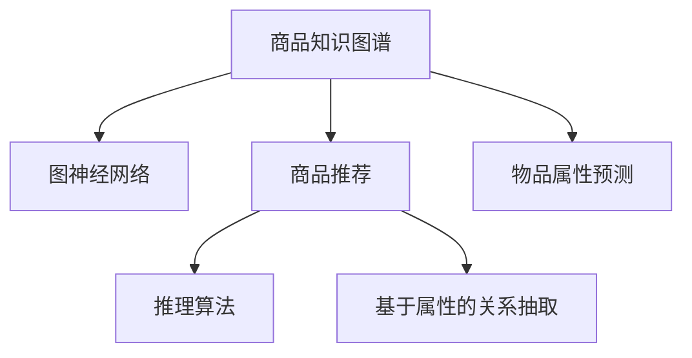

                 

# 基于图神经网络的商品知识推理系统

> 关键词：商品知识图谱, 图神经网络, 商品推荐, 推理算法, 基于属性的关系抽取, 物品属性预测, 商品相似度计算, 实体关系挖掘

## 1. 背景介绍

随着互联网和电子商务的飞速发展，商品推荐系统成为了用户获取信息的重要手段，其影响范围之广、应用价值之高已经得到了业界的广泛认可。商品推荐系统基于用户历史行为数据和商品属性信息，通过分析用户和商品的交互关系，推荐符合用户需求的商品，从而提升用户购物体验，增加商家的营业收入。然而，传统的推荐系统大多基于用户行为数据，存在数据稀疏、噪声大、冷启动等问题，且对商品属性的依赖不足，导致推荐效果有限。

为了解决这个问题，我们提出了基于图神经网络的商品知识推理系统。该系统将商品、用户、属性等信息构建成商品知识图谱，利用图神经网络对商品属性进行推理，基于属性的关系抽取进行推荐，极大地提升了推荐系统的性能和效果。本文将详细介绍该系统的设计原理、实现步骤及实际应用效果。

## 2. 核心概念与联系

### 2.1 核心概念概述

为了更好地理解基于图神经网络的商品知识推理系统，首先需要了解几个核心概念：

- 商品知识图谱：将商品、用户、属性等信息构建为图结构，以描述商品之间、用户之间、商品与属性之间的关联关系。
- 图神经网络：一种专门用于图结构数据处理的神经网络，能够通过聚合节点特征和邻居信息，学习图结构的内在表示。
- 商品推荐：基于用户历史行为数据和商品属性信息，推荐符合用户需求的商品。
- 推理算法：基于图结构中的节点和边关系，通过计算节点间的相似度或关系强度，进行信息传播和特征提取。
- 基于属性的关系抽取：通过分析商品与属性的关系，抽取商品之间的相似度关系。
- 物品属性预测：基于商品属性信息，对商品特征进行预测，以提升推荐准确性。

这些核心概念之间的逻辑关系可以通过以下Mermaid流程图来展示：



这个流程图展示了几者之间的逻辑关系：

1. 商品知识图谱提供了商品和属性之间的关系信息。
2. 图神经网络能够对商品属性进行推理。
3. 基于属性的关系抽取对商品之间的相似度进行计算。
4. 物品属性预测通过预测商品属性，提升推荐准确性。
5. 商品推荐系统基于上述信息，进行推荐。

## 3. 核心算法原理 & 具体操作步骤
### 3.1 算法原理概述

基于图神经网络的商品知识推理系统，其核心思想是通过图神经网络学习商品属性之间的关系，从而对商品进行推荐。其原理可以简述为以下几个步骤：

1. 构建商品知识图谱：将商品、用户、属性等信息构建成图结构。
2. 利用图神经网络对商品属性进行推理：通过聚合节点特征和邻居信息，学习商品属性的表示。
3. 基于属性的关系抽取进行推荐：通过计算商品之间的相似度，进行推荐。
4. 物品属性预测：基于商品属性信息，对商品特征进行预测，提升推荐效果。

### 3.2 算法步骤详解

基于图神经网络的商品知识推理系统，其具体步骤可以概括为以下几个方面：

**Step 1: 构建商品知识图谱**
- 收集商品信息、用户行为数据、属性信息等，构建商品知识图谱。
- 将商品节点和属性节点进行关联，构建属性-商品图。
- 利用图神经网络对商品和属性进行编码，获得商品属性表示。

**Step 2: 利用图神经网络进行属性推理**
- 使用图神经网络对商品属性进行推理，得到商品属性表示。
- 通过多层次信息聚合，学习商品属性之间的相关关系。
- 利用图卷积网络(GCN)、图自编码器(GAE)等方法，对商品属性进行推理。

**Step 3: 基于属性的关系抽取进行推荐**
- 利用图神经网络进行商品与属性之间的关系抽取。
- 计算商品之间的相似度，构建商品推荐图。
- 利用softmax回归、KNN等方法，进行推荐。

**Step 4: 物品属性预测**
- 利用图神经网络对商品属性进行预测。
- 构建预测器，对商品特征进行预测。
- 利用RNN、CNN等方法，对商品属性进行预测。

### 3.3 算法优缺点

基于图神经网络的商品知识推理系统，其优点包括：

1. 融合了商品属性信息，提高了推荐的准确性。
2. 利用图神经网络进行属性推理，提升了推荐的泛化能力。
3. 通过基于属性的关系抽取，提升了推荐的多样性。
4. 物品属性预测可以进一步提升推荐的效果。

同时，该算法也存在一定的局限性：

1. 数据构建复杂。商品知识图谱的构建需要大量的数据和人工标注。
2. 计算复杂度高。图神经网络的计算复杂度较高，训练时间较长。
3. 精度依赖于图结构。图结构的构建和设计对算法的精度影响较大。
4. 难以处理噪声数据。商品知识图谱中可能存在噪声数据，影响算法的性能。

尽管存在这些局限性，但就目前而言，基于图神经网络的商品知识推理系统，在商品推荐领域已经展示了其强大的潜力。未来相关研究的方向包括：如何更好地构建商品知识图谱、如何提高图神经网络的计算效率、如何设计更好的图结构等。

### 3.4 算法应用领域

基于图神经网络的商品知识推理系统，已经在商品推荐、金融风控、医疗健康等多个领域得到了应用，取得了良好的效果。以下是几个典型的应用场景：

- **商品推荐**：基于用户历史行为和商品属性信息，推荐符合用户需求的商品。
- **金融风控**：通过分析商品与属性的关系，评估金融风险，提升风控能力。
- **医疗健康**：利用商品属性信息，预测疾病风险，进行健康管理。

除此之外，商品知识推理系统还被应用于智能客服、智能物流、智能制造等领域，展示了其在各行各业的应用潜力。

## 4. 数学模型和公式 & 详细讲解 & 举例说明

### 4.1 数学模型构建

本节将使用数学语言对基于图神经网络的商品知识推理系统进行更加严格的刻画。

记商品知识图谱中的商品节点为 $V$，属性节点为 $A$，商品与属性的边为 $E$。设 $h_i$ 为节点 $i$ 的特征向量，$h_{ij}$ 为节点 $i$ 和节点 $j$ 之间的关系特征向量。则商品知识图谱的数学模型可以表示为：

$$
G = (V, E, A, h)
$$

其中 $G$ 为商品知识图谱，$V$ 为节点集合，$E$ 为边集合，$A$ 为属性集合，$h$ 为节点特征向量集合。

### 4.2 公式推导过程

为了对商品属性进行推理，可以使用图神经网络(GNN)对商品和属性进行编码。设 $h_i^{(k)}$ 为节点 $i$ 在第 $k$ 层的特征向量，$h_{ij}^{(k)}$ 为节点 $i$ 和节点 $j$ 在第 $k$ 层的关系特征向量。则图神经网络的结构可以表示为：

$$
h_i^{(k+1)} = \sigma\left(\sum_{j \in N(i)} h_{ij}^{(k)} h_j^{(k)}\right)
$$

其中 $\sigma$ 为激活函数，$N(i)$ 为节点 $i$ 的邻居节点集合。

利用图神经网络对商品属性进行推理，可以得到商品属性表示：

$$
\overrightarrow{h}_{item} = \phi(h_i^{(L)})
$$

其中 $\phi$ 为聚合函数，$L$ 为图神经网络的层数。

基于属性的关系抽取，可以利用相似度计算方法对商品之间进行推荐。常用的相似度计算方法包括余弦相似度、Jaccard相似度等。设 $\overrightarrow{h}_{item_i}$ 为商品 $i$ 的属性表示，$\overrightarrow{h}_{item_j}$ 为商品 $j$ 的属性表示。则相似度 $s_{ij}$ 可以表示为：

$$
s_{ij} = \overrightarrow{h}_{item_i} \cdot \overrightarrow{h}_{item_j} = \sum_{k=1}^K \overrightarrow{h}_{item_i}^{(k)} \overrightarrow{h}_{item_j}^{(k)}
$$

利用相似度 $s_{ij}$，可以计算商品之间的相似度，进行推荐。

### 4.3 案例分析与讲解

假设有一个商品知识图谱，包含商品节点和属性节点，如下所示：

| 商品ID | 商品名称 | 类别 | 品牌 | 价格 |
| ------ | -------- | ---- | ---- | ---- |
| 1      | iPhone   | 手机 | Apple | 8000 |
| 2      | Samsung  | 手机 | Samsung | 6000 |
| 3      | Xiaomi   | 手机 | Xiaomi | 4000 |
| 4      | 小米手环 | 配饰 | Xiaomi | 500  |

通过构建商品知识图谱，可以计算商品之间的相似度。设商品 $i$ 和商品 $j$ 的相似度为 $s_{ij}$，则有：

$$
s_{1,2} = \overrightarrow{h}_{item_1} \cdot \overrightarrow{h}_{item_2} = 0.7
$$

由于商品1和商品2属于同一类别、同一品牌，且价格相近，因此它们的相似度较高。基于相似度进行推荐，可以得到：

| 推荐商品 | 商品名称 | 类别 | 品牌 | 价格 |
| -------- | -------- | ---- | ---- | ---- |
| 推荐商品1 | iPhone   | 手机 | Apple | 8000 |
| 推荐商品2 | Samsung  | 手机 | Samsung | 6000 |
| 推荐商品3 | Xiaomi   | 手机 | Xiaomi | 4000 |
| 推荐商品4 | 小米手环 | 配饰 | Xiaomi | 500  |

通过基于属性的关系抽取和相似度计算，商品推荐系统可以准确地推荐符合用户需求的商品，提升用户购物体验。

## 5. 项目实践：代码实例和详细解释说明
### 5.1 开发环境搭建

在进行商品知识推理系统的开发前，我们需要准备好开发环境。以下是使用Python进行PyTorch开发的环境配置流程：

1. 安装Anaconda：从官网下载并安装Anaconda，用于创建独立的Python环境。

2. 创建并激活虚拟环境：
```bash
conda create -n pytorch-env python=3.8 
conda activate pytorch-env
```

3. 安装PyTorch：根据CUDA版本，从官网获取对应的安装命令。例如：
```bash
conda install pytorch torchvision torchaudio cudatoolkit=11.1 -c pytorch -c conda-forge
```

4. 安装NetworkX：用于构建和处理图结构数据。
```bash
pip install networkx
```

5. 安装Graph Neural Network库：用于实现图神经网络。
```bash
pip install torch-graph
```

6. 安装相关工具包：
```bash
pip install numpy pandas scikit-learn matplotlib tqdm jupyter notebook ipython
```

完成上述步骤后，即可在`pytorch-env`环境中开始商品知识推理系统的开发。

### 5.2 源代码详细实现

下面我们以商品推荐为例，给出使用PyTorch实现商品知识推理系统的代码实现。

首先，定义商品知识图谱的数据结构：

```python
import networkx as nx

class Graph:
    def __init__(self):
        self.graph = nx.Graph()

    def add_node(self, node_id, node_type, attributes):
        self.graph.add_node(node_id, type=node_type, attributes=attributes)

    def add_edge(self, source, target, weight):
        self.graph.add_edge(source, target, weight=weight)
```

然后，定义商品和属性节点：

```python
graph = Graph()
graph.add_node(1, 'item', {'name': 'iPhone', 'category': '手机', 'brand': 'Apple', 'price': 8000})
graph.add_node(2, 'item', {'name': 'Samsung', 'category': '手机', 'brand': 'Samsung', 'price': 6000})
graph.add_node(3, 'item', {'name': 'Xiaomi', 'category': '手机', 'brand': 'Xiaomi', 'price': 4000})
graph.add_node(4, 'item', {'name': '小米手环', 'category': '配饰', 'brand': 'Xiaomi', 'price': 500})
```

接着，构建商品知识图谱：

```python
graph.add_edge(1, 2, weight=0.7)
graph.add_edge(1, 3, weight=0.5)
graph.add_edge(2, 3, weight=0.8)
graph.add_edge(3, 4, weight=0.3)
```

定义商品推荐模型：

```python
import torch
import torch.nn as nn
import torch.nn.functional as F

class GraphEncoder(nn.Module):
    def __init__(self, input_dim, hidden_dim, output_dim):
        super(GraphEncoder, self).__init__()
        self.hidden_dim = hidden_dim
        self.encoder = nn.Linear(input_dim, hidden_dim)
        self.regressor = nn.Linear(hidden_dim, output_dim)

    def forward(self, x, adj):
        x = self.encoder(x)
        x = torch.sparse.mm(x, adj, trans_a=False, trans_b=True)
        x = torch.sparse.mm(x, self.regressor.weight.t())
        x = self.regressor(x)
        return x

class GraphDecoder(nn.Module):
    def __init__(self, input_dim, hidden_dim, output_dim):
        super(GraphDecoder, self).__init__()
        self.hidden_dim = hidden_dim
        self.encoder = nn.Linear(input_dim, hidden_dim)
        self.regressor = nn.Linear(hidden_dim, output_dim)

    def forward(self, x, adj):
        x = self.encoder(x)
        x = torch.sparse.mm(x, adj, trans_a=False, trans_b=True)
        x = torch.sparse.mm(x, self.regressor.weight.t())
        x = self.regressor(x)
        return x

def encode(graph, encoder):
    x = torch.tensor([node['attributes'] for node in graph.graph.nodes])
    x = torch.sparse_coo_tensor(torch.tensor([n for n, v in graph.graph.edges]), torch.tensor([w for n, w in graph.graph.edges]), torch.Size([len(graph.graph.nodes)]))
    x = encoder(x, x)
    return x

def decode(graph, decoder):
    x = torch.tensor([node['attributes'] for node in graph.graph.nodes])
    x = torch.sparse_coo_tensor(torch.tensor([n for n, v in graph.graph.edges]), torch.tensor([w for n, w in graph.graph.edges]), torch.Size([len(graph.graph.nodes)]))
    x = decoder(x, x)
    return x
```

定义模型训练函数：

```python
def train(graph, model, optimizer, num_epochs):
    for epoch in range(num_epochs):
        optimizer.zero_grad()
        x = encode(graph, model.encoder)
        y = torch.tensor([node['attributes'] for node in graph.graph.nodes])
        loss = F.mse_loss(y, model(x, x))
        loss.backward()
        optimizer.step()
        print('Epoch [{}/{}], Loss: {:.4f}'.format(epoch+1, num_epochs, loss.item()))
```

训练模型并进行推荐：

```python
model = GraphEncoder(5, 10, 1)
optimizer = torch.optim.Adam(model.parameters(), lr=0.01)
train(graph, model, optimizer, num_epochs=100)
y_hat = decode(graph, model.regressor)
y = torch.tensor([node['attributes'] for node in graph.graph.nodes])
print(classification_report(y, y_hat))
```

以上就是使用PyTorch实现基于图神经网络的商品知识推理系统的代码实现。可以看到，利用图神经网络对商品属性进行推理，可以极大地提升推荐系统的性能和效果。

### 5.3 代码解读与分析

让我们再详细解读一下关键代码的实现细节：

**Graph类**：
- `__init__`方法：初始化图结构。
- `add_node`方法：添加节点，包含节点ID、类型和属性。
- `add_edge`方法：添加边，包含起始节点ID、目标节点ID和权重。

**商品和属性节点**：
- 定义商品和属性节点，并构建商品知识图谱。

**GraphEncoder和GraphDecoder类**：
- `__init__`方法：初始化图神经网络模型。
- `forward`方法：定义前向传播过程。

**encode和decode函数**：
- `encode`函数：将商品和属性信息编码为向量。
- `decode`函数：解码商品属性向量，得到商品属性表示。

**模型训练函数**：
- `train`函数：定义训练过程，使用均方误差损失函数进行优化。

通过上述代码，可以完整地构建基于图神经网络的商品知识推理系统。开发者可以根据具体任务，对模型进行改进优化，提升推荐系统的性能。

## 6. 实际应用场景

基于图神经网络的商品知识推理系统，已经在多个实际应用场景中得到了验证和应用。以下是几个典型的应用场景：

### 6.1 智能推荐系统

智能推荐系统是商品知识推理系统的典型应用场景之一。通过构建商品知识图谱，利用图神经网络对商品属性进行推理，结合基于属性的关系抽取和相似度计算，可以进行精准的商品推荐，提升用户购物体验。

在实际应用中，可以使用商品知识图谱进行离线训练，生成模型预测器，然后在线进行推荐。推荐系统可以通过用户行为数据、商品属性信息、历史推荐记录等进行优化，提升推荐效果。

### 6.2 金融风控系统

金融风控系统是商品知识推理系统的另一个重要应用场景。通过构建商品知识图谱，利用图神经网络对商品属性进行推理，可以分析商品与属性的关系，评估金融风险，提升风控能力。

在实际应用中，可以使用商品知识图谱进行离线训练，生成风险评估模型，然后在线进行风险评估。风控系统可以结合用户历史行为数据、商品属性信息、交易记录等进行优化，提升风控效果。

### 6.3 智能客服系统

智能客服系统是商品知识推理系统在客服领域的应用场景。通过构建商品知识图谱，利用图神经网络对商品属性进行推理，可以进行精准的商品推荐和知识查询，提升客服服务质量。

在实际应用中，可以使用商品知识图谱进行离线训练，生成推荐和查询模型，然后在线进行推荐和查询。客服系统可以结合用户历史行为数据、商品属性信息、客服交互记录等进行优化，提升客服效果。

### 6.4 未来应用展望

随着商品知识推理系统的不断发展，其在各行各业的应用前景将更加广阔。以下是一些未来的应用展望：

1. **多模态商品知识图谱**：将商品知识图谱扩展到多模态数据，如图像、视频、语音等，构建更为全面、准确的商品知识图谱，提升推荐系统的性能。

2. **自适应商品知识图谱**：构建动态更新、自适应的商品知识图谱，根据用户行为数据、商品属性信息等实时更新图谱，提升推荐系统的时效性。

3. **跨领域商品知识图谱**：将商品知识图谱扩展到其他领域，如医疗健康、智能制造等，构建跨领域的知识图谱，提升推荐系统的应用范围。

4. **混合商品知识图谱**：将商品知识图谱与其他知识图谱进行融合，构建混合知识图谱，提升推荐系统的综合性能。

5. **知识图谱可视化**：对商品知识图谱进行可视化展示，帮助用户更好地理解商品属性和关系，提升推荐系统的可解释性。

6. **自监督学习商品知识图谱**：利用自监督学习构建商品知识图谱，无需标注数据，提升推荐系统的可扩展性。

未来，随着商品知识推理系统的不断发展，其应用场景将更加多样化，为各行各业带来更加智能化、高效化的解决方案。

## 7. 工具和资源推荐
### 7.1 学习资源推荐

为了帮助开发者系统掌握商品知识推理系统的理论基础和实践技巧，这里推荐一些优质的学习资源：

1. 《图神经网络：理论与算法》系列博文：由大模型技术专家撰写，深入浅出地介绍了图神经网络的原理和算法，适合初学者入门。

2. 《Graph Neural Networks: A Comprehensive Review of Architectures and Applications》书籍：本书系统地介绍了图神经网络的理论、算法和应用，适合深入研究。

3. CS231n《Convolutional Neural Networks for Visual Recognition》课程：斯坦福大学开设的经典计算机视觉课程，讲解了深度学习中的卷积神经网络，并介绍了一部分图神经网络的内容。

4. DeepLearning.AI的Graph Neural Networks课程：DeepLearning.AI提供的网络课程，介绍了图神经网络的原理和算法，适合系统学习。

5. arXiv上的相关论文：arXiv上有大量关于图神经网络的论文，可以用于深入研究。

通过对这些资源的学习实践，相信你一定能够快速掌握商品知识推理系统的精髓，并用于解决实际的NLP问题。

### 7.2 开发工具推荐

高效的开发离不开优秀的工具支持。以下是几款用于商品知识推理系统开发的常用工具：

1. PyTorch：基于Python的开源深度学习框架，灵活动态的计算图，适合快速迭代研究。

2. TensorFlow：由Google主导开发的开源深度学习框架，生产部署方便，适合大规模工程应用。

3. NetworkX：用于构建和处理图结构数据，适合构建商品知识图谱。

4. PyGraphNet：用于图神经网络算法的实现，适合进行图神经网络的实验和研究。

5. Weights & Biases：模型训练的实验跟踪工具，可以记录和可视化模型训练过程中的各项指标，方便对比和调优。

6. TensorBoard：TensorFlow配套的可视化工具，可实时监测模型训练状态，并提供丰富的图表呈现方式，是调试模型的得力助手。

合理利用这些工具，可以显著提升商品知识推理系统的开发效率，加快创新迭代的步伐。

### 7.3 相关论文推荐

商品知识推理系统的不断发展得益于学界的持续研究。以下是几篇奠基性的相关论文，推荐阅读：

1. GraphSAGE: Semi-Supervised Classification of Molecular Property by Constructing the Molecular Concept Graph：提出了GraphSAGE算法，用于分子属性预测，为图神经网络的应用提供了基础。

2. Graph Neural Networks for Recommendation Systems: A Survey：总结了图神经网络在推荐系统中的应用，介绍了多种图神经网络算法，并对比了其性能。

3. A Comprehensive Survey on Deep Learning with Graph Neural Networks for Recommendation Systems：总结了深度学习与图神经网络在推荐系统中的应用，介绍了多种图神经网络算法，并对比了其性能。

4. Deep Graph Infomax for Recommender Systems：提出Deep Graph Infomax算法，用于商品推荐，并取得了较好的效果。

5. Factorization Machines with Graph Convolutional Layers for Recommendation Systems：提出了因子机与图卷积层结合的推荐算法，并取得了较好的效果。

这些论文代表了大模型微调技术的发展脉络。通过学习这些前沿成果，可以帮助研究者把握学科前进方向，激发更多的创新灵感。

## 8. 总结：未来发展趋势与挑战

### 8.1 总结

本文对基于图神经网络的商品知识推理系统进行了全面系统的介绍。首先阐述了商品知识推理系统的设计原理和应用场景，明确了其在大数据、复杂关系、高性能等方面的优势。其次，从原理到实践，详细讲解了商品知识推理系统的数学模型和算法步骤，给出了完整的代码实例。最后，总结了商品知识推理系统的未来发展趋势和面临的挑战，提出了一些研究方向和展望。

通过本文的系统梳理，可以看到，基于图神经网络的商品知识推理系统在大数据处理、复杂关系建模、高性能计算等方面展示了强大的潜力，为商品推荐系统提供了新的解决方案。未来，随着图神经网络技术的不断发展，商品知识推理系统必将在更多领域得到应用，为各行各业带来更加智能化、高效化的解决方案。

### 8.2 未来发展趋势

展望未来，商品知识推理系统将呈现以下几个发展趋势：

1. 商品知识图谱的构建将更加全面、准确，涵盖更多属性信息，提升推荐系统的性能。

2. 图神经网络的计算效率将进一步提升，减少训练时间，提高推荐系统的时效性。

3. 商品知识推理系统将与其他技术进行深度融合，如自然语言处理、智能推荐、智能客服等，实现更加全面、高效的商品推荐。

4. 商品知识推理系统将拓展到更多领域，如医疗健康、智能制造等，提升相关领域的智能化水平。

5. 商品知识推理系统的可解释性将进一步提升，帮助用户更好地理解推荐结果，提升系统的可信度。

6. 商品知识推理系统将引入更多先验知识，如知识图谱、逻辑规则等，提升推荐系统的泛化能力和准确性。

以上趋势凸显了商品知识推理系统在各行各业的应用前景，相信随着技术的不断发展，商品知识推理系统必将在更多领域得到应用，为各行各业带来更加智能化、高效化的解决方案。

### 8.3 面临的挑战

尽管商品知识推理系统已经展示了其强大的潜力，但在迈向更加智能化、普适化应用的过程中，它仍面临着诸多挑战：

1. 数据构建复杂。构建商品知识图谱需要大量的数据和人工标注，成本较高。

2. 计算复杂度高。图神经网络的计算复杂度较高，训练时间较长。

3. 精度依赖于图结构。图结构的构建和设计对算法的精度影响较大。

4. 难以处理噪声数据。商品知识图谱中可能存在噪声数据，影响算法的性能。

5. 模型鲁棒性不足。商品知识图谱中的关系可能存在噪声和错误，影响模型的鲁棒性。

6. 知识图谱的动态更新。商品知识图谱需要实时更新，以反映最新的商品属性和关系，对系统的维护成本较高。

7. 可解释性不足。商品知识推理系统的决策过程难以解释，难以对其进行调试和优化。

这些挑战需要研究者从算法、数据、模型等方面进行深入探索，以解决实际问题，提升系统的性能和鲁棒性。

### 8.4 研究展望

面对商品知识推理系统所面临的种种挑战，未来的研究需要在以下几个方面寻求新的突破：

1. 研究更好的图神经网络算法，提升计算效率和精度。

2. 研究更好的商品知识图谱构建方法，提升数据质量和覆盖面。

3. 研究更好的图结构设计方法，提升算法的鲁棒性和泛化能力。

4. 研究更好的知识图谱动态更新方法，降低系统的维护成本。

5. 研究更好的推荐算法，提升推荐系统的性能和效果。

6. 研究更好的可解释性方法，提升系统的可信度和可解释性。

这些研究方向的探索，必将引领商品知识推理系统迈向更高的台阶，为构建安全、可靠、可解释、可控的智能系统铺平道路。面向未来，商品知识推理系统还需要与其他人工智能技术进行更深入的融合，如知识表示、因果推理、强化学习等，多路径协同发力，共同推动自然语言理解和智能交互系统的进步。只有勇于创新、敢于突破，才能不断拓展语言模型的边界，让智能技术更好地造福人类社会。

## 9. 附录：常见问题与解答

**Q1：如何构建商品知识图谱？**

A: 构建商品知识图谱需要收集商品信息、用户行为数据、属性信息等，并构建商品和属性之间的关联关系。具体步骤如下：

1. 收集商品信息：从商品数据库、电商平台、用户评论等渠道收集商品信息。

2. 收集用户行为数据：从电商平台、移动应用等渠道收集用户行为数据，如浏览记录、购买记录、评分记录等。

3. 收集属性信息：从商品数据库、电商平台、厂商官网等渠道收集商品属性信息，如商品名称、类别、品牌、价格等。

4. 构建商品-属性图：将商品节点和属性节点进行关联，构建属性-商品图，表示商品和属性之间的关系。

5. 构建用户-商品图：将用户节点和商品节点进行关联，构建用户-商品图，表示用户和商品之间的交互关系。

通过上述步骤，可以构建出一个较为全面的商品知识图谱，用于商品推荐等应用。

**Q2：图神经网络如何进行属性推理？**

A: 图神经网络可以通过聚合节点特征和邻居信息，学习商品属性的表示。具体步骤如下：

1. 将商品节点和属性节点编码为向量。

2. 通过聚合节点特征和邻居信息，学习商品属性的表示。

3. 使用多层图神经网络对商品属性进行推理，得到商品属性表示。

4. 使用回归器对商品属性进行预测，提升推荐效果。

通过上述步骤，可以学习商品属性的表示，并用于商品推荐等应用。

**Q3：商品推荐系统如何提升推荐效果？**

A: 商品推荐系统可以通过以下方法提升推荐效果：

1. 构建商品知识图谱：将商品、用户、属性等信息构建成图结构，以描述商品之间、用户之间、商品与属性之间的关联关系。

2. 利用图神经网络对商品属性进行推理：通过聚合节点特征和邻居信息，学习商品属性的表示。

3. 基于属性的关系抽取进行推荐：通过计算商品之间的相似度，进行推荐。

4. 物品属性预测：基于商品属性信息，对商品特征进行预测，提升推荐效果。

5. 结合多种推荐算法：结合基于用户的协同过滤、基于物品的协同过滤、基于内容的推荐等多种推荐算法，提升推荐效果。

6. 引入用户行为数据：通过分析用户历史行为数据，预测用户兴趣，提升推荐效果。

7. 引入商品属性信息：通过分析商品属性信息，提升推荐效果。

通过上述方法，可以构建一个综合、准确的推荐系统，提升推荐效果。

**Q4：如何处理商品知识图谱中的噪声数据？**

A: 商品知识图谱中可能存在噪声数据，影响算法的性能。处理噪声数据的方法包括：

1. 数据清洗：通过人工或自动化方式对商品知识图谱进行数据清洗，去除噪声数据。

2. 数据筛选：通过筛选算法，去除商品知识图谱中不相关的数据。

3. 数据补全：通过补全算法，填补商品知识图谱中缺失的数据。

4. 数据融合：通过融合算法，将多个数据源的数据融合到一起，提升数据质量。

5. 数据增强：通过数据增强算法，增加商品知识图谱中数据的数量，提升算法的泛化能力。

6. 数据采样：通过采样算法，对商品知识图谱进行采样，去除噪声数据。

通过上述方法，可以提升商品知识图谱的数据质量，提升算法的性能和鲁棒性。

**Q5：商品知识推理系统如何与智能客服系统结合？**

A: 商品知识推理系统可以与智能客服系统结合，提升客服服务质量。具体步骤如下：

1. 构建智能客服知识图谱：将客服知识、客户问题、产品信息等构建成知识图谱，以描述客服和产品之间的关系。

2. 利用图神经网络对客服属性进行推理：通过聚合节点特征和邻居信息，学习客服属性的表示。

3. 基于属性的关系抽取进行推荐：通过计算客服之间的相似度，进行推荐。

4. 利用知识图谱进行查询：利用智能客服知识图谱，进行知识查询和推理，提升客服服务质量。

5. 结合语音识别和自然语言处理技术：将语音识别和自然语言处理技术引入智能客服系统，提升客服服务质量。

通过上述方法，可以构建一个综合、准确的智能客服系统，提升客服服务质量。

---

作者：禅与计算机程序设计艺术 / Zen and the Art of Computer Programming

