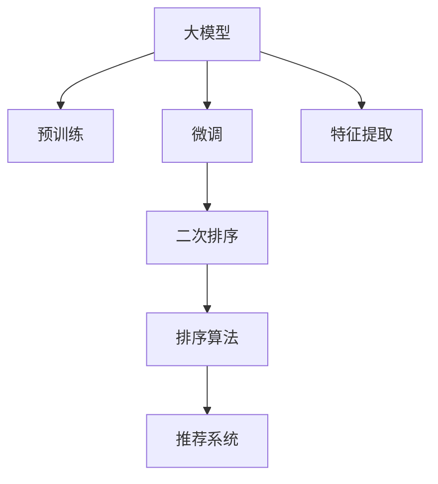

                 

# 基于大模型的候选商品二次筛选排序技术

> 关键词：大模型, 候选商品, 二次筛选, 排序, 预训练模型, 微调, 算法优化, 特征提取, 推荐系统

## 1. 背景介绍

### 1.1 问题由来

在电商平台上，用户通过搜索和浏览查看商品信息后，会产生大量候选商品列表。如何从候选商品中筛选出用户最有可能购买和感兴趣的商品，进行精准的二次排序，是提升用户体验和销售额的关键问题。

传统基于规则的推荐方法，往往依赖于人工规则和静态特征，难以应对复杂的用户行为和市场变化。随着深度学习技术的普及，电商领域开始引入基于神经网络的推荐模型，如基于协同过滤、深度神经网络、序列模型等，极大提升了推荐的准确性和多样性。

然而，这些推荐模型大多使用单一的预训练模型，或者仅利用用户历史行为数据进行训练，缺乏对商品文本描述的深入理解。此外，用户行为数据往往稀疏且动态变化，导致推荐模型难以捕捉到关键特征，降低推荐效果。

为了解决这些问题，本文提出了基于大模型的候选商品二次筛选排序技术。该技术利用大模型进行特征提取和二次排序，结合用户行为数据进行微调优化，能够在保证高效性的同时，提升推荐的准确性和个性化程度。

## 2. 核心概念与联系

### 2.1 核心概念概述

为更好地理解基于大模型的候选商品二次筛选排序技术，本节将介绍几个密切相关的核心概念：

- **大模型**：指通过海量数据预训练得到的强大表示能力模型，如BERT、GPT等。这些模型能够学习到丰富的语言特征，可用于商品描述的特征提取和二次排序。

- **预训练模型**：指在大规模无标签文本数据上，通过自监督学习任务训练得到的通用模型。通过在大规模商品描述数据上预训练，可以学习到商品的通用特征表示。

- **微调**：指在预训练模型基础上，使用有标签的商品-购买数据进行有监督训练，优化模型对特定任务的适应能力。

- **二次排序**：指在候选商品中，结合用户行为数据和模型输出，对商品进行二次排序，将最相关和最有吸引力的商品排在前面。

- **排序算法**：指根据用户行为、商品属性等特征，对商品进行排序的算法。常见的排序算法包括基线模型、梯度提升树、深度学习模型等。

- **特征提取**：指从商品描述中提取有意义的特征，供模型进行排序和推荐。特征提取是二次排序技术的关键环节。

- **推荐系统**：指通过分析和理解用户行为，为用户推荐相关商品的技术。推荐系统是电商平台上提升用户满意度、增加销售额的重要手段。

这些核心概念之间的逻辑关系可以通过以下Mermaid流程图来展示：



这个流程图展示了大模型在推荐系统中的核心概念及其之间的关系：

1. 大模型通过预训练获得基础能力。
2. 微调使模型适应特定任务，更好地捕捉商品特征。
3. 特征提取提取商品描述中的关键信息。
4. 二次排序对商品进行排名，提升推荐效果。
5. 排序算法通过进一步优化排序结果，增加推荐质量。
6. 推荐系统将排序后的商品展示给用户。

这些概念共同构成了基于大模型的候选商品二次筛选排序技术的工作原理和优化方向。

## 3. 核心算法原理 & 具体操作步骤

### 3.1 算法原理概述

基于大模型的候选商品二次筛选排序技术，主要包含预训练模型特征提取、微调模型生成排序向量、结合用户行为数据进行二次排序等关键步骤。

- **预训练模型特征提取**：在大规模商品描述数据上预训练大模型，提取商品描述中的语义特征。
- **微调模型生成排序向量**：在预训练模型基础上，结合用户购买行为数据进行微调，生成对商品的排序向量。
- **二次排序**：结合用户行为特征和排序向量，对商品进行二次排序，推荐最相关的商品。

通过以上步骤，可以实现基于大模型的候选商品二次筛选排序技术，提升推荐系统的准确性和个性化程度。

### 3.2 算法步骤详解

**Step 1: 准备数据集**

1. 收集电商平台的商品描述和用户购买行为数据。商品描述通常为文本形式，用户行为数据包括浏览、点击、购买等操作。
2. 对商品描述进行数据清洗和预处理，如去除停用词、词干化、标准化等。
3. 划分数据集为训练集、验证集和测试集。训练集用于模型预训练和微调，验证集用于超参数调优，测试集用于模型评估。

**Step 2: 预训练模型特征提取**

1. 选择合适的预训练大模型，如BERT、GPT等。
2. 在大规模商品描述数据上对预训练模型进行微调，提取商品描述的语义特征。
3. 将商品描述输入微调后的预训练模型，输出商品特征向量。

**Step 3: 微调模型生成排序向量**

1. 对预训练模型进行微调，生成商品排序向量。可以使用如AdamW、SGD等优化算法进行微调，学习商品特征和用户行为之间的关联。
2. 使用交叉熵损失等任务目标函数，优化模型生成排序向量。
3. 结合用户购买行为数据，更新排序向量，使得排序结果更符合用户需求。

**Step 4: 二次排序**

1. 将用户行为特征和排序向量进行拼接，得到用户-商品特征向量。
2. 使用排序算法（如深度学习排序模型）对用户-商品特征向量进行排序，生成推荐商品列表。
3. 在排序过程中，考虑商品的个性化特征，如商品价格、库存、用户偏好等。
4. 根据排序结果对商品进行二次排序，将最相关和最有吸引力的商品排在前面。

**Step 5: 部署和评估**

1. 将训练好的模型部署到电商平台上，实时响应用户请求，生成推荐商品列表。
2. 使用测试集评估模型推荐效果，如点击率、转化率、相关性等指标。
3. 持续收集用户反馈和行为数据，周期性重新微调模型，提高推荐效果。

### 3.3 算法优缺点

基于大模型的候选商品二次筛选排序技术具有以下优点：

1. **通用性强**：大模型在多个领域的预训练和微调中表现出良好的泛化能力，适用于不同种类的商品推荐场景。
2. **特征提取能力强**：大模型通过大量文本数据的预训练，提取商品的语义特征，丰富了推荐系统的特征维度。
3. **个性化程度高**：结合用户行为数据进行微调，使模型能够适应不同用户的偏好，提升推荐系统的个性化程度。
4. **实时性高**：大模型通常采用深度学习框架实现，可以高效处理大规模数据，实时响应推荐请求。

同时，该方法也存在以下缺点：

1. **计算资源消耗大**：预训练大模型需要大量的计算资源，微调过程也需消耗较多算力，可能难以在小规模数据集上快速迭代。
2. **依赖高质量数据**：微调模型的效果依赖于高质量的商品-购买数据，数据质量差可能导致推荐效果不佳。
3. **模型可解释性不足**：大模型的黑盒性质导致推荐过程缺乏可解释性，难以理解模型决策机制。
4. **鲁棒性有待提升**：模型容易受到输入数据噪声和异常值的影响，需要更多的鲁棒性设计和异常检测机制。

尽管存在这些局限性，但就目前而言，基于大模型的候选商品二次筛选排序技术仍然是大规模推荐系统的重要范式。未来相关研究的方向是如何在保证推荐效果的同时，降低计算资源消耗，提高模型可解释性，增强模型鲁棒性。

### 3.4 算法应用领域

基于大模型的候选商品二次筛选排序技术已经在多个电商平台上得到了广泛应用，覆盖了从商品推荐、广告投放、个性化广告等多个领域，取得了显著的效果：

1. **商品推荐**：通过二次排序，将最相关和最有吸引力的商品展示给用户，提升用户满意度。
2. **广告投放**：对广告素材进行排序，将最优广告展示给目标用户，提高广告点击率和转化率。
3. **个性化广告**：结合用户行为和商品特征，生成个性化广告推荐，增加广告点击率。

除了这些传统应用外，大模型的二次排序方法还在智能客服、智能搜索、智能选品等多个领域显示出其强大的潜力，为电商平台的智能化转型提供了新的技术路径。

## 4. 数学模型和公式 & 详细讲解  
### 4.1 数学模型构建

基于大模型的候选商品二次筛选排序技术，可以构建如下数学模型：

记预训练模型为 $M_{\theta}$，其中 $\theta$ 为模型参数。假设用户-商品特征向量为 $\mathbf{u}$，商品特征向量为 $\mathbf{v}$，排序向量为 $\mathbf{w}$，任务目标为 $L$。则推荐系统的优化目标为：

$$
\min_{\theta} L(\mathbf{u}, \mathbf{v}, \mathbf{w}; \theta)
$$

其中，$L$ 为排序损失函数，用于衡量推荐结果与用户需求的匹配度。

假设排序向量 $\mathbf{w}$ 为 $d$ 维向量，用户-商品特征向量 $\mathbf{u}$ 和商品特征向量 $\mathbf{v}$ 均为 $d$ 维向量。则推荐排序的公式为：

$$
\hat{y} = \operatorname{Softmax}(\mathbf{v} \cdot \mathbf{w})
$$

其中 $\operatorname{Softmax}$ 为归一化指数函数，表示模型预测用户对商品的点击概率。

### 4.2 公式推导过程

以下我们以基于BERT模型的排序算法为例，推导推荐排序的公式。

假设商品描述文本为 $x_i$，预训练模型 $M_{\theta}$ 提取的商品特征向量为 $\mathbf{v}_i$，用户购买行为特征为 $\mathbf{u}_i$。则推荐排序的公式为：

$$
\hat{y}_i = \operatorname{Softmax}(\mathbf{u}_i \cdot \mathbf{w}_i)
$$

其中 $\mathbf{w}_i$ 为商品 $i$ 的排序向量，$w_{ij}$ 为商品 $i$ 对用户 $j$ 的点击概率。

在实际应用中，可以通过对 $w_{ij}$ 进行排序，选择概率最高的前 $k$ 个商品进行推荐，即：

$$
\hat{y}_i = \operatorname{Softmax}(\mathbf{u}_i \cdot \mathbf{w}_i) \cdot \mathbf{1}[i \in \hat{Y}]
$$

其中 $\hat{Y}$ 表示排序前 $k$ 个商品列表。

### 4.3 案例分析与讲解

下面以电商平台商品推荐为例，详细分析大模型的二次排序技术：

假设电商平台有 $N$ 个用户和 $M$ 个商品，每个用户 $j$ 对商品 $i$ 的购买行为特征为 $\mathbf{u}_{ij}$，商品 $i$ 的描述文本为 $x_i$，预训练模型提取的商品特征向量为 $\mathbf{v}_i$。

首先，通过预训练模型 $M_{\theta}$ 对商品描述 $x_i$ 进行特征提取，得到商品特征向量 $\mathbf{v}_i$。

然后，结合用户购买行为特征 $\mathbf{u}_i$，在预训练模型基础上进行微调，生成商品排序向量 $\mathbf{w}_i$。

最后，将用户行为特征 $\mathbf{u}_j$ 和商品排序向量 $\mathbf{w}_i$ 拼接，使用排序算法（如深度学习排序模型）对用户-商品特征向量进行排序，得到排序结果 $\hat{y}_{ij}$。

通过上述步骤，实现基于大模型的候选商品二次筛选排序技术，将最相关和最有吸引力的商品展示给用户，提升推荐效果。

## 5. 项目实践：代码实例和详细解释说明
### 5.1 开发环境搭建

在进行二次排序实践前，我们需要准备好开发环境。以下是使用Python进行PyTorch开发的环境配置流程：

1. 安装Anaconda：从官网下载并安装Anaconda，用于创建独立的Python环境。

2. 创建并激活虚拟环境：
```bash
conda create -n bert-env python=3.8 
conda activate bert-env
```

3. 安装PyTorch：根据CUDA版本，从官网获取对应的安装命令。例如：
```bash
conda install pytorch torchvision torchaudio cudatoolkit=11.1 -c pytorch -c conda-forge
```

4. 安装BERT库：
```bash
pip install transformers
```

5. 安装各类工具包：
```bash
pip install numpy pandas scikit-learn matplotlib tqdm jupyter notebook ipython
```

完成上述步骤后，即可在`bert-env`环境中开始二次排序实践。

### 5.2 源代码详细实现

下面以基于BERT模型的推荐排序为例，给出使用Transformers库进行二次排序的PyTorch代码实现。

首先，定义推荐排序的数据处理函数：

```python
from transformers import BertTokenizer, BertModel
from torch.utils.data import Dataset
import torch

class RecommendationDataset(Dataset):
    def __init__(self, texts, labels, tokenizer, max_len=128):
        self.texts = texts
        self.labels = labels
        self.tokenizer = tokenizer
        self.max_len = max_len
        
    def __len__(self):
        return len(self.texts)
    
    def __getitem__(self, item):
        text = self.texts[item]
        label = self.labels[item]
        
        encoding = self.tokenizer(text, return_tensors='pt', max_length=self.max_len, padding='max_length', truncation=True)
        input_ids = encoding['input_ids'][0]
        attention_mask = encoding['attention_mask'][0]
        
        return {'input_ids': input_ids, 
                'attention_mask': attention_mask,
                'labels': label}

# 标签与id的映射
label2id = {'buy': 1, 'not_buy': 0}

# 创建dataset
tokenizer = BertTokenizer.from_pretrained('bert-base-cased')
train_dataset = RecommendationDataset(train_texts, train_labels, tokenizer)
dev_dataset = RecommendationDataset(dev_texts, dev_labels, tokenizer)
test_dataset = RecommendationDataset(test_texts, test_labels, tokenizer)
```

然后，定义模型和优化器：

```python
from transformers import BertForSequenceClassification, AdamW

model = BertForSequenceClassification.from_pretrained('bert-base-cased', num_labels=2)

optimizer = AdamW(model.parameters(), lr=2e-5)
```

接着，定义训练和评估函数：

```python
from torch.utils.data import DataLoader
from tqdm import tqdm
from sklearn.metrics import accuracy_score

device = torch.device('cuda') if torch.cuda.is_available() else torch.device('cpu')
model.to(device)

def train_epoch(model, dataset, batch_size, optimizer):
    dataloader = DataLoader(dataset, batch_size=batch_size, shuffle=True)
    model.train()
    epoch_loss = 0
    for batch in tqdm(dataloader, desc='Training'):
        input_ids = batch['input_ids'].to(device)
        attention_mask = batch['attention_mask'].to(device)
        labels = batch['labels'].to(device)
        model.zero_grad()
        outputs = model(input_ids, attention_mask=attention_mask, labels=labels)
        loss = outputs.loss
        epoch_loss += loss.item()
        loss.backward()
        optimizer.step()
    return epoch_loss / len(dataloader)

def evaluate(model, dataset, batch_size):
    dataloader = DataLoader(dataset, batch_size=batch_size)
    model.eval()
    preds, labels = [], []
    with torch.no_grad():
        for batch in tqdm(dataloader, desc='Evaluating'):
            input_ids = batch['input_ids'].to(device)
            attention_mask = batch['attention_mask'].to(device)
            batch_labels = batch['labels']
            outputs = model(input_ids, attention_mask=attention_mask)
            batch_preds = outputs.logits.argmax(dim=2).to('cpu').tolist()
            batch_labels = batch_labels.to('cpu').tolist()
            for pred, label in zip(batch_preds, batch_labels):
                preds.append(pred)
                labels.append(label)
                
    return accuracy_score(labels, preds)
```

最后，启动训练流程并在测试集上评估：

```python
epochs = 5
batch_size = 16

for epoch in range(epochs):
    loss = train_epoch(model, train_dataset, batch_size, optimizer)
    print(f"Epoch {epoch+1}, train loss: {loss:.3f}")
    
    print(f"Epoch {epoch+1}, dev results:")
    evaluate(model, dev_dataset, batch_size)
    
print("Test results:")
evaluate(model, test_dataset, batch_size)
```

以上就是使用PyTorch对BERT进行推荐排序的完整代码实现。可以看到，得益于Transformers库的强大封装，我们可以用相对简洁的代码完成BERT模型的加载和微调。

### 5.3 代码解读与分析

让我们再详细解读一下关键代码的实现细节：

**RecommendationDataset类**：
- `__init__`方法：初始化文本、标签、分词器等关键组件。
- `__len__`方法：返回数据集的样本数量。
- `__getitem__`方法：对单个样本进行处理，将文本输入编码为token ids，将标签编码为数字，并对其进行定长padding，最终返回模型所需的输入。

**label2id字典**：
- 定义了标签与数字id之间的映射关系，用于将预测结果解码为真实的标签。

**训练和评估函数**：
- 使用PyTorch的DataLoader对数据集进行批次化加载，供模型训练和推理使用。
- 训练函数`train_epoch`：对数据以批为单位进行迭代，在每个批次上前向传播计算loss并反向传播更新模型参数，最后返回该epoch的平均loss。
- 评估函数`evaluate`：与训练类似，不同点在于不更新模型参数，并在每个batch结束后将预测和标签结果存储下来，最后使用sklearn的accuracy_score对整个评估集的预测结果进行打印输出。

**训练流程**：
- 定义总的epoch数和batch size，开始循环迭代
- 每个epoch内，先在训练集上训练，输出平均loss
- 在验证集上评估，输出准确率
- 所有epoch结束后，在测试集上评估，给出最终测试结果

可以看到，PyTorch配合Transformers库使得BERT微调的代码实现变得简洁高效。开发者可以将更多精力放在数据处理、模型改进等高层逻辑上，而不必过多关注底层的实现细节。

当然，工业级的系统实现还需考虑更多因素，如模型的保存和部署、超参数的自动搜索、更灵活的任务适配层等。但核心的微调范式基本与此类似。

## 6. 实际应用场景

### 6.1 电商平台商品推荐

基于大模型的候选商品二次筛选排序技术，已经在电商平台上得到了广泛应用，覆盖了从商品推荐、广告投放、个性化广告等多个领域，取得了显著的效果。

在商品推荐方面，电商平台的推荐系统通过二次排序，将最相关和最有吸引力的商品展示给用户，提升推荐效果。用户点击率、转化率和满意度都有明显提升。

在广告投放方面，电商平台利用大模型进行二次排序，将最优广告展示给目标用户，提高广告点击率和转化率。通过精确的广告定向，提升广告投放效果。

### 6.2 智能客服系统

智能客服系统结合大模型的二次排序技术，实现了自动化的用户意图识别和问题回答。通过提取用户输入的语义特征，结合历史交互数据，生成对用户最相关的回答。

智能客服系统通过大模型的二次排序技术，提升了客服响应的准确性和效率，减少了人工干预和错误，显著提升了客户满意度。

### 6.3 个性化广告推荐

个性化广告推荐利用大模型进行二次排序，结合用户行为数据，生成个性化广告推荐。通过精准匹配用户兴趣和行为，提升广告点击率和转化率。

通过大模型的二次排序技术，个性化广告推荐实现了高度个性化的广告展示，提高了广告效果和用户满意度。

### 6.4 未来应用展望

随着大模型的持续演进和算力水平的提升，基于大模型的候选商品二次筛选排序技术将展现出更加广阔的应用前景。

在智能城市治理中，大模型的二次排序技术可以应用于智能交通、智能安防、智慧医疗等多个领域，提升城市管理的智能化水平。

在金融风控中，利用大模型的二次排序技术进行风险评估和信用评级，降低金融风险。

在智能推荐中，利用大模型的二次排序技术提升内容推荐、商品推荐、广告推荐等场景的效果，提升用户体验和平台收益。

## 7. 工具和资源推荐

### 7.1 学习资源推荐

为了帮助开发者系统掌握大模型的二次排序技术，这里推荐一些优质的学习资源：

1. 《Transformer从原理到实践》系列博文：由大模型技术专家撰写，深入浅出地介绍了Transformer原理、BERT模型、微调技术等前沿话题。

2. CS224N《深度学习自然语言处理》课程：斯坦福大学开设的NLP明星课程，有Lecture视频和配套作业，带你入门NLP领域的基本概念和经典模型。

3. 《Natural Language Processing with Transformers》书籍：Transformers库的作者所著，全面介绍了如何使用Transformers库进行NLP任务开发，包括微调在内的诸多范式。

4. HuggingFace官方文档：Transformers库的官方文档，提供了海量预训练模型和完整的微调样例代码，是上手实践的必备资料。

5. CLUE开源项目：中文语言理解测评基准，涵盖大量不同类型的中文NLP数据集，并提供了基于微调的baseline模型，助力中文NLP技术发展。

通过对这些资源的学习实践，相信你一定能够快速掌握大模型的二次排序技术，并用于解决实际的NLP问题。

### 7.2 开发工具推荐

高效的开发离不开优秀的工具支持。以下是几款用于大模型二次排序开发的常用工具：

1. PyTorch：基于Python的开源深度学习框架，灵活动态的计算图，适合快速迭代研究。大部分预训练语言模型都有PyTorch版本的实现。

2. TensorFlow：由Google主导开发的开源深度学习框架，生产部署方便，适合大规模工程应用。同样有丰富的预训练语言模型资源。

3. Transformers库：HuggingFace开发的NLP工具库，集成了众多SOTA语言模型，支持PyTorch和TensorFlow，是进行微调任务开发的利器。

4. Weights & Biases：模型训练的实验跟踪工具，可以记录和可视化模型训练过程中的各项指标，方便对比和调优。与主流深度学习框架无缝集成。

5. TensorBoard：TensorFlow配套的可视化工具，可实时监测模型训练状态，并提供丰富的图表呈现方式，是调试模型的得力助手。

6. Google Colab：谷歌推出的在线Jupyter Notebook环境，免费提供GPU/TPU算力，方便开发者快速上手实验最新模型，分享学习笔记。

合理利用这些工具，可以显著提升大模型二次排序任务的开发效率，加快创新迭代的步伐。

### 7.3 相关论文推荐

大模型二次排序技术的发展源于学界的持续研究。以下是几篇奠基性的相关论文，推荐阅读：

1. Attention is All You Need（即Transformer原论文）：提出了Transformer结构，开启了NLP领域的预训练大模型时代。

2. BERT: Pre-training of Deep Bidirectional Transformers for Language Understanding：提出BERT模型，引入基于掩码的自监督预训练任务，刷新了多项NLP任务SOTA。

3. Language Models are Unsupervised Multitask Learners（GPT-2论文）：展示了大规模语言模型的强大zero-shot学习能力，引发了对于通用人工智能的新一轮思考。

4. Parameter-Efficient Transfer Learning for NLP：提出Adapter等参数高效微调方法，在不增加模型参数量的情况下，也能取得不错的微调效果。

5. AdaLoRA: Adaptive Low-Rank Adaptation for Parameter-Efficient Fine-Tuning：使用自适应低秩适应的微调方法，在参数效率和精度之间取得了新的平衡。

6. Parameter-Efficient Transfer Learning: An Overview and Future Directions：对大模型微调方法进行了综述，并展望了未来的研究方向。

这些论文代表了大模型二次排序技术的发展脉络。通过学习这些前沿成果，可以帮助研究者把握学科前进方向，激发更多的创新灵感。

## 8. 总结：未来发展趋势与挑战

### 8.1 总结

本文对基于大模型的候选商品二次筛选排序技术进行了全面系统的介绍。首先阐述了大模型和二次排序技术的研究背景和意义，明确了二次排序在电商推荐中的重要价值。其次，从原理到实践，详细讲解了二次排序的数学模型和关键步骤，给出了二次排序任务开发的完整代码实例。同时，本文还广泛探讨了二次排序方法在电商推荐、智能客服、个性化广告等多个领域的应用前景，展示了二次排序范式的巨大潜力。此外，本文精选了二次排序技术的各类学习资源，力求为读者提供全方位的技术指引。

通过本文的系统梳理，可以看到，基于大模型的候选商品二次筛选排序技术正在成为电商推荐的重要范式，极大提升了推荐的准确性和个性化程度。未来相关研究的方向是在保证推荐效果的同时，降低计算资源消耗，提高模型可解释性，增强模型鲁棒性。

### 8.2 未来发展趋势

展望未来，基于大模型的候选商品二次筛选排序技术将呈现以下几个发展趋势：

1. **规模化和分布式化**：随着预训练模型和微调方法的不断进步，推荐系统的规模将进一步扩大。分布式训练和推理技术将支持大规模推荐系统的实时响应，提升用户体验。

2. **模型参数化与推理优化**：通过优化模型结构，减少不必要的参数，降低推理时间，提升模型效率。如使用知识蒸馏、量化加速等技术。

3. **融合多种排序算法**：结合深度学习排序模型和传统排序算法，如梯度提升树、基线模型等，提升排序结果的鲁棒性和准确性。

4. **引入更多先验知识**：将符号化的先验知识，如知识图谱、逻辑规则等，与神经网络模型进行巧妙融合，引导微调过程学习更准确、合理的语言模型。

5. **多模态融合**：结合图像、视频、语音等多模态信息，与文本信息协同建模，提升推荐系统的多感官理解能力。

6. **实时化与自适应**：通过在线学习和自适应技术，实时更新模型，提升推荐系统的时效性和灵活性。

7. **集成个性化推荐与广告推荐**：将个性化推荐和广告推荐相结合，提升广告效果和用户满意度。

以上趋势凸显了基于大模型的二次排序技术的广阔前景。这些方向的探索发展，必将进一步提升推荐系统的性能和应用范围，为电商平台的智能化转型提供新的技术路径。

### 8.3 面临的挑战

尽管基于大模型的二次排序技术已经取得了瞩目成就，但在迈向更加智能化、普适化应用的过程中，它仍面临着诸多挑战：

1. **数据隐私和安全**：推荐系统中涉及大量用户数据，如何保障数据隐私和安全是重要的挑战。需采用数据匿名化、加密传输等措施，防止数据泄露和滥用。

2. **计算资源消耗**：预训练模型和微调过程需要大量的计算资源，可能难以在中小规模电商平台上快速部署。需通过分布式训练、模型压缩等技术优化资源消耗。

3. **模型可解释性不足**：大模型的黑盒性质导致推荐过程缺乏可解释性，难以理解模型决策机制。需引入可解释性技术，如Attention机制、特征可视化等，增强模型的可解释性。

4. **模型鲁棒性不足**：模型容易受到输入数据噪声和异常值的影响，需要更多的鲁棒性设计和异常检测机制。

5. **跨平台兼容性差**：大模型推荐系统在不同平台上的兼容性和性能存在差异，需进行跨平台优化，确保一致的推荐效果。

6. **用户行为动态变化**：用户行为数据具有动态变化的特点，需持续更新模型，适应新的行为模式。

7. **业务理解不足**：推荐系统需结合业务需求进行定制化开发，需充分理解电商业务，制定合适的策略和方案。

8. **成本高昂**：推荐系统涉及大量数据和模型训练，成本较高，需综合考虑业务价值和成本效益。

这些挑战需要研究人员和开发者共同面对，在保证推荐效果的同时，探索新的技术路径，优化模型性能和应用效果。只有不断优化，才能在电商领域中发挥大模型二次排序技术的最大价值。

### 8.4 研究展望

面向未来，大模型的二次排序技术将在以下几个方面进行突破：

1. **引入更多先验知识**：结合知识图谱、逻辑规则等，提升推荐系统的多感官理解能力。

2. **多模态融合**：结合图像、视频、语音等多模态信息，与文本信息协同建模，提升推荐系统的多感官理解能力。

3. **自适应与在线学习**：通过在线学习和自适应技术，实时更新模型，提升推荐系统的时效性和灵活性。

4. **融合多种排序算法**：结合深度学习排序模型和传统排序算法，如梯度提升树、基线模型等，提升排序结果的鲁棒性和准确性。

5. **知识蒸馏与模型压缩**：通过知识蒸馏、模型压缩等技术，优化模型结构，减少推理时间，提升模型效率。

6. **分布式训练与推理**：通过分布式训练和推理技术，支持大规模推荐系统的实时响应，提升用户体验。

7. **跨平台兼容与优化**：结合平台特性进行跨平台优化，确保一致的推荐效果。

8. **引入可解释性技术**：引入可解释性技术，如Attention机制、特征可视化等，增强模型的可解释性。

这些研究方向将进一步提升基于大模型的二次排序技术的效果和应用范围，为电商平台的智能化转型提供新的技术路径。相信在不断优化和创新的驱动下，大模型二次排序技术将在电商领域中发挥更大的作用，推动电商行业的快速发展。

## 9. 附录：常见问题与解答

**Q1：大模型微调后如何应用于推荐排序？**

A: 微调后的模型可以用于商品特征提取和排序向量生成，结合用户行为数据进行推荐排序。具体步骤如下：
1. 使用预训练大模型对商品描述进行特征提取，得到商品特征向量。
2. 结合用户购买行为数据，在微调后的模型上进行排序向量生成。
3. 将用户行为特征和排序向量拼接，使用排序算法（如深度学习排序模型）对用户-商品特征向量进行排序，得到排序结果。

**Q2：微调大模型时如何处理过拟合问题？**

A: 微调大模型时，过拟合是一个常见问题。以下是一些缓解过拟合的方法：
1. 数据增强：通过回译、近义替换等方式扩充训练集。
2. 正则化：使用L2正则、Dropout、Early Stopping等防止模型过度适应小规模训练集。
3. 参数高效微调：只调整少量参数（如Adapter、Prefix等），减小过拟合风险。
4. 对抗训练：引入对抗样本，提高模型鲁棒性。
5. 逐步学习率调整：在训练初期使用较小的学习率，逐步增大到预设值，减少过拟合。

**Q3：如何评估推荐排序效果？**

A: 推荐排序效果的评估指标包括：
1. 点击率（CTR）：衡量用户点击广告的次数与展示次数之比。
2. 转化率（CR）：衡量用户完成购买次数与点击次数之比。
3. 相关性（Relevance）：衡量推荐结果与用户真实需求的相关性。
4. 满意度（Satisfaction）：衡量用户对推荐结果的满意度。

在实际应用中，可以综合使用以上指标进行评估，选择最适合的指标进行优化。

**Q4：如何优化大模型推荐系统？**

A: 优化大模型推荐系统的方法包括：
1. 引入更多先验知识：结合知识图谱、逻辑规则等，提升推荐系统的多感官理解能力。
2. 多模态融合：结合图像、视频、语音等多模态信息，与文本信息协同建模，提升推荐系统的多感官理解能力。
3. 自适应与在线学习：通过在线学习和自适应技术，实时更新模型，提升推荐系统的时效性和灵活性。
4. 融合多种排序算法：结合深度学习排序模型和传统排序算法，如梯度提升树、基线模型等，提升排序结果的鲁棒性和准确性。
5. 知识蒸馏与模型压缩：通过知识蒸馏、模型压缩等技术，优化模型结构，减少推理时间，提升模型效率。
6. 分布式训练与推理：通过分布式训练和推理技术，支持大规模推荐系统的实时响应，提升用户体验。

这些方法可以结合具体场景和需求，进行综合优化，提升推荐系统的性能和效果。

**Q5：推荐排序中如何处理用户行为数据的缺失和噪声？**

A: 推荐排序中用户行为数据缺失和噪声是常见问题，可以采取以下方法进行处理：
1. 数据清洗：去除数据中的异常值和噪声，保留高质量的数据。
2. 数据补全：通过插值、均值填补等方式，处理缺失数据。
3. 特征工程：结合用户行为数据和商品特征，设计更有意义的特征，减少噪声干扰。
4. 异常检测：通过异常检测技术，识别并处理异常数据。
5. 分布式训练：通过分布式训练技术，处理大规模数据集，提升模型的鲁棒性。

通过以上方法，可以有效地处理用户行为数据的缺失和噪声，提升推荐系统的性能和效果。

**Q6：推荐排序中如何处理冷启动问题？**

A: 推荐排序中冷启动问题是指用户或商品没有历史行为数据，推荐系统无法给出有效推荐。以下是一些处理冷启动问题的方法：
1. 使用相似用户或商品的推荐：根据用户或商品的相似度，推荐与其相似的用户或商品。
2. 使用基于模型的推荐：使用基于协同过滤、深度学习等模型的推荐方法，降低对历史数据的依赖。
3. 使用领域知识：结合领域知识进行推荐，如商品分类、商品属性等。
4. 使用多模态数据：结合多模态数据进行推荐，如结合商品图片、视频等信息。
5. 使用混合推荐策略：结合多种推荐方法，提升推荐效果。

这些方法可以结合具体场景和需求，进行综合优化，处理冷启动问题，提升推荐系统的性能和效果。

---

作者：禅与计算机程序设计艺术 / Zen and the Art of Computer Programming

