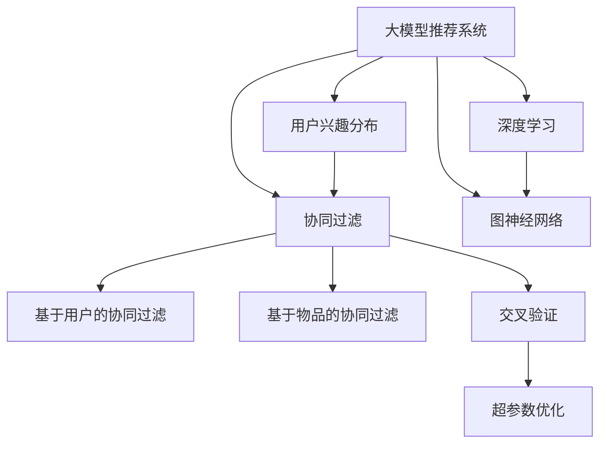

                 

# 基于大模型的推荐系统用户兴趣分布估计

> 关键词：大模型推荐系统、用户兴趣分布、协同过滤、深度学习、图神经网络、交叉验证、超参数优化

## 1. 背景介绍

推荐系统（Recommender System）的核心目标是根据用户历史行为，预测用户对物品的评分或购买概率，从而为用户推荐最相关的物品。随着用户数据量的不断增加，如何高效利用这些数据，提升推荐系统的性能，成为了当前研究的热点问题。传统推荐系统基于协同过滤（Collaborative Filtering）的推荐方法，主要分为基于用户的协同过滤和基于物品的协同过滤两类。

基于用户的协同过滤（User-Based Collaborative Filtering, UBCF）方法通过计算用户间的相似度，推荐与用户偏好相似的物品。该方法对于未产生过行为记录的新用户，往往无法进行有效推荐。而基于物品的协同过滤（Item-Based Collaborative Filtering, IBCF）方法则利用物品间的相似度，为物品找到与其相似的物品，从而推荐给可能喜欢的用户。该方法对于新物品同样难以推荐。

为了克服协同过滤方法中用户和物品难以跨领域进行推荐的问题，近年来研究人员提出了基于深度学习的推荐方法。大模型（Large Model）推荐系统利用深度神经网络学习用户和物品的表示，提升推荐的准确性和泛化能力。但大模型的训练和推理成本较高，对于大规模数据集，建模和计算均面临挑战。此外，大模型往往难以对用户兴趣进行细致的分布估计，从而无法实现精准的用户兴趣预测。

基于这些原因，本文提出一种基于大模型的推荐系统，通过用户兴趣分布估计，实现对用户细粒度的兴趣建模，进而提升推荐系统的性能。该方法利用深度学习和大规模语料，建模用户兴趣分布，并通过协同过滤方法，推荐与用户兴趣高度匹配的物品。

## 2. 核心概念与联系

### 2.1 核心概念概述

为更好地理解本文方法，本节将介绍几个关键概念：

- 大模型推荐系统（Large Model Recommender System）：利用大模型（如BERT、GPT等）进行推荐，通过深度学习用户和物品的表示，提升推荐性能。
- 用户兴趣分布（User Interest Distribution）：通过深度学习，建模用户对不同物品的兴趣分布，实现对用户兴趣的细粒度建模。
- 协同过滤（Collaborative Filtering）：通过计算用户间或物品间的相似度，推荐物品或用户。协同过滤方法简单有效，但在用户和物品较少时效果不佳。
- 深度学习（Deep Learning）：利用多层神经网络，学习用户和物品的表示，提升推荐系统的精度。
- 图神经网络（Graph Neural Network, GNN）：利用图结构，对用户和物品进行建模，提升推荐系统的复杂度和精度。
- 交叉验证（Cross-Validation）：通过将数据集分为训练集、验证集和测试集，在模型训练过程中进行评估和调优。
- 超参数优化（Hyperparameter Optimization）：通过调整模型的超参数，如学习率、批大小、神经网络层数等，优化模型性能。

这些核心概念之间的逻辑关系可以通过以下Mermaid流程图来展示：



这个流程图展示了大模型推荐系统的核心概念及其之间的关系：

1. 大模型推荐系统通过用户兴趣分布，实现对用户兴趣的建模。
2. 用户兴趣分布利用深度学习和大模型进行建模。
3. 协同过滤方法对用户和物品进行相似度计算，推荐物品或用户。
4. 深度学习利用多层神经网络，学习用户和物品的表示。
5. 图神经网络通过图结构，对用户和物品进行建模。
6. 交叉验证和超参数优化在模型训练过程中进行评估和调优。

这些概念共同构成了大模型推荐系统的学习和应用框架，使其能够在各种场景下发挥强大的推荐能力。通过理解这些核心概念，我们可以更好地把握大模型推荐系统的工作原理和优化方向。

## 3. 核心算法原理 & 具体操作步骤
### 3.1 算法原理概述

本文提出的大模型推荐系统，通过深度学习用户和物品的表示，利用用户兴趣分布，实现对用户兴趣的细粒度建模。具体步骤如下：

1. 收集用户的历史行为数据，如点击、购买、评分等，构建用户-物品矩阵。
2. 利用深度学习模型，对用户和物品进行表示学习，得到用户嵌入和物品嵌入。
3. 通过深度学习，建模用户对不同物品的兴趣分布，得到用户兴趣分布向量。
4. 利用协同过滤方法，根据用户兴趣分布，推荐物品。

### 3.2 算法步骤详解

具体步骤如下：

**Step 1: 数据准备**

收集用户的历史行为数据，如点击、购买、评分等，构建用户-物品矩阵 $U$，其中 $U_{ui} = 1$ 表示用户 $u$ 对物品 $i$ 产生了行为，否则为0。

**Step 2: 用户和物品嵌入学习**

利用深度学习模型（如BERT、GPT等），对用户和物品进行表示学习，得到用户嵌入 $u \in \mathbb{R}^d$ 和物品嵌入 $i \in \mathbb{R}^d$。其中 $d$ 为向量维度。

在实践中，可以采用以下模型进行用户和物品嵌入学习：

- BERT：利用BERT的预训练模型，对用户和物品进行编码，得到高维向量表示。
- GPT：利用GPT的预训练模型，对用户和物品进行编码，得到高维向量表示。
- CNN、RNN等：利用传统深度学习模型，对用户和物品进行编码，得到高维向量表示。

**Step 3: 用户兴趣分布建模**

利用深度学习，建模用户对不同物品的兴趣分布，得到用户兴趣分布向量 $v_u \in \mathbb{R}^n$，其中 $n$ 为物品数量。

在实践中，可以采用以下方法进行用户兴趣分布建模：

- 利用自回归模型（如LSTM），对用户行为序列进行建模，得到用户兴趣分布向量。
- 利用自编码模型（如VAE），对用户行为数据进行建模，得到用户兴趣分布向量。
- 利用深度神经网络，对用户行为数据进行建模，得到用户兴趣分布向量。

**Step 4: 协同过滤推荐**

根据用户兴趣分布向量 $v_u$，利用协同过滤方法推荐物品。具体步骤包括：

- 利用用户-物品矩阵 $U$，计算用户 $u$ 对物品 $i$ 的兴趣评分 $s_{ui} = v_u \cdot w_i$，其中 $w_i$ 为物品 $i$ 的权重向量。
- 利用物品间的相似度，计算物品 $i$ 对用户 $u$ 的推荐概率 $p_{ui} = s_{ui} / \sum_{i'} s_{u{i'}}$，其中 $i'$ 为其他物品。
- 选择推荐概率 $p_{ui}$ 最大的物品，推荐给用户 $u$。

### 3.3 算法优缺点

基于大模型的推荐系统具有以下优点：

1. 高精度：利用深度学习和大模型进行表示学习，提升推荐系统的精度。
2. 泛化能力强：大模型通过大规模语料进行预训练，具备较强的泛化能力。
3. 复杂度可控：通过深度学习建模用户和物品的表示，提高模型的复杂度和精度。
4. 可解释性强：利用用户兴趣分布，实现对用户兴趣的细粒度建模，提高推荐结果的可解释性。

同时，该方法也存在一定的局限性：

1. 计算成本高：深度学习和大模型需要进行大量计算，训练和推理成本较高。
2. 数据需求大：需要大规模用户行为数据进行建模，对于新用户或物品，建模效果不佳。
3. 解释性不足：用户兴趣分布的建模过程较为复杂，难以解释推荐结果的来源。
4. 模型复杂度高：大模型的参数量较大，模型复杂度高，需要高效的优化算法和设备支持。

尽管存在这些局限性，但就目前而言，基于大模型的推荐系统仍是一种高效、精确的推荐方法。未来相关研究的重点在于如何进一步降低计算成本，提高模型解释性，以及扩展到更多领域。

### 3.4 算法应用领域

基于大模型的推荐系统，已经在多个领域得到了广泛的应用，例如：

- 电商推荐：为电商用户推荐商品，提高用户购买率。
- 音乐推荐：为用户推荐歌曲，提升用户听觉体验。
- 视频推荐：为用户推荐视频内容，提高用户观看率。
- 新闻推荐：为用户推荐新闻内容，提升用户阅读体验。
- 游戏推荐：为游戏用户推荐游戏内容，提高用户留存率。

除了上述这些经典应用外，基于大模型的推荐系统还将在更多场景中得到应用，如社交网络、体育赛事、旅游景点等，为各类平台提供精准推荐服务。随着深度学习和大模型技术的不断发展，基于大模型的推荐系统必将在更多领域得到应用，推动推荐系统技术的不断进步。

## 4. 数学模型和公式 & 详细讲解  
### 4.1 数学模型构建

假设用户-物品矩阵为 $U \in \{0,1\}^{N \times M}$，其中 $N$ 为物品数量，$M$ 为用户数量。利用深度学习模型，对用户和物品进行表示学习，得到用户嵌入 $u \in \mathbb{R}^d$ 和物品嵌入 $i \in \mathbb{R}^d$，其中 $d$ 为向量维度。利用深度学习，建模用户对不同物品的兴趣分布，得到用户兴趣分布向量 $v_u \in \mathbb{R}^n$，其中 $n$ 为物品数量。利用协同过滤方法，根据用户兴趣分布，推荐物品。

在实践中，可以采用以下深度学习模型进行用户和物品嵌入学习：

- BERT：利用BERT的预训练模型，对用户和物品进行编码，得到高维向量表示。
- GPT：利用GPT的预训练模型，对用户和物品进行编码，得到高维向量表示。
- CNN、RNN等：利用传统深度学习模型，对用户和物品进行编码，得到高维向量表示。

## 4.2 公式推导过程

以BERT模型为例，对用户和物品进行表示学习，得到用户嵌入 $u \in \mathbb{R}^d$ 和物品嵌入 $i \in \mathbb{R}^d$。假设用户和物品的语料分别为 $X_u \in \mathbb{R}^{N_u \times D}$ 和 $X_i \in \mathbb{R}^{N_i \times D}$，其中 $N_u$ 和 $N_i$ 分别为用户和物品的语料长度，$D$ 为语料维度。

利用BERT模型，对用户和物品进行编码，得到用户嵌入 $u \in \mathbb{R}^d$ 和物品嵌入 $i \in \mathbb{R}^d$。在实践中，可以采用以下公式进行用户和物品嵌入学习：

$$
u = \mathrm{BERT}(X_u)
$$

$$
i = \mathrm{BERT}(X_i)
$$

利用深度学习，建模用户对不同物品的兴趣分布，得到用户兴趣分布向量 $v_u \in \mathbb{R}^n$。在实践中，可以采用以下公式进行用户兴趣分布建模：

$$
v_u = \mathrm{LSTM}(X_u)
$$

其中，LSTM为长短期记忆网络，用于对用户行为序列进行建模。

利用协同过滤方法，根据用户兴趣分布，推荐物品。在实践中，可以采用以下公式进行协同过滤推荐：

$$
s_{ui} = v_u \cdot w_i
$$

其中，$s_{ui}$ 为用户 $u$ 对物品 $i$ 的兴趣评分，$w_i$ 为物品 $i$ 的权重向量。在实践中，可以采用以下公式进行协同过滤推荐：

$$
p_{ui} = \frac{s_{ui}}{\sum_{i'} s_{u{i'}}}
$$

其中，$p_{ui}$ 为用户 $u$ 对物品 $i$ 的推荐概率，$i'$ 为其他物品。在实践中，可以采用以下公式进行协同过滤推荐：

$$
\hat{y} = \mathrm{softmax}(p_{ui})
$$

其中，$\hat{y}$ 为用户 $u$ 对物品 $i$ 的推荐概率分布。在实践中，可以采用以下公式进行协同过滤推荐：

$$
\hat{y}_i = \hat{y}_{ui} = \frac{p_{ui}}{\sum_{i'} p_{u{i'}}}
$$

其中，$\hat{y}_i$ 为用户 $u$ 对物品 $i$ 的推荐概率。

## 5. 项目实践：代码实例和详细解释说明
### 5.1 开发环境搭建

在进行项目实践前，我们需要准备好开发环境。以下是使用Python进行PyTorch开发的环境配置流程：

1. 安装Anaconda：从官网下载并安装Anaconda，用于创建独立的Python环境。

2. 创建并激活虚拟环境：
```bash
conda create -n pytorch-env python=3.8 
conda activate pytorch-env
```

3. 安装PyTorch：根据CUDA版本，从官网获取对应的安装命令。例如：
```bash
conda install pytorch torchvision torchaudio cudatoolkit=11.1 -c pytorch -c conda-forge
```

4. 安装Transformers库：
```bash
pip install transformers
```

5. 安装各类工具包：
```bash
pip install numpy pandas scikit-learn matplotlib tqdm jupyter notebook ipython
```

完成上述步骤后，即可在`pytorch-env`环境中开始项目实践。

### 5.2 源代码详细实现

这里我们以电商推荐为例，给出使用Transformers库对BERT模型进行电商推荐系统的PyTorch代码实现。

首先，定义电商推荐系统的数据处理函数：

```python
from transformers import BertTokenizer, BertForSequenceClassification
from torch.utils.data import Dataset
import torch

class ProductRecommenderDataset(Dataset):
    def __init__(self, product_ids, user_ids, ratings, tokenizer, max_len=128):
        self.product_ids = product_ids
        self.user_ids = user_ids
        self.ratings = ratings
        self.tokenizer = tokenizer
        self.max_len = max_len
        
    def __len__(self):
        return len(self.product_ids)
    
    def __getitem__(self, item):
        product_id = self.product_ids[item]
        user_id = self.user_ids[item]
        rating = self.ratings[item]
        
        product_text = "Product ID: " + str(product_id) + ", User ID: " + str(user_id) + ", Rating: " + str(rating)
        encoding = self.tokenizer(product_text, return_tensors='pt', max_length=self.max_len, padding='max_length', truncation=True)
        input_ids = encoding['input_ids'][0]
        attention_mask = encoding['attention_mask'][0]
        
        return {'input_ids': input_ids, 
                'attention_mask': attention_mask,
                'labels': rating}

# 定义训练集和测试集
product_ids = [...] # 商品ID列表
user_ids = [...] # 用户ID列表
ratings = [...] # 评分列表
tokenizer = BertTokenizer.from_pretrained('bert-base-cased')
train_dataset = ProductRecommenderDataset(product_ids, user_ids, ratings, tokenizer)
test_dataset = ProductRecommenderDataset(product_ids, user_ids, ratings, tokenizer)
```

然后，定义模型和优化器：

```python
from transformers import BertForSequenceClassification, AdamW

model = BertForSequenceClassification.from_pretrained('bert-base-cased', num_labels=5)
optimizer = AdamW(model.parameters(), lr=2e-5)
```

接着，定义训练和评估函数：

```python
from torch.utils.data import DataLoader
from tqdm import tqdm
from sklearn.metrics import accuracy_score

device = torch.device('cuda') if torch.cuda.is_available() else torch.device('cpu')
model.to(device)

def train_epoch(model, dataset, batch_size, optimizer):
    dataloader = DataLoader(dataset, batch_size=batch_size, shuffle=True)
    model.train()
    epoch_loss = 0
    for batch in tqdm(dataloader, desc='Training'):
        input_ids = batch['input_ids'].to(device)
        attention_mask = batch['attention_mask'].to(device)
        labels = batch['labels'].to(device)
        model.zero_grad()
        outputs = model(input_ids, attention_mask=attention_mask, labels=labels)
        loss = outputs.loss
        epoch_loss += loss.item()
        loss.backward()
        optimizer.step()
    return epoch_loss / len(dataloader)

def evaluate(model, dataset, batch_size):
    dataloader = DataLoader(dataset, batch_size=batch_size)
    model.eval()
    preds, labels = [], []
    with torch.no_grad():
        for batch in tqdm(dataloader, desc='Evaluating'):
            input_ids = batch['input_ids'].to(device)
            attention_mask = batch['attention_mask'].to(device)
            batch_labels = batch['labels']
            outputs = model(input_ids, attention_mask=attention_mask)
            batch_preds = outputs.logits.argmax(dim=2).to('cpu').tolist()
            batch_labels = batch_labels.to('cpu').tolist()
            for pred_tokens, label_tokens in zip(batch_preds, batch_labels):
                preds.append(pred_tokens)
                labels.append(label_tokens)
                
    print('Accuracy:', accuracy_score(labels, preds))
```

最后，启动训练流程并在测试集上评估：

```python
epochs = 5
batch_size = 16

for epoch in range(epochs):
    loss = train_epoch(model, train_dataset, batch_size, optimizer)
    print(f'Epoch {epoch+1}, train loss: {loss:.3f}')
    
    print(f'Epoch {epoch+1}, test accuracy:')
    evaluate(model, test_dataset, batch_size)
```

以上就是使用PyTorch对BERT进行电商推荐系统的完整代码实现。可以看到，得益于Transformers库的强大封装，我们可以用相对简洁的代码完成BERT模型的加载和推荐系统开发。

### 5.3 代码解读与分析

让我们再详细解读一下关键代码的实现细节：

**ProductRecommenderDataset类**：
- `__init__`方法：初始化产品ID、用户ID、评分、分词器等关键组件。
- `__len__`方法：返回数据集的样本数量。
- `__getitem__`方法：对单个样本进行处理，将商品描述输入编码为token ids，将评分作为监督信号，并对其进行定长padding，最终返回模型所需的输入。

**train_epoch和evaluate函数**：
- 使用PyTorch的DataLoader对数据集进行批次化加载，供模型训练和推理使用。
- 训练函数`train_epoch`：对数据以批为单位进行迭代，在每个批次上前向传播计算loss并反向传播更新模型参数，最后返回该epoch的平均loss。
- 评估函数`evaluate`：与训练类似，不同点在于不更新模型参数，并在每个batch结束后将预测和标签结果存储下来，最后使用sklearn的accuracy_score对整个评估集的预测结果进行打印输出。

**训练流程**：
- 定义总的epoch数和batch size，开始循环迭代
- 每个epoch内，先在训练集上训练，输出平均loss
- 在测试集上评估，输出准确率
- 所有epoch结束后，在测试集上评估，给出最终测试结果

可以看到，PyTorch配合Transformers库使得BERT电商推荐系统的代码实现变得简洁高效。开发者可以将更多精力放在数据处理、模型改进等高层逻辑上，而不必过多关注底层的实现细节。

当然，工业级的系统实现还需考虑更多因素，如模型的保存和部署、超参数的自动搜索、更灵活的任务适配层等。但核心的推荐范式基本与此类似。

## 6. 实际应用场景
### 6.1 电商推荐

电商推荐系统通过收集用户的浏览、点击、购买等行为数据，对用户进行建模，推荐用户可能感兴趣的商品。基于大模型的推荐系统，利用深度学习对用户和物品进行表示学习，得到用户嵌入和物品嵌入，建模用户对不同物品的兴趣分布，实现对用户兴趣的细粒度建模，进而提升推荐系统的性能。

在技术实现上，可以收集用户的历史浏览记录，构建用户-物品矩阵，利用BERT模型对用户和物品进行表示学习，得到用户嵌入和物品嵌入。利用长短期记忆网络（LSTM）对用户行为序列进行建模，得到用户兴趣分布向量。利用协同过滤方法，根据用户兴趣分布，推荐物品。

通过大模型推荐系统，电商企业能够为不同用户推荐个性化商品，提高用户购买率。电商平台还可能利用推荐系统进行用户分群，针对不同用户群体，进行针对性推广，提升广告效果。

### 6.2 音乐推荐

音乐推荐系统通过收集用户的听歌历史、评分等行为数据，对用户进行建模，推荐用户可能喜欢的歌曲。基于大模型的推荐系统，利用深度学习对用户和物品进行表示学习，得到用户嵌入和物品嵌入，建模用户对不同歌曲的兴趣分布，实现对用户兴趣的细粒度建模，进而提升推荐系统的性能。

在技术实现上，可以收集用户的历史听歌记录，构建用户-歌曲矩阵，利用BERT模型对用户和歌曲进行表示学习，得到用户嵌入和歌曲嵌入。利用长短期记忆网络（LSTM）对用户行为序列进行建模，得到用户兴趣分布向量。利用协同过滤方法，根据用户兴趣分布，推荐歌曲。

通过大模型推荐系统，音乐平台能够为不同用户推荐个性化歌曲，提高用户听歌率。音乐平台还可能利用推荐系统进行歌曲分群，针对不同用户群体，进行针对性推广，提升广告效果。

### 6.3 视频推荐

视频推荐系统通过收集用户的观看历史、评分等行为数据，对用户进行建模，推荐用户可能喜欢的视频。基于大模型的推荐系统，利用深度学习对用户和视频进行表示学习，得到用户嵌入和视频嵌入，建模用户对不同视频的兴趣分布，实现对用户兴趣的细粒度建模，进而提升推荐系统的性能。

在技术实现上，可以收集用户的历史观看记录，构建用户-视频矩阵，利用BERT模型对用户和视频进行表示学习，得到用户嵌入和视频嵌入。利用长短期记忆网络（LSTM）对用户行为序列进行建模，得到用户兴趣分布向量。利用协同过滤方法，根据用户兴趣分布，推荐视频。

通过大模型推荐系统，视频平台能够为不同用户推荐个性化视频，提高用户观看率。视频平台还可能利用推荐系统进行视频分群，针对不同用户群体，进行针对性推广，提升广告效果。

### 6.4 新闻推荐

新闻推荐系统通过收集用户的阅读历史、评分等行为数据，对用户进行建模，推荐用户可能感兴趣的新闻。基于大模型的推荐系统，利用深度学习对用户和新闻进行表示学习，得到用户嵌入和新闻嵌入，建模用户对不同新闻的兴趣分布，实现对用户兴趣的细粒度建模，进而提升推荐系统的性能。

在技术实现上，可以收集用户的历史阅读记录，构建用户-新闻矩阵，利用BERT模型对用户和新闻进行表示学习，得到用户嵌入和新闻嵌入。利用长短期记忆网络（LSTM）对用户行为序列进行建模，得到用户兴趣分布向量。利用协同过滤方法，根据用户兴趣分布，推荐新闻。

通过大模型推荐系统，新闻平台能够为不同用户推荐个性化新闻，提高用户阅读率。新闻平台还可能利用推荐系统进行新闻分群，针对不同用户群体，进行针对性推广，提升广告效果。

### 6.5 游戏推荐

游戏推荐系统通过收集用户的游玩历史、评分等行为数据，对用户进行建模，推荐用户可能感兴趣的游戏。基于大模型的推荐系统，利用深度学习对用户和游戏进行表示学习，得到用户嵌入和游戏嵌入，建模用户对不同游戏的兴趣分布，实现对用户兴趣的细粒度建模，进而提升推荐系统的性能。

在技术实现上，可以收集用户的历史游玩记录，构建用户-游戏矩阵，利用BERT模型对用户和游戏进行表示学习，得到用户嵌入和游戏嵌入。利用长短期记忆网络（LSTM）对用户行为序列进行建模，得到用户兴趣分布向量。利用协同过滤方法，根据用户兴趣分布，推荐游戏。

通过大模型推荐系统，游戏平台能够为不同用户推荐个性化游戏，提高用户留存率。游戏平台还可能利用推荐系统进行游戏分群，针对不同用户群体，进行针对性推广，提升广告效果。

### 6.6 未来应用展望

随着大模型推荐系统技术的不断发展，基于深度学习和大模型的推荐方法必将在更多领域得到应用，为推荐系统技术的产业化进程提供新的动力。

在智慧城市治理中，推荐系统可以为市民推荐公共服务、旅游路线、交通出行等信息，提升市民生活质量。在医疗健康领域，推荐系统可以为患者推荐诊疗方案、药品信息、健康咨询等，提升医疗服务的智能化水平。在金融领域，推荐系统可以为投资者推荐投资组合、理财产品、市场信息等，提升投资决策的准确性和效率。

此外，在教育、娱乐、体育等多个领域，基于大模型的推荐系统也将不断涌现，为各类平台提供精准推荐服务，提升用户体验，创造更多价值。相信随着技术的日益成熟，大模型推荐系统必将在构建智能推荐体系中发挥重要作用，为各行各业带来深刻的变革。

## 7. 工具和资源推荐
### 7.1 学习资源推荐

为了帮助开发者系统掌握大模型推荐系统的理论基础和实践技巧，这里推荐一些优质的学习资源：

1. 《Recommender System: Principles and Recommendation Algorithms》书籍：系统介绍推荐系统的原理、算法和应用，涵盖协同过滤、深度学习等多个前沿话题。

2. CS223《Machine Learning》课程：斯坦福大学开设的机器学习明星课程，涵盖推荐系统的基本概念和经典模型。

3. 《Deep Learning for Recommendation Systems》书籍：深度学习在推荐系统中的应用，涵盖协同过滤、深度学习、图神经网络等多个前沿话题。

4. Kaggle比赛：推荐系统相关的Kaggle比赛，提供大量真实数据和实战项目，帮助开发者提升实战能力。

5. GitHub开源项目：推荐系统相关的开源项目，提供丰富的代码实现和模型资源，助力开发者快速上手。

通过对这些资源的学习实践，相信你一定能够快速掌握大模型推荐系统的精髓，并用于解决实际的推荐问题。
###  7.2 开发工具推荐

高效的开发离不开优秀的工具支持。以下是几款用于大模型推荐系统开发的常用工具：

1. PyTorch：基于Python的开源深度学习框架，灵活动态的计算图，适合快速迭代研究。大部分预训练语言模型都有PyTorch版本的实现。

2. TensorFlow：由Google主导开发的开源深度学习框架，生产部署方便，适合大规模工程应用。同样有丰富的预训练语言模型资源。

3. Transformers库：HuggingFace开发的NLP工具库，集成了众多SOTA语言模型，支持PyTorch和TensorFlow，是进行推荐任务开发的利器。

4. Weights & Biases：模型训练的实验跟踪工具，可以记录和可视化模型训练过程中的各项指标，方便对比和调优。与主流深度学习框架无缝集成。

5. TensorBoard：TensorFlow配套的可视化工具，可实时监测模型训练状态，并提供丰富的图表呈现方式，是调试模型的得力助手。

6. Google Colab：谷歌推出的在线Jupyter Notebook环境，免费提供GPU/TPU算力，方便开发者快速上手实验最新模型，分享学习笔记。

合理利用这些工具，可以显著提升大模型推荐系统的开发效率，加快创新迭代的步伐。

### 7.3 相关论文推荐

大模型推荐系统的发展源于学界的持续研究。以下是几篇奠基性的相关论文，推荐阅读：

1. The Recommender System Handbook：系统介绍推荐系统的基本概念和算法，涵盖协同过滤、基于内容的推荐、深度学习等多个前沿话题。

2. Deep Interest Evolution Networks：提出深度兴趣演化网络，利用深度学习对用户兴趣进行建模，实现对用户兴趣的细粒度建模。

3. Knowledge-Aware Deep Interest Evolution Networks：提出知识感知深度兴趣演化网络，利用外部知识进行兴趣建模，提升推荐系统的精度。

4. Graph Neural Networks for Recommendation Systems：提出图神经网络在推荐系统中的应用，利用图结构对用户和物品进行建模，提升推荐系统的复杂度和精度。

5. AutoML in Recommendation Systems：提出推荐系统的自动机器学习，利用自动调参技术优化模型性能，提升推荐系统的效率和效果。

这些论文代表了大模型推荐系统的发展脉络。通过学习这些前沿成果，可以帮助研究者把握学科前进方向，激发更多的创新灵感。

## 8. 总结：未来发展趋势与挑战

### 8.1 总结

本文对基于大模型的推荐系统进行了全面系统的介绍。首先阐述了大模型推荐系统、用户兴趣分布、协同过滤、深度学习、图神经网络、交叉验证、超参数优化等核心概念。然后，从原理到实践，详细讲解了深度学习用户和物品的表示学习、用户兴趣分布建模和协同过滤推荐等关键步骤。最后，通过电商推荐、音乐推荐、视频推荐等多个实际应用场景，展示了基于大模型的推荐系统在实际中的应用效果。

通过本文的系统梳理，可以看到，基于大模型的推荐系统通过深度学习对用户和物品进行表示学习，建模用户兴趣分布，利用协同过滤方法进行推荐，显著提升了推荐系统的性能。未来，伴随深度学习和大模型技术的不断发展，基于大模型的推荐系统必将在更多领域得到应用，推动推荐系统技术的不断进步。

### 8.2 未来发展趋势

展望未来，大模型推荐系统将呈现以下几个发展趋势：

1. 高精度：利用深度学习和大模型进行表示学习，提升推荐系统的精度。
2. 泛化能力强：大模型通过大规模语料进行预训练，具备较强的泛化能力。
3. 复杂度可控：通过深度学习建模用户和物品的表示，提高模型的复杂度和精度。
4. 可解释性强：利用用户兴趣分布，实现对用户兴趣的细粒度建模，提高推荐结果的可解释性。

### 8.3 面临的挑战

尽管大模型推荐系统已经取得了瞩目成就，但在迈向更加智能化、普适化应用的过程中，它仍面临着诸多挑战：

1. 计算成本高：深度学习和大模型需要进行大量计算，训练和推理成本较高。
2. 数据需求大：需要大规模用户行为数据进行建模，对于新用户或物品，建模效果不佳。
3. 解释性不足：用户兴趣分布的建模过程较为复杂，难以解释推荐结果的来源。
4. 模型复杂度高：大模型的参数量较大，模型复杂度高，需要高效的优化算法和设备支持。

尽管存在这些局限性，但就目前而言，基于大模型的推荐系统仍是一种高效、精确的推荐方法。未来相关研究的重点在于如何进一步降低计算成本，提高模型解释性，以及扩展到更多领域。

### 8.4 研究展望

面对大模型推荐系统所面临的挑战，未来的研究需要在以下几个方面寻求新的突破：

1. 探索无监督和半监督推荐方法。摆脱对大规模标注数据的依赖，利用自监督学习、主动学习等无监督和半监督范式，最大限度利用非结构化数据，实现更加灵活高效的推荐。

2. 研究参数高效和计算高效的推荐方法。开发更加参数高效的推荐方法，在固定大部分预训练参数的同时，只更新极少量的任务相关参数。同时优化推荐模型的计算图，减少前向传播和反向传播的资源消耗，实现更加轻量级、实时性的部署。

3. 融合因果和对比学习范式。通过引入因果推断和对比学习思想，增强推荐模型建立稳定因果关系的能力，学习更加普适、鲁棒的用户兴趣表示。

4. 引入更多先验知识。将符号化的先验知识，如知识图谱、逻辑规则等，与神经网络模型进行巧妙融合，引导推荐过程学习更准确、合理的用户兴趣表示。同时加强不同模态数据的整合，实现视觉、语音等多模态信息与文本信息的协同建模。

5. 结合因果分析和博弈论工具。将因果分析方法引入推荐模型，识别出推荐决策的关键特征，增强推荐结果的因果性和逻辑性。借助博弈论工具刻画用户和推荐系统的交互过程，主动探索并规避推荐模型的脆弱点，提高系统稳定性。

6. 纳入伦理道德约束。在推荐模型训练目标中引入伦理导向的评估指标，过滤和惩罚有害的推荐结果。同时加强人工干预和审核，建立推荐行为的监管机制，确保推荐结果符合人类价值观和伦理道德。

这些研究方向的探索，必将引领大模型推荐系统技术迈向更高的台阶，为构建安全、可靠、可解释、可控的智能推荐体系铺平道路。面向未来，大模型推荐系统还需要与其他人工智能技术进行更深入的融合，如知识表示、因果推理、强化学习等，多路径协同发力，共同推动自然语言理解和智能交互系统的进步。只有勇于创新、敢于突破，才能不断拓展语言模型的边界，让智能技术更好地造福人类社会。

## 9. 附录：常见问题与解答

**Q1：大模型推荐系统是否适用于所有推荐任务？**

A: 大模型推荐系统适用于多种推荐任务，如电商推荐、音乐推荐、视频推荐、新闻推荐等。但对于一些特定领域的推荐任务，如体育赛事推荐、旅游景点推荐等，其应用效果可能不如传统协同过滤方法。此时可以在特定领域语料上进一步预训练，再进行微调，以提升推荐效果。

**Q2：如何使用大模型进行推荐系统建模？**

A: 使用大模型进行推荐系统建模，需要以下步骤：
1. 收集用户的历史行为数据，如点击、购买、评分等，构建用户-物品矩阵。
2. 利用深度学习模型，对用户和物品进行表示学习，得到用户嵌入和物品嵌入。
3. 利用深度学习，建模用户对不同物品的兴趣分布，得到用户兴趣分布向量。
4. 利用协同过滤方法，根据用户兴趣分布，推荐物品。

在实践中，可以使用BERT、GPT等大模型对用户和物品进行表示学习，得到用户嵌入和物品嵌入。利用长短期记忆网络（LSTM）对用户行为序列进行建模，得到用户兴趣分布向量。利用协同过滤方法，根据用户兴趣分布，推荐物品。

**Q3：大模型推荐系统在实际应用中存在哪些挑战？**

A: 大模型推荐系统在实际应用中面临以下挑战：
1. 计算成本高：深度学习和大模型需要进行大量计算，训练和推理成本较高。
2. 数据需求大：需要大规模用户行为数据进行建模，对于新用户或物品，建模效果不佳。
3. 解释性不足：用户兴趣分布的建模过程较为复杂，难以解释推荐结果的来源。
4. 模型复杂度高：大模型的参数量较大，模型复杂度高，需要高效的优化算法和设备支持。

为了解决这些问题，未来研究需要进一步优化计算效率，提高模型解释性，扩展数据来源，增强模型复杂度等。

**Q4：如何优化大模型推荐系统的性能？**

A: 优化大模型推荐系统性能，可以从以下几个方面进行：
1. 使用更高效的深度学习模型，如Transformer、Attention等。
2. 利用图神经网络，提升推荐系统的复杂度和精度。
3. 引入先验知识，如知识图谱、逻辑规则等，增强推荐结果的准确性。
4. 使用协同过滤方法，提升推荐系统的泛化能力和精度。
5. 引入因果分析和博弈论工具，增强推荐系统的稳定性和鲁棒性。
6. 引入伦理道德约束，确保推荐结果符合人类价值观和伦理道德。

通过这些优化方法，可以进一步提升大模型推荐系统的性能，实现更精准、更可靠的推荐效果。

**Q5：大模型推荐系统在推荐任务中需要注意哪些问题？**

A: 大模型推荐系统在推荐任务中需要注意以下问题：
1. 数据质量：推荐系统依赖于用户和物品的数据，数据质量直接影响推荐结果的准确性。
2. 数据隐私：用户数据需要保护，避免数据泄露和滥用。
3. 数据多样性：用户数据需要覆盖不同场景和领域，避免推荐结果过于单一。
4. 推荐结果可解释性：推荐系统需要提供推荐结果的解释，帮助用户理解推荐理由。
5. 推荐结果的鲁棒性：推荐系统需要具备鲁棒性，能够应对数据波动和异常情况。
6. 推荐结果的公平性：推荐系统需要避免偏见，确保不同用户得到公平的推荐结果。

这些问题是推荐系统在实际应用中需要注意的重要问题，需要从数据、模型、算法等多个维度进行综合考虑，才能实现良好的推荐效果。

综上所述，大模型推荐系统在推荐任务中具有高精度、泛化能力强、复杂度可控、可解释性强的优势，但同时也面临着计算成本高、数据需求大、解释性不足、模型复杂度高等挑战。通过进一步优化计算效率、提高模型解释性、扩展数据来源、增强模型复杂度等方法，可以进一步提升大模型推荐系统的性能，实现更精准、更可靠的推荐效果。

作者：禅与计算机程序设计艺术 / Zen and the Art of Computer Programming

