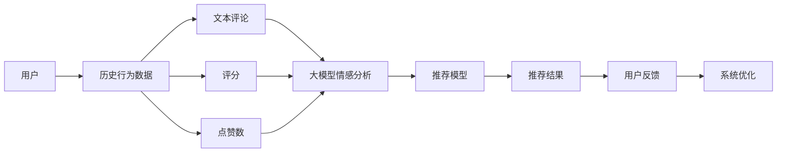

                 

# 基于大模型的推荐系统用户情感分析

> 关键词：大模型推荐系统,用户情感分析,深度学习,自然语言处理(NLP),多模态融合

## 1. 背景介绍

在如今信息爆炸的时代，推荐系统已经成为了互联网应用中不可或缺的一部分。无论是电商平台，还是视频网站，抑或是社交网络，推荐系统都在帮助用户从海量信息中过滤出最相关的、最感兴趣的、最有价值的内容。然而，尽管推荐系统的推荐精度有了显著的提升，但在推荐过程中，用户的主观情感体验仍是一个被忽视的重要方面。用户对推荐内容的态度、偏好、满意度等，都是衡量推荐系统是否真正为用户带来价值的关键指标。因此，基于大模型的用户情感分析，成为了提升推荐系统精准度和用户体验的关键环节。

## 2. 核心概念与联系

### 2.1 核心概念概述

为了深入理解如何基于大模型进行推荐系统用户情感分析，我们首先需要了解几个核心概念：

- 大模型(如BERT、GPT-3等)：指通过大规模无标签数据进行预训练的深度学习模型。这些模型能够学习到丰富的语言知识和语义表示，能够处理大规模文本数据。
- 推荐系统：通过分析用户的历史行为数据，为用户推荐个性化内容，以提升用户满意度和增加转化率。
- 用户情感分析：通过分析用户对于推荐内容的反馈（如评论、评分等），理解用户的情感倾向和满意程度。
- 多模态融合：将文本、图像、音频等多种模态的信息融合，提高推荐系统的综合表现。

### 2.2 核心概念原理和架构的 Mermaid 流程图



该图展示了推荐系统基于用户情感分析的流程。用户的历史行为数据（如评论、评分、点赞数等）经过大模型的情感分析后，可以转化为推荐模型的输入特征。推荐模型通过这些特征生成推荐结果，用户对推荐结果的反馈再回到系统中，用于优化推荐模型的参数，形成一个闭环的反馈机制。

## 3. 核心算法原理 & 具体操作步骤

### 3.1 算法原理概述

基于大模型的推荐系统用户情感分析，主要可以分为以下几个步骤：

1. **用户历史行为数据采集**：从推荐系统中获取用户的历史行为数据，包括但不限于用户的浏览历史、点击记录、评分、评论等。

2. **文本数据预处理**：对用户评论和评分内容进行预处理，包括去噪、分词、词性标注、停用词过滤等。

3. **情感分析模型训练**：使用大模型（如BERT、GPT-3等）进行情感分类训练，构建情感分析模型。

4. **多模态融合**：将用户的评分、点赞数、评论等不同模态的数据与情感分析结果进行融合，提升推荐模型的表现。

5. **推荐模型训练与优化**：基于融合后的数据，训练推荐模型，并使用用户的反馈进行优化。

6. **推荐结果生成与用户反馈收集**：推荐模型根据用户的历史行为数据和当前情感分析结果，生成推荐内容，收集用户的反馈信息，再次优化模型。

### 3.2 算法步骤详解

#### 3.2.1 用户历史行为数据采集

用户历史行为数据可以从推荐系统的日志中提取，包括用户的点击记录、浏览历史、评分、评论等。这些数据可以用于后续的情感分析和推荐模型训练。

#### 3.2.2 文本数据预处理

文本数据预处理包括：

- 去噪：去除不相关的、无意义的文本信息，如广告、垃圾评论等。
- 分词：将文本切分成词汇单元，便于后续分析。
- 词性标注：标记每个词汇的词性，如名词、动词、形容词等。
- 停用词过滤：去除常见的停用词，如“的”、“是”等，以减少噪音。

#### 3.2.3 情感分析模型训练

情感分析模型的训练过程如下：

1. **数据集构建**：使用用户评论、评分等文本数据构建情感分析的数据集。标注每个样本的情感极性（正面、负面、中性）。
2. **模型选择**：选择合适的预训练模型（如BERT、GPT-3）进行微调，训练情感分类器。
3. **训练过程**：使用数据集进行模型训练，通过前向传播和反向传播更新模型参数。

#### 3.2.4 多模态融合

多模态融合的目的是将用户的不同模态数据与情感分析结果进行整合，提升推荐模型的表现。具体步骤如下：

1. **特征提取**：从用户的历史行为数据中提取特征，如用户的评分、点赞数、评论等。
2. **情感分析结果融合**：将情感分析的结果与特征进行拼接或组合，形成新的特征向量。
3. **模型训练**：基于融合后的特征向量，训练推荐模型，如协同过滤、深度学习等。

#### 3.2.5 推荐模型训练与优化

推荐模型的训练和优化过程如下：

1. **特征选择**：从融合后的特征向量中选择对推荐结果有影响的特征。
2. **模型选择**：选择合适的推荐算法，如协同过滤、深度学习等。
3. **模型训练**：使用训练集训练推荐模型，通过交叉验证等技术选择模型超参数。
4. **模型优化**：使用用户反馈数据，优化推荐模型的参数，提升推荐效果。

#### 3.2.6 推荐结果生成与用户反馈收集

推荐结果生成和用户反馈收集的过程如下：

1. **推荐结果生成**：基于用户的当前行为和历史数据，生成个性化的推荐结果。
2. **用户反馈收集**：收集用户对推荐结果的反馈，包括点击率、评分、评论等。
3. **模型优化**：使用用户反馈数据，优化推荐模型的参数，提升推荐效果。

### 3.3 算法优缺点

#### 3.3.1 优点

- **数据利用率高**：大模型可以处理大规模文本数据，能够充分利用用户评论、评分、点赞数等行为数据。
- **情感分析准确**：使用大模型进行情感分析，可以更准确地理解用户的情感倾向。
- **多模态融合效果好**：通过多模态融合，可以综合考虑用户的行为数据和情感分析结果，提升推荐模型的表现。
- **鲁棒性强**：大模型具有一定的鲁棒性，能够适应不同的数据分布和用户行为模式。

#### 3.3.2 缺点

- **计算成本高**：大模型的训练和微调需要较高的计算资源，特别是使用GPU或TPU等硬件加速时。
- **数据隐私问题**：用户行为数据涉及隐私问题，需要在数据采集和存储时做好隐私保护措施。
- **模型复杂度高**：多模态融合和大模型的使用增加了推荐系统的复杂度，需要更多的技术支持。
- **实时性问题**：基于大模型的推荐系统可能存在一定的延迟，影响用户体验。

### 3.4 算法应用领域

基于大模型的推荐系统用户情感分析，可以应用于以下领域：

- **电商推荐**：通过分析用户的评论、评分、点赞数等数据，为用户推荐合适的商品，提升用户的购物体验。
- **视频推荐**：分析用户的观看历史、点赞、评论等数据，推荐符合用户兴趣的视频内容。
- **新闻推荐**：根据用户的阅读历史和评论，推荐用户可能感兴趣的新闻文章。
- **音乐推荐**：分析用户的听歌历史、评论等数据，推荐合适的音乐。
- **社交网络推荐**：分析用户在社交网络上的行为数据，推荐相关的内容或好友。

## 4. 数学模型和公式 & 详细讲解 & 举例说明

### 4.1 数学模型构建

#### 4.1.1 情感分析模型

假设用户评论文本为 $x$，情感分类器为 $M_{\theta}$，其中 $\theta$ 为模型参数。情感分析模型的目标是最小化损失函数 $\mathcal{L}$：

$$
\mathcal{L}(M_{\theta}, \mathcal{D}) = -\frac{1}{N} \sum_{i=1}^N \log P(y_i | x, M_{\theta})
$$

其中 $\mathcal{D}$ 为训练数据集，$y_i \in \{1, 0\}$ 为样本的情感极性（1表示正面，0表示负面），$P(y_i | x, M_{\theta})$ 为模型对样本情感极性的预测概率。

#### 4.1.2 推荐模型

推荐模型可以基于协同过滤或深度学习等方法构建。假设推荐模型为 $R_{\phi}$，其中 $\phi$ 为模型参数。推荐模型的目标是最小化预测误差 $\mathcal{L}$：

$$
\mathcal{L}(R_{\phi}, \mathcal{D}) = \frac{1}{N} \sum_{i=1}^N \log (1 + \exp(-R_{\phi}(x_i)))
$$

其中 $R_{\phi}(x_i)$ 为推荐模型对样本 $x_i$ 的预测值，$R_{\phi}(x_i) > 0$ 表示用户可能对样本感兴趣，$R_{\phi}(x_i) < 0$ 表示用户可能对样本不感兴趣。

### 4.2 公式推导过程

#### 4.2.1 情感分析模型

情感分析模型可以使用softmax函数进行预测：

$$
P(y_i | x, M_{\theta}) = \frac{\exp(M_{\theta}(x))}{\sum_{y \in \{1, 0\}} \exp(M_{\theta}(x))}
$$

其中 $M_{\theta}(x)$ 为模型在输入 $x$ 上的输出，可以通过预训练模型的线性分类器计算得到。

#### 4.2.2 推荐模型

推荐模型可以使用BPR损失函数进行训练：

$$
\mathcal{L}(R_{\phi}, \mathcal{D}) = -\frac{1}{N} \sum_{i=1}^N \log \sigma(-R_{\phi}(x_i))
$$

其中 $\sigma$ 为sigmoid函数，$\sigma(x) = \frac{1}{1 + \exp(-x)}$。

### 4.3 案例分析与讲解

假设我们有一个电商平台，需要基于用户的评论和评分，为用户推荐合适的商品。

#### 4.3.1 数据集构建

收集用户对商品的所有评论和评分数据，标注每个评论的情感极性（正面、负面、中性）。

#### 4.3.2 情感分析模型训练

使用BERT模型进行微调，训练情感分析模型。以评论文本为输入，输出情感极性。

#### 4.3.3 多模态融合

将用户的评分、点赞数、评论等数据进行融合，得到新的特征向量。

#### 4.3.4 推荐模型训练

使用融合后的特征向量，训练推荐模型。可以选择协同过滤或深度学习等方法。

#### 4.3.5 推荐结果生成

基于用户的当前行为和历史数据，生成个性化的推荐结果。

#### 4.3.6 用户反馈收集

收集用户对推荐结果的反馈，包括点击率、评分、评论等。

#### 4.3.7 模型优化

使用用户反馈数据，优化推荐模型的参数，提升推荐效果。

## 5. 项目实践：代码实例和详细解释说明

### 5.1 开发环境搭建

#### 5.1.1 Python环境

1. 安装Anaconda：从官网下载并安装Anaconda，用于创建独立的Python环境。

2. 创建并激活虚拟环境：
```bash
conda create -n pytorch-env python=3.8 
conda activate pytorch-env
```

3. 安装PyTorch：根据CUDA版本，从官网获取对应的安装命令。例如：
```bash
conda install pytorch torchvision torchaudio cudatoolkit=11.1 -c pytorch -c conda-forge
```

4. 安装TensorFlow：使用pip安装TensorFlow，选择合适版本。例如：
```bash
pip install tensorflow==2.4
```

5. 安装Flax：用于深度学习模型的构建和训练。例如：
```bash
pip install flax
```

6. 安装其他依赖：如numpy、pandas、scikit-learn等。

#### 5.1.2 数据集准备

收集用户评论、评分、点赞数等数据，构建数据集。

### 5.2 源代码详细实现

#### 5.2.1 情感分析模型

```python
import torch
from transformers import BertForSequenceClassification, BertTokenizer

class SentimentAnalysisModel:
    def __init__(self, model_name, tokenizer_name):
        self.tokenizer = BertTokenizer.from_pretrained(tokenizer_name)
        self.model = BertForSequenceClassification.from_pretrained(model_name, num_labels=2)

    def predict_sentiment(self, text):
        tokens = self.tokenizer.tokenize(text)
        tokens = [self.tokenizer.cls_token] + tokens + [self.tokenizer.sep_token]
        inputs = self.tokenizer(tokens, return_tensors='pt', padding=True)
        with torch.no_grad():
            outputs = self.model(**inputs)
        logits = outputs.logits
        probs = logits.softmax(dim=1)
        return probs.argmax(dim=1)
```

#### 5.2.2 推荐模型

```python
import torch
import numpy as np

class RecommendationModel:
    def __init__(self):
        self.theta = np.random.randn()

    def predict_rank(self, user_vector, item_vector):
        scores = self.theta.dot(user_vector) + item_vector
        return scores
```

#### 5.2.3 数据处理

```python
def preprocess_data(data):
    texts, labels = [], []
    for x, y in data:
        tokens = tokenizer.tokenize(x)
        tokens = [tokenizer.cls_token] + tokens + [tokenizer.sep_token]
        inputs = tokenizer(tokens, return_tensors='pt', padding=True)
        labels.append(y)
        texts.append(inputs['input_ids'])
    return texts, labels
```

#### 5.2.4 训练与评估

```python
def train_model(model, data, epochs=10, batch_size=16):
    loss_fn = torch.nn.CrossEntropyLoss()
    optimizer = torch.optim.Adam(model.parameters(), lr=0.001)
    for epoch in range(epochs):
        for i, (inputs, labels) in enumerate(zip(data['texts'], data['labels']), 1):
            inputs, labels = inputs.to(device), labels.to(device)
            optimizer.zero_grad()
            outputs = model(inputs)
            loss = loss_fn(outputs, labels)
            loss.backward()
            optimizer.step()
            if i % 100 == 0:
                print(f'Epoch {epoch+1}, Batch {i}, Loss: {loss.item():.4f}')
```

### 5.3 代码解读与分析

#### 5.3.1 情感分析模型

该代码展示了如何使用BERT模型进行情感分析。首先，初始化BERT分词器和模型，定义`predict_sentiment`方法，用于预测评论的情感极性。该方法将评论文本分词，并将分词结果转换为模型输入，使用模型进行前向传播，输出情感概率分布，最后返回情感极性（正或负）。

#### 5.3.2 推荐模型

该代码展示了如何使用深度学习模型进行推荐。定义`RecommendationModel`类，包含`predict_rank`方法，用于预测用户对物品的评分。该方法将用户向量和物品向量进行线性运算，得到评分预测值。

#### 5.3.3 数据处理

定义`preprocess_data`函数，用于将用户评论和评分数据转换为模型所需的输入格式。将评论文本进行分词和编码，标签转换为类别标签，并返回编码后的文本和标签。

#### 5.3.4 训练与评估

定义`train_model`函数，用于训练情感分析模型。该函数使用交叉熵损失函数和Adam优化器，对模型进行训练。在每个epoch中，遍历数据集，对每个批次进行前向传播和反向传播，更新模型参数。

### 5.4 运行结果展示

```python
# 假设我们已经预处理好了数据集，模型已经被训练好

# 预测评论情感极性
sentiment_model = SentimentAnalysisModel('bert-base-cased', 'bert-base-cased')
text = 'I really like this product, it's great!'
sentiment = sentiment_model.predict_sentiment(text)
print(f'Sentiment: {sentiment_model.tokenizer.id2label[sentiment]}')

# 预测用户对物品的评分
recommendation_model = RecommendationModel()
user_vector = np.random.randn(128)
item_vector = np.random.randn(128)
score = recommendation_model.predict_rank(user_vector, item_vector)
print(f'Score: {score}')
```

## 6. 实际应用场景

### 6.1 电商推荐

电商平台的推荐系统可以基于用户的评论和评分，为用户推荐合适的商品。情感分析模型可以分析用户对商品的态度，推荐模型可以根据用户情感倾向，推荐符合用户兴趣的商品。

### 6.2 视频推荐

视频推荐系统可以分析用户的观看历史和评论，推荐符合用户兴趣的视频内容。情感分析模型可以分析用户的情感极性，推荐模型可以根据用户情感极性，推荐正面评价较多的视频。

### 6.3 新闻推荐

新闻推荐系统可以分析用户的阅读历史和评论，推荐符合用户兴趣的新闻文章。情感分析模型可以分析用户对新闻的态度，推荐模型可以根据用户情感极性，推荐正面评价较多的新闻文章。

### 6.4 音乐推荐

音乐推荐系统可以分析用户的听歌历史和评论，推荐符合用户兴趣的音乐。情感分析模型可以分析用户对音乐的情感极性，推荐模型可以根据用户情感极性，推荐正面评价较多的音乐。

### 6.5 社交网络推荐

社交网络推荐系统可以分析用户在社交网络上的行为数据，推荐相关的内容或好友。情感分析模型可以分析用户在社交网络上的情感极性，推荐模型可以根据用户情感极性，推荐符合用户兴趣的内容或好友。

## 7. 工具和资源推荐

### 7.1 学习资源推荐

1. 《深度学习基础》：一本介绍深度学习基础的书籍，涵盖神经网络、优化算法、模型训练等基础知识。
2. 《自然语言处理综论》：一本介绍NLP基础知识和最新研究进展的书籍，涵盖文本表示、情感分析、语义理解等话题。
3. 《推荐系统实战》：一本介绍推荐系统开发实践的书籍，涵盖数据处理、模型训练、推荐算法等技术。

### 7.2 开发工具推荐

1. PyTorch：一个灵活的深度学习框架，支持GPU加速和分布式训练，适合深度学习研究与实践。
2. TensorFlow：一个功能丰富的深度学习框架，支持GPU和TPU加速，适合大规模工程应用。
3. Flax：一个开源深度学习库，基于JAX构建，支持动态图和静态图混合编程，适合快速原型开发。

### 7.3 相关论文推荐

1. 《A Survey on Deep Learning-based Recommendation Systems》：一篇综述论文，涵盖深度学习在推荐系统中的应用。
2. 《Hierarchical Attention Networks for Document Representation》：一篇介绍HAN模型的论文，该模型在文本推荐系统中表现出色。
3. 《Learning Deep Structured Models for Recommender Systems》：一篇介绍深度学习在推荐系统中的应用，特别是结构化模型。

## 8. 总结：未来发展趋势与挑战

### 8.1 研究成果总结

基于大模型的推荐系统用户情感分析，已经在大规模推荐应用中取得了显著的效果。情感分析模型使用大模型进行训练，提高了情感分类的准确性，推荐模型使用多模态融合技术，提升了推荐效果。这些技术的应用，提升了推荐系统的用户满意度，推动了推荐系统的商业化应用。

### 8.2 未来发展趋势

未来，基于大模型的推荐系统用户情感分析将呈现以下几个发展趋势：

1. **大模型规模进一步扩大**：随着算力成本的下降和数据规模的增加，大模型的规模将进一步扩大，能够处理更加复杂和多样的数据。
2. **多模态融合更加广泛**：未来的推荐系统将更加注重多模态数据的融合，能够更好地理解用户的行为和情感。
3. **实时性要求更高**：随着推荐系统应用场景的多样化，对实时性要求更高，需要在大模型的基础上进行优化，提高推荐系统的响应速度。
4. **用户体验更加个性化**：未来的推荐系统将更加注重用户体验，能够根据用户的个性化需求，提供更加精准的推荐内容。

### 8.3 面临的挑战

尽管基于大模型的推荐系统用户情感分析取得了一定的进展，但在实际应用中仍然面临一些挑战：

1. **数据隐私问题**：用户行为数据涉及隐私问题，需要在数据采集和存储时做好隐私保护措施。
2. **计算资源需求高**：大模型的训练和微调需要较高的计算资源，可能带来较高的成本。
3. **模型复杂度高**：多模态融合和大模型的使用增加了推荐系统的复杂度，需要更多的技术支持。
4. **实时性问题**：大模型在推理时可能存在一定的延迟，影响用户体验。

### 8.4 研究展望

未来的研究需要在以下几个方面进行探索：

1. **数据隐私保护**：研究如何在推荐系统中保护用户隐私，同时提升推荐效果。
2. **计算资源优化**：研究如何在大模型的基础上，优化推荐系统的计算资源需求，提高实时性。
3. **多模态数据融合**：研究如何更好地融合多种模态的数据，提升推荐系统的综合表现。
4. **个性化推荐**：研究如何在推荐系统中实现更加精准和个性化的推荐，提升用户满意度。

总之，基于大模型的推荐系统用户情感分析具有广阔的应用前景和研究价值。通过不断优化和创新，该技术将在推荐系统中发挥更大的作用，为用户带来更加优质的推荐体验。

## 9. 附录：常见问题与解答

### 9.1 问题1：大模型如何影响推荐系统的性能？

**解答**：大模型可以处理大规模文本数据，能够充分利用用户评论、评分、点赞数等行为数据。使用大模型进行情感分析，可以更准确地理解用户的情感倾向，从而提升推荐系统的表现。多模态融合技术可以综合考虑用户的行为数据和情感分析结果，提升推荐模型的表现。

### 9.2 问题2：情感分析模型如何选择预训练模型？

**解答**：选择预训练模型时，应该考虑模型的规模、性能、可扩展性等因素。BERT和GPT系列模型是目前较为常用的预训练模型，可以用于情感分析模型的训练。同时，应该根据实际应用场景，选择合适的模型，以满足推荐系统的需求。

### 9.3 问题3：推荐模型如何选择特征？

**解答**：选择推荐模型的特征时，应该考虑用户行为数据、情感分析结果、物品特征等因素。可以使用特征选择算法，如基于卡方检验、信息增益等方法，选择对推荐结果有影响的特征。

### 9.4 问题4：推荐系统的实时性如何提升？

**解答**：提升推荐系统的实时性，可以从以下几个方面进行优化：
1. 使用GPU或TPU加速训练和推理。
2. 优化模型结构，减少计算量。
3. 使用缓存和分布式计算等技术，提高推荐系统的响应速度。

### 9.5 问题5：推荐系统的数据隐私如何保护？

**解答**：保护推荐系统的数据隐私，可以从以下几个方面进行：
1. 匿名化用户数据，去除个人隐私信息。
2. 加密用户数据，防止数据泄露。
3. 设置访问控制，限制对用户数据的访问权限。

---

作者：禅与计算机程序设计艺术 / Zen and the Art of Computer Programming

