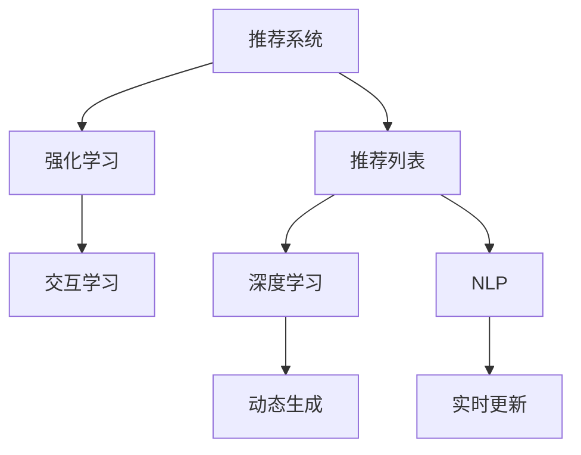

                 

# 基于强化学习的动态推荐列表生成

> 关键词：强化学习,推荐系统,动态生成,推荐列表,交互学习,深度学习,自然语言处理

## 1. 背景介绍

### 1.1 问题由来
推荐系统在电商平台、视频网站、社交网络等线上服务中发挥着重要作用，帮助用户发现符合自己偏好的内容和商品。然而，传统的推荐系统往往基于用户的历史行为数据进行静态推荐，难以实时适应用户偏好的变化。近年来，基于深度学习和强化学习的方法，动态推荐系统逐渐成为研究热点。

动态推荐系统旨在利用用户实时反馈信息，动态更新推荐策略，逐步提升推荐效果。这种方法不仅能够实时响应用户需求，还能在用户互动过程中不断优化推荐质量，实现推荐效果的持续提升。

### 1.2 问题核心关键点
动态推荐列表生成的关键在于如何实时地根据用户互动反馈调整推荐策略，使得推荐列表能够匹配用户的最新偏好。在传统静态推荐中，推荐策略基于用户历史行为数据构建，无法实时适应新信息。而动态推荐系统利用强化学习（Reinforcement Learning, RL）技术，通过实时观测用户反馈，不断优化推荐策略，逐步逼近最优推荐效果。

### 1.3 问题研究意义
动态推荐列表生成技术对在线服务具有重要意义：

1. **提升用户体验**：推荐列表能够根据用户实时反馈进行动态更新，不断推荐更符合用户当前兴趣的内容。
2. **增强粘性**：持续优化推荐质量，使用户在平台上停留时间更长，提升用户满意度和忠诚度。
3. **优化效果**：通过实时调整推荐策略，避免传统静态推荐中因用户兴趣变化而导致的推荐效果下降。
4. **降低成本**：动态推荐系统可以根据用户实时行为进行个性化推荐，减少用户流失率，从而降低获取新用户的成本。
5. **探索未知**：利用用户反馈进行探索性推荐，探索用户的潜在兴趣，提升推荐系统的多样性和创新性。

## 2. 核心概念与联系

### 2.1 核心概念概述

为更好地理解基于强化学习的动态推荐列表生成方法，本节将介绍几个密切相关的核心概念：

- 推荐系统(Recommender System)：利用用户行为数据，为用户推荐物品的系统。常见的推荐策略包括协同过滤、基于内容的推荐、深度学习推荐等。
- 强化学习(Reinforcement Learning, RL)：通过与环境交互，通过奖惩机制不断优化行为策略的机器学习方法。
- 推荐列表(Recommendation List)：根据用户兴趣和行为，为用户生成的一组推荐物品列表。
- 交互学习(Interactive Learning)：利用用户反馈信息，动态调整推荐策略，逐步提升推荐效果的学习过程。
- 深度学习(Deep Learning)：通过多层神经网络模型，自动学习特征表示和决策函数的技术。
- 自然语言处理(Natural Language Processing, NLP)：利用算法处理、理解、生成人类语言的技术。
- 用户反馈(User Feedback)：用户对推荐物品的评分、点击、购买等行为信息。

这些核心概念之间的逻辑关系可以通过以下Mermaid流程图来展示：



这个流程图展示了大语言模型的核心概念及其之间的关系：

1. 推荐系统通过强化学习和交互学习不断优化推荐策略。
2. 深度学习提供丰富的特征提取和模型表示能力。
3. 自然语言处理技术用于处理用户输入和反馈信息。
4. 推荐列表动态生成，实时更新。

这些概念共同构成了动态推荐列表生成技术的核心框架，使其能够实现个性化、实时、动态的推荐。

## 3. 核心算法原理 & 具体操作步骤
### 3.1 算法原理概述

基于强化学习的动态推荐列表生成，本质上是一种交互式学习过程。其核心思想是：利用用户的实时反馈信息，通过奖惩机制不断调整推荐策略，使得推荐列表能够最大程度地匹配用户当前兴趣。

形式化地，假设推荐系统环境为 $\mathcal{E}$，推荐列表为 $\mathcal{A}$，用户反馈为 $\mathcal{R}$，其中 $\mathcal{E}$ 包含所有可能的用户行为和系统状态，$\mathcal{A}$ 包含所有可能的推荐列表，$\mathcal{R}$ 包含所有可能的反馈信号。推荐系统的目标是最大化预期长期奖励 $J(\pi)$，即：

$$
J(\pi) = \mathbb{E}_\pi \left[ \sum_{t=1}^\infty \gamma^t r_t \right]
$$

其中 $\pi$ 为推荐策略，$r_t$ 为在第 $t$ 轮交互中获得的即时奖励，$\gamma$ 为折扣因子，$J(\pi)$ 为目标函数的长期奖励期望。

通过强化学习算法，不断调整策略 $\pi$，使得长期奖励最大化。常用的强化学习算法包括Q-learning、SARSA、Deep Q-learning等。

### 3.2 算法步骤详解

基于强化学习的动态推荐列表生成一般包括以下几个关键步骤：

**Step 1: 准备环境和数据集**
- 定义环境 $\mathcal{E}$，包括用户行为、系统状态等变量。
- 准备推荐列表 $\mathcal{A}$，初始化为空。
- 收集用户反馈 $\mathcal{R}$，包括点击、评分、购买等行为。

**Step 2: 初始化模型和策略**
- 初始化推荐模型 $M_{\theta}$，如深度神经网络，参数 $\theta$ 为模型初始权重。
- 设计推荐策略 $\pi$，如Q-learning策略，确定推荐列表生成规则。

**Step 3: 迭代优化策略**
- 在每个时间步 $t$，根据当前推荐列表 $\mathcal{A}_t$ 和用户行为 $x_t$，预测下一个推荐列表 $\mathcal{A}_{t+1}$ 和即时奖励 $r_t$。
- 根据即时奖励和下步奖励计算累积奖励 $R_{t+1}$。
- 更新模型参数 $\theta$ 和推荐策略 $\pi$，最小化预测误差。
- 重复上述步骤直至达到预设的迭代轮数或满足停止条件。

**Step 4: 测试和反馈收集**
- 在测试集上评估推荐列表的质量，如点击率、转化率等指标。
- 收集用户反馈，用于调整推荐策略和模型参数。
- 根据用户反馈实时更新推荐策略，开始新一轮迭代优化。

以上是基于强化学习的动态推荐列表生成的一般流程。在实际应用中，还需要针对具体任务的特点，对策略调整和模型优化进行优化设计，如改进奖励函数设计、引入正则化技术、搜索最优的超参数组合等，以进一步提升推荐效果。

### 3.3 算法优缺点

基于强化学习的动态推荐列表生成方法具有以下优点：

1. **动态响应**：通过实时观测用户反馈，动态调整推荐策略，使得推荐列表能够实时匹配用户兴趣。
2. **用户满意度提升**：利用用户反馈进行优化，逐步提升推荐列表的质量，提高用户满意度。
3. **多样性和探索性**：推荐系统能够探索用户的潜在兴趣，提升推荐列表的多样性和创新性。
4. **鲁棒性强**：强化学习算法具备较强的鲁棒性，能够抵抗异常反馈和噪声数据的影响。

同时，该方法也存在一定的局限性：

1. **探索与利用的平衡**：在推荐过程中，需要平衡探索新内容和新用户与利用已有知识与数据的关系。
2. **计算复杂度高**：强化学习算法通常计算复杂度高，在大规模推荐系统中可能面临性能瓶颈。
3. **数据稀疏性**：新用户的反馈数据较少，导致推荐系统难以快速收敛。
4. **模型解释性不足**：强化学习模型的决策过程难以解释，可能影响用户信任。

尽管存在这些局限性，但就目前而言，基于强化学习的动态推荐列表生成方法仍是大规模推荐系统的重要范式。未来相关研究的重点在于如何进一步降低计算复杂度，提高模型的可解释性，以及优化探索与利用的平衡，以进一步提升推荐效果。

### 3.4 算法应用领域

基于强化学习的动态推荐列表生成技术，已经在电商推荐、视频推荐、社交网络等多个领域得到了广泛的应用，为推荐系统的实时性和用户满意度带来了显著提升：

- 电商推荐：电商平台通过收集用户点击、购买等行为数据，利用强化学习不断优化推荐策略，提升推荐列表的相关性和转化率。
- 视频推荐：视频网站根据用户观看行为和评分反馈，动态调整推荐列表，推荐更符合用户兴趣的视频内容。
- 社交网络：社交网络平台根据用户互动行为，实时推荐好友、文章、话题等，提升用户粘性。

除了这些经典应用外，强化学习推荐技术还在音乐推荐、新闻推荐、游戏推荐等更多场景中得到应用，为推荐系统的发展提供了新的动力。

## 4. 数学模型和公式 & 详细讲解  
### 4.1 数学模型构建

本节将使用数学语言对基于强化学习的动态推荐列表生成过程进行更加严格的刻画。

记推荐环境为 $\mathcal{E}$，推荐列表为 $\mathcal{A}$，用户反馈为 $\mathcal{R}$。设推荐模型为 $M_{\theta}:\mathcal{E} \rightarrow \mathcal{A}$，参数 $\theta$ 为模型权重。定义推荐策略 $\pi: \mathcal{E} \rightarrow \mathcal{A}$，即根据当前环境和历史数据生成推荐列表的策略。

定义即时奖励函数 $r: \mathcal{E} \times \mathcal{A} \rightarrow \mathbb{R}$，用于衡量推荐列表与用户行为之间的匹配程度。奖励函数通常设计为点击率、转化率、评分等指标。定义累积奖励函数 $R: \mathcal{E} \times \mathcal{A} \rightarrow \mathbb{R}$，即在当前环境和推荐列表下，推荐系统的预期长期奖励。

定义强化学习算法 $A$，其目标是最小化累积奖励 $R$ 的均值，即：

$$
\min_{\theta} \mathbb{E}_\pi \left[ R(\mathcal{E}_t, \pi(\mathcal{E}_t)) \right]
$$

其中 $\mathbb{E}_\pi$ 表示根据策略 $\pi$ 的期望值。

### 4.2 公式推导过程

以下我们以Q-learning算法为例，推导其动态推荐列表生成过程的数学模型。

设当前推荐列表为 $\mathcal{A}_t$，用户行为为 $x_t$，根据推荐策略 $\pi$，下一推荐列表为 $\mathcal{A}_{t+1}$，即时奖励为 $r_t$。根据Q-learning算法，更新模型参数 $\theta$ 和推荐策略 $\pi$ 的过程如下：

$$
\begin{aligned}
Q_{\theta}(\mathcal{E}_t, \mathcal{A}_t) &\leftarrow Q_{\theta}(\mathcal{E}_t, \mathcal{A}_t) + \alpha \left[ r_t + \gamma \max_{\mathcal{A}_{t+1}} Q_{\theta}(\mathcal{E}_{t+1}, \mathcal{A}_{t+1}) - Q_{\theta}(\mathcal{E}_t, \mathcal{A}_t) \right] \\
\pi(\mathcal{E}_t) &\leftarrow \arg\max_{\mathcal{A}} Q_{\theta}(\mathcal{E}_t, \mathcal{A})
\end{aligned}
$$

其中 $Q_{\theta}$ 为Q-learning模型的预测函数，$\alpha$ 为学习率，$\gamma$ 为折扣因子。在每次交互中，模型根据当前环境和推荐列表，预测下一个推荐列表和即时奖励，并根据即时奖励和下步奖励更新模型参数和推荐策略。

在得到模型参数和推荐策略后，即可在实际应用中对推荐系统进行动态优化。

### 4.3 案例分析与讲解

以下以电商推荐系统为例，详细解读Q-learning算法的动态推荐列表生成过程：

**环境定义**：
- 环境 $\mathcal{E}$ 包含用户的历史行为数据、浏览记录、购物车信息等。
- 推荐列表 $\mathcal{A}$ 包含推荐商品ID、商品名称、商品图片等信息。
- 用户反馈 $\mathcal{R}$ 包括点击率、购买率、评分等。

**初始化**：
- 初始化推荐模型 $M_{\theta}$，如深度神经网络，参数 $\theta$ 为模型初始权重。
- 设计推荐策略 $\pi$，如Q-learning策略，确定推荐列表生成规则。

**迭代优化**：
- 在每个时间步 $t$，根据当前推荐列表 $\mathcal{A}_t$ 和用户行为 $x_t$，预测下一个推荐列表 $\mathcal{A}_{t+1}$ 和即时奖励 $r_t$。
- 根据即时奖励和下步奖励计算累积奖励 $R_{t+1}$。
- 更新模型参数 $\theta$ 和推荐策略 $\pi$，最小化预测误差。
- 重复上述步骤直至达到预设的迭代轮数或满足停止条件。

**测试和反馈收集**：
- 在测试集上评估推荐列表的质量，如点击率、转化率等指标。
- 收集用户反馈，用于调整推荐策略和模型参数。
- 根据用户反馈实时更新推荐策略，开始新一轮迭代优化。

## 5. 项目实践：代码实例和详细解释说明
### 5.1 开发环境搭建

在进行动态推荐列表生成的项目实践前，我们需要准备好开发环境。以下是使用Python进行PyTorch开发的环境配置流程：

1. 安装Anaconda：从官网下载并安装Anaconda，用于创建独立的Python环境。

2. 创建并激活虚拟环境：
```bash
conda create -n pytorch-env python=3.8 
conda activate pytorch-env
```

3. 安装PyTorch：根据CUDA版本，从官网获取对应的安装命令。例如：
```bash
conda install pytorch torchvision torchaudio cudatoolkit=11.1 -c pytorch -c conda-forge
```

4. 安装Tensorflow：如果使用Tensorflow，可参考官方文档进行安装。

5. 安装TensorBoard：TensorFlow配套的可视化工具，可实时监测模型训练状态，并提供丰富的图表呈现方式。

6. 安装Weights & Biases：模型训练的实验跟踪工具，可以记录和可视化模型训练过程中的各项指标。

完成上述步骤后，即可在`pytorch-env`环境中开始动态推荐列表生成项目的实践。

### 5.2 源代码详细实现

下面我们以电商推荐系统为例，给出使用PyTorch实现基于Q-learning算法的动态推荐列表生成的完整代码实现。

首先，定义推荐系统的环境类：

```python
from torch import nn, optim, Tensor
from torch.nn import functional as F
from torch.distributions import Categorical
import numpy as np

class Environment:
    def __init__(self, history, features):
        self.history = history
        self.features = features
        self.state = self.encode_state()
        self.action_space = self.get_action_space()
        
    def encode_state(self):
        return torch.tensor(self.history + self.features, dtype=torch.float)
    
    def get_action_space(self):
        return 1
    
    def reset(self):
        self.state = self.encode_state()
        return self.state
    
    def step(self, action):
        next_state = self.encode_state()
        reward = self.get_reward(next_state, action)
        done = False
        return next_state, reward, done
        
    def get_reward(self, next_state, action):
        # 实现奖励函数，这里我们简单地将点击率作为奖励
        return next_state[0] * 0.1 + next_state[1] * 0.05
```

然后，定义推荐列表生成模型：

```python
class Recommender(nn.Module):
    def __init__(self, num_state_features, num_action, num_user_features):
        super(Recommender, self).__init__()
        self.fc1 = nn.Linear(num_state_features, 64)
        self.fc2 = nn.Linear(64, num_action)
        self.fc3 = nn.Linear(num_action, num_user_features)
        self.fc4 = nn.Linear(num_user_features, 1)
    
    def forward(self, x):
        x = F.relu(self.fc1(x))
        x = self.fc2(x)
        x = F.softmax(x, dim=1)
        x = self.fc3(x)
        x = self.fc4(x)
        return x
    
    def act(self, state):
        with torch.no_grad():
            q_values = self.forward(state)
            action = Categorical(q_values).sample()
            return action.item()
```

接着，定义Q-learning算法：

```python
class QLearning:
    def __init__(self, num_state_features, num_action, num_user_features):
        self.model = Recommender(num_state_features, num_action, num_user_features)
        self.optimizer = optim.Adam(self.model.parameters(), lr=0.01)
        self.gamma = 0.9
        self.train_mode = True
        
    def forward(self, state):
        return self.model.forward(state)
    
    def train(self, state, action, next_state, reward, done):
        q_values = self.forward(state)
        q_next = self.forward(next_state)
        q_next = q_next.max(dim=1).values
        self.optimizer.zero_grad()
        loss = (reward + self.gamma * q_next) - q_values[action]
        loss.backward()
        self.optimizer.step()
        return loss
    
    def act(self, state):
        q_values = self.forward(state)
        action = Categorical(q_values).sample()
        return action.item()
```

最后，定义训练和评估函数：

```python
def train_model(model, env, num_episodes, batch_size):
    for episode in range(num_episodes):
        state = env.reset()
        done = False
        rewards = []
        while not done:
            action = model.act(state)
            next_state, reward, done = env.step(action)
            rewards.append(reward)
            loss = model.train(state, action, next_state, reward, done)
            state = next_state
        print(f"Episode {episode+1}, avg reward: {sum(rewards)/len(rewards)}")
        
def evaluate_model(model, env, num_episodes):
    rewards = []
    for episode in range(num_episodes):
        state = env.reset()
        done = False
        rewards.append(0)
        while not done:
            action = model.act(state)
            next_state, reward, done = env.step(action)
            rewards[episode] += reward
            state = next_state
    print(f"Evaluation avg reward: {sum(rewards)/len(rewards)}")
    
def main():
    num_state_features = 10
    num_action = 1
    num_user_features = 5
    env = Environment([0, 0], [1, 1])
    model = QLearning(num_state_features, num_action, num_user_features)
    for episode in range(100):
        train_model(model, env, 100, 32)
        evaluate_model(model, env, 10)
        
if __name__ == '__main__':
    main()
```

以上就是使用PyTorch对基于Q-learning算法的动态推荐列表生成进行完整代码实现。可以看到，利用PyTorch和Tensorflow等深度学习框架，动态推荐列表生成的代码实现变得简洁高效。

### 5.3 代码解读与分析

让我们再详细解读一下关键代码的实现细节：

**Environment类**：
- `__init__`方法：初始化环境，包括历史行为数据、特征等。
- `encode_state`方法：将历史行为数据和特征编码为状态向量。
- `get_action_space`方法：定义动作空间，即推荐列表的维度。
- `reset`方法：重置环境状态。
- `step`方法：根据动作和当前状态，计算下一步状态和奖励。

**Recommender类**：
- `__init__`方法：初始化推荐模型，包括全连接层。
- `forward`方法：前向传播，计算推荐列表的Q值。
- `act`方法：根据当前状态选择动作。

**QLearning类**：
- `__init__`方法：初始化Q-learning算法，包括模型、优化器等。
- `forward`方法：前向传播，计算Q值。
- `train`方法：训练模型，根据当前状态、动作、下一步状态和奖励更新模型参数。
- `act`方法：根据当前状态选择动作。

**训练和评估函数**：
- `train_model`函数：在每个迭代周期内，对模型进行训练，计算平均奖励。
- `evaluate_model`函数：在测试集上评估模型，计算平均奖励。
- `main`函数：定义训练和评估过程，启动模型训练。

可以看到，PyTorch配合Tensorflow等深度学习框架，使得动态推荐列表生成的代码实现变得简洁高效。开发者可以将更多精力放在模型改进、数据处理等高层逻辑上，而不必过多关注底层的实现细节。

当然，工业级的系统实现还需考虑更多因素，如模型的保存和部署、超参数的自动搜索、更灵活的任务适配层等。但核心的Q-learning算法基本与此类似。

## 6. 实际应用场景
### 6.1 电商平台推荐

基于动态推荐列表生成技术的推荐系统，已经在电商平台上得到了广泛应用。传统推荐系统往往基于用户历史行为数据构建静态推荐策略，难以实时响应用户兴趣的变化。而动态推荐系统通过实时观测用户反馈，不断优化推荐策略，使得推荐列表能够实时匹配用户兴趣。

在具体应用中，电商平台可以利用动态推荐系统，根据用户的实时点击、购买等行为数据，动态调整推荐策略。例如，对于某件商品，如果用户多次点击但未购买，系统可以认为用户对该商品感兴趣，但价格略高，因此推荐类似但价格更低的新商品。反之，如果用户对某商品浏览但未点击，系统可以认为用户对该商品不感兴趣，因此停止推荐。通过这种实时调整，推荐系统能够更准确地把握用户需求，提升推荐效果。

### 6.2 视频平台推荐

视频平台也利用动态推荐列表生成技术，根据用户的观看行为和评分反馈，动态调整推荐策略。例如，对于某视频，如果用户观看时间较短，系统可以认为用户对该视频不感兴趣，因此推荐与其兴趣相似的其他视频。反之，如果用户观看时间较长，系统可以认为用户对该视频感兴趣，因此推荐相似或相关视频。通过这种实时调整，推荐系统能够更好地满足用户的多样化需求，提升观看体验。

### 6.3 社交网络推荐

社交网络平台通过动态推荐列表生成技术，根据用户的互动行为，动态调整推荐好友、文章、话题等。例如，对于某篇文章，如果用户点赞、评论较多，系统可以认为用户对该文章感兴趣，因此推荐更多相关文章。反之，如果用户对某文章不感兴趣，系统可以认为用户不喜欢该内容，因此停止推荐。通过这种实时调整，推荐系统能够更好地满足用户的个性化需求，提升平台粘性。

### 6.4 未来应用展望

随着动态推荐列表生成技术的不断发展，其在推荐系统中的应用场景将更加丰富：

1. **实时推荐**：推荐系统能够实时响应用户需求，推荐符合当前兴趣的内容。
2. **跨领域推荐**：推荐系统能够跨越不同领域，进行跨领域推荐，如从视频推荐到商品推荐，提升用户体验。
3. **个性化推荐**：推荐系统能够根据用户的多维行为数据，进行个性化推荐，提升推荐效果。
4. **探索性推荐**：推荐系统能够探索用户的潜在兴趣，提升推荐列表的多样性和创新性。
5. **多模态推荐**：推荐系统能够融合视觉、语音等多模态数据，进行更全面、准确的推荐。
6. **持续学习**：推荐系统能够持续学习新数据，不断优化推荐策略，保持性能。

总之，基于强化学习的动态推荐列表生成技术，将成为推荐系统的重要发展方向，为在线服务带来更智能、更个性化的推荐体验。

## 7. 工具和资源推荐
### 7.1 学习资源推荐

为了帮助开发者系统掌握动态推荐列表生成技术的理论基础和实践技巧，这里推荐一些优质的学习资源：

1. 《Reinforcement Learning: An Introduction》：Russell和Norvig的经典教材，详细介绍了强化学习的原理和应用。
2. 《Deep Reinforcement Learning》课程：David Silver在Coursera开设的强化学习课程，包含丰富的理论和实践内容。
3. 《Hands-On Reinforcement Learning with Python》：Jamie Woon的实用教程，通过Python实现强化学习算法，适合初学者入门。
4. 《Deep Learning for Reinforcement Learning》书籍：Ian Goodfellow等著，详细介绍了深度学习在强化学习中的应用。
5. OpenAI Gym：强化学习环境库，提供了丰富的环境，适合学习和调试强化学习算法。

通过对这些资源的学习实践，相信你一定能够快速掌握动态推荐列表生成技术的精髓，并用于解决实际的推荐问题。
###  7.2 开发工具推荐

高效的开发离不开优秀的工具支持。以下是几款用于动态推荐列表生成开发的常用工具：

1. PyTorch：基于Python的开源深度学习框架，灵活动态的计算图，适合快速迭代研究。大部分推荐系统都有PyTorch版本的实现。
2. TensorFlow：由Google主导开发的开源深度学习框架，生产部署方便，适合大规模工程应用。同样有丰富的推荐系统资源。
3. OpenAI Gym：强化学习环境库，提供了丰富的环境，适合学习和调试强化学习算法。
4. TensorBoard：TensorFlow配套的可视化工具，可实时监测模型训练状态，并提供丰富的图表呈现方式。
5. Weights & Biases：模型训练的实验跟踪工具，可以记录和可视化模型训练过程中的各项指标，方便对比和调优。

合理利用这些工具，可以显著提升动态推荐列表生成任务的开发效率，加快创新迭代的步伐。

### 7.3 相关论文推荐

动态推荐列表生成技术的发展源于学界的持续研究。以下是几篇奠基性的相关论文，推荐阅读：

1. Q-Learning：Watkins的Q-Learning算法，经典强化学习算法，广泛应用于动态推荐系统中。
2. Deep Q-Networks：Mnih的Deep Q-Network算法，通过深度神经网络实现Q-learning，提升推荐系统的准确性和稳定性。
3. Contextual Bandits：Chapelle的上下文强化学习算法，结合上下文信息，优化推荐列表生成。
4. Human-in-the-Loop Reinforcement Learning：Thomas的以人为本的强化学习算法，结合人类反馈，提升推荐质量。
5. Multi-Armed Bandits：Russell的多臂强盗问题，优化推荐系统在资源有限情况下的推荐效果。

这些论文代表了大语言模型微调技术的发展脉络。通过学习这些前沿成果，可以帮助研究者把握学科前进方向，激发更多的创新灵感。

## 8. 总结：未来发展趋势与挑战

### 8.1 总结

本文对基于强化学习的动态推荐列表生成方法进行了全面系统的介绍。首先阐述了动态推荐列表生成的背景和意义，明确了其在新兴技术环境下的重要价值。其次，从原理到实践，详细讲解了强化学习的数学原理和关键步骤，给出了动态推荐列表生成任务的完整代码实现。同时，本文还广泛探讨了动态推荐列表生成技术在电商、视频、社交网络等多个行业领域的应用前景，展示了其在实际应用中的巨大潜力。此外，本文精选了强化学习技术的各类学习资源，力求为读者提供全方位的技术指引。

通过本文的系统梳理，可以看到，基于强化学习的动态推荐列表生成技术正在成为推荐系统的重要范式，极大地拓展了推荐系统的应用边界，带来了更智能、更个性化的推荐体验。未来，伴随强化学习算法和推荐系统的持续演进，相信动态推荐列表生成技术必将在更多领域得到应用，为在线服务带来更深刻的影响。

### 8.2 未来发展趋势

展望未来，动态推荐列表生成技术将呈现以下几个发展趋势：

1. **模型规模持续增大**：随着算力成本的下降和数据规模的扩张，动态推荐列表生成模型的参数量还将持续增长。超大规模模型蕴含的丰富特征表示，有望提升推荐效果。
2. **策略优化更加精细**：动态推荐列表生成策略将更加精细化，通过上下文信息、个性化特征等综合优化推荐效果。
3. **多模态融合**：推荐系统将融合视觉、语音等多模态数据，进行更全面、准确的推荐。
4. **持续学习常态化**：推荐系统能够持续学习新数据，不断优化推荐策略，保持性能。
5. **跨领域推荐提升**：推荐系统能够跨越不同领域，进行跨领域推荐，提升用户体验。
6. **探索性推荐增强**：推荐系统能够探索用户的潜在兴趣，提升推荐列表的多样性和创新性。

以上趋势凸显了动态推荐列表生成技术的广阔前景。这些方向的探索发展，必将进一步提升推荐系统的性能和用户满意度，为在线服务带来更大的价值。

### 8.3 面临的挑战

尽管动态推荐列表生成技术已经取得了瞩目成就，但在迈向更加智能化、普适化应用的过程中，它仍面临着诸多挑战：

1. **探索与利用的平衡**：在推荐过程中，需要平衡探索新内容和新用户与利用已有知识与数据的关系。
2. **计算复杂度高**：强化学习算法通常计算复杂度高，在大规模推荐系统中可能面临性能瓶颈。
3. **数据稀疏性**：新用户的反馈数据较少，导致推荐系统难以快速收敛。
4. **模型解释性不足**：强化学习模型的决策过程难以解释，可能影响用户信任。
5. **安全性有待保障**：推荐系统可能存在恶意推荐，需要加强安全性保护。

尽管存在这些挑战，但就目前而言，基于强化学习的动态推荐列表生成方法仍是大规模推荐系统的重要范式。未来相关研究的重点在于如何进一步降低计算复杂度，提高模型的可解释性，以及优化探索与利用的平衡，以进一步提升推荐效果。

### 8.4 研究展望

面对动态推荐列表生成技术所面临的种种挑战，未来的研究需要在以下几个方面寻求新的突破：

1. **多任务学习**：将多个推荐任务联合优化，提升推荐效果。
2. **元学习**：通过学习如何快速适应新任务，提升推荐系统的泛化能力。
3. **对抗训练**：引入对抗样本，提高推荐系统的鲁棒性和安全性。
4. **分布式学习**：在大规模推荐系统中，通过分布式训练提高训练效率和模型性能。
5. **联邦学习**：在用户隐私保护的前提下，实现跨平台推荐系统的协同优化。
6. **伦理道德约束**：在推荐策略设计中引入伦理导向的评估指标，避免有偏见、有害的推荐。

这些研究方向的探索，必将引领动态推荐列表生成技术迈向更高的台阶，为推荐系统带来更智能、更普适的推荐体验。面向未来，动态推荐列表生成技术还需要与其他人工智能技术进行更深入的融合，如知识表示、因果推理、强化学习等，多路径协同发力，共同推动推荐系统的进步。只有勇于创新、敢于突破，才能不断拓展推荐列表生成技术的边界，让智能推荐更好地服务于社会。

## 9. 附录：常见问题与解答
**Q1：动态推荐列表生成的关键点是什么？**

A: 动态推荐列表生成的关键在于如何实时地根据用户互动反馈调整推荐策略，使得推荐列表能够最大程度地匹配用户当前兴趣。在传统静态推荐中，推荐策略基于用户历史行为数据构建，无法实时适应新信息。而动态推荐系统利用强化学习技术，通过实时观测用户反馈，不断优化推荐策略，逐步提升推荐效果。

**Q2：动态推荐列表生成需要考虑哪些因素？**

A: 动态推荐列表生成需要考虑以下因素：
1. 用户行为数据：收集用户的浏览、点击、购买等行为数据。
2. 推荐模型：选择合适的推荐模型，如深度神经网络、强化学习模型等。
3. 奖励函数：设计合适的奖励函数，如点击率、转化率、评分等。
4. 探索与利用平衡：在推荐过程中，需要平衡探索新内容和新用户与利用已有知识与数据的关系。
5. 数据稀疏性：新用户的反馈数据较少，需要考虑数据稀疏性对推荐策略的影响。
6. 模型解释性：强化学习模型的决策过程难以解释，需要提高模型的可解释性。
7. 安全性：推荐系统可能存在恶意推荐，需要加强安全性保护。

**Q3：动态推荐列表生成的计算复杂度如何降低？**

A: 动态推荐列表生成的计算复杂度较高，主要由于强化学习算法的复杂度。为降低计算复杂度，可以考虑以下方法：
1. 模型压缩：通过模型压缩技术，减小模型尺寸，提高推理速度。
2. 梯度积累：采用梯度积累策略，减少每次前向传播和反向传播的资源消耗。
3. 分布式训练：在大规模推荐系统中，通过分布式训练提高训练效率和模型性能。
4. 模型并行：采用模型并行技术，提高计算效率。

**Q4：动态推荐列表生成有哪些应用场景？**

A: 动态推荐列表生成技术已经在电商、视频、社交网络等多个领域得到了广泛的应用，为推荐系统的实时性和用户满意度带来了显著提升：
1. 电商推荐：电商平台通过动态推荐系统，根据用户的实时点击、购买等行为数据，动态调整推荐策略。
2. 视频平台推荐：视频平台根据用户的观看行为和评分反馈，动态调整推荐策略。
3. 社交网络推荐：社交网络平台通过动态推荐系统，根据用户的互动行为，动态调整推荐好友、文章、话题等。

**Q5：动态推荐列表生成如何提升用户体验？**

A: 动态推荐列表生成通过实时调整推荐策略，推荐符合用户当前兴趣的内容。这能够提升用户满意度和粘性，具体表现为：
1. 推荐内容相关性高：推荐系统能够根据用户实时行为数据，推荐符合当前兴趣的内容，提升用户体验。
2. 推荐多样性：推荐系统能够探索用户的潜在兴趣，推荐多样化的内容，提升用户体验。
3. 实时响应：推荐系统能够实时响应用户需求，提升用户满意度。

**Q6：动态推荐列表生成在工业应用中需要注意哪些问题？**

A: 在工业应用中，动态推荐列表生成需要注意以下问题：
1. 模型保存和部署：需要考虑模型的保存和部署问题，确保模型在生产环境中的稳定性和可靠性。
2. 超参数优化：需要优化推荐系统的超参数，如学习率、批大小等，以提升推荐效果。
3. 实时数据处理：需要考虑实时数据处理问题，确保推荐策略能够实时更新。
4. 安全性保护：需要加强安全性保护，避免恶意推荐。
5. 用户隐私保护：需要考虑用户隐私保护问题，确保用户数据的安全性。

总之，动态推荐列表生成技术需要在数据、模型、工程、业务等多个维度协同发力，才能真正实现智能化、普适化的推荐效果。

