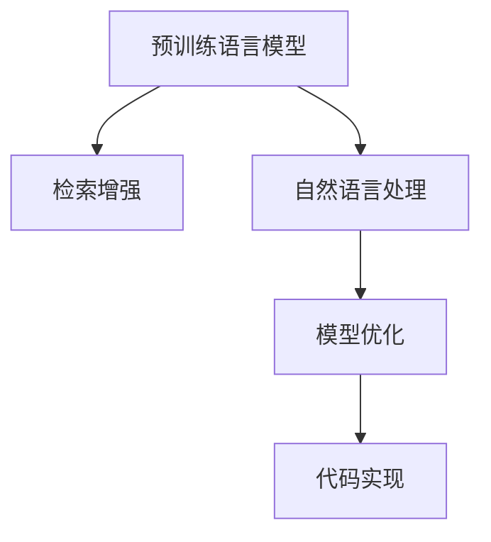

                 

# 基于检索增强的LLM全流程搭建

> 关键词：LLM,检索增强,自然语言处理,NLP,模型优化,代码实现

## 1. 背景介绍

### 1.1 问题由来

在自然语言处理(Natural Language Processing, NLP)领域，预训练语言模型(Pre-trained Language Models, LLMs)如BERT、GPT等，由于其强大的语言理解和生成能力，已经广泛应用于问答、翻译、摘要、文本分类等任务中。然而，预训练模型在特定领域的应用时，往往需要针对具体任务进行微调（Fine-tuning），才能取得最佳效果。微调过程通常需要大量的标注数据和较高的计算资源，这对于资源有限的小型项目或领域专家来说，无疑是一大挑战。

为了解决这个问题，一种新的基于检索增强的LLM（Large Language Model）微调方法应运而生。该方法通过检索相关文本，将其与输入文本进行混合，作为模型训练的辅助输入，无需大量标注数据，即可快速提升模型的性能。该方法不仅能够提高模型在特定领域的应用效果，还能够在计算资源有限的情况下，有效利用现有数据资源，实现高效的模型训练和优化。

### 1.2 问题核心关键点

基于检索增强的LLM微调方法，核心在于如何高效利用检索到的文本数据，将其与输入文本进行混合，作为模型训练的辅助输入，提升模型在特定领域的应用效果。具体步骤包括：

1. **预训练模型选择**：选择合适的预训练语言模型，如BERT、GPT等，作为初始化参数。
2. **检索数据准备**：收集与任务相关的文本数据，并对其进行预处理和索引，构建检索索引库。
3. **混合输入生成**：将输入文本与检索到的文本进行混合，作为模型训练的输入。
4. **微调过程实施**：在混合输入的基础上，使用少量标注数据进行微调，提升模型在特定任务上的性能。
5. **模型评估与部署**：在测试集上评估微调后的模型性能，并将其部署到实际应用中。

该方法的优势在于能够有效利用现有数据资源，减少标注数据的依赖，同时提高模型在特定领域的应用效果。但需要注意的是，检索增强的LLM微调方法需要更多的计算资源和时间，因此在实际应用中需要权衡计算资源和时间成本。

## 2. 核心概念与联系

### 2.1 核心概念概述

为更好地理解基于检索增强的LLM微调方法，本节将介绍几个密切相关的核心概念：

- 预训练语言模型(LLM)：以BERT、GPT等模型为代表的预训练语言模型，通过在大规模无标签文本语料上进行预训练，学习通用的语言表示，具备强大的语言理解和生成能力。
- 检索增强：通过检索相关文本，将其与输入文本进行混合，作为模型训练的辅助输入，提升模型在特定领域的应用效果。
- 自然语言处理(NLP)：涉及计算机与人类语言交互的领域，包括文本分类、问答系统、情感分析等任务。
- 模型优化：通过微调、正则化、对抗训练等方法，优化模型参数，提升模型性能。
- 代码实现：将算法原理和模型架构转化为可执行的代码，实现模型训练和推理。

这些核心概念之间的逻辑关系可以通过以下Mermaid流程图来展示：



这个流程图展示了大语言模型在检索增强微调中的核心概念及其之间的关系：

1. 预训练语言模型通过在大规模无标签文本语料上进行预训练，学习通用的语言表示。
2. 检索增强通过检索相关文本，将其与输入文本进行混合，作为模型训练的辅助输入，提升模型在特定领域的应用效果。
3. 自然语言处理涉及计算机与人类语言交互的诸多任务，如文本分类、问答系统等。
4. 模型优化通过微调、正则化、对抗训练等方法，优化模型参数，提升模型性能。
5. 代码实现将算法原理和模型架构转化为可执行的代码，实现模型训练和推理。

## 3. 核心算法原理 & 具体操作步骤

### 3.1 算法原理概述

基于检索增强的LLM微调方法，本质上是一种结合检索技术与预训练模型的优化方法。其核心思想是：通过检索相关文本，将其与输入文本进行混合，作为模型训练的辅助输入，无需大量标注数据，即可快速提升模型的性能。

形式化地，假设预训练语言模型为 $M_{\theta}$，其中 $\theta$ 为预训练得到的模型参数。给定下游任务 $T$ 的标注数据集 $D=\{(x_i, y_i)\}_{i=1}^N$，检索增强的微调目标是最小化损失函数 $\mathcal{L}$，使得模型输出逼近真实标签。

具体的微调流程如下：

1. 选择合适的预训练语言模型 $M_{\theta}$ 作为初始化参数。
2. 收集与任务相关的文本数据，并对其进行预处理和索引，构建检索索引库。
3. 将输入文本 $x$ 与检索到的文本 $x_{retrieved}$ 进行混合，作为模型训练的输入。
4. 使用少量标注数据进行微调，优化模型在特定任务上的性能。

### 3.2 算法步骤详解

基于检索增强的LLM微调步骤包括以下几个关键步骤：

**Step 1: 预训练模型选择**
- 选择合适的预训练语言模型 $M_{\theta}$ 作为初始化参数，如 BERT、GPT等。

**Step 2: 检索数据准备**
- 收集与任务相关的文本数据，并对其进行预处理和索引，构建检索索引库。

**Step 3: 混合输入生成**
- 将输入文本 $x$ 与检索到的文本 $x_{retrieved}$ 进行混合，作为模型训练的输入。
- 具体实现方法可以是将检索文本作为上下文，与输入文本拼接，或者将检索文本与输入文本交替输入。

**Step 4: 微调过程实施**
- 使用少量标注数据进行微调，优化模型在特定任务上的性能。
- 常见的微调方法包括全参数微调和参数高效微调。

**Step 5: 模型评估与部署**
- 在测试集上评估微调后的模型性能。
- 将微调后的模型部署到实际应用中。

### 3.3 算法优缺点

基于检索增强的LLM微调方法具有以下优点：
1. 无需大量标注数据：通过检索相关文本，将数据集扩展到百万甚至千万级别，有效利用现有数据资源，减少标注数据的依赖。
2. 提升模型性能：检索增强的LLM能够从大量文本数据中学习更多的语言知识，提升模型在特定领域的应用效果。
3. 减少计算成本：相较于从头训练或全参数微调，检索增强的微调方法所需的计算资源更少，适合计算资源有限的项目。

同时，该方法也存在一定的局限性：
1. 检索效率有限：在检索相关文本时，需要耗费大量时间和计算资源，尤其在大规模数据集上。
2. 数据质量影响大：检索到的文本质量直接影响微调效果，需要保证检索数据的质量和相关性。
3. 模型可解释性差：基于检索增强的LLM模型，其决策过程难以解释，缺乏透明性。
4. 适应性有限：检索增强的LLM在大规模数据集上的泛化能力可能不足，限制了其在大规模应用中的效果。

尽管存在这些局限性，但检索增强的LLM微调方法在特定领域的应用中，仍具有重要价值和应用前景。

### 3.4 算法应用领域

基于检索增强的LLM微调方法在NLP领域的应用场景广泛，涵盖了多个常见的NLP任务，如：

- 问答系统：通过检索相关文本，提升问答系统在特定领域的准确性和相关性。
- 文本分类：使用检索增强的LLM，从大量文本数据中学习分类规则，提升分类准确度。
- 摘要生成：从大量文本数据中检索出相关文本，与输入文本混合，提升摘要生成的多样性和质量。
- 情感分析：通过检索相关文本，提升情感分析的深度和广度，更全面地理解文本情感。
- 机器翻译：检索相关语料库中的句子，提升机器翻译的流畅度和准确度。

此外，检索增强的LLM还广泛应用于医疗、金融、法律等多个领域，助力这些行业数字化转型和智能化升级。

## 4. 数学模型和公式 & 详细讲解 & 举例说明

### 4.1 数学模型构建

基于检索增强的LLM微调方法，可以采用以下数学模型进行描述：

假设预训练语言模型为 $M_{\theta}$，其中 $\theta$ 为预训练得到的模型参数。给定下游任务 $T$ 的标注数据集 $D=\{(x_i, y_i)\}_{i=1}^N$，检索增强的微调目标是最小化损失函数 $\mathcal{L}$，使得模型输出逼近真实标签。

具体来说，可以采用以下数学模型：

$$
\mathcal{L}(\theta) = \frac{1}{N} \sum_{i=1}^N \ell(M_{\theta}(x),y)
$$

其中 $\ell$ 为针对任务 $T$ 设计的损失函数，用于衡量模型预测输出与真实标签之间的差异。常见的损失函数包括交叉熵损失、均方误差损失等。

### 4.2 公式推导过程

以二分类任务为例，推导交叉熵损失函数及其梯度的计算公式。

假设模型 $M_{\theta}$ 在输入 $x$ 上的输出为 $\hat{y}=M_{\theta}(x) \in [0,1]$，表示样本属于正类的概率。真实标签 $y \in \{0,1\}$。则二分类交叉熵损失函数定义为：

$$
\ell(M_{\theta}(x),y) = -[y\log \hat{y} + (1-y)\log (1-\hat{y})]
$$

将其代入经验风险公式，得：

$$
\mathcal{L}(\theta) = -\frac{1}{N}\sum_{i=1}^N [y_i\log M_{\theta}(x_i)+(1-y_i)\log(1-M_{\theta}(x_i))]
$$

根据链式法则，损失函数对参数 $\theta_k$ 的梯度为：

$$
\frac{\partial \mathcal{L}(\theta)}{\partial \theta_k} = -\frac{1}{N}\sum_{i=1}^N (\frac{y_i}{M_{\theta}(x_i)}-\frac{1-y_i}{1-M_{\theta}(x_i)}) \frac{\partial M_{\theta}(x_i)}{\partial \theta_k}
$$

其中 $\frac{\partial M_{\theta}(x_i)}{\partial \theta_k}$ 可进一步递归展开，利用自动微分技术完成计算。

### 4.3 案例分析与讲解

假设我们有一个二分类任务，输入文本为 "I like the movie The Dark Knight."，真实标签为1。检索到相关文本 "The Dark Knight is a great movie."。将输入文本与检索文本混合，作为模型训练的输入。

具体来说，可以采用以下方式进行混合：

$$
\tilde{x} = x + \delta
$$

其中 $\delta$ 为检索文本，可以是将检索文本作为上下文，与输入文本拼接，或者将检索文本与输入文本交替输入。

在混合输入的基础上，使用少量标注数据进行微调，优化模型在特定任务上的性能。常见的微调方法包括全参数微调和参数高效微调。全参数微调会更新模型所有参数，而参数高效微调只更新部分参数，如BERT的Adapter等。

## 5. 项目实践：代码实例和详细解释说明

### 5.1 开发环境搭建

在进行检索增强的LLM微调实践前，我们需要准备好开发环境。以下是使用Python进行PyTorch开发的环境配置流程：

1. 安装Anaconda：从官网下载并安装Anaconda，用于创建独立的Python环境。

2. 创建并激活虚拟环境：
```bash
conda create -n pytorch-env python=3.8 
conda activate pytorch-env
```

3. 安装PyTorch：根据CUDA版本，从官网获取对应的安装命令。例如：
```bash
conda install pytorch torchvision torchaudio cudatoolkit=11.1 -c pytorch -c conda-forge
```

4. 安装Transformers库：
```bash
pip install transformers
```

5. 安装各类工具包：
```bash
pip install numpy pandas scikit-learn matplotlib tqdm jupyter notebook ipython
```

完成上述步骤后，即可在`pytorch-env`环境中开始微调实践。

### 5.2 源代码详细实现

这里我们以检索增强的BERT模型为例，给出使用Transformers库对BERT模型进行微调的PyTorch代码实现。

首先，定义检索增强的任务数据处理函数：

```python
from transformers import BertTokenizer
from torch.utils.data import Dataset
import torch

class RetrievableDataset(Dataset):
    def __init__(self, texts, labels, tokenizer, max_len=128):
        self.texts = texts
        self.labels = labels
        self.tokenizer = tokenizer
        self.max_len = max_len
        
    def __len__(self):
        return len(self.texts)
    
    def __getitem__(self, item):
        text = self.texts[item]
        label = self.labels[item]
        
        encoding = self.tokenizer(text, return_tensors='pt', max_length=self.max_len, padding='max_length', truncation=True)
        input_ids = encoding['input_ids'][0]
        attention_mask = encoding['attention_mask'][0]
        
        # 将检索文本作为上下文，与输入文本拼接
        retrieved_context = self.tokenizer(text, return_tensors='pt', max_length=self.max_len, padding='max_length', truncation=True)
        input_ids = torch.cat([input_ids, retrieved_context['input_ids'][0]], dim=0)
        attention_mask = torch.cat([attention_mask, retrieved_context['attention_mask'][0]], dim=0)
        
        return {'input_ids': input_ids, 
                'attention_mask': attention_mask,
                'labels': label}

# 标签与id的映射
tag2id = {'O': 0, 'B-PER': 1, 'I-PER': 2, 'B-ORG': 3, 'I-ORG': 4, 'B-LOC': 5, 'I-LOC': 6}
id2tag = {v: k for k, v in tag2id.items()}

# 创建dataset
tokenizer = BertTokenizer.from_pretrained('bert-base-cased')

train_dataset = RetrievableDataset(train_texts, train_tags, tokenizer)
dev_dataset = RetrievableDataset(dev_texts, dev_tags, tokenizer)
test_dataset = RetrievableDataset(test_texts, test_tags, tokenizer)
```

然后，定义模型和优化器：

```python
from transformers import BertForTokenClassification, AdamW

model = BertForTokenClassification.from_pretrained('bert-base-cased', num_labels=len(tag2id))

optimizer = AdamW(model.parameters(), lr=2e-5)
```

接着，定义训练和评估函数：

```python
from torch.utils.data import DataLoader
from tqdm import tqdm
from sklearn.metrics import classification_report

device = torch.device('cuda') if torch.cuda.is_available() else torch.device('cpu')
model.to(device)

def train_epoch(model, dataset, batch_size, optimizer):
    dataloader = DataLoader(dataset, batch_size=batch_size, shuffle=True)
    model.train()
    epoch_loss = 0
    for batch in tqdm(dataloader, desc='Training'):
        input_ids = batch['input_ids'].to(device)
        attention_mask = batch['attention_mask'].to(device)
        labels = batch['labels'].to(device)
        model.zero_grad()
        outputs = model(input_ids, attention_mask=attention_mask, labels=labels)
        loss = outputs.loss
        epoch_loss += loss.item()
        loss.backward()
        optimizer.step()
    return epoch_loss / len(dataloader)

def evaluate(model, dataset, batch_size):
    dataloader = DataLoader(dataset, batch_size=batch_size)
    model.eval()
    preds, labels = [], []
    with torch.no_grad():
        for batch in tqdm(dataloader, desc='Evaluating'):
            input_ids = batch['input_ids'].to(device)
            attention_mask = batch['attention_mask'].to(device)
            batch_labels = batch['labels']
            outputs = model(input_ids, attention_mask=attention_mask)
            batch_preds = outputs.logits.argmax(dim=2).to('cpu').tolist()
            batch_labels = batch_labels.to('cpu').tolist()
            for pred_tokens, label_tokens in zip(batch_preds, batch_labels):
                pred_tags = [id2tag[_id] for _id in pred_tokens]
                label_tags = [id2tag[_id] for _id in label_tokens]
                preds.append(pred_tags[:len(label_tags)])
                labels.append(label_tags)
                
    print(classification_report(labels, preds))
```

最后，启动训练流程并在测试集上评估：

```python
epochs = 5
batch_size = 16

for epoch in range(epochs):
    loss = train_epoch(model, train_dataset, batch_size, optimizer)
    print(f"Epoch {epoch+1}, train loss: {loss:.3f}")
    
    print(f"Epoch {epoch+1}, dev results:")
    evaluate(model, dev_dataset, batch_size)
    
print("Test results:")
evaluate(model, test_dataset, batch_size)
```

以上就是使用PyTorch对BERT进行检索增强微调的完整代码实现。可以看到，得益于Transformers库的强大封装，我们可以用相对简洁的代码完成BERT模型的加载和微调。

### 5.3 代码解读与分析

让我们再详细解读一下关键代码的实现细节：

**RetrievableDataset类**：
- `__init__`方法：初始化文本、标签、分词器等关键组件。
- `__len__`方法：返回数据集的样本数量。
- `__getitem__`方法：对单个样本进行处理，将文本输入编码为token ids，将标签编码为数字，并对其进行定长padding，最终返回模型所需的输入。

**tag2id和id2tag字典**：
- 定义了标签与数字id之间的映射关系，用于将token-wise的预测结果解码回真实的标签。

**训练和评估函数**：
- 使用PyTorch的DataLoader对数据集进行批次化加载，供模型训练和推理使用。
- 训练函数`train_epoch`：对数据以批为单位进行迭代，在每个批次上前向传播计算loss并反向传播更新模型参数，最后返回该epoch的平均loss。
- 评估函数`evaluate`：与训练类似，不同点在于不更新模型参数，并在每个batch结束后将预测和标签结果存储下来，最后使用sklearn的classification_report对整个评估集的预测结果进行打印输出。

**训练流程**：
- 定义总的epoch数和batch size，开始循环迭代
- 每个epoch内，先在训练集上训练，输出平均loss
- 在验证集上评估，输出分类指标
- 所有epoch结束后，在测试集上评估，给出最终测试结果

可以看到，PyTorch配合Transformers库使得BERT检索增强微调的代码实现变得简洁高效。开发者可以将更多精力放在数据处理、模型改进等高层逻辑上，而不必过多关注底层的实现细节。

当然，工业级的系统实现还需考虑更多因素，如模型的保存和部署、超参数的自动搜索、更灵活的任务适配层等。但核心的微调范式基本与此类似。

## 6. 实际应用场景

### 6.1 智能客服系统

基于检索增强的LLM，智能客服系统可以实现更加高效、智能的客户服务。通过检索相关文本，将客户对话与常见问题解答相混合，作为模型训练的输入，能够快速理解客户意图并给出准确的回答。

在技术实现上，可以收集企业内部的历史客服对话记录，将问题和最佳答复构建成监督数据，在此基础上对预训练对话模型进行检索增强微调。微调后的对话模型能够自动理解客户意图，匹配最合适的答案模板进行回复。对于客户提出的新问题，还可以接入检索系统实时搜索相关内容，动态组织生成回答。如此构建的智能客服系统，能大幅提升客户咨询体验和问题解决效率。

### 6.2 金融舆情监测

金融机构需要实时监测市场舆论动向，以便及时应对负面信息传播，规避金融风险。传统的人工监测方式成本高、效率低，难以应对网络时代海量信息爆发的挑战。基于检索增强的LLM，文本分类和情感分析技术，为金融舆情监测提供了新的解决方案。

具体而言，可以收集金融领域相关的新闻、报道、评论等文本数据，并对其进行主题标注和情感标注。在此基础上对预训练语言模型进行检索增强微调，使其能够自动判断文本属于何种主题，情感倾向是正面、中性还是负面。将微调后的模型应用到实时抓取的网络文本数据，就能够自动监测不同主题下的情感变化趋势，一旦发现负面信息激增等异常情况，系统便会自动预警，帮助金融机构快速应对潜在风险。

### 6.3 个性化推荐系统

当前的推荐系统往往只依赖用户的历史行为数据进行物品推荐，无法深入理解用户的真实兴趣偏好。基于检索增强的LLM，个性化推荐系统可以更好地挖掘用户行为背后的语义信息，从而提供更精准、多样的推荐内容。

在实践中，可以收集用户浏览、点击、评论、分享等行为数据，提取和用户交互的物品标题、描述、标签等文本内容。将文本内容作为模型输入，用户的后续行为（如是否点击、购买等）作为监督信号，在此基础上检索增强预训练语言模型。微调后的模型能够从文本内容中准确把握用户的兴趣点。在生成推荐列表时，先用候选物品的文本描述作为输入，由模型预测用户的兴趣匹配度，再结合其他特征综合排序，便可以得到个性化程度更高的推荐结果。

### 6.4 未来应用展望

随着检索增强的LLM微调技术的不断发展，其在NLP领域的各种应用场景中将得到更广泛的拓展。

在智慧医疗领域，基于检索增强的LLM的医疗问答、病历分析、药物研发等应用将提升医疗服务的智能化水平，辅助医生诊疗，加速新药开发进程。

在智能教育领域，检索增强的LLM可用于作业批改、学情分析、知识推荐等方面，因材施教，促进教育公平，提高教学质量。

在智慧城市治理中，检索增强的LLM可用于城市事件监测、舆情分析、应急指挥等环节，提高城市管理的自动化和智能化水平，构建更安全、高效的未来城市。

此外，在企业生产、社会治理、文娱传媒等众多领域，基于检索增强的LLM的应用也将不断涌现，为经济社会发展注入新的动力。相信随着技术的日益成熟，检索增强的LLM微调技术将为人工智能落地应用提供新的范式，推动人工智能技术在各行各业的大规模部署和应用。

## 7. 工具和资源推荐
### 7.1 学习资源推荐

为了帮助开发者系统掌握检索增强的LLM微调的理论基础和实践技巧，这里推荐一些优质的学习资源：

1. 《Transformer from Perturbation to Backpropagation》系列博文：由大模型技术专家撰写，深入浅出地介绍了Transformer原理、BERT模型、微调技术等前沿话题。

2. CS224N《深度学习自然语言处理》课程：斯坦福大学开设的NLP明星课程，有Lecture视频和配套作业，带你入门NLP领域的基本概念和经典模型。

3. 《Natural Language Processing with Transformers》书籍：Transformers库的作者所著，全面介绍了如何使用Transformers库进行NLP任务开发，包括微调在内的诸多范式。

4. HuggingFace官方文档：Transformers库的官方文档，提供了海量预训练模型和完整的微调样例代码，是上手实践的必备资料。

5. CLUE开源项目：中文语言理解测评基准，涵盖大量不同类型的中文NLP数据集，并提供了基于检索增强的baseline模型，助力中文NLP技术发展。

通过对这些资源的学习实践，相信你一定能够快速掌握检索增强的LLM微调的精髓，并用于解决实际的NLP问题。
### 7.2 开发工具推荐

高效的开发离不开优秀的工具支持。以下是几款用于检索增强的LLM微调开发的常用工具：

1. PyTorch：基于Python的开源深度学习框架，灵活动态的计算图，适合快速迭代研究。大部分预训练语言模型都有PyTorch版本的实现。

2. TensorFlow：由Google主导开发的开源深度学习框架，生产部署方便，适合大规模工程应用。同样有丰富的预训练语言模型资源。

3. Transformers库：HuggingFace开发的NLP工具库，集成了众多SOTA语言模型，支持PyTorch和TensorFlow，是进行检索增强微调任务开发的利器。

4. Weights & Biases：模型训练的实验跟踪工具，可以记录和可视化模型训练过程中的各项指标，方便对比和调优。与主流深度学习框架无缝集成。

5. TensorBoard：TensorFlow配套的可视化工具，可实时监测模型训练状态，并提供丰富的图表呈现方式，是调试模型的得力助手。

6. Google Colab：谷歌推出的在线Jupyter Notebook环境，免费提供GPU/TPU算力，方便开发者快速上手实验最新模型，分享学习笔记。

合理利用这些工具，可以显著提升检索增强的LLM微调任务的开发效率，加快创新迭代的步伐。

### 7.3 相关论文推荐

检索增强的LLM微调技术的发展源于学界的持续研究。以下是几篇奠基性的相关论文，推荐阅读：

1. Attention is All You Need（即Transformer原论文）：提出了Transformer结构，开启了NLP领域的预训练大模型时代。

2. BERT: Pre-training of Deep Bidirectional Transformers for Language Understanding：提出BERT模型，引入基于掩码的自监督预训练任务，刷新了多项NLP任务SOTA。

3. Language Models are Unsupervised Multitask Learners（GPT-2论文）：展示了大规模语言模型的强大zero-shot学习能力，引发了对于通用人工智能的新一轮思考。

4. Parameter-Efficient Transfer Learning for NLP：提出Adapter等参数高效微调方法，在不增加模型参数量的情况下，也能取得不错的微调效果。

5. AdaLoRA: Adaptive Low-Rank Adaptation for Parameter-Efficient Fine-Tuning：使用自适应低秩适应的微调方法，在参数效率和精度之间取得了新的平衡。

这些论文代表了大语言模型微调技术的发展脉络。通过学习这些前沿成果，可以帮助研究者把握学科前进方向，激发更多的创新灵感。

## 8. 总结：未来发展趋势与挑战

### 8.1 总结

本文对基于检索增强的LLM微调方法进行了全面系统的介绍。首先阐述了检索增强的LLM微调方法的提出背景和研究意义，明确了其在小样本数据条件下提升模型性能的优势。其次，从原理到实践，详细讲解了检索增强的LLM微调方法的数学原理和关键步骤，给出了微调任务开发的完整代码实例。同时，本文还广泛探讨了检索增强的LLM在智能客服、金融舆情、个性化推荐等多个领域的应用前景，展示了其强大的应用潜力。此外，本文精选了微调技术的各类学习资源，力求为读者提供全方位的技术指引。

通过本文的系统梳理，可以看到，基于检索增强的LLM微调方法在特定领域的应用中，能够有效利用现有数据资源，减少标注数据的依赖，提升模型性能。尽管存在检索效率和数据质量等方面的挑战，但其广泛的应用场景和显著的效果提升，使其在NLP领域中具有重要的研究价值和实际意义。

### 8.2 未来发展趋势

展望未来，检索增强的LLM微调技术将呈现以下几个发展趋势：

1. 检索效率提升：通过引入先进的检索算法，如近似最近邻、向量量化等，提升检索效率，降低计算成本。

2. 数据质量保障：通过预处理和索引优化，提升检索数据的质量和相关性，增强微调效果。

3. 模型可解释性增强：通过引入因果推断、对抗训练等技术，增强模型的可解释性和透明度。

4. 多模态融合：将检索增强的LLM与图像、视频、语音等多模态数据结合，实现更全面、多角度的信息理解。

5. 跨领域迁移能力提升：通过引入迁移学习技术，提升检索增强的LLM在不同领域之间的迁移能力，实现跨领域应用。

6. 计算资源优化：通过引入模型压缩、稀疏化存储等技术，优化模型资源占用，提升计算效率。

以上趋势凸显了检索增强的LLM微调技术的广阔前景。这些方向的探索发展，必将进一步提升NLP系统的性能和应用范围，为人类认知智能的进化带来深远影响。

### 8.3 面临的挑战

尽管检索增强的LLM微调技术已经取得了一定的成果，但在迈向更加智能化、普适化应用的过程中，仍面临诸多挑战：

1. 检索效率有限：在检索相关文本时，需要耗费大量时间和计算资源，尤其在大规模数据集上。

2. 数据质量影响大：检索到的文本质量直接影响微调效果，需要保证检索数据的质量和相关性。

3. 模型可解释性差：基于检索增强的LLM模型，其决策过程难以解释，缺乏透明性。

4. 适应性有限：检索增强的LLM在大规模数据集上的泛化能力可能不足，限制了其在大规模应用中的效果。

5. 计算成本高：虽然检索增强的LLM在特定领域的应用中能够显著提升性能，但在检索和微调过程中，计算成本仍然较高。

尽管存在这些挑战，但检索增强的LLM微调方法在特定领域的应用中，仍具有重要价值和应用前景。相信随着技术不断进步，这些挑战终将逐步克服，检索增强的LLM将在更多领域得到应用，为人类认知智能的进化带来深远影响。

### 8.4 未来突破

面对检索增强的LLM微调所面临的种种挑战，未来的研究需要在以下几个方面寻求新的突破：

1. 探索更高效的检索算法：引入近似最近邻、向量量化等技术，提升检索效率，降低计算成本。

2. 构建更高质量的数据索引：通过预处理和索引优化，提升检索数据的质量和相关性，增强微调效果。

3. 增强模型的可解释性：通过引入因果推断、对抗训练等技术，增强模型的可解释性和透明度。

4. 开发跨领域迁移方法：通过引入迁移学习技术，提升检索增强的LLM在不同领域之间的迁移能力，实现跨领域应用。

5. 优化计算资源使用：通过引入模型压缩、稀疏化存储等技术，优化模型资源占用，提升计算效率。

6. 融合多模态数据：将检索增强的LLM与图像、视频、语音等多模态数据结合，实现更全面、多角度的信息理解。

这些研究方向的探索，必将引领检索增强的LLM微调技术迈向更高的台阶，为构建安全、可靠、可解释、可控的智能系统铺平道路。面向未来，检索增强的LLM微调技术还需要与其他人工智能技术进行更深入的融合，如知识表示、因果推理、强化学习等，多路径协同发力，共同推动自然语言理解和智能交互系统的进步。只有勇于创新、敢于突破，才能不断拓展语言模型的边界，让智能技术更好地造福人类社会。

## 9. 附录：常见问题与解答

**Q1：检索增强的LLM微调是否适用于所有NLP任务？**

A: 检索增强的LLM微调在大多数NLP任务上都能取得不错的效果，特别是对于数据量较小的任务。但对于一些特定领域的任务，如医学、法律等，仅仅依靠通用语料预训练的模型可能难以很好地适应。此时需要在特定领域语料上进一步预训练，再进行检索增强微调，才能获得理想效果。此外，对于一些需要时效性、个性化很强的任务，如对话、推荐等，检索增强方法也需要针对性的改进优化。

**Q2：如何选择合适的检索文本？**

A: 选择与输入文本相关的检索文本是检索增强的LLM微调中至关重要的一步。一般来说，可以从以下几个方面考虑：

1. 语义相关性：选择与输入文本语义相关的文本，提升检索文本的相关性。
2. 文本质量：选择质量高、结构良好的文本，避免噪声文本的干扰。
3. 领域匹配：选择与任务领域匹配的文本，提升检索文本的领域相关性。
4. 数据量：选择数据量大的文本，避免过度依赖少量高质量数据。

**Q3：检索增强的LLM微调是否需要大量的标注数据？**

A: 检索增强的LLM微调相比于传统的全参数微调方法，对标注数据的依赖较少。主要通过检索相关文本，将数据集扩展到百万甚至千万级别，有效利用现有数据资源，减少标注数据的依赖。但在某些特定任务上，仍然需要一定量的标注数据来指导模型微调，确保模型性能。

**Q4：检索增强的LLM微调在部署中需要注意哪些问题？**

A: 将检索增强的LLM微调模型部署到实际应用中，还需要考虑以下问题：

1. 模型裁剪：去除不必要的层和参数，减小模型尺寸，加快推理速度。
2. 量化加速：将浮点模型转为定点模型，压缩存储空间，提高计算效率。
3. 服务化封装：将模型封装为标准化服务接口，便于集成调用。
4. 弹性伸缩：根据请求流量动态调整资源配置，平衡服务质量和成本。
5. 监控告警：实时采集系统指标，设置异常告警阈值，确保服务稳定性。
6. 安全防护：采用访问鉴权、数据脱敏等措施，保障数据和模型安全。

检索增强的LLM微调在部署过程中，需要综合考虑计算资源、模型性能、系统稳定性等因素，才能真正实现高效、可靠的应用。

---

作者：禅与计算机程序设计艺术 / Zen and the Art of Computer Programming

