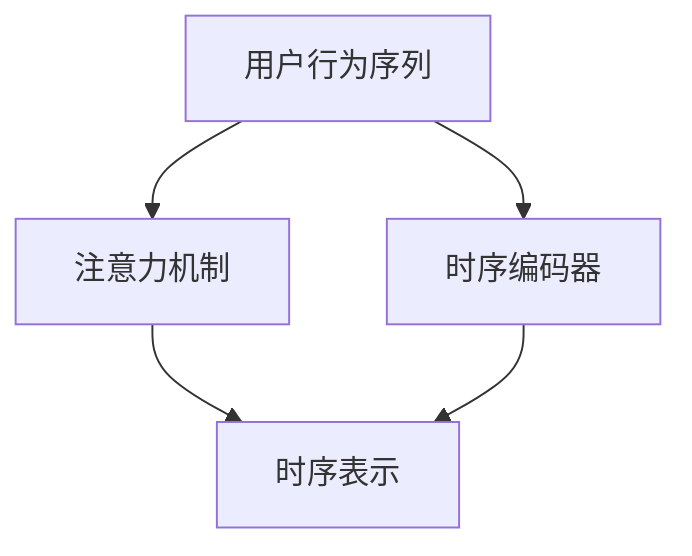

                 

# 基于注意力机制的时序推荐模型

## 1. 背景介绍

在当今快速发展的数字化时代，推荐系统已成为各类在线平台（如电商平台、视频流媒体平台、社交网络等）的核心组件。推荐系统通过分析用户的历史行为和偏好，预测并推荐可能符合用户需求的内容，从而提升用户体验和平台营收。然而，传统的推荐算法往往忽略时间维度，难以捕捉用户行为随时间变化的趋势和规律，导致推荐结果的准确性不足。

为了解决这一问题，时序推荐系统（Temporal Recommendation System）应运而生。时序推荐系统不仅考虑用户的历史行为，还分析用户行为的时序特征，捕捉用户随时间变化的兴趣偏好，进而提供更精准的个性化推荐。基于注意力机制的时序推荐模型则是近年来在该领域内取得突破性进展的关键技术之一。

### 1.1 问题由来

在推荐系统中，时序信息至关重要。用户的行为通常具有明显的时序性，例如购物、浏览视频、阅读文章等活动往往在一段时间内形成一定的行为模式。因此，时序推荐系统需要捕捉用户行为的时序特征，利用时序数据建立更精细的模型，以提升推荐准确性和个性化程度。

传统推荐系统主要基于协同过滤和矩阵分解等方法，忽略了用户行为的时序性，难以应对用户兴趣随时间变化的动态特征。与此相比，基于注意力机制的时序推荐模型能够动态捕捉用户行为的上下文关联和时序变化，从而提升推荐系统的性能。

### 1.2 问题核心关键点

基于注意力机制的时序推荐模型的核心思想是：利用注意力机制对用户的时序行为进行加权，捕捉用户行为的时间依赖性和上下文关联性，从而提升推荐精度。该模型通常包括两个主要组成部分：时序编码器和注意力机制。

时序编码器用于对用户的历史行为进行编码，形成时序表示。常见的时序编码器包括RNN、LSTM、GRU等序列模型。注意力机制则用于动态捕捉用户行为的上下文关联和时间依赖性，从而对时序表示进行加权。注意力机制的主要特点是：

1. 能够对不同时间点的行为进行加权，捕捉行为的时序特征。
2. 能够学习用户行为的上下文关联，对重要时间点的行为赋予更高的权重。
3. 能够适应不同的用户行为模式，动态调整加权策略。

### 1.3 问题研究意义

研究基于注意力机制的时序推荐模型，对于提升推荐系统的性能和用户体验，具有重要意义：

1. 增强推荐系统的个性化能力。时序推荐模型能够捕捉用户行为的时序性和上下文关联性，从而提供更加精准的个性化推荐。
2. 提升推荐系统的实时性。时序推荐模型能够实时捕捉用户行为的最新变化，及时调整推荐策略。
3. 优化推荐系统的成本效益。时序推荐模型通过分析用户历史行为，减少对新用户进行冷启动的成本。
4. 支持用户行为分析。时序推荐模型能够分析用户行为的时序变化和上下文关联，支持更深入的用户行为分析。

## 2. 核心概念与联系

### 2.1 核心概念概述

为更好地理解基于注意力机制的时序推荐模型，本节将介绍几个密切相关的核心概念：

- 时序推荐系统（Temporal Recommendation System）：基于用户的历史行为序列进行推荐，考虑时序信息对推荐结果的影响。
- 时序编码器（Temporal Encoder）：用于对用户历史行为序列进行编码，形成时序表示。常见的时序编码器包括RNN、LSTM、GRU等序列模型。
- 注意力机制（Attention Mechanism）：用于对用户历史行为序列进行加权，捕捉行为的时间依赖性和上下文关联性。
- 用户行为序列（User Behavior Sequence）：用户的历史行为按照时间顺序组成的序列，如浏览记录、购买记录等。
- 时序表示（Temporal Representation）：用户行为序列经过编码后形成的时序特征表示。
- 注意力权重（Attention Weight）：对用户行为序列中各个时间点的行为进行加权，捕捉行为的时序特征和上下文关联性。

这些核心概念之间的逻辑关系可以通过以下Mermaid流程图来展示：



这个流程图展示了大语言模型的核心概念及其之间的关系：

1. 用户行为序列作为输入数据。
2. 时序编码器对用户行为序列进行编码，形成时序表示。
3. 注意力机制对时序表示进行加权，形成加权后的时序表示。
4. 加权后的时序表示作为推荐模型的输入，用于生成推荐结果。

这些概念共同构成了时序推荐模型的基本框架，使其能够动态捕捉用户行为的上下文关联和时间依赖性，提升推荐系统的性能。

## 3. 核心算法原理 & 具体操作步骤
### 3.1 算法原理概述

基于注意力机制的时序推荐模型，本质上是一种动态加权的序列建模方法。其核心思想是：利用注意力机制对用户的时序行为进行加权，捕捉行为的时间依赖性和上下文关联性，从而提升推荐精度。

形式化地，假设用户行为序列为 $X=\{(x_t)\}_{t=1}^T$，其中 $x_t$ 表示用户在时间 $t$ 的行为。时序推荐模型的目标是找到函数 $f$，使得对于任意时间点 $t$，模型能够根据前 $t-1$ 个时间点的行为序列 $X_{t-1}$，预测时间点 $t$ 的行为 $x_t$。基于注意力机制的时序推荐模型可以通过以下步骤实现：

1. 对用户历史行为序列进行编码，形成时序表示 $h_t$。
2. 利用注意力机制对时序表示进行加权，形成加权后的时序表示 $a_t$。
3. 将加权后的时序表示作为输入，输出推荐结果。

具体而言，时序编码器和注意力机制可以采用如下形式：

- 时序编码器：$h_t = f(x_t, h_{t-1})$，其中 $h_{t-1}$ 是时间点 $t-1$ 的编码表示。
- 注意力机制：$a_t = \sigma(g(h_t, X_{t-1}))$，其中 $\sigma$ 是注意力函数，$g$ 是注意力计算函数。

### 3.2 算法步骤详解

基于注意力机制的时序推荐模型的具体实现步骤如下：

**Step 1: 准备数据和模型**
- 收集用户历史行为序列 $X$，划分为训练集、验证集和测试集。
- 选择时序编码器和注意力机制。常见的时序编码器包括RNN、LSTM、GRU等，常见的注意力机制包括点积注意力、加性注意力、多头注意力等。
- 初始化模型参数。

**Step 2: 时序编码器**
- 对用户历史行为序列进行编码，形成时序表示 $h_t$。常用的时序编码器包括RNN、LSTM、GRU等。

**Step 3: 注意力机制**
- 利用注意力机制对时序表示进行加权，形成加权后的时序表示 $a_t$。
- 常见的注意力计算函数 $g$ 包括点积注意力、加性注意力、多头注意力等。
- 常见的注意力函数 $\sigma$ 包括Softmax、GELU等。

**Step 4: 输出推荐结果**
- 将加权后的时序表示作为输入，输出推荐结果。
- 通常采用回归、分类等模型进行推荐结果的预测。

**Step 5: 训练和评估**
- 使用训练集数据对模型进行训练，最小化损失函数。
- 使用验证集数据对模型进行调优，选择最优超参数组合。
- 使用测试集数据对模型进行评估，对比微调前后的性能提升。

### 3.3 算法优缺点

基于注意力机制的时序推荐模型具有以下优点：

1. 能够动态捕捉用户行为的上下文关联和时间依赖性，提升推荐精度。
2. 能够实时捕捉用户行为的最新变化，及时调整推荐策略。
3. 能够支持复杂的时序特征建模，适应不同用户行为模式。
4. 能够提高推荐系统的可解释性，解释推荐结果的依据。

同时，该模型也存在一些局限性：

1. 对标注数据的依赖较大。时序推荐模型通常需要大量的标注数据进行训练，而标注数据的获取成本较高。
2. 计算复杂度较高。时序编码器和注意力机制的计算复杂度较高，需要优化以提高模型的训练和推理效率。
3. 对序列长度的限制。时序编码器和注意力机制对序列长度的依赖较大，过长的序列可能导致计算资源消耗过大。

尽管存在这些局限性，但基于注意力机制的时序推荐模型在推荐系统中具有巨大的应用潜力，成为近年来研究的热点之一。

### 3.4 算法应用领域

基于注意力机制的时序推荐模型已经在多个领域得到应用，例如：

- 电子商务推荐：基于用户历史浏览和购买记录，推荐用户可能感兴趣的商品。
- 视频流媒体推荐：基于用户历史观看记录，推荐用户可能喜欢的视频内容。
- 社交网络推荐：基于用户的历史互动记录，推荐用户可能感兴趣的内容或好友。
- 新闻推荐：基于用户的历史阅读记录，推荐用户可能感兴趣的新闻内容。
- 音乐推荐：基于用户的历史听歌记录，推荐用户可能喜欢的音乐内容。

除了上述这些经典应用外，时序推荐模型还被创新性地应用于个性化视频广告推荐、智能交通管理等领域，为各行各业带来了新的创新点。

## 4. 数学模型和公式 & 详细讲解  
### 4.1 数学模型构建

本节将使用数学语言对基于注意力机制的时序推荐模型的核心部分进行更加严格的刻画。

假设用户历史行为序列为 $X=\{(x_t)\}_{t=1}^T$，其中 $x_t \in \mathbb{R}^d$。时序编码器可以表示为 $h_t = f(x_t, h_{t-1})$，其中 $f$ 为序列模型，$h_{t-1}$ 是时间点 $t-1$ 的编码表示。注意力机制可以表示为 $a_t = \sigma(g(h_t, X_{t-1}))$，其中 $\sigma$ 为注意力函数，$g$ 为注意力计算函数。

### 4.2 公式推导过程

以下我们以LSTM时序编码器和多头注意力机制为例，推导基于注意力机制的时序推荐模型的公式。

假设时序编码器采用LSTM模型，则有：

$$
h_t = LSTM(x_t, h_{t-1})
$$

其中 $h_t$ 为时间点 $t$ 的编码表示，$LSTM$ 为LSTM模型。

假设注意力机制采用多头注意力，则有：

$$
a_t = \sigma\left(\sum_{i=1}^H \alpha_{ti} g_i(h_t, X_{t-1})\right)
$$

其中 $g_i$ 为第 $i$ 个注意力计算函数，$H$ 为注意力机制的头数，$\alpha_{ti}$ 为第 $i$ 个注意力权重，$\sigma$ 为注意力函数，通常采用Softmax函数。

将上述公式代入推荐模型，输出推荐结果 $y_t$ 可以表示为：

$$
y_t = M(a_t)
$$

其中 $M$ 为推荐模型，如回归模型、分类模型等。

### 4.3 案例分析与讲解

以电商推荐系统为例，解释基于注意力机制的时序推荐模型的实现过程。

假设电商网站收集了用户的历史浏览、购买记录，形成用户行为序列 $X=\{(x_t)\}_{t=1}^T$，其中 $x_t$ 表示用户在时间 $t$ 的浏览或购买行为。时序编码器采用LSTM模型，注意力机制采用多头注意力。

首先，对用户历史行为序列进行编码，形成时序表示 $h_t$：

$$
h_t = LSTM(x_t, h_{t-1})
$$

然后，利用多头注意力对时序表示进行加权，形成加权后的时序表示 $a_t$：

$$
a_t = \sigma\left(\sum_{i=1}^H \alpha_{ti} g_i(h_t, X_{t-1})\right)
$$

其中 $g_i$ 为注意力计算函数，$\alpha_{ti}$ 为注意力权重，通常采用点积注意力或加性注意力。

最后，将加权后的时序表示作为输入，输出推荐结果 $y_t$：

$$
y_t = M(a_t)
$$

其中 $M$ 为推荐模型，如回归模型、分类模型等。

在训练阶段，最小化推荐模型和注意力机制的联合损失函数，得到最优模型参数：

$$
\theta^* = \mathop{\arg\min}_{\theta} \mathcal{L}(\theta)
$$

其中 $\theta$ 为时序编码器和注意力机制的参数，$\mathcal{L}$ 为联合损失函数。

## 5. 项目实践：代码实例和详细解释说明
### 5.1 开发环境搭建

在进行时序推荐模型开发前，我们需要准备好开发环境。以下是使用Python进行TensorFlow开发的环境配置流程：

1. 安装Anaconda：从官网下载并安装Anaconda，用于创建独立的Python环境。

2. 创建并激活虚拟环境：
```bash
conda create -n tf-env python=3.8 
conda activate tf-env
```

3. 安装TensorFlow：根据CUDA版本，从官网获取对应的安装命令。例如：
```bash
conda install tensorflow -c pytorch -c conda-forge
```

4. 安装Keras：
```bash
pip install keras tensorflow-gpu
```

5. 安装各类工具包：
```bash
pip install numpy pandas scikit-learn matplotlib tqdm jupyter notebook ipython
```

完成上述步骤后，即可在`tf-env`环境中开始时序推荐模型开发。

### 5.2 源代码详细实现

下面以LSTM时序编码器和多头注意力机制为例，给出使用TensorFlow对时序推荐模型进行训练的PyTorch代码实现。

首先，定义时序编码器：

```python
from tensorflow.keras.layers import LSTM, Dense, Input
from tensorflow.keras.models import Model

def build_time_series_encoder(inputs):
    x = Input(shape=(max_seq_len, input_dim))
    lstm = LSTM(units=hidden_units, return_sequences=True, name='lstm_layer')
    encoder = lstm(x)
    return encoder
```

然后，定义注意力机制：

```python
def build_attention(encoder_output):
    attention = Input(shape=(max_seq_len, hidden_units))
    query = Dense(units=attention_heads * attention_head_size, activation='relu', name='query_layer')(encoder_output)
    query = Dense(units=attention_head_size, activation='relu', name='attention_query_layer')(query)
    key = Dense(units=attention_head_size, activation='relu', name='attention_key_layer')(encoder_output)
    value = Dense(units=attention_head_size, activation='relu', name='attention_value_layer')(encoder_output)
    attention_weights = tf.keras.layers.Dense(attention_heads, activation='softmax')(tf.keras.layers.Dot(axes=(2, 1))(attention_query_layer, key))
    attention_output = tf.keras.layers.Dot(axes=(2, 1))(attention_weights, value)
    return attention_output
```

接着，定义推荐模型：

```python
def build_recommendation_model(encoder_output, attention_output):
    recommendation = Dense(units=num_recommendations, activation='sigmoid', name='recommendation_layer')(attention_output)
    return recommendation
```

最后，定义模型整体：

```python
def build_model():
    encoder_output = build_time_series_encoder(inputs)
    attention_output = build_attention(encoder_output)
    recommendation_output = build_recommendation_model(attention_output)
    model = Model(inputs=inputs, outputs=recommendation_output)
    return model
```

以上代码展示了使用TensorFlow对时序推荐模型进行训练的完整代码实现。可以看到，TensorFlow的高级API Keras使得模型构建和训练的过程非常简单高效。

### 5.3 代码解读与分析

让我们再详细解读一下关键代码的实现细节：

**build_time_series_encoder函数**：
- `Input`层：定义输入数据维度为 $(max_seq_len, input_dim)$。
- `LSTM`层：采用LSTM模型对输入数据进行编码，得到时序表示 $h_t$。
- `return_sequences=True`：LSTM模型返回序列表示，方便后续的注意力计算。

**build_attention函数**：
- `Input`层：定义注意力机制的输入为 $(max_seq_len, hidden_units)$。
- `query_layer`、`key_layer`、`value_layer`：分别对时序表示 $h_t$ 进行线性变换，得到查询向量、键向量和值向量。
- `Dense`层：采用点积注意力计算注意力权重 $\alpha_{ti}$，得到加权后的时序表示 $a_t$。

**build_recommendation_model函数**：
- `Dense`层：采用线性层将加权后的时序表示转换为推荐结果 $y_t$。

**build_model函数**：
- 将时序编码器、注意力机制和推荐模型组合成一个整体模型。
- 采用 `Model` 类将输入和输出连接起来，形成完整的推荐模型。

可以看到，TensorFlow的Keras API使得模型的构建和训练过程非常简单高效。开发者可以专注于模型的逻辑实现，而不必过多关注底层的实现细节。

## 6. 实际应用场景
### 6.1 智能推荐系统

基于注意力机制的时序推荐模型，可以广泛应用于智能推荐系统。传统推荐系统往往只考虑用户的历史行为，难以捕捉用户行为的时序性和上下文关联性，导致推荐结果的个性化程度和实时性不足。而时序推荐模型能够动态捕捉用户行为的上下文关联和时间依赖性，从而提供更加精准的个性化推荐。

在实际应用中，可以将用户的历史行为序列输入时序推荐模型，输出推荐结果。时序推荐模型能够实时捕捉用户行为的最新变化，及时调整推荐策略，提供更加个性化和实时的推荐服务。

### 6.2 社交网络分析

社交网络分析是时序推荐模型的一个重要应用领域。社交网络中的用户行为具有明显的时间依赖性和上下文关联性，时序推荐模型能够动态捕捉这些特征，从而提升社交网络分析的效果。

例如，在社交网络推荐系统中，用户的历史互动记录可以输入时序推荐模型，输出推荐好友或内容。时序推荐模型能够动态捕捉用户互动的时序性和上下文关联性，从而提供更加精准的推荐结果。

### 6.3 实时交通监控

实时交通监控是时序推荐模型的另一个重要应用领域。交通监控系统需要实时捕捉车辆和行人的动态变化，提供实时的交通状况报告。时序推荐模型能够动态捕捉交通行为的时序性和上下文关联性，从而提升交通监控的效果。

例如，在交通监控系统中，车辆的历史行驶记录可以输入时序推荐模型，输出实时交通状况报告。时序推荐模型能够动态捕捉车辆行驶的时序性和上下文关联性，从而提供更加精准的交通状况报告。

### 6.4 未来应用展望

随着时序推荐模型的不断发展和应用，其应用场景将不断拓展。未来，基于注意力机制的时序推荐模型将在更多领域得到应用，为各行各业带来新的变革。

在智慧城市治理中，时序推荐模型能够实时捕捉城市事件的变化，提供实时的城市管理报告。在医疗领域，时序推荐模型能够动态捕捉患者的行为变化，提供实时的健康监测报告。在金融领域，时序推荐模型能够动态捕捉市场的变化，提供实时的金融分析报告。

此外，在更多领域中，时序推荐模型将发挥越来越重要的作用，为各行各业带来新的变革。相信在未来，时序推荐模型将成为人工智能技术的重要组成部分，推动各行各业的数字化转型升级。

## 7. 工具和资源推荐
### 7.1 学习资源推荐

为了帮助开发者系统掌握时序推荐模型的理论基础和实践技巧，这里推荐一些优质的学习资源：

1. 《深度学习入门：基于Python的理论与实现》系列博文：由大模型技术专家撰写，深入浅出地介绍了深度学习的基本概念和经典模型。

2. CS231n《卷积神经网络和视觉识别》课程：斯坦福大学开设的计算机视觉明星课程，有Lecture视频和配套作业，带你入门计算机视觉领域的基本概念和经典模型。

3. 《深度学习实战：基于Keras的理论与实现》书籍：Keras的作者所著，全面介绍了如何使用Keras进行深度学习任务开发，包括时序推荐在内的诸多范式。

4. TensorFlow官方文档：TensorFlow的官方文档，提供了海量的API文档和样例代码，是上手实践的必备资料。

5. Keras官方文档：Keras的官方文档，提供了丰富的模型库和样例代码，是上手实践的必备资料。

通过对这些资源的学习实践，相信你一定能够快速掌握时序推荐模型的精髓，并用于解决实际的推荐问题。

### 7.2 开发工具推荐

高效的开发离不开优秀的工具支持。以下是几款用于时序推荐模型开发的常用工具：

1. TensorFlow：由Google主导开发的开源深度学习框架，生产部署方便，适合大规模工程应用。同样有丰富的预训练语言模型资源。

2. Keras：基于TensorFlow的高级API，使得模型构建和训练的过程非常简单高效。适用于快速迭代研究。

3. PyTorch：基于Python的开源深度学习框架，灵活动态的计算图，适合快速迭代研究。大部分预训练语言模型都有PyTorch版本的实现。

4. Weights & Biases：模型训练的实验跟踪工具，可以记录和可视化模型训练过程中的各项指标，方便对比和调优。与主流深度学习框架无缝集成。

5. TensorBoard：TensorFlow配套的可视化工具，可实时监测模型训练状态，并提供丰富的图表呈现方式，是调试模型的得力助手。

6. Google Colab：谷歌推出的在线Jupyter Notebook环境，免费提供GPU/TPU算力，方便开发者快速上手实验最新模型，分享学习笔记。

合理利用这些工具，可以显著提升时序推荐模型的开发效率，加快创新迭代的步伐。

### 7.3 相关论文推荐

时序推荐模型的发展源于学界的持续研究。以下是几篇奠基性的相关论文，推荐阅读：

1. Hierarchical Attention Networks for Document Classification：提出时序注意力机制，用于文本分类任务，展示了时序注意力机制的优越性。

2. Temporal Deep Neural Networks for Predictive Maintenance：提出时序深度学习模型，用于设备维护预测，展示了时序深度学习模型的应用前景。

3. Attention-Based Recurrent Neural Network for Modeling Temporal Dynamics：提出基于注意力机制的RNN模型，用于动态时间序列建模，展示了时序注意力机制在动态时间序列建模中的应用。

4. Predictive Maintenance via Temporal Deep Learning with Missing Values：提出时序深度学习模型，用于设备维护预测，展示了时序深度学习模型在处理缺失值时的优越性。

5. Temporal Convolutional Network：提出时序卷积神经网络，用于时序信号处理，展示了时序卷积神经网络在时序信号处理中的应用。

这些论文代表了大语言模型微调技术的发展脉络。通过学习这些前沿成果，可以帮助研究者把握学科前进方向，激发更多的创新灵感。

## 8. 总结：未来发展趋势与挑战
### 8.1 总结

本文对基于注意力机制的时序推荐模型进行了全面系统的介绍。首先阐述了时序推荐系统的重要性和注意力机制的核心思想，明确了时序推荐模型的独特价值。其次，从原理到实践，详细讲解了时序推荐模型的数学原理和关键步骤，给出了时序推荐模型开发的完整代码实例。同时，本文还广泛探讨了时序推荐模型在智能推荐、社交网络分析、实时交通监控等多个领域的应用前景，展示了时序推荐模型的巨大潜力。此外，本文精选了时序推荐模型的各类学习资源，力求为读者提供全方位的技术指引。

通过本文的系统梳理，可以看到，基于注意力机制的时序推荐模型正在成为时序推荐系统的核心范式，极大地提升了推荐系统的性能和用户体验。未来，随着时序推荐模型的不断发展，其应用场景将不断拓展，为各行各业带来新的变革。

### 8.2 未来发展趋势

展望未来，时序推荐模型将呈现以下几个发展趋势：

1. 模型规模持续增大。随着算力成本的下降和数据规模的扩张，时序推荐模型的参数量还将持续增长。超大规模时序推荐模型蕴含的丰富时间依赖性，有望支撑更加复杂多变的时间序列预测任务。

2. 模型多样性增加。除了传统的时序编码器和注意力机制，未来还将涌现更多时序编码器和注意力机制的变种，如卷积时序编码器、注意力模块等，以适应不同场景的需求。

3. 持续学习成为常态。随着数据分布的不断变化，时序推荐模型也需要持续学习新知识以保持性能。如何在不遗忘原有知识的同时，高效吸收新样本信息，将成为重要的研究课题。

4. 知识整合能力提升。现有的时序推荐模型往往局限于时序数据，难以灵活吸收和运用更广泛的先验知识。如何让时序推荐过程更好地与外部知识库、规则库等专家知识结合，形成更加全面、准确的信息整合能力，还有很大的想象空间。

5. 多模态融合增强。未来的时序推荐模型将不仅仅考虑时序数据，还会融合视觉、听觉、文本等多种模态信息，实现多模态信息的时序建模。

6. 多任务学习普及。时序推荐模型不仅能够解决单一任务，还可以同时解决多个相关任务，如时序预测和分类等，实现多任务学习。

以上趋势凸显了时序推荐模型的广阔前景。这些方向的探索发展，必将进一步提升时序推荐模型的性能和应用范围，为各行各业带来新的变革性影响。

### 8.3 面临的挑战

尽管时序推荐模型已经取得了瞩目成就，但在迈向更加智能化、普适化应用的过程中，它仍面临诸多挑战：

1. 标注成本瓶颈。时序推荐模型通常需要大量的标注数据进行训练，而标注数据的获取成本较高。如何进一步降低时序推荐模型对标注样本的依赖，将是一大难题。

2. 模型鲁棒性不足。时序推荐模型面对域外数据时，泛化性能往往大打折扣。对于测试样本的微小扰动，时序推荐模型的预测也容易发生波动。如何提高时序推荐模型的鲁棒性，避免灾难性遗忘，还需要更多理论和实践的积累。

3. 推理效率有待提高。大规模时序推荐模型虽然精度高，但在实际部署时往往面临推理速度慢、内存占用大等效率问题。如何优化时序推荐模型的计算图，减少前向传播和反向传播的资源消耗，实现更加轻量级、实时性的部署，将是重要的优化方向。

4. 可解释性亟需加强。时序推荐模型通常具有复杂的内部结构和参数，难以解释其内部工作机制和决策逻辑。对于医疗、金融等高风险应用，算法的可解释性和可审计性尤为重要。如何赋予时序推荐模型更强的可解释性，将是亟待攻克的难题。

5. 安全性有待保障。时序推荐模型难免会学习到有偏见、有害的信息，通过推荐结果传递到实际应用中，可能产生误导性、歧视性的输出，给实际应用带来安全隐患。如何从数据和算法层面消除模型偏见，避免恶意用途，确保输出的安全性，也将是重要的研究课题。

6. 知识整合能力不足。现有的时序推荐模型往往局限于时序数据，难以灵活吸收和运用更广泛的先验知识。如何让时序推荐过程更好地与外部知识库、规则库等专家知识结合，形成更加全面、准确的信息整合能力，还有很大的想象空间。

正视时序推荐模型面临的这些挑战，积极应对并寻求突破，将是大语言模型微调走向成熟的必由之路。相信随着学界和产业界的共同努力，这些挑战终将一一被克服，时序推荐模型必将在构建人机协同的智能系统过程中扮演越来越重要的角色。

### 8.4 研究展望

面对时序推荐模型所面临的种种挑战，未来的研究需要在以下几个方面寻求新的突破：

1. 探索无监督和半监督学习方法。摆脱对大规模标注数据的依赖，利用自监督学习、主动学习等无监督和半监督范式，最大限度利用非结构化数据，实现更加灵活高效的时序推荐。

2. 研究参数高效和计算高效的推荐方法。开发更加参数高效的推荐方法，在固定大部分时序编码器参数的情况下，只更新极少量的任务相关参数。同时优化推荐模型的计算图，减少前向传播和反向传播的资源消耗，实现更加轻量级、实时性的部署。

3. 引入更多先验知识。将符号化的先验知识，如知识图谱、逻辑规则等，与时序推荐模型进行巧妙融合，引导推荐过程学习更准确、合理的时序表示。同时加强不同模态数据的整合，实现视觉、听觉、文本等多种模态信息的时序建模。

4. 结合因果分析和博弈论工具。将因果分析方法引入时序推荐模型，识别出推荐决策的关键特征，增强推荐结果的因果性和逻辑性。借助博弈论工具刻画人机交互过程，主动探索并规避推荐模型的脆弱点，提高系统稳定性。

5. 纳入伦理道德约束。在时序推荐模型的训练目标中引入伦理导向的评估指标，过滤和惩罚有偏见、有害的输出倾向。同时加强人工干预和审核，建立推荐行为的监管机制，确保输出的安全性。

这些研究方向的探索，必将引领时序推荐模型技术迈向更高的台阶，为构建安全、可靠、可解释、可控的智能系统铺平道路。面向未来，时序推荐模型还需要与其他人工智能技术进行更深入的融合，如知识表示、因果推理、强化学习等，多路径协同发力，共同推动人工智能技术在时序推荐系统的进步。只有勇于创新、敢于突破，才能不断拓展时序推荐模型的边界，让智能技术更好地造福人类社会。

## 9. 附录：常见问题与解答

**Q1：时序推荐模型是否适用于所有推荐场景？**

A: 时序推荐模型适用于具有时间依赖性的推荐场景，如电商推荐、视频推荐、社交推荐等。但对于一些不需要考虑时间依赖性的推荐场景，如商品比较推荐、内容聚合推荐等，时序推荐模型可能不是最优选择。因此，选择合适的推荐场景是时序推荐模型的前提。

**Q2：时序推荐模型如何处理缺失值？**

A: 时序推荐模型通常对缺失值处理非常敏感，因为缺失值会破坏时间序列的连续性。常见的处理方式包括插值法、均值填补、最后有效值填补等。另外，可以考虑引入特殊的模型或算法，如SARIMA、ARIMA等时间序列预测模型，以更好地处理缺失值。

**Q3：时序推荐模型对序列长度的限制有多大？**

A: 时序推荐模型对序列长度的依赖较大，过长的序列可能导致计算资源消耗过大。一般建议将序列长度控制在几百到几千之间，具体长度取决于时序编码器的能力和计算资源。

**Q4：时序推荐模型如何提高推理效率？**

A: 提高时序推荐模型的推理效率需要从多个方面进行优化。可以通过模型裁剪、量化加速、服务化封装、弹性伸缩等技术手段，实现模型的轻量化、实时化部署。此外，可以考虑引入GPU、TPU等高性能计算资源，提升推理速度。

**Q5：时序推荐模型如何提高模型的可解释性？**

A: 时序推荐模型的可解释性主要依赖于时序编码器和注意力机制的设计。可以尝试引入可解释性更高的时序编码器，如注意力时序编码器、卷积时序编码器等。同时，可以使用可视化工具，展示模型的注意力权重和时序表示，帮助理解模型的决策过程。

---

作者：禅与计算机程序设计艺术 / Zen and the Art of Computer Programming

