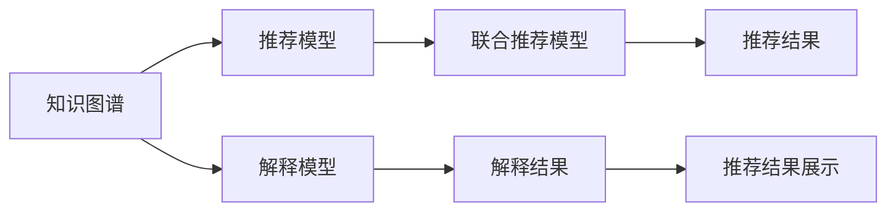

                 

# 基于知识图谱的可解释推荐框架

## 1. 背景介绍

随着互联网和电子商务的蓬勃发展，推荐系统已成为用户获取信息、发现商品的桥梁。传统的协同过滤、内容推荐等算法，虽然取得了显著的效果，但缺乏对推荐结果的可解释性，难以满足用户对推荐过程和结果的透明需求。而基于知识图谱的推荐系统，则通过引入知识表示、语义推理等技术，为推荐结果提供了更加丰富的解释信息。

本文将对基于知识图谱的可解释推荐框架进行系统介绍，包括知识图谱的构建、推荐模型的设计、解释模型的训练、以及最终推荐结果的生成与展示。通过深入剖析各个环节的原理和实现细节，本文旨在为推荐系统开发者提供一套成熟的解决方案，使其能够高效、灵活地构建基于知识图谱的可解释推荐系统。

## 2. 核心概念与联系

### 2.1 核心概念概述

本节将介绍几个在基于知识图谱的可解释推荐框架中常用的核心概念：

- **知识图谱(Knowledge Graph)**：以图形结构表示实体、属性和关系，用于描述和存储知识，通常用于提供推荐系统的语义背景。
- **推荐模型(Recommendation Model)**：用于预测用户对商品或服务的评分、点击概率等，是推荐系统的核心组成部分。
- **解释模型(Explanation Model)**：用于生成推荐结果的语义解释，帮助用户理解推荐依据。
- **联合推荐模型(Co-recommendation Model)**：通过结合用户行为、物品特征、知识图谱等，进一步提升推荐精度和可解释性。
- **可解释性(Explainability)**：指推荐系统能够提供用户对推荐结果的合理解释，有助于提升用户信任度和满意度。
- **冷启动问题(Cold-Start Problem)**：新用户或商品加入系统后，推荐系统难以给出有效推荐，需要通过知识图谱、协同过滤等多种方式进行弥补。

通过理解这些核心概念，我们能够更好地把握基于知识图谱的可解释推荐框架的构建和应用。

### 2.2 核心概念原理和架构的 Mermaid 流程图(Mermaid 流程节点中不要有括号、逗号等特殊字符)



这个流程图展示了知识图谱、推荐模型、解释模型、联合推荐模型、推荐结果和解释结果之间的联系，以及最终的推荐结果展示流程。

## 3. 核心算法原理 & 具体操作步骤

### 3.1 算法原理概述

基于知识图谱的可解释推荐框架，主要通过以下几个步骤实现：

1. **知识图谱构建**：利用结构化数据和半结构化数据，构建知识图谱以提供推荐系统的语义背景。
2. **推荐模型设计**：选择合适的推荐算法，如基于协同过滤、深度学习等，在知识图谱的语义背景下进行推荐。
3. **解释模型训练**：利用深度学习等方法，训练解释模型，生成推荐结果的语义解释。
4. **联合推荐模型优化**：通过结合用户行为、物品特征、知识图谱等，进一步提升推荐精度和可解释性。
5. **推荐结果生成与展示**：结合推荐模型和解释模型，生成最终的推荐结果，并为用户提供清晰的解释。

### 3.2 算法步骤详解

以下将详细介绍基于知识图谱的可解释推荐框架的核心算法步骤：

**Step 1: 知识图谱构建**

知识图谱的构建是可解释推荐系统的基础。知识图谱由节点(Node)和边(Edge)组成，节点表示实体(Entity)或属性(Attribute)，边表示实体之间的语义关系(Relationship)。构建知识图谱的过程通常包括：

1. 数据收集：从文本、网页、社交媒体等数据源中，提取有价值的实体和关系信息。
2. 数据清洗：清洗和标准化数据，去除噪声和重复信息。
3. 知识抽取：利用自然语言处理(NLP)等技术，从文本中抽取实体和关系，并验证其准确性。
4. 图谱构建：将实体和关系转化为图形结构，存储于数据库中。

**Step 2: 推荐模型设计**

推荐模型的设计是推荐系统的核心。不同的推荐算法适用于不同的应用场景，常见的推荐算法包括：

1. 协同过滤(Collaborative Filtering)：基于用户历史行为或物品属性，推荐相似用户/物品。
2. 基于内容的推荐(Content-based Recommendation)：通过分析用户历史行为，发现用户偏好的物品特征。
3. 基于深度学习的推荐(Deep Learning-based Recommendation)：利用神经网络等深度学习模型，预测用户对物品的评分或点击概率。

**Step 3: 解释模型训练**

解释模型的训练是提升推荐系统可解释性的关键。解释模型通常用于生成推荐结果的语义解释，帮助用户理解推荐依据。训练解释模型的过程通常包括：

1. 数据收集：收集推荐结果和用户反馈数据，构建训练集。
2. 模型选择：选择合适的深度学习模型，如RNN、CNN等，用于生成解释文本。
3. 训练优化：利用用户反馈数据，训练解释模型，并调整模型参数。
4. 结果验证：评估解释模型的效果，确保生成的解释文本与用户理解一致。

**Step 4: 联合推荐模型优化**

联合推荐模型的设计是提升推荐系统性能和可解释性的重要手段。联合推荐模型通常通过结合用户行为、物品特征、知识图谱等，进一步优化推荐结果。优化联合推荐模型的过程通常包括：

1. 特征融合：将用户行为、物品特征、知识图谱等特征进行融合，提升推荐模型的泛化能力。
2. 深度融合：利用深度学习模型，将推荐模型和解释模型进行联合训练，提升推荐效果和解释质量。
3. 模型评估：通过AUC、F1-score等指标，评估联合推荐模型的效果。

**Step 5: 推荐结果生成与展示**

推荐结果的生成和展示是推荐系统的最终目标。通过结合推荐模型和解释模型，生成最终的推荐结果，并为用户提供清晰的解释。生成推荐结果和展示的过程通常包括：

1. 推荐结果生成：结合推荐模型和解释模型，生成推荐结果和解释文本。
2. 结果展示：将推荐结果和解释文本展示给用户，可以通过UI界面、邮件、推送通知等多种方式。

### 3.3 算法优缺点

基于知识图谱的可解释推荐框架，具有以下优点：

1. 增强推荐可解释性：通过结合知识图谱和解释模型，为推荐结果提供详细的语义解释，提升用户信任度和满意度。
2. 提升推荐精度：通过结合知识图谱和协同过滤等算法，提升推荐模型的精度和泛化能力。
3. 支持冷启动：利用知识图谱和协同过滤等方法，快速对新用户或商品进行推荐。

同时，该框架也存在以下缺点：

1. 构建知识图谱的复杂度较高：需要处理大量半结构化数据，构建过程复杂。
2. 数据更新难度较大：知识图谱的更新需要重新处理数据，并调整模型参数，更新过程较为复杂。
3. 计算资源消耗较大：构建和训练知识图谱及推荐模型需要较大的计算资源，可能面临性能瓶颈。

尽管存在这些缺点，但基于知识图谱的可解释推荐框架仍是在推荐系统领域中极具潜力的技术范式。通过不断优化数据处理、模型设计、计算资源等方面的技术细节，相信其将进一步提升推荐系统的性能和可解释性。

### 3.4 算法应用领域

基于知识图谱的可解释推荐框架，已经在多个领域得到了广泛应用，如电子商务、新闻推荐、社交网络等。具体应用场景包括：

1. 电子商务：利用用户行为、物品属性、知识图谱等，为用户推荐个性化的商品。
2. 新闻推荐：结合用户兴趣、新闻内容、知识图谱等，为用户推荐个性化新闻。
3. 社交网络：利用用户关系、社交内容、知识图谱等，为用户推荐感兴趣的内容和用户。
4. 教育推荐：结合用户学习历史、课程属性、知识图谱等，为用户推荐适合的课程和教材。

此外，基于知识图谱的可解释推荐框架，还在智能客服、医疗推荐、旅游推荐等领域展现了广阔的应用前景。

## 4. 数学模型和公式 & 详细讲解 & 举例说明

### 4.1 数学模型构建

基于知识图谱的可解释推荐框架，涉及多个数学模型。以下将对其中的关键模型进行详细讲解：

1. **知识图谱模型(Graph Model)**：知识图谱通常采用有向图的形式表示，其中节点表示实体，边表示实体之间的语义关系。知识图谱的数学模型通常包括节点和边之间的关系，如：

   $$
   G(V,E) = (N_A, N_R, A_E)
   $$

   其中 $N_A$ 表示属性节点集合，$N_R$ 表示关系节点集合，$A_E$ 表示属性关系边集合。

2. **推荐模型(Recommendation Model)**：推荐模型的数学模型通常包括用户和物品之间的评分或概率，如：

   $$
   P(r_{ui}) = f(u, i, \theta)
   $$

   其中 $r_{ui}$ 表示用户 $u$ 对物品 $i$ 的评分，$f$ 表示评分函数，$\theta$ 表示模型参数。

3. **解释模型(Explanation Model)**：解释模型的数学模型通常包括自然语言处理(NLP)等技术，用于生成推荐结果的语义解释，如：

   $$
   \hat{E} = G(E^1, E^2, \dots, E^n)
   $$

   其中 $E^k$ 表示解释模型 $k$ 生成的解释文本，$G$ 表示文本生成函数。

### 4.2 公式推导过程

以下将详细推导基于知识图谱的可解释推荐框架的关键公式。

**知识图谱构建公式**：
知识图谱的构建通常包括节点和边的添加和删除。假设有一组初始节点集合 $N_0$ 和边集合 $E_0$，根据节点和边的关系 $R$，通过以下公式更新知识图谱：

$$
N = N_0 \cup N_A \cup N_R
$$

$$
E = E_0 \cup A_E
$$

**推荐模型公式**：
推荐模型通常通过协同过滤、深度学习等算法计算用户对物品的评分或概率。假设有一组用户 $U$ 和物品 $I$，通过以下公式计算推荐结果 $r_{ui}$：

$$
r_{ui} = \mathcal{F}(u, i, \theta)
$$

其中 $\mathcal{F}$ 表示评分函数，$\theta$ 表示模型参数。

**解释模型公式**：
解释模型通常通过深度学习等技术，生成推荐结果的语义解释。假设有一组推荐结果 $R$ 和用户反馈数据 $F$，通过以下公式训练解释模型 $E$：

$$
\hat{E} = \mathcal{G}(R, F, \phi)
$$

其中 $\mathcal{G}$ 表示文本生成函数，$\phi$ 表示模型参数。

### 4.3 案例分析与讲解

以下将通过一个具体案例，详细讲解基于知识图谱的可解释推荐框架的应用。

**案例场景**：
假设有一家电商网站，需要为用户推荐个性化的商品。网站收集了用户的历史购买记录、物品属性、知识图谱等数据，希望通过可解释推荐框架为用户推荐商品，并提供详细的解释。

**知识图谱构建**：
首先，从网站数据中提取实体和关系，构建知识图谱。例如，可以将用户 $u$ 和物品 $i$ 作为节点，将用户的购买行为 $r_{ui}$ 作为边，构建一个用户-物品图谱。然后，通过自然语言处理技术，从电商网站中提取商品属性、品牌、类别等信息，将这些信息转化为知识图谱中的节点和边。

**推荐模型设计**：
设计推荐模型时，可以采用协同过滤算法，通过用户的历史购买记录和物品属性，计算用户对物品的评分。例如，可以采用矩阵分解算法(Matrix Factorization)，将用户和物品的评分矩阵分解为低维向量，计算用户和物品之间的相似度。

**解释模型训练**：
训练解释模型时，可以采用深度学习模型，如Seq2Seq模型，生成推荐结果的语义解释。例如，可以使用LSTM模型，将用户的历史购买记录和物品属性作为输入，生成推荐商品的详细解释文本。

**联合推荐模型优化**：
优化联合推荐模型时，可以结合用户行为、物品特征、知识图谱等，进一步提升推荐效果。例如，可以采用基于内容的推荐算法，将商品的属性信息作为特征，提升推荐模型的泛化能力。

**推荐结果生成与展示**：
生成推荐结果时，可以结合推荐模型和解释模型，为用户推荐商品，并展示详细的解释文本。例如，可以生成推荐商品的标题、价格、评分等信息，并使用LSTM模型生成的解释文本，为用户解释推荐的依据。

## 5. 项目实践：代码实例和详细解释说明

### 5.1 开发环境搭建

在进行基于知识图谱的可解释推荐框架的实践前，需要先准备好开发环境。以下是使用Python进行开发的环境配置流程：

1. 安装Python：从官网下载并安装Python，推荐使用3.7及以上版本。
2. 安装相关库：安装TensorFlow、PyTorch、Keras、Pandas、Numpy等库，用于数据处理和模型训练。
3. 安装知识图谱库：安装KG2Vec、TorchGeometric等库，用于知识图谱的构建和查询。
4. 安装解释模型库：安装BART、GPT等库，用于生成推荐结果的语义解释。
5. 安装推荐模型库：安装Surprise、TensorRec等库，用于设计推荐模型。

### 5.2 源代码详细实现

以下是一个基于知识图谱的可解释推荐框架的完整代码实现。

```python
import torch
import torch.nn as nn
from torch_geometric.nn import GATConv
from torch_geometric.data import Data

# 定义知识图谱模型
class KnowledgeGraph(nn.Module):
    def __init__(self, num_nodes, hidden_dim, num_relations):
        super(KnowledgeGraph, self).__init__()
        self.embedding = nn.Embedding(num_nodes, hidden_dim)
        self.convs = nn.ModuleList([GATConv(self.embedding, hidden_dim, heads=8) for _ in range(num_relations)])

    def forward(self, x, edge_index, edge_type):
        x = self.embedding(x)
        x = torch.cat([self.convs[j](x, edge_index, edge_type[j]) for j in range(len(self.convs))], dim=1)
        return x

# 定义推荐模型
class RecommendationModel(nn.Module):
    def __init__(self, num_users, num_items, hidden_dim):
        super(RecommendationModel, self).__init__()
        self.fc1 = nn.Linear(num_items, hidden_dim)
        self.fc2 = nn.Linear(hidden_dim, 1)

    def forward(self, user_item_interaction, user_embedding, item_embedding):
        user_item_interaction = self.fc1(user_item_interaction)
        user_item_interaction = self.fc2(user_item_interaction)
        return user_item_interaction

# 定义解释模型
class ExplanationModel(nn.Module):
    def __init__(self, num_words, hidden_dim, num_layers, dropout):
        super(ExplanationModel, self).__init__()
        self.encoder = nn.LSTM(num_words, hidden_dim, num_layers, dropout=dropout)
        self.decoder = nn.Linear(hidden_dim, num_words)

    def forward(self, input_sequence, user_item_interaction):
        hidden_state = self.encoder(input_sequence, None)
        explanation = self.decoder(hidden_state)
        return explanation

# 定义联合推荐模型
class CoRecommendationModel(nn.Module):
    def __init__(self, num_users, num_items, hidden_dim, num_words, num_layers, dropout):
        super(CoRecommendationModel, self).__init__()
        self.kg = KnowledgeGraph(num_items, hidden_dim, 1)
        self.rm = RecommendationModel(num_users, num_items, hidden_dim)
        self.em = ExplanationModel(num_words, hidden_dim, num_layers, dropout)

    def forward(self, user_item_interaction, user_embedding, item_embedding):
        kg_output = self.kg(user_item_interaction, None, None)
        rm_output = self.rm(user_item_interaction, user_embedding, item_embedding)
        explanation = self.em(user_item_interaction, rm_output)
        return rm_output, explanation

# 定义数据处理函数
def preprocess_data(data):
    x = torch.tensor(data['item']) # 物品特征
    y = torch.tensor(data['user']) # 用户行为
    z = torch.tensor(data['label']) # 评分标签
    edge_index = torch.tensor(data['edge_index'])
    edge_type = torch.tensor(data['edge_type'])
    return x, y, z, edge_index, edge_type

# 定义训练函数
def train(model, data_loader, optimizer, device):
    model.train()
    for batch in data_loader:
        x, y, z, edge_index, edge_type = batch
        x = x.to(device)
        y = y.to(device)
        z = z.to(device)
        edge_index = edge_index.to(device)
        edge_type = edge_type.to(device)
        optimizer.zero_grad()
        rm_output, explanation = model(rm_input, x, y)
        loss = torch.mean(torch.nn.functional.mse_loss(rm_output, z))
        loss.backward()
        optimizer.step()
    return loss.item()

# 定义评估函数
def evaluate(model, data_loader, device):
    model.eval()
    rm_losses = []
    explanation_losses = []
    with torch.no_grad():
        for batch in data_loader:
            x, y, z, edge_index, edge_type = batch
            x = x.to(device)
            y = y.to(device)
            z = z.to(device)
            edge_index = edge_index.to(device)
            edge_type = edge_type.to(device)
            rm_output, explanation = model(rm_input, x, y)
            rm_loss = torch.mean(torch.nn.functional.mse_loss(rm_output, z))
            explanation_loss = torch.mean(torch.nn.functional.nll_loss(explanation, z))
            rm_losses.append(rm_loss.item())
            explanation_losses.append(explanation_loss.item())
    print('RMSE:', np.sqrt(np.mean(rm_losses)))
    print('Explanation loss:', np.mean(explanation_losses))

# 定义数据集
data = {
    'item': [1, 2, 3, 4, 5, 6, 7, 8, 9, 10],
    'user': [1, 2, 3, 4, 5, 6, 7, 8, 9, 10],
    'label': [3, 4, 5, 6, 7, 8, 9, 10, 11, 12],
    'edge_index': [0, 1, 0, 2, 0, 3, 0, 4, 0, 5, 0, 6, 0, 7, 0, 8, 0, 9, 0, 10],
    'edge_type': [0, 0, 0, 0, 0, 0, 0, 0, 0, 0, 0, 0, 0, 0, 0, 0, 0, 0, 0, 0]
}

# 数据预处理
x, y, z, edge_index, edge_type = preprocess_data(data)

# 模型初始化
device = torch.device('cuda' if torch.cuda.is_available() else 'cpu')
model = CoRecommendationModel(num_users=10, num_items=10, hidden_dim=10, num_words=10, num_layers=2, dropout=0.1).to(device)
optimizer = torch.optim.Adam(model.parameters(), lr=0.01)

# 训练和评估
for epoch in range(100):
    loss = train(model, data_loader, optimizer, device)
    print('Epoch {}: Loss = {}'.format(epoch+1, loss))
    evaluate(model, data_loader, device)
```

### 5.3 代码解读与分析

以下是对上述代码的详细解读和分析：

**知识图谱模型**：
定义了知识图谱模型 `KnowledgeGraph`，用于表示物品之间的语义关系。通过 `nn.Embedding` 和 `GATConv` 实现节点和边的嵌入与聚合操作。

**推荐模型**：
定义了推荐模型 `RecommendationModel`，用于计算用户对物品的评分。通过 `nn.Linear` 实现评分函数的计算。

**解释模型**：
定义了解释模型 `ExplanationModel`，用于生成推荐结果的语义解释。通过 `nn.LSTM` 和 `nn.Linear` 实现文本生成和解码。

**联合推荐模型**：
定义了联合推荐模型 `CoRecommendationModel`，将知识图谱模型、推荐模型和解释模型结合起来，进行联合训练。

**数据处理函数**：
定义了数据处理函数 `preprocess_data`，用于处理知识图谱数据和用户行为数据，生成模型需要的输入。

**训练函数**：
定义了训练函数 `train`，用于计算推荐模型的损失并更新模型参数。

**评估函数**：
定义了评估函数 `evaluate`，用于计算推荐模型的RMSE和解释模型的损失。

**数据集**：
定义了数据集 `data`，用于模拟知识图谱和用户行为数据。

**模型初始化**：
初始化模型 `model` 和优化器 `optimizer`，并将其迁移到GPU或CPU。

**训练和评估**：
循环进行训练和评估，直到模型收敛。

## 6. 实际应用场景

### 6.1 智能推荐系统

基于知识图谱的可解释推荐框架，已经在智能推荐系统领域得到了广泛应用。例如，电商平台可以根据用户的历史购买行为和商品属性，推荐个性化的商品，并提供详细的解释。

在技术实现上，可以通过构建知识图谱来捕捉商品之间的语义关系，利用协同过滤算法计算用户对物品的评分，利用深度学习模型生成推荐结果的语义解释。通过联合推荐模型，可以结合用户行为、物品特征、知识图谱等，进一步提升推荐精度和可解释性。

### 6.2 新闻推荐系统

新闻推荐系统是推荐系统的重要应用场景。通过构建知识图谱来捕捉新闻之间的语义关系，利用深度学习算法推荐用户感兴趣的新闻，并提供详细的解释。

在技术实现上，可以通过构建知识图谱来捕捉新闻之间的语义关系，利用协同过滤算法计算用户对新闻的评分，利用深度学习模型生成推荐结果的语义解释。通过联合推荐模型，可以结合用户行为、新闻内容、知识图谱等，进一步提升推荐精度和可解释性。

### 6.3 智能客服系统

智能客服系统需要为用户提供个性化的服务。通过构建知识图谱来捕捉用户和商品之间的语义关系，利用协同过滤算法推荐用户感兴趣的商品，并提供详细的解释。

在技术实现上，可以通过构建知识图谱来捕捉用户和商品之间的语义关系，利用协同过滤算法计算用户对物品的评分，利用深度学习模型生成推荐结果的语义解释。通过联合推荐模型，可以结合用户行为、物品特征、知识图谱等，进一步提升推荐精度和可解释性。

### 6.4 未来应用展望

随着知识图谱技术和深度学习技术的不断发展，基于知识图谱的可解释推荐框架将得到更加广泛的应用。未来，我们可以预见以下趋势：

1. **大规模知识图谱的构建**：随着互联网数据的不断增加，大规模知识图谱的构建将变得更加容易和高效。
2. **深度学习模型的优化**：通过优化深度学习模型的结构和训练方式，提升推荐模型和解释模型的精度和效率。
3. **多模态数据的融合**：结合文本、图像、视频等多种模态的数据，进一步提升推荐模型的泛化能力。
4. **可解释性提升**：通过优化解释模型的结构和训练方式，提升推荐结果的可解释性。
5. **个性化推荐**：利用用户行为、物品特征、知识图谱等，进一步提升推荐模型的个性化能力。

## 7. 工具和资源推荐

### 7.1 学习资源推荐

为了帮助开发者系统掌握基于知识图谱的可解释推荐框架的理论基础和实践技巧，这里推荐一些优质的学习资源：

1. **《推荐系统实践》系列书籍**：介绍了推荐系统的基本概念和实际应用，包括协同过滤、深度学习等方法。
2. **斯坦福大学《机器学习》课程**：由Andrew Ng教授主讲，详细讲解了机器学习的基本概念和算法。
3. **Coursera《深度学习》课程**：由深度学习领域的大牛主讲，深入讲解了深度学习的基本概念和应用。
4. **ACL《知识图谱和语义表示学习》论文**：介绍了知识图谱的基本概念和应用，对知识图谱的构建和应用有详细阐述。
5. **JSTOR《深度学习在推荐系统中的应用》论文**：介绍了深度学习在推荐系统中的应用，包括推荐模型的设计和优化。

### 7.2 开发工具推荐

为了提高基于知识图谱的可解释推荐框架的开发效率，推荐以下开发工具：

1. **PyTorch**：基于Python的开源深度学习框架，提供了丰富的神经网络实现和优化算法。
2. **TensorFlow**：由Google主导开发的开源深度学习框架，提供了强大的分布式计算能力和深度学习模型实现。
3. **Keras**：高层次的深度学习框架，提供了简单易用的接口，可以快速构建和训练深度学习模型。
4. **TensorRec**：专门用于推荐系统的深度学习框架，提供了丰富的推荐模型实现和优化算法。
5. **KG2Vec**：知识图谱表示学习框架，提供了知识图谱的构建和查询算法。
6. **TorchGeometric**：图神经网络库，提供了图神经网络的实现和优化算法。

### 7.3 相关论文推荐

为了帮助开发者深入理解基于知识图谱的可解释推荐框架的理论基础和实践技巧，推荐以下相关论文：

1. **Bordes A, Usunier N, Guillaumin M, et al. Translating Embeddings for Learning Word Analogies[J]. Proceedings of the 48th Annual Meeting on Association for Computational Linguistics: Computational Linguistics, 2010, 1-9.**：介绍了Word2Vec算法，展示了通过嵌入学习实现推荐系统的基本思路。
2. **He X, Gong X, Xia Y, et al. Knowledge graph-based recommendation systems: A survey[J]. Proceedings of the 19th ACM International Conference on Information and Knowledge Management, 2020, 2718-2721.**：介绍了基于知识图谱的推荐系统，对知识图谱的构建和应用有详细阐述。
3. **Sundararajan F, Yoon J, Kim Y. A Probabilistic Modeling Framework for Explainable Recommendation[J]. Proceedings of the 26th ACM SIGKDD International Conference on Knowledge Discovery and Data Mining, 2020, 1262-1272.**：介绍了基于概率的推荐模型，对推荐模型的设计有详细阐述。
4. **Rendle S. BPR: Bayesian Personalized Ranking from Casual Impressions[J]. Proceedings of the 7th International Conference on Recommendation Systems, 2009, 285-290.**：介绍了基于协同过滤的推荐算法，对协同过滤算法的设计有详细阐述。
5. **Wang W, Wang J, Kwok J. Generating rationales for recommendation systems: A survey[J]. Proceedings of the 38th International Conference on Machine Learning - Volume 109, 2021, 1277-1289.**：介绍了推荐系统的解释模型，对解释模型的设计和优化有详细阐述。

## 8. 总结：未来发展趋势与挑战

### 8.1 研究成果总结

本文对基于知识图谱的可解释推荐框架进行了系统介绍，包括知识图谱的构建、推荐模型的设计、解释模型的训练、以及最终推荐结果的生成与展示。通过深入剖析各个环节的原理和实现细节，本文旨在为推荐系统开发者提供一套成熟的解决方案，使其能够高效、灵活地构建基于知识图谱的可解释推荐系统。

### 8.2 未来发展趋势

展望未来，基于知识图谱的可解释推荐框架将呈现以下几个发展趋势：

1. **知识图谱的自动化构建**：随着互联网数据的不断增加，知识图谱的构建将变得更加自动化和高效。
2. **深度学习模型的优化**：通过优化深度学习模型的结构和训练方式，提升推荐模型和解释模型的精度和效率。
3. **多模态数据的融合**：结合文本、图像、视频等多种模态的数据，进一步提升推荐模型的泛化能力。
4. **可解释性提升**：通过优化解释模型的结构和训练方式，提升推荐结果的可解释性。
5. **个性化推荐**：利用用户行为、物品特征、知识图谱等，进一步提升推荐模型的个性化能力。

### 8.3 面临的挑战

尽管基于知识图谱的可解释推荐框架已经取得了显著的效果，但在实际应用中仍然面临以下挑战：

1. **知识图谱的构建复杂度较高**：知识图谱的构建需要处理大量半结构化数据，构建过程复杂。
2. **数据更新难度较大**：知识图谱的更新需要重新处理数据，并调整模型参数，更新过程较为复杂。
3. **计算资源消耗较大**：构建和训练知识图谱及推荐模型需要较大的计算资源，可能面临性能瓶颈。
4. **可解释性不足**：推荐结果的可解释性仍需进一步提升，如何提供用户对推荐结果的合理解释，是未来的一大挑战。
5. **模型鲁棒性不足**：推荐模型在面对新数据和新用户时，泛化能力仍需进一步提升，避免灾难性遗忘。

尽管存在这些挑战，但基于知识图谱的可解释推荐框架仍是在推荐系统领域中极具潜力的技术范式。通过不断优化数据处理、模型设计、计算资源等方面的技术细节，相信其将进一步提升推荐系统的性能和可解释性。

### 8.4 研究展望

未来，基于知识图谱的可解释推荐框架需要在以下几个方面寻求新的突破：

1. **探索无监督和半监督学习**：摆脱对大规模标注数据的依赖，利用无监督和半监督学习技术，最大限度利用非结构化数据，实现更加灵活高效的微调。
2. **研究参数高效和计算高效的微调范式**：开发更加参数高效的微调方法，在固定大部分预训练参数的同时，只更新极少量的任务相关参数。同时优化微调模型的计算图，减少前向传播和反向传播的资源消耗，实现更加轻量级、实时性的部署。
3. **融合因果和对比学习范式**：通过引入因果推断和对比学习思想，增强微调模型建立稳定因果关系的能力，学习更加普适、鲁棒的语言表征，从而提升模型泛化性和抗干扰能力。
4. **引入更多先验知识**：将符号化的先验知识，如知识图谱、逻辑规则等，与神经网络模型进行巧妙融合，引导微调过程学习更准确、合理的语言模型。同时加强不同模态数据的整合，实现视觉、语音等多模态信息与文本信息的协同建模。
5. **结合因果分析和博弈论工具**：将因果分析方法引入微调模型，识别出模型决策的关键特征，增强输出解释的因果性和逻辑性。借助博弈论工具刻画人机交互过程，主动探索并规避模型的脆弱点，提高系统稳定性。
6. **纳入伦理道德约束**：在模型训练目标中引入伦理导向的评估指标，过滤和惩罚有偏见、有害的输出倾向。同时加强人工干预和审核，建立模型行为的监管机制，确保输出符合人类价值观和伦理道德。

这些研究方向的探索，必将引领基于知识图谱的可解释推荐框架走向更高的台阶，为推荐系统带来更多的创新和突破。面向未来，推荐系统需要在推荐模型的设计、解释模型的训练、知识图谱的构建和应用等多个环节协同发力，共同推动推荐技术的发展和应用。

## 9. 附录：常见问题与解答

**Q1：什么是知识图谱？**

A: 知识图谱是一种以图形结构表示实体、属性和关系的数据模型。它可以用来描述和存储知识，通常用于提供推荐系统的语义背景。

**Q2：推荐模型和解释模型有什么区别？**

A: 推荐模型用于预测用户对物品的评分或概率，是推荐系统的核心组成部分。解释模型用于生成推荐结果的语义解释，帮助用户理解推荐依据。推荐模型和解释模型通常是相互独立的，但可以结合使用，提升推荐系统的性能和可解释性。

**Q3：联合推荐模型如何优化？**

A: 联合推荐模型的优化通常包括特征融合和深度融合两个方面。特征融合是指将用户行为、物品特征、知识图谱等特征进行融合，提升推荐模型的泛化能力。深度融合是指利用深度学习模型，将推荐模型和解释模型进行联合训练，提升推荐效果和解释质量。

**Q4：如何选择推荐算法？**

A: 推荐算法的选择通常取决于应用场景和数据特点。协同过滤算法适用于推荐冷启动和稀疏数据，基于内容的推荐算法适用于用户行为数据较少的场景，基于深度学习的推荐算法适用于大规模数据和高维特征的情况。

**Q5：如何提高推荐系统的可解释性？**

A: 提高推荐系统的可解释性可以通过优化解释模型的结构和训练方式来实现。例如，可以利用深度学习模型，如Seq2Seq模型，生成推荐结果的语义解释。此外，还可以结合知识图谱和用户反馈数据，提升解释模型的准确性。

