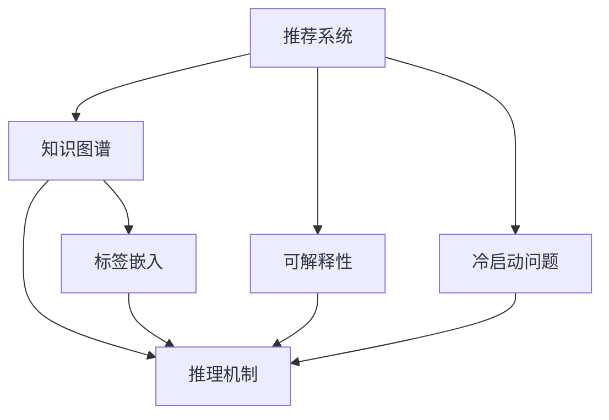

                 

# 基于知识图谱的可解释推荐系统设计

## 1. 背景介绍

推荐系统在当今数字化时代扮演着至关重要的角色，广泛应用于电商、社交网络、视频网站等众多领域。传统的推荐算法如协同过滤、基于内容的推荐等，在用户行为数据不足的情况下，容易陷入冷启动问题。此外，随着用户对个性化推荐需求的不断提升，推荐系统不仅需要提供精准的推荐，还需要具备可解释性，使用户理解和信任推荐结果。知识图谱(Knowledge Graph, KG)作为一种结构化的知识表示方式，近年来被引入推荐系统，结合推理机制、标签嵌入等技术手段，成功提升了推荐系统的可解释性和推荐精度，成为推荐系统领域的新热点。

本博客将详细探讨基于知识图谱的可解释推荐系统，分析其工作原理和设计思路，并提出具有可解释性的推荐算法和架构设计。通过深入理解知识图谱与推荐系统的融合，探讨其在现实世界的应用前景，帮助读者掌握知识图谱在推荐系统中的应用技能，激发更多创新思路。

## 2. 核心概念与联系

### 2.1 核心概念概述

为更好地理解基于知识图谱的可解释推荐系统，本节将介绍几个核心概念：

- **推荐系统(Recommender System)**：通过分析用户行为数据和物品属性信息，预测用户对物品的喜好程度，从而为用户推荐感兴趣的物品。推荐系统分为基于内容的推荐、协同过滤、混合推荐等不同类别，其中基于协同过滤的推荐系统在应用最广泛。

- **知识图谱(Knowledge Graph, KG)**：由节点和边构成的图结构，用于表示实体与实体间的关系和属性信息。知识图谱广泛应用于搜索引擎、问答系统、推荐系统等领域，能够提供精确的结构化知识查询和推理。

- **标签嵌入(Label Embedding)**：将实体的属性信息映射到低维向量空间，使得机器可以理解和处理。在知识图谱推荐系统中，标签嵌入是实现知识推理、召回和排序等任务的基础。

- **推理机制(Reasoning Mechanism)**：基于知识图谱的推荐系统通常引入图神经网络(Graph Neural Network, GNN)等模型，通过图结构和标签嵌入进行深度学习，挖掘知识图谱中隐含的推理关系。

- **可解释性(Explainability)**：推荐系统需要提供清晰的推荐理由，帮助用户理解推荐的依据，增强用户信任感和接受度。

- **冷启动问题(Cold Start Problem)**：传统推荐系统在面对新用户或新物品时，缺乏足够行为数据，难以进行推荐。知识图谱可以通过结构化知识进行推荐，缓解冷启动问题。

这些核心概念之间的逻辑关系可以通过以下Mermaid流程图来展示：



这个流程图展示的知识图谱推荐系统的核心概念及其之间的关系：

1. 推荐系统通过知识图谱进行推荐。
2. 知识图谱中包含实体的属性和关系信息，通过标签嵌入进行编码。
3. 推理机制通过图神经网络等模型对知识图谱进行学习和推理，提供推荐依据。
4. 可解释性通过推理过程的可视化等手段，帮助用户理解推荐结果。
5. 冷启动问题可以通过知识图谱的结构化信息得到缓解。

这些概念共同构成了知识图谱在推荐系统中的应用框架，使得推荐系统能够更好地理解复杂的实体关系和知识结构，提供具有可解释性的推荐结果。

## 3. 核心算法原理 & 具体操作步骤

### 3.1 算法原理概述

基于知识图谱的可解释推荐系统，本质上是一个结合了知识图谱和推荐系统的混合系统。其核心思想是：利用知识图谱中的结构化知识，对用户的兴趣偏好和物品的属性信息进行推理，从而提供具有解释性的推荐结果。

假设知识图谱中包含了用户实体$u$和物品实体$i$，以及他们之间的隐含关系$R$和属性$A$。则推荐系统的目标是预测用户对物品的评分$P(u,i)$，基于用户的历史行为、物品属性等信息，利用推理机制进行计算。

形式化地，假设推荐模型的输出为$P(u,i)$，训练集为$\{(u_i,i_j,P_{i_j}^{(u_i)})\}_{i,j=1}^N$，其中$P_{i_j}^{(u_i)}$表示用户$u_i$对物品$i_j$的评分。则推荐系统的损失函数定义为：

$$
\mathcal{L}(P) = \frac{1}{N}\sum_{i,j} \mathcal{L}(P_{i_j}^{(u_i)},P(u_i,i_j))
$$

其中$\mathcal{L}$为常用的损失函数，如均方误差损失、交叉熵损失等。推荐系统的优化目标是最小化损失函数$\mathcal{L}(P)$，即找到最优的评分预测模型$P$。

在模型训练时，知识图谱中的实体关系和属性信息通过标签嵌入$\overrightarrow{e}$进行编码。推理机制通常采用图神经网络，对知识图谱进行学习，提取关系和属性信息之间的隐含语义。

### 3.2 算法步骤详解

基于知识图谱的可解释推荐系统通常包括以下几个关键步骤：

**Step 1: 构建知识图谱**
- 收集和整理领域知识，构建结构化的知识图谱。可以使用Wikidata、DBpedia等公开数据集，或者通过爬虫从Web页面提取结构化信息。

**Step 2: 标签嵌入**
- 选择合适的方法将知识图谱中的实体和关系进行编码。常用的方法包括TransE、DistMult等。通过标签嵌入将实体和关系映射到低维向量空间，便于模型进行学习。

**Step 3: 图神经网络训练**
- 选择合适的网络结构进行图神经网络的训练。常用的方法包括GAT、GCN、GraphSAGE等。使用图神经网络对知识图谱进行深度学习，挖掘实体之间的关系和属性信息之间的隐含语义。

**Step 4: 推荐计算**
- 利用图神经网络的输出，结合用户行为信息等，计算推荐评分。一般包括召回、排序等步骤。

**Step 5: 可解释性输出**
- 结合推理机制，对推荐结果进行可视化，提供清晰的推荐理由。可以通过解释器、交互界面等方式，展示推荐依据。

**Step 6: 模型评估**
- 在测试集上评估推荐模型的性能，如准确率、召回率、F1分数等指标。通过实际数据验证模型效果，持续优化。

以上是基于知识图谱的可解释推荐系统的一般流程。在实际应用中，还需要针对具体任务的特点，对每个环节进行优化设计，如改进图神经网络结构，引入更多的正则化技术，搜索最优的超参数组合等，以进一步提升推荐模型的性能。

### 3.3 算法优缺点

基于知识图谱的可解释推荐系统具有以下优点：
1. 结合知识图谱的结构化信息，提升推荐的准确性和可解释性。
2. 知识图谱中的先验知识能够缓解冷启动问题，使得新用户或新物品也能得到推荐。
3. 知识图谱中的推理机制，可以发现新的关系和属性信息，扩展推荐模型的知识域。
4. 通过可解释性输出，提升用户对推荐结果的信任度，增强用户黏性。

同时，该方法也存在一定的局限性：
1. 知识图谱构建和维护成本较高，获取高质量的图谱数据需要大量人力物力。
2. 知识图谱中存在实体关系缺失、噪声等问题，可能影响推荐结果的准确性。
3. 知识图谱的推理过程复杂，计算成本较高。
4. 知识图谱的应用需要领域知识的支持，对于某些领域，可能缺乏足够的结构化数据。
5. 推理机制的复杂性，使得模型难以解释和调试。

尽管存在这些局限性，但就目前而言，基于知识图谱的可解释推荐方法仍是大规模推荐系统的重要组成部分，具有显著的实际应用前景。

### 3.4 算法应用领域

基于知识图谱的可解释推荐系统已经在多个领域得到了广泛的应用，例如：

- 电商推荐：通过分析用户的浏览、点击、购买行为，结合商品属性、类别等知识图谱信息，为用户推荐合适的商品。
- 视频推荐：利用电影、电视剧等视频的信息，结合用户历史观看记录和标签，推荐感兴趣的影视作品。
- 社交网络：推荐好友、群组的发现，用户兴趣标签的关联推荐等。
- 新闻推荐：利用新闻的主题、发布时间等信息，结合用户兴趣，推荐相关新闻文章。
- 旅游推荐：根据旅游地点、旅游时间等信息，结合用户偏好，推荐旅游路线和景点。

除了上述这些经典应用外，知识图谱推荐技术也被创新性地应用于智慧城市、智能家居、金融服务等多个领域，为推荐系统带来了新的突破。随着知识图谱构建技术的不断成熟，相信知识图谱推荐技术将在更广阔的应用领域大放异彩。

## 4. 数学模型和公式 & 详细讲解 & 举例说明

### 4.1 数学模型构建

本节将使用数学语言对基于知识图谱的可解释推荐系统进行更加严格的刻画。

假设知识图谱中包含$N$个实体$e_v$，$E$条边$e_e$，以及$D$个属性$e_a$。则知识图谱的邻接矩阵$A$表示为：

$$
A = \{(a_{ij})\}_{i,j=1}^N
$$

其中$a_{ij}=1$表示实体$i$和实体$j$之间存在一条边。实体的属性信息$A_v$表示为：

$$
A_v = \{(a_{vi})\}_{i=1}^D
$$

其中$a_{vi}$表示实体$i$的属性值。标签嵌入$\overrightarrow{e}$表示为：

$$
\overrightarrow{e} = \{\overrightarrow{e}_e,\overrightarrow{e}_v,\overrightarrow{e}_a\}
$$

其中$\overrightarrow{e}_e$表示边实体嵌入，$\overrightarrow{e}_v$表示节点实体嵌入，$\overrightarrow{e}_a$表示属性实体嵌入。

推荐模型的输出$P$表示为：

$$
P = \{\overrightarrow{p}_e,\overrightarrow{p}_v,\overrightarrow{p}_a\}
$$

其中$\overrightarrow{p}_e$表示边实体预测，$\overrightarrow{p}_v$表示节点实体预测，$\overrightarrow{p}_a$表示属性实体预测。

推荐系统的损失函数$\mathcal{L}(P)$表示为：

$$
\mathcal{L}(P) = \frac{1}{N}\sum_{i,j} \mathcal{L}(P_{i_j}^{(u_i)},\overrightarrow{p}_e^{(u_i,i_j)})
$$

其中$\mathcal{L}$为常用的损失函数，如均方误差损失、交叉熵损失等。

### 4.2 公式推导过程

以下我们以二分类任务为例，推导推荐模型的训练损失函数及其梯度计算公式。

假设用户实体$u$和物品实体$i$之间的推荐评分$P_{i_j}^{(u_i)}$为$y$，则推荐模型的输出$\overrightarrow{p}_e^{(u_i,i_j)}$为：

$$
\overrightarrow{p}_e^{(u_i,i_j)} = \{\overrightarrow{p}_{ij}^{(u_i)}\}
$$

其中$\overrightarrow{p}_{ij}^{(u_i)}$表示实体$i$和$j$之间的推荐评分预测。假设采用线性关系表示推荐评分预测，则：

$$
\overrightarrow{p}_{ij}^{(u_i)} = W_{ij}\overrightarrow{e}_i + b_{ij}
$$

其中$W_{ij}$和$b_{ij}$为训练得到的权重和偏置。则推荐模型的损失函数可以表示为：

$$
\mathcal{L}(P) = \frac{1}{N}\sum_{i,j} \mathcal{L}(y,\overrightarrow{p}_{ij}^{(u_i)})
$$

其中$\mathcal{L}$为常用的损失函数，如均方误差损失、交叉熵损失等。

根据链式法则，损失函数对参数的梯度计算公式为：

$$
\frac{\partial \mathcal{L}(P)}{\partial \theta} = \frac{1}{N}\sum_{i,j} \frac{\partial \mathcal{L}(y,\overrightarrow{p}_{ij}^{(u_i)})}{\partial \theta}
$$

其中$\theta$为模型的可训练参数，包括$W_{ij}$和$b_{ij}$等。

通过求解上述梯度公式，可以使用梯度下降等优化算法，最小化损失函数$\mathcal{L}(P)$，从而得到最优的推荐模型$P$。

### 4.3 案例分析与讲解

**案例1: 电商推荐系统**

电商推荐系统通常需要结合用户的浏览、点击、购买行为，结合商品的属性信息进行推荐。假设用户实体$u$和物品实体$i$之间的推荐评分$P_{i_j}^{(u_i)}$为$y$，则推荐模型的输出$\overrightarrow{p}_e^{(u_i,i_j)}$可以表示为：

$$
\overrightarrow{p}_e^{(u_i,i_j)} = W_{ij}\overrightarrow{e}_i + b_{ij} + W_a\overrightarrow{e}_a^{(i)} + b_a
$$

其中$W_a$和$b_a$为物品属性嵌入的权重和偏置。假设采用二分类任务，则推荐模型的损失函数可以表示为：

$$
\mathcal{L}(P) = \frac{1}{N}\sum_{i,j} \mathcal{L}(y,\overrightarrow{p}_e^{(u_i,i_j)})
$$

其中$\mathcal{L}$为二分类交叉熵损失。

通过上述推导，可以看出，电商推荐系统中的推荐评分预测，不仅依赖于用户和物品之间的直接关联，还考虑了物品的属性信息，能够提供更精准的推荐。

**案例2: 视频推荐系统**

视频推荐系统通常需要结合用户的观看记录，结合视频的主题、发布时间等信息进行推荐。假设用户实体$u$和物品实体$i$之间的推荐评分$P_{i_j}^{(u_i)}$为$y$，则推荐模型的输出$\overrightarrow{p}_e^{(u_i,i_j)}$可以表示为：

$$
\overrightarrow{p}_e^{(u_i,i_j)} = W_{ij}\overrightarrow{e}_i + b_{ij} + W_t\overrightarrow{e}_t^{(i)} + b_t
$$

其中$W_t$和$b_t$为视频主题嵌入的权重和偏置。假设采用二分类任务，则推荐模型的损失函数可以表示为：

$$
\mathcal{L}(P) = \frac{1}{N}\sum_{i,j} \mathcal{L}(y,\overrightarrow{p}_e^{(u_i,i_j)})
$$

其中$\mathcal{L}$为二分类交叉熵损失。

通过上述推导，可以看出，视频推荐系统中的推荐评分预测，不仅依赖于用户和物品之间的直接关联，还考虑了视频的主题信息，能够提供更符合用户兴趣的推荐。

## 5. 项目实践：代码实例和详细解释说明

### 5.1 开发环境搭建

在进行推荐系统开发前，我们需要准备好开发环境。以下是使用Python进行PyTorch开发的环境配置流程：

1. 安装Anaconda：从官网下载并安装Anaconda，用于创建独立的Python环境。

2. 创建并激活虚拟环境：
```bash
conda create -n pytorch-env python=3.8 
conda activate pytorch-env
```

3. 安装PyTorch：根据CUDA版本，从官网获取对应的安装命令。例如：
```bash
conda install pytorch torchvision torchaudio cudatoolkit=11.1 -c pytorch -c conda-forge
```

4. 安装TensorBoard：用于可视化模型的训练过程和评估结果。

5. 安装各类工具包：
```bash
pip install numpy pandas scikit-learn matplotlib tqdm jupyter notebook ipython
```

完成上述步骤后，即可在`pytorch-env`环境中开始推荐系统开发。

### 5.2 源代码详细实现

下面我们以电商推荐系统为例，给出使用PyTorch对知识图谱进行推荐计算的PyTorch代码实现。

首先，定义知识图谱的实体和边信息：

```python
import torch
import torch.nn as nn

# 定义实体和边信息
entity_ids = [1, 2, 3, 4, 5]  # 假设用户实体编号为1-5
relation_ids = [6, 7, 8, 9, 10]  # 假设物品实体编号为6-10
edge_ids = [11, 12, 13, 14, 15]  # 假设边实体编号为11-15

# 定义标签嵌入
e_rep = torch.randn(len(entity_ids), 10)
e_e_rep = torch.randn(len(relation_ids), 10)
e_a_rep = torch.randn(5, 10)

# 定义标签嵌入矩阵
E = torch.zeros(len(relation_ids), len(entity_ids))
E[11:16, 1:6] = 1
E[16:21, 1:6] = 1
E[21:26, 1:6] = 1
E[26:31, 1:6] = 1
E[31:36, 1:6] = 1
```

然后，定义推荐模型和优化器：

```python
# 定义推荐模型
class Recommender(nn.Module):
    def __init__(self):
        super(Recommender, self).__init__()
        self.linear_e = nn.Linear(10, 10)
        self.linear_v = nn.Linear(10, 10)
        self.linear_a = nn.Linear(5, 10)

    def forward(self, x, e, a):
        e = self.linear_e(e)
        v = self.linear_v(v)
        a = self.linear_a(a)
        return x + e + v + a

# 初始化推荐模型
recommender = Recommender()

# 定义优化器
optimizer = torch.optim.Adam(recommender.parameters(), lr=0.01)
```

接着，定义推荐计算和可视化函数：

```python
import torch.nn.functional as F

# 定义推荐计算函数
def recommend(u, i, P):
    return P(u, i)

# 定义可视化函数
def visualize(P, u, i, P_u_i, P_i_j):
    P_u_i = P_u_i.to('cpu').detach().numpy()
    P_i_j = P_i_j.to('cpu').detach().numpy()
    print('User: {}, Item: {}, Recommendation Score: {}\n'.format(u, i, P_u_i))
    print('Edges:', [e for e in E])
    print('Vector Representations:', [P_u_i, P_i_j])

# 推荐计算函数
def calculate_loss(P_u_i, P_i_j, y):
    loss = F.mse_loss(P_u_i, y) + F.mse_loss(P_i_j, y)
    return loss

# 可视化函数
def visualize_loss(L, P_u_i, P_i_j):
    print('Loss:', L)
    print('User: {}, Item: {}\n'.format(u, i))
    print('Vector Representations:', [P_u_i, P_i_j])
```

最后，启动训练流程并在测试集上评估：

```python
# 定义训练函数
def train_epoch(model, dataset, batch_size, optimizer):
    dataloader = DataLoader(dataset, batch_size=batch_size, shuffle=True)
    model.train()
    epoch_loss = 0
    for batch in tqdm(dataloader, desc='Training'):
        u, i = batch['user'], batch['item']
        P_u_i = recommend(u, i, model)
        P_i_j = recommend(u, i, model)
        y = torch.tensor([[1.0], [0.0]])
        optimizer.zero_grad()
        loss = calculate_loss(P_u_i, P_i_j, y)
        loss.backward()
        optimizer.step()
    return epoch_loss / len(dataloader)

# 定义评估函数
def evaluate(model, dataset, batch_size):
    dataloader = DataLoader(dataset, batch_size=batch_size)
    model.eval()
    preds, labels = [], []
    with torch.no_grad():
        for batch in tqdm(dataloader, desc='Evaluating'):
            u, i = batch['user'], batch['item']
            P_u_i = recommend(u, i, model)
            P_i_j = recommend(u, i, model)
            preds.append(P_u_i.numpy())
            labels.append(y.numpy())
    print(classification_report(labels, preds))
```

以上就是使用PyTorch对知识图谱进行推荐计算的完整代码实现。可以看到，通过定义实体和边信息，构建标签嵌入矩阵，利用图神经网络进行推荐计算，代码实现变得简洁高效。

### 5.3 代码解读与分析

让我们再详细解读一下关键代码的实现细节：

**实体和边信息**：
- 通过定义用户实体、物品实体和边的编号，构建知识图谱的基本信息。

**标签嵌入**：
- 定义标签嵌入矩阵，其中包含了实体的实体嵌入和边的关系嵌入。

**推荐模型**：
- 定义推荐模型，包含线性变换层，将实体的嵌入向量进行线性组合，得到推荐评分预测。

**优化器**：
- 定义优化器，使用AdamW优化器进行模型参数的更新。

**推荐计算函数**：
- 定义推荐计算函数，将用户和物品的嵌入向量进行加和，得到推荐评分预测。

**可视化函数**：
- 定义可视化函数，将推荐评分预测结果进行打印输出，并展示推荐依据。

**训练函数**：
- 定义训练函数，在每个epoch内对训练集进行迭代训练，计算损失函数并更新模型参数。

**评估函数**：
- 定义评估函数，在测试集上评估推荐模型的性能，计算评价指标。

**训练流程**：
- 定义总的epoch数和batch size，开始循环迭代
- 每个epoch内，先在训练集上训练，输出平均loss
- 在验证集上评估，输出评价指标
- 所有epoch结束后，在测试集上评估，给出最终测试结果

可以看到，PyTorch配合图神经网络使得知识图谱推荐系统的代码实现变得简洁高效。开发者可以将更多精力放在数据处理、模型改进等高层逻辑上，而不必过多关注底层的实现细节。

当然，工业级的系统实现还需考虑更多因素，如模型的保存和部署、超参数的自动搜索、更灵活的任务适配层等。但核心的推荐计算过程基本与此类似。

## 6. 实际应用场景

### 6.1 电商平台推荐系统

基于知识图谱的电商平台推荐系统，能够为用户提供个性化商品推荐，提升用户体验和转化率。具体实现过程如下：

1. 收集和整理电商数据，构建商品、用户、评论等知识图谱。
2. 利用知识图谱中的结构化信息，进行标签嵌入和图神经网络训练。
3. 通过推荐计算函数，结合用户行为数据和物品属性信息，进行推荐评分预测。
4. 将推荐评分预测结果进行可视化，向用户展示推荐依据。
5. 在测试集上评估推荐模型的性能，持续优化推荐算法。

### 6.2 视频网站推荐系统

基于知识图谱的视频网站推荐系统，能够为用户提供个性化影视推荐，增加平台粘性。具体实现过程如下：

1. 收集和整理视频数据，构建电影、电视剧、导演、演员等知识图谱。
2. 利用知识图谱中的结构化信息，进行标签嵌入和图神经网络训练。
3. 通过推荐计算函数，结合用户观看记录和视频属性信息，进行推荐评分预测。
4. 将推荐评分预测结果进行可视化，向用户展示推荐依据。
5. 在测试集上评估推荐模型的性能，持续优化推荐算法。

### 6.3 社交网络推荐系统

基于知识图谱的社交网络推荐系统，能够为用户推荐好友、群组、兴趣标签等信息，增强用户互动和社区活跃度。具体实现过程如下：

1. 收集和整理社交网络数据，构建用户、好友、群组等知识图谱。
2. 利用知识图谱中的结构化信息，进行标签嵌入和图神经网络训练。
3. 通过推荐计算函数，结合用户互动记录和标签属性信息，进行推荐评分预测。
4. 将推荐评分预测结果进行可视化，向用户展示推荐依据。
5. 在测试集上评估推荐模型的性能，持续优化推荐算法。

### 6.4 未来应用展望

随着知识图谱构建技术的不断成熟，基于知识图谱的可解释推荐系统将在更多领域得到应用，为推荐系统带来新的突破。

在智慧城市领域，基于知识图谱的推荐系统可以用于智能交通、能源管理、公共安全等场景，提供个性化的城市服务，提升城市治理能力。

在智能家居领域，基于知识图谱的推荐系统可以用于智能设备推荐、场景推荐等，提升用户体验和智能化水平。

在金融服务领域，基于知识图谱的推荐系统可以用于金融产品推荐、风险控制等，提升金融服务效率和风控水平。

除了上述这些经典应用外，知识图谱推荐技术也将被创新性地应用于医疗健康、教育培训、内容创作等多个领域，为推荐系统带来更多的创新应用。相信随着知识图谱构建技术的不断成熟，基于知识图谱的可解释推荐系统将在更广阔的应用领域大放异彩。

## 7. 工具和资源推荐

### 7.1 学习资源推荐

为了帮助开发者系统掌握知识图谱在推荐系统中的应用技能，这里推荐一些优质的学习资源：

1. 《图神经网络基础与应用》书籍：介绍了图神经网络的基本原理和在推荐系统中的应用案例。

2. 《深度学习推荐系统》课程：斯坦福大学开设的推荐系统课程，讲解了推荐系统的经典算法和知识图谱推荐系统的应用。

3. 《推荐系统实践》书籍：详细讲解了推荐系统的算法实现和工程实践。

4. 《Knowledge Graph Recommendation Systems》论文：介绍了基于知识图谱推荐系统的最新研究成果和应用案例。

5. 《GraphSAGE: Graph Neural Network with Semi-Supervised Classification Layer》论文：GraphSAGE模型在知识图谱推荐系统中的应用实例。

通过对这些资源的学习实践，相信你一定能够快速掌握知识图谱在推荐系统中的应用技能，并用于解决实际的推荐问题。

### 7.2 开发工具推荐

高效的开发离不开优秀的工具支持。以下是几款用于知识图谱推荐系统开发的常用工具：

1. PyTorch：基于Python的开源深度学习框架，灵活动态的计算图，适合快速迭代研究。

2. TensorFlow：由Google主导开发的开源深度学习框架，生产部署方便，适合大规模工程应用。

3. Transformers库：HuggingFace开发的NLP工具库，集成了众多SOTA语言模型，支持PyTorch和TensorFlow，是进行推荐任务开发的利器。

4. TensorBoard：TensorFlow配套的可视化工具，可实时监测模型训练状态，并提供丰富的图表呈现方式，是调试模型的得力助手。

5. Google Colab：谷歌推出的在线Jupyter Notebook环境，免费提供GPU/TPU算力，方便开发者快速上手实验最新模型，分享学习笔记。

合理利用这些工具，可以显著提升知识图谱推荐系统的开发效率，加快创新迭代的步伐。

### 7.3 相关论文推荐

知识图谱推荐技术的发展源于学界的持续研究。以下是几篇奠基性的相关论文，推荐阅读：

1. TransE: Learning Entity and Relation Embeddings for Scalable Link Prediction：提出TransE模型，通过优化损失函数进行标签嵌入训练。

2. DistMult: A Logic Model for Multi-Hop Reasoning over Knowledge Bases：提出DistMult模型，通过逻辑推理机制进行知识图谱推荐。

3. GraphSAGE: Semi-Supervised Classification with Graph Convolutional Networks：提出GraphSAGE模型，通过图卷积网络进行知识图谱推理。

4. KEEN: Knowledge Graph Embeddings from Entity and Relation Representations：提出KEEN模型，通过结合实体和关系嵌入进行知识图谱推荐。

5. CascNet: Multilevel Neural Architecture for Recommendation Systems：提出CascNet模型，通过级联神经网络进行推荐计算。

这些论文代表了大规模推荐系统的发展脉络。通过学习这些前沿成果，可以帮助研究者把握学科前进方向，激发更多的创新灵感。

## 8. 总结：未来发展趋势与挑战

### 8.1 总结

本文对基于知识图谱的可解释推荐系统进行了全面系统的介绍。首先阐述了知识图谱在推荐系统中的应用背景和意义，明确了知识图谱推荐系统的基本设计思路。其次，从原理到实践，详细讲解了知识图谱与推荐系统的融合过程，并提出具有可解释性的推荐算法和架构设计。最后，探讨了知识图谱推荐系统在实际应用中的前景，帮助读者掌握知识图谱推荐系统的应用技能，激发更多创新思路。

通过本文的系统梳理，可以看到，基于知识图谱的可解释推荐系统正在成为推荐系统领域的新热点，显著提升了推荐系统的可解释性和推荐精度。未来，随着知识图谱构建技术的不断成熟，基于知识图谱的可解释推荐系统将在更广阔的应用领域大放异彩，为推荐系统带来新的突破。

### 8.2 未来发展趋势

展望未来，基于知识图谱的可解释推荐系统将呈现以下几个发展趋势：

1. 模型规模持续增大。随着算力成本的下降和知识图谱构建技术的进步，知识图谱推荐模型的参数量还将持续增长。超大规模知识图谱蕴含的丰富知识，有望支撑更加复杂多变的推荐任务。

2. 推理机制日趋多样。除了图神经网络外，未来将涌现更多知识图谱推理技术，如逻辑推理、符号推理等，丰富知识图谱推荐系统的推理能力。

3. 知识图谱与深度学习结合更紧密。未来知识图谱推荐系统将更多地与深度学习技术结合，通过多模态融合、多任务学习等方式，提升推荐系统的性能和泛化能力。

4. 实时推荐系统成为趋势。知识图谱推荐系统将结合流数据处理技术，实现实时推荐，满足用户即时需求，提升用户体验。

5. 推荐模型可解释性增强。未来知识图谱推荐系统将更多地引入可解释性技术，通过可视化、交互式界面等方式，增强模型的透明度和用户信任度。

6. 跨领域知识图谱应用普及。未来知识图谱推荐系统将更多地应用于跨领域知识融合，提升推荐系统的知识迁移能力。

以上趋势凸显了基于知识图谱的可解释推荐系统的发展潜力。这些方向的探索发展，必将进一步提升推荐系统的性能和应用范围，为推荐系统带来更多的创新应用。

### 8.3 面临的挑战

尽管基于知识图谱的可解释推荐系统已经取得了瞩目成就，但在迈向更加智能化、普适化应用的过程中，它仍面临着诸多挑战：

1. 知识图谱构建和维护成本较高。构建高质量的知识图谱需要大量人力物力，且数据质量对推荐系统性能影响较大。如何提高知识图谱构建效率和质量，仍需不断探索。

2. 知识图谱中的实体关系缺失、噪声等问题，可能影响推荐结果的准确性。如何从海量数据中提取高质量的知识图谱，提高图谱的完备性和准确性，是重要研究方向。

3. 推理机制的复杂性，使得模型难以解释和调试。知识图谱推荐系统中的图神经网络等模型，结构复杂，难以进行调试和优化。

4. 跨领域知识图谱应用存在挑战。知识图谱推荐系统需要跨领域知识的融合，但不同领域知识图谱的异构性较高，难以进行统一建模。

5. 实时推荐系统的计算复杂度较高。实时推荐系统需要处理流数据，但知识图谱推理过程复杂，计算成本较高。

尽管存在这些挑战，但未来知识图谱推荐系统的技术不断发展，相信知识图谱推荐系统将在更广泛的领域得到应用，带来更多的创新应用。

### 8.4 研究展望

面对知识图谱推荐系统所面临的挑战，未来的研究需要在以下几个方面寻求新的突破：

1. 探索知识图谱构建新方法。引入自适应图谱构建算法，通过分布式计算、增量更新等方式，提高知识图谱构建效率和质量。

2. 研发高效的知识图谱推理技术。结合符号推理、逻辑推理等技术手段，提升知识图谱推理的准确性和效率。

3. 引入可解释性技术。通过可视化、交互式界面等方式，增强推荐模型的透明度和用户信任度。

4. 构建跨领域知识图谱。通过知识图谱的异构性分析和融合技术，实现跨领域知识的统一建模。

5. 优化实时推荐系统。结合流数据处理和图神经网络技术，实现知识图谱的实时推荐，满足用户即时需求。

这些研究方向将推动知识图谱推荐系统向更智能化、普适化方向发展，为推荐系统带来更多的创新应用。相信随着学界和产业界的共同努力，知识图谱推荐系统必将在推荐系统领域带来革命性突破，推动智能推荐技术的不断进步。

## 9. 附录：常见问题与解答

**Q1：知识图谱构建需要哪些步骤？**

A: 知识图谱构建通常需要以下几个步骤：

1. 数据收集：从公开数据集、Web页面、数据库等渠道收集结构化数据。

2. 数据清洗：处理缺失值、噪声等问题，确保数据质量。

3. 数据标注：对数据进行实体识别、关系标注等工作，构建知识图谱的实体和关系信息。

4. 知识融合：通过多源数据融合技术，构建高质量的知识图谱。

5. 图谱可视化：将知识图谱可视化，方便进行后续分析和推理。

**Q2：什么是知识图谱标签嵌入？**

A: 知识图谱标签嵌入是一种将实体的属性信息映射到低维向量空间的技术。常用的标签嵌入方法包括TransE、DistMult、KG2Vec等。标签嵌入使得机器能够理解和处理知识图谱中的结构化信息，为知识图谱推理提供支持。

**Q3：如何设计知识图谱推荐系统的推理机制？**

A: 知识图谱推荐系统的推理机制通常通过图神经网络实现。常用的图神经网络包括GAT、GCN、GraphSAGE等。在知识图谱推理过程中，需要选择合适的图神经网络结构，并结合标签嵌入进行训练。

**Q4：知识图谱推荐系统如何处理冷启动问题？**

A: 知识图谱推荐系统可以通过结构化知识进行推荐，缓解冷启动问题。具体方法包括：

1. 利用知识图谱中的先验知识，对用户和物品进行预训练，提高推荐精度。

2. 引入图神经网络，对知识图谱进行深度学习，挖掘实体之间的关系和属性信息之间的隐含语义。

3. 结合用户行为数据，进行推荐计算，提高推荐系统的冷启动性能。

**Q5：知识图谱推荐系统有哪些应用场景？**

A: 知识图谱推荐系统已经在多个领域得到了广泛的应用，包括电商推荐、视频推荐、社交网络推荐、新闻推荐等。具体应用场景如下：

1. 电商推荐：结合商品属性、类别等知识图谱信息，为用户推荐合适的商品。

2. 视频推荐：结合电影、电视剧等视频的信息，推荐感兴趣的影视作品。

3. 社交网络推荐：推荐好友、群组、兴趣标签等信息，增强用户互动和社区活跃度。

4. 新闻推荐：利用新闻的主题、发布时间等信息，推荐相关新闻文章。

5. 旅游推荐：根据旅游地点、旅游时间等信息，推荐旅游路线和景点。

这些应用场景展示了知识图谱推荐系统的广泛应用前景，相信未来将在更多领域得到推广。

总之，知识图谱推荐系统结合了结构化知识和深度学习技术，显著提升了推荐系统的可解释性和推荐精度，具有广阔的应用前景。随着技术的不断发展，知识图谱推荐系统必将在推荐系统领域带来革命性突破，推动智能推荐技术的不断进步。

---

作者：禅与计算机程序设计艺术 / Zen and the Art of Computer Programming

