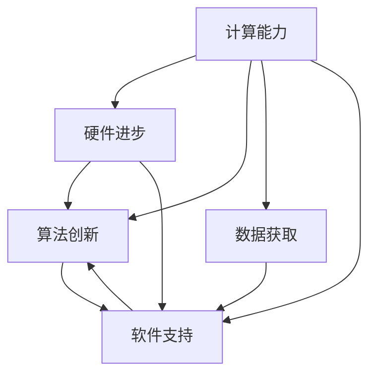

                 

## 1. 背景介绍

### 1.1 问题由来

在科技迅猛发展的今天，人类社会正进入一个以计算为核心的全新时代。计算不再仅是计算机工程师的专属领域，而是正在成为推动社会进步、改善人类生活品质的重要工具。随着人工智能、大数据、云计算等技术的发展，计算能力不断提升，其应用范围也从科学研究扩展到了工业生产、医疗卫生、城市管理、社会服务等各个领域。

### 1.2 问题核心关键点

这一转变背后，是计算能力的飞速发展。从早期的简单数值计算，到如今的深度学习、量子计算，计算能力已经成为衡量一个国家科技实力的重要指标。而计算能力提升的关键，在于算法的创新和硬件的进步。

- **算法创新**：如神经网络、遗传算法、强化学习等。这些算法从不同角度提供了强大的计算模型，推动了计算能力的发展。
- **硬件进步**：从早期的晶体管、集成电路，到现在的GPU、TPU，硬件性能的提升直接推动了计算能力的飞跃。

但这些技术的发展并非孤立，而是相互促进、相辅相成。算法的发展带来了对高性能计算的需求，反过来，硬件的进步也为算法的实现提供了可能。这一相互作用，共同推动了计算能力的飞速提升。

### 1.3 问题研究意义

计算能力对社会的深远意义，体现在以下几个方面：

1. **推动科技进步**：计算能力的提升，使得许多复杂问题得以解决，如天气预测、天体运动模拟、材料设计等。这些技术的突破，推动了科学研究的进步。
2. **改变生产方式**：在工业生产中，计算能力的应用使得生产效率大幅提高，生产成本降低。自动化、智能化生产设备成为主流，改变了传统制造业的生产模式。
3. **改善生活质量**：在医疗卫生、城市管理等领域，计算能力的应用改善了公共服务的效率和质量。例如，通过大数据分析，医疗机构能够更精准地诊断疾病；城市交通系统通过实时计算，优化了交通流量，减少了拥堵。
4. **促进经济增长**：计算能力的发展，推动了信息产业、互联网产业的崛起，为经济增长提供了新的动力。

计算能力的提升，不仅改变了生产方式、改善了生活质量，更是在全球范围内推动了科技和经济的繁荣。因此，研究和提升计算能力，具有重要的社会和战略意义。

## 2. 核心概念与联系

### 2.1 核心概念概述

为了更好地理解计算能力在社会中的深远意义，我们将介绍几个关键概念及其相互关系：

- **计算能力**：指计算机每秒能够执行的指令数，是衡量计算机性能的重要指标。计算能力的提升，通常伴随着硬件性能的进步和算法创新。
- **算法**：指解决问题的一系列步骤和规则，是实现计算任务的基础。算法的创新，如深度学习、遗传算法、强化学习等，推动了计算能力的提升。
- **数据**：指计算任务所依赖的信息，是计算任务得以实现的前提。大数据和云计算的发展，为算法的实现提供了支持。
- **硬件**：指支持计算任务的物理设备，如CPU、GPU、TPU等。硬件的进步，如并行计算、量子计算，直接提升了计算能力。
- **软件**：指算法实现的编程语言、框架等。软件的发展，如Python、TensorFlow、PyTorch等，为算法的实现提供了平台。

这些概念之间相互依赖、相互促进，共同构成了计算能力提升的完整图景。

### 2.2 核心概念原理和架构的 Mermaid 流程图



这个流程图展示了计算能力的提升，涉及到硬件进步、算法创新、数据获取和软件支持四个关键方面。通过这些相互依赖的环节，计算能力得以不断提升，推动社会进步。

## 3. 核心算法原理 & 具体操作步骤

### 3.1 算法原理概述

计算能力的核心在于算法。一个优秀的算法，能够高效地解决问题，提升计算效率。以下是几个常见的算法原理：

- **深度学习**：通过多层次的神经网络模型，实现对数据的复杂表示和处理。深度学习在图像识别、自然语言处理等领域取得了显著成果。
- **遗传算法**：模拟生物进化的过程，通过不断迭代优化，寻找最优解。遗传算法在优化问题、搜索问题中表现优异。
- **强化学习**：通过与环境的交互，学习最优策略。强化学习在游戏、机器人控制等领域有广泛应用。

这些算法之所以能够提升计算能力，是因为它们能够在处理复杂问题时，提供高效、精确的解决方案。

### 3.2 算法步骤详解

以深度学习算法为例，其基本步骤如下：

1. **数据准备**：收集并处理数据，转化为算法可以处理的形式。
2. **模型选择**：选择适合的深度学习模型，如卷积神经网络（CNN）、循环神经网络（RNN）、生成对抗网络（GAN）等。
3. **模型训练**：通过大量的训练数据，调整模型参数，使其能够准确地进行预测或分类。
4. **模型评估**：使用测试数据集对模型进行评估，确定其性能和准确度。
5. **模型优化**：根据评估结果，调整模型结构或参数，提升性能。

这些步骤环环相扣，确保了深度学习算法在处理复杂问题时能够提供高效、精确的解决方案。

### 3.3 算法优缺点

深度学习算法的优点包括：

- **高效性**：能够处理大规模、复杂的数据集，提升计算效率。
- **精确性**：在图像识别、语音识别等领域，深度学习算法表现出色。
- **可扩展性**：能够通过增加计算资源，提升模型性能。

但其缺点也不容忽视：

- **计算资源消耗大**：深度学习模型通常需要大量的计算资源进行训练和优化。
- **数据需求高**：深度学习算法需要大量标注数据进行训练，获取高质量数据成本较高。
- **模型复杂度高**：深度学习模型结构复杂，难以解释和调试。

### 3.4 算法应用领域

深度学习算法在多个领域中得到了广泛应用：

- **医疗**：通过图像识别、自然语言处理技术，提升医疗诊断的准确度。
- **金融**：利用深度学习算法，进行股票价格预测、风险评估等。
- **智能制造**：通过图像识别、模式识别技术，优化生产流程，提高生产效率。
- **自动驾驶**：通过图像识别、传感器数据处理，实现自动驾驶功能。
- **智能客服**：通过自然语言处理技术，实现智能客服系统，提升客户满意度。

深度学习算法在各个领域的应用，推动了相关产业的智能化升级，提升了生产效率，改善了用户体验。

## 4. 数学模型和公式 & 详细讲解 & 举例说明

### 4.1 数学模型构建

深度学习算法通常基于神经网络模型。以卷积神经网络（CNN）为例，其基本数学模型如下：

$$ y = W*x + b $$

其中 $y$ 为输出，$x$ 为输入，$W$ 为权重矩阵，$b$ 为偏置项。

### 4.2 公式推导过程

以卷积神经网络为例，其基本公式推导如下：

1. **卷积层**：通过卷积操作，提取输入数据的局部特征。
2. **池化层**：对卷积层输出进行降维，减少计算量。
3. **全连接层**：将池化层输出转换为向量形式，进行分类或回归。

### 4.3 案例分析与讲解

以图像分类为例，卷积神经网络的公式推导如下：

1. **卷积层**：通过卷积核（Filter）提取图像的局部特征，公式如下：

$$ f(x) = \sum_k \omega_k * h_k(x) $$

其中 $\omega_k$ 为卷积核，$h_k(x)$ 为输入数据。

2. **池化层**：对卷积层输出进行最大池化，公式如下：

$$ y_{i,j} = \max\limits_{l=0}^{k-1} f_{i-l,j-l} $$

其中 $y_{i,j}$ 为池化层输出，$f_{i-l,j-l}$ 为卷积层输出。

3. **全连接层**：将池化层输出转换为向量形式，进行分类，公式如下：

$$ y = W*x + b $$

其中 $W$ 为权重矩阵，$x$ 为池化层输出，$b$ 为偏置项。

以上公式展示了卷积神经网络的基本计算过程，通过卷积、池化和全连接等操作，实现对图像的分类和识别。

## 5. 项目实践：代码实例和详细解释说明

### 5.1 开发环境搭建

以TensorFlow为例，其开发环境搭建步骤如下：

1. 安装Python 3.7以上版本，并设置环境变量。
2. 安装TensorFlow及其依赖包，如NumPy、Pillow等。
3. 安装Jupyter Notebook或PyCharm等开发工具。

### 5.2 源代码详细实现

以下是一个简单的卷积神经网络模型，用于图像分类：

```python
import tensorflow as tf
from tensorflow.keras import layers

# 定义模型
model = tf.keras.Sequential([
    layers.Conv2D(32, (3, 3), activation='relu', input_shape=(28, 28, 1)),
    layers.MaxPooling2D((2, 2)),
    layers.Flatten(),
    layers.Dense(10, activation='softmax')
])

# 编译模型
model.compile(optimizer='adam', loss='sparse_categorical_crossentropy', metrics=['accuracy'])

# 训练模型
model.fit(train_images, train_labels, epochs=10, validation_data=(test_images, test_labels))
```

### 5.3 代码解读与分析

以上代码展示了卷积神经网络的基本实现过程。模型包含卷积层、池化层和全连接层，通过编译和训练，实现了对图像的分类。

- **卷积层**：通过卷积核（Filter）提取图像的局部特征，32个卷积核形成32个特征图。
- **池化层**：对卷积层输出进行最大池化，减少计算量。
- **全连接层**：将池化层输出转换为向量形式，进行分类，10个输出节点表示10个类别。

### 5.4 运行结果展示

运行以上代码，可以得到训练过程中的损失和准确度变化图：

```python
import matplotlib.pyplot as plt

# 绘制训练过程
plt.plot(history.history['loss'], label='loss')
plt.plot(history.history['val_loss'], label='val_loss')
plt.plot(history.history['accuracy'], label='accuracy')
plt.plot(history.history['val_accuracy'], label='val_accuracy')
plt.xlabel('Epoch')
plt.ylabel('Value')
plt.legend()
plt.show()
```

## 6. 实际应用场景

### 6.1 医疗领域

在医疗领域，计算能力的应用主要体现在两个方面：

- **图像识别**：通过深度学习算法，对医学影像（如X光片、CT扫描）进行自动分析和诊断。例如，使用卷积神经网络（CNN）对肺部CT扫描进行结节检测。
- **自然语言处理**：通过自然语言处理技术，分析医学文献、患者记录，辅助医生进行诊断和治疗决策。例如，使用循环神经网络（RNN）对电子病历进行情感分析，判断患者的情绪状态。

### 6.2 金融领域

在金融领域，计算能力的应用主要体现在：

- **风险评估**：通过深度学习算法，对股票价格、市场波动进行预测和分析，识别潜在的风险点。
- **反欺诈检测**：通过异常检测算法，识别异常交易行为，防止金融欺诈。
- **量化交易**：通过机器学习算法，自动化交易决策，提升投资回报率。

### 6.3 自动驾驶

在自动驾驶领域，计算能力的应用主要体现在：

- **环境感知**：通过摄像头、激光雷达等传感器获取环境信息，使用深度学习算法进行图像识别、物体检测。
- **路径规划**：通过计算最优路径，规划车辆的行驶轨迹，避免碰撞和拥堵。
- **智能决策**：通过强化学习算法，实现自动驾驶决策，提升驾驶安全性。

### 6.4 未来应用展望

未来，计算能力的应用将更加广泛和深入：

- **智能家居**：通过计算能力，实现家庭设备的自动化控制、环境监测、健康管理等。
- **智慧城市**：通过大数据分析和实时计算，优化城市管理，提升公共服务效率。
- **人工智能辅助**：在医疗、金融、教育等领域，计算能力的应用将进一步深入，提升各行各业的智能化水平。

## 7. 工具和资源推荐

### 7.1 学习资源推荐

为了更好地学习和掌握计算能力的应用，以下是一些推荐的资源：

- **深度学习课程**：如斯坦福大学的《CS231n: Convolutional Neural Networks for Visual Recognition》，详细讲解了卷积神经网络、深度学习等概念。
- **TensorFlow官方文档**：提供了丰富的教程和示例，帮助开发者快速上手TensorFlow。
- **Kaggle竞赛**：通过参与各种竞赛，实践深度学习算法，提升实战能力。

### 7.2 开发工具推荐

以下是一些推荐的开发工具：

- **Jupyter Notebook**：免费的交互式编程环境，支持Python、R等多种语言，方便数据处理和算法开发。
- **PyCharm**：开源的Python IDE，提供丰富的开发工具和调试功能。
- **GitHub**：代码托管平台，方便协作开发和版本控制。

### 7.3 相关论文推荐

以下是几篇经典的计算能力相关论文，推荐阅读：

- **深度学习**：《Deep Learning》，Ian Goodfellow、Yoshua Bengio、Aaron Courville著。
- **强化学习**：《Reinforcement Learning: An Introduction》，Richard S. Sutton、Andrew G. Barto著。
- **遗传算法**：《Genetic Algorithms in Search, Optimization and Machine Learning》，David E. Goldberg著。

## 8. 总结：未来发展趋势与挑战

### 8.1 研究成果总结

计算能力的应用，推动了科技、经济、社会等多个领域的进步。未来，随着计算能力的进一步提升，其在各个领域的应用也将更加深入和广泛。

### 8.2 未来发展趋势

未来的计算能力将呈现以下趋势：

- **量子计算**：通过量子比特的并行计算能力，提升计算效率，解决传统计算无法解决的问题。
- **边缘计算**：通过在设备端进行计算，减少数据传输，提升计算效率和数据安全性。
- **智能算法**：通过引入更多的智能算法，如深度学习、强化学习等，提升计算能力的应用范围和效果。

### 8.3 面临的挑战

尽管计算能力的应用前景广阔，但在实际应用中仍面临一些挑战：

- **数据隐私和安全**：计算能力的应用涉及大量数据，如何保障数据隐私和安全是一个重要问题。
- **计算资源消耗**：计算能力的提升需要大量的计算资源，如何降低资源消耗，提升计算效率是一个难题。
- **算法复杂度**：计算能力的应用涉及复杂的算法，如何简化算法，提升模型可解释性是一个重要研究方向。

### 8.4 研究展望

未来的研究需要在以下几个方面寻求新的突破：

- **数据隐私保护**：引入区块链、加密等技术，保护数据隐私和安全。
- **计算资源优化**：通过分布式计算、边缘计算等技术，优化计算资源，提升计算效率。
- **算法简化**：通过简化算法，提升模型的可解释性，使其更容易被理解和调试。

这些研究方向的探索，将推动计算能力在各个领域的应用，为人类社会的进步提供更强大的动力。

## 9. 附录：常见问题与解答

**Q1：计算能力的应用前景如何？**

A: 计算能力的应用前景广阔，将在医疗、金融、自动驾驶等领域得到广泛应用，推动相关产业的智能化升级，提升生产效率和用户体验。

**Q2：如何提升计算能力的应用效率？**

A: 提升计算能力的应用效率，可以从以下几个方面入手：
- **算法优化**：通过改进算法，提升计算效率。
- **硬件升级**：使用更高性能的硬件，如GPU、TPU等。
- **分布式计算**：通过分布式计算，提升计算能力的应用范围和效率。

**Q3：计算能力的应用有哪些潜在风险？**

A: 计算能力的应用也存在一些潜在风险：
- **数据隐私和安全**：计算能力的应用涉及大量数据，如何保障数据隐私和安全是一个重要问题。
- **计算资源消耗**：计算能力的提升需要大量的计算资源，如何降低资源消耗，提升计算效率是一个难题。
- **算法复杂度**：计算能力的应用涉及复杂的算法，如何简化算法，提升模型可解释性是一个重要研究方向。

**Q4：如何保护计算能力的应用中的数据隐私？**

A: 保护计算能力的应用中的数据隐私，可以从以下几个方面入手：
- **数据加密**：使用加密技术保护数据隐私。
- **匿名化处理**：对数据进行匿名化处理，防止数据泄露。
- **区块链技术**：引入区块链技术，保障数据的安全性和透明性。

这些措施将有助于保障计算能力的应用中的数据隐私，提升数据使用的安全性和可信度。

---

作者：禅与计算机程序设计艺术 / Zen and the Art of Computer Programming

