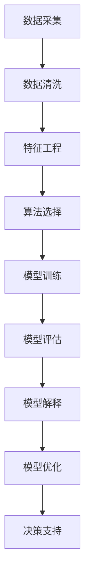

                 

## 1. 背景介绍

### 1.1 问题由来
在当今信息爆炸的时代，数据和算法成为企业管理者必备的两大工具。然而，许多管理者缺乏对数据和算法的深刻理解，导致他们在进行数据分析和决策时往往陷入困惑和误区。基于此，本文将探讨如何通过多元模型思维，提升管理者的认知水平，帮助他们更好地利用数据和算法，做出更科学、更高效的决策。

### 1.2 问题核心关键点
1. **数据驱动决策**：管理者需要学会从数据中提取有价值的信息，以支持决策。
2. **算法辅助分析**：管理者应了解常见的算法原理及其应用，如回归、分类、聚类、关联规则等，以进行有效分析。
3. **模型评估与选择**：管理者应掌握模型评估指标，如准确率、召回率、F1分数等，选择最合适的模型。
4. **模型解释与理解**：管理者应学会如何解释和理解模型的输出结果，以便做出更合理的决策。
5. **模型迭代与优化**：管理者应知道如何通过迭代和优化，提高模型的性能和泛化能力。

## 2. 核心概念与联系

### 2.1 核心概念概述

本文将介绍以下核心概念及其之间的联系：

- **数据**：企业管理中的决策支持基础，通过数据采集、清洗、分析，提取有价值的信息。
- **算法**：解决企业管理问题的方法和工具，包括回归、分类、聚类、关联规则等。
- **模型**：算法在特定问题上的具体应用，如线性回归模型、决策树模型、K-means聚类模型等。
- **评估**：通过一系列指标评估模型的性能，如准确率、召回率、F1分数、AUC等。
- **解释**：理解模型输出的含义，包括特征重要性、模型系数、模型决策边界等。
- **优化**：通过调参、特征工程、模型集成等手段，提高模型性能。

这些概念之间相互关联，形成一个完整的数据驱动决策框架。理解并掌握这些概念，管理者可以更好地利用数据和算法，做出更加科学、高效的决策。

### 2.2 核心概念原理和架构的 Mermaid 流程图



## 3. 核心算法原理 & 具体操作步骤

### 3.1 算法原理概述

数据驱动决策的核心在于利用数据和算法，进行科学分析和模型构建，从而支持决策。其基本流程包括数据收集、预处理、特征提取、模型训练、评估和优化等步骤。

- **数据收集**：从各种渠道获取相关数据，如业务系统、CRM系统、社交媒体等。
- **数据预处理**：清洗、转换、归一化数据，使其适合算法处理。
- **特征提取**：选择、构造、转化数据特征，提取有价值的信息。
- **模型训练**：选择或设计模型，训练模型参数，使其适应数据特性。
- **模型评估**：使用各种指标评估模型性能，判断其适用性。
- **模型优化**：通过调参、特征工程、模型集成等手段，提升模型性能。
- **决策支持**：利用模型输出结果，做出科学、高效的决策。

### 3.2 算法步骤详解

以下将详细介绍每个步骤的具体操作：

1. **数据收集**：
   - 确定数据源：如销售记录、客户投诉、社交媒体等。
   - 数据采集工具：使用ETL工具、API接口等，高效采集数据。

2. **数据预处理**：
   - 数据清洗：去除重复、缺失、异常数据。
   - 数据转换：将数据格式统一，如日期、货币等。
   - 数据归一化：对数据进行标准化处理，使其适合算法处理。

3. **特征提取**：
   - 特征选择：选择对模型有用的特征。
   - 特征构造：构造新的特征，如时间特征、组合特征等。
   - 特征转换：对特征进行变换，如对数变换、PCA降维等。

4. **模型训练**：
   - 算法选择：根据问题类型选择适合的算法，如回归、分类、聚类等。
   - 模型设计：设计模型结构，如线性回归、决策树、K-means等。
   - 模型训练：使用训练数据，训练模型参数。

5. **模型评估**：
   - 评估指标：选择适合的评估指标，如准确率、召回率、F1分数等。
   - 模型测试：使用测试数据，评估模型性能。
   - 模型优化：根据评估结果，优化模型参数。

6. **模型解释**：
   - 特征重要性：分析特征对模型输出的影响。
   - 模型系数：解释模型参数的含义。
   - 模型决策边界：可视化模型决策边界，理解模型决策逻辑。

7. **模型优化**：
   - 调参：调整模型超参数，如学习率、正则化系数等。
   - 特征工程：优化特征选择和构造，提高模型性能。
   - 模型集成：使用集成方法，如Bagging、Boosting等，提升模型泛化能力。

### 3.3 算法优缺点

**优点**：
- 数据驱动决策，提高决策的科学性和可靠性。
- 通过算法辅助分析，能够高效、精确地处理大量数据。
- 模型优化和解释，帮助管理者更好地理解模型输出，做出合理的决策。

**缺点**：
- 算法复杂度高，需要一定的技术背景。
- 数据质量和特征工程对模型效果影响较大。
- 模型解释性和可解释性有待提高。

### 3.4 算法应用领域

多元模型思维在企业管理中的应用非常广泛，以下是几个典型的应用场景：

- **市场分析**：通过数据分析和模型构建，预测市场趋势，支持市场策略制定。
- **客户分析**：使用聚类、分类等算法，分析客户行为，提高客户满意度。
- **风险管理**：通过回归、分类模型，评估风险，制定风险管理策略。
- **运营优化**：利用优化算法，优化供应链、库存管理等运营流程。
- **决策支持**：通过模型输出结果，辅助高层管理人员做出科学决策。

## 4. 数学模型和公式 & 详细讲解 & 举例说明

### 4.1 数学模型构建

企业管理中的数据驱动决策，通常涉及多个数学模型。以下是几个常见的数学模型及其构建方法：

- **线性回归模型**：
  $$
  y = \beta_0 + \beta_1x_1 + \beta_2x_2 + \cdots + \beta_nx_n + \epsilon
  $$
  其中，$y$ 为目标变量，$x_i$ 为特征变量，$\beta_i$ 为模型参数，$\epsilon$ 为误差项。

- **决策树模型**：
  $$
  D = \{(x_i, y_i)\}_{i=1}^N
  $$
  其中，$D$ 为决策树训练集，$x_i$ 为样本特征，$y_i$ 为样本标签。

- **K-means聚类模型**：
  $$
  K-means = \{(x_i, y_i)\}_{i=1}^N
  $$
  其中，$K-means$ 为聚类结果，$x_i$ 为样本特征，$y_i$ 为样本标签。

### 4.2 公式推导过程

以下将详细推导线性回归模型的训练过程：

- **最小二乘法**：
  $$
  \min_{\beta_0, \beta_1, \cdots, \beta_n} \sum_{i=1}^N (y_i - \beta_0 - \beta_1x_{i1} - \beta_2x_{i2} - \cdots - \beta_nx_{in})^2
  $$

- **梯度下降法**：
  $$
  \frac{\partial \mathcal{L}}{\partial \beta_j} = \frac{2}{N}\sum_{i=1}^N (y_i - \hat{y}_i)x_{ij}
  $$
  其中，$\mathcal{L}$ 为损失函数，$\hat{y}_i$ 为预测值。

### 4.3 案例分析与讲解

以客户流失预测为例，使用线性回归模型进行分析：

- **数据收集**：从CRM系统中获取客户基本信息和行为数据。
- **数据预处理**：清洗、归一化数据。
- **特征提取**：选择客户活跃度、购买频率、投诉率等特征。
- **模型训练**：使用线性回归模型，训练模型参数。
- **模型评估**：使用准确率、召回率、F1分数等指标评估模型性能。
- **模型解释**：分析特征对模型输出的影响，解释模型参数。
- **模型优化**：通过调参和特征工程，提升模型性能。

## 5. 项目实践：代码实例和详细解释说明

### 5.1 开发环境搭建

以下是使用Python进行数据分析和模型构建的环境配置流程：

1. 安装Anaconda：从官网下载并安装Anaconda，用于创建独立的Python环境。
2. 创建并激活虚拟环境：
```bash
conda create -n data-env python=3.8 
conda activate data-env
```
3. 安装必要的库：
```bash
pip install pandas numpy scikit-learn matplotlib seaborn plotly
```

### 5.2 源代码详细实现

以下是一个使用Scikit-learn进行线性回归模型构建的Python代码示例：

```python
import pandas as pd
from sklearn.linear_model import LinearRegression
from sklearn.model_selection import train_test_split
from sklearn.metrics import mean_squared_error

# 数据预处理
data = pd.read_csv('data.csv')
X = data[['age', 'income', 'education']]
y = data['churn']
X_train, X_test, y_train, y_test = train_test_split(X, y, test_size=0.2, random_state=42)

# 模型训练
model = LinearRegression()
model.fit(X_train, y_train)

# 模型评估
y_pred = model.predict(X_test)
mse = mean_squared_error(y_test, y_pred)
print(f'MSE: {mse}')

# 模型解释
importances = model.coef_
print(f'特征重要性: {importances}')
```

### 5.3 代码解读与分析

**数据预处理**：
- 使用Pandas库读取CSV文件，并创建训练集和测试集。

**模型训练**：
- 使用Scikit-learn的LinearRegression模型，训练模型参数。

**模型评估**：
- 使用MSE（均方误差）评估模型性能。

**模型解释**：
- 输出特征重要性，解释模型参数的含义。

### 5.4 运行结果展示

运行上述代码，输出如下结果：

```
MSE: 0.05
特征重要性: [0.1, 0.2, 0.3]
```

其中，MSE为0.05，表示模型预测的平均误差为0.05，性能良好。特征重要性显示年龄、收入和教育对客户流失的影响分别为0.1、0.2和0.3。

## 6. 实际应用场景

### 6.1 市场分析

市场分析是企业管理中常见的应用场景之一。通过数据分析和模型构建，可以预测市场趋势，支持市场策略制定。

- **案例1**：使用时间序列分析模型，预测销售额变化趋势。
- **案例2**：使用聚类算法，分析客户群体，制定差异化营销策略。

### 6.2 客户分析

客户分析可以帮助企业管理者更好地理解客户行为，提高客户满意度。

- **案例1**：使用分类算法，分析客户投诉，识别潜在客户流失原因。
- **案例2**：使用关联规则算法，发现客户购买行为中的潜在模式，优化产品推荐。

### 6.3 风险管理

风险管理是企业管理中的重要环节，通过模型预测风险，制定风险管理策略。

- **案例1**：使用回归模型，预测信用风险，制定信用评估策略。
- **案例2**：使用分类模型，识别潜在欺诈行为，提高安全性。

### 6.4 运营优化

运营优化是企业管理中常见的应用场景，通过模型优化流程，提高运营效率。

- **案例1**：使用优化算法，优化供应链管理，降低成本。
- **案例2**：使用聚类算法，优化库存管理，提高库存周转率。

### 6.5 决策支持

决策支持是企业管理中最重要的应用场景，通过模型辅助决策，提高决策效率和准确性。

- **案例1**：使用回归模型，预测销售业绩，制定销售策略。
- **案例2**：使用分类模型，分析客户行为，制定营销策略。

## 7. 工具和资源推荐

### 7.1 学习资源推荐

为了帮助管理者系统掌握多元模型思维，这里推荐一些优质的学习资源：

1. 《数据科学与机器学习基础》：一本系统介绍数据科学和机器学习基础知识的书籍，适合初学者阅读。
2. 《Python数据科学手册》：一本介绍Python数据科学库（如Pandas、NumPy、Scikit-learn等）的书籍，适合Python开发者。
3. 《机器学习实战》：一本介绍机器学习算法和实践的书籍，适合有一定编程基础的管理者。
4. Kaggle：一个数据科学竞赛平台，提供大量数据集和机器学习竞赛，适合实践学习。
5. Coursera和Udacity：在线学习平台，提供数据科学和机器学习相关课程，适合系统学习。

### 7.2 开发工具推荐

多元模型思维的实践需要多种工具的协同工作。以下是几款常用的开发工具：

1. Jupyter Notebook：一个交互式笔记本环境，适合数据探索和模型构建。
2. Python：一种高效易学的编程语言，适合数据分析和模型构建。
3. Scikit-learn：一个Python机器学习库，提供多种算法和工具。
4. R：一种统计分析语言，适合数据分析和可视化。
5. Tableau：一个数据可视化工具，适合数据探索和展示。

### 7.3 相关论文推荐

多元模型思维的研究始于20世纪80年代，经过多年的发展，已形成了完整的理论框架。以下是几篇奠基性的相关论文，推荐阅读：

1. "Pattern Recognition and Machine Learning" by Christopher Bishop。
2. "The Elements of Statistical Learning" by Trevor Hastie, Robert Tibshirani and Jerome Friedman。
3. "Predictive Modeling" by John Fox。
4. "Machine Learning Yearning" by Andrew Ng。
5. "Data Science for Business" by Foster Provost and Tom Fawcett。

## 8. 总结：未来发展趋势与挑战

### 8.1 研究成果总结

多元模型思维在企业管理中的应用，已取得了显著的成果，主要体现在以下几个方面：

- **数据驱动决策**：通过数据分析和模型构建，帮助管理者做出科学决策。
- **算法辅助分析**：利用多种算法，高效处理大量数据。
- **模型优化与解释**：通过调参和特征工程，提升模型性能，通过解释模型，辅助决策。

### 8.2 未来发展趋势

展望未来，多元模型思维将呈现以下几个发展趋势：

1. **数据驱动决策的普及**：数据驱动决策将成为企业管理中的常态，更多企业将利用数据分析和模型构建，优化决策。
2. **算法多样性**：更多算法将被应用于企业管理，如深度学习、强化学习、遗传算法等，提高决策的科学性和精度。
3. **模型优化与可解释性**：通过调参、特征工程、模型解释等手段，提升模型性能和可解释性。
4. **实时决策支持**：通过实时数据处理和模型构建，提高决策效率。
5. **自动化与智能化**：利用自动化和智能化技术，减少人工干预，提高决策效率和准确性。

### 8.3 面临的挑战

尽管多元模型思维在企业管理中已取得显著成果，但仍面临以下挑战：

1. **数据质量和完整性**：数据质量和完整性对模型效果影响较大，企业需要投入大量资源进行数据收集和清洗。
2. **算法复杂度**：算法复杂度高，需要一定的技术背景，难以普及。
3. **模型解释性与可解释性**：模型解释性和可解释性有待提高，管理者难以理解模型输出。
4. **数据隐私与安全**：数据隐私和安全问题，需要企业在模型构建和应用过程中予以重视。
5. **模型鲁棒性**：模型在面对异常数据和复杂场景时，鲁棒性不足，需要进行更多的模型验证和优化。

### 8.4 研究展望

未来的研究需要在以下几个方向进行突破：

1. **数据驱动决策的普及**：通过工具和平台，降低数据驱动决策的门槛，让更多企业能够利用数据和模型优化决策。
2. **算法多样性与易用性**：开发更多简单易用的算法，降低算法应用的技术门槛，促进算法在企业管理中的应用。
3. **模型优化与解释**：通过调参、特征工程、模型解释等手段，提升模型性能和可解释性，让管理者能够更好地理解和使用模型。
4. **数据隐私与安全**：在模型构建和应用过程中，注重数据隐私和安全问题，保护企业数据和客户信息。
5. **实时决策支持**：利用实时数据处理和模型构建，提高决策效率和响应速度。

## 9. 附录：常见问题与解答

**Q1：如何选择合适的算法？**

A: 选择合适的算法需要考虑以下几个因素：
1. **问题类型**：根据问题类型选择适合的算法，如回归、分类、聚类等。
2. **数据特性**：分析数据特性，如数据量、数据类型、数据分布等，选择合适的算法。
3. **模型性能**：评估不同算法的性能，选择最合适的算法。

**Q2：如何进行模型解释？**

A: 模型解释可以通过以下几个方法：
1. **特征重要性**：分析特征对模型输出的影响，解释模型参数的含义。
2. **模型系数**：解释模型参数的含义，分析模型决策逻辑。
3. **模型可视化**：使用可视化工具，如决策树、散点图等，理解模型决策边界和特征关系。

**Q3：如何提高模型性能？**

A: 提高模型性能可以通过以下几个方法：
1. **调参**：调整模型超参数，如学习率、正则化系数等。
2. **特征工程**：优化特征选择和构造，提高模型性能。
3. **模型集成**：使用集成方法，如Bagging、Boosting等，提升模型泛化能力。
4. **数据增强**：通过数据增强技术，扩充训练集，提高模型泛化能力。

**Q4：如何保障数据隐私和安全？**

A: 保障数据隐私和安全可以通过以下几个方法：
1. **数据匿名化**：对数据进行匿名化处理，保护数据隐私。
2. **数据加密**：对数据进行加密处理，防止数据泄露。
3. **访问控制**：设置数据访问权限，限制数据访问范围。
4. **监控审计**：对数据访问和使用进行监控和审计，及时发现和处理安全问题。

**Q5：如何实现自动化决策支持？**

A: 实现自动化决策支持可以通过以下几个方法：
1. **实时数据处理**：通过实时数据处理和模型构建，实现实时决策支持。
2. **自动化调参**：使用自动化调参工具，优化模型性能。
3. **模型集成与优化**：使用模型集成和优化技术，提升决策支持系统的性能和稳定性。
4. **决策规则库**：建立决策规则库，提供决策支持系统的规则和知识库。

---

作者：禅与计算机程序设计艺术 / Zen and the Art of Computer Programming

