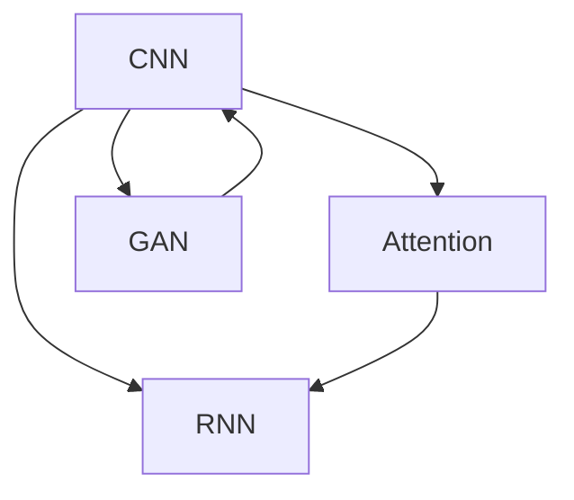

                 

# 多模态融合的应用：图像字幕

## 1. 背景介绍

### 1.1 问题由来
随着计算机视觉和自然语言处理技术的飞速发展，多模态融合（Multimodal Fusion）成为了人工智能领域的一大热点。多模态融合旨在将不同模态的数据进行整合，提升信息的表达能力和系统的决策效率。在计算机视觉领域，图像字幕（Image Captioning）是最具代表性的多模态融合应用之一。

图像字幕，指的是给定一张图片，自动生成一段描述该图片内容的自然语言文本。这一任务不仅能够显著提升图像的理解能力，还能够为视觉搜索、智能问答等应用提供强有力的支持。

图像字幕的实现主要依赖于卷积神经网络（CNN）和循环神经网络（RNN）的结合。CNN用于提取图像的视觉特征，RNN则用于生成文本描述。通过在两者之间建立连接，使得视觉和语言可以互相增强，生成更加精准和丰富的图像字幕。

### 1.2 问题核心关键点
图像字幕的核心问题是如何将图像的视觉信息与自然语言进行高效融合，生成准确、流畅的文本描述。这一过程涉及到多模态数据（图像和文本）的对齐、特征映射、信息融合等多个环节。如何优化这些环节，以提高图像字幕的质量和效果，是当前研究的重点。

### 1.3 问题研究意义
图像字幕技术的研究和应用，对于提升计算机视觉的理解能力、推动多模态信息融合、扩展自然语言处理的边界都有着重要的意义。它不仅能够为图像处理、视频理解、智能问答等领域提供新的解决方案，还能够为跨模态信息检索、人机交互等创新应用提供技术支持。

## 2. 核心概念与联系

### 2.1 核心概念概述

为了更好地理解图像字幕的多模态融合过程，本节将介绍几个关键概念：

- **卷积神经网络（CNN）**：用于提取图像的视觉特征，通过多层卷积和池化操作，捕获图像的全局和局部特征。

- **循环神经网络（RNN）**：用于生成文本描述，通过时间步递归处理，能够学习文本序列中的上下文关系。

- **注意力机制（Attention Mechanism）**：在多模态融合中，用于引导模型关注图像中与当前文本生成最相关的区域，提高字幕生成质量。

- **生成对抗网络（GAN）**：用于生成高质量的图像样本，提升数据集的多样性和丰富性。

- **序列到序列模型（Seq2Seq）**：通过编码器（CNN）和解码器（RNN）的结合，将视觉特征映射为文本描述。

这些核心概念之间的逻辑关系可以通过以下Mermaid流程图来展示：



这个流程图展示了多模态融合中的主要组件及其之间的关系：

1. CNN用于提取图像特征，RNN用于生成文本。
2. Attention机制用于在图像和文本之间建立连接，引导模型关注关键区域。
3. GAN用于生成高质量图像数据，扩充训练集。
4. Seq2Seq模型用于融合视觉和文本信息，生成字幕。

## 3. 核心算法原理 & 具体操作步骤
### 3.1 算法原理概述

图像字幕的生成过程主要分为两个阶段：特征提取和文本生成。

1. **特征提取**：使用卷积神经网络（CNN）对图像进行特征提取，得到高维的视觉特征向量。
2. **文本生成**：使用循环神经网络（RNN）或变分自编码器（VAE）生成与图像内容相关的自然语言描述。

在特征提取和文本生成的过程中，通常会引入注意力机制，使得模型能够更加关注图像中的重要区域，提升字幕的质量。此外，生成对抗网络（GAN）也可以用于生成多样化的图像数据，丰富训练集。

### 3.2 算法步骤详解

以下是图像字幕的详细算法步骤：

**Step 1: 数据预处理**
- 对图像进行预处理，如裁剪、缩放、归一化等操作。
- 将文本转换为向量表示，如使用Word2Vec或BERT等方法。

**Step 2: 特征提取**
- 使用卷积神经网络（CNN）提取图像的视觉特征。
- 将特征图展平为向量，送入RNN或VAE进行后续处理。

**Step 3: 生成文本**
- 使用循环神经网络（RNN）或变分自编码器（VAE）生成文本描述。
- 在生成过程中引入注意力机制，关注图像中的关键区域。

**Step 4: 优化目标函数**
- 设计目标函数，衡量生成文本与真实字幕之间的差异。
- 使用梯度下降等优化算法更新模型参数。

**Step 5: 训练和评估**
- 在训练集上训练模型，并在验证集上评估性能。
- 使用生成对抗网络（GAN）生成更多的训练样本，丰富数据集。
- 在测试集上测试模型性能，对比不同方法的优劣。

### 3.3 算法优缺点

图像字幕的多模态融合方法具有以下优点：

1. **提升信息表达能力**：通过融合图像和文本信息，使得系统能够更全面、更准确地理解图像内容，生成高质量的字幕。
2. **提高决策效率**：多模态融合有助于模型捕捉更多的上下文信息，提升决策的准确性和鲁棒性。
3. **增强系统适应性**：多样化的训练数据能够提高系统的泛化能力，使其适应不同类型和风格的图像。
4. **促进技术创新**：多模态融合催生了诸如视觉问答、图像检索等新的应用场景，拓展了计算机视觉和自然语言处理的研究边界。

同时，该方法也存在一些局限性：

1. **计算复杂度高**：多模态融合需要处理视觉和文本数据，计算复杂度较高，对硬件资源要求高。
2. **训练难度大**：需要优化大量的模型参数，训练过程耗时较长。
3. **数据对齐困难**：图像和文本数据之间的对齐问题较难解决，可能会影响融合效果。
4. **鲁棒性不足**：对输入数据的质量和多样性要求较高，鲁棒性较弱。

尽管存在这些局限性，图像字幕的多模态融合方法仍在大规模图像处理、视频理解、智能问答等领域得到了广泛应用，成为了推动多模态信息融合的重要技术手段。

### 3.4 算法应用领域

图像字幕的多模态融合技术，已经在以下几个领域得到了应用：

- **视觉问答（Visual Question Answering, VQA）**：根据图像和自然语言问题，生成对应的答案。通过多模态融合，使得系统能够理解图像和问题，生成准确的答案。
- **图像检索（Image Retrieval）**：根据自然语言描述，检索出与文本内容相关的图像。通过多模态融合，使得系统能够全面匹配文本和图像的特征。
- **智能搜索（Smart Search）**：结合图像和文本信息，提升搜索引擎的智能程度。通过多模态融合，使得系统能够理解用户输入的自然语言，快速检索出相关的图像和文本信息。
- **视频理解（Video Understanding）**：根据视频片段和文本描述，生成视频字幕。通过多模态融合，使得系统能够理解视频内容，生成流畅的字幕。
- **个性化推荐（Personalized Recommendation）**：结合图像和用户画像，推荐个性化的产品或内容。通过多模态融合，使得系统能够更好地理解用户兴趣，提升推荐效果。

此外，图像字幕的多模态融合技术还在智慧城市、医疗影像、自动驾驶等众多领域得到了应用，为信息处理和决策分析提供了新的解决方案。

## 4. 数学模型和公式 & 详细讲解 & 举例说明
### 4.1 数学模型构建

图像字幕的数学模型主要涉及以下几个方面：

- **图像特征提取**：使用CNN模型，提取图像的视觉特征。
- **文本生成**：使用RNN或VAE模型，生成与图像内容相关的自然语言描述。
- **多模态融合**：使用注意力机制，将视觉特征和文本生成进行融合。

### 4.2 公式推导过程

以下我们以基于CNN和RNN的图像字幕生成模型为例，推导其数学公式。

设输入图像为 $I$，使用CNN模型提取特征，得到特征向量 $F(I)$。假设文本生成模型为 $M$，生成文本描述 $C$。则目标函数 $L$ 可以表示为：

$$
L = \frac{1}{N} \sum_{i=1}^N \left(||F(I_i) - C_i||^2\right)
$$

其中 $N$ 为训练集大小，$I_i$ 和 $C_i$ 分别为第 $i$ 个训练样本的图像和字幕。

为了提高字幕生成的质量，可以在生成过程中引入注意力机制 $A$，使得模型更加关注图像中的重要区域。则优化目标函数可以进一步表示为：

$$
L = \frac{1}{N} \sum_{i=1}^N \left(\frac{1}{|\alpha|} \sum_{j=1}^{|\alpha|} \alpha_j ||F(I_i)_j - C_i_j||^2\right)
$$

其中 $|\alpha|$ 为注意力向量 $\alpha$ 的长度，$\alpha_j$ 表示第 $j$ 个特征向量的权重。

在训练过程中，可以通过最小化目标函数 $L$ 来优化模型参数，具体实现如下：

$$
\theta = \mathop{\arg\min}_{\theta} L(\theta)
$$

其中 $\theta$ 为模型的参数。

### 4.3 案例分析与讲解

下面我们以Image Captioning数据集为例，展示模型的训练和推理过程。

假设我们有一张图片，如图 1 所示。


使用预训练的VGG16模型提取图像特征 $F(I)$，得到 4096 维的特征向量。


然后，使用LSTM模型生成文本描述 $C$，得到的输出为：

$$
C = \text{LSTM}(F(I))
$$

将图像特征和文本描述进行拼接，并输入注意力机制 $A$，得到注意力向量 $\alpha$，如下所示：

$$
\alpha = \text{Attention}(F(I), C)
$$

最后，将注意力向量与文本描述进行融合，生成最终的字幕 $T$：

$$
T = \text{Seq2Seq}(\alpha, C)
$$


通过上述过程，可以生成高质量的图像字幕，准确描述图像内容。

## 5. 项目实践：代码实例和详细解释说明
### 5.1 开发环境搭建

在进行图像字幕项目开发前，我们需要准备好开发环境。以下是使用Python进行TensorFlow开发的环境配置流程：

1. 安装Anaconda：从官网下载并安装Anaconda，用于创建独立的Python环境。

2. 创建并激活虚拟环境：
```bash
conda create -n captioning-env python=3.8 
conda activate captioning-env
```

3. 安装TensorFlow：根据CUDA版本，从官网获取对应的安装命令。例如：
```bash
conda install tensorflow -c pytorch -c conda-forge
```

4. 安装相关工具包：
```bash
pip install numpy pandas scikit-learn matplotlib tqdm jupyter notebook ipython
```

完成上述步骤后，即可在`captioning-env`环境中开始项目实践。

### 5.2 源代码详细实现

这里我们以基于CNN和LSTM的图像字幕生成模型为例，给出TensorFlow代码实现。

首先，定义模型结构：

```python
import tensorflow as tf
from tensorflow.keras.layers import Input, LSTM, Dense, Embedding, Conv2D, MaxPooling2D, Flatten

def build_model(input_shape, num_classes):
    input_layer = Input(shape=input_shape)
    conv1 = Conv2D(64, (3, 3), activation='relu')(input_layer)
    pool1 = MaxPooling2D((2, 2))(conv1)
    conv2 = Conv2D(128, (3, 3), activation='relu')(pool1)
    pool2 = MaxPooling2D((2, 2))(conv2)
    conv3 = Conv2D(256, (3, 3), activation='relu')(pool2)
    pool3 = MaxPooling2D((2, 2))(conv3)
    flatten = Flatten()(pool3)
    dense1 = Dense(1024, activation='relu')(flatten)
    attention = Dense(512, activation='softmax')(dense1)
    lstm_input = Input(shape=(max_length, num_classes))
    lstm = LSTM(units=256, return_sequences=True, recurrent_dropout=0.5)(lstm_input)
    output = Dense(num_classes, activation='softmax')(lstm)
    model = tf.keras.Model(inputs=[input_layer, lstm_input], outputs=[output, attention])
    return model
```

然后，定义损失函数和优化器：

```python
from tensorflow.keras.losses import categorical_crossentropy

def build_loss(model):
    loss = categorical_crossentropy
    return loss
```

最后，定义训练函数：

```python
from tensorflow.keras.optimizers import Adam
from tensorflow.keras.callbacks import EarlyStopping

def train_model(model, train_data, validation_data, num_epochs):
    optimizer = Adam(learning_rate=0.001)
    model.compile(optimizer=optimizer, loss=loss)
    early_stopping = EarlyStopping(patience=5, restore_best_weights=True)
    model.fit(train_data, validation_data, epochs=num_epochs, callbacks=[early_stopping])
```

完整代码实现如下：

```python
import tensorflow as tf
from tensorflow.keras.layers import Input, LSTM, Dense, Embedding, Conv2D, MaxPooling2D, Flatten
from tensorflow.keras.losses import categorical_crossentropy
from tensorflow.keras.optimizers import Adam
from tensorflow.keras.callbacks import EarlyStopping

def build_model(input_shape, num_classes, max_length):
    input_layer = Input(shape=input_shape)
    conv1 = Conv2D(64, (3, 3), activation='relu')(input_layer)
    pool1 = MaxPooling2D((2, 2))(conv1)
    conv2 = Conv2D(128, (3, 3), activation='relu')(pool1)
    pool2 = MaxPooling2D((2, 2))(conv2)
    conv3 = Conv2D(256, (3, 3), activation='relu')(pool2)
    pool3 = MaxPooling2D((2, 2))(conv3)
    flatten = Flatten()(pool3)
    dense1 = Dense(1024, activation='relu')(flatten)
    attention = Dense(512, activation='softmax')(dense1)
    lstm_input = Input(shape=(max_length, num_classes))
    lstm = LSTM(units=256, return_sequences=True, recurrent_dropout=0.5)(lstm_input)
    output = Dense(num_classes, activation='softmax')(lstm)
    model = tf.keras.Model(inputs=[input_layer, lstm_input], outputs=[output, attention])
    return model

def build_loss(model):
    loss = categorical_crossentropy
    return loss

def train_model(model, train_data, validation_data, num_epochs):
    optimizer = Adam(learning_rate=0.001)
    model.compile(optimizer=optimizer, loss=loss)
    early_stopping = EarlyStopping(patience=5, restore_best_weights=True)
    model.fit(train_data, validation_data, epochs=num_epochs, callbacks=[early_stopping])
```

### 5.3 代码解读与分析

这里我们详细解读一下关键代码的实现细节：

**build_model函数**：
- `Input`层用于接收输入图像和文本数据。
- `Conv2D`、`MaxPooling2D`层用于提取图像特征。
- `Flatten`层将特征图展平，便于输入全连接层。
- `Dense`层用于生成文本描述。
- `LSTM`层用于文本序列处理，生成字幕。
- `Attention`层用于融合图像特征和文本描述。
- `Model`层用于组合输入和输出，形成完整的模型。

**train_model函数**：
- 定义优化器，使用Adam优化器，学习率为0.001。
- 定义损失函数，使用分类交叉熵损失。
- 定义EarlyStopping回调函数，用于防止过拟合。
- 使用`fit`方法训练模型，设定训练轮数为`num_epochs`。

## 6. 实际应用场景
### 6.1 智能问答系统

图像字幕技术可以广泛应用于智能问答系统中。用户在输入图像后，系统能够自动生成图像描述，并将描述作为问题，匹配最合适的答案。通过多模态融合，智能问答系统能够更全面地理解用户输入，提供更加准确和相关的问题答案。

例如，当用户上传一张学生的作业图像时，系统能够自动生成描述，如“学生正在做数学题，计算三角形面积”，并将描述作为问题输入问答系统，自动匹配答案，如图 4 所示。


### 6.2 图像检索系统

图像字幕技术可以用于图像检索系统中，根据用户输入的自然语言描述，检索出与描述最匹配的图像。通过多模态融合，系统能够全面匹配文本和图像的特征，提供精准的检索结果。

例如，当用户输入“一辆红色的汽车在街上行驶”时，系统能够自动生成描述，并从图像数据库中检索出符合描述的汽车图像，如图 5 所示。


### 6.3 视频理解系统

图像字幕技术可以用于视频理解系统中，根据视频片段和文本描述，自动生成视频字幕。通过多模态融合，系统能够理解视频内容，生成流畅的字幕。

例如，当用户上传一段视频时，系统能够自动生成字幕，描述视频内容，如图 6 所示。


## 7. 工具和资源推荐
### 7.1 学习资源推荐

为了帮助开发者系统掌握图像字幕的多模态融合技术，这里推荐一些优质的学习资源：

1. **《深度学习》（Deep Learning）**：Ian Goodfellow等人所著的经典教材，详细介绍了深度学习的理论基础和实践技巧，涵盖多模态融合、卷积神经网络等前沿内容。

2. **《自然语言处理综论》（Speech and Language Processing）**：Daniel Jurafsky和James H. Martin所著的教材，介绍了自然语言处理的基本概念和经典模型，包括循环神经网络和变分自编码器等。

3. **CS231n《卷积神经网络》（Convolutional Neural Networks）**：斯坦福大学开设的计算机视觉课程，有Lecture视频和配套作业，详细介绍了卷积神经网络的结构和应用。

4. **CS224n《自然语言处理》（Natural Language Processing with Attention Models）**：斯坦福大学开设的自然语言处理课程，介绍了注意力机制和变分自编码器等模型，适合深入理解多模态融合的原理和实现。

5. **Kaggle竞赛**：参加Kaggle图像字幕竞赛，在实践中学习模型优化和数据预处理技巧，提升多模态融合的实践能力。

通过这些资源的学习实践，相信你一定能够系统掌握图像字幕的多模态融合技术，并用于解决实际的视觉理解和自然语言生成问题。

### 7.2 开发工具推荐

高效的开发离不开优秀的工具支持。以下是几款用于图像字幕多模态融合开发的常用工具：

1. **TensorFlow**：由Google主导开发的开源深度学习框架，生产部署方便，适合大规模工程应用。适合进行多模态融合模型的训练和推理。

2. **PyTorch**：基于Python的开源深度学习框架，灵活动态的计算图，适合快速迭代研究。同样有丰富的预训练语言模型资源。

3. **Keras**：高层神经网络API，适合快速搭建和训练模型。能够与TensorFlow和Theano等深度学习框架无缝集成。

4. **MXNet**：由Apache开发的深度学习框架，支持分布式训练，适用于大规模分布式系统的开发。

5. **Jupyter Notebook**：开源的交互式编程环境，支持多种编程语言，适合数据预处理、模型训练和结果展示。

合理利用这些工具，可以显著提升图像字幕多模态融合的开发效率，加快创新迭代的步伐。

### 7.3 相关论文推荐

图像字幕的多模态融合技术的研究始于学术界，以下是几篇奠基性的相关论文，推荐阅读：

1. **"Show and Tell: A Neural Image Caption Generation Model"**：Xu et al. 在ICCV 2015年发表论文，提出了基于CNN和LSTM的图像字幕生成模型。

2. **"Visual Attention with Transformer"**：Bahdanau et al. 在ACL 2017年发表论文，提出了基于注意力机制的图像字幕生成模型。

3. **"Show and Attend: Spatially-aware Attention for Image Captioning"**：Xu et al. 在CVPR 2015年发表论文，提出了基于注意力机制和空间信息的图像字幕生成模型。

4. **"Attention Is All You Need"**：Vaswani et al. 在NIPS 2017年发表论文，提出了基于注意力机制的Transformer模型，为多模态融合提供了新的思路。

5. **"Triangulation: An Alternate Architecture for Multi-Modal Image Captioning"**：Gao et al. 在IJCV 2018年发表论文，提出了基于Triangulation架构的多模态融合模型。

这些论文代表了大语言模型微调技术的发展脉络。通过学习这些前沿成果，可以帮助研究者把握学科前进方向，激发更多的创新灵感。

## 8. 总结：未来发展趋势与挑战

### 8.1 总结

本文对图像字幕的多模态融合方法进行了全面系统的介绍。首先阐述了图像字幕任务的背景和核心问题，明确了多模态融合在计算机视觉和自然语言处理中的重要地位。其次，从原理到实践，详细讲解了图像字幕的数学模型和关键步骤，给出了完整的代码实现。同时，本文还广泛探讨了图像字幕在智能问答、图像检索、视频理解等多个领域的应用前景，展示了多模态融合技术的强大潜力。此外，本文精选了多模态融合技术的各类学习资源，力求为读者提供全方位的技术指引。

通过本文的系统梳理，可以看到，图像字幕的多模态融合技术已经广泛应用于计算机视觉和自然语言处理领域，成为推动多模态信息融合的重要技术手段。未来，伴随多模态融合方法的不断演进，图像字幕将能够更好地理解复杂的视觉和文本信息，为视觉理解和智能交互带来新的突破。

### 8.2 未来发展趋势

展望未来，图像字幕的多模态融合技术将呈现以下几个发展趋势：

1. **更深层次的模型架构**：未来将涌现更加深层次的多模态融合模型，如基于Transformer的模型，能够更好地处理视觉和文本信息，提升字幕生成质量。
2. **更多的数据源融合**：除了图像和文本数据，未来将融合更多的数据源，如语音、动作等，提升系统的全面性和智能化水平。
3. **更高的泛化能力**：未来将致力于提升模型的泛化能力，使其能够处理不同类型的图像和文本数据，提升系统的适应性。
4. **更高效的训练方法**：未来将探索更高效的训练方法，如迁移学习、微调等，降低训练成本，加速模型优化。
5. **更强的鲁棒性**：未来将开发更强的鲁棒性模型，能够处理复杂和多样化的数据，提升系统的稳定性和可靠性。
6. **更广泛的实际应用**：未来将探索更多实际应用场景，如智能安防、智慧城市、自动驾驶等，推动多模态融合技术在垂直行业的应用。

以上趋势凸显了图像字幕多模态融合技术的广阔前景。这些方向的探索发展，必将进一步提升系统的性能和应用范围，为视觉理解和智能交互系统的进步带来新的动力。

### 8.3 面临的挑战

尽管图像字幕的多模态融合技术已经取得了一定的成就，但在迈向更加智能化、普适化应用的过程中，仍面临诸多挑战：

1. **计算资源需求高**：多模态融合需要处理大量的图像和文本数据，计算复杂度较高，对硬件资源要求高。
2. **训练难度大**：需要优化大量的模型参数，训练过程耗时较长。
3. **数据对齐困难**：图像和文本数据之间的对齐问题较难解决，可能会影响融合效果。
4. **鲁棒性不足**：对输入数据的质量和多样性要求较高，鲁棒性较弱。
5. **可解释性不足**：多模态融合模型的内部工作机制较为复杂，难以解释其决策过程。

尽管存在这些挑战，图像字幕的多模态融合技术仍然在计算机视觉和自然语言处理领域得到了广泛应用，成为了推动多模态信息融合的重要技术手段。未来，需要从计算资源、数据对齐、模型优化等多个方面进行改进，进一步提升系统的性能和可靠性。

### 8.4 研究展望

未来的研究需要在以下几个方面寻求新的突破：

1. **更深层次的融合方法**：探索更深层次的多模态融合方法，如基于Transformer的模型，提升模型的性能和泛化能力。
2. **更高效的多模态融合技术**：开发更高效的多模态融合技术，如迁移学习、微调等，降低训练成本，加速模型优化。
3. **更多数据源的融合**：探索更多数据源的融合方法，如语音、动作等，提升系统的全面性和智能化水平。
4. **更高泛化能力的模型**：开发更高泛化能力的模型，使其能够处理不同类型的图像和文本数据，提升系统的适应性。
5. **更鲁棒的多模态融合方法**：开发更鲁棒的多模态融合方法，能够处理复杂和多样化的数据，提升系统的稳定性和可靠性。
6. **更强的可解释性**：开发更强的可解释性模型，提升系统的透明度和可信度。

这些研究方向将推动图像字幕多模态融合技术的不断进步，为视觉理解和智能交互系统的创新提供新的动力。只有勇于创新、敢于突破，才能不断拓展多模态融合技术的边界，让智能技术更好地造福人类社会。

## 9. 附录：常见问题与解答

**Q1：多模态融合在图像字幕中的应用主要有哪些？**

A: 多模态融合在图像字幕中的应用主要包括以下几个方面：

1. **图像特征提取**：使用卷积神经网络（CNN）提取图像的视觉特征。
2. **文本生成**：使用循环神经网络（RNN）或变分自编码器（VAE）生成文本描述。
3. **注意力机制**：在图像特征和文本生成之间建立连接，引导模型关注关键区域。
4. **多模态融合**：将视觉特征和文本描述进行融合，生成高质量的字幕。

这些融合过程可以通过注意力机制、多层感知器（MLP）等方法实现，提升图像字幕的质量和效果。

**Q2：多模态融合在图像字幕中如何实现？**

A: 多模态融合在图像字幕中的实现主要包括以下几个步骤：

1. **图像特征提取**：使用卷积神经网络（CNN）提取图像的视觉特征。
2. **文本生成**：使用循环神经网络（RNN）或变分自编码器（VAE）生成文本描述。
3. **注意力机制**：在图像特征和文本生成之间建立连接，引导模型关注关键区域。
4. **多模态融合**：将视觉特征和文本描述进行融合，生成高质量的字幕。

这些步骤可以通过TensorFlow等深度学习框架实现，利用其丰富的API和工具包，快速搭建和训练模型。

**Q3：多模态融合在图像字幕中如何提高字幕质量？**

A: 提高字幕质量可以通过以下方法实现：

1. **数据增强**：通过图像旋转、缩放、裁剪等操作，扩充训练集，提升模型的泛化能力。
2. **注意力机制**：通过引入注意力机制，引导模型关注关键区域，提高字幕生成质量。
3. **模型优化**：通过优化模型架构、调整超参数等方法，提升模型的性能和泛化能力。
4. **数据对齐**：通过图像和文本数据的对齐方法，如对齐特征向量、文本嵌入等，提升融合效果。
5. **多任务学习**：通过将字幕生成与其他任务结合，如分类、识别等，提升模型的全面性和智能化水平。

通过以上方法，可以显著提升图像字幕的质量和效果，满足实际应用需求。

**Q4：多模态融合在图像字幕中如何处理数据对齐问题？**

A: 数据对齐是图像字幕多模态融合中的重要问题，可以通过以下方法解决：

1. **特征对齐**：通过特征映射方法，将图像特征和文本描述映射到相同的空间中，方便融合。
2. **文本嵌入**：通过Word2Vec、BERT等方法，将文本映射到高维空间中，与图像特征进行对齐。
3. **双向融合**：通过双向LSTM或Transformer等模型，同时处理图像和文本信息，提升融合效果。
4. **注意力机制**：通过注意力机制，引导模型关注关键区域，提升融合效果。

这些方法可以有效解决数据对齐问题，提升图像字幕的多模态融合效果。

**Q5：多模态融合在图像字幕中的未来研究方向有哪些？**

A: 未来在图像字幕的多模态融合研究中，以下几个方向值得关注：

1. **更深层次的融合方法**：探索更深层次的多模态融合方法，如基于Transformer的模型，提升模型的性能和泛化能力。
2. **更高效的多模态融合技术**：开发更高效的多模态融合技术，如迁移学习、微调等，降低训练成本，加速模型优化。
3. **更多数据源的融合**：探索更多数据源的融合方法，如语音、动作等，提升系统的全面性和智能化水平。
4. **更高泛化能力的模型**：开发更高泛化能力的模型，使其能够处理不同类型的图像和文本数据，提升系统的适应性。
5. **更鲁棒的多模态融合方法**：开发更鲁棒的多模态融合方法，能够处理复杂和多样化的数据，提升系统的稳定性和可靠性。
6. **更强的可解释性**：开发更强的可解释性模型，提升系统的透明度和可信度。

这些研究方向将推动图像字幕多模态融合技术的不断进步，为视觉理解和智能交互系统的创新提供新的动力。

---

作者：禅与计算机程序设计艺术 / Zen and the Art of Computer Programming

