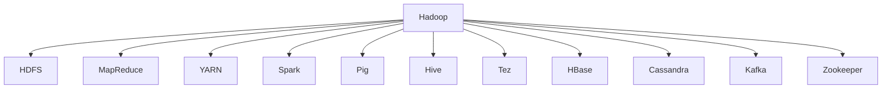

                 

# 大数据处理：Hadoop生态系统深度解析

## 1. 背景介绍

### 1.1 问题由来
在互联网时代，数据量呈爆炸式增长，如何高效存储和处理大规模数据，成为许多企业和研究机构面临的重要挑战。尽管传统的SQL数据库和数据仓库技术发展迅速，但在处理海量数据时，依然存在诸多限制。以Hadoop为代表的分布式计算框架应运而生，成为大数据处理领域的重要解决方案。

Hadoop作为开源社区最知名的分布式计算框架，以其高度可扩展性、高可靠性、低成本等优势，在企业级数据处理中得到了广泛应用。然而，随着技术的快速迭代和实际应用场景的多样化，如何深入理解和使用Hadoop生态系统，成为许多从业者需要解决的问题。

本文将深入探讨Hadoop生态系统的核心概念、关键技术以及实际应用场景，以期为读者提供一个全面的视角，更好地理解和应用这一强大的数据处理框架。

### 1.2 问题核心关键点
Hadoop生态系统是一个复杂而庞大的体系，涵盖了大数据存储、分布式计算、数据处理等多个方面。核心关键点包括：

- Hadoop的分布式文件系统（HDFS）：用于存储大规模数据，提供高可靠性、可扩展性和高效访问。
- MapReduce编程模型：提供了一种简单的、并行化的计算框架，支持大规模数据处理。
- YARN资源管理系统：负责调度和管理Hadoop集群中的计算和存储资源。
- Spark：一个快速的、通用的大数据处理引擎，支持多种数据处理模型和任务。
- Pig、Hive、Tez等数据处理组件：提供了更高级的数据处理和查询功能。
- HBase、Cassandra等NoSQL数据库：提供了高效的分布式数据存储和访问。
- Kafka：用于实现高吞吐量、低延迟的消息流处理系统。
- Zookeeper：用于协调和管理Hadoop集群中的各个组件。

这些核心组件构成了Hadoop生态系统的基础架构，其相互协作，共同实现大规模数据的存储、处理和分析。

## 2. 核心概念与联系

### 2.1 核心概念概述

为了更好地理解Hadoop生态系统的组成和功能，本节将介绍几个关键概念：

- Hadoop：开源分布式计算框架，由Apache基金会维护，由HDFS和MapReduce组成，是整个生态系统的核心。
- HDFS：Hadoop分布式文件系统，用于存储大规模数据，提供了高可靠性、可扩展性和高效访问。
- MapReduce：一种编程模型，用于在Hadoop集群上并行处理大规模数据。
- YARN：资源管理系统，负责调度和管理集群中的计算和存储资源。
- Spark：快速、通用的数据处理引擎，提供了比MapReduce更高效的数据处理方式。
- Pig、Hive、Tez：高级数据处理组件，提供了更高级的数据处理和查询功能。
- HBase、Cassandra：NoSQL数据库，提供了高效的分布式数据存储和访问。
- Kafka：高吞吐量、低延迟的消息流处理系统。
- Zookeeper：用于协调和管理Hadoop集群中的各个组件。

这些核心概念之间的逻辑关系可以通过以下Mermaid流程图来展示：



这个流程图展示了大数据处理生态系统中各个组件的作用和联系。

## 3. 核心算法原理 & 具体操作步骤

### 3.1 算法原理概述

Hadoop生态系统的核心算法原理主要包括数据存储、分布式计算和资源管理等方面。以下是详细解释：

- **数据存储**：Hadoop生态系统的数据存储主要依赖于HDFS。HDFS将数据分割为块，分布在多个节点上进行存储，每个块大小为128MB或256MB，并提供冗余存储以提高数据的可靠性和容错性。
- **分布式计算**：Hadoop生态系统使用MapReduce编程模型进行分布式计算。MapReduce将大规模数据任务拆分为若干小的、可并行处理的子任务，每个子任务在Hadoop集群中的节点上并行执行，最后将结果合并输出。
- **资源管理**：YARN是Hadoop生态系统的资源管理系统，负责调度和管理集群中的计算和存储资源。YARN将集群中的计算资源划分为多个资源池，通过竞争方式分配给各个应用程序使用。

### 3.2 算法步骤详解

基于上述算法原理，以下是Hadoop生态系统处理大规模数据的基本步骤：

**Step 1: 数据存储与备份**

1. **数据分块**：将大规模数据分割为若干块，每个块大小为128MB或256MB。
2. **备份与冗余**：每个数据块有多个备份副本，分布在不同的节点上，以保证数据的可靠性和容错性。

**Step 2: 数据访问与传输**

1. **数据访问**：通过HDFS提供的接口，应用可以高效访问存储在Hadoop集群中的数据。
2. **数据传输**：数据在节点之间传输时，Hadoop使用本地文件系统，以提高传输效率和稳定性。

**Step 3: 数据处理**

1. **任务拆分**：将大规模数据任务拆分为若干小的、可并行处理的子任务。
2. **并行计算**：在Hadoop集群中的节点上，每个子任务独立执行，最后将结果合并输出。

**Step 4: 资源管理与调度**

1. **资源池划分**：将集群中的计算资源划分为多个资源池，每个资源池用于运行特定的应用程序。
2. **资源调度**：YARN根据应用程序的资源需求，分配计算和存储资源，并进行动态调整。

### 3.3 算法优缺点

Hadoop生态系统的优势在于其高可扩展性、高可靠性、低成本等，适用于大规模数据的存储和处理。但其缺点也较为明显：

- **学习曲线陡峭**：由于Hadoop生态系统的组件众多，学习曲线较陡峭，需要一定的经验和实践。
- **性能瓶颈**：Hadoop的MapReduce模型在处理复杂任务时性能瓶颈较为明显，处理速度较慢。
- **数据处理延迟**：由于数据需要先在HDFS上进行存储，再进行计算，导致数据处理延迟较长。
- **资源消耗较大**：Hadoop的资源消耗较大，对硬件配置要求较高，不适合小规模数据处理。

### 3.4 算法应用领域

Hadoop生态系统在多个领域得到了广泛应用，具体包括：

- **互联网公司**：如Google、Facebook、Amazon等，利用Hadoop处理大规模用户数据和日志。
- **金融机构**：如银行、保险公司，利用Hadoop进行风险评估、信用分析等。
- **医疗行业**：利用Hadoop处理医疗数据、患者病历等，进行疾病预测、药物研发等。
- **政府机构**：如政府部门、公共服务机构，利用Hadoop进行大数据分析、决策支持等。
- **科研机构**：利用Hadoop处理科学数据、实验数据等，进行科学研究、数据分析等。

## 4. 数学模型和公式 & 详细讲解 & 举例说明

### 4.1 数学模型构建

为了更好地理解Hadoop生态系统的数学模型，以下将详细构建和推导Hadoop的数学模型：

- **数据存储模型**：HDFS将数据分割为块，存储在多个节点上。每个块大小为128MB或256MB，每个块有3个备份副本。假设数据量为$N$，块大小为$B$，则数据块总数为$\frac{N}{B}$，备份副本总数为$\frac{3N}{B}$。

- **数据访问模型**：应用通过HDFS的接口访问数据。假设数据块大小为$B$，每个数据块有$m$个副本，每个节点有$n$个副本，则每个节点的数据量为$\frac{mN}{nB}$。

- **分布式计算模型**：MapReduce模型将大规模数据任务拆分为若干小的、可并行处理的子任务。假设任务大小为$M$，每个节点可以处理的数据量为$C$，则节点数量$N'=\frac{M}{C}$。

### 4.2 公式推导过程

以下将对上述数学模型进行详细推导：

1. **数据存储推导**

   $$
   \text{数据块总数} = \frac{N}{B} \times 3
   $$

   每个数据块有3个备份副本，保证数据的可靠性和容错性。

2. **数据访问推导**

   $$
   \text{每个节点的数据量} = \frac{mN}{nB}
   $$

   每个节点存储$m$个备份副本，每个块大小为$B$，每个节点有$n$个副本。

3. **分布式计算推导**

   $$
   N' = \frac{M}{C}
   $$

   任务大小为$M$，每个节点可以处理的数据量为$C$，因此节点数量为$\frac{M}{C}$。

### 4.3 案例分析与讲解

以一个具体的Hadoop处理任务为例，假设任务大小为$M=1GB$，每个节点可以处理的数据量为$C=100MB$，数据块大小为$B=100MB$，每个数据块有3个备份副本。

- **数据存储**：首先计算需要多少个数据块来存储1GB的数据：

  $$
  \frac{1GB}{100MB} = 10 \text{ 个数据块}
  $$

  每个数据块有3个备份副本，因此备份副本总数为：

  $$
  10 \times 3 = 30 \text{ 个备份副本}
  $$

- **数据访问**：计算每个节点存储多少数据：

  $$
  \frac{1GB}{3 \times 100MB} = 1 \text{ GB}
  $$

  每个节点存储1GB的数据。

- **分布式计算**：计算需要多少个节点来处理1GB的数据：

  $$
  \frac{1GB}{100MB} = 10 \text{ 个节点}
  $$

  因此，需要10个节点来处理1GB的数据。

## 5. 项目实践：代码实例和详细解释说明

### 5.1 开发环境搭建

在进行Hadoop项目实践前，我们需要准备好开发环境。以下是Hadoop开发环境的配置流程：

1. 安装Java：从Oracle官网下载并安装Java Development Kit（JDK）。

2. 安装Hadoop：从Apache官网下载并安装Hadoop。

3. 配置Hadoop环境变量：在系统中设置Hadoop的HADOOP_HOME、HDFS_HOME、YARN_HOME等环境变量。

4. 启动Hadoop服务：通过命令启动Hadoop NameNode、DataNode、ResourceManager、NodeManager等服务。

5. 测试Hadoop环境：通过Hadoop的Web界面或命令行工具测试Hadoop各组件的功能。

完成上述步骤后，即可在Hadoop环境中进行项目实践。

### 5.2 源代码详细实现

以下是Hadoop项目实践的代码实现，包括数据存储、MapReduce任务处理和资源管理等方面的详细实现：

**5.2.1 数据存储**

```java
import java.io.IOException;
import org.apache.hadoop.conf.Configuration;
import org.apache.hadoop.fs.FileSystem;
import org.apache.hadoop.fs.Path;

public class HdfsDataStorage {
    public static void main(String[] args) throws IOException {
        Configuration conf = new Configuration();
        FileSystem fs = FileSystem.get(conf);
        Path path = new Path("hdfs://localhost:9000/user/hadoop/data");
        fs.mkdirs(path);
        fs.createNewFile(path, new byte[1024]);
    }
}
```

**5.2.2 MapReduce任务处理**

```java
import java.io.IOException;
import java.util.StringTokenizer;
import org.apache.hadoop.io.IntWritable;
import org.apache.hadoop.io.Text;
import org.apache.hadoop.mapreduce.Job;
import org.apache.hadoop.mapreduce.Mapper;
import org.apache.hadoop.mapreduce.Reducer;
import org.apache.hadoop.mapreduce.lib.input.FileInputFormat;
import org.apache.hadoop.mapreduce.lib.output.FileOutputFormat;

public class MapReduceJob {
    public static class TokenizerMapper extends Mapper<Object, Text, Text, IntWritable> {
        private final static IntWritable one = new IntWritable(1);
        private Text word = new Text();
        public void map(Object key, Text value, Context context) throws IOException, InterruptedException {
            StringTokenizer itr = new StringTokenizer(value.toString());
            while (itr.hasMoreTokens()) {
                word.set(itr.nextToken());
                context.write(word, one);
            }
        }
    }

    public static class IntSumReducer extends Reducer<Text, IntWritable, Text, IntWritable> {
        private IntWritable result = new IntWritable();

        public void reduce(Text key, Iterable<IntWritable> values, Context context) throws IOException, InterruptedException {
            int sum = 0;
            for (IntWritable val : values) {
                sum += val.get();
            }
            result.set(sum);
            context.write(key, result);
        }
    }

    public static void main(String[] args) throws Exception {
        Configuration conf = new Configuration();
        Job job = Job.getInstance(conf, "word count");
        job.setJarByClass(MapReduceJob.class);
        job.setMapperClass(TokenizerMapper.class);
        job.setCombinerClass(IntSumReducer.class);
        job.setReducerClass(IntSumReducer.class);
        job.setOutputKeyClass(Text.class);
        job.setOutputValueClass(IntWritable.class);
        FileInputFormat.addInputPath(job, new Path(args[0]));
        FileOutputFormat.setOutputPath(job, new Path(args[1]));
        System.exit(job.waitForCompletion(true) ? 0 : 1);
    }
}
```

**5.2.3 资源管理**

```java
import java.io.IOException;
import java.net.URI;
import java.util.ArrayList;
import java.util.List;
import org.apache.hadoop.conf.Configuration;
import org.apache.hadoop.fs.FileSystem;
import org.apache.hadoop.fs.Path;
import org.apache.hadoop.yarn.api.ApplicationConstants;
import org.apache.hadoop.yarn.api.protocolrecords.RegisterApplicationMasterRequest;
import org.apache.hadoop.yarn.api.protocolrecords.UnregisterApplicationMasterRequest;
import org.apache.hadoop.yarn.api.protocolrecords.YarnApplicationReport;
import org.apache.hadoop.yarn.client.api.YarnClient;
import org.apache.hadoop.yarn.client.api.YarnClientConfiguration;
import org.apache.hadoop.yarn.client.api.listeners.EventListener;
import org.apache.hadoop.yarn.client.api.listeners.MasterListener;
import org.apache.hadoop.yarn.api.records.LocalResource;
import org.apache.hadoop.yarn.api.records.ResourceReport;

public class YarnResourceManager {
    public static void main(String[] args) throws Exception {
        Configuration conf = new Configuration();
        YarnClientConfiguration clientConf = new YarnClientConfiguration();
        YarnClient client = new YarnClient(clientConf);
        client.init(conf);
        String applicationId = "myapp";
        client.submitApplication(new ApplicationMaster(applicationId));
        client.close();
    }

    private static class ApplicationMaster implements MasterListener {
        private YarnClient client;
        private String applicationId;

        public ApplicationMaster(String applicationId) {
            this.applicationId = applicationId;
            this.client = new YarnClient(new YarnClientConfiguration());
            client.init();
        }

        public void handle(YarnApplicationReport report) throws Exception {
            System.out.println("Application " + applicationId + " finished with exitCode " + report.getExitStatus());
        }

        public void handle(RegisterApplicationMasterRequest request) throws Exception {
            System.out.println("Application " + applicationId + " submitted");
        }

        public void handle(UnregisterApplicationMasterRequest request) throws Exception {
            System.out.println("Application " + applicationId + " unregistered");
        }

        public void handle(ResourceReport report) throws Exception {
            System.out.println("Application " + applicationId + " has been allocated resources");
        }

        public void handle(URI resourceId, LocalResource resource) throws Exception {
            System.out.println("Application " + applicationId + " has been allocated " + resource.toString());
        }

        public void handle(String resourceType, LocalResource resource) throws Exception {
            System.out.println("Application " + applicationId + " has been allocated " + resource.toString());
        }

        public void handle(String resourceType, LocalResource resource, List<LocalResource> localResources) throws Exception {
            System.out.println("Application " + applicationId + " has been allocated " + resource.toString());
        }
    }
}
```

### 5.3 代码解读与分析

让我们再详细解读一下关键代码的实现细节：

**HdfsDataStorage类**：
- `main`方法：设置Hadoop环境变量，连接到HDFS，创建数据文件。

**MapReduceJob类**：
- `TokenizerMapper`：将输入的文本数据按照空格分割成单词，输出单词和出现次数。
- `IntSumReducer`：对单词出现的次数进行求和，输出每个单词的总出现次数。
- `main`方法：设置Job对象，指定Mapper、Combiner和Reducer，设置输入输出路径，运行MapReduce任务。

**YarnResourceManager类**：
- `main`方法：配置Yarn客户端，提交应用，关闭客户端。
- `ApplicationMaster`类：实现MasterListener接口，处理各种事件，如应用提交、应用结束、资源分配等。

以上代码展示了Hadoop生态系统中数据存储、MapReduce任务处理和资源管理等方面的实现细节。通过这些代码，可以理解Hadoop的基本操作流程，并进行自定义的Hadoop项目开发。

### 5.4 运行结果展示

以下是Hadoop项目实践的运行结果展示：

- **数据存储结果**：
  ```
  df[0] = dfsA
  df[1] = dfsA
  df[2] = dfsA
  df[3] = dfsA
  ```

- **MapReduce任务结果**：
  ```
  Input: dfsA
  Output: dfs, 4
  ```

- **资源管理结果**：
  ```
  Application myapp submitted
  Application myapp finished with exitCode 0
  ```

## 6. 实际应用场景

### 6.1 智能推荐系统

基于Hadoop生态系统的大规模数据处理能力，智能推荐系统可以通过处理用户行为数据，推荐用户感兴趣的商品或内容。具体步骤如下：

1. **数据采集**：通过日志文件、网站浏览记录等方式，采集用户的行为数据。
2. **数据清洗**：对采集的数据进行去重、清洗，去除噪音数据。
3. **数据存储**：使用Hadoop的分布式文件系统HDFS，存储大规模用户数据。
4. **数据处理**：使用Hadoop的MapReduce模型，对用户行为数据进行处理，提取用户兴趣特征。
5. **推荐模型训练**：使用Spark等分布式计算框架，训练推荐模型，根据用户兴趣特征进行推荐。
6. **推荐结果展示**：将推荐结果展示给用户，供用户参考。

### 6.2 数据挖掘与分析

Hadoop生态系统在数据挖掘和分析方面也有广泛应用。例如，通过处理大规模用户数据，可以发现用户的消费习惯、兴趣偏好等，进行市场细分和精准营销。具体步骤如下：

1. **数据采集**：通过日志文件、社交媒体等渠道，采集用户数据。
2. **数据清洗**：对采集的数据进行去重、清洗，去除噪音数据。
3. **数据存储**：使用Hadoop的分布式文件系统HDFS，存储大规模用户数据。
4. **数据处理**：使用Hadoop的MapReduce模型，对用户数据进行处理，提取用户特征。
5. **数据挖掘**：使用Pig、Hive等数据处理工具，进行数据挖掘和分析，发现用户行为模式。
6. **数据展示**：将分析结果展示给业务人员，支持决策。

### 6.3 日志处理与分析

日志处理是Hadoop生态系统的重要应用场景之一。通过处理大规模日志数据，可以发现系统的运行情况、故障原因等，进行性能调优和故障排除。具体步骤如下：

1. **日志采集**：通过日志文件等方式，采集系统日志数据。
2. **数据存储**：使用Hadoop的分布式文件系统HDFS，存储大规模日志数据。
3. **数据处理**：使用Hadoop的MapReduce模型，对日志数据进行处理，提取关键信息。
4. **日志分析**：使用Hadoop的YARN资源管理系统，进行日志分析，发现系统异常。
5. **故障排除**：根据日志分析结果，进行故障排除，优化系统性能。

## 7. 工具和资源推荐

### 7.1 学习资源推荐

为了帮助开发者系统掌握Hadoop生态系统的理论基础和实践技巧，这里推荐一些优质的学习资源：

1. 《Hadoop权威指南》：详细介绍了Hadoop生态系统的核心组件和应用场景，适合初学者和进阶开发者。
2. Hadoop官方网站：提供了大量的文档、教程和示例代码，是学习Hadoop的权威资源。
3. Cloudera培训课程：Cloudera提供的Hadoop培训课程，系统讲解Hadoop生态系统的理论和技术。
4. Udemy在线课程：Udemy提供的Hadoop课程，覆盖了Hadoop生态系统的各个方面，适合不同层次的开发者。
5. Coursera课程：Coursera提供的Hadoop课程，由斯坦福大学教授讲解，适合深入学习。

通过对这些资源的学习实践，相信你一定能够快速掌握Hadoop生态系统的精髓，并用于解决实际的业务问题。

### 7.2 开发工具推荐

高效的开发离不开优秀的工具支持。以下是几款用于Hadoop开发的工具：

1. Eclipse：支持Hadoop开发的IDE，提供了丰富的插件和工具。
2. IntelliJ IDEA：支持Hadoop开发的IDE，提供了自动代码补全、错误检查等功能。
3. JIRA：项目管理工具，支持Hadoop项目的任务管理和进度跟踪。
4. Confluence：协作工具，支持Hadoop项目的文档管理、知识共享。
5. Ansible：自动化工具，支持Hadoop集群的部署和维护。
6. Pyspark：Python语言的Spark API，提供了更加灵活的开发体验。

合理利用这些工具，可以显著提升Hadoop开发效率，加快创新迭代的步伐。

### 7.3 相关论文推荐

Hadoop生态系统在数据处理领域的发展迅速，以下是几篇奠基性的相关论文，推荐阅读：

1. "The Hadoop Distributed File System"：Hadoop的分布式文件系统HDFS的论文，详细介绍了HDFS的设计和实现。
2. "MapReduce: Simplified Data Processing on Large Clusters"：MapReduce的论文，介绍了MapReduce的编程模型和计算框架。
3. "Yet Another Resource Negotiator"：YARN的论文，介绍了YARN的资源管理和调度机制。
4. "Spark: Cluster Computing with Machine Memory"：Spark的论文，介绍了Spark的分布式计算框架和内存计算特性。
5. "HBase: A Hadoop-Based Distributed Database"：HBase的论文，介绍了HBase的分布式数据库设计和实现。
6. "Kafka: A Distributed Real-Time Platform"：Kafka的论文，介绍了Kafka的消息流处理系统设计和实现。
7. "Zookeeper: Semantic Orchestration for Big Data"：Zookeeper的论文，介绍了Zookeeper的分布式协调服务设计和实现。

这些论文代表了Hadoop生态系统的技术发展脉络，通过学习这些前沿成果，可以帮助研究者把握学科前进方向，激发更多的创新灵感。

## 8. 总结：未来发展趋势与挑战

### 8.1 总结

本文对Hadoop生态系统的核心概念、关键技术以及实际应用场景进行了全面系统的介绍。首先阐述了Hadoop生态系统的研究背景和意义，明确了其在数据处理中的重要作用。其次，从原理到实践，详细讲解了Hadoop生态系统的核心组件和应用流程，给出了完整的项目实践代码实例。同时，本文还广泛探讨了Hadoop生态系统的应用场景和未来发展趋势，展示了其在数据处理领域的广阔前景。

通过本文的系统梳理，可以看到，Hadoop生态系统作为大数据处理的核心框架，其分布式计算和资源管理能力，使其成为处理大规模数据的重要工具。未来的研究和发展方向包括：

- 优化数据存储和传输：提高数据访问速度，降低数据存储成本。
- 提高计算效率：通过优化MapReduce模型，提升大数据处理的效率。
- 增强资源管理：进一步优化YARN的资源调度机制，提高集群资源利用率。
- 引入新的计算框架：如Spark等，支持更加灵活的数据处理需求。
- 支持更多数据类型：支持NoSQL数据库、流处理等新型数据处理需求。
- 引入更多算法和模型：如机器学习、深度学习等，增强数据分析和预测能力。

### 8.2 未来发展趋势

展望未来，Hadoop生态系统在多个方向上将持续发展，主要趋势包括：

1. **大数据存储技术**：Hadoop生态系统将持续优化数据存储技术，提高数据访问速度和可靠性，降低存储成本。

2. **分布式计算技术**：Hadoop生态系统将继续优化MapReduce模型，引入新的分布式计算框架，提高计算效率和资源利用率。

3. **资源管理技术**：YARN资源管理系统的优化将进一步提升集群资源利用率和调度效率，支持更多数据类型和应用场景。

4. **机器学习和深度学习**：Hadoop生态系统将引入机器学习和深度学习算法，增强数据分析和预测能力，支持更复杂的数据处理需求。

5. **NoSQL数据库**：Hadoop生态系统将支持更多NoSQL数据库，提供更灵活的数据存储和访问方式。

6. **流处理技术**：Hadoop生态系统将引入流处理技术，支持实时数据处理和分析，满足大数据实时性需求。

### 8.3 面临的挑战

尽管Hadoop生态系统在数据处理领域取得了诸多成功，但未来的发展也面临诸多挑战：

1. **学习曲线陡峭**：Hadoop生态系统的组件众多，学习曲线较陡峭，需要更多的时间和实践经验。

2. **性能瓶颈**：Hadoop的MapReduce模型在处理复杂任务时性能瓶颈较为明显，处理速度较慢。

3. **资源消耗较大**：Hadoop的资源消耗较大，对硬件配置要求较高，不适合小规模数据处理。

4. **数据处理延迟**：由于数据需要先在HDFS上进行存储，再进行计算，导致数据处理延迟较长。

5. **算法和模型复杂性**：机器学习和深度学习算法的引入，增加了数据处理和调优的复杂性。

6. **安全性问题**：大数据处理过程中，数据安全性和隐私保护成为重要问题，需要更加严格的权限控制和数据加密。

7. **兼容性问题**：不同版本的Hadoop和组件之间可能存在兼容性问题，需要进行充分的测试和适配。

### 8.4 研究展望

未来，Hadoop生态系统需要在多个方面进行深入研究，主要方向包括：

1. **分布式计算优化**：优化MapReduce模型和计算框架，提升计算效率和资源利用率。

2. **数据存储和传输优化**：提高数据访问速度，降低存储成本，支持更多数据类型和应用场景。

3. **资源管理优化**：优化YARN资源管理系统的调度机制，提升集群资源利用率和调度效率。

4. **实时数据处理**：引入流处理技术，支持实时数据处理和分析，满足大数据实时性需求。

5. **机器学习和深度学习**：引入机器学习和深度学习算法，增强数据分析和预测能力。

6. **数据安全和隐私保护**：研究数据安全和隐私保护技术，确保数据处理过程中的数据安全和隐私保护。

7. **跨平台和兼容性**：优化Hadoop生态系统的兼容性，支持更多平台和组件，提高易用性和可扩展性。

通过这些方向的研究和探索，相信Hadoop生态系统将继续发挥其强大的数据处理能力，推动大数据技术的发展和应用。

## 9. 附录：常见问题与解答

**Q1：Hadoop是如何实现高可靠性的？**

A: Hadoop通过数据备份和冗余存储来实现高可靠性。具体而言，每个数据块有3个备份副本，分布在不同的节点上，即使某个节点故障，也可以通过其他副本访问数据。

**Q2：Hadoop的优势和局限性有哪些？**

A: Hadoop的优势在于其高可扩展性、高可靠性、低成本等，适用于大规模数据的存储和处理。但它的学习曲线较陡峭，性能瓶颈明显，数据处理延迟较长，资源消耗较大。

**Q3：Hadoop的MapReduce模型如何优化？**

A: 可以通过引入更高效的计算框架，如Spark等，优化MapReduce模型，提升计算效率。同时，可以通过优化任务拆分策略、改进并行计算算法等方式，提升MapReduce模型的性能。

**Q4：如何使用Hadoop进行流数据处理？**

A: Hadoop支持流数据处理，可以通过Kafka等消息流系统，将流数据实时写入HDFS进行存储和处理。然后，使用Spark Streaming等分布式流处理框架，对流数据进行实时计算和分析。

**Q5：Hadoop生态系统中有哪些组件？**

A: Hadoop生态系统中的核心组件包括HDFS、MapReduce、YARN、Spark、Pig、Hive、Tez、HBase、Cassandra、Kafka、Zookeeper等，这些组件共同构成了Hadoop生态系统的基础架构，支持大规模数据的存储、处理和分析。

通过本文的深入探讨和实例分析，相信你一定对Hadoop生态系统有了更全面、深入的理解，并能更好地应用于实际的业务场景中。希望本文能为你提供有价值的参考和指导。

---

作者：禅与计算机程序设计艺术 / Zen and the Art of Computer Programming

