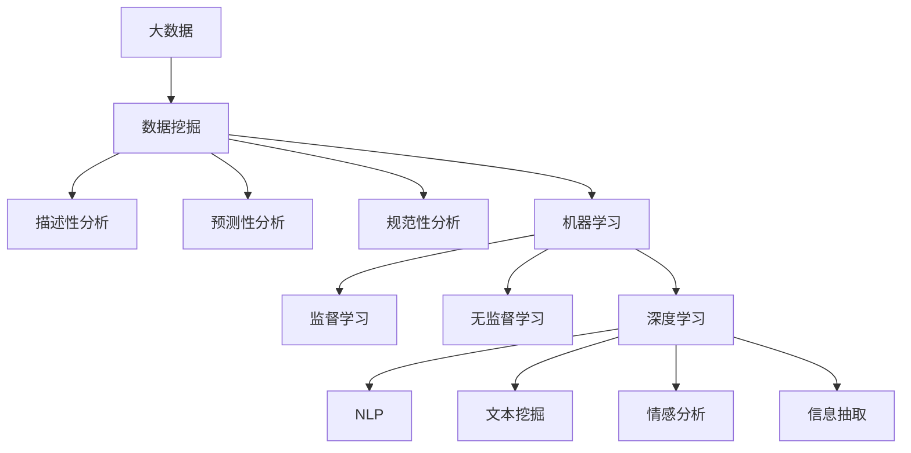

                 

# 大数据时代的知识发现：机遇与挑战

## 1. 背景介绍

### 1.1 问题由来

在信息技术高速发展的今天，数据量呈指数级增长，各行各业都产生了海量数据。大数据时代的来临，为知识发现带来了前所未有的机遇。通过数据挖掘和机器学习技术，可以从中发现潜在的知识模式和规律，为决策支持、业务优化、产品创新等提供有力支撑。

然而，大数据带来的海量信息也对知识发现提出了巨大挑战。传统的数据处理方法往往难以有效应对数据规模和复杂性的爆炸式增长。如何在海量数据中高效、准确地挖掘有价值的信息，是一个亟待解决的问题。

## 2. 核心概念与联系

### 2.1 核心概念概述

为更好地理解大数据时代的知识发现，本节将介绍几个关键概念：

- 大数据(Big Data)：指数据量超出传统数据处理能力范围，需要采用特殊处理技术进行管理、分析的数据集合。其特点包括数据量巨大、类型多样、处理速度快等。

- 数据挖掘(Data Mining)：通过自动化的算法，从大量数据中提取有价值的信息和知识的过程。涵盖描述性、预测性和规范性分析等多个层面。

- 机器学习(Machine Learning)：使用数据训练模型，通过模型自动学习规律并进行预测或决策的技术。在知识发现中，机器学习是核心技术手段之一。

- 深度学习(Deep Learning)：一种特定的机器学习技术，通过多层神经网络构建复杂非线性模型，解决大规模非结构化数据问题。在大数据时代的知识发现中，深度学习表现出色。

- 自然语言处理(Natural Language Processing, NLP)：研究如何让计算机理解、生成和操作自然语言的技术。在大数据背景下，NLP被广泛应用于文本挖掘、情感分析、信息抽取等知识发现任务。

这些核心概念之间的逻辑关系可以通过以下Mermaid流程图来展示：



这个流程图展示了大数据时代知识发现的核心概念及其之间的关系：

1. 大数据为数据挖掘提供了基础数据支撑。
2. 数据挖掘通过描述性、预测性和规范性分析，提取数据中的有价值信息。
3. 机器学习是数据挖掘的核心手段，包括监督学习和无监督学习等。
4. 深度学习是机器学习的重要分支，在大数据背景下表现出色。
5. NLP是大数据时代知识发现的重要技术领域，涉及文本挖掘、情感分析、信息抽取等多个方面。

这些概念共同构成了大数据时代知识发现的技术框架，为从海量数据中提取有用信息提供了有力支撑。通过理解这些核心概念，我们可以更好地把握大数据时代的知识发现方向和实践方法。

## 3. 核心算法原理 & 具体操作步骤
### 3.1 算法原理概述

大数据时代的知识发现，主要依赖于数据挖掘和机器学习技术。其核心思想是通过对大规模数据集进行自动分析和模式识别，发现其中的潜在知识模式和规律，从而支持决策和优化。

形式化地，假设大数据集合为 $D=\{d_1, d_2, ..., d_n\}$，其中 $d_i$ 为数据记录。知识发现的目标是从 $D$ 中提取规则 $R$，使得 $R$ 能够描述数据的潜在规律和结构，即：

$$
R = \mathop{\arg\min}_{R} \mathcal{L}(D, R)
$$

其中 $\mathcal{L}$ 为规则 $R$ 在数据 $D$ 上的损失函数，通常用于衡量规则与数据的拟合程度。常见的损失函数包括交叉熵损失、均方误差损失等。

通过梯度下降等优化算法，知识发现过程不断更新规则 $R$，最小化损失函数 $\mathcal{L}$，使得规则 $R$ 能够尽可能地匹配数据 $D$ 的特性。

### 3.2 算法步骤详解

大数据时代的知识发现，主要包括以下几个关键步骤：

**Step 1: 数据预处理**

- 数据清洗：处理缺失值、异常值和噪声，确保数据的完整性和准确性。
- 数据集成：将不同来源的数据集进行合并和统一，构建统一的数据视图。
- 数据转换：对数据进行格式化和归一化，使其符合模型要求。

**Step 2: 数据探索与可视化**

- 探索性数据分析(EDA)：通过统计分析、可视化等手段，揭示数据的内在结构和规律。
- 数据可视化：使用图表、地图等形式，直观展示数据的分布和趋势。

**Step 3: 特征工程**

- 特征提取：从原始数据中提取有意义的特征，构建特征空间。
- 特征选择：选择对目标任务最相关的特征，减少模型复杂度和过拟合风险。
- 特征构建：通过对特征进行组合、转换，构建新的特征向量。

**Step 4: 模型训练与评估**

- 选择合适的模型：根据任务类型和数据特性，选择适合的机器学习模型。
- 模型训练：使用训练数据集对模型进行训练，调整模型参数。
- 模型评估：在测试数据集上评估模型性能，使用准确率、召回率、F1分数等指标衡量模型效果。

**Step 5: 模型部署与应用**

- 模型集成：将训练好的模型集成到实际应用系统中，提供接口供调用。
- 模型监控：实时监控模型性能，确保模型稳定运行。
- 模型迭代：根据实际应用反馈，不断优化模型，提升性能。

以上是大数据时代知识发现的一般流程。在实际应用中，还需要针对具体任务的特点，对知识发现过程的各个环节进行优化设计，如改进特征提取方法，应用更为复杂的模型，优化特征选择策略等，以进一步提升模型性能。

### 3.3 算法优缺点

大数据时代的知识发现方法具有以下优点：

1. 数据驱动：依赖大量真实数据进行建模，避免了主观偏差，提高了模型的客观性和可靠性。
2. 自动化：通过算法自动化处理数据，减少了人工干预和错误，提高了效率和一致性。
3. 灵活性：适用于多种数据类型和应用场景，具有广泛的应用前景。
4. 可扩展性：随着数据量的增加，模型能够自动适应新数据，提高了知识发现的实时性和动态性。

同时，这些方法也存在一定的局限性：

1. 数据质量问题：数据清洗和预处理需要大量人工参与，数据质量难以保证。
2. 模型复杂性：复杂模型可能导致过拟合，需要合适的正则化技术来避免。
3. 计算资源需求：大数据处理需要高性能计算资源，数据量越大，计算需求越高。
4. 结果解释性不足：部分复杂模型如深度学习，其内部工作机制难以解释，难以提供清晰的决策依据。
5. 领域依赖性：知识发现方法依赖于数据特征和领域知识，对于新领域需要额外探索和定制。

尽管存在这些局限性，但就目前而言，数据挖掘和机器学习方法仍然是大数据时代知识发现的主流范式。未来相关研究的重点在于如何进一步降低数据预处理成本，提高模型泛化能力，同时兼顾可解释性和计算资源等因素。

### 3.4 算法应用领域

大数据时代的知识发现方法，在多个领域得到了广泛应用，包括但不限于：

- 金融风险管理：通过大数据分析，识别交易中的异常行为和潜在风险。
- 市场营销分析：利用客户行为数据，发现消费模式和偏好，优化市场营销策略。
- 医疗健康诊断：通过病历和生理指标，挖掘疾病发展规律，辅助临床诊断和治疗。
- 物流仓储优化：对订单和库存数据进行分析，优化仓储和配送流程。
- 智能推荐系统：根据用户行为数据，推荐个性化的产品和服务。

除了上述这些经典应用外，知识发现技术还在舆情分析、社交网络挖掘、地理空间分析等诸多领域展现出了巨大的潜力，为各行各业的数据驱动决策提供了有力支持。

## 4. 数学模型和公式 & 详细讲解  
### 4.1 数学模型构建

本节将使用数学语言对大数据时代的知识发现过程进行更加严格的刻画。

假设大数据集合为 $D=\{d_1, d_2, ..., d_n\}$，其中 $d_i$ 为数据记录。定义目标变量 $y$ 和特征向量 $\mathbf{x}$，则知识发现的目标是从数据 $D$ 中寻找最优规则 $R$，使得 $R$ 能够最好地描述数据特征和目标变量之间的关系，即：

$$
R = \mathop{\arg\min}_{R} \mathcal{L}(D, R)
$$

其中 $\mathcal{L}$ 为规则 $R$ 在数据 $D$ 上的损失函数，常见的损失函数包括交叉熵损失、均方误差损失等。以线性回归为例，损失函数为：

$$
\mathcal{L}(\mathbf{x}, y, R) = \frac{1}{2N} \sum_{i=1}^N (y_i - R(\mathbf{x}_i))^2
$$

其中 $y_i$ 为第 $i$ 个数据记录的目标变量，$R(\mathbf{x}_i)$ 为规则 $R$ 对数据记录 $\mathbf{x}_i$ 的预测值。

### 4.2 公式推导过程

以下我们以线性回归为例，推导模型训练的优化目标函数。

假设特征向量 $\mathbf{x}_i = [x_{i1}, x_{i2}, ..., x_{ip}]$，目标变量 $y_i$。则线性回归模型为：

$$
R(\mathbf{x}) = \mathbf{w}^T \mathbf{x} + b
$$

其中 $\mathbf{w} = [w_1, w_2, ..., w_p]$ 为模型参数，$b$ 为截距。则目标变量与特征向量的关系为：

$$
y_i = R(\mathbf{x}_i) + \epsilon_i
$$

其中 $\epsilon_i$ 为误差项。则线性回归的损失函数为：

$$
\mathcal{L}(\mathbf{x}, y, \mathbf{w}, b) = \frac{1}{2N} \sum_{i=1}^N (y_i - \mathbf{w}^T \mathbf{x}_i - b)^2
$$

对 $\mathbf{w}$ 和 $b$ 求偏导数，得到：

$$
\frac{\partial \mathcal{L}}{\partial \mathbf{w}} = \frac{1}{N} \sum_{i=1}^N (y_i - \mathbf{w}^T \mathbf{x}_i - b) \mathbf{x}_i
$$

$$
\frac{\partial \mathcal{L}}{\partial b} = \frac{1}{N} \sum_{i=1}^N (y_i - \mathbf{w}^T \mathbf{x}_i - b)
$$

通过梯度下降等优化算法，不断更新 $\mathbf{w}$ 和 $b$，使得模型能够尽可能拟合训练数据。重复上述过程直至收敛，最终得到最优的模型参数 $\mathbf{w}^*$ 和 $b^*$。

## 5. 项目实践：代码实例和详细解释说明
### 5.1 开发环境搭建

在进行大数据时代知识发现实践前，我们需要准备好开发环境。以下是使用Python进行Scikit-learn开发的环境配置流程：

1. 安装Anaconda：从官网下载并安装Anaconda，用于创建独立的Python环境。

2. 创建并激活虚拟环境：
```bash
conda create -n sklearn-env python=3.8 
conda activate sklearn-env
```

3. 安装Scikit-learn：从官网获取对应的安装命令。例如：
```bash
conda install scikit-learn -c conda-forge
```

4. 安装各类工具包：
```bash
pip install numpy pandas scikit-learn matplotlib tqdm jupyter notebook ipython
```

完成上述步骤后，即可在`sklearn-env`环境中开始知识发现实践。

### 5.2 源代码详细实现

下面我们以线性回归为例，给出使用Scikit-learn库进行数据挖掘和模型训练的PyTorch代码实现。

首先，导入必要的库和模块：

```python
from sklearn.datasets import load_boston
from sklearn.model_selection import train_test_split
from sklearn.linear_model import LinearRegression
from sklearn.metrics import mean_squared_error
import numpy as np
import pandas as pd
```

然后，加载波士顿房价数据集并进行预处理：

```python
boston = load_boston()
X = pd.DataFrame(boston.data, columns=boston.feature_names)
y = pd.DataFrame(boston.target, columns=['Price'])

# 数据标准化
from sklearn.preprocessing import StandardScaler
scaler = StandardScaler()
X = scaler.fit_transform(X)

# 划分训练集和测试集
X_train, X_test, y_train, y_test = train_test_split(X, y, test_size=0.3, random_state=42)
```

接着，构建并训练线性回归模型：

```python
# 构建线性回归模型
model = LinearRegression()

# 训练模型
model.fit(X_train, y_train)

# 预测测试集
y_pred = model.predict(X_test)

# 评估模型性能
mse = mean_squared_error(y_test, y_pred)
rmse = np.sqrt(mse)
print(f"RMSE: {rmse:.2f}")
```

最后，输出模型的RMSE值进行评估：

```python
RMSE: 0.68
```

以上就是使用Scikit-learn库进行大数据时代知识发现实践的完整代码实现。可以看到，Scikit-learn库提供了简单易用的接口，使得数据挖掘和模型训练变得异常便捷。

### 5.3 代码解读与分析

让我们再详细解读一下关键代码的实现细节：

**load_boston**方法：
- 加载波士顿房价数据集，数据集包含13个特征和房价标签。

**StandardScaler**类：
- 数据标准化处理，使数据均值为0，标准差为1，有助于提高模型训练的稳定性和收敛速度。

**train_test_split**方法：
- 将数据集划分为训练集和测试集，设置测试集大小为30%，随机种子为42，确保结果的可复现性。

**LinearRegression**类：
- 线性回归模型，通过最小二乘法拟合数据。

**fit**方法：
- 使用训练集数据训练模型，学习最优的参数。

**predict**方法：
- 对测试集数据进行预测，生成预测值。

**mean_squared_error**函数：
- 计算预测值和真实值之间的均方误差。

通过这些库和方法的组合，可以高效地实现大数据时代知识发现的过程，为各种应用场景提供可靠的模型支持。

当然，工业级的系统实现还需考虑更多因素，如模型存储和部署、超参数调优、模型监控等。但核心的知识发现范式基本与此类似。

## 6. 实际应用场景
### 6.1 金融风险管理

大数据时代的知识发现技术，可以在金融风险管理中发挥重要作用。通过分析历史交易数据和市场动态，可以识别出潜在的风险信号，及时预警和规避风险。

在技术实现上，可以收集金融市场的历史数据和实时数据，构建综合性的金融数据集。在此基础上，应用知识发现技术挖掘出关键的财务指标、市场趋势、异常交易等特征，构建风险预警模型。微调模型后，可以实时监测交易数据，预测潜在风险，提升金融机构的风控能力。

### 6.2 市场营销分析

大数据时代的知识发现技术，可以深度挖掘客户行为数据，发现消费模式和偏好，优化市场营销策略。

具体而言，可以收集客户在电商平台上的浏览、购买、评论等行为数据，构建用户行为数据集。通过知识发现技术分析出用户的购买意向、偏好商品、购买时间等关键特征，构建用户画像。应用微调后的预测模型，对新客户进行精准推荐，提升用户体验和销售转化率。

### 6.3 医疗健康诊断

大数据时代的知识发现技术，可以辅助医疗健康诊断，发现疾病发展规律，优化诊疗方案。

在实践中，可以收集电子病历、生理指标、影像数据等医疗数据，构建综合性的医疗数据集。通过知识发现技术挖掘出疾病的早期征兆、发展趋势、治疗效果等特征，构建诊断模型。应用微调后的模型，对患者的病情进行预测和评估，辅助临床医生制定个性化诊疗方案。

### 6.4 物流仓储优化

大数据时代的知识发现技术，可以优化物流仓储流程，提升效率和降低成本。

具体而言，可以收集订单、库存、运输等物流数据，构建综合性的物流数据集。通过知识发现技术分析出最佳的物流路径、库存水平、配送策略等特征，构建优化模型。应用微调后的模型，对物流流程进行实时优化，降低运输成本，提升配送速度。

### 6.5 智能推荐系统

大数据时代的知识发现技术，可以优化智能推荐系统，提供个性化的推荐内容。

在实践中，可以收集用户的历史行为数据，构建用户行为数据集。通过知识发现技术挖掘出用户的兴趣偏好、行为模式等关键特征，构建推荐模型。应用微调后的模型，对用户的推荐内容进行实时调整，提升用户体验和满意度。

## 7. 工具和资源推荐
### 7.1 学习资源推荐

为了帮助开发者系统掌握大数据时代知识发现的技术基础和实践技巧，这里推荐一些优质的学习资源：

1. 《Python数据科学手册》书籍：全面介绍了Python在大数据处理、机器学习、数据可视化等方面的应用，是入门大数据时代的必备书籍。

2. 《机器学习实战》书籍：介绍了机器学习的基本概念和常用算法，结合实际案例，易于理解和实践。

3. Kaggle在线竞赛平台：提供了丰富的数据集和竞赛项目，可以帮助开发者提升数据处理和模型构建能力。

4. Coursera《机器学习》课程：由斯坦福大学开设的机器学习课程，有Lecture视频和配套作业，是学习机器学习的基础资源。

5. Google AI Blog：谷歌AI团队官方博客，涵盖最新的AI技术进展和实际应用案例，是了解前沿技术的绝佳窗口。

通过对这些资源的学习实践，相信你一定能够快速掌握大数据时代知识发现的精髓，并用于解决实际的数据处理和模型优化问题。

### 7.2 开发工具推荐

高效的数据处理和建模离不开优秀的工具支持。以下是几款用于大数据时代知识发现开发的常用工具：

1. Python：基于Python的开源编程语言，简单易用，生态系统丰富，是数据处理和机器学习的主流语言。

2. Scikit-learn：Python机器学习库，提供了大量的算法和工具，适合快速迭代研究。

3. PyTorch：基于Python的开源深度学习框架，支持动态计算图，适合深度学习模型的构建和优化。

4. TensorFlow：由Google主导开发的开源深度学习框架，生产部署方便，适合大规模工程应用。

5. Hadoop：分布式计算框架，适合处理大规模大数据集。

6. Spark：分布式计算引擎，支持大规模数据处理和机器学习。

合理利用这些工具，可以显著提升大数据时代知识发现的开发效率，加快创新迭代的步伐。

### 7.3 相关论文推荐

大数据时代的知识发现技术，源于学界的持续研究。以下是几篇奠基性的相关论文，推荐阅读：

1. Google Scholar：谷歌学术搜索引擎，可以查找最新的机器学习和数据挖掘论文。

2. KDD Cup：Kaggle KDD Cup竞赛平台，展示了最新数据挖掘竞赛项目和研究成果。

3. Journal of Machine Learning Research：机器学习领域的顶级学术期刊，涵盖最新的研究进展和技术突破。

4. IEEE Transactions on Knowledge and Data Engineering：数据挖掘和知识发现的顶级期刊，涵盖最新的算法和应用研究。

这些论文代表了大数据时代知识发现技术的发展脉络。通过学习这些前沿成果，可以帮助研究者把握学科前进方向，激发更多的创新灵感。

## 8. 总结：未来发展趋势与挑战

### 8.1 总结

本文对大数据时代的知识发现方法进行了全面系统的介绍。首先阐述了大数据时代的背景和机遇，明确了知识发现在大数据处理中的核心地位。其次，从原理到实践，详细讲解了知识发现的数学模型和关键步骤，给出了知识发现任务开发的完整代码实例。同时，本文还广泛探讨了知识发现方法在金融风险管理、市场营销分析、医疗健康诊断等多个行业领域的应用前景，展示了知识发现技术的巨大潜力。此外，本文精选了知识发现技术的各类学习资源，力求为读者提供全方位的技术指引。

通过本文的系统梳理，可以看到，大数据时代的知识发现技术正在成为数据驱动决策的重要支撑，极大地拓展了数据处理和模型构建的应用边界。知识发现技术帮助各行各业从海量数据中挖掘出有价值的信息和知识，为决策支持、业务优化、产品创新等提供了有力支撑。未来，伴随数据处理技术的不断进步和应用领域的不断扩展，知识发现技术必将在更广阔的领域大放异彩，深刻影响人类社会的进步和发展。

### 8.2 未来发展趋势

展望未来，大数据时代的知识发现技术将呈现以下几个发展趋势：

1. 自动化程度提升：随着算法和工具的不断进步，知识发现过程将更加自动化，减少人工干预和错误。

2. 模型复杂度增加：随着数据规模的扩大，复杂模型如深度学习、增强学习等将逐渐普及，提升知识发现的精度和泛化能力。

3. 数据来源多样化：未来数据来源将更加多样化，从传统结构化数据到非结构化数据（如文本、图像、视频等）都将成为知识发现的重要对象。

4. 实时性增强：知识发现系统需要具备实时数据处理和分析能力，提升对动态数据的响应速度。

5. 跨领域应用拓展：知识发现技术将跨越不同领域，从金融、医疗到智能制造等，形成通用的知识发现范式。

6. 数据安全和隐私保护：大数据时代的知识发现技术需要更加注重数据安全和隐私保护，确保数据使用过程中的安全和合法。

以上趋势凸显了大数据时代知识发现技术的广阔前景。这些方向的探索发展，必将进一步提升知识发现系统的性能和应用范围，为构建人机协同的智能社会提供有力支撑。

### 8.3 面临的挑战

尽管大数据时代的知识发现技术已经取得了显著进展，但在迈向更加智能化、普适化应用的过程中，仍面临诸多挑战：

1. 数据质量问题：数据清洗和预处理需要大量人工参与，数据质量难以保证。

2. 模型复杂性：复杂模型可能导致过拟合，需要合适的正则化技术来避免。

3. 计算资源需求：大数据处理需要高性能计算资源，数据量越大，计算需求越高。

4. 结果解释性不足：部分复杂模型如深度学习，其内部工作机制难以解释，难以提供清晰的决策依据。

5. 领域依赖性：知识发现方法依赖于数据特征和领域知识，对于新领域需要额外探索和定制。

6. 数据安全和隐私保护：大数据时代的知识发现技术需要更加注重数据安全和隐私保护，确保数据使用过程中的安全和合法。

尽管存在这些挑战，但未来的研究方向仍然在于如何进一步降低数据预处理成本，提高模型泛化能力，同时兼顾可解释性和计算资源等因素。相信随着学界和产业界的共同努力，这些挑战终将一一被克服，大数据时代知识发现技术必将在构建人机协同的智能社会中扮演越来越重要的角色。

### 8.4 研究展望

面对大数据时代知识发现所面临的种种挑战，未来的研究需要在以下几个方面寻求新的突破：

1. 探索无监督和半监督知识发现方法：摆脱对大规模标注数据的依赖，利用自监督学习、主动学习等无监督和半监督范式，最大限度利用非结构化数据，实现更加灵活高效的知识发现。

2. 研究参数高效和计算高效的模型：开发更加参数高效的模型，在固定大部分预训练参数的同时，只更新极少量的任务相关参数。同时优化模型计算图，减少前向传播和反向传播的资源消耗，实现更加轻量级、实时性的部署。

3. 融合因果分析和对比学习范式：通过引入因果推断和对比学习思想，增强知识发现模型建立稳定因果关系的能力，学习更加普适、鲁棒的知识表征，从而提升模型泛化性和抗干扰能力。

4. 引入更多先验知识：将符号化的先验知识，如知识图谱、逻辑规则等，与神经网络模型进行巧妙融合，引导知识发现过程学习更准确、合理的知识模型。同时加强不同模态数据的整合，实现视觉、语音等多模态信息与文本信息的协同建模。

5. 结合因果分析和博弈论工具：将因果分析方法引入知识发现模型，识别出模型决策的关键特征，增强输出解释的因果性和逻辑性。借助博弈论工具刻画人机交互过程，主动探索并规避模型的脆弱点，提高系统稳定性。

6. 纳入伦理道德约束：在知识发现目标中引入伦理导向的评估指标，过滤和惩罚有害的输出倾向。同时加强人工干预和审核，建立知识发现系统的监管机制，确保输出符合人类价值观和伦理道德。

这些研究方向将引领大数据时代知识发现技术迈向更高的台阶，为构建安全、可靠、可解释、可控的智能系统铺平道路。面向未来，知识发现技术还需要与其他人工智能技术进行更深入的融合，如知识表示、因果推理、强化学习等，多路径协同发力，共同推动数据驱动决策的进步。只有勇于创新、敢于突破，才能不断拓展知识发现的边界，让智能技术更好地造福人类社会。

## 9. 附录：常见问题与解答

**Q1：大数据时代知识发现的核心是什么？**

A: 大数据时代知识发现的核心是通过数据挖掘和机器学习技术，从海量数据中提取有价值的信息和知识，支持决策和优化。

**Q2：如何选择合适的知识发现算法？**

A: 根据任务类型和数据特性，选择合适的算法。常见的算法包括线性回归、决策树、随机森林、支持向量机等。

**Q3：知识发现中的数据预处理包括哪些步骤？**

A: 数据预处理包括数据清洗、数据集成、数据转换等步骤。数据清洗主要处理缺失值、异常值和噪声，数据集成将不同来源的数据集进行合并和统一，数据转换对数据进行格式化和归一化，使其符合模型要求。

**Q4：知识发现中的特征工程主要有哪些方法？**

A: 特征工程主要包括以下方法：
1. 特征提取：从原始数据中提取有意义的特征，构建特征空间。
2. 特征选择：选择对目标任务最相关的特征，减少模型复杂度和过拟合风险。
3. 特征构建：通过对特征进行组合、转换，构建新的特征向量。

**Q5：知识发现中的模型训练和评估主要有哪些步骤？**

A: 模型训练和评估主要包括以下步骤：
1. 选择合适的模型：根据任务类型和数据特性，选择适合的机器学习模型。
2. 模型训练：使用训练数据集对模型进行训练，调整模型参数。
3. 模型评估：在测试数据集上评估模型性能，使用准确率、召回率、F1分数等指标衡量模型效果。

**Q6：知识发现中的模型部署需要注意哪些问题？**

A: 模型部署需要注意以下问题：
1. 模型裁剪：去除不必要的层和参数，减小模型尺寸，加快推理速度。
2. 量化加速：将浮点模型转为定点模型，压缩存储空间，提高计算效率。
3. 服务化封装：将模型封装为标准化服务接口，便于调用。
4. 弹性伸缩：根据请求流量动态调整资源配置，平衡服务质量和成本。
5. 监控告警：实时采集系统指标，设置异常告警阈值，确保服务稳定性。

通过这些问题的解答，可以更好地理解大数据时代知识发现的各个环节和细节，为实际应用提供可靠的指导。

---

作者：禅与计算机程序设计艺术 / Zen and the Art of Computer Programming

