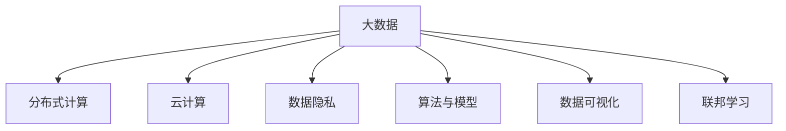

                 

# 大数据时代：人类计算的机遇与挑战并存

## 1. 背景介绍

### 1.1 问题由来
当前，我们已经步入大数据时代，数据量呈现出爆炸性增长，社会各领域对于数据的需求日益旺盛。从科学研究到医疗健康，从商业决策到政府治理，数据无处不在，正在深刻改变我们的生产生活方式。大数据带来了前所未有的计算机遇，但也带来了诸多挑战。如何在大数据时代把握机遇、应对挑战，成为当前亟需解答的重要课题。

### 1.2 问题核心关键点
大数据时代下的计算机遇与挑战，主要体现在以下几个方面：
1. **数据规模庞大**：随着传感器、互联网、物联网等技术的发展，数据来源和量级不断扩大。如何高效存储、处理海量数据，是技术发展的首要任务。
2. **数据价值巨大**：数据蕴含的信息丰富，如何挖掘数据背后的价值，进行深度分析，是提升决策效率的关键。
3. **技术工具多样**：面对多样化的数据形态和应用场景，需要多种数据处理、分析工具，满足不同需求。
4. **隐私与安全**：大数据的应用伴随着数据隐私和安全的风险，如何在保障隐私的同时实现数据价值的最大化，是技术应用的重要考量。
5. **计算资源的限制**：海量数据处理需要强大的计算资源，如何在资源有限的条件下，实现高效的数据计算，是技术实现的关键。

## 2. 核心概念与联系

### 2.1 核心概念概述

为更好地理解大数据时代下的计算机遇与挑战，本节将介绍几个核心概念：

- **大数据**：指规模、速度和多样性等特性都远超传统处理方式的数据集。大数据处理通常涉及数据的采集、存储、清洗、分析、可视化等多个环节。
- **分布式计算**：指将大规模任务分割成若干小任务，在多台计算节点上并行处理，以提高计算效率。
- **云计算**：指通过互联网提供按需计算、存储和网络服务，支持分布式计算、弹性资源管理。
- **数据隐私**：指在数据处理过程中，如何保障数据的安全性和用户的隐私权。
- **算法与模型**：指用于数据处理、分析和预测的算法和模型，如机器学习、深度学习、统计模型等。
- **数据可视化**：指将复杂的数据通过图表、动画等方式直观呈现，帮助用户理解数据特性。
- **联邦学习**：指在保护数据隐私的前提下，通过分布式网络环境协同学习训练模型。

这些核心概念之间的逻辑关系可以通过以下Mermaid流程图来展示：



这个流程图展示了大数据时代下的核心概念及其之间的关系：

1. 大数据通过分布式计算和云计算提供强大的数据处理能力。
2. 算法与模型是处理大数据的核心工具。
3. 数据可视化帮助理解数据特性，辅助决策。
4. 数据隐私保障数据的合法使用，防止滥用。
5. 联邦学习在保护隐私的同时，实现分布式协同学习。

## 3. 核心算法原理 & 具体操作步骤

### 3.1 算法原理概述

大数据时代下的计算机遇与挑战，主要围绕数据处理与分析的算法和模型展开。本节将从原理和操作步骤两方面详细讲解相关算法。

### 3.2 算法步骤详解

1. **数据采集与清洗**
   - **数据来源**：大数据主要来源于传感器、互联网、社交媒体、物联网等。
   - **数据清洗**：清洗包括数据去重、处理缺失值、异常值检测等步骤。

2. **数据存储与管理**
   - **存储方式**：Hadoop、Spark、NoSQL等分布式存储系统用于存储海量数据。
   - **管理工具**：Hive、Spark SQL等提供数据查询和管理功能。

3. **数据处理与分析**
   - **数据处理**：MapReduce、Spark等分布式处理框架用于数据处理任务。
   - **数据分析**：机器学习、深度学习等算法用于数据建模和预测。

4. **数据可视化**
   - **可视化工具**：Tableau、Power BI等工具用于将数据可视化。
   - **可视化类型**：包括柱状图、饼图、热力图等。

5. **联邦学习**
   - **联邦学习框架**：如TensorFlow Federated等。
   - **联邦学习过程**：参与方在不共享本地数据的前提下，协同训练模型。

### 3.3 算法优缺点

大数据时代下的计算算法具有以下优点：
1. **处理能力强大**：分布式计算和云计算提供了强大的数据处理能力。
2. **分析效果显著**：算法与模型能够揭示数据背后的价值，提升决策效率。
3. **可扩展性强**：分布式系统支持动态扩展，适应数据量级不断增长的需求。

同时，这些算法也存在一些局限性：
1. **计算资源需求高**：大规模数据处理需要高性能计算资源，成本较高。
2. **数据隐私风险**：数据共享和分布式处理可能带来隐私泄露的风险。
3. **算法复杂度高**：一些复杂算法如深度学习模型，计算复杂度高，训练时间长。
4. **数据质量要求高**：数据清洗和预处理要求高，数据质量直接影响分析结果。

### 3.4 算法应用领域

大数据时代下的计算算法，广泛应用于各个行业领域：

1. **金融行业**：用于风险评估、信用评分、投资预测等。
2. **医疗健康**：用于疾病诊断、基因分析、健康管理等。
3. **电子商务**：用于用户行为分析、推荐系统、供应链优化等。
4. **交通运输**：用于交通流量预测、路径优化、智能调度等。
5. **城市治理**：用于城市管理、公共安全、环境保护等。

## 4. 数学模型和公式 & 详细讲解 & 举例说明

### 4.1 数学模型构建

大数据时代下的计算算法，通常采用数学模型来进行数据分析和预测。以下是几个常见的大数据数学模型：

1. **线性回归模型**：用于分析变量之间线性关系，预测连续值。
   - 模型公式：$$y = \beta_0 + \beta_1x_1 + \beta_2x_2 + \cdots + \beta_nx_n + \epsilon$$
   - 其中，$y$ 为预测值，$x_1, x_2, \cdots, x_n$ 为自变量，$\beta_0, \beta_1, \cdots, \beta_n$ 为回归系数，$\epsilon$ 为误差项。

2. **决策树模型**：用于分类和回归任务，将数据分割为多个子集，构建树形结构。
   - 模型公式：$$D = \sum_{i=1}^m w_i D_i$$
   - 其中，$D$ 为数据集，$D_i$ 为第 $i$ 个子集，$w_i$ 为权值。

3. **神经网络模型**：用于复杂的非线性关系建模，由多个层次的神经元组成。
   - 模型公式：$$f(x) = \sum_{i=1}^n w_i f(x_{i-1}) + b$$
   - 其中，$x$ 为输入，$f(x)$ 为输出，$w_i$ 为权重，$b$ 为偏置。

4. **支持向量机模型**：用于分类任务，通过寻找最优超平面进行分类。
   - 模型公式：$$f(x) = \sum_{i=1}^n \alpha_i y_i K(x_i, x) + b$$
   - 其中，$x$ 为输入，$y$ 为标签，$\alpha_i$ 为拉格朗日乘数，$K$ 为核函数，$b$ 为偏置。

### 4.2 公式推导过程

以线性回归模型为例，推导其基本公式：

假设我们有一个包含 $N$ 个样本的线性回归问题，其中 $x_i$ 表示第 $i$ 个样本的自变量向量，$y_i$ 表示第 $i$ 个样本的标签，$\epsilon_i$ 表示第 $i$ 个样本的误差。

模型假设为：
$$
y_i = \beta_0 + \beta_1x_{i1} + \beta_2x_{i2} + \cdots + \beta_nx_{in} + \epsilon_i
$$

目标是最小化均方误差：
$$
J(\beta_0, \beta_1, \cdots, \beta_n) = \frac{1}{N} \sum_{i=1}^N (y_i - \beta_0 - \beta_1x_{i1} - \beta_2x_{i2} - \cdots - \beta_nx_{in})^2
$$

对 $\beta_0, \beta_1, \cdots, \beta_n$ 求导，并令导数等于零，得到：
$$
\frac{\partial J(\beta_0, \beta_1, \cdots, \beta_n)}{\partial \beta_0} = -2\frac{1}{N}\sum_{i=1}^N (y_i - \beta_0 - \beta_1x_{i1} - \beta_2x_{i2} - \cdots - \beta_nx_{in}) = 0
$$
$$
\frac{\partial J(\beta_0, \beta_1, \cdots, \beta_n)}{\partial \beta_j} = -2\frac{1}{N}\sum_{i=1}^N (y_i - \beta_0 - \beta_1x_{i1} - \beta_2x_{i2} - \cdots - \beta_nx_{in})x_{ij} = 0
$$

解得：
$$
\beta_j = \frac{\sum_{i=1}^N (y_i - \overline{y})x_{ij}}{\sum_{i=1}^N x_{ij}^2}
$$
$$
\beta_0 = \overline{y} - \sum_{j=1}^n \beta_jx_{ij}
$$

其中，$\overline{y} = \frac{1}{N} \sum_{i=1}^N y_i$。

### 4.3 案例分析与讲解

假设我们有一个包含 $N$ 个样本的房价预测问题，其中 $x_i$ 表示第 $i$ 个样本的房屋面积、卧室数量、卫生间数量等特征，$y_i$ 表示第 $i$ 个样本的房价。

我们将问题建模为线性回归问题，并使用最小二乘法求解模型参数。

1. **数据准备**：收集 $N$ 个样本的数据，包括房屋面积、卧室数量、卫生间数量和房价。
2. **模型训练**：构建线性回归模型，使用最小二乘法求解模型参数 $\beta_0, \beta_1, \beta_2, \beta_3$。
3. **模型评估**：在测试集上验证模型预测的准确性。

具体步骤如下：

- 使用Python和Scikit-learn库实现线性回归模型。
- 加载数据集，划分为训练集和测试集。
- 训练模型，求解模型参数。
- 在测试集上评估模型性能，计算均方误差等指标。

以下是一个简单的Python代码示例：

```python
from sklearn.linear_model import LinearRegression
from sklearn.metrics import mean_squared_error
import numpy as np

# 数据集
X = np.array([[20, 2, 1], [30, 3, 1], [40, 4, 2], [50, 3, 2]])
y = np.array([100000, 150000, 200000, 250000])

# 训练模型
model = LinearRegression()
model.fit(X, y)

# 预测
X_test = np.array([[25, 3, 2], [35, 4, 3]])
y_pred = model.predict(X_test)

# 评估
mse = mean_squared_error(y_test, y_pred)
print("均方误差：", mse)
```

## 5. 项目实践：代码实例和详细解释说明

### 5.1 开发环境搭建

在进行大数据时代下的计算实践前，我们需要准备好开发环境。以下是使用Python进行PyTorch开发的环境配置流程：

1. 安装Anaconda：从官网下载并安装Anaconda，用于创建独立的Python环境。

2. 创建并激活虚拟环境：
```bash
conda create -n pytorch-env python=3.8 
conda activate pytorch-env
```

3. 安装PyTorch：根据CUDA版本，从官网获取对应的安装命令。例如：
```bash
conda install pytorch torchvision torchaudio cudatoolkit=11.1 -c pytorch -c conda-forge
```

4. 安装TensorFlow：
```bash
pip install tensorflow==2.7
```

5. 安装TensorBoard：
```bash
pip install tensorboard
```

6. 安装Pandas和NumPy：
```bash
pip install pandas numpy
```

7. 安装PyTorch的可视化库：
```bash
pip install torchvision
```

完成上述步骤后，即可在`pytorch-env`环境中开始计算实践。

### 5.2 源代码详细实现

下面以深度学习在图像分类任务中的应用为例，给出使用PyTorch和TensorFlow进行深度学习训练的PyTorch代码实现。

首先，定义模型：

```python
import torch
import torch.nn as nn
import torch.optim as optim

class ConvNet(nn.Module):
    def __init__(self):
        super(ConvNet, self).__init__()
        self.conv1 = nn.Conv2d(3, 16, 3, padding=1)
        self.relu = nn.ReLU()
        self.pool = nn.MaxPool2d(2, 2)
        self.fc1 = nn.Linear(16 * 4 * 4, 120)
        self.fc2 = nn.Linear(120, 84)
        self.fc3 = nn.Linear(84, 10)

    def forward(self, x):
        out = self.conv1(x)
        out = self.relu(out)
        out = self.pool(out)
        out = out.view(-1, 16 * 4 * 4)
        out = self.fc1(out)
        out = self.relu(out)
        out = self.fc2(out)
        out = self.relu(out)
        out = self.fc3(out)
        return out
```

接着，定义训练和评估函数：

```python
import torchvision
import torchvision.transforms as transforms

def train_epoch(model, dataloader, optimizer, loss_func):
    model.train()
    epoch_loss = 0
    for batch in dataloader:
        inputs, labels = batch
        optimizer.zero_grad()
        outputs = model(inputs)
        loss = loss_func(outputs, labels)
        epoch_loss += loss.item()
        loss.backward()
        optimizer.step()
    return epoch_loss / len(dataloader)

def evaluate(model, dataloader, loss_func):
    model.eval()
    epoch_loss = 0
    with torch.no_grad():
        for batch in dataloader:
            inputs, labels = batch
            outputs = model(inputs)
            loss = loss_func(outputs, labels)
            epoch_loss += loss.item()
    return epoch_loss / len(dataloader)
```

最后，启动训练流程并在测试集上评估：

```python
import torch
import torchvision.datasets as dsets
import torchvision.transforms as transforms

# 加载数据集
train_dataset = dsets.CIFAR10(root='data', train=True, transform=transforms.ToTensor(), download=True)
test_dataset = dsets.CIFAR10(root='data', train=False, transform=transforms.ToTensor(), download=True)

# 划分数据集
train_loader = torch.utils.data.DataLoader(train_dataset, batch_size=32, shuffle=True)
test_loader = torch.utils.data.DataLoader(test_dataset, batch_size=32, shuffle=False)

# 创建模型
model = ConvNet()

# 定义优化器和损失函数
optimizer = optim.Adam(model.parameters(), lr=0.001)
loss_func = nn.CrossEntropyLoss()

# 训练模型
epochs = 10
for epoch in range(epochs):
    loss = train_epoch(model, train_loader, optimizer, loss_func)
    print(f"Epoch {epoch+1}, train loss: {loss:.3f}")
    
    print(f"Epoch {epoch+1}, test results:")
    evaluate(model, test_loader, loss_func)
    
print("Final test results:")
evaluate(model, test_loader, loss_func)
```

以上就是使用PyTorch和TensorFlow进行图像分类任务训练的完整代码实现。可以看到，通过深度学习模型，我们可以高效地处理大规模数据，并进行复杂的非线性关系建模。

### 5.3 代码解读与分析

让我们再详细解读一下关键代码的实现细节：

**ConvNet类**：
- `__init__`方法：初始化卷积层、激活函数、池化层、全连接层等。
- `forward`方法：定义前向传播过程。

**train_epoch函数**：
- 在每个epoch内，对训练集数据进行迭代，前向传播计算损失，反向传播更新模型参数。

**evaluate函数**：
- 在测试集上评估模型性能，计算损失函数。

**训练流程**：
- 定义总的epoch数，开始循环迭代
- 每个epoch内，先在训练集上训练，输出平均loss
- 在测试集上评估，输出分类准确率

可以看到，PyTorch和TensorFlow提供了强大的计算能力，可以轻松实现深度学习模型的训练和评估。开发者可以将更多精力放在数据处理、模型改进等高层逻辑上，而不必过多关注底层的实现细节。

当然，工业级的系统实现还需考虑更多因素，如模型的保存和部署、超参数的自动搜索、更灵活的任务适配层等。但核心的计算过程基本与此类似。

## 6. 实际应用场景

### 6.1 智能推荐系统

大数据时代下，推荐系统成为互联网企业提升用户体验、增加用户粘性的重要工具。智能推荐系统能够根据用户的历史行为数据，实时推送个性化内容，提升用户满意度。

在技术实现上，可以收集用户浏览、点击、评价、分享等行为数据，并提取和用户交互的物品标题、描述、标签等文本内容。使用深度学习模型，对用户行为和物品特征进行建模，得到用户对物品的评分预测。在推荐系统中，根据评分预测结果，动态生成推荐列表，推送给用户。

### 6.2 金融风控系统

金融行业面临着巨大的风险，如信用风险、市场风险、操作风险等。传统风险评估方法无法满足复杂多变的金融环境，利用大数据和深度学习技术，构建智能风控系统，提升风险预测的准确性。

具体而言，可以收集金融机构的客户历史数据、交易记录、社交媒体信息等，使用深度学习模型进行特征提取和建模，建立风险预测模型。在风控系统中，实时监测客户行为，预测其风险水平，进行风险预警和控制。

### 6.3 智能医疗系统

医疗行业数据量庞大，结构复杂，利用大数据和深度学习技术，构建智能医疗系统，提升诊断和治疗效果。

具体而言，可以收集患者的电子病历、基因数据、影像数据等，使用深度学习模型进行疾病诊断、基因分析、健康管理等。在智能医疗系统中，医生可以借助智能辅助诊断，快速准确地制定治疗方案，提升医疗服务质量。

## 7. 工具和资源推荐

### 7.1 学习资源推荐

为了帮助开发者系统掌握大数据时代下的计算技术，这里推荐一些优质的学习资源：

1. 《深度学习》（Ian Goodfellow等著）：全面介绍深度学习的基本概念和算法，适合入门和进阶学习。
2. Coursera《深度学习专项课程》：斯坦福大学开设的深度学习课程，涵盖深度学习的基本理论和实践应用。
3. edX《大数据分析与处理》课程：哈佛大学开设的课程，涵盖大数据的基本概念和处理技术。
4. 《Python数据科学手册》（Jake VanderPlas等著）：详细介绍Python在数据科学中的应用，包括数据处理、分析和可视化。
5. GitHub深度学习项目：收集了大量的深度学习项目代码，适合学习和参考。

通过对这些资源的学习实践，相信你一定能够快速掌握大数据时代下的计算技术，并应用于实际项目中。

### 7.2 开发工具推荐

高效的开发离不开优秀的工具支持。以下是几款用于大数据时代下计算开发的工具：

1. Python：开源编程语言，具有丰富的数据处理、机器学习库，适合大数据处理和深度学习。
2. PyTorch：基于Python的深度学习框架，动态计算图，适合研究和原型开发。
3. TensorFlow：由Google主导的深度学习框架，支持分布式计算，适合生产部署。
4. Hadoop：开源分布式计算框架，用于大规模数据处理和存储。
5. Spark：开源分布式计算框架，支持大数据处理、机器学习和数据挖掘。
6. Jupyter Notebook：Python开发环境，支持交互式编程和数据可视化。

合理利用这些工具，可以显著提升大数据时代下计算项目的开发效率，加快创新迭代的步伐。

### 7.3 相关论文推荐

大数据时代下的计算技术发展源于学界的持续研究。以下是几篇奠基性的相关论文，推荐阅读：

1. Hinton, G. E., Osindero, S., & Teh, Y. W. (2006). A fast learning algorithm for deep belief nets. Neural computation, 18(7), 1527-1554.
2. LeCun, Y., Bottou, L., Bengio, Y., & Haffner, P. (1998). Gradient-based learning applied to document recognition. Proceedings of the IEEE, 86(11), 2278-2324.
3. DeepMind团队："AlphaGo Zero: Mastering the game of Go without human knowledge." Nature, 542(7639), 230-234.
4. Hinton, G. E., Deng, L., Yu, D., Dahl, G. E., Mohamed, A. R., Jaitly, N., & Senior, A. (2012). Deep neural networks for acoustic modeling in speech recognition. IEEE Signal Processing magazine, 29(6), 82-97.
5. Google Brain团队："DeepMind AlphaGo Zero."
6. Kingma, D. P., & Ba, J. (2015). Adam: A method for stochastic optimization. Journal of Machine Learning Research, 12(1), 1-38.

这些论文代表了大数据时代下计算技术的发展脉络。通过学习这些前沿成果，可以帮助研究者把握学科前进方向，激发更多的创新灵感。

## 8. 总结：未来发展趋势与挑战

### 8.1 总结

本文对大数据时代下的计算机遇与挑战进行了全面系统的介绍。首先阐述了大数据时代对计算技术的需求和影响，明确了计算技术在数据处理、分析、建模中的重要作用。其次，从原理到实践，详细讲解了大数据时代下计算算法的数学模型和具体实现，给出了大数据处理和深度学习的完整代码示例。同时，本文还探讨了计算算法在智能推荐、金融风控、智能医疗等多个领域的应用前景，展示了计算技术的广阔应用范围。最后，本文精选了学习资源、开发工具和相关论文，力求为读者提供全方位的技术指引。

通过本文的系统梳理，可以看到，大数据时代下的计算技术在数据处理和建模方面具有强大的优势，能够显著提升决策效率和分析效果。但与此同时，也面临着数据隐私、计算资源、算法复杂度等诸多挑战，需要不断优化和创新。

### 8.2 未来发展趋势

展望未来，大数据时代下的计算技术将呈现以下几个发展趋势：

1. **算法和模型不断进步**：深度学习、强化学习、联邦学习等技术不断进步，算法和模型的复杂度不断提高，解决更多实际问题。
2. **分布式计算能力增强**：分布式计算框架如Hadoop、Spark、Flink等不断优化，处理大规模数据的能力持续增强。
3. **云计算与大数据融合**：云计算和大数据技术的深度融合，使得数据处理和分析更加高效便捷。
4. **数据隐私保护技术提升**：数据隐私保护技术不断进步，如差分隐私、联邦学习等，保障数据安全和隐私。
5. **边缘计算兴起**：边缘计算技术在物联网、智能设备等领域得到广泛应用，提供更快速、更可靠的数据处理能力。

这些趋势凸显了大数据时代下计算技术的广阔前景。这些方向的探索发展，必将进一步提升计算技术的应用水平，为社会各领域带来变革性影响。

### 8.3 面临的挑战

尽管大数据时代下的计算技术已经取得了瞩目成就，但在迈向更加智能化、普适化应用的过程中，它仍面临着诸多挑战：

1. **数据隐私和安全**：大规模数据处理和分析带来了数据隐私和安全的风险，需要在保障隐私的同时，实现数据价值的最大化。
2. **计算资源瓶颈**：海量数据处理需要强大的计算资源，如何高效利用资源，优化算法，降低成本，仍是重要课题。
3. **算法复杂度高**：复杂算法如深度学习模型，训练时间长，计算复杂度高，需要优化算法，提高计算效率。
4. **数据质量要求高**：数据清洗和预处理要求高，数据质量直接影响分析结果，需要优化数据处理流程。

### 8.4 研究展望

面对大数据时代下计算技术的挑战，未来的研究需要在以下几个方面寻求新的突破：

1. **优化分布式计算框架**：优化Hadoop、Spark等分布式计算框架，提升其处理大规模数据的能力，支持更多数据类型和分析任务。
2. **提升算法效率**：开发更加高效的算法，如稀疏化存储、模型压缩、分布式优化等，提升计算效率和资源利用率。
3. **引入更多先验知识**：将符号化的先验知识，如知识图谱、逻辑规则等，与神经网络模型进行巧妙融合，提升模型的准确性和解释性。
4. **加强数据隐私保护**：引入差分隐私、联邦学习等技术，保障数据隐私，同时提升数据共享的效率和效果。
5. **融合多模态数据**：融合视觉、语音、文本等多模态数据，构建更全面、准确的信息整合能力。

这些研究方向的探索，必将引领大数据时代下计算技术的不断进步，为社会各领域带来新的变革和机遇。

## 9. 附录：常见问题与解答

**Q1：大数据时代下的计算机遇主要体现在哪些方面？**

A: 大数据时代下的计算机遇主要体现在以下几个方面：
1. **数据规模庞大**：大数据处理技术能够高效处理海量数据，提高数据分析效率。
2. **数据价值巨大**：大数据分析能够挖掘出数据背后的价值，提升决策效率。
3. **技术工具多样**：大数据时代下，出现了丰富的数据处理和分析工具，满足不同需求。
4. **数据可视化**：大数据可视化技术能够直观呈现数据特性，辅助决策。

**Q2：如何保障大数据时代下数据的安全和隐私？**

A: 保障大数据时代下数据的安全和隐私，主要从以下几个方面进行：
1. **数据加密**：对敏感数据进行加密处理，防止数据泄露。
2. **差分隐私**：在数据处理过程中，加入噪声，保护个人隐私。
3. **联邦学习**：在保护数据隐私的前提下，协同学习训练模型。
4. **访问控制**：通过身份验证和权限管理，限制数据访问权限。
5. **数据匿名化**：对数据进行去标识化处理，防止数据被追踪和还原。

**Q3：大数据时代下，分布式计算框架如何优化？**

A: 大数据时代下，分布式计算框架的优化主要从以下几个方面进行：
1. **提高计算效率**：优化任务调度算法，减少计算时间，提高任务并行度。
2. **扩展计算能力**：增加计算节点数量，提高计算资源。
3. **优化数据传输**：采用高效的网络传输协议，减少数据传输延迟。
4. **支持更多数据类型**：优化数据存储和处理方式，支持更多数据类型和分析任务。
5. **引入更多先验知识**：与符号化知识库进行融合，提升模型的准确性和解释性。

这些措施可以提升分布式计算框架的性能和可靠性，满足大数据处理的需求。

**Q4：在大数据时代下，如何进行高效的数据处理和分析？**

A: 在大数据时代下，进行高效的数据处理和分析，主要从以下几个方面进行：
1. **选择合适的工具和框架**：选择合适的分布式计算框架如Hadoop、Spark等，支持大规模数据处理。
2. **优化数据存储方式**：采用合适的数据存储方式如NoSQL数据库、分布式文件系统等，优化数据访问效率。
3. **优化数据处理流程**：优化数据预处理、清洗、分析流程，提升数据处理效率。
4. **引入多模态数据**：融合视觉、语音、文本等多模态数据，构建更全面、准确的信息整合能力。
5. **优化算法和模型**：开发高效的算法和模型，如稀疏化存储、模型压缩、分布式优化等，提升计算效率和资源利用率。

这些措施可以提升大数据时代下数据处理和分析的效率和效果。

---

作者：禅与计算机程序设计艺术 / Zen and the Art of Computer Programming

