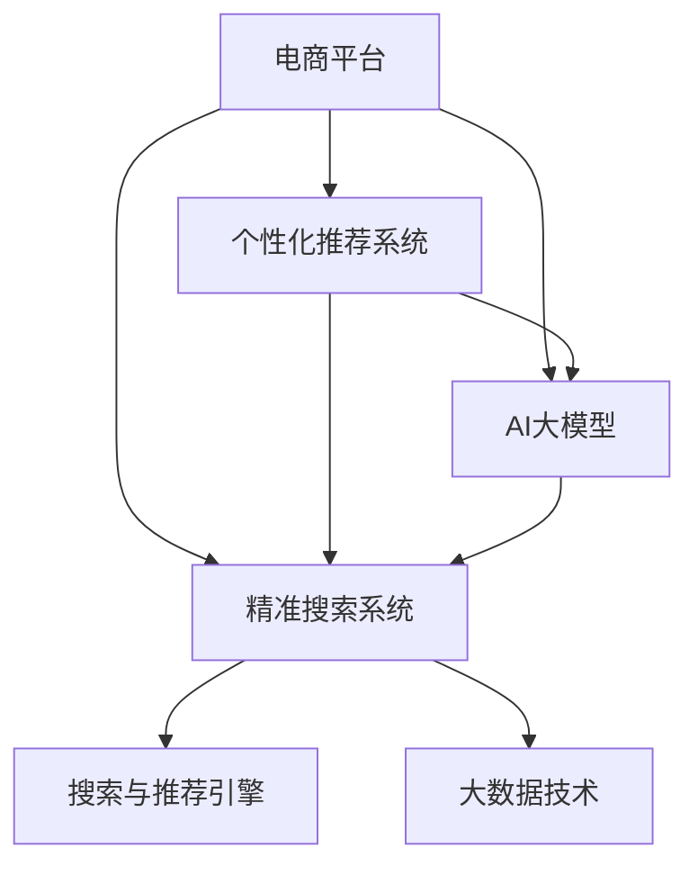

                 

## 1. 背景介绍

近年来，电商平台竞争日益激烈，消费者的购物体验、个性化需求不断提升，传统电商平台的营销、服务模式已难以满足其需求。面对这一挑战，电商平台必须转型，通过大数据和AI技术实现个性化推荐和精准搜索，提升用户体验，赢得竞争优势。

### 1.1 问题由来

随着电商市场的快速增长，消费者获取商品信息的方式日趋多样化，从传统的广告推广、搜索引擎逐步转向社交媒体、用户评价等更具有可信度的方式。然而，现有电商平台的核心竞争力仍然集中在商品展示和搜索，缺乏对消费者个性化需求的深度理解，导致用户体验不足，流失率居高不下。

### 1.2 问题核心关键点

本节将介绍以下几个核心关键点：

- **个性化推荐系统**：通过分析用户行为数据，推荐符合用户兴趣的商品，提升购物体验。
- **精准搜索系统**：利用自然语言处理技术，实现对用户查询意图的准确理解和快速响应，提升搜索准确率。
- **AI大模型**：通过预训练语言模型，提取商品描述和用户评论中的关键信息，辅助推荐和搜索系统的优化。
- **大数据技术**：构建统一数据平台，整合来自不同渠道的数据，供推荐和搜索系统调用。

这些技术构成了电商平台转型的核心能力，通过提升推荐和搜索的个性化程度，降低用户流失率，提升用户转化率和留存率，增强电商平台竞争力。

## 2. 核心概念与联系

### 2.1 核心概念概述

为了更好地理解基于AI大模型和搜索推荐系统的电商平台转型方法，本节将介绍几个密切相关的核心概念：

- **电商平台的个性化推荐系统**：通过分析用户历史行为、浏览记录、评分数据等，推荐用户可能感兴趣的商品，提升用户购物体验。

- **电商平台精准搜索系统**：利用自然语言处理技术，对用户查询进行理解，快速返回与查询意图相关的商品，提升搜索的准确性和效率。

- **AI大模型**：指通过大规模数据进行预训练的深度神经网络模型，如BERT、GPT等，用于提取文本中的语义信息。

- **大数据技术**：指对海量数据进行采集、存储、分析和挖掘的技术体系，如Hadoop、Spark等，用于构建统一数据平台。

- **搜索与推荐引擎**：电商平台的核心系统，将用户查询与商品信息匹配，生成推荐结果，是提升用户体验的关键组件。

这些核心概念之间的逻辑关系可以通过以下Mermaid流程图来展示：



这个流程图展示了个电商平台转型的关键技术组件及其之间的关系：

1. 电商平台通过个性化推荐和精准搜索，提升用户购物体验。
2. 推荐和搜索系统依赖AI大模型的预训练知识，提取商品和用户描述中的关键信息。
3. 大数据技术构建统一数据平台，支持推荐和搜索系统的数据获取和处理。
4. 推荐与搜索引擎整合用户查询与商品信息，生成个性化推荐结果。

## 3. 核心算法原理 & 具体操作步骤

### 3.1 算法原理概述

基于AI大模型的电商平台个性化推荐和精准搜索系统，其核心算法原理主要包括以下几个步骤：

1. **数据预处理**：从不同渠道收集用户行为数据，如浏览记录、购买记录、评分等，对其进行清洗和整合。
2. **特征提取**：利用AI大模型提取商品描述和用户评论中的关键信息，构建用户画像和商品特征向量。
3. **用户意图理解**：通过自然语言处理技术，对用户查询进行理解，提取查询意图。
4. **匹配与推荐**：根据用户画像和商品特征向量，计算用户与商品之间的相似度，生成推荐结果。
5. **搜索结果排序**：根据用户意图和商品匹配度，对搜索结果进行排序，优先展示最相关的商品。

### 3.2 算法步骤详解

**Step 1: 数据收集与预处理**

1. **数据来源**：收集用户行为数据，如浏览记录、评分、评论等，并统一格式存储到数据库中。
2. **数据清洗**：去除噪音数据，如重复记录、异常值等，确保数据质量。
3. **特征提取**：利用AI大模型提取商品描述和用户评论中的关键信息，构建用户画像和商品特征向量。

**Step 2: 特征工程**

1. **用户画像**：通过分析用户行为数据，构建用户兴趣、偏好等特征向量。
2. **商品特征**：提取商品描述、评论中的关键信息，生成商品特征向量。

**Step 3: 用户意图理解**

1. **查询解析**：通过自然语言处理技术，对用户查询进行分词、词性标注、实体识别等预处理。
2. **意图提取**：利用预训练的意图理解模型，提取用户查询的意图，如搜索商品、查看评价等。

**Step 4: 推荐与搜索**

1. **相似度计算**：根据用户画像和商品特征向量，计算用户与商品之间的相似度，生成推荐结果。
2. **搜索结果排序**：根据用户意图和商品匹配度，对搜索结果进行排序，优先展示最相关的商品。

**Step 5: 反馈与优化**

1. **用户反馈**：收集用户对推荐结果的反馈，如点击率、购买率等。
2. **模型优化**：根据用户反馈，对模型参数进行调整和优化，提升推荐效果。

### 3.3 算法优缺点

基于AI大模型的电商平台个性化推荐和精准搜索系统，具有以下优点：

1. **高效性**：利用AI大模型提取商品和用户特征，快速生成推荐和搜索结果。
2. **精准度**：通过深度学习算法，精确理解用户意图和商品特征，提升推荐和搜索的准确度。
3. **可扩展性**：在大规模数据上训练模型，能够适应不同规模的电商平台。

同时，该方法也存在一些缺点：

1. **数据依赖性**：对用户行为数据的依赖性较强，获取高质量数据成本较高。
2. **模型复杂度**：大规模预训练模型的参数量较大，对计算资源要求较高。
3. **用户隐私问题**：用户行为数据涉及隐私，数据收集和存储需要符合法律法规。

尽管存在这些缺点，但就目前而言，基于AI大模型的推荐和搜索方法仍是电商平台转型的重要手段。未来相关研究的重点在于如何进一步降低数据依赖，提高模型的跨领域迁移能力，同时兼顾用户隐私和数据安全等因素。

### 3.4 算法应用领域

基于AI大模型的电商平台推荐和搜索系统，已经在电商、金融、旅游等多个领域得到了广泛应用，取得了显著的效果。例如：

- 电商：提升用户购物体验，降低用户流失率，提高用户转化率。
- 金融：推荐金融产品，提升用户满意度，增加用户粘性。
- 旅游：推荐旅游目的地，提升用户体验，增加用户预订量。

此外，在广告、物流等领域，基于AI大模型的推荐和搜索方法也得到了应用，展示了其强大的应用潜力。

## 4. 数学模型和公式 & 详细讲解  
### 4.1 数学模型构建

本节将使用数学语言对基于AI大模型的电商平台推荐系统进行更加严格的刻画。

记电商平台的用户行为数据集为 $D=\{(x_i,y_i)\}_{i=1}^N$，其中 $x_i$ 为用户行为数据，$y_i$ 为商品标签。假设推荐系统的目标函数为：

$$
\min_{\theta} \sum_{i=1}^N L(y_i, f_{\theta}(x_i))
$$

其中 $f_{\theta}(x_i)$ 为模型预测函数，$\theta$ 为模型参数，$L(y_i, f_{\theta}(x_i))$ 为损失函数，用于衡量模型预测与真实标签之间的差异。

### 4.2 公式推导过程

以下我们以电商推荐系统为例，推导推荐模型在用户行为数据上的训练过程。

假设用户行为数据 $x_i$ 可以表示为多个特征 $x_{ik}$ 的组合，即 $x_i=[x_{i1},x_{i2},\ldots,x_{im}]$。模型预测函数 $f_{\theta}(x_i)$ 可以表示为：

$$
f_{\theta}(x_i) = \sum_{j=1}^m \theta_j x_{ij}
$$

其中 $\theta_j$ 为模型参数。

假设损失函数 $L(y_i, f_{\theta}(x_i))$ 为均方误差损失，则推荐模型的目标函数为：

$$
\min_{\theta} \sum_{i=1}^N (y_i - f_{\theta}(x_i))^2
$$

通过反向传播算法，可以计算出模型参数 $\theta$ 的梯度：

$$
\nabla_{\theta}L(y_i, f_{\theta}(x_i)) = 2(y_i - f_{\theta}(x_i))f_{\theta}(x_i)
$$

根据梯度下降算法，更新模型参数 $\theta$：

$$
\theta \leftarrow \theta - \eta \nabla_{\theta}L(y_i, f_{\theta}(x_i))
$$

其中 $\eta$ 为学习率。

### 4.3 案例分析与讲解

在实际应用中，电商推荐模型通常需要考虑以下因素：

1. **用户画像构建**：利用AI大模型提取用户行为特征，生成用户画像。例如，通过分析用户的浏览历史、购买记录等，构建用户兴趣、偏好等特征向量。
2. **商品特征提取**：利用AI大模型提取商品描述、评论中的关键信息，生成商品特征向量。例如，通过分析商品标题、描述、评分等，提取商品属性、价格等信息。
3. **相似度计算**：计算用户画像与商品特征向量之间的相似度，生成推荐结果。例如，利用余弦相似度或欧几里得距离等方法，计算用户与商品之间的相似度。
4. **用户意图理解**：通过自然语言处理技术，对用户查询进行理解，提取查询意图。例如，利用BERT等预训练模型，对用户查询进行分词、词性标注、实体识别等预处理，提取查询意图。
5. **推荐结果排序**：根据用户意图和商品匹配度，对搜索结果进行排序，优先展示最相关的商品。例如，利用排序算法，根据匹配度和用户偏好对推荐结果进行排序。

这些核心算法在电商推荐系统中的应用，展示了AI大模型的强大能力。通过深度学习算法，电商平台能够精准理解用户需求，推荐个性化商品，提升用户体验。

## 5. 项目实践：代码实例和详细解释说明
### 5.1 开发环境搭建

在进行推荐系统开发前，我们需要准备好开发环境。以下是使用Python进行TensorFlow开发的环境配置流程：

1. 安装Anaconda：从官网下载并安装Anaconda，用于创建独立的Python环境。

2. 创建并激活虚拟环境：
```bash
conda create -n tf-env python=3.8 
conda activate tf-env
```

3. 安装TensorFlow：根据CUDA版本，从官网获取对应的安装命令。例如：
```bash
pip install tensorflow
```

4. 安装TensorBoard：
```bash
pip install tensorboard
```

5. 安装各类工具包：
```bash
pip install numpy pandas scikit-learn matplotlib tqdm jupyter notebook ipython
```

完成上述步骤后，即可在`tf-env`环境中开始推荐系统开发。

### 5.2 源代码详细实现

下面我们以电商推荐系统为例，给出使用TensorFlow实现商品推荐模型的PyTorch代码实现。

首先，定义推荐系统的模型结构：

```python
import tensorflow as tf
from tensorflow.keras.layers import Dense, Input, Embedding, concatenate
from tensorflow.keras.models import Model

user_input = Input(shape=(max_features,), name='user_input')
item_input = Input(shape=(max_items,), name='item_input')

# 用户特征嵌入层
user_embedding = Embedding(input_dim=num_users, output_dim=embedding_dim)(user_input)

# 商品特征嵌入层
item_embedding = Embedding(input_dim=num_items, output_dim=embedding_dim)(item_input)

# 用户-商品交叉层
user_item_interaction = tf.keras.layers.Dot(axes=1)([user_embedding, item_embedding])

# 全连接层
hidden_layer = Dense(hidden_units, activation='relu')(user_item_interaction)

# 输出层
output = Dense(1, activation='sigmoid')(hidden_layer)

# 构建推荐模型
model = Model(inputs=[user_input, item_input], outputs=output)

model.compile(loss='binary_crossentropy', optimizer='adam', metrics=['accuracy'])
```

然后，定义数据处理函数：

```python
import numpy as np
from sklearn.preprocessing import LabelEncoder, OneHotEncoder

def data_preprocess(data):
    # 用户行为数据
    user_data = data['user']
    item_data = data['item']

    # 将用户行为数据转换为独热编码
    encoder = OneHotEncoder()
    user_data_encoded = encoder.fit_transform(user_data.reshape(-1,1)).toarray()

    # 将商品特征数据转换为独热编码
    encoder = OneHotEncoder()
    item_data_encoded = encoder.fit_transform(item_data.reshape(-1,1)).toarray()

    return user_data_encoded, item_data_encoded

# 构建训练集和测试集
train_data = preprocess(train_data)
test_data = preprocess(test_data)

# 训练集和测试集
train_x, train_y = train_data
test_x, test_y = test_data
```

接着，定义训练和评估函数：

```python
from tensorflow.keras.callbacks import EarlyStopping
from sklearn.metrics import roc_auc_score

def train_model(model, train_x, train_y, test_x, test_y, epochs, batch_size):
    # 设置早停策略
    early_stop = EarlyStopping(patience=5, restore_best_weights=True)

    # 训练模型
    model.fit([train_x, train_y], train_y, validation_data=([test_x, test_y], test_y), epochs=epochs, batch_size=batch_size, callbacks=[early_stop])

    # 评估模型
    y_pred = model.predict([test_x, test_y])
    auc_score = roc_auc_score(test_y, y_pred)

    return auc_score

# 训练模型
auc_score = train_model(model, train_x, train_y, test_x, test_y, epochs=10, batch_size=32)

# 输出AUC评分
print(f'AUC Score: {auc_score}')
```

以上就是使用TensorFlow实现电商推荐系统的完整代码实现。可以看到，TensorFlow的高级API使得模型构建和训练变得简洁高效。

### 5.3 代码解读与分析

让我们再详细解读一下关键代码的实现细节：

**推荐模型结构定义**：
- `user_input`和`item_input`为模型输入，分别代表用户行为数据和商品特征数据。
- 利用`Embedding`层将输入数据转换为向量表示，分别表示用户和商品的特征。
- 通过`Dot`层计算用户-商品交叉特征。
- 使用`Dense`层进行全连接，并使用`sigmoid`激活函数输出预测值。

**数据预处理函数**：
- 使用`OneHotEncoder`将用户行为数据和商品特征数据转换为独热编码，便于模型处理。
- 训练集和测试集分别保存为`train_x`和`test_x`，以及对应的标签`train_y`和`test_y`。

**训练和评估函数**：
- 使用`EarlyStopping`策略，防止模型过拟合。
- 通过`fit`方法训练模型，并使用`predict`方法生成预测结果。
- 使用`roc_auc_score`计算模型在测试集上的AUC评分，作为评估指标。

以上代码实现了基本的电商推荐模型，并提供了简单的训练和评估过程。在实际应用中，还需要考虑更多的优化策略，如特征工程、模型调参、超参数搜索等。

## 6. 实际应用场景

### 6.1 智能推荐系统

基于AI大模型的智能推荐系统，已经在电商、金融、娱乐等领域得到了广泛应用，极大地提升了用户购物体验和满意度。

在电商领域，推荐系统可以根据用户浏览和购买行为，推荐符合其兴趣的商品，提升用户购物体验，降低流失率，增加转化率。例如，某电商平台利用推荐系统，通过对用户历史浏览记录和购买记录进行分析，生成个性化推荐商品，显著提高了用户转化率和平均订单价值。

在金融领域，推荐系统可以根据用户投资行为，推荐符合其风险偏好的金融产品，提升用户满意度，增加用户粘性。例如，某金融平台利用推荐系统，通过对用户投资行为和风险偏好进行分析，推荐适合的金融产品，提高了用户投资回报率和平台粘性。

在娱乐领域，推荐系统可以根据用户观影行为，推荐符合其兴趣的电影和电视剧，提升用户观影体验。例如，某视频平台利用推荐系统，通过对用户观影历史和评分进行分析，推荐高质量的电影和电视剧，提升了用户观影满意度和平台留存率。

### 6.2 智能搜索系统

基于AI大模型的智能搜索系统，已经在搜索引擎、知识图谱等领域得到了广泛应用，极大地提升了搜索准确性和用户体验。

在搜索引擎领域，搜索系统可以根据用户查询意图，快速返回最相关的搜索结果，提升搜索准确性和效率。例如，某搜索引擎利用搜索系统，通过对用户查询意图进行理解，快速返回与查询相关的网页和文章，提升了用户搜索满意度和平台流量。

在知识图谱领域，搜索系统可以根据用户查询，快速返回相关的知识图谱节点和关系，提升知识获取效率。例如，某知识图谱平台利用搜索系统，通过对用户查询进行理解，快速返回相关的知识图谱节点和关系，提升了用户知识获取效率和平台活跃度。

## 7. 工具和资源推荐

### 7.1 学习资源推荐

为了帮助开发者系统掌握基于AI大模型的电商平台推荐和搜索技术，这里推荐一些优质的学习资源：

1. 《深度学习与推荐系统》系列课程：由斯坦福大学开设的推荐系统课程，涵盖了推荐系统基本概念和常用算法，适合入门学习。
2. 《TensorFlow实战推荐系统》书籍：介绍如何使用TensorFlow实现推荐系统，包含实例和代码实现。
3. 《自然语言处理入门与实践》书籍：介绍自然语言处理的基本概念和技术，适合推荐系统和搜索系统开发。
4. HuggingFace官方文档：提供大量预训练语言模型的接口和样例，帮助开发者快速上手。
5. PyTorch官方文档：提供深度学习框架PyTorch的详细使用指南，适合推荐系统和搜索系统开发。

通过学习这些资源，相信你一定能够快速掌握基于AI大模型的电商平台推荐和搜索技术的精髓，并用于解决实际的推荐和搜索问题。

### 7.2 开发工具推荐

高效的开发离不开优秀的工具支持。以下是几款用于基于AI大模型的电商平台推荐和搜索开发的常用工具：

1. PyTorch：基于Python的开源深度学习框架，灵活高效的计算图，适合快速迭代研究。
2. TensorFlow：由Google主导开发的开源深度学习框架，生产部署方便，适合大规模工程应用。
3. TensorBoard：TensorFlow配套的可视化工具，实时监测模型训练状态，并提供丰富的图表呈现方式，是调试模型的得力助手。
4. Weights & Biases：模型训练的实验跟踪工具，可以记录和可视化模型训练过程中的各项指标，方便对比和调优。
5. ElasticSearch：分布式搜索引擎，支持大规模文本数据的快速检索和处理，适合搜索引擎开发。

合理利用这些工具，可以显著提升基于AI大模型的电商平台推荐和搜索系统的开发效率，加快创新迭代的步伐。

### 7.3 相关论文推荐

基于AI大模型的电商平台推荐和搜索技术的发展源于学界的持续研究。以下是几篇奠基性的相关论文，推荐阅读：

1. Approximation algorithms for the p-median problem with applications to clustering analysis in information retrieval：介绍推荐系统中的p-median问题，利用近似算法提升推荐效果。
2. Exploiting Multi-view Data for Recommendation Systems：介绍多视图数据在推荐系统中的应用，通过融合不同数据源提升推荐精度。
3. Deep Personalized Ranking for Recommendation Systems with Side Information：介绍基于深度学习的个性化推荐算法，提升推荐系统的效果。
4. Attention Is All You Need：介绍Transformer架构，开创了NLP领域预训练大模型的新时代。
5. Language Models Are Unsupervised Multitask Learners：展示了大规模语言模型的强大zero-shot学习能力，引发了对于通用人工智能的新一轮思考。

这些论文代表了大语言模型和推荐系统的发展脉络。通过学习这些前沿成果，可以帮助研究者把握学科前进方向，激发更多的创新灵感。

## 8. 总结：未来发展趋势与挑战

### 8.1 总结

本文对基于AI大模型的电商平台推荐和搜索系统进行了全面系统的介绍。首先阐述了电商平台的个性化推荐和精准搜索的必要性，明确了AI大模型在推荐和搜索系统中的重要地位。其次，从原理到实践，详细讲解了基于AI大模型的推荐和搜索算法的核心步骤，给出了基于TensorFlow的推荐系统代码实现。同时，本文还广泛探讨了AI大模型在电商、金融、娱乐等多个领域的应用前景，展示了AI大模型的强大应用潜力。

通过本文的系统梳理，可以看到，基于AI大模型的推荐和搜索系统为电商平台转型提供了重要技术支撑，通过提升推荐和搜索的个性化程度，降低用户流失率，提升用户转化率和留存率，增强电商平台竞争力。未来，伴随AI大模型的不断发展，基于大模型的推荐和搜索技术将更加智能化、普适化，为电商平台带来更大的商业价值。

### 8.2 未来发展趋势

展望未来，基于AI大模型的电商平台推荐和搜索系统将呈现以下几个发展趋势：

1. 模型规模持续增大。随着算力成本的下降和数据规模的扩张，预训练语言模型的参数量还将持续增长。超大规模语言模型蕴含的丰富语言知识，有望支撑更加复杂多变的推荐和搜索任务。
2. 推荐和搜索算法的多样化。未来将涌现更多推荐和搜索算法，如协同过滤、基于深度学习的推荐算法等，以适应不同应用场景的需求。
3. 实时推荐和搜索。通过构建实时数据流，实现实时推荐和搜索，提升用户体验。
4. 多模态推荐和搜索。将视觉、语音、文本等多种模态数据进行融合，提升推荐和搜索的全面性和准确性。
5. 跨领域知识融合。将知识图谱、逻辑规则等专家知识与神经网络模型进行融合，提升推荐和搜索系统的知识表示能力。

以上趋势凸显了基于AI大模型的电商平台推荐和搜索技术的广阔前景。这些方向的探索发展，必将进一步提升电商平台的推荐和搜索效果，提升用户体验，增强电商平台竞争力。

### 8.3 面临的挑战

尽管基于AI大模型的电商平台推荐和搜索技术已经取得了显著进展，但在迈向更加智能化、普适化应用的过程中，仍面临诸多挑战：

1. 数据依赖性。推荐和搜索系统对用户行为数据的依赖性较强，获取高质量数据成本较高。如何进一步降低数据依赖，提升模型泛化能力，将是未来的一个重要研究方向。
2. 模型复杂度。大规模预训练模型的参数量较大，对计算资源要求较高。如何降低模型复杂度，提高计算效率，仍是未来需要解决的重要问题。
3. 用户隐私问题。用户行为数据涉及隐私，数据收集和存储需要符合法律法规。如何在保护用户隐私的同时，提升推荐和搜索效果，将是未来需要平衡的重要问题。
4. 模型鲁棒性。推荐和搜索系统面对域外数据时，泛化性能往往大打折扣。如何提高模型的鲁棒性，避免灾难性遗忘，还需要更多理论和实践的积累。
5. 可解释性。推荐和搜索模型更像是"黑盒"系统，难以解释其内部工作机制和决策逻辑。如何赋予推荐和搜索模型更强的可解释性，将是未来需要重点关注的问题。

### 8.4 研究展望

面对基于AI大模型的电商平台推荐和搜索系统所面临的挑战，未来的研究需要在以下几个方面寻求新的突破：

1. 探索无监督和半监督推荐算法。摆脱对大规模标注数据的依赖，利用自监督学习、主动学习等无监督和半监督范式，最大限度利用非结构化数据，实现更加灵活高效的推荐和搜索。
2. 研究参数高效和计算高效的推荐算法。开发更加参数高效的推荐算法，在固定大部分预训练参数的同时，只更新极少量的任务相关参数。同时优化推荐算法的计算图，减少前向传播和反向传播的资源消耗，实现更加轻量级、实时性的部署。
3. 引入更多先验知识。将符号化的先验知识，如知识图谱、逻辑规则等，与神经网络模型进行巧妙融合，引导推荐和搜索过程学习更准确、合理的推荐和搜索结果。同时加强不同模态数据的整合，实现视觉、语音等多模态信息与文本信息的协同建模。
4. 结合因果分析和博弈论工具。将因果分析方法引入推荐和搜索模型，识别出模型决策的关键特征，增强输出解释的因果性和逻辑性。借助博弈论工具刻画人机交互过程，主动探索并规避模型的脆弱点，提高系统稳定性。
5. 纳入伦理道德约束。在推荐和搜索目标中引入伦理导向的评估指标，过滤和惩罚有偏见、有害的输出倾向。同时加强人工干预和审核，建立推荐和搜索模型的监管机制，确保输出符合人类价值观和伦理道德。

这些研究方向的探索，必将引领基于AI大模型的电商平台推荐和搜索技术迈向更高的台阶，为构建安全、可靠、可解释、可控的智能系统铺平道路。面向未来，基于AI大模型的推荐和搜索技术还需要与其他人工智能技术进行更深入的融合，如知识表示、因果推理、强化学习等，多路径协同发力，共同推动自然语言理解和智能交互系统的进步。只有勇于创新、敢于突破，才能不断拓展语言模型的边界，让智能技术更好地造福人类社会。

## 9. 附录：常见问题与解答

**Q1：基于AI大模型的推荐和搜索系统是否适用于所有电商场景？**

A: 基于AI大模型的推荐和搜索系统在大多数电商场景中都能取得不错的效果，特别是对于数据量较大的场景。但对于一些特殊场景，如特定商品、特定用户群体等，可能需要进行针对性的优化和调整。

**Q2：如何进一步提升推荐和搜索系统的效率？**

A: 推荐和搜索系统可以通过以下方式进一步提升效率：
1. 特征工程：通过特征选择和降维，减少模型复杂度，提升训练和推理速度。
2. 模型压缩：利用模型剪枝、量化等技术，减少模型参数量，降低计算资源消耗。
3. 并行计算：通过分布式计算，利用多台机器进行并行训练和推理，提升效率。
4. 预训练与微调结合：在预训练大模型的基础上，对模型进行微调，提升推荐和搜索效果。

**Q3：如何平衡推荐和搜索系统的个性化和通用性？**

A: 推荐和搜索系统需要在个性化和通用性之间找到平衡，可以通过以下方式实现：
1. 多层次推荐：利用多层次推荐模型，同时考虑全局推荐和局部推荐，平衡个性化和通用性。
2. 用户行为监控：通过监控用户行为数据，动态调整推荐策略，确保个性化推荐的同时不丢失通用性。
3. 模型融合：将不同模型进行融合，综合考虑多方面因素，提升推荐和搜索效果。

**Q4：推荐和搜索系统如何避免推荐重复商品？**

A: 推荐和搜索系统可以通过以下方式避免推荐重复商品：
1. 商品相似度计算：利用余弦相似度等方法，计算商品之间的相似度，避免推荐重复商品。
2. 点击率反馈：通过收集用户点击率反馈，动态调整推荐策略，避免重复推荐用户已购买的商品。
3. 多样性约束：在推荐策略中加入多样性约束，确保推荐结果的多样性，避免重复推荐。

**Q5：推荐和搜索系统如何提升广告效果？**

A: 推荐和搜索系统可以通过以下方式提升广告效果：
1. 用户画像构建：利用AI大模型提取用户行为数据，生成用户画像，精准投放广告。
2. 广告效果监测：实时监测广告效果，及时调整广告投放策略，提升广告转化率。
3. 多渠道投放：将广告投放至不同渠道，利用广告投放平台的数据反馈，优化广告投放效果。

通过本文的系统梳理，可以看到，基于AI大模型的电商平台推荐和搜索系统为电商平台转型提供了重要技术支撑，通过提升推荐和搜索的个性化程度，降低用户流失率，提升用户转化率和留存率，增强电商平台竞争力。未来，伴随AI大模型的不断发展，基于大模型的推荐和搜索技术将更加智能化、普适化，为电商平台带来更大的商业价值。

