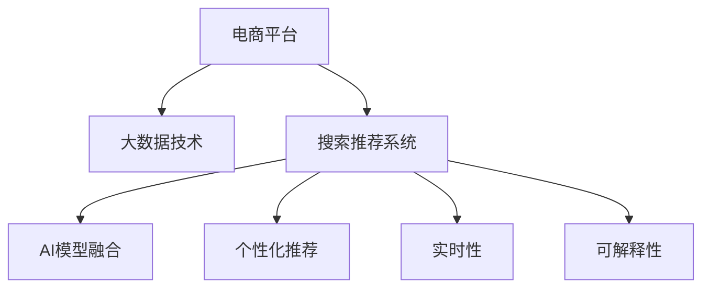

                 

# 大数据驱动的电商平台转型：搜索推荐系统是核心，AI 模型融合是引擎

## 1. 背景介绍

### 1.1 问题由来

随着电子商务的迅猛发展，平台商家的数量急剧增加，商品种类繁多，用户对于购物体验的期望也随之提高。用户希望在电商平台上能够快速、准确地找到所需商品，而电商平台则希望通过个性化推荐，提升用户体验并增加销量。因此，大数据驱动的电商平台转型，已成为电商平台提升竞争力的重要手段。

### 1.2 问题核心关键点

在大数据驱动的电商平台转型中，搜索推荐系统起着核心作用。搜索推荐系统的目标是提高用户搜索和购买的转化率，提升用户体验，从而增加平台的销量和用户黏性。在这一过程中，AI模型的融合与应用是实现这一目标的重要引擎。

### 1.3 问题研究意义

研究电商平台搜索推荐系统，对于提升电商平台的商品转化率、用户满意度以及市场竞争力具有重要意义。AI模型的融合与应用，使得搜索推荐系统能够根据用户的个性化需求，提供精准的商品推荐，从而大幅提高电商平台的转化率和用户满意度。

## 2. 核心概念与联系

### 2.1 核心概念概述

为更好地理解大数据驱动的电商平台转型，本节将介绍几个密切相关的核心概念：

- **电商平台搜索推荐系统**：电商平台通过用户行为数据（如搜索记录、浏览历史、购买记录等），利用AI模型进行分析和建模，以个性化推荐商品，提升用户购物体验，增加平台收益。
- **大数据技术**：指收集、存储、处理和分析海量数据的技术体系。大数据技术包括数据采集、数据存储、数据处理、数据可视化等环节，是电商平台获取用户行为数据的基础。
- **AI模型融合**：指将多种AI模型（如深度学习模型、机器学习模型等）进行有机结合，构建更为强大的搜索推荐引擎。
- **个性化推荐**：指根据用户的个性化需求，通过数据分析和建模，向用户推荐最适合的商品，提升用户体验和转化率。
- **实时性**：指电商平台搜索推荐系统的推荐结果应能实时更新，满足用户即时搜索需求。
- **可解释性**：指搜索推荐系统的推荐过程具有可解释性，用户能够理解其推荐依据，从而增加对平台的信任。

这些核心概念之间的逻辑关系可以通过以下Mermaid流程图来展示：



这个流程图展示了大数据驱动的电商平台转型的核心概念及其之间的关系：

1. 电商平台通过大数据技术收集和处理用户行为数据。
2. 在收集到的数据基础上，构建搜索推荐系统，为用户提供个性化推荐。
3. 通过AI模型融合，提升搜索推荐系统的性能。
4. 个性化推荐系统需具备实时性，满足用户即时搜索需求。
5. 系统的推荐过程需具有可解释性，增加用户对推荐结果的信任。

这些概念共同构成了大数据驱动的电商平台转型的核心框架，使得电商平台能够基于用户数据，构建强大的搜索推荐引擎，提升用户体验和平台收益。

## 3. 核心算法原理 & 具体操作步骤

### 3.1 算法原理概述

大数据驱动的电商平台搜索推荐系统，本质上是一个多任务的联合学习问题。其核心思想是：通过综合分析用户搜索、浏览、购买等行为数据，利用多种AI模型进行建模，构建一个更为精准、全面的推荐引擎。

形式化地，假设用户行为数据集为 $D=\{(x_i, y_i)\}_{i=1}^N$，其中 $x_i$ 为用户的搜索记录、浏览历史等行为数据，$y_i$ 为用户的行为标签（如购买、浏览、不感兴趣等）。搜索推荐系统的目标是最小化预测误差，即找到最优模型 $M_{\theta}$：

$$
\theta = \mathop{\arg\min}_{\theta} \mathcal{L}(M_{\theta},D)
$$

其中 $\mathcal{L}$ 为损失函数，用于衡量模型预测与真实标签之间的差异。

### 3.2 算法步骤详解

大数据驱动的电商平台搜索推荐系统一般包括以下几个关键步骤：

**Step 1: 数据收集与处理**

- 收集用户行为数据：包括用户的搜索记录、浏览历史、购买记录等。
- 数据清洗与预处理：对收集到的数据进行去重、缺失值处理、特征工程等操作。

**Step 2: 特征工程与模型选择**

- 特征提取：从用户行为数据中提取有用的特征，如搜索关键词、浏览时长、购买频率等。
- 模型选择：选择适合搜索推荐系统的AI模型，如深度学习模型（如Transformer、CNN等）、协同过滤模型等。

**Step 3: 模型训练与优化**

- 分割数据集：将数据集划分为训练集、验证集和测试集。
- 训练模型：在训练集上，利用多种AI模型进行联合训练，最小化损失函数。
- 模型评估与优化：在验证集上评估模型性能，根据评估结果调整模型参数和结构，直到满足预设的性能指标。

**Step 4: 实时推荐与更新**

- 实时推荐：在用户搜索时，实时计算并返回推荐结果。
- 动态更新：根据用户行为数据的变化，实时更新模型参数，保证推荐结果的准确性和时效性。

**Step 5: 用户反馈与改进**

- 收集用户反馈：通过用户的评分、点击率等反馈数据，评估推荐效果。
- 持续改进：根据用户反馈，调整推荐策略，优化模型参数，提升推荐精度和用户体验。

以上是搜索推荐系统的完整流程。在实际应用中，还需要针对具体电商平台的业务特点，对各个环节进行优化设计，如改进数据特征、选择适合的推荐算法、优化推荐引擎等，以进一步提升搜索推荐系统的性能。

### 3.3 算法优缺点

大数据驱动的电商平台搜索推荐系统具有以下优点：

- 提升用户体验：通过个性化推荐，满足用户的多样化需求，提升购物体验。
- 增加平台收益：通过精准推荐，提高用户的转化率和复购率，增加平台收益。
- 实时更新：通过动态更新模型参数，保证推荐结果的时效性，提升用户满意度。

同时，该方法也存在一定的局限性：

- 数据依赖性强：搜索推荐系统的效果很大程度上依赖于用户数据的丰富程度和质量。
- 模型复杂度高：多种AI模型的融合与优化，需要较复杂的模型结构和高计算资源。
- 可解释性差：搜索推荐系统通常作为一个"黑盒"存在，用户难以理解其推荐依据。
- 隐私问题：用户行为数据的收集和存储，涉及隐私保护问题，需遵循相关法律法规。

尽管存在这些局限性，但就目前而言，大数据驱动的电商平台搜索推荐系统仍是电商领域的重要技术手段。未来相关研究的重点在于如何进一步降低对用户数据的依赖，提高推荐系统的实时性和可解释性，同时兼顾隐私保护。

### 3.4 算法应用领域

大数据驱动的电商平台搜索推荐系统，在电商领域已经得到了广泛的应用，包括：

- 个性化推荐：通过分析用户的搜索记录和浏览历史，向用户推荐最感兴趣的商品，提高用户满意度。
- 跨域推荐：通过分析用户在不同平台的行为数据，提供跨平台的商品推荐，提升用户黏性。
- 商品搜索：通过关键词匹配和相似度计算，提高用户搜索的准确性和效率。
- 动态定价：通过分析用户的购买行为，动态调整商品价格，提升平台的转化率和收益。

除了上述这些经典应用外，搜索推荐系统还被创新性地应用于客户分群、内容推送、广告投放等诸多场景中，为电商平台的运营优化提供了有力的支持。

## 4. 数学模型和公式 & 详细讲解 & 举例说明

### 4.1 数学模型构建

本节将使用数学语言对大数据驱动的电商平台搜索推荐系统进行更加严格的刻画。

记用户行为数据集为 $D=\{(x_i, y_i)\}_{i=1}^N$，其中 $x_i$ 为用户的搜索记录、浏览历史等行为数据，$y_i$ 为用户的行为标签（如购买、浏览、不感兴趣等）。搜索推荐系统的目标是最小化预测误差，即找到最优模型 $M_{\theta}$：

$$
\theta = \mathop{\arg\min}_{\theta} \mathcal{L}(M_{\theta},D)
$$

其中 $\mathcal{L}$ 为损失函数，用于衡量模型预测与真实标签之间的差异。

假设搜索推荐系统使用深度学习模型进行建模，即 $M_{\theta}=f_{\theta}(x)$，其中 $f_{\theta}$ 为模型函数，$\theta$ 为模型参数。

### 4.2 公式推导过程

以下我们以基于协同过滤的推荐系统为例，推导推荐损失函数及其梯度的计算公式。

假设用户 $i$ 对物品 $j$ 的评分数据为 $r_{ij}$，假设推荐模型为 $M_{\theta}$，则推荐损失函数为：

$$
\ell(M_{\theta},D) = \frac{1}{N} \sum_{i=1}^N \sum_{j=1}^M (r_{ij} - M_{\theta}(x_i))^2
$$

其中 $N$ 为用户数，$M$ 为物品数。

通过链式法则，损失函数对参数 $\theta$ 的梯度为：

$$
\frac{\partial \ell(M_{\theta},D)}{\partial \theta} = -\frac{2}{N} \sum_{i=1}^N \sum_{j=1}^M (r_{ij} - M_{\theta}(x_i)) \frac{\partial M_{\theta}(x_i)}{\partial \theta}
$$

其中 $\frac{\partial M_{\theta}(x_i)}{\partial \theta}$ 可进一步递归展开，利用自动微分技术完成计算。

在得到损失函数的梯度后，即可带入参数更新公式，完成模型的迭代优化。重复上述过程直至收敛，最终得到适应搜索推荐任务的最优模型参数 $\theta^*$。

### 4.3 案例分析与讲解

以Amazon为例，分析其搜索推荐系统的实现。Amazon使用多种AI模型进行联合建模，包括协同过滤、基于深度学习的模型（如BERT）、基于图的模型等。

1. **协同过滤模型**：分析用户和商品之间的相似度，向用户推荐最相似的商品。Amazon使用矩阵分解方法对用户行为数据进行建模，提取用户和商品的隐向量，计算相似度得分，从而进行推荐。

2. **深度学习模型**：使用Transformer等深度学习模型，分析用户行为数据中的文本信息（如搜索关键词、产品描述等），提取高维语义特征，用于推荐。Amazon使用BERT模型对产品描述进行处理，提取语义特征，用于推荐。

3. **基于图的模型**：分析用户和商品之间的链接关系，构建图结构，使用图卷积网络（GCN）等模型进行推荐。Amazon使用图神经网络对用户和商品之间的关系进行建模，提取图结构特征，用于推荐。

通过多种模型的融合，Amazon能够提供更为精准、全面的推荐结果，提升用户满意度和平台收益。

## 5. 项目实践：代码实例和详细解释说明

### 5.1 开发环境搭建

在进行搜索推荐系统开发前，我们需要准备好开发环境。以下是使用Python进行PyTorch开发的环境配置流程：

1. 安装Anaconda：从官网下载并安装Anaconda，用于创建独立的Python环境。

2. 创建并激活虚拟环境：
```bash
conda create -n recommendation-env python=3.8 
conda activate recommendation-env
```

3. 安装PyTorch：根据CUDA版本，从官网获取对应的安装命令。例如：
```bash
conda install pytorch torchvision torchaudio cudatoolkit=11.1 -c pytorch -c conda-forge
```

4. 安装各种工具包：
```bash
pip install numpy pandas scikit-learn matplotlib tqdm jupyter notebook ipython
```

完成上述步骤后，即可在`recommendation-env`环境中开始搜索推荐系统的开发。

### 5.2 源代码详细实现

这里我们以基于深度学习的推荐系统为例，使用PyTorch实现搜索推荐系统的基本功能。

首先，定义数据处理函数：

```python
import torch
from torch.utils.data import Dataset, DataLoader
from transformers import BertTokenizer

class MovieDataset(Dataset):
    def __init__(self, data, tokenizer):
        self.data = data
        self.tokenizer = tokenizer
        
    def __len__(self):
        return len(self.data)
    
    def __getitem__(self, index):
        item = self.data[index]
        title = item[0]
        rating = item[1]
        
        title_tokens = self.tokenizer(title, return_tensors='pt', padding=True, truncation=True, max_length=256)
        rating_tokens = torch.tensor([rating], dtype=torch.float32)
        
        return {'title_tokens': title_tokens, 'rating_tokens': rating_tokens}
```

然后，定义模型和优化器：

```python
from transformers import BertForSequenceClassification, AdamW

model = BertForSequenceClassification.from_pretrained('bert-base-cased', num_labels=1)
optimizer = AdamW(model.parameters(), lr=2e-5)
```

接着，定义训练和评估函数：

```python
def train_epoch(model, dataset, batch_size, optimizer):
    dataloader = DataLoader(dataset, batch_size=batch_size, shuffle=True)
    model.train()
    epoch_loss = 0
    for batch in dataloader:
        title_tokens = batch['title_tokens'].to(device)
        rating_tokens = batch['rating_tokens'].to(device)
        model.zero_grad()
        outputs = model(title_tokens)
        loss = outputs.loss
        epoch_loss += loss.item()
        loss.backward()
        optimizer.step()
    return epoch_loss / len(dataloader)

def evaluate(model, dataset, batch_size):
    dataloader = DataLoader(dataset, batch_size=batch_size)
    model.eval()
    preds, labels = [], []
    with torch.no_grad():
        for batch in dataloader:
            title_tokens = batch['title_tokens'].to(device)
            rating_tokens = batch['rating_tokens'].to(device)
            batch_labels = batch['rating_tokens']
            outputs = model(title_tokens)
            batch_preds = outputs.logits.sigmoid().cpu().tolist()
            batch_labels = batch_labels.cpu().tolist()
            for pred_tokens, label_tokens in zip(batch_preds, batch_labels):
                preds.append(pred_tokens[0])
                labels.append(label_tokens[0])
                
    print(f"Precision@1: {precision_at_1(labels, preds)}, Recall@1: {recall_at_1(labels, preds)}, F1@1: {f1_score(labels, preds)}
```

最后，启动训练流程并在测试集上评估：

```python
epochs = 5
batch_size = 16

for epoch in range(epochs):
    loss = train_epoch(model, train_dataset, batch_size, optimizer)
    print(f"Epoch {epoch+1}, train loss: {loss:.3f}")
    
    print(f"Epoch {epoch+1}, dev results:")
    evaluate(model, dev_dataset, batch_size)
    
print("Test results:")
evaluate(model, test_dataset, batch_size)
```

以上就是使用PyTorch对深度学习推荐系统进行基本功能开发的完整代码实现。可以看到，得益于Transformers库的强大封装，我们可以用相对简洁的代码完成推荐系统的基本功能。

### 5.3 代码解读与分析

让我们再详细解读一下关键代码的实现细节：

**MovieDataset类**：
- `__init__`方法：初始化数据集和分词器等关键组件。
- `__len__`方法：返回数据集的样本数量。
- `__getitem__`方法：对单个样本进行处理，将电影标题和评分作为输入，通过分词器转换为token ids，并计算评分预测结果。

**模型定义与优化器**：
- 使用BertForSequenceClassification类定义模型，用于进行电影评分的预测。
- 使用AdamW优化器进行模型参数的更新。

**训练与评估函数**：
- 使用PyTorch的DataLoader对数据集进行批次化加载，供模型训练和推理使用。
- 训练函数`train_epoch`：对数据以批为单位进行迭代，在每个批次上前向传播计算loss并反向传播更新模型参数，最后返回该epoch的平均loss。
- 评估函数`evaluate`：与训练类似，不同点在于不更新模型参数，并在每个batch结束后将预测和标签结果存储下来，最后使用sklearn的precision_at_1、recall_at_1、f1_score等指标对整个评估集的预测结果进行打印输出。

**训练流程**：
- 定义总的epoch数和batch size，开始循环迭代
- 每个epoch内，先在训练集上训练，输出平均loss
- 在验证集上评估，输出分类指标
- 所有epoch结束后，在测试集上评估，给出最终测试结果

可以看到，PyTorch配合Transformers库使得深度学习推荐系统的代码实现变得简洁高效。开发者可以将更多精力放在数据处理、模型改进等高层逻辑上，而不必过多关注底层的实现细节。

当然，工业级的系统实现还需考虑更多因素，如模型的保存和部署、超参数的自动搜索、更灵活的任务适配层等。但核心的推荐范式基本与此类似。

## 6. 实际应用场景

### 6.1 电商平台个性化推荐

基于深度学习的推荐系统，可以广泛应用于电商平台的个性化推荐。传统推荐系统往往只依赖用户的历史行为数据进行物品推荐，难以把握用户的实时需求和多样性需求。基于深度学习的推荐系统，能够从用户的搜索记录、浏览历史、评价反馈等多个维度进行建模，提供更精准、多样的推荐结果。

在技术实现上，可以收集用户的多维度行为数据，结合深度学习模型进行联合训练，得到用户的兴趣向量。然后根据用户的兴趣向量，在物品库中筛选出最符合用户兴趣的物品，生成推荐结果。

### 6.2 智能广告投放

在广告投放领域，搜索推荐系统同样有着广泛的应用。通过深度学习模型对用户行为数据的分析，能够预测用户的广告兴趣和点击概率。平台可以根据用户的兴趣标签，精准投放广告，提高广告的点击率和转化率。

在具体实现上，可以收集用户的搜索历史、点击历史、评价历史等行为数据，结合深度学习模型进行联合训练，得到用户的兴趣标签。然后根据用户的兴趣标签，进行广告投放，提高广告的点击率和转化率。

### 6.3 内容推荐

在视频网站、新闻平台等基于内容推荐的平台上，深度学习推荐系统同样有着广泛的应用。通过分析用户的观看历史、阅读历史等行为数据，能够预测用户的兴趣和需求。平台可以根据用户的兴趣标签，推荐最适合的内容，提高用户满意度和平台收益。

在具体实现上，可以收集用户的观看历史、阅读历史、评价历史等行为数据，结合深度学习模型进行联合训练，得到用户的兴趣标签。然后根据用户的兴趣标签，推荐最适合的内容，提高用户满意度和平台收益。

### 6.4 未来应用展望

随着深度学习技术的不断进步，基于搜索推荐系统的应用场景将更加广泛。未来，搜索推荐系统有望在更多领域得到应用，为各行各业带来新的价值。

在医疗领域，推荐系统可以用于推荐医生、医院、药品等资源，提高医疗服务的质量和效率。

在教育领域，推荐系统可以用于推荐课程、教师、教材等资源，提高教学质量和学习效率。

在旅游领域，推荐系统可以用于推荐景点、酒店、交通等资源，提高旅游体验和满意度。

总之，搜索推荐系统将在更多领域发挥重要作用，为各行各业带来新的发展机遇。

## 7. 工具和资源推荐

### 7.1 学习资源推荐

为了帮助开发者系统掌握搜索推荐系统的理论基础和实践技巧，这里推荐一些优质的学习资源：

1. 《推荐系统实战》书籍：介绍推荐系统的经典算法和实现方法，包括协同过滤、深度学习等推荐技术。

2. 《深度学习》课程：斯坦福大学开设的深度学习课程，涵盖深度学习的基础理论、算法和应用，是学习深度学习的最佳入门课程。

3. 《Python深度学习》书籍：介绍深度学习在自然语言处理、计算机视觉等领域的应用，包括搜索推荐系统的实现方法。

4. CS231n《卷积神经网络》课程：斯坦福大学开设的计算机视觉课程，涵盖卷积神经网络、图像识别等深度学习技术。

5. Kaggle数据竞赛：Kaggle平台提供了大量的推荐系统竞赛数据集和解决方案，是学习和实践推荐系统的好平台。

通过对这些资源的学习实践，相信你一定能够快速掌握搜索推荐系统的精髓，并用于解决实际的推荐问题。

### 7.2 开发工具推荐

高效的开发离不开优秀的工具支持。以下是几款用于搜索推荐系统开发的常用工具：

1. PyTorch：基于Python的开源深度学习框架，灵活动态的计算图，适合快速迭代研究。大部分深度学习模型都有PyTorch版本的实现。

2. TensorFlow：由Google主导开发的开源深度学习框架，生产部署方便，适合大规模工程应用。同样有丰富的深度学习模型资源。

3. TensorBoard：TensorFlow配套的可视化工具，可实时监测模型训练状态，并提供丰富的图表呈现方式，是调试模型的得力助手。

4.Weights & Biases：模型训练的实验跟踪工具，可以记录和可视化模型训练过程中的各项指标，方便对比和调优。与主流深度学习框架无缝集成。

5. Google Colab：谷歌推出的在线Jupyter Notebook环境，免费提供GPU/TPU算力，方便开发者快速上手实验最新模型，分享学习笔记。

合理利用这些工具，可以显著提升搜索推荐系统的开发效率，加快创新迭代的步伐。

### 7.3 相关论文推荐

搜索推荐系统的发展源于学界的持续研究。以下是几篇奠基性的相关论文，推荐阅读：

1. Matrix Factorization Techniques for Recommender Systems：提出矩阵分解方法，用于协同过滤推荐系统，成为推荐系统的重要基础。

2. Deep Collaborative Filtering：提出深度学习模型用于协同过滤推荐系统，提升推荐精度。

3. Attention and Memory in Deep Learning：介绍深度学习中的注意力机制，用于提升推荐模型的效果。

4. Sequence-aware Recommender Systems：提出序列推荐模型，用于考虑用户的行为序列，提高推荐精度。

5. Multi-Task Learning for Personalized Recommendation：提出多任务学习框架，用于联合建模多个推荐任务，提升推荐精度。

这些论文代表了大数据驱动的电商平台搜索推荐系统的研究脉络。通过学习这些前沿成果，可以帮助研究者把握学科前进方向，激发更多的创新灵感。

## 8. 总结：未来发展趋势与挑战

### 8.1 总结

本文对大数据驱动的电商平台搜索推荐系统进行了全面系统的介绍。首先阐述了电商平台搜索推荐系统的研究背景和意义，明确了AI模型融合在这一过程中的重要性。其次，从原理到实践，详细讲解了搜索推荐系统的数学原理和关键步骤，给出了搜索推荐任务开发的完整代码实例。同时，本文还广泛探讨了搜索推荐系统在电商平台、智能广告、内容推荐等多个领域的应用前景，展示了搜索推荐系统的广泛应用价值。此外，本文精选了搜索推荐系统的各类学习资源，力求为读者提供全方位的技术指引。

通过本文的系统梳理，可以看到，搜索推荐系统在大数据驱动的电商平台转型中起着核心作用，AI模型的融合与应用是其引擎。借助搜索推荐系统，电商平台能够实现个性化推荐，提高用户体验和平台收益，从而在激烈的市场竞争中保持优势。

### 8.2 未来发展趋势

展望未来，搜索推荐系统将呈现以下几个发展趋势：

1. 深度学习模型的广泛应用：随着深度学习技术的发展，越来越多的推荐系统将使用深度学习模型进行建模，提升推荐精度和多样性。

2. 联合训练的多任务学习：为了提高推荐系统的泛化能力和鲁棒性，未来的推荐系统将越来越多地采用联合训练的多任务学习框架，综合考虑多个推荐任务，提升推荐效果。

3. 实时性、可解释性和可控性：未来的推荐系统将更加注重实时性、可解释性和可控性，使用户能够理解推荐依据，增加对推荐系统的信任。

4. 个性化推荐的多样性：未来的推荐系统将更加注重个性化推荐的多样性，根据用户的实时需求和变化，提供多样化的推荐结果。

5. 跨模态推荐：未来的推荐系统将越来越多地考虑跨模态数据（如图像、文本、音频等）的融合，提升推荐系统的精准度和鲁棒性。

以上趋势凸显了搜索推荐系统的广阔前景。这些方向的探索发展，必将进一步提升推荐系统的性能和应用范围，为电商平台转型提供更强大的技术支撑。

### 8.3 面临的挑战

尽管搜索推荐系统已经取得了显著的成就，但在迈向更加智能化、普适化应用的过程中，它仍面临诸多挑战：

1. 数据隐私保护：用户行为数据的收集和使用涉及隐私保护问题，需遵循相关法律法规，确保用户数据的安全。

2. 冷启动问题：新用户或新商品的推荐准确性较低，需要设计有效的冷启动策略，提升推荐效果。

3. 数据分布不均：用户行为数据分布不均，导致推荐系统在不同用户、不同商品上的表现差异较大，需进行数据平衡和预处理。

4. 推荐模型的泛化能力：推荐系统在不同领域、不同场景下的泛化能力较弱，需进一步优化模型结构和算法。

5. 推荐系统的稳定性：推荐系统在面对极端数据、异常数据时，易出现推荐异常，需提高系统的鲁棒性和稳定性。

6. 推荐系统的高效性：推荐系统在面对大规模数据集和高频交互时，需考虑系统的效率和性能，避免系统崩溃或延迟。

这些挑战需要进一步的研究和解决，才能使搜索推荐系统在实际应用中发挥更大的价值。

### 8.4 研究展望

面向未来，搜索推荐系统的研究需要在以下几个方面寻求新的突破：

1. 无监督和半监督推荐算法：摆脱对大规模标注数据的依赖，利用无监督和半监督学习范式，最大化利用用户行为数据。

2. 深度强化学习：引入强化学习思想，优化推荐系统的策略学习过程，提升推荐效果和用户满意度。

3. 跨模态数据融合：考虑跨模态数据的融合和交互，提升推荐系统的精准度和鲁棒性。

4. 多任务学习框架：结合多任务学习框架，综合考虑多个推荐任务，提升推荐系统的泛化能力和鲁棒性。

5. 可解释性和可控性：引入可解释性模型，增加推荐系统的可控性和用户信任度。

这些研究方向将推动搜索推荐系统向更加智能化、普适化和可控化的方向发展，为电商平台转型提供更强大的技术支撑。

## 9. 附录：常见问题与解答

**Q1：电商平台搜索推荐系统的效果如何衡量？**

A: 电商平台搜索推荐系统的效果通常通过以下指标进行衡量：

1. 点击率（CTR）：用户点击推荐结果的比例。CTR越高，说明推荐系统越精准。

2. 转化率（CVR）：用户点击推荐结果后实际购买的比例。CVR越高，说明推荐系统对用户购买的转化效果越好。

3. 用户满意度（NPS）：用户对推荐系统的满意程度。通常通过问卷调查等形式获取。

4. 推荐多样性：推荐结果的多样性程度。推荐多样性越高，说明推荐系统能够满足用户的不同需求。

5. 召回率（Recall）：推荐结果中包含真实用户感兴趣的物品的比例。召回率越高，说明推荐系统能够全面覆盖用户兴趣。

6. 准确率（Precision）：推荐结果中实际感兴趣物品的比例。准确率越高，说明推荐系统能够过滤掉不感兴趣的物品。

通过对这些指标的综合评估，可以全面衡量推荐系统的性能。

**Q2：如何缓解搜索推荐系统中的冷启动问题？**

A: 冷启动问题是指新用户或新商品在推荐系统中的数据较少，导致推荐效果较差。缓解冷启动问题的方法包括：

1. 基于内容的推荐：利用商品的属性、标签等特征，推荐符合用户兴趣的商品。

2. 基于相似度的推荐：利用用户和商品之间的相似度，推荐用户之前可能感兴趣的商品。

3. 基于协同过滤的推荐：利用用户和商品之间的历史交互数据，推荐相似用户或相似商品喜欢的商品。

4. 基于深度学习的推荐：利用深度学习模型，从用户的搜索历史、点击历史等行为数据中提取用户兴趣向量，推荐符合用户兴趣的商品。

5. 基于知识图谱的推荐：利用知识图谱中的关系，推荐符合用户兴趣的商品。

通过对这些方法进行组合，可以有效地缓解冷启动问题，提高推荐系统的效果。

**Q3：如何设计有效的推荐算法？**

A: 设计有效的推荐算法需要考虑以下几个关键因素：

1. 用户行为数据的收集与处理：收集用户的多维度行为数据，并进行清洗、去重、特征工程等处理。

2. 模型的选择与优化：选择合适的推荐模型，并进行参数调优和模型优化，提高模型的性能。

3. 推荐策略的设计：设计有效的推荐策略，考虑用户的实时需求和变化，提供多样化的推荐结果。

4. 实时性、可解释性和可控性的设计：考虑推荐系统的实时性、可解释性和可控性，使用户能够理解推荐依据，增加对推荐系统的信任。

5. 多任务学习框架的设计：结合多任务学习框架，综合考虑多个推荐任务，提升推荐系统的泛化能力和鲁棒性。

6. 跨模态数据融合的设计：考虑跨模态数据的融合和交互，提升推荐系统的精准度和鲁棒性。

通过对这些关键因素进行全面考虑，可以设计出有效的推荐算法，提升推荐系统的效果和用户体验。

**Q4：如何在电商平台上实现个性化推荐？**

A: 在电商平台上实现个性化推荐，需要考虑以下几个关键步骤：

1. 数据收集与处理：收集用户的多维度行为数据，并进行清洗、去重、特征工程等处理。

2. 模型选择与优化：选择合适的推荐模型，并进行参数调优和模型优化，提高模型的性能。

3. 个性化推荐策略的设计：设计有效的个性化推荐策略，考虑用户的实时需求和变化，提供多样化的推荐结果。

4. 实时推荐与更新：根据用户行为数据的变化，实时更新模型参数，保证推荐结果的准确性和时效性。

5. 用户反馈与改进：收集用户反馈，调整推荐策略，优化模型参数，提升推荐精度和用户体验。

通过对这些步骤进行全面考虑，可以在电商平台上实现个性化推荐，提高用户满意度和平台收益。

**Q5：如何在智能广告投放中实现推荐系统？**

A: 在智能广告投放中实现推荐系统，需要考虑以下几个关键步骤：

1. 数据收集与处理：收集用户的搜索历史、点击历史、评价历史等行为数据，并进行清洗、去重、特征工程等处理。

2. 模型选择与优化：选择合适的推荐模型，并进行参数调优和模型优化，提高模型的性能。

3. 广告推荐策略的设计：设计有效的广告推荐策略，考虑用户的实时需求和变化，提供多样化的广告推荐。

4. 实时推荐与更新：根据用户行为数据的变化，实时更新模型参数，保证推荐结果的准确性和时效性。

5. 广告投放的优化：根据推荐结果，优化广告投放策略，提高广告的点击率和转化率。

通过对这些步骤进行全面考虑，可以在智能广告投放中实现推荐系统，提高广告的点击率和转化率。

---

作者：禅与计算机程序设计艺术 / Zen and the Art of Computer Programming

