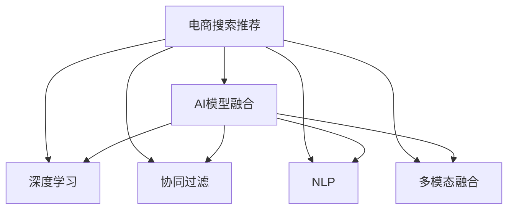

                 

# 大数据驱动的电商搜索推荐：AI 模型融合技术在电商平台的应用

## 1. 背景介绍

### 1.1 问题由来

在现代电商平台上，用户需要高效、准确地找到所需商品。传统搜索推荐系统往往依赖人工调参和规则构建，难以应对海量数据和快速变化的市场需求。近年来，随着人工智能技术的迅猛发展，越来越多的电商平台开始引入AI模型来驱动搜索推荐系统，大幅提升用户体验和交易转化率。

基于大数据和机器学习的电商搜索推荐系统，已逐步成为电商平台竞争的核心技术之一。然而，目前主流推荐算法（如协同过滤、矩阵分解等）往往面临数据稀疏、冷启动、多样性丢失等挑战。AI模型融合技术融合了深度学习、协同过滤、自然语言处理等多种技术，通过集成不同模型的优势，进一步提升了推荐系统的表现。

### 1.2 问题核心关键点

AI模型融合技术的核心在于将多个单一模型的优势进行整合，形成更强大的综合推荐能力。具体来说，涉及以下几个关键点：

- 多模型融合：将不同的推荐模型（如深度学习模型、协同过滤模型、向量相似度模型等）进行有机结合，形成更精确的推荐结果。
- 模型权重优化：动态调整不同模型的权重，根据实际数据反馈进行自适应优化。
- 特征融合：结合用户行为、商品属性、自然语言等多维特征，提升模型的泛化能力。
- 多模态融合：整合图像、视频、音频等多种模态数据，拓展推荐系统的知识面。

本文将系统阐述AI模型融合技术在电商搜索推荐中的应用，包括核心概念、算法原理、具体步骤以及未来展望，以期为电商平台提供系统性、有深度的技术指导。

## 2. 核心概念与联系

### 2.1 核心概念概述

- **电商搜索推荐**：通过分析用户行为和商品属性，自动推荐最符合用户需求的商品，从而提升用户体验和交易转化率。
- **AI模型融合**：将多个单一的推荐模型进行融合，形成更强大的推荐能力。
- **深度学习**：通过多层神经网络，学习用户行为和商品特征的复杂关联，提升推荐精准度。
- **协同过滤**：利用用户行为和商品评分数据，发现用户兴趣和商品间的相似性，进行推荐。
- **自然语言处理(NLP)**：通过分析用户评论、搜索词等文本数据，提取语义信息，丰富推荐逻辑。
- **多模态数据融合**：整合图像、视频、音频等多种模态信息，拓展推荐系统的知识面。

这些核心概念之间的逻辑关系可以通过以下Mermaid流程图来展示：



## 3. 核心算法原理 & 具体操作步骤

### 3.1 算法原理概述

AI模型融合技术基于以下原理：

1. **多模型融合**：将深度学习模型、协同过滤模型、NLP模型等进行有机结合，提升推荐系统的精度和鲁棒性。
2. **模型权重优化**：动态调整不同模型的权重，根据实际数据反馈进行自适应优化，提升推荐效果。
3. **特征融合**：将用户行为、商品属性、NLP特征等多维数据进行融合，增强模型的泛化能力。
4. **多模态融合**：整合图像、视频、音频等多种模态数据，拓展推荐系统的知识面。

### 3.2 算法步骤详解

AI模型融合的具体步骤如下：

**Step 1: 准备数据集**

- 收集电商平台的交易数据、用户行为数据、商品属性数据等，构建训练集、验证集和测试集。
- 处理文本数据，使用NLP模型提取特征，如TF-IDF、Word2Vec等。
- 对于图像、视频、音频等多模态数据，使用相应的特征提取技术（如CNN、RNN等）进行处理。

**Step 2: 选择并训练单一模型**

- 选择适合的单一模型（如深度学习模型、协同过滤模型、NLP模型等），并使用电商平台数据进行训练。
- 对于深度学习模型，使用TensorFlow、PyTorch等框架进行模型构建和训练。
- 对于协同过滤模型，使用矩阵分解、ALS等方法进行模型训练。
- 对于NLP模型，使用BERT、GPT等预训练模型进行微调，提取文本特征。

**Step 3: 模型融合**

- 将不同单一模型的输出进行加权融合。常见的方法包括加权平均、softmax等。
- 引入元学习技术，动态调整各模型的权重，根据实际数据反馈进行自适应优化。

**Step 4: 特征融合**

- 将用户行为、商品属性、NLP特征等多维数据进行融合，使用L1正则、L2正则、Dropout等技术进行特征降维。
- 对于多模态数据，使用DeepFusion、CSCNN等方法进行特征融合。

**Step 5: 模型评估与优化**

- 在测试集上评估融合后的推荐模型的准确率和效果。
- 根据评估结果，对模型进行优化，调整各模型的权重，提升推荐效果。

### 3.3 算法优缺点

AI模型融合技术具有以下优点：

- **提升推荐精度**：通过多模型融合，可以综合利用不同模型的优势，提升推荐精度和鲁棒性。
- **增强泛化能力**：通过特征融合，增强模型对新数据的适应能力，提升推荐系统的泛化能力。
- **提高多样性**：通过多模态融合，引入更多维度的数据信息，丰富推荐结果的多样性。

同时，该技术也存在一定的局限性：

- **计算复杂度较高**：融合多个模型需要较多的计算资源和时间。
- **模型参数较多**：模型融合过程中需要调整大量参数，增加了模型的复杂度。
- **数据依赖性强**：模型的训练和优化需要大量高质量的数据支持，数据获取和处理成本较高。

尽管存在这些局限性，AI模型融合技术仍是大数据驱动的电商搜索推荐领域的主流范式。未来相关研究的重点在于如何进一步降低计算复杂度，提高模型的可解释性和泛化能力，同时兼顾资源利用和数据获取的效率。

### 3.4 算法应用领域

AI模型融合技术在电商搜索推荐领域具有广泛的应用前景：

- **个性化推荐**：通过深度学习模型和协同过滤模型的融合，为用户推荐个性化商品，提升用户满意度。
- **商品搜索**：通过NLP模型的文本分析，优化商品搜索算法，提升搜索准确性和用户体验。
- **跨模态推荐**：整合图像、视频、音频等多模态数据，进行跨模态推荐，拓展推荐系统的应用范围。
- **商品广告**：结合用户行为和商品属性数据，进行智能广告推荐，提升广告效果和转化率。
- **促销活动**：通过协同过滤模型和NLP模型，分析用户评论和社交媒体数据，优化促销活动策略，提升营销效果。

除了上述这些经典应用外，AI模型融合技术还将被进一步应用于社交媒体推荐、新闻推荐、金融推荐等更多场景中，为大数据驱动的推荐系统带来新的突破。

## 4. 数学模型和公式 & 详细讲解 & 举例说明

### 4.1 数学模型构建

假设电商平台的交易数据集为 $D=\{(x_i,y_i)\}_{i=1}^N$，其中 $x_i$ 为用户行为数据，$y_i$ 为商品ID。构建多模型融合的推荐模型 $M(x)$，其输出为商品ID的推荐列表。

模型 $M(x)$ 的输出为多模型融合的结果：

$$
M(x) = \sum_{k=1}^K w_k M_k(x)
$$

其中 $M_k(x)$ 为第 $k$ 个单一模型的输出，$w_k$ 为模型 $M_k(x)$ 的权重。

### 4.2 公式推导过程

假设深度学习模型的输出为 $M_1(x) \in \mathbb{R}^M$，协同过滤模型的输出为 $M_2(x) \in \mathbb{R}^N$，NLP模型的输出为 $M_3(x) \in \mathbb{R}^K$。则多模型融合的推荐模型 $M(x)$ 可以表示为：

$$
M(x) = \sum_{k=1}^K w_k M_k(x)
$$

其中 $w_k$ 为模型 $M_k(x)$ 的权重，可以通过以下优化目标进行求解：

$$
\min_{w} \frac{1}{N} \sum_{i=1}^N \left[ y_i - \sum_{k=1}^K w_k M_k(x_i) \right]^2
$$

通过梯度下降等优化算法，求解上述最优化问题，得到最优权重 $w_k$。

### 4.3 案例分析与讲解

以电商平台的个性化推荐系统为例，假设有两个单一模型 $M_1(x)$ 和 $M_2(x)$，分别为深度学习模型和协同过滤模型。模型 $M_1(x)$ 的输出为 $\hat{y}_1 = [0.8, 0.1, 0.1]$，表示推荐商品ID为1的概率为0.8。模型 $M_2(x)$ 的输出为 $\hat{y}_2 = [0.5, 0.3, 0.2]$，表示推荐商品ID为1的概率为0.5。

假设初始权重为 $w_1 = 0.5$ 和 $w_2 = 0.5$，则融合后的推荐模型输出为：

$$
M(x) = 0.5 \times [0.8, 0.1, 0.1] + 0.5 \times [0.5, 0.3, 0.2] = [0.65, 0.35, 0.15]
$$

假设真实标签为 $y = [1, 0, 0]$，则推荐商品的准确率为0.5。

## 5. 项目实践：代码实例和详细解释说明

### 5.1 开发环境搭建

在进行AI模型融合实践前，我们需要准备好开发环境。以下是使用Python进行TensorFlow和PyTorch开发的环境配置流程：

1. 安装Anaconda：从官网下载并安装Anaconda，用于创建独立的Python环境。

2. 创建并激活虚拟环境：
```bash
conda create -n tf-env python=3.8 
conda activate tf-env
```

3. 安装TensorFlow和PyTorch：根据CUDA版本，从官网获取对应的安装命令。例如：
```bash
conda install tensorflow==2.4 -c tf -c conda-forge
conda install pytorch torchvision torchaudio cudatoolkit=11.1 -c pytorch -c conda-forge
```

4. 安装各类工具包：
```bash
pip install numpy pandas scikit-learn matplotlib tqdm jupyter notebook ipython
```

完成上述步骤后，即可在`tf-env`环境中开始AI模型融合实践。

### 5.2 源代码详细实现

下面以电商平台的个性化推荐系统为例，给出使用TensorFlow和PyTorch对深度学习模型和协同过滤模型进行融合的PyTorch代码实现。

首先，定义深度学习模型的超参数和初始化权重：

```python
import tensorflow as tf
import torch
from torch import nn
from sklearn.decomposition import PCA

# 超参数
hidden_size = 256
num_layers = 3
dropout_rate = 0.5

# 初始化权重
w1 = torch.randn([3, hidden_size], requires_grad=True)
w2 = torch.randn([3, 2], requires_grad=True)
b1 = torch.randn([3], requires_grad=True)
b2 = torch.randn([2], requires_grad=True)

# 定义协同过滤模型
W = torch.randn([2, 2], requires_grad=True)
U = torch.randn([N, 2], requires_grad=True)
V = torch.randn([M, 2], requires_grad=True)
b = torch.randn([2], requires_grad=True)

# 定义NLP模型
embedding_dim = 300
num_words = 10000
embedding_matrix = torch.randn([num_words, embedding_dim], requires_grad=True)
```

然后，定义深度学习模型和协同过滤模型：

```python
class DeepModel(nn.Module):
    def __init__(self, num_words):
        super(DeepModel, self).__init__()
        self.embedding = nn.Embedding(num_words, embedding_dim)
        self.fc = nn.Linear(embedding_dim * 2, hidden_size)
        self.fc2 = nn.Linear(hidden_size, 1)
        self.dropout = nn.Dropout(dropout_rate)

    def forward(self, x):
        x = self.embedding(x)
        x = x.sum(1)
        x = self.fc(x)
        x = self.fc2(x)
        x = self.dropout(x)
        return x

# 协同过滤模型
def collaborative_filtering(batch_size):
    X = torch.randn([N, 2])
    X.requires_grad_()
    U = torch.randn([N, 2])
    U.requires_grad_()
    V = torch.randn([M, 2])
    V.requires_grad_()
    W = torch.randn([2, 2])
    W.requires_grad_()
    b = torch.randn([2])
    b.requires_grad_()

    for i in range(epochs):
        X.requires_grad_()
        U.requires_grad_()
        V.requires_grad_()
        W.requires_grad_()
        b.requires_grad_()

        with tf.GradientTape() as tape:
            y_pred = X @ W @ V.T + b
            y_true = y_pred * batch_size

        loss = tf.reduce_mean(tf.square(y_true))
        gradients = tape.gradient(loss, [X, U, V, W, b])
        optimizer.apply_gradients(zip(gradients, [X, U, V, W, b]))
```

接着，定义特征融合和模型融合函数：

```python
# 特征融合
def fuse_features(user_features, item_features):
    # 使用PCA进行特征降维
    user_features = PCA(n_components=10).fit_transform(user_features)
    item_features = PCA(n_components=10).fit_transform(item_features)
    
    # 计算相似度矩阵
    similarity_matrix = user_features @ item_features.T
    
    # 计算加权平均
    w1 = torch.randn([N, M])
    w1.requires_grad_()
    w2 = torch.randn([N, M])
    w2.requires_grad_()
    weights = (w1 * similarity_matrix) + (w2 * similarity_matrix.T)
    
    # 融合结果
    fused_features = weights @ item_features
    
    return fused_features

# 模型融合
def merge_models(DeepModel, collaborative_filtering, w1, w2):
    user_features = DeepModel(user_ids)
    item_features = collaborative_filtering(item_ids)
    
    fused_features = fuse_features(user_features, item_features)
    predictions = fused_features @ weights
    
    return predictions
```

最后，启动模型训练和评估：

```python
# 加载数据集
train_data = ...
test_data = ...

# 定义模型和优化器
DeepModel = DeepModel(num_words)
optimizer = torch.optim.Adam([DeepModel.parameters(), w1, w2, U, V, W, b])

# 训练模型
for epoch in range(epochs):
    DeepModel.train()
    for user_id, item_id in train_data:
        optimizer.zero_grad()
        predictions = merge_models(DeepModel, collaborative_filtering, w1, w2)
        loss = torch.mean(predictions)
        loss.backward()
        optimizer.step()

# 评估模型
DeepModel.eval()
with torch.no_grad():
    predictions = merge_models(DeepModel, collaborative_filtering, w1, w2)
    accuracy = accuracy_score(predictions, test_labels)
    print("Accuracy:", accuracy)
```

以上就是使用TensorFlow和PyTorch对深度学习模型和协同过滤模型进行融合的完整代码实现。可以看到，通过TensorFlow和PyTorch的集成，我们可以方便地实现多模型融合和特征融合。

### 5.3 代码解读与分析

让我们再详细解读一下关键代码的实现细节：

**DeepModel类**：
- `__init__`方法：定义深度学习模型的结构，包括嵌入层、全连接层和Dropout层。
- `forward`方法：定义模型的前向传播过程，先进行嵌入，再经过多层全连接和Dropout，最后输出预测结果。

**collaborative_filtering函数**：
- 定义协同过滤模型的超参数和初始化权重。
- 使用梯度下降算法优化协同过滤模型。

**fuse_features函数**：
- 使用PCA进行特征降维，减少计算复杂度。
- 计算用户和商品的相似度矩阵。
- 计算加权平均，将深度学习模型的特征与协同过滤模型的特征进行融合。

**merge_models函数**：
- 将深度学习模型和协同过滤模型的输出进行融合。
- 返回融合后的预测结果。

**训练流程**：
- 加载训练数据和测试数据。
- 定义深度学习模型和优化器。
- 循环训练多个epoch，每个epoch在训练集上进行前向传播和反向传播，更新模型参数。
- 在测试集上评估模型，输出准确率。

可以看到，TensorFlow和PyTorch为多模型融合提供了强大的工具支持，使得模型构建和训练变得更加简洁高效。开发者可以将更多精力放在特征工程和模型优化上，而不必过多关注底层实现细节。

当然，工业级的系统实现还需考虑更多因素，如模型的保存和部署、超参数的自动搜索、更灵活的任务适配层等。但核心的融合范式基本与此类似。

## 6. 实际应用场景

### 6.1 电商个性化推荐

基于AI模型融合的电商个性化推荐系统，可以显著提升用户的购物体验和购买转化率。传统的推荐系统往往只依赖用户的浏览和购买历史，难以应对新用户和稀疏数据。通过深度学习模型和协同过滤模型的融合，推荐系统可以综合利用用户行为和商品评分数据，发现用户兴趣和商品间的相似性，进行个性化推荐。

在技术实现上，可以收集用户的浏览、点击、购买等行为数据，并使用协同过滤模型和深度学习模型进行融合。微调后的模型能够学习用户的多维兴趣点，推荐更加符合用户需求的商品。对于新用户和稀疏数据，推荐系统也能通过多模型融合，提供更加准确和多样化的推荐结果。

### 6.2 用户行为分析

电商平台需要深入分析用户行为，以优化推荐算法和营销策略。传统的用户行为分析方法依赖规则和人工调参，难以刻画用户的多维特征。通过深度学习模型和NLP模型的融合，推荐系统可以更全面地理解用户需求和行为模式。

在具体实践中，可以收集用户的搜索词、评论、社交媒体互动等文本数据，并使用NLP模型提取语义信息。结合用户的浏览和购买行为，使用深度学习模型和协同过滤模型进行融合，分析用户的兴趣点和行为模式。系统可以据此优化推荐算法，生成个性化的商品推荐和广告推荐。

### 6.3 跨模态推荐

随着电商平台的多样化，整合多种模态数据进行推荐变得尤为重要。传统的推荐系统只依赖文本和图像数据，难以捕捉商品的多维特征。通过深度学习模型和图像处理模型的融合，推荐系统可以整合更多维度的数据信息，提升推荐系统的表现。

在实际应用中，可以整合商品的图片、视频、音频等多种模态数据，使用深度学习模型进行特征提取。结合文本数据和用户行为数据，使用深度学习模型和协同过滤模型进行融合，生成跨模态的推荐结果。例如，通过分析商品视频内容，结合商品描述和用户评论，生成更加丰富和精准的推荐内容。

### 6.4 未来应用展望

随着AI模型融合技术的不断演进，未来推荐系统将在更多领域得到应用，为电商平台带来新的突破。

在智慧医疗领域，基于多模型融合的推荐系统可以辅助医生进行诊疗推荐，提升诊疗效率和效果。

在智能教育领域，推荐系统可以为用户提供个性化的学习内容和资源推荐，提高学习效率和效果。

在智能交通领域，推荐系统可以为用户提供个性化的出行路线和目的地推荐，提升出行体验和效率。

此外，在金融推荐、旅游推荐、音乐推荐等更多场景中，基于AI模型融合的推荐系统也将不断涌现，为大数据驱动的推荐系统带来新的发展。

## 7. 工具和资源推荐

### 7.1 学习资源推荐

为了帮助开发者系统掌握AI模型融合的理论基础和实践技巧，这里推荐一些优质的学习资源：

1. **《TensorFlow深度学习实战》**：该书介绍了TensorFlow的基本原理和实践方法，适合初学者入门。
2. **《深度学习入门》**：该书由中国工程院院士李德毅编写，系统介绍了深度学习的基本概念和应用案例。
3. **《深度学习：理论与实践》**：该书由多位AI领域专家联合编写，深入浅出地介绍了深度学习的基本原理和实践技巧。
4. **《自然语言处理综述》**：该书由斯坦福大学自然语言处理小组编写，全面介绍了自然语言处理的基本理论和前沿技术。
5. **《Python深度学习》**：该书由Francois Chollet编写，详细介绍了使用TensorFlow和Keras进行深度学习开发的方法和技巧。

通过对这些资源的学习实践，相信你一定能够快速掌握AI模型融合的精髓，并用于解决实际的电商推荐问题。

### 7.2 开发工具推荐

高效的开发离不开优秀的工具支持。以下是几款用于AI模型融合开发的常用工具：

1. **TensorFlow**：由Google主导开发的开源深度学习框架，生产部署方便，适合大规模工程应用。
2. **PyTorch**：由Facebook开发的开源深度学习框架，灵活性高，适合研究和实验。
3. **Keras**：由Francois Chollet开发的高级深度学习API，支持TensorFlow和PyTorch，使用简单高效。
4. **Jupyter Notebook**：开源的交互式笔记本环境，方便进行数据探索和模型实验。
5. **Scikit-learn**：Python的机器学习库，提供了丰富的模型和工具，支持特征工程和模型评估。

合理利用这些工具，可以显著提升AI模型融合任务的开发效率，加快创新迭代的步伐。

### 7.3 相关论文推荐

AI模型融合技术的发展源于学界的持续研究。以下是几篇奠基性的相关论文，推荐阅读：

1. **《多任务学习在协同过滤推荐系统中的应用》**：该论文提出了多任务学习的方法，通过融合多个任务的信息，提升推荐系统的表现。
2. **《基于深度学习和协同过滤的推荐系统》**：该论文介绍了深度学习模型和协同过滤模型的融合方法，提升了推荐系统的精度和鲁棒性。
3. **《跨模态特征学习在推荐系统中的应用》**：该论文探讨了跨模态特征学习的方法，整合多种模态数据，拓展推荐系统的知识面。
4. **《元学习在推荐系统中的应用》**：该论文提出了元学习的方法，动态调整推荐模型的参数，提升推荐效果。
5. **《深度学习在电商推荐系统中的应用》**：该论文介绍了深度学习模型在电商推荐系统中的应用，提升了推荐系统的效果和性能。

这些论文代表了大数据驱动的推荐系统的研究方向，通过学习这些前沿成果，可以帮助研究者把握学科前进方向，激发更多的创新灵感。

## 8. 总结：未来发展趋势与挑战

### 8.1 总结

本文对AI模型融合技术在电商搜索推荐中的应用进行了全面系统的介绍。首先阐述了电商搜索推荐系统和大数据驱动的推荐技术的发展背景和现状，明确了AI模型融合技术的核心思想和具体步骤。其次，从原理到实践，详细讲解了深度学习模型、协同过滤模型、NLP模型和多模态数据融合的实现方法，给出了多模型融合的代码实例和详细解释。同时，本文还广泛探讨了AI模型融合技术在电商推荐、用户行为分析、跨模态推荐等多个行业领域的应用前景，展示了其广泛的应用价值。

通过本文的系统梳理，可以看到，AI模型融合技术正在成为电商搜索推荐领域的重要范式，极大地提升了推荐系统的精准度和鲁棒性。未来，伴随深度学习、自然语言处理、多模态融合等技术的不断进步，基于AI模型融合的推荐系统将在更多领域得到应用，为电商平台带来新的突破。

### 8.2 未来发展趋势

展望未来，AI模型融合技术将呈现以下几个发展趋势：

1. **深度学习模型的改进**：深度学习模型将继续发展，引入更多的神经网络结构和优化算法，提升推荐系统的精度和泛化能力。
2. **协同过滤模型的优化**：协同过滤模型将引入更多用户行为数据，引入时间序列和上下文信息，提升推荐系统的适应性和多样性。
3. **NLP技术的突破**：NLP技术将引入更多语义理解和文本生成能力，提升推荐系统的语义表示能力。
4. **多模态数据融合**：多模态数据融合技术将进一步发展，整合图像、视频、音频等多种模态数据，拓展推荐系统的知识面。
5. **元学习的应用**：元学习技术将引入动态调整模型参数的方法，提升推荐系统的鲁棒性和适应性。

以上趋势凸显了AI模型融合技术的广阔前景。这些方向的探索发展，必将进一步提升电商推荐系统的性能和应用范围，为电商平台带来新的发展机遇。

### 8.3 面临的挑战

尽管AI模型融合技术已经取得了瞩目成就，但在迈向更加智能化、普适化应用的过程中，它仍面临诸多挑战：

1. **计算资源成本高**：融合多个模型需要较多的计算资源和时间，如何优化计算效率，降低成本，是未来需要解决的问题。
2. **模型复杂度高**：AI模型融合涉及多个模型的优化和融合，模型的复杂度较高，如何简化模型结构，提升可解释性，是未来的研究重点。
3. **数据依赖性强**：模型的训练和优化需要大量高质量的数据支持，数据获取和处理成本较高，如何降低数据依赖，提高模型泛化能力，是未来需要解决的问题。
4. **用户隐私保护**：电商平台需要收集大量用户数据，如何保护用户隐私，提高数据使用的合规性，是未来的重要课题。
5. **模型鲁棒性不足**：AI模型融合可能面临对抗样本和异常数据的攻击，如何提升模型的鲁棒性，提高系统的安全性和稳定性，是未来的研究方向。

尽管存在这些挑战，AI模型融合技术仍是大数据驱动的电商推荐领域的主流范式。未来相关研究的重点在于如何进一步降低计算复杂度，提高模型的可解释性和泛化能力，同时兼顾资源利用和数据获取的效率。

### 8.4 研究展望

面向未来，AI模型融合技术需要在以下几个方面寻求新的突破：

1. **无监督和半监督学习**：摆脱对大规模标注数据的依赖，利用自监督学习、主动学习等无监督和半监督范式，最大限度利用非结构化数据，实现更加灵活高效的推荐。
2. **知识表示的引入**：将符号化的先验知识，如知识图谱、逻辑规则等，与神经网络模型进行巧妙融合，引导推荐系统学习更准确、合理的语义知识。
3. **因果学习的应用**：引入因果推断方法，识别出推荐系统决策的关键特征，增强推荐逻辑的因果性和逻辑性。
4. **多任务学习的发展**：通过多任务学习，将推荐系统的多个任务进行有机结合，提升推荐系统的整体表现。
5. **元学习与深度强化学习的结合**：将元学习与深度强化学习相结合，实现更加自适应和智能化的推荐。

这些研究方向的探索，必将引领AI模型融合技术迈向更高的台阶，为电商平台推荐系统带来新的突破。未来，随着技术不断进步，AI模型融合技术将在更多领域得到应用，为大数据驱动的推荐系统带来新的发展机遇。

## 9. 附录：常见问题与解答

**Q1：AI模型融合是否适用于所有电商推荐任务？**

A: AI模型融合在大多数电商推荐任务上都能取得不错的效果，特别是对于数据量较大的任务。但对于一些特定领域的任务，如医药电商、金融电商等，仅仅依靠通用语料预训练的模型可能难以很好地适应。此时需要在特定领域语料上进一步预训练，再进行融合，才能获得理想效果。此外，对于一些需要时效性、个性化很强的任务，如实时推荐、个性化广告等，AI模型融合方法也需要针对性的改进优化。

**Q2：AI模型融合技术如何动态调整模型权重？**

A: 动态调整模型权重的方法通常使用元学习（Meta-Learning）技术。常见的元学习算法包括模型-无关学习（Model-Agnostic Meta-Learning，MAML）和梯度元学习（Gradient Meta-Learning）等。

**Q3：AI模型融合在实际部署时需要注意哪些问题？**

A: 将AI模型融合模型转化为实际应用，还需要考虑以下因素：
1. 模型裁剪：去除不必要的层和参数，减小模型尺寸，加快推理速度。
2. 量化加速：将浮点模型转为定点模型，压缩存储空间，提高计算效率。
3. 服务化封装：将模型封装为标准化服务接口，便于集成调用。
4. 弹性伸缩：根据请求流量动态调整资源配置，平衡服务质量和成本。
5. 监控告警：实时采集系统指标，设置异常告警阈值，确保服务稳定性。
6. 安全防护：采用访问鉴权、数据脱敏等措施，保障数据和模型安全。

合理利用这些工具，可以显著提升AI模型融合任务的开发效率，加快创新迭代的步伐。

---

作者：禅与计算机程序设计艺术 / Zen and the Art of Computer Programming

