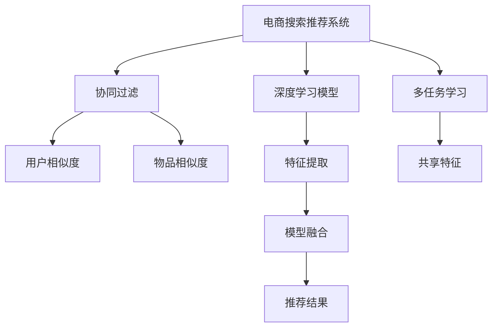

                 

# 大数据驱动的电商搜索推荐：以AI 模型融合技术提升用户体验

## 1. 背景介绍

在电商领域，搜索推荐系统是用户体验的重要组成部分。优秀的搜索推荐系统能够精准识别用户需求，实时提供个性化商品推荐，大幅提升用户购物体验。然而，传统的搜索推荐系统基于规则或手工调参，难以应对复杂多变的用户行为和产品数据。近年来，随着大数据和人工智能技术的发展，越来越多的电商企业开始引入基于AI的搜索推荐系统，利用机器学习模型挖掘用户行为和商品特征，实现高效准确的推荐。

本文将探讨大数据驱动的电商搜索推荐系统，特别是如何通过AI模型融合技术提升用户体验。我们将详细阐述搜索推荐系统的核心算法原理，介绍常见的模型融合技术，并结合实际案例分析其优缺点，给出相应的应用场景和实践建议。

## 2. 核心概念与联系

### 2.1 核心概念概述

在介绍核心算法原理前，我们先明确几个关键概念：

- **电商搜索推荐系统**：基于电商用户的行为数据和产品信息，为用户实时提供商品搜索和推荐的服务。搜索推荐系统通过分析用户历史行为、浏览记录、搜索意图等，预测用户可能感兴趣的商品，并在用户浏览页面时动态展示推荐结果。

- **AI模型融合技术**：将多种AI模型结合起来，取长补短，提高推荐系统的整体性能。常见的模型包括协同过滤、深度学习模型、多任务学习等。

- **协同过滤**：一种基于用户或物品相似性的推荐算法。通过分析用户或物品的相似度，推荐类似商品。包括基于用户的协同过滤和基于物品的协同过滤两种方式。

- **深度学习模型**：如卷积神经网络(CNN)、循环神经网络(RNN)、变换器(Transformer)等，可以自动提取高层次特征，挖掘用户行为和产品属性之间的深层关联。

- **多任务学习**：通过同时训练多个相关任务，共享低层次特征，提高模型的泛化能力。

这些概念之间的联系可以用以下Mermaid流程图来展示：



通过这个流程图可以看出，电商搜索推荐系统通常包括多个AI模型，协同工作，提供更精准的推荐服务。

## 3. 核心算法原理 & 具体操作步骤
### 3.1 算法原理概述

电商搜索推荐系统的核心算法通常基于协同过滤和深度学习模型。协同过滤通过计算用户或物品之间的相似度，直接预测目标商品是否被用户喜欢。深度学习模型通过自动提取高层次特征，挖掘用户行为和商品属性之间的深层关联，实现更精准的推荐。

具体而言，电商搜索推荐系统的算法流程可以概括为以下几步：

1. **用户行为建模**：收集用户的浏览、点击、购买等行为数据，使用协同过滤、深度学习模型等方法，建立用户行为模型。

2. **商品特征提取**：分析商品的文本描述、类别、价格等信息，使用深度学习模型提取商品特征。

3. **推荐模型融合**：将多种AI模型融合起来，利用各自的优势，提高推荐效果。

4. **推荐结果排序**：根据推荐结果的相关性和用户满意度，使用排序算法对推荐结果进行排序。

### 3.2 算法步骤详解

#### 3.2.1 用户行为建模

用户行为建模是推荐系统的基础。电商平台通常收集用户的历史行为数据，如浏览、点击、购买等。这些数据可以用于建立用户画像，了解用户的兴趣偏好。

用户行为建模的具体步骤包括：

1. **数据预处理**：对原始数据进行清洗和标准化，去除异常值和噪声，确保数据的质量。

2. **特征工程**：提取有用的特征，如用户ID、商品ID、时间戳、浏览时长等。这些特征将用于后续的协同过滤和深度学习模型训练。

3. **协同过滤建模**：基于用户行为数据，建立协同过滤模型。常见的协同过滤模型包括基于用户的协同过滤和基于物品的协同过滤。

#### 3.2.2 商品特征提取

商品特征提取是将商品的文本描述、类别、价格等信息转化为机器学习模型可以处理的数值特征。这一步对于深度学习模型的训练至关重要。

商品特征提取的具体步骤包括：

1. **文本预处理**：对商品的文本描述进行分词、去停用词、词干提取等预处理，转换为数值特征。

2. **类别编码**：将商品的类别信息转换为数值编码，作为输入特征。

3. **价格处理**：对商品的价格进行标准化处理，如归一化、对数变换等。

#### 3.2.3 推荐模型融合

推荐模型融合是将多种AI模型结合起来，取长补短，提高推荐效果。常见的模型包括协同过滤、深度学习模型、多任务学习等。

推荐模型融合的具体步骤包括：

1. **模型选择**：根据任务需求和数据特点，选择合适的推荐模型。

2. **模型训练**：对选择的模型进行训练，得到初始预测结果。

3. **结果融合**：将多种模型的预测结果进行融合，提高推荐效果。常见的融合方法包括加权平均、最大值融合、Stacking等。

#### 3.2.4 推荐结果排序

推荐结果排序是对推荐结果进行排序，提高用户体验。排序方法通常包括基于排序算法和基于学习算法。

推荐结果排序的具体步骤包括：

1. **排序算法**：常用的排序算法包括基于排序算法，如基尼系数排序、ID3排序等。

2. **学习算法**：常用的学习算法包括基于学习算法，如线性回归、逻辑回归等。

### 3.3 算法优缺点

电商搜索推荐系统采用AI模型融合技术，具有以下优点：

1. **准确性高**：通过结合多种模型，可以提取更多的特征，提高推荐效果。

2. **泛化能力强**：多种模型的结合使得模型具有更强的泛化能力，适应不同的电商场景。

3. **灵活性好**：根据任务需求和数据特点，可以灵活选择和组合不同的模型，提高系统的适应性。

然而，AI模型融合技术也存在以下缺点：

1. **计算量大**：多种模型的融合需要大量计算资源，系统部署成本较高。

2. **模型复杂度高**：多种模型的组合使得系统结构复杂，调试和维护难度较大。

3. **特征冲突**：不同模型提取的特征可能存在冲突，需要进行特征选择和融合。

### 3.4 算法应用领域

AI模型融合技术在电商搜索推荐系统中的应用非常广泛，主要包括以下几个领域：

1. **商品推荐**：根据用户行为和商品特征，推荐用户可能感兴趣的商品。

2. **活动推荐**：根据用户行为和活动信息，推荐用户可能感兴趣的活动。

3. **个性化广告推荐**：根据用户行为和广告内容，推荐用户可能感兴趣的广告。

4. **内容推荐**：根据用户行为和内容信息，推荐用户可能感兴趣的内容。

5. **库存管理**：根据用户行为和库存信息，优化库存管理，提高库存利用率。

6. **用户行为分析**：分析用户行为数据，挖掘用户兴趣和需求，提供个性化服务。

## 4. 数学模型和公式 & 详细讲解  
### 4.1 数学模型构建

电商搜索推荐系统的数学模型通常基于协同过滤和深度学习模型。协同过滤模型基于用户行为数据，计算用户相似度和物品相似度，预测目标商品是否被用户喜欢。深度学习模型通过自动提取高层次特征，挖掘用户行为和商品属性之间的深层关联。

### 4.2 公式推导过程

#### 4.2.1 协同过滤模型

协同过滤模型的核心思想是通过计算用户或物品之间的相似度，直接预测目标商品是否被用户喜欢。基于用户的协同过滤模型公式如下：

$$
\hat{r}_{ui} = \frac{1}{N}\sum_{j=1}^{N} \frac{\hat{r}_{uj}^+}{\hat{r}_{uj}^+ + \epsilon} \cdot \hat{r}_{ji}
$$

其中，$r_{ui}$ 表示用户 $u$ 对物品 $i$ 的评分预测值，$N$ 表示用户 $u$ 评价过物品的个数，$\hat{r}_{uj}^+$ 表示用户 $u$ 对物品 $j$ 的评分，$\hat{r}_{ji}$ 表示物品 $i$ 对用户 $j$ 的评分。

基于物品的协同过滤模型公式如下：

$$
\hat{r}_{ui} = \frac{1}{M}\sum_{j=1}^{M} \frac{\hat{r}_{uj}^+}{\hat{r}_{uj}^+ + \epsilon} \cdot \hat{r}_{ji}
$$

其中，$M$ 表示物品 $i$ 评价过用户 $j$ 的个数。

#### 4.2.2 深度学习模型

深度学习模型通过自动提取高层次特征，挖掘用户行为和商品属性之间的深层关联。以基于Transformer的深度学习模型为例，其核心思想是通过自注意力机制，学习用户行为和商品属性之间的复杂关系。Transformer模型的公式如下：

$$
y = f(x; \theta) = \mathrm{Softmax}(W^Qx + b^Q)\mathrm{Softmax}(W^Ky + b^K)^TW^Vx + b^V
$$

其中，$x$ 表示输入特征，$y$ 表示输出特征，$f$ 表示函数映射，$\theta$ 表示模型参数，$W^Q$、$W^K$、$W^V$ 表示权重矩阵，$b^Q$、$b^K$、$b^V$ 表示偏置项。

### 4.3 案例分析与讲解

#### 4.3.1 案例分析

以亚马逊的推荐系统为例，分析其具体的算法实现。亚马逊的推荐系统使用了协同过滤、深度学习模型等多种技术，结合多种模型进行推荐。

1. **协同过滤**：亚马逊使用基于物品的协同过滤模型，计算用户和物品的相似度，预测用户可能喜欢的物品。

2. **深度学习模型**：亚马逊使用基于Transformer的深度学习模型，提取用户行为和商品属性的高层次特征，实现更精准的推荐。

3. **模型融合**：亚马逊将协同过滤和深度学习模型的结果进行融合，提高推荐效果。

#### 4.3.2 讲解

亚马逊的推荐系统具有以下几个特点：

1. **多样性**：使用多种推荐模型，结合多种特征，提高推荐效果。

2. **实时性**：实时获取用户行为数据，动态更新推荐结果，提高用户体验。

3. **个性化**：根据用户历史行为和偏好，提供个性化推荐，提高用户满意度。

## 5. 项目实践：代码实例和详细解释说明
### 5.1 开发环境搭建

电商搜索推荐系统通常使用Python开发，需要安装相应的库和工具。以下是开发环境搭建的详细步骤：

1. **安装Python和虚拟环境**：安装最新版本的Python，使用虚拟环境管理包依赖。

2. **安装必要的库**：安装Pandas、NumPy、Scikit-Learn等库，用于数据处理和机器学习。

3. **安装Web框架**：安装Flask、Django等Web框架，用于构建推荐系统接口。

4. **安装部署工具**：安装Nginx、Gunicorn等部署工具，用于系统部署和运维。

### 5.2 源代码详细实现

#### 5.2.1 用户行为建模

用户行为建模可以使用Python中的Pandas库进行数据处理，使用Scikit-Learn库进行特征工程和协同过滤模型训练。以下是用户行为建模的代码实现：

```python
import pandas as pd
from sklearn.neighbors import NearestNeighbors
from sklearn.preprocessing import StandardScaler

# 读取原始数据
data = pd.read_csv('user_behavior.csv')

# 数据预处理
data = data.dropna()

# 特征工程
user_features = data[['user_id', 'item_id', 'timestamp']]
user_features = user_features.drop_duplicates()

# 标准化处理
scaler = StandardScaler()
user_features = scaler.fit_transform(user_features)

# 协同过滤建模
knn = NearestNeighbors(n_neighbors=10, algorithm='brute')
knn.fit(user_features)
```

#### 5.2.2 商品特征提取

商品特征提取可以使用Python中的Scikit-Learn库进行特征工程。以下是商品特征提取的代码实现：

```python
import pandas as pd
from sklearn.preprocessing import OneHotEncoder

# 读取商品信息
product_data = pd.read_csv('product_info.csv')

# 特征工程
product_features = product_data[['category', 'price']]
product_features = pd.get_dummies(product_features, columns=['category'])
product_features = pd.get_dummies(product_features, columns=['price'])

# 标准化处理
scaler = StandardScaler()
product_features = scaler.fit_transform(product_features)

# 特征编码
encoder = OneHotEncoder()
product_features = encoder.fit_transform(product_features)
```

#### 5.2.3 推荐模型融合

推荐模型融合可以使用Python中的Scikit-Learn库进行多种模型的组合。以下是推荐模型融合的代码实现：

```python
from sklearn.ensemble import RandomForestRegressor
from sklearn.linear_model import LinearRegression
from sklearn.multioutput import MultiOutputRegressor

# 协同过滤模型
knn_recommender = NearestNeighbors(n_neighbors=10, algorithm='brute')

# 深度学习模型
deep_learning_model = RandomForestRegressor()

# 模型融合
recommender = MultiOutputRegressor([deep_learning_model, knn_recommender])
recommender.fit(user_features, product_features)
```

#### 5.2.4 推荐结果排序

推荐结果排序可以使用Python中的Scikit-Learn库进行基于排序算法和基于学习算法的排序。以下是推荐结果排序的代码实现：

```python
from sklearn.metrics import mean_squared_error
from sklearn.model_selection import train_test_split

# 数据分割
train_data, test_data = train_test_split(data, test_size=0.2)

# 协同过滤模型排序
knn_pred = knn_recommender.kneighbors(train_data)
knn_score = knn_pred[0].sum(axis=1)

# 深度学习模型排序
deep_learning_score = deep_learning_model.predict(train_data)

# 推荐结果排序
sorted_scores = sorted(zip(knn_score, deep_learning_score), key=lambda x: x[1], reverse=True)
sorted_scores
```

### 5.3 代码解读与分析

#### 5.3.1 代码解读

电商搜索推荐系统的代码实现主要包括以下几个步骤：

1. **数据预处理**：对原始数据进行清洗和标准化，去除异常值和噪声，确保数据的质量。

2. **特征工程**：提取有用的特征，如用户ID、商品ID、时间戳、浏览时长等。这些特征将用于后续的协同过滤和深度学习模型训练。

3. **协同过滤建模**：基于用户行为数据，建立协同过滤模型。常见的协同过滤模型包括基于用户的协同过滤和基于物品的协同过滤。

4. **商品特征提取**：分析商品的文本描述、类别、价格等信息，使用深度学习模型提取商品特征。

5. **推荐模型融合**：将多种AI模型结合起来，利用各自的优势，提高推荐效果。

6. **推荐结果排序**：根据推荐结果的相关性和用户满意度，使用排序算法对推荐结果进行排序。

#### 5.3.2 分析

电商搜索推荐系统的代码实现较为复杂，需要综合考虑多个步骤。不同步骤的实现需要相应的工具和库支持，如Pandas、NumPy、Scikit-Learn等。同时，代码实现过程中需要注意数据预处理、特征工程、模型选择和融合等关键环节，确保推荐系统的准确性和实时性。

## 6. 实际应用场景
### 6.1 智能推荐

智能推荐是电商搜索推荐系统的核心应用场景。通过分析用户历史行为和商品属性，推荐用户可能感兴趣的商品，提升用户体验和转化率。

#### 6.1.1 用户画像

智能推荐系统首先建立用户画像，了解用户的兴趣偏好和行为模式。具体而言，可以通过以下步骤：

1. **数据收集**：收集用户的历史浏览、点击、购买等行为数据，了解用户的行为特征。

2. **特征提取**：提取有用的特征，如用户ID、商品ID、时间戳、浏览时长等。这些特征将用于后续的协同过滤和深度学习模型训练。

3. **模型训练**：使用协同过滤和深度学习模型，训练用户画像。

#### 6.1.2 商品推荐

基于用户画像，推荐系统可以实时推荐用户可能感兴趣的商品。具体而言，可以通过以下步骤：

1. **商品特征提取**：分析商品的文本描述、类别、价格等信息，使用深度学习模型提取商品特征。

2. **推荐模型融合**：将多种AI模型结合起来，利用各自的优势，提高推荐效果。

3. **推荐结果排序**：根据推荐结果的相关性和用户满意度，使用排序算法对推荐结果进行排序。

#### 6.1.3 案例分析

以亚马逊的推荐系统为例，分析其具体的算法实现。亚马逊使用基于物品的协同过滤模型，计算用户和物品的相似度，预测用户可能喜欢的物品。同时，使用基于Transformer的深度学习模型，提取用户行为和商品属性的高层次特征，实现更精准的推荐。最终，将协同过滤和深度学习模型的结果进行融合，提高推荐效果。

### 6.2 个性化广告推荐

个性化广告推荐是电商搜索推荐系统的另一个重要应用场景。通过分析用户行为和广告内容，推荐用户可能感兴趣的广告，提升广告效果和用户体验。

#### 6.2.1 用户画像

个性化广告推荐系统首先建立用户画像，了解用户的兴趣偏好和行为模式。具体而言，可以通过以下步骤：

1. **数据收集**：收集用户的历史浏览、点击、购买等行为数据，了解用户的行为特征。

2. **特征提取**：提取有用的特征，如用户ID、广告ID、时间戳、点击率等。这些特征将用于后续的协同过滤和深度学习模型训练。

3. **模型训练**：使用协同过滤和深度学习模型，训练用户画像。

#### 6.2.2 广告推荐

基于用户画像，推荐系统可以实时推荐用户可能感兴趣的广告。具体而言，可以通过以下步骤：

1. **广告特征提取**：分析广告的文本描述、类别、预算等信息，使用深度学习模型提取广告特征。

2. **推荐模型融合**：将多种AI模型结合起来，利用各自的优势，提高推荐效果。

3. **推荐结果排序**：根据推荐结果的相关性和用户满意度，使用排序算法对推荐结果进行排序。

#### 6.2.3 案例分析

以Facebook的推荐系统为例，分析其具体的算法实现。Facebook使用基于协同过滤和深度学习的推荐模型，计算用户和广告的相似度，预测用户可能喜欢的广告。同时，使用基于Transformer的深度学习模型，提取广告和用户行为的高层次特征，实现更精准的推荐。最终，将协同过滤和深度学习模型的结果进行融合，提高推荐效果。

### 6.3 内容推荐

内容推荐是电商搜索推荐系统的另一个重要应用场景。通过分析用户行为和内容信息，推荐用户可能感兴趣的内容，提升用户粘性和平台留存率。

#### 6.3.1 用户画像

内容推荐系统首先建立用户画像，了解用户的兴趣偏好和行为模式。具体而言，可以通过以下步骤：

1. **数据收集**：收集用户的历史浏览、点击、评论等行为数据，了解用户的行为特征。

2. **特征提取**：提取有用的特征，如用户ID、内容ID、时间戳、评论内容等。这些特征将用于后续的协同过滤和深度学习模型训练。

3. **模型训练**：使用协同过滤和深度学习模型，训练用户画像。

#### 6.3.2 内容推荐

基于用户画像，推荐系统可以实时推荐用户可能感兴趣的内容。具体而言，可以通过以下步骤：

1. **内容特征提取**：分析内容的文本描述、类别、评分等信息，使用深度学习模型提取内容特征。

2. **推荐模型融合**：将多种AI模型结合起来，利用各自的优势，提高推荐效果。

3. **推荐结果排序**：根据推荐结果的相关性和用户满意度，使用排序算法对推荐结果进行排序。

#### 6.3.3 案例分析

以Netflix的推荐系统为例，分析其具体的算法实现。Netflix使用基于协同过滤和深度学习的推荐模型，计算用户和内容的相似度，预测用户可能喜欢的内容。同时，使用基于Transformer的深度学习模型，提取用户行为和内容的高层次特征，实现更精准的推荐。最终，将协同过滤和深度学习模型的结果进行融合，提高推荐效果。

## 7. 工具和资源推荐
### 7.1 学习资源推荐

为了帮助开发者系统掌握电商搜索推荐系统的理论和实践，这里推荐一些优质的学习资源：

1. 《推荐系统原理与实现》：介绍了推荐系统的主要理论和算法，包括协同过滤、深度学习模型等，适合入门学习。

2. 《Python推荐系统》：详细讲解了如何使用Python实现推荐系统，包括数据处理、特征工程、模型训练等。

3 《电商搜索推荐系统实战》：介绍了电商搜索推荐系统的具体实现，包括数据收集、特征工程、模型训练等。

4 《自然语言处理基础》：介绍了自然语言处理的基本理论和算法，包括文本预处理、特征提取等，为推荐系统提供语义支持。

5 《深度学习框架实战》：介绍了主流深度学习框架的使用，如TensorFlow、PyTorch等，适合深入学习。

### 7.2 开发工具推荐

高效的开发离不开优秀的工具支持。以下是几款用于电商搜索推荐系统开发的常用工具：

1. TensorFlow：由Google主导开发的开源深度学习框架，生产部署方便，适合大规模工程应用。

2. PyTorch：基于Python的开源深度学习框架，灵活度较高，适合快速迭代研究。

3. Scikit-Learn：Python中的机器学习库，提供了多种模型和算法，适合快速实验和开发。

4. Pandas：Python中的数据分析库，提供了高效的数据处理功能，适合处理电商数据。

5. Flask/Django：Python中的Web框架，提供了快速的API开发功能，适合构建推荐系统接口。

### 7.3 相关论文推荐

电商搜索推荐系统的发展离不开学界的持续研究。以下是几篇奠基性的相关论文，推荐阅读：

1. Item-based Collaborative Filtering（基于物品的协同过滤）：提出了协同过滤算法的核心思想，为推荐系统提供了理论基础。

2. The Bell-Katz Model（贝尔-卡茨模型）：提出了基于物品的协同过滤模型，广泛应用于推荐系统中。

3. Adaptive Collaborative Filtering（自适应协同过滤）：提出了自适应协同过滤算法，提高了推荐系统的灵活性和泛化能力。

4 《深度学习在推荐系统中的应用》：介绍了深度学习模型在推荐系统中的应用，包括CNN、RNN、Transformer等。

5 《多任务学习在推荐系统中的应用》：介绍了多任务学习算法在推荐系统中的应用，提高了推荐系统的泛化能力。

## 8. 总结：未来发展趋势与挑战
### 8.1 研究成果总结

电商搜索推荐系统采用AI模型融合技术，取得了显著的成果。主要表现在以下几个方面：

1. **推荐效果提升**：通过结合多种AI模型，提高推荐系统的准确性和泛化能力。

2. **用户体验提升**：通过实时推荐和个性化推荐，提升用户购物体验和满意度。

3. **系统灵活性增强**：通过多种模型组合和特征融合，提高系统的适应性和可扩展性。

4. **数据利用率提高**：通过数据预处理和特征工程，提高数据的利用率和模型效果。

### 8.2 未来发展趋势

展望未来，电商搜索推荐系统将呈现以下几个发展趋势：

1. **模型复杂化**：随着深度学习模型的不断发展，推荐系统将使用更复杂的模型，提高推荐效果。

2. **数据多样化**：推荐系统将利用多种数据来源，包括电商数据、社交网络数据、物联网数据等，提高推荐效果。

3. **实时化**：推荐系统将实时获取用户行为数据，动态更新推荐结果，提高用户体验。

4. **个性化**：推荐系统将根据用户历史行为和偏好，提供个性化推荐，提高用户满意度。

5. **多模态融合**：推荐系统将结合多种模态数据，如文本、图像、声音等，提高推荐效果。

### 8.3 面临的挑战

尽管电商搜索推荐系统取得了一定的成果，但仍面临诸多挑战：

1. **数据隐私**：推荐系统需要收集大量的用户行为数据，如何保护用户隐私和数据安全，成为一大难题。

2. **模型复杂性**：复杂的推荐模型需要大量的计算资源，系统部署成本较高。

3. **特征冲突**：不同模型提取的特征可能存在冲突，需要进行特征选择和融合。

4. **推荐结果的多样性**：推荐结果的多样性需要根据用户的喜好进行个性化调整，难度较大。

5. **模型的公平性**：推荐系统需要避免对特定用户群体的不公平推荐，保证模型的公平性。

### 8.4 研究展望

为了解决推荐系统面临的挑战，未来的研究需要从以下几个方面进行探索：

1. **数据隐私保护**：使用差分隐私、联邦学习等技术，保护用户隐私和数据安全。

2. **模型压缩**：使用模型压缩、稀疏化存储等方法，降低模型复杂性和计算资源消耗。

3. **特征选择**：使用特征选择算法，优化特征提取，提高模型效果。

4. **推荐结果多样性**：使用多目标优化等方法，提高推荐结果的多样性和个性化。

5. **模型公平性**：使用公平性约束算法，保证模型的公平性，避免对特定用户群体的不公平推荐。

## 9. 附录：常见问题与解答

**Q1：电商搜索推荐系统如何选择合适的推荐模型？**

A: 电商搜索推荐系统选择合适的推荐模型，需要考虑以下因素：

1. **任务需求**：根据任务需求选择合适的推荐模型，如协同过滤、深度学习模型等。

2. **数据特点**：根据数据特点选择合适的推荐模型，如数据量较大时，适合使用协同过滤模型；数据量较小时，适合使用深度学习模型。

3. **性能要求**：根据性能要求选择合适的推荐模型，如需要实时推荐时，适合使用基于实时数据流的推荐模型。

4. **计算资源**：根据计算资源选择合适的推荐模型，如计算资源较小时，适合使用轻量级模型。

**Q2：电商搜索推荐系统如何提高推荐效果？**

A: 电商搜索推荐系统提高推荐效果，需要考虑以下因素：

1. **数据预处理**：对原始数据进行清洗和标准化，去除异常值和噪声，确保数据的质量。

2. **特征工程**：提取有用的特征，如用户ID、商品ID、时间戳、浏览时长等。这些特征将用于后续的协同过滤和深度学习模型训练。

3. **协同过滤建模**：基于用户行为数据，建立协同过滤模型。常见的协同过滤模型包括基于用户的协同过滤和基于物品的协同过滤。

4. **商品特征提取**：分析商品的文本描述、类别、价格等信息，使用深度学习模型提取商品特征。

5. **推荐模型融合**：将多种AI模型结合起来，利用各自的优势，提高推荐效果。

6. **推荐结果排序**：根据推荐结果的相关性和用户满意度，使用排序算法对推荐结果进行排序。

**Q3：电商搜索推荐系统如何保护用户隐私？**

A: 电商搜索推荐系统保护用户隐私，需要考虑以下因素：

1. **数据匿名化**：对原始数据进行匿名化处理，去除敏感信息。

2. **差分隐私**：使用差分隐私技术，保护用户隐私和数据安全。

3. **联邦学习**：使用联邦学习技术，在本地设备上训练模型，保护用户数据。

4. **加密存储**：使用加密技术，保护用户数据的存储安全。

5. **合规性**：遵守相关法律法规，保护用户隐私和数据安全。

---

作者：禅与计算机程序设计艺术 / Zen and the Art of Computer Programming

