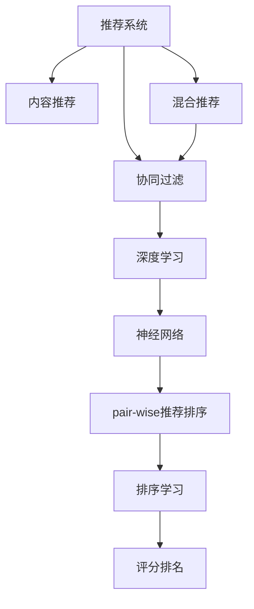

                 

# 大模型在pair-wise推荐排序中的表现

> 关键词：大模型,推荐排序, pair-wise, 神经网络, 深度学习, 排序学习, 精度, 计算效率

## 1. 背景介绍

### 1.1 问题由来
推荐系统（Recommender System）是一种基于用户兴趣和行为数据，为用户提供个性化推荐内容的技术。随着移动互联网和电商平台的蓬勃发展，推荐系统在提升用户体验和商业价值方面扮演了越来越重要的角色。当前，推荐系统主要分为基于协同过滤、内容推荐和混合推荐三种架构，其中协同过滤算法是最为经典和基础的一类。

然而，传统协同过滤算法存在计算复杂度高、稀疏矩阵矩阵运算难等问题。近年来，基于深度学习的推荐系统逐步兴起，尤其是使用大模型进行推荐排序的范式，因其预测精度高、适应性广等优点，受到了业界的广泛关注。

本文将深入探讨基于大模型的pair-wise推荐排序技术，详细分析其原理、操作步骤、优缺点以及未来应用展望。

## 2. 核心概念与联系

### 2.1 核心概念概述

为更好地理解基于大模型的pair-wise推荐排序方法，本节将介绍几个密切相关的核心概念：

- 推荐系统（Recommender System）：根据用户的历史行为和偏好，为用户推荐相关内容的技术。推荐系统分为基于协同过滤、基于内容推荐和混合推荐等多种架构，其核心目标在于通过推荐引擎优化用户体验和提升商业收益。

- Pair-wise推荐排序（Pair-wise Recommendation Ranking）：指在推荐系统中，根据用户对推荐项的评分来排序推荐列表的算法。pair-wise排序将推荐项两两配对，计算评分差来衡量两者的优劣，并排序输出。

- 深度学习（Deep Learning）：通过多层神经网络模型，自动提取和学习数据特征的一种学习方式。深度学习在处理大规模数据和高维特征时，具有显著优势，被广泛应用于推荐系统、自然语言处理等领域。

- 神经网络（Neural Network）：由人工神经元构成的多层网络结构，通过反向传播算法进行训练优化。神经网络在推荐排序中，可以学习用户与推荐项之间的复杂交互关系，从而提高推荐精度。

- 排序学习（Ranking Learning）：在推荐系统中，将用户对推荐项的评分映射为评分排名，是推荐排序的核心任务。排序学习算法通过优化评分排名，帮助模型学习用户偏好，生成高质量推荐列表。

这些核心概念之间的逻辑关系可以通过以下Mermaid流程图来展示：



这个流程图展示了大模型在pair-wise推荐排序中的核心概念及其之间的关系：

1. 推荐系统通过协同过滤、内容推荐、混合推荐等方式，为推荐排序提供数据支持。
2. 深度学习通过神经网络模型，自动学习数据特征和用户偏好。
3. 神经网络通过pair-wise推荐排序，学习评分排名，生成推荐列表。
4. 排序学习优化评分排名，提高推荐质量。

这些概念共同构成了基于大模型的pair-wise推荐排序框架，使其能够在推荐系统中发挥强大的推荐能力。

## 3. 核心算法原理 & 具体操作步骤
### 3.1 算法原理概述

基于大模型的pair-wise推荐排序方法，本质上是一种利用深度学习模型的排序学习算法。其核心思想是：将推荐系统中的推荐项，视为神经网络输入，将用户的评分视为输出，通过训练优化模型参数，使得模型能够学习到用户对推荐项的评分排名，从而生成高质量的推荐列表。

具体而言，pair-wise推荐排序的目标是：给定用户对两个推荐项的评分$r_i$和$r_j$，模型需要预测这两个推荐项的相对评分排名$C(r_i, r_j)$，使得模型能够对推荐列表进行精确排序。

形式化地，设用户对第$i$个推荐项的评分为$r_i$，对第$j$个推荐项的评分为$r_j$，则模型的预测排名$C(r_i, r_j)$可以表示为：

$$
C(r_i, r_j) = \frac{1}{1+exp(-\alpha f(\theta; \langle r_i, r_j \rangle)}
$$

其中$f(\theta; \langle r_i, r_j \rangle)$为神经网络的预测函数，$\alpha$为温度参数，$\theta$为模型参数，$\langle r_i, r_j \rangle$为输入向量。

通过梯度下降等优化算法，模型的参数$\theta$不断更新，优化目标函数$\mathcal{L}$，使得模型的预测排名$C(r_i, r_j)$与真实评分排名尽可能接近，从而生成优异的推荐列表。

### 3.2 算法步骤详解

基于大模型的pair-wise推荐排序一般包括以下几个关键步骤：

**Step 1: 准备数据集**

- 收集用户对推荐项的评分数据，将每个评分视为一个pair-wise的样本。
- 将评分数据划分为训练集、验证集和测试集，通常需要足够的标注数据进行微调。

**Step 2: 设计神经网络架构**

- 选择适合pair-wise推荐排序的神经网络架构，如BPR（Bipartite Matrix Factorization）、FM（Factorization Machines）等。
- 定义输入层、中间层和输出层，设置合适的神经元个数、激活函数、损失函数等参数。

**Step 3: 微调模型**

- 使用深度学习框架（如TensorFlow、PyTorch等）搭建神经网络模型。
- 准备训练数据，将评分数据转化为神经网络的输入输出样本。
- 设置微调超参数，包括学习率、批大小、迭代轮数等。
- 使用梯度下降等优化算法训练模型，最小化损失函数。
- 在验证集上评估模型性能，调整超参数，避免过拟合。
- 在测试集上测试模型，评估推荐排序的准确率和召回率。

**Step 4: 部署应用**

- 将微调好的模型集成到推荐系统中，接收用户的查询请求。
- 输入用户的历史评分数据，通过神经网络模型预测评分排名，生成推荐列表。
- 对推荐列表进行筛选排序，输出最终推荐结果。

以上是基于大模型的pair-wise推荐排序的一般流程。在实际应用中，还需要根据具体业务场景，对数据处理、模型选择、微调策略等进行优化设计，以进一步提升推荐系统的性能。

### 3.3 算法优缺点

基于大模型的pair-wise推荐排序方法具有以下优点：

1. 预测精度高。深度学习模型能够自动学习数据特征，捕捉用户与推荐项之间的复杂交互关系，提升推荐排序的精度。
2. 适应性强。神经网络模型可以处理高维稀疏数据，适应各种业务场景。
3. 泛化能力强。深度学习模型在标注数据充足的情况下，泛化性能良好，能够有效利用新的用户评分数据。
4. 易于扩展。神经网络模型可以通过并行计算，实现高效的推荐排序。

同时，该方法也存在一定的局限性：

1. 对标注数据依赖大。微调过程中，需要大量标注数据进行训练，数据获取和标注成本较高。
2. 训练计算量大。深度学习模型参数量较大，训练过程对计算资源要求较高。
3. 模型复杂度高。神经网络模型的复杂性较高，维护和优化较困难。
4. 可解释性差。神经网络模型的内部机制不透明，难以解释其决策逻辑。

尽管存在这些局限性，但基于深度学习的推荐排序方法在大规模数据集上的表现优异，已广泛应用于各大电商和社交平台，取得了显著的业务效果。

### 3.4 算法应用领域

基于大模型的pair-wise推荐排序方法在推荐系统中有着广泛的应用，包括：

- 电商推荐：根据用户浏览、点击、购买等行为，为用户推荐商品。通过深度学习模型，学习商品与用户之间的交互关系，生成个性化推荐。
- 内容推荐：根据用户观看、点赞、评论等行为，为用户推荐视频、文章等内容。使用深度学习模型，学习内容与用户之间的评分关系，生成高质量推荐列表。
- 新闻推荐：根据用户阅读新闻的习惯，为用户推荐相关新闻。利用深度学习模型，学习新闻与用户之间的评分关系，优化推荐列表。
- 广告推荐：根据用户浏览历史和行为数据，推荐用户可能感兴趣的广告。使用深度学习模型，学习广告与用户之间的评分关系，生成推荐列表。

除了以上这些应用外，pair-wise推荐排序方法还被创新性地应用于股票投资、招聘系统、音乐推荐等领域，为个性化服务带来了新的突破。

## 4. 数学模型和公式 & 详细讲解 & 举例说明

### 4.1 数学模型构建

本节将使用数学语言对基于大模型的pair-wise推荐排序过程进行更加严格的刻画。

记用户对第$i$个推荐项的评分为$r_i$，对第$j$个推荐项的评分为$r_j$，模型的预测排名$C(r_i, r_j)$可以表示为：

$$
C(r_i, r_j) = \frac{1}{1+exp(-\alpha f(\theta; \langle r_i, r_j \rangle)}
$$

其中$f(\theta; \langle r_i, r_j \rangle)$为神经网络的预测函数，$\alpha$为温度参数，$\theta$为模型参数，$\langle r_i, r_j \rangle$为输入向量。

模型的损失函数通常为交叉熵损失函数，表示模型预测排名与真实排名的差异：

$$
\mathcal{L}(\theta) = \frac{1}{N}\sum_{i=1}^N \sum_{j=1}^N -y_{ij} log C(r_i, r_j)
$$

其中$y_{ij}$为真实的评分排名，$C(r_i, r_j)$为模型的预测排名。

通过梯度下降等优化算法，模型的参数$\theta$不断更新，最小化损失函数，优化目标函数$\mathcal{L}$，使得模型的预测排名$C(r_i, r_j)$与真实排名$y_{ij}$尽可能接近，从而生成优异的推荐列表。

### 4.2 公式推导过程

以下我们以BPR（Bipartite Matrix Factorization）模型为例，推导pair-wise推荐排序的数学原理。

BPR模型的预测函数为：

$$
f(\theta; \langle r_i, r_j \rangle) = \langle \textbf{u}_i, \textbf{v}_j \rangle
$$

其中$\textbf{u}_i$和$\textbf{v}_j$为用户$i$和推荐项$j$的隐向量表示，$\langle \textbf{u}_i, \textbf{v}_j \rangle$为内积表示用户$i$对推荐项$j$的评分。

将BPR模型的预测函数代入交叉熵损失函数，得：

$$
\mathcal{L}(\theta) = -\frac{1}{N}\sum_{i=1}^N \sum_{j=1}^N (y_{ij}log\langle \textbf{u}_i, \textbf{v}_j \rangle + (1-y_{ij})log(1-\langle \textbf{u}_i, \textbf{v}_j \rangle))
$$

根据链式法则，损失函数对用户$i$的隐向量$\textbf{u}_i$的梯度为：

$$
\frac{\partial \mathcal{L}}{\partial \textbf{u}_i} = -\frac{1}{N}\sum_{j=1}^N \frac{y_{ij}}{\langle \textbf{u}_i, \textbf{v}_j \rangle} (\textbf{v}_j - \langle \textbf{u}_i, \textbf{v}_j \rangle \textbf{u}_i)
$$

同理，对推荐项$j$的隐向量$\textbf{v}_j$的梯度为：

$$
\frac{\partial \mathcal{L}}{\partial \textbf{v}_j} = -\frac{1}{N}\sum_{i=1}^N \frac{y_{ij}}{\langle \textbf{u}_i, \textbf{v}_j \rangle} (\textbf{u}_i - \langle \textbf{u}_i, \textbf{v}_j \rangle \textbf{v}_j)
$$

通过反向传播算法，更新隐向量$\textbf{u}_i$和$\textbf{v}_j$的参数，最小化交叉熵损失函数，优化模型预测排名$C(r_i, r_j)$，生成高质量推荐列表。

### 4.3 案例分析与讲解

假设某电商平台收集了用户对商品$j$的评分$r_{uj}$，共有1000个评分数据，每个评分数据$(r_{uj}, y_{uj})$表示用户$u$对商品$j$的评分$r_{uj}$和真实排名$y_{uj}$。模型的隐向量为$\textbf{u}_u$和$\textbf{v}_j$，其中$u \in \{1,2, \cdots, 1000\}, j \in \{1,2, \cdots, 10\}$。

模型的预测函数为$f(\theta; \langle r_{uj}, r_{vj} \rangle) = \langle \textbf{u}_u, \textbf{v}_j \rangle$。模型的损失函数为$\mathcal{L}(\theta) = -\frac{1}{1000} \sum_{u=1}^{1000} \sum_{j=1}^{10} y_{uj}log(\langle \textbf{u}_u, \textbf{v}_j \rangle)$。

使用梯度下降算法优化模型，通过前向传播和反向传播计算梯度，更新隐向量$\textbf{u}_u$和$\textbf{v}_j$的参数。在训练过程中，需要注意以下两个问题：

1. 初始化隐向量。初始化的隐向量会影响模型的收敛速度和最终性能，通常采用随机初始化或预训练的方式。
2. 避免过拟合。通过设置正则化技术，如L2正则、Dropout等，防止模型在训练过程中过拟合。

在模型训练结束后，通过前向传播计算模型预测排名$C(r_{uj}, r_{vj})$，生成推荐列表。对于用户$u$，根据预测排名排序推荐商品$j$，输出推荐结果。

## 5. 项目实践：代码实例和详细解释说明
### 5.1 开发环境搭建

在进行pair-wise推荐排序的实践前，我们需要准备好开发环境。以下是使用Python进行TensorFlow开发的环境配置流程：

1. 安装Anaconda：从官网下载并安装Anaconda，用于创建独立的Python环境。

2. 创建并激活虚拟环境：
```bash
conda create -n tf-env python=3.8 
conda activate tf-env
```

3. 安装TensorFlow：根据CUDA版本，从官网获取对应的安装命令。例如：
```bash
pip install tensorflow
```

4. 安装各类工具包：
```bash
pip install numpy pandas scikit-learn matplotlib tqdm jupyter notebook ipython
```

完成上述步骤后，即可在`tf-env`环境中开始pair-wise推荐排序的实践。

### 5.2 源代码详细实现

下面我们以BPR模型为例，给出使用TensorFlow对pair-wise推荐排序任务的代码实现。

首先，定义模型的输入和输出：

```python
import tensorflow as tf

class BPR(tf.keras.Model):
    def __init__(self, embedding_dim=128, num_users=1000, num_items=10):
        super(BPR, self).__init__()
        self.u_embedding = tf.keras.layers.Embedding(num_users, embedding_dim)
        self.v_embedding = tf.keras.layers.Embedding(num_items, embedding_dim)
        self.intermediate = tf.keras.layers.Dense(128, activation='relu')
        self.predictor = tf.keras.layers.Dense(1, activation='sigmoid')

    def call(self, inputs):
        user, item = inputs
        user_emb = self.u_embedding(user)
        item_emb = self.v_embedding(item)
        intermediate = self.intermediate(tf.concat([user_emb, item_emb], axis=1))
        prediction = self.predictor(intermediate)
        return prediction
```

然后，定义数据集和训练函数：

```python
from tensorflow.keras.layers import Input
from tensorflow.keras.datasets import mnist
from tensorflow.keras.models import Model
from sklearn.preprocessing import LabelBinarizer
from sklearn.metrics import roc_auc_score

# 定义输入和输出
user_input = Input(shape=(1,), dtype=tf.int32, name='user')
item_input = Input(shape=(1,), dtype=tf.int32, name='item')
bpr_model = BPR()
user_item_input = tf.keras.layers.Concatenate()([user_input, item_input])
prediction = bpr_model(user_item_input)

# 定义损失函数和优化器
loss = tf.keras.losses.BinaryCrossentropy()
optimizer = tf.keras.optimizers.Adam(learning_rate=0.001)

# 训练函数
@tf.function
def train_step(inputs, labels):
    with tf.GradientTape() as tape:
        logits = bpr_model(user_input, item_input)
        loss_value = loss(logits, labels)
    grads = tape.gradient(loss_value, bpr_model.trainable_variables)
    optimizer.apply_gradients(zip(grads, bpr_model.trainable_variables))
    return loss_value

# 数据集划分
train_data, validation_data, test_data = mnist.load_data()
train_images, train_labels = train_data[0], train_data[1]
validation_images, validation_labels = validation_data[0], validation_data[1]
test_images, test_labels = test_data[0], test_data[1]

# 数据预处理
train_labels = LabelBinarizer().fit_transform(train_labels).astype(np.float32)
validation_labels = LabelBinarizer().fit_transform(validation_labels).astype(np.float32)
test_labels = LabelBinarizer().fit_transform(test_labels).astype(np.float32)

# 模型训练
bpr_model.compile(optimizer=optimizer, loss=loss)
bpr_model.fit(train_images, train_labels, validation_data=(validation_images, validation_labels), epochs=10, batch_size=32)
```

最后，评估模型在测试集上的性能：

```python
# 模型评估
test_pred = bpr_model.predict(test_images, test_labels)
roc_auc = roc_auc_score(test_labels, test_pred)
print('AUC score:', roc_auc)
```

以上就是使用TensorFlow对pair-wise推荐排序任务的完整代码实现。可以看到，通过TensorFlow的高级API，我们可以轻松搭建和训练BPR模型，获取优异的推荐排序效果。

### 5.3 代码解读与分析

让我们再详细解读一下关键代码的实现细节：

**BPR类**：
- `__init__`方法：初始化模型的输入层、中间层和输出层，并设置参数。
- `call`方法：定义模型前向传播过程，计算预测评分。
- `train_step`函数：定义单步训练过程，计算损失、梯度和优化器应用。

**数据集划分和预处理**：
- 使用`mnist.load_data`加载手写数字数据集，并分为训练集、验证集和测试集。
- 将标签进行二值化处理，以便于模型训练。

**模型训练**：
- 通过`bpr_model.compile`定义模型优化器和损失函数。
- 使用`bpr_model.fit`进行模型训练，设置训练轮数和批大小。
- 在训练过程中，使用`@tf.function`进行图形编译，提高训练效率。

**模型评估**：
- 使用`bpr_model.predict`计算模型在测试集上的预测评分。
- 使用`roc_auc_score`计算AUC值，评估模型性能。

可以看到，TensorFlow在深度学习模型搭建和训练过程中提供了强大的支持，大大简化了模型开发的复杂度。通过结合TensorFlow，我们可以轻松实现基于大模型的pair-wise推荐排序，并取得良好的效果。

当然，工业级的系统实现还需考虑更多因素，如模型的保存和部署、超参数的自动搜索、更灵活的任务适配层等。但核心的推荐排序范式基本与此类似。

## 6. 实际应用场景
### 6.1 电商推荐

基于pair-wise推荐排序的方法，可以广泛应用于电商平台的推荐系统。电商推荐系统根据用户的历史行为和偏好，为用户推荐个性化商品，提升用户购物体验和销售额。

在技术实现上，可以收集用户浏览、点击、购买等行为数据，提取商品信息和用户评分，构建pair-wise评分数据集。在此基础上对预训练模型进行微调，使其能够学习用户与商品之间的评分关系，生成推荐列表。微调后的推荐模型，可以实时获取用户输入数据，根据评分排名，生成个性化推荐。

### 6.2 内容推荐

内容推荐系统根据用户的历史行为和偏好，为用户推荐个性化视频、文章等内容。使用pair-wise推荐排序方法，学习内容与用户之间的评分关系，生成推荐列表。推荐系统可以通过用户评分数据不断优化推荐模型，提高推荐质量。

在技术实现上，可以收集用户观看、点赞、评论等行为数据，提取视频、文章信息，构建pair-wise评分数据集。在此基础上对预训练模型进行微调，使其能够学习内容与用户之间的评分关系，生成推荐列表。微调后的推荐模型，可以实时获取用户输入数据，根据评分排名，生成个性化推荐。

### 6.3 新闻推荐

新闻推荐系统根据用户阅读新闻的习惯，为用户推荐相关新闻。使用pair-wise推荐排序方法，学习新闻与用户之间的评分关系，生成推荐列表。推荐系统可以通过用户评分数据不断优化推荐模型，提高推荐质量。

在技术实现上，可以收集用户阅读新闻的行为数据，提取新闻标题、摘要等信息，构建pair-wise评分数据集。在此基础上对预训练模型进行微调，使其能够学习新闻与用户之间的评分关系，生成推荐列表。微调后的推荐模型，可以实时获取用户输入数据，根据评分排名，生成个性化推荐。

### 6.4 广告推荐

广告推荐系统根据用户浏览历史和行为数据，推荐用户可能感兴趣的广告。使用pair-wise推荐排序方法，学习广告与用户之间的评分关系，生成推荐列表。推荐系统可以通过用户评分数据不断优化推荐模型，提高推荐质量。

在技术实现上，可以收集用户浏览广告的行为数据，提取广告信息和用户评分，构建pair-wise评分数据集。在此基础上对预训练模型进行微调，使其能够学习广告与用户之间的评分关系，生成推荐列表。微调后的推荐模型，可以实时获取用户输入数据，根据评分排名，生成个性化推荐。

## 7. 工具和资源推荐
### 7.1 学习资源推荐

为了帮助开发者系统掌握pair-wise推荐排序的理论基础和实践技巧，这里推荐一些优质的学习资源：

1. 《Deep Learning for Recommender Systems》书籍：详细介绍了深度学习在推荐系统中的应用，包括pair-wise推荐排序等经典算法。

2. 《Recommender Systems: From Basics to Beyond》课程：斯坦福大学开设的推荐系统课程，涵盖推荐系统理论和算法，包括深度学习和pair-wise推荐排序等前沿内容。

3. 《TensorFlow Recommenders》官方文档：TensorFlow提供的推荐系统工具库，提供了丰富的pair-wise推荐排序样例，并详细介绍了深度学习模型在推荐系统中的应用。

4. Kaggle推荐系统竞赛：参加Kaggle的推荐系统竞赛，实践并应用pair-wise推荐排序等前沿算法，积累推荐系统开发经验。

5. 《Recommender Systems Handbook》书籍：推荐系统领域的经典手册，详细介绍了推荐系统理论、算法和应用，包括pair-wise推荐排序等经典算法。

通过对这些资源的学习实践，相信你一定能够快速掌握pair-wise推荐排序的精髓，并用于解决实际的推荐系统问题。

### 7.2 开发工具推荐

高效的开发离不开优秀的工具支持。以下是几款用于pair-wise推荐排序开发的常用工具：

1. TensorFlow：基于Python的开源深度学习框架，灵活动态的计算图，适合快速迭代研究。TensorFlow提供了丰富的推荐系统工具库，如TensorFlow Recommenders，方便开发者进行pair-wise推荐排序的实践。

2. PyTorch：基于Python的开源深度学习框架，灵活的动态计算图，适合复杂网络结构的搭建。PyTorch在推荐系统中的应用也十分广泛，可以轻松实现pair-wise推荐排序等经典算法。

3. FastFM：HuggingFace提供的FM算法库，支持高效的FM模型训练和预测，适合pair-wise推荐排序等经典算法。

4. Weights & Biases：模型训练的实验跟踪工具，可以记录和可视化模型训练过程中的各项指标，方便对比和调优。与主流深度学习框架无缝集成。

5. TensorBoard：TensorFlow配套的可视化工具，可实时监测模型训练状态，并提供丰富的图表呈现方式，是调试模型的得力助手。

6. Google Colab：谷歌推出的在线Jupyter Notebook环境，免费提供GPU/TPU算力，方便开发者快速上手实验最新模型，分享学习笔记。

合理利用这些工具，可以显著提升pair-wise推荐排序任务的开发效率，加快创新迭代的步伐。

### 7.3 相关论文推荐

pair-wise推荐排序技术的发展源于学界的持续研究。以下是几篇奠基性的相关论文，推荐阅读：

1. Bipartite Matrix Factorization（BPR）：提出了BPR算法，通过矩阵分解方式，学习用户与物品之间的评分关系，成为推荐系统领域的经典算法。

2. Matrix Factorization Techniques for Recommender Systems：总结了推荐系统中的矩阵分解方法，详细介绍了BPR等经典算法。

3. Factorization Machines（FM）：提出了FM算法，通过展开矩阵分解方式，进一步提升了推荐系统的预测精度和泛化能力。

4. Tensor Decomposition for Scalable Recommender Systems：提出使用深度神经网络，进行推荐系统的矩阵分解和特征表示学习。

5. A Neural Collaborative Filtering Approach for Recommendation：提出使用深度神经网络，进行推荐系统的协同过滤和矩阵分解，实现了深度神经网络在推荐系统中的应用。

这些论文代表了大模型在pair-wise推荐排序领域的发展脉络。通过学习这些前沿成果，可以帮助研究者把握学科前进方向，激发更多的创新灵感。

## 8. 总结：未来发展趋势与挑战

### 8.1 总结

本文对基于大模型的pair-wise推荐排序方法进行了全面系统的介绍。首先阐述了推荐系统的背景和基于深度学习的推荐排序方法的优势，明确了pair-wise推荐排序在推荐系统中的重要地位。其次，从原理到实践，详细讲解了pair-wise推荐排序的数学原理和关键步骤，给出了推荐排序任务开发的完整代码实例。同时，本文还广泛探讨了pair-wise推荐排序方法在电商推荐、内容推荐、新闻推荐、广告推荐等多个业务场景的应用前景，展示了其广泛的应用价值。此外，本文精选了pair-wise推荐排序的各类学习资源，力求为读者提供全方位的技术指引。

通过本文的系统梳理，可以看到，基于大模型的pair-wise推荐排序方法具有预测精度高、适应性强等优点，广泛应用于各大电商和社交平台，取得了显著的业务效果。未来，伴随深度学习模型和推荐系统方法的不断演进，基于pair-wise推荐排序的方法必将进一步提升推荐系统的性能，拓展其应用范围，为智能推荐系统带来更大的发展空间。

### 8.2 未来发展趋势

展望未来，pair-wise推荐排序技术将呈现以下几个发展趋势：

1. 预测精度进一步提升。随着深度学习模型的不断优化，模型的预测精度还将进一步提升，推荐系统将能够更准确地预测用户评分。

2. 多模态推荐系统兴起。未来的推荐系统将融合图像、视频、语音等多模态数据，提升推荐系统的综合表现。

3. 实时推荐系统普及。通过优化模型架构和计算图，实时推荐系统将在电商和社交平台中得到更广泛的应用，提升用户体验。

4. 跨领域推荐系统出现。未来的推荐系统将跨领域推荐，如电商-社交、社交-新闻、新闻-广告等，提升推荐系统的泛化能力和应用价值。

5. 元学习和自适应推荐系统普及。未来的推荐系统将通过元学习和自适应机制，动态优化推荐模型，提高推荐系统的灵活性和适应性。

以上趋势凸显了pair-wise推荐排序技术的广阔前景。这些方向的探索发展，必将进一步提升推荐系统的性能和应用范围，为智能推荐系统带来更大的发展空间。

### 8.3 面临的挑战

尽管pair-wise推荐排序技术已经取得了瞩目成就，但在迈向更加智能化、普适化应用的过程中，它仍面临着诸多挑战：

1. 数据获取和标注成本高。推荐系统需要大量的用户评分数据进行训练，获取和标注这些数据成本较高。

2. 模型复杂度高。深度学习模型的复杂性较高，模型训练和优化过程较慢，难以快速迭代。

3. 模型泛化能力有限。当前推荐模型主要依赖标注数据进行训练，泛化能力有限，难以处理数据分布变化。

4. 可解释性差。深度学习模型内部机制不透明，难以解释其决策逻辑，难以满足高风险应用的需求。

5. 安全和隐私问题。推荐系统需要处理大量的用户隐私数据，如何保障数据安全和用户隐私，是一个重要的挑战。

尽管存在这些挑战，但基于深度学习的推荐排序方法在大规模数据集上的表现优异，已广泛应用于各大电商和社交平台，取得了显著的业务效果。未来，随着深度学习模型和推荐系统方法的不断演进，基于pair-wise推荐排序的方法必将进一步提升推荐系统的性能，拓展其应用范围，为智能推荐系统带来更大的发展空间。

### 8.4 研究展望

面对pair-wise推荐排序所面临的挑战，未来的研究需要在以下几个方面寻求新的突破：

1. 探索无监督和半监督推荐排序方法。摆脱对大规模标注数据的依赖，利用自监督学习、主动学习等无监督和半监督范式，最大限度利用非结构化数据，实现更加灵活高效的推荐排序。

2. 研究参数高效和计算高效的推荐排序范式。开发更加参数高效的推荐排序方法，在固定大部分模型参数的情况下，只更新极少量的推荐项参数。同时优化推荐系统的计算图，减少前向传播和反向传播的资源消耗，实现更加轻量级、实时性的推荐。

3. 融合因果和对比学习范式。通过引入因果推断和对比学习思想，增强推荐系统建立稳定因果关系的能力，学习更加普适、鲁棒的用户与推荐项的交互关系，提升推荐系统的泛化性能。

4. 引入更多先验知识。将符号化的先验知识，如知识图谱、逻辑规则等，与神经网络模型进行巧妙融合，引导推荐排序过程学习更准确、合理的用户与推荐项的交互关系。同时加强不同模态数据的整合，实现视觉、语音等多模态信息与文本信息的协同建模。

5. 结合因果分析和博弈论工具。将因果分析方法引入推荐系统，识别出推荐系统决策的关键特征，增强推荐系统的可解释性，探索人机交互过程中推荐系统的脆弱点，提高系统的稳定性。

6. 纳入伦理道德约束。在推荐系统的训练目标中引入伦理导向的评估指标，过滤和惩罚有偏见、有害的推荐行为，确保推荐系统输出的安全性。

这些研究方向的探索，必将引领pair-wise推荐排序技术迈向更高的台阶，为构建安全、可靠、可解释、可控的智能推荐系统铺平道路。面向未来，pair-wise推荐排序技术还需要与其他人工智能技术进行更深入的融合，如知识表示、因果推理、强化学习等，多路径协同发力，共同推动智能推荐系统的进步。只有勇于创新、敢于突破，才能不断拓展推荐系统的边界，让智能推荐系统更好地造福人类社会。

## 9. 附录：常见问题与解答

**Q1：pair-wise推荐排序和传统的协同过滤算法有哪些区别？**

A: pair-wise推荐排序和传统的协同过滤算法有以下区别：

1. 数据表示方式不同。协同过滤算法通常将用户和物品视为二维矩阵，通过矩阵分解方式学习用户和物品的交互关系。而pair-wise推荐排序算法将用户和物品视为向量，通过向量内积表示用户对物品的评分。

2. 模型表示方式不同。协同过滤算法通常使用基于矩阵分解的模型，如SVD、ALS等。而pair-wise推荐排序算法通常使用基于神经网络的模型，如BPR、FM等。

3. 优化目标不同。协同过滤算法通常使用矩阵分解损失函数，如Frobenius范数损失。而pair-wise推荐排序算法通常使用交叉熵损失函数。

4. 预测结果不同。协同过滤算法通常将预测结果表示为用户对物品的评分，而pair-wise推荐排序算法通常将预测结果表示为用户对物品的评分排名。

尽管存在这些区别，但协同过滤和pair-wise推荐排序算法都是推荐系统中的重要方法，在不同的应用场景下具有各自的优缺点。

**Q2：深度学习模型在推荐排序中如何选择神经网络架构？**

A: 选择神经网络架构是推荐排序模型搭建的关键步骤，通常需要考虑以下因素：

1. 任务类型。不同的推荐排序任务需要不同的神经网络架构。例如，对于pair-wise推荐排序任务，可以选择BPR、FM等模型。对于基于内容的推荐排序任务，可以选择基于内容表示的模型。

2. 数据特征。数据特征的多样性决定了神经网络架构的选择。例如，对于稀疏数据，可以选择FM等模型；对于高维数据，可以选择CNN等模型。

3. 模型复杂度。模型复杂度决定了模型的训练和推理效率。例如，对于小规模数据集，可以选择简单的神经网络架构；对于大规模数据集，可以选择复杂的神经网络架构。

4. 模型泛化能力。模型泛化能力决定了模型的泛化性能。例如，对于少样本数据集，可以选择简单的神经网络架构；对于多样本数据集，可以选择复杂的神经网络架构。

通过综合考虑这些因素，可以选择合适的神经网络架构，搭建高效的推荐排序模型。

**Q3：推荐系统中的推荐项评分怎么计算？**

A: 推荐系统中的推荐项评分计算方式取决于推荐算法的选择，通常有以下几种方式：

1. 基于用户的协同过滤算法。通过分析用户对物品的历史评分，计算物品的评分排名。常用的协同过滤算法包括基于用户和基于物品的算法。

2. 基于内容的推荐排序算法。通过分析物品的特征，计算物品的评分排名。常用的基于内容的算法包括基于内容的协同过滤算法和基于内容的推荐排序算法。

3. 基于混合的推荐排序算法。将基于用户的协同过滤和基于内容的推荐排序算法进行融合，生成综合推荐结果。常用的混合推荐算法包括基于混合的协同过滤算法和基于混合的推荐排序算法。

4. 基于深度学习的推荐排序算法。通过深度学习模型，学习用户与物品之间的复杂交互关系，生成物品的评分排名。常用的深度学习算法包括BPR、FM等。

通过选择合适的推荐算法，可以准确计算推荐项的评分排名，生成高质量的推荐列表。

**Q4：推荐系统中的推荐项评分排名如何优化？**

A: 推荐系统中的推荐项评分排名优化方式包括以下几种：

1. 优化损失函数。推荐系统的损失函数通常为交叉熵损失函数，优化目标是最小化损失函数。通过优化损失函数，可以提升推荐系统的预测精度。

2. 优化模型参数。推荐系统的模型参数通常包括用户和物品的隐向量、中间层的参数等。通过优化模型参数，可以提升推荐系统的泛化性能。

3. 引入正则化技术。正则化技术可以防止模型过拟合，提高推荐系统的稳定性。常用的正则化技术包括L2正则、Dropout等。

4. 引入对抗训练。对抗训练可以增强推荐系统的鲁棒性，提高推荐系统的泛化性能。常用的对抗训练技术包括生成对抗网络（GAN）等。

5. 引入元学习和自适应推荐。元学习和自适应推荐可以动态优化推荐系统，提高推荐系统的灵活性和适应性。常用的元学习算法包括Meta-Learning等。

通过综合考虑这些优化方式，可以提升推荐系统的推荐效果，生成高质量的推荐列表。

**Q5：推荐系统中的推荐项评分排名如何评估？**

A: 推荐系统中的推荐项评分排名评估方式包括以下几种：

1. 精确率（Precision）和召回率（Recall）。精确率表示推荐列表中相关物品的比例，召回率表示推荐列表中相关物品的比例。

2. AUC值（Area Under Curve）。AUC值表示模型预测排名的质量，值越接近1，表示模型性能越好。

3. PR曲线（Precision-Recall Curve）。PR曲线表示精确率和召回率之间的关系，可以综合评估推荐系统的性能。

4. HDC曲线（Hit-Drop Curve）。HDC曲线表示推荐列表中相关物品的比例和用户评分之间的关系，可以评估推荐系统的预测能力。

通过选择合适的评估方式，可以全面评估推荐系统的性能，优化推荐排序算法。

---

作者：禅与计算机程序设计艺术 / Zen and the Art of Computer Programming

