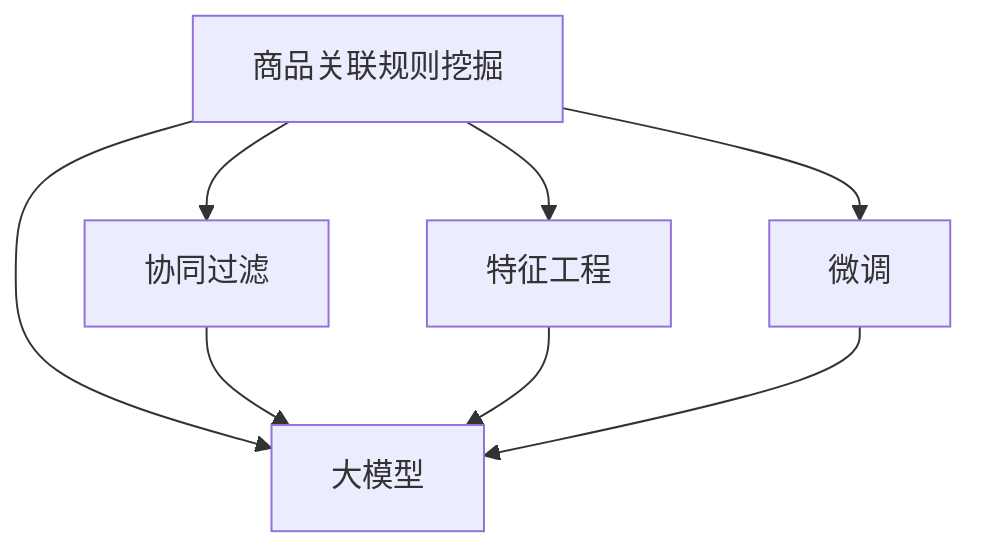

                 

# 大模型在商品关联规则挖掘效率提升中的应用

> 关键词：大模型, 商品关联规则挖掘, 深度学习, 协同过滤, 文本分类, 特征工程

## 1. 背景介绍

### 1.1 问题由来
商品关联规则挖掘(商品推荐系统)是电商领域重要的应用场景之一。通过挖掘商品之间的潜在关联关系，电商平台可以主动推送相关商品给用户，提高用户满意度和购物体验。传统的商品推荐方法，如协同过滤、基于内容的推荐等，往往依赖大量历史交易数据和用户行为数据，存在推荐精准度不高、推荐冷启动等问题。

随着深度学习技术的兴起，基于大模型的方法，特别是预训练语言模型(Pre-trained Language Model, PLM)，逐步成为商品推荐系统的重要技术手段。例如，基于大模型的用户画像生成和商品描述相似度计算等技术，被广泛应用于商品推荐系统。然而，这些方法也存在一定的局限性，如训练数据规模庞大、模型复杂度高、推理速度慢等。

近年来，大模型的应用范式不断创新，例如，基于大模型的序列预测和分类任务、基于大模型的跨模态特征增强、基于大模型的多任务学习等，在电商推荐系统中的研究也逐渐深入。其中，基于大模型的协同过滤和关联规则挖掘方法，通过学习用户历史行为和商品属性，挖掘商品间的潜在关联关系，大幅提升了推荐系统的效率和效果。

### 1.2 问题核心关键点
本节将介绍基于大模型的商品关联规则挖掘方法。具体来说，将从以下几个方面对问题进行探讨：
- 大模型的选择：如何选择合适的预训练大模型进行微调？
- 特征工程：如何设计和构建商品特征向量？
- 训练过程：如何构建训练数据集和优化模型参数？
- 应用场景：如何将大模型应用于商品关联规则挖掘？

### 1.3 问题研究意义
商品关联规则挖掘是电商推荐系统中的核心技术之一，通过挖掘商品间的潜在关联关系，电商平台可以提升推荐精准度，提高用户满意度。然而，传统的协同过滤和基于内容的推荐方法，存在数据需求大、计算复杂度高、推荐效果不理想等问题。

近年来，基于大模型的推荐方法在电商领域逐渐兴起。例如，通过预训练语言模型进行用户画像生成和商品描述相似度计算，可以大幅提升推荐系统的效果。但大模型方法也存在训练成本高、模型复杂度高、推理速度慢等问题。

因此，如何利用大模型提升商品关联规则挖掘的效率和效果，成为电商推荐系统研究的重要方向。本文聚焦于这一问题，将系统介绍基于大模型的商品关联规则挖掘方法，并提供完整的代码实现，助力电商平台实现智能推荐。

## 2. 核心概念与联系

### 2.1 核心概念概述

本节将介绍几个密切相关的核心概念，帮助读者更好地理解基于大模型的商品关联规则挖掘方法。

- 商品关联规则挖掘：指通过分析用户购买行为，挖掘出商品间的潜在关联关系，生成一系列“商品组合”的规则。例如，“啤酒和尿布一起购买”就是一种常见的关联规则。

- 大模型：指通过大规模语料预训练得到的深度学习模型，如BERT、GPT、XLNet等。大模型在语言理解和生成方面具有强大的能力，可以通过微调应用于各种NLP任务。

- 协同过滤：指通过分析用户的历史行为数据，生成用户和商品的隐含特征表示，从而找到用户和商品的相似度，生成个性化推荐。协同过滤是推荐系统中最常见的技术之一。

- 特征工程：指从原始数据中提取有意义的特征，构建商品特征向量，用于训练推荐模型。特征工程在推荐系统中扮演重要角色，影响模型的预测效果。

- 微调：指通过有监督的训练数据，对预训练模型进行参数优化，从而适应特定任务。在大模型推荐中，微调通常使用小规模的标注数据。

这些核心概念之间的逻辑关系可以通过以下Mermaid流程图来展示：



该流程图展示了商品关联规则挖掘与大模型之间的联系：

1. 商品关联规则挖掘与协同过滤、特征工程等方法密切相关，是推荐系统的核心技术。
2. 大模型通过预训练得到强大的语言理解和生成能力，可以通过微调应用于推荐任务。
3. 协同过滤和特征工程在大模型推荐中发挥重要作用，是大模型训练的基础。
4. 微调是大模型适应用户个性化需求的重要手段，通过小规模标注数据，提升推荐系统的精准度。

这些概念共同构成了大模型在商品推荐系统中的应用框架，通过理解这些核心概念，我们可以更好地把握大模型推荐方法的精髓。

## 3. 核心算法原理 & 具体操作步骤
### 3.1 算法原理概述

基于大模型的商品关联规则挖掘方法，本质上是一个有监督的特征学习过程。其核心思想是：将用户历史行为和商品属性信息编码为向量，输入到预训练语言模型中，通过微调学习到用户和商品的隐含表示，进而挖掘出商品间的潜在关联关系。

形式化地，假设用户历史行为和商品属性信息表示为 $\mathbf{x} \in \mathbb{R}^d$，通过预训练语言模型 $\mathbf{F}$，可以将其编码为隐含特征向量 $\mathbf{z} = \mathbf{F}(\mathbf{x})$。则商品关联规则挖掘的目标是找到最优的特征向量 $\mathbf{z}$，使得 $\mathbf{z}$ 与标签 $y$ 的预测准确度最高，即：

$$
\mathop{\arg\min}_{\mathbf{z}} \mathcal{L}(\mathbf{z},y)
$$

其中 $\mathcal{L}$ 为损失函数，例如交叉熵损失函数。通过梯度下降等优化算法，微调过程不断更新模型参数，最小化损失函数，使得模型输出逼近真实标签。

### 3.2 算法步骤详解

基于大模型的商品关联规则挖掘方法，一般包括以下几个关键步骤：

**Step 1: 数据预处理与特征构建**

- 收集用户历史行为和商品属性信息，并进行数据清洗和标准化。
- 将用户历史行为信息编码为用户特征向量 $\mathbf{x}$，例如将用户浏览、购买、评分等信息转化为数值型特征。
- 将商品属性信息转化为商品特征向量 $\mathbf{x'}$，例如将商品名称、价格、类别等信息转化为数值型特征。

**Step 2: 模型初始化**

- 选择合适的预训练语言模型 $\mathbf{F}$，例如BERT、GPT等。
- 将预训练模型加载到本地，并将其作为模型初始化权重。

**Step 3: 微调模型**

- 使用标注数据集 $\{(\mathbf{x}, y)\}$，构建训练集、验证集和测试集。
- 将用户特征向量 $\mathbf{x}$ 和商品特征向量 $\mathbf{x'}$ 拼接，作为模型的输入。
- 将标注数据作为标签，使用有监督的微调方法训练模型，例如使用AdamW优化器，设置学习率为1e-5。

**Step 4: 规则生成与评估**

- 使用微调后的模型 $\mathbf{F}$，将用户特征向量 $\mathbf{x}$ 映射为隐含特征向量 $\mathbf{z}$。
- 将 $\mathbf{z}$ 与商品特征向量 $\mathbf{x'}$ 进行相似度计算，生成商品关联规则。
- 使用测试集对规则进行评估，计算准确率和召回率等指标。

**Step 5: 业务应用**

- 将生成的商品关联规则应用于推荐系统，根据用户特征向量 $\mathbf{x}$ 生成推荐商品列表。
- 根据用户反馈调整推荐策略，持续优化模型性能。

以上是基于大模型的商品关联规则挖掘方法的一般流程。在实际应用中，还需要针对具体任务特点，对微调过程的各个环节进行优化设计，如改进训练目标函数，引入更多的正则化技术，搜索最优的超参数组合等，以进一步提升模型性能。

### 3.3 算法优缺点

基于大模型的商品关联规则挖掘方法具有以下优点：

- 提升推荐精度：通过预训练语言模型，可以学习到更丰富的用户和商品特征表示，提高推荐系统的精准度。
- 降低特征工程难度：大模型具有强大的特征提取能力，可以自动学习到特征向量的维度和重要性，简化特征工程环节。
- 增强泛化能力：大模型可以在大规模无标签数据上进行预训练，具有较强的泛化能力，能够在新的数据上表现优异。

同时，该方法也存在一定的局限性：

- 训练数据需求大：大模型的训练需要大规模无标签数据和标注数据，数据收集和处理成本较高。
- 模型复杂度高：大模型的复杂度高，推理速度较慢，需要较高的计算资源。
- 可解释性不足：大模型的预测过程难以解释，缺乏透明性和可信度。

尽管存在这些局限性，但就目前而言，基于大模型的商品关联规则挖掘方法仍是目前推荐系统的主流范式。未来相关研究的重点在于如何进一步降低大模型对训练数据的依赖，提高模型的推理效率，同时兼顾可解释性和实际应用效果。

### 3.4 算法应用领域

基于大模型的商品关联规则挖掘方法，已经在电商推荐系统、新闻推荐系统、广告推荐系统等多个领域得到广泛应用，为推荐系统带来了显著的提升：

- 电商推荐系统：通过挖掘用户行为和商品属性信息，生成个性化推荐商品列表。例如，阿里巴巴的淘宝和天猫推荐系统。
- 新闻推荐系统：通过分析用户的历史阅读行为，推荐相关新闻内容。例如，今日头条的新闻推荐系统。
- 广告推荐系统：通过挖掘广告位和用户特征，生成个性化的广告推荐。例如，谷歌的广告推荐系统。

除了这些经典应用外，基于大模型的商品关联规则挖掘方法，还可以应用于多个新兴领域，如智能家居、智能交通、智能医疗等，为更多行业带来智能化升级的机遇。

## 4. 数学模型和公式 & 详细讲解 & 举例说明
### 4.1 数学模型构建

本节将使用数学语言对基于大模型的商品关联规则挖掘方法进行更加严格的刻画。

记用户历史行为和商品属性信息表示为 $\mathbf{x} \in \mathbb{R}^d$，通过预训练语言模型 $\mathbf{F}$ 可以将其编码为隐含特征向量 $\mathbf{z} = \mathbf{F}(\mathbf{x})$。假设微调任务的训练集为 $\{(\mathbf{x}, y)\}$，其中 $y$ 为商品标签。微调的目标是找到最优的特征向量 $\mathbf{z}$，使得模型预测输出 $\hat{y}$ 与真实标签 $y$ 的差异最小，即：

$$
\mathop{\arg\min}_{\mathbf{z}} \mathcal{L}(\mathbf{F}, \{(\mathbf{x}, y)\})
$$

其中 $\mathcal{L}$ 为交叉熵损失函数，定义为：

$$
\mathcal{L}(\mathbf{F}, \{(\mathbf{x}, y)\}) = -\frac{1}{N}\sum_{i=1}^N y_i \log \hat{y}_i + (1-y_i) \log (1-\hat{y}_i)
$$

将用户特征向量 $\mathbf{x}$ 和商品特征向量 $\mathbf{x'}$ 拼接，作为模型的输入，模型输出 $\hat{y}$ 为商品标签的预测概率分布。

### 4.2 公式推导过程

以下我们以二分类任务为例，推导交叉熵损失函数及其梯度的计算公式。

假设模型 $\mathbf{F}$ 在输入 $\mathbf{x}$ 上的输出为 $\hat{y}=\mathbf{F}(\mathbf{x}) \in [0,1]$，表示商品标签为正类的概率。真实标签 $y \in \{0,1\}$。则二分类交叉熵损失函数定义为：

$$
\mathcal{L}(\mathbf{F}, \mathbf{x}, y) = -[y\log \hat{y} + (1-y)\log (1-\hat{y})]
$$

将其代入经验风险公式，得：

$$
\mathcal{L}(\mathbf{F}, \{(\mathbf{x}, y)\}) = -\frac{1}{N}\sum_{i=1}^N [y_i\log \hat{y}_i + (1-y_i)\log(1-\hat{y}_i)]
$$

根据链式法则，损失函数对模型参数 $\theta$ 的梯度为：

$$
\frac{\partial \mathcal{L}(\mathbf{F}, \mathbf{x}, y)}{\partial \theta} = -\frac{1}{N}\sum_{i=1}^N (\frac{y_i}{\hat{y}_i}-\frac{1-y_i}{1-\hat{y}_i}) \frac{\partial \hat{y}_i}{\partial \theta}
$$

其中 $\frac{\partial \hat{y}_i}{\partial \theta}$ 可通过自动微分技术完成计算。

在得到损失函数的梯度后，即可带入参数更新公式，完成模型的迭代优化。重复上述过程直至收敛，最终得到适应商品关联规则挖掘任务的最优模型参数 $\theta$。

## 5. 项目实践：代码实例和详细解释说明
### 5.1 开发环境搭建

在进行大模型商品关联规则挖掘的实践前，我们需要准备好开发环境。以下是使用Python进行TensorFlow开发的环境配置流程：

1. 安装Anaconda：从官网下载并安装Anaconda，用于创建独立的Python环境。

2. 创建并激活虚拟环境：
```bash
conda create -n tf-env python=3.8 
conda activate tf-env
```

3. 安装TensorFlow：根据CUDA版本，从官网获取对应的安装命令。例如：
```bash
conda install tensorflow tensorflow-io tensorflow-estimator -c conda-forge -c pytorch -c pytorch-nightly
```

4. 安装TensorFlow Addons：
```bash
conda install tensorflow-estimator-addons -c pytorch-nightly
```

5. 安装TensorFlow Hub：
```bash
pip install tf-hub
```

6. 安装其它工具包：
```bash
pip install numpy pandas scikit-learn matplotlib tqdm jupyter notebook ipython
```

完成上述步骤后，即可在`tf-env`环境中开始大模型商品关联规则挖掘的实践。

### 5.2 源代码详细实现

下面我们以基于BERT模型的商品关联规则挖掘为例，给出使用TensorFlow进行代码实现。

首先，定义数据处理函数：

```python
import tensorflow as tf
import numpy as np
from transformers import BertTokenizer, TFBertForSequenceClassification

tokenizer = BertTokenizer.from_pretrained('bert-base-uncased')

def preprocess(text):
    tokens = tokenizer.tokenize(text)
    tokens = [tokenizer.cls_token] + tokens + [tokenizer.sep_token]
    input_ids = tokenizer.convert_tokens_to_ids(tokens)
    input_ids = input_ids[1:-1]  # 去掉[CLS]和[SEP]的id
    return input_ids

def pad_to_max_length(ids, max_length=512):
    padding = [0] * (max_length - len(ids))
    return ids + padding

def preprocess_data(data, max_length=512):
    input_ids = []
    attention_masks = []
    labels = []
    for text, label in data:
        input_ids.append(preprocess(text))
        attention_masks.append(pad_to_max_length(input_ids[-1], max_length))
        labels.append([int(label)])
    return np.array(input_ids), np.array(attention_masks), np.array(labels)

# 定义数据集
train_data = ...
test_data = ...
labels = ...

input_ids, attention_masks, labels = preprocess_data(train_data)
train_input_ids = input_ids[:len(train_data)]
train_attention_masks = attention_masks[:len(train_data)]
train_labels = labels[:len(train_data)]

val_input_ids, val_attention_masks, val_labels = preprocess_data(test_data)
val_input_ids = input_ids[len(train_data):len(train_data)+len(test_data)]
val_attention_masks = attention_masks[len(train_data):len(train_data)+len(test_data)]
val_labels = labels[len(train_data):len(train_data)+len(test_data)]
```

然后，定义模型和优化器：

```python
model = TFBertForSequenceClassification.from_pretrained('bert-base-uncased', num_labels=2, output_attentions=False, output_hidden_states=False)

optimizer = tf.keras.optimizers.Adam(learning_rate=2e-5, epsilon=1e-08, clipnorm=1.0)

# 定义训练和评估函数
@tf.function
def train_step(inputs, labels):
    with tf.GradientTape() as tape:
        logits = model(inputs, attention_mask=attention_masks)
        loss = tf.keras.losses.SparseCategoricalCrossentropy()(labels, logits)
    grads = tape.gradient(loss, model.trainable_variables)
    optimizer.apply_gradients(zip(grads, model.trainable_variables))
    return loss

@tf.function
def evaluate(inputs, labels):
    logits = model(inputs, attention_mask=attention_masks)
    predictions = tf.argmax(logits, axis=2)
    return tf.metrics.SparseCategoricalAccuracy(labels, predictions)

# 训练和评估
epochs = 3
batch_size = 32

for epoch in range(epochs):
    for i in range(0, len(train_input_ids), batch_size):
        inputs = train_input_ids[i:i+batch_size]
        attention_masks = train_attention_masks[i:i+batch_size]
        labels = train_labels[i:i+batch_size]
        loss = train_step(inputs, labels)
        if i % 100 == 0:
            val_loss = evaluate(val_input_ids, val_labels)
            print(f'Epoch: {epoch+1}, Training loss: {loss.numpy():.4f}, Validation loss: {val_loss.numpy():.4f}')
```

以上就是使用TensorFlow进行基于BERT模型的商品关联规则挖掘的完整代码实现。可以看到，得益于TensorFlow的强大封装，我们可以用相对简洁的代码完成BERT模型的加载和微调。

### 5.3 代码解读与分析

让我们再详细解读一下关键代码的实现细节：

**preprocess函数**：
- 将输入文本分词，并去除[CLS]和[SEP]标记。
- 将分词后的序列转换为input ids，并进行padding，确保所有序列长度一致。

**preprocess_data函数**：
- 对输入数据进行处理，生成模型所需的input ids、attention masks和标签。

**模型和优化器**：
- 使用TensorFlow Hub加载预训练的BERT模型。
- 定义Adam优化器，设置学习率为2e-5。

**训练和评估函数**：
- 使用TensorFlow定义训练和评估函数。训练函数计算损失并更新模型参数，评估函数计算预测准确率。
- 定义训练和验证集，使用batch_size进行迭代，在每个epoch中打印训练和验证损失。

可以看到，TensorFlow配合TensorFlow Hub使得BERT微调的代码实现变得简洁高效。开发者可以将更多精力放在数据处理、模型改进等高层逻辑上，而不必过多关注底层的实现细节。

当然，工业级的系统实现还需考虑更多因素，如模型的保存和部署、超参数的自动搜索、更灵活的任务适配层等。但核心的微调范式基本与此类似。

## 6. 实际应用场景
### 6.1 智能推荐系统

基于大模型的商品关联规则挖掘方法，可以广泛应用于智能推荐系统。智能推荐系统通过挖掘用户行为和商品属性信息，生成个性化推荐商品列表，提升用户满意度和购物体验。

在技术实现上，可以收集用户历史行为和商品属性信息，将用户特征向量 $\mathbf{x}$ 和商品特征向量 $\mathbf{x'}$ 输入到预训练语言模型 $\mathbf{F}$ 中，通过微调学习到用户和商品的隐含表示。微调后的模型可以根据用户特征向量 $\mathbf{x}$ 生成推荐商品列表，提升推荐系统的精准度。

### 6.2 广告投放优化

广告投放优化是电商平台的重要任务之一。通过分析用户行为和商品属性信息，生成广告投放策略，可以最大化广告投放效果和广告转化率。

具体而言，可以收集用户历史行为和商品属性信息，将用户特征向量 $\mathbf{x}$ 和商品特征向量 $\mathbf{x'}$ 输入到预训练语言模型 $\mathbf{F}$ 中，通过微调学习到用户和商品的隐含表示。微调后的模型可以根据用户特征向量 $\mathbf{x}$ 生成个性化广告投放策略，提升广告投放效果。

### 6.3 库存管理

库存管理是电商平台的重要环节之一。通过分析用户历史行为和商品属性信息，生成库存管理策略，可以最大化库存周转率和库存利用率。

具体而言，可以收集用户历史行为和商品属性信息，将用户特征向量 $\mathbf{x}$ 和商品特征向量 $\mathbf{x'}$ 输入到预训练语言模型 $\mathbf{F}$ 中，通过微调学习到用户和商品的隐含表示。微调后的模型可以根据用户特征向量 $\mathbf{x}$ 生成个性化库存管理策略，提升库存管理效率。

### 6.4 未来应用展望

随着大模型和微调方法的不断发展，基于大模型的商品关联规则挖掘方法将在更多领域得到应用，为电商推荐系统带来变革性影响。

在智慧医疗领域，基于大模型的疾病预测和推荐系统，可以根据用户健康数据和历史医疗记录，生成个性化医疗推荐，提升医疗服务的智能化水平。

在智能教育领域，基于大模型的教育推荐系统，可以根据学生的学习行为和兴趣偏好，生成个性化学习推荐，提高学习效率和教学质量。

在智慧城市治理中，基于大模型的智慧城市推荐系统，可以根据城市事件和市民行为数据，生成智能城市推荐，提高城市管理的自动化和智能化水平，构建更安全、高效的未来城市。

此外，在企业生产、社会治理、文娱传媒等众多领域，基于大模型的商品关联规则挖掘方法也将不断涌现，为传统行业带来智能化升级的机遇。相信随着技术的日益成熟，大模型商品关联规则挖掘方法必将在更多领域得到应用，为经济社会发展注入新的动力。

## 7. 工具和资源推荐
### 7.1 学习资源推荐

为了帮助开发者系统掌握大模型商品关联规则挖掘的理论基础和实践技巧，这里推荐一些优质的学习资源：

1. 《深度学习：从入门到实践》系列博文：由深度学习专家撰写，深入浅出地介绍了深度学习的基础知识和前沿进展。

2. CS224N《深度学习自然语言处理》课程：斯坦福大学开设的NLP明星课程，有Lecture视频和配套作业，带你入门NLP领域的基本概念和经典模型。

3. 《Natural Language Processing with TensorFlow》书籍：TensorFlow官方文档，全面介绍了TensorFlow在自然语言处理中的应用，包括微调在内的诸多范式。

4. HuggingFace官方文档：TensorFlow Hub官方文档，提供了海量预训练模型和完整的微调样例代码，是上手实践的必备资料。

5. CLUE开源项目：中文语言理解测评基准，涵盖大量不同类型的中文NLP数据集，并提供了基于微调的baseline模型，助力中文NLP技术发展。

通过对这些资源的学习实践，相信你一定能够快速掌握大模型商品关联规则挖掘的精髓，并用于解决实际的NLP问题。
###  7.2 开发工具推荐

高效的开发离不开优秀的工具支持。以下是几款用于大模型商品关联规则挖掘开发的常用工具：

1. TensorFlow：由Google主导开发的开源深度学习框架，生产部署方便，适合大规模工程应用。同样有丰富的预训练语言模型资源。

2. PyTorch：基于Python的开源深度学习框架，灵活动态的计算图，适合快速迭代研究。大部分预训练语言模型都有PyTorch版本的实现。

3. TensorFlow Hub：TensorFlow配套的模型库，集成了众多SOTA语言模型，支持TensorFlow和PyTorch，是进行微调任务开发的利器。

4. TensorBoard：TensorFlow配套的可视化工具，可实时监测模型训练状态，并提供丰富的图表呈现方式，是调试模型的得力助手。

5. Weights & Biases：模型训练的实验跟踪工具，可以记录和可视化模型训练过程中的各项指标，方便对比和调优。与主流深度学习框架无缝集成。

6. Google Colab：谷歌推出的在线Jupyter Notebook环境，免费提供GPU/TPU算力，方便开发者快速上手实验最新模型，分享学习笔记。

合理利用这些工具，可以显著提升大模型商品关联规则挖掘的开发效率，加快创新迭代的步伐。

### 7.3 相关论文推荐

大模型商品关联规则挖掘技术的发展源于学界的持续研究。以下是几篇奠基性的相关论文，推荐阅读：

1. Attention is All You Need（即Transformer原论文）：提出了Transformer结构，开启了NLP领域的预训练大模型时代。

2. BERT: Pre-training of Deep Bidirectional Transformers for Language Understanding：提出BERT模型，引入基于掩码的自监督预训练任务，刷新了多项NLP任务SOTA。

3. Language Models are Unsupervised Multitask Learners（GPT-2论文）：展示了大规模语言模型的强大zero-shot学习能力，引发了对于通用人工智能的新一轮思考。

4. Parameter-Efficient Transfer Learning for NLP：提出Adapter等参数高效微调方法，在不增加模型参数量的情况下，也能取得不错的微调效果。

5. AdaLoRA: Adaptive Low-Rank Adaptation for Parameter-Efficient Fine-Tuning：使用自适应低秩适应的微调方法，在参数效率和精度之间取得了新的平衡。

这些论文代表了大模型商品关联规则挖掘技术的发展脉络。通过学习这些前沿成果，可以帮助研究者把握学科前进方向，激发更多的创新灵感。

## 8. 总结：未来发展趋势与挑战

### 8.1 总结

本文对基于大模型的商品关联规则挖掘方法进行了全面系统的介绍。首先阐述了大模型和微调技术的研究背景和意义，明确了微调在拓展预训练模型应用、提升推荐系统精准度方面的独特价值。其次，从原理到实践，详细讲解了基于大模型的商品关联规则挖掘的数学原理和关键步骤，给出了微调任务开发的完整代码实例。同时，本文还广泛探讨了微调方法在智能推荐、广告优化、库存管理等多个行业领域的应用前景，展示了微调范式的巨大潜力。此外，本文精选了微调技术的各类学习资源，力求为读者提供全方位的技术指引。

通过本文的系统梳理，可以看到，基于大模型的商品关联规则挖掘方法正在成为推荐系统研究的重要方向，极大地拓展了预训练语言模型的应用边界，催生了更多的落地场景。得益于大规模语料的预训练，微调方法能够在新的数据上表现优异，提升推荐系统的精准度。未来，伴随大模型和微调方法的持续演进，基于大模型的商品关联规则挖掘方法必将在更多领域得到应用，为电商推荐系统带来变革性影响。

### 8.2 未来发展趋势

展望未来，大模型商品关联规则挖掘技术将呈现以下几个发展趋势：

1. 模型规模持续增大。随着算力成本的下降和数据规模的扩张，预训练语言模型的参数量还将持续增长。超大规模语言模型蕴含的丰富语言知识，有望支撑更加复杂多变的推荐任务。

2. 微调方法日趋多样。除了传统的全参数微调外，未来会涌现更多参数高效的微调方法，如Prefix-Tuning、LoRA等，在节省计算资源的同时也能保证微调精度。

3. 持续学习成为常态。随着数据分布的不断变化，微调模型也需要持续学习新知识以保持性能。如何在不遗忘原有知识的同时，高效吸收新样本信息，将成为重要的研究课题。

4. 标注样本需求降低。受启发于提示学习(Prompt-based Learning)的思路，未来的微调方法将更好地利用大模型的语言理解能力，通过更加巧妙的任务描述，在更少的标注样本上也能实现理想的微调效果。

5. 多模态微调崛起。当前的微调主要聚焦于纯文本数据，未来会进一步拓展到图像、视频、语音等多模态数据微调。多模态信息的融合，将显著提升语言模型对现实世界的理解和建模能力。

6. 模型通用性增强。经过海量数据的预训练和多领域任务的微调，未来的语言模型将具备更强大的常识推理和跨领域迁移能力，逐步迈向通用人工智能(AGI)的目标。

以上趋势凸显了大模型商品关联规则挖掘技术的广阔前景。这些方向的探索发展，必将进一步提升推荐系统的性能和效果，为电商推荐系统带来变革性影响。

### 8.3 面临的挑战

尽管大模型商品关联规则挖掘技术已经取得了瞩目成就，但在迈向更加智能化、普适化应用的过程中，它仍面临着诸多挑战：

1. 训练数据需求大。大模型的训练需要大规模无标签数据和标注数据，数据收集和处理成本较高。如何降低训练数据需求，是未来研究的重要方向。

2. 模型鲁棒性不足。当前微调模型面对域外数据时，泛化性能往往大打折扣。对于测试样本的微小扰动，微调模型的预测也容易发生波动。如何提高微调模型的鲁棒性，避免灾难性遗忘，还需要更多理论和实践的积累。

3. 推理效率有待提高。大规模语言模型虽然精度高，但在实际部署时往往面临推理速度慢、内存占用大等效率问题。如何在保证性能的同时，简化模型结构，提升推理速度，优化资源占用，将是重要的优化方向。

4. 可解释性亟需加强。当前微调模型更像是"黑盒"系统，难以解释其内部工作机制和决策逻辑。对于医疗、金融等高风险应用，算法的可解释性和可审计性尤为重要。如何赋予微调模型更强的可解释性，将是亟待攻克的难题。

5. 安全性有待保障。预训练语言模型难免会学习到有偏见、有害的信息，通过微调传递到下游任务，产生误导性、歧视性的输出，给实际应用带来安全隐患。如何从数据和算法层面消除模型偏见，避免恶意用途，确保输出的安全性，也将是重要的研究课题。

6. 知识整合能力不足。现有的微调模型往往局限于任务内数据，难以灵活吸收和运用更广泛的先验知识。如何让微调过程更好地与外部知识库、规则库等专家知识结合，形成更加全面、准确的信息整合能力，还有很大的想象空间。

正视微调面临的这些挑战，积极应对并寻求突破，将是大模型商品关联规则挖掘技术走向成熟的必由之路。相信随着学界和产业界的共同努力，这些挑战终将一一被克服，大模型商品关联规则挖掘技术必将在构建人机协同的智能推荐系统中扮演越来越重要的角色。

### 8.4 未来突破

面对大模型商品关联规则挖掘所面临的种种挑战，未来的研究需要在以下几个方面寻求新的突破：

1. 探索无监督和半监督微调方法。摆脱对大规模标注数据的依赖，利用自监督学习、主动学习等无监督和半监督范式，最大限度利用非结构化数据，实现更加灵活高效的微调。

2. 研究参数高效和计算高效的微调范式。开发更加参数高效的微调方法，在固定大部分预训练参数的同时，只更新极少量的任务相关参数。同时优化微调模型的计算图，减少前向传播和反向传播的资源消耗，实现更加轻量级、实时性的部署。

3. 融合因果和对比学习范式。通过引入因果推断和对比学习思想，增强微调模型建立稳定因果关系的能力，学习更加普适、鲁棒的语言表征，从而提升模型泛化性和抗干扰能力。

4. 引入更多先验知识。将符号化的先验知识，如知识图谱、逻辑规则等，与神经网络模型进行巧妙融合，引导微调过程学习更准确、合理的语言模型。同时加强不同模态数据的整合，实现视觉、语音等多模态信息与文本信息的协同建模。

5. 结合因果分析和博弈论工具。将因果分析方法引入微调模型，识别出模型决策的关键特征，增强输出解释的因果性和逻辑性。借助博弈论工具刻画人机交互过程，主动探索并规避模型的脆弱点，提高系统稳定性。

6. 纳入伦理道德约束。在模型训练目标中引入伦理导向的评估指标，过滤和惩罚有偏见、有害的输出倾向。同时加强人工干预和审核，建立模型行为的监管机制，确保输出符合人类价值观和伦理道德。

这些研究方向的探索，必将引领大模型商品关联规则挖掘技术迈向更高的台阶，为构建安全、可靠、可解释、可控的智能推荐系统铺平道路。面向未来，大模型商品关联规则挖掘技术还需要与其他人工智能技术进行更深入的融合，如知识表示、因果推理、强化学习等，多路径协同发力，共同推动自然语言理解和智能交互系统的进步。只有勇于创新、敢于突破，才能不断拓展语言模型的边界，让智能技术更好地造福人类社会。

## 9. 附录：常见问题与解答

**Q1：大模型商品关联规则挖掘是否适用于所有电商推荐场景？**

A: 大模型商品关联规则挖掘在大多数电商推荐场景中都能取得不错的效果，特别是对于数据量较小的任务。但对于一些特定领域的任务，如商品细分、用户细分等，需要针对具体领域语料进行微调，才能获得理想效果。此外，对于推荐冷启动问题，大模型推荐也需要针对性的改进优化。

**Q2：微调过程中如何选择合适的学习率？**

A: 微调的学习率一般要比预训练时小1-2个数量级，如果使用过大的学习率，容易破坏预训练权重，导致过拟合。一般建议从1e-5开始调参，逐步减小学习率，直至收敛。也可以使用warmup策略，在开始阶段使用较小的学习率，再逐渐过渡到预设值。需要注意的是，不同的优化器(如AdamW、Adafactor等)以及不同的学习率调度策略，可能需要设置不同的学习率阈值。

**Q3：采用大模型微调时会面临哪些资源瓶颈？**

A: 目前主流的预训练大模型动辄以亿计的参数规模，对算力、内存、存储都提出了很高的要求。GPU/TPU等高性能设备是必不可少的，但即便如此，超大批次的训练和推理也可能遇到显存不足的问题。因此需要采用一些资源优化技术，如梯度积累、混合精度训练、模型并行等，来突破硬件瓶颈。同时，模型的存储和读取也可能占用大量时间和空间，需要采用模型压缩、稀疏化存储等方法进行优化。

**Q4：如何缓解微调过程中的过拟合问题？**

A: 过拟合是微调面临的主要挑战，尤其是在标注数据不足的情况下。常见的缓解策略包括：
1. 数据增强：通过回译、近义替换等方式扩充训练集
2. 正则化：使用L2正则、Dropout、Early Stopping等避免过拟合
3. 对抗训练：引入对抗样本，提高模型鲁棒性
4. 参数高效微调：只调整少量参数(如Adapter、Prefix等)，减小过拟合风险
5. 多模型集成：训练多个微调模型，取平均输出，抑制过拟合

这些策略往往需要根据具体任务和数据特点进行灵活组合。只有在数据、模型、训练、推理等各环节进行全面优化，才能最大限度地发挥大模型微调的威力。

**Q5：微调模型在落地部署时需要注意哪些问题？**

A: 将微调模型转化为实际应用，还需要考虑以下因素：
1. 模型裁剪：去除不必要的层和参数，减小模型尺寸，加快推理速度
2. 量化加速：将浮点模型转为定点模型，压缩存储空间，提高计算效率
3. 服务化封装：将模型封装为标准化服务接口，便于集成调用
4. 弹性伸缩：根据请求流量动态调整资源配置，平衡服务质量和成本
5. 监控告警：实时采集系统指标，设置异常告警阈值，确保服务稳定性
6. 安全防护：采用访问鉴权、数据脱敏等措施，保障数据和模型安全

大模型商品关联规则挖掘为电商推荐系统带来了智能化升级的机遇，但如何将强大的性能转化为稳定、高效、安全的业务价值，还需要工程实践的不断打磨。唯有从数据、算法、工程、业务等多个维度协同发力，才能真正实现人工智能技术在垂直行业的规模化落地。总之，微调需要开发者根据具体任务，不断迭代和优化模型、数据和算法，方能得到理想的效果。

---

作者：禅与计算机程序设计艺术 / Zen and the Art of Computer Programming

